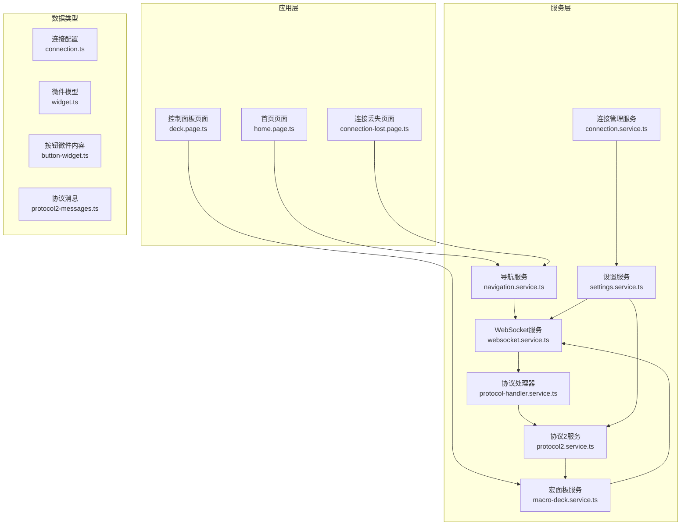
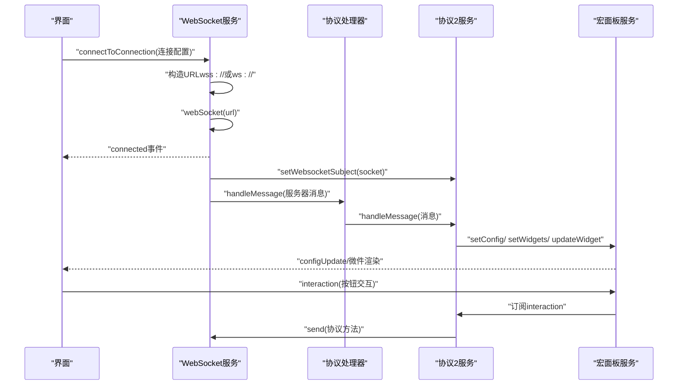
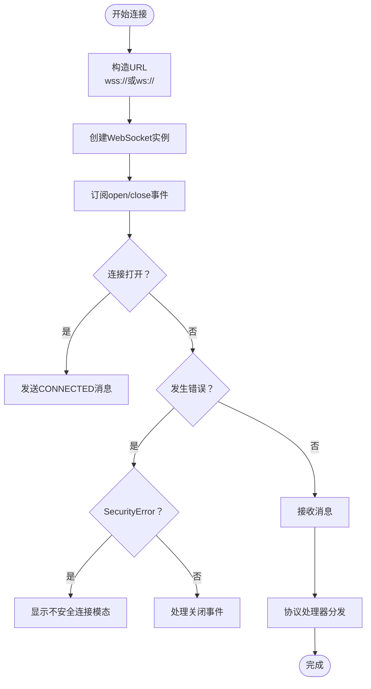
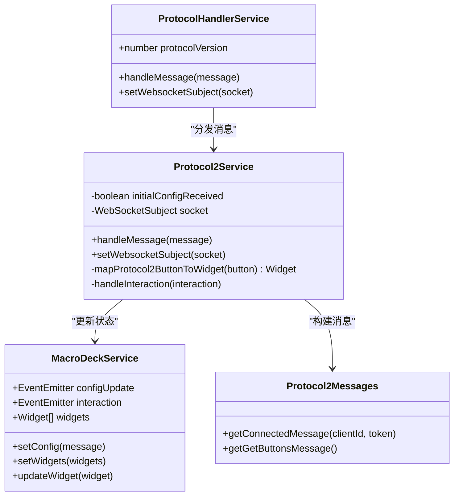
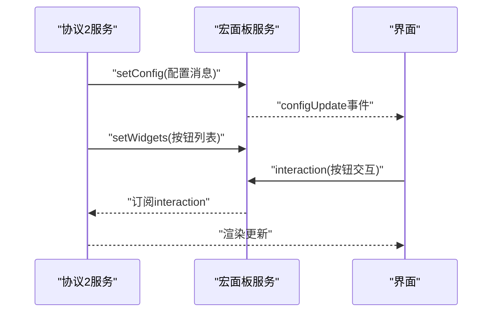
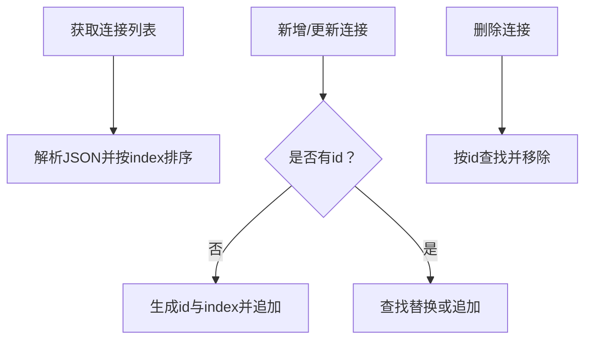
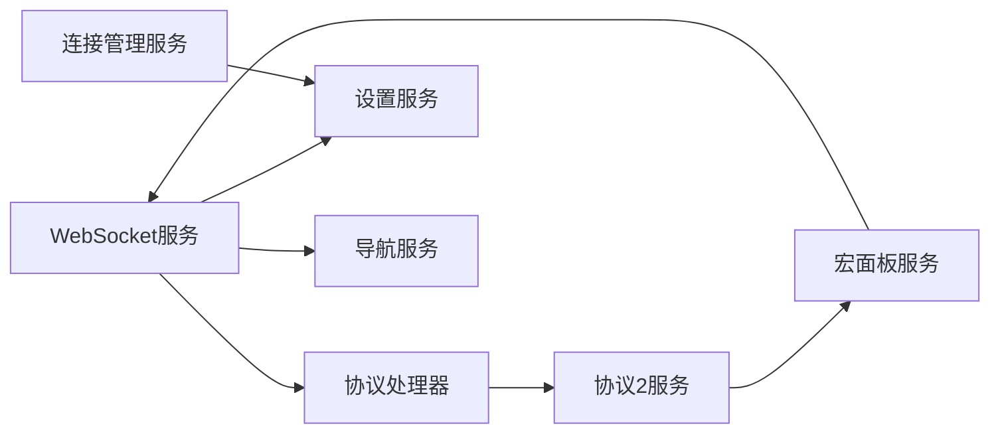

# API参考手册

<cite>
**本文档引用的文件**
- [src/app/services/websocket/websocket.service.ts](file://src/app/services/websocket/websocket.service.ts)
- [src/app/services/protocol/protocol-handler.service.ts](file://src/app/services/protocol/protocol-handler.service.ts)
- [src/app/services/protocol/protocol2.service.ts](file://src/app/services/protocol/protocol2.service.ts)
- [src/app/datatypes/protocol2/protocol2-messages.ts](file://src/app/datatypes/protocol2/protocol2-messages.ts)
- [src/app/services/macro-deck/macro-deck.service.ts](file://src/app/services/macro-deck/macro-deck.service.ts)
- [src/app/services/connection/connection.service.ts](file://src/app/services/connection/connection.service.ts)
- [src/app/services/settings/settings.service.ts](file://src/app/services/settings/settings.service.ts)
- [src/app/services/navigation/navigation.service.ts](file://src/app/services/navigation/navigation.service.ts)
- [src/app/datatypes/connection.ts](file://src/app/datatypes/connection.ts)
- [src/app/datatypes/ws-message.ts](file://src/app/datatypes/ws-message.ts)
- [src/app/datatypes/widgets/widget.ts](file://src/app/datatypes/widgets/widget.ts)
- [src/app/datatypes/widgets/button-widget.ts](file://src/app/datatypes/widgets/button-widget.ts)
- [src/app/enums/navigation-destination.ts](file://src/app/enums/navigation-destination.ts)
- [src/app/enums/widget-interaction-type.ts](file://src/app/enums/widget-interaction-type.ts)
- [package.json](file://package.json)
- [README.md](file://README.md)
</cite>

## 目录
1. [简介](#简介)
2. [项目结构](#项目结构)
3. [核心组件](#核心组件)
4. [架构总览](#架构总览)
5. [详细组件分析](#详细组件分析)
6. [依赖关系分析](#依赖关系分析)
7. [性能考虑](#性能考虑)
8. [故障排除指南](#故障排除指南)
9. [结论](#结论)
10. [附录](#附录)

## 简介
本API参考手册面向开发者，系统性地文档化Macro-Deck-Client-App的公共接口，涵盖：
- WebSocket API：连接建立、消息收发、事件监听与错误处理
- 协议处理API：消息格式、协议版本切换、数据转换与映射
- 服务API：连接管理、设置、导航、宏面板状态等
- 版本兼容性与迁移建议

本项目基于Angular与Ionic框架，支持Android、iOS与Web平台。

**章节来源**
- [README.md:1-25](file://README.md#L1-L25)
- [package.json:1-92](file://package.json#L1-L92)

## 项目结构
项目采用Angular/Ionic模块化组织，核心目录与职责概览：
- src/app/services：业务服务层（连接、协议、导航、设置、宏面板等）
- src/app/datatypes：数据模型与消息格式
- src/app/enums：枚举类型
- src/app/pages：页面组件（Home、Deck、ConnectionLost等）
- android/、ios/：原生平台构建配置
- resources/：平台资源与网络配置

**图表来源**
- [src/app/services/websocket/websocket.service.ts:1-402](file://src/app/services/websocket/websocket.service.ts#L1-L402)
- [src/app/services/protocol/protocol-handler.service.ts:1-65](file://src/app/services/protocol/protocol-handler.service.ts#L1-L65)
- [src/app/services/protocol/protocol2.service.ts:1-296](file://src/app/services/protocol/protocol2.service.ts#L1-L296)
- [src/app/services/macro-deck/macro-deck.service.ts:1-111](file://src/app/services/macro-deck/macro-deck.service.ts#L1-L111)
- [src/app/services/connection/connection.service.ts:1-179](file://src/app/services/connection/connection.service.ts#L1-L179)
- [src/app/services/settings/settings.service.ts:1-389](file://src/app/services/settings/settings.service.ts#L1-L389)
- [src/app/services/navigation/navigation.service.ts:1-86](file://src/app/services/navigation/navigation.service.ts#L1-L86)
- [src/app/datatypes/connection.ts:1-33](file://src/app/datatypes/connection.ts#L1-L33)
- [src/app/datatypes/widgets/widget.ts:1-33](file://src/app/datatypes/widgets/widget.ts#L1-L33)
- [src/app/datatypes/widgets/button-widget.ts:1-16](file://src/app/datatypes/widgets/button-widget.ts#L1-L16)
- [src/app/datatypes/protocol2/protocol2-messages.ts:1-57](file://src/app/datatypes/protocol2/protocol2-messages.ts#L1-L57)

**章节来源**
- [README.md:1-25](file://README.md#L1-L25)
- [package.json:1-92](file://package.json#L1-L92)

## 核心组件
本节概述各服务的公共接口与职责边界，便于快速定位API。

- WebSocket服务（WebsocketService）
  - 连接管理：connectToConnection、connectToString、close
  - 消息收发：send
  - 事件：connected、closed、connectionLost、connectionFailed
  - 内部状态：isConnected、connecting、closing
- 协议处理器（ProtocolHandlerService）
  - 协议版本：protocolVersion（默认2）
  - 接口：handleMessage、setWebsocketSubject
- 协议2服务（Protocol2Service）
  - 消息处理：handleMessage（GET_CONFIG、GET_BUTTONS、UPDATE_BUTTON、UPDATE_LABEL）
  - 交互转发：订阅MacroDeckService.interaction并映射为协议方法
  - 数据映射：mapProtocol2ButtonToWidget
- 宏面板服务（MacroDeckService）
  - 配置：setConfig
  - 微件：setWidgets、updateWidget
  - 事件：configUpdate、interaction
- 连接管理服务（ConnectionService）
  - USB连接：getUsbConnection
  - CRUD：getConnections、addUpdateConnection、deleteConnection、saveConnections
- 设置服务（SettingsService）
  - 客户端ID：getClientId、generateClientId
  - 连接统计：increaseConnectionCount、getConnectionCount
  - 其他设置：USB相关、外观、屏幕方向、唤醒锁、长按延迟等
- 导航服务（NavigationService）
  - navigateTo：Home、Deck、ConnectionLost
- 数据类型
  - Connection：连接配置
  - Widget/ButtonWidget：微件模型
  - WsMessage：WebSocket消息封装
  - 枚举：NavigationDestination、WidgetInteractionType

**章节来源**
- [src/app/services/websocket/websocket.service.ts:16-230](file://src/app/services/websocket/websocket.service.ts#L16-L230)
- [src/app/services/protocol/protocol-handler.service.ts:5-65](file://src/app/services/protocol/protocol-handler.service.ts#L5-L65)
- [src/app/services/protocol/protocol2.service.ts:15-161](file://src/app/services/protocol/protocol2.service.ts#L15-L161)
- [src/app/services/macro-deck/macro-deck.service.ts:6-111](file://src/app/services/macro-deck/macro-deck.service.ts#L6-L111)
- [src/app/services/connection/connection.service.ts:6-179](file://src/app/services/connection/connection.service.ts#L6-L179)
- [src/app/services/settings/settings.service.ts:22-389](file://src/app/services/settings/settings.service.ts#L22-L389)
- [src/app/services/navigation/navigation.service.ts:9-86](file://src/app/services/navigation/navigation.service.ts#L9-L86)
- [src/app/datatypes/connection.ts:1-33](file://src/app/datatypes/connection.ts#L1-L33)
- [src/app/datatypes/widgets/widget.ts:1-33](file://src/app/datatypes/widgets/widget.ts#L1-L33)
- [src/app/datatypes/widgets/button-widget.ts:1-16](file://src/app/datatypes/widgets/button-widget.ts#L1-L16)
- [src/app/datatypes/ws-message.ts:1-12](file://src/app/datatypes/ws-message.ts#L1-L12)
- [src/app/enums/navigation-destination.ts:1-15](file://src/app/enums/navigation-destination.ts#L1-L15)
- [src/app/enums/widget-interaction-type.ts:1-18](file://src/app/enums/widget-interaction-type.ts#L1-L18)

## 架构总览
下图展示WebSocket连接、协议处理与宏面板服务之间的交互流程。

**图表来源**
- [src/app/services/websocket/websocket.service.ts:101-172](file://src/app/services/websocket/websocket.service.ts#L101-L172)
- [src/app/services/protocol/protocol-handler.service.ts:22-36](file://src/app/services/protocol/protocol-handler.service.ts#L22-L36)
- [src/app/services/protocol/protocol2.service.ts:41-95](file://src/app/services/protocol/protocol2.service.ts#L41-L95)
- [src/app/services/macro-deck/macro-deck.service.ts:13-65](file://src/app/services/macro-deck/macro-deck.service.ts#L13-L65)

## 详细组件分析

### WebSocket API
- 连接建立
  - connectToConnection(connection: Connection)：根据Connection.ssl构造wss://或ws://，显示加载提示，调用内部connect()
  - connectToString(connectionString: string)：直接使用传入的连接字符串
  - 内部connect()：创建webSocket实例，订阅open/close事件，注册消息处理与错误处理
- 消息收发
  - send(payload: any)：通过WebSocketSubject.next发送消息
- 事件监听
  - connected、closed：连接生命周期事件
  - connectionLost、connectionFailed：连接异常事件
- 错误处理
  - DOMException（如SecurityError）：弹出“不安全连接”模态
  - 非正常关闭码：区分Web版与原生版，分别触发connectionLost或导航至ConnectionLost页面
- 状态管理
  - isConnected、connecting、closing：连接状态标志位

**图表来源**
- [src/app/services/websocket/websocket.service.ts:63-134](file://src/app/services/websocket/websocket.service.ts#L63-L134)
- [src/app/services/websocket/websocket.service.ts:197-229](file://src/app/services/websocket/websocket.service.ts#L197-L229)

**章节来源**
- [src/app/services/websocket/websocket.service.ts:16-230](file://src/app/services/websocket/websocket.service.ts#L16-L230)

### 协议处理API
- 协议版本
  - protocolVersion：当前协议版本（默认2），由ProtocolHandlerService统一调度
- 消息格式
  - CONNECTED：客户端连接确认，包含Method、Client-Id、API、Device-Type，可选Token
  - GET_BUTTONS：请求按钮列表
- 数据转换
  - Protocol2Service.handleMessage：根据Method分发处理
    - GET_CONFIG：更新面板配置，首次收到后导航至Deck并请求按钮列表
    - GET_BUTTONS：映射协议按钮为内部Widget并设置
    - UPDATE_BUTTON：更新单个按钮完整数据
    - UPDATE_LABEL：更新按钮标签Base64
  - mapProtocol2ButtonToWidget：将Protocol2Button映射为Widget
- 交互映射
  - MacroDeckService.interaction -> 协议方法：ButtonPress、ButtonShortPressRelease、ButtonLongPress、ButtonLongPressRelease

**图表来源**
- [src/app/services/protocol/protocol-handler.service.ts:9-37](file://src/app/services/protocol/protocol-handler.service.ts#L9-L37)
- [src/app/services/protocol/protocol2.service.ts:19-161](file://src/app/services/protocol/protocol2.service.ts#L19-L161)
- [src/app/services/macro-deck/macro-deck.service.ts:10-65](file://src/app/services/macro-deck/macro-deck.service.ts#L10-L65)
- [src/app/datatypes/protocol2/protocol2-messages.ts:1-57](file://src/app/datatypes/protocol2/protocol2-messages.ts#L1-L57)

**章节来源**
- [src/app/services/protocol/protocol-handler.service.ts:5-65](file://src/app/services/protocol/protocol-handler.service.ts#L5-L65)
- [src/app/services/protocol/protocol2.service.ts:36-161](file://src/app/services/protocol/protocol2.service.ts#L36-L161)
- [src/app/datatypes/protocol2/protocol2-messages.ts:1-57](file://src/app/datatypes/protocol2/protocol2-messages.ts#L1-L57)

### 宏面板与微件API
- 配置管理
  - setConfig(message)：更新面板Rows、Columns、ButtonSpacing、ButtonRadius、ButtonBackground，并发出configUpdate事件
- 微件管理
  - setWidgets(widgets)：设置完整微件列表
  - updateWidget(widget)：按行列坐标更新或追加微件
- 交互事件
  - interaction事件：订阅来自UI的按钮交互，转发至协议层

**图表来源**
- [src/app/services/macro-deck/macro-deck.service.ts:32-65](file://src/app/services/macro-deck/macro-deck.service.ts#L32-L65)
- [src/app/services/protocol/protocol2.service.ts:193-247](file://src/app/services/protocol/protocol2.service.ts#L193-L247)

**章节来源**
- [src/app/services/macro-deck/macro-deck.service.ts:6-111](file://src/app/services/macro-deck/macro-deck.service.ts#L6-L111)
- [src/app/datatypes/widgets/widget.ts:1-33](file://src/app/datatypes/widgets/widget.ts#L1-L33)
- [src/app/datatypes/widgets/button-widget.ts:1-16](file://src/app/datatypes/widgets/button-widget.ts#L1-L16)

### 连接管理与设置API
- 连接管理
  - getUsbConnection()：生成USB连接配置（host=127.0.0.1，动态port/ssl）
  - getConnections()/saveConnections()/addUpdateConnection()/deleteConnection()
- 设置
  - getClientId()：获取或生成客户端ID
  - increaseConnectionCount()/getConnectionCount()：连接次数统计
  - USB相关：setUsbPort/setUsbUseSsl/setUsbAutoConnect/getUsbPort/getUsbUseSsl/getUsbAutoConnect
  - 外观/屏幕方向/唤醒锁/长按延迟等

**图表来源**
- [src/app/services/connection/connection.service.ts:36-101](file://src/app/services/connection/connection.service.ts#L36-L101)
- [src/app/services/settings/settings.service.ts:208-246](file://src/app/services/settings/settings.service.ts#L208-L246)

**章节来源**
- [src/app/services/connection/connection.service.ts:6-179](file://src/app/services/connection/connection.service.ts#L6-L179)
- [src/app/services/settings/settings.service.ts:22-389](file://src/app/services/settings/settings.service.ts#L22-L389)
- [src/app/datatypes/connection.ts:1-33](file://src/app/datatypes/connection.ts#L1-L33)

### 导航API
- navigateTo(destination: NavigationDestination)
  - Home：首页（Web版为WebHomePage，原生版为HomePage）
  - Deck：控制面板
  - ConnectionLost：连接丢失页面

**章节来源**
- [src/app/services/navigation/navigation.service.ts:9-86](file://src/app/services/navigation/navigation.service.ts#L9-L86)
- [src/app/enums/navigation-destination.ts:1-15](file://src/app/enums/navigation-destination.ts#L1-L15)

## 依赖关系分析
- 组件耦合
  - WebsocketService依赖ProtocolHandlerService与SettingsService、NavigationService
  - ProtocolHandlerService依赖Protocol2Service
  - Protocol2Service依赖MacroDeckService与SettingsService、NavigationService
  - MacroDeckService通过interaction事件与UI交互
- 外部依赖
  - Angular、Ionic、RxJS、@ionic/storage、@capacitor/*（平台能力）

**图表来源**
- [src/app/services/websocket/websocket.service.ts:51-57](file://src/app/services/websocket/websocket.service.ts#L51-L57)
- [src/app/services/protocol/protocol-handler.service.ts:14](file://src/app/services/protocol/protocol-handler.service.ts#L14)
- [src/app/services/protocol/protocol2.service.ts:27-29](file://src/app/services/protocol/protocol2.service.ts#L27-L29)
- [src/app/services/connection/connection.service.ts:15-16](file://src/app/services/connection/connection.service.ts#L15-L16)
- [src/app/services/settings/settings.service.ts:29](file://src/app/services/settings/settings.service.ts#L29)

**章节来源**
- [package.json:16-58](file://package.json#L16-L58)

## 性能考虑
- 连接管理
  - 避免重复连接：connecting/isConnected状态位防止并发连接
  - 取消加载：连接取消时主动关闭连接并释放订阅
- 消息处理
  - 初始配置前忽略按钮更新，减少无效渲染
  - 按需请求按钮列表（GET_BUTTONS），避免一次性传输大量数据
- 渲染优化
  - updateWidget按坐标查找替换，避免全量刷新
- 平台差异
  - Web版与原生版在连接丢失处理路径不同，减少不必要的页面跳转

[本节为通用指导，不直接分析具体文件]

## 故障排除指南
- 连接失败
  - 观察connectionFailed事件携带的关闭码与原因；检查主机、端口、SSL配置
- 不安全连接
  - 当出现SecurityError时，会弹出“不安全连接”模态；可在设置中调整SSL策略
- 连接丢失
  - 非主动关闭且非正常关闭码时，Web版触发connectionLost，原生版导航至ConnectionLost页面
- 按钮无响应
  - 确认已收到GET_CONFIG并请求GET_BUTTONS；检查UPDATE_BUTTON/UPDATE_LABEL是否正确下发

**章节来源**
- [src/app/services/websocket/websocket.service.ts:197-229](file://src/app/services/websocket/websocket.service.ts#L197-L229)
- [src/app/services/websocket/websocket.service.ts:374-393](file://src/app/services/websocket/websocket.service.ts#L374-L393)

## 结论
本手册梳理了Macro-Deck-Client-App的WebSocket通信、协议处理与服务API，明确了消息格式、版本策略、事件机制与错误处理路径。开发者可据此快速集成与扩展功能，同时遵循现有数据模型与交互约定，确保跨平台一致性。

[本节为总结性内容，不直接分析具体文件]

## 附录

### WebSocket API参考
- connectToConnection(connection: Connection)
  - 功能：建立连接
  - 参数：Connection
  - 返回：Promise<void>
  - 异常：DOMException（SecurityError）、网络错误
- connectToString(connectionString: string)
  - 功能：通过连接字符串建立连接
  - 参数：string
  - 返回：Promise<void>
- send(payload: any)
  - 功能：发送消息
  - 参数：任意有效负载
  - 返回：void
- close()
  - 功能：主动关闭连接
  - 返回：void
- 事件
  - connected、closed、connectionLost、connectionFailed

**章节来源**
- [src/app/services/websocket/websocket.service.ts:63-191](file://src/app/services/websocket/websocket.service.ts#L63-L191)

### 协议处理API参考
- ProtocolHandlerService
  - protocolVersion: number
  - handleMessage(message: any): Promise<void>
  - setWebsocketSubject(socket: WebSocketSubject<any>): void
- Protocol2Service
  - handleMessage(message: any): Promise<void>
  - setWebsocketSubject(socket: WebSocketSubject<any>): void
  - mapProtocol2ButtonToWidget(button: Protocol2Button): Widget
- Protocol2Messages
  - getConnectedMessage(clientId: string, token?: string): any
  - getGetButtonsMessage(): any

**章节来源**
- [src/app/services/protocol/protocol-handler.service.ts:9-37](file://src/app/services/protocol/protocol-handler.service.ts#L9-L37)
- [src/app/services/protocol/protocol2.service.ts:19-161](file://src/app/services/protocol/protocol2.service.ts#L19-L161)
- [src/app/datatypes/protocol2/protocol2-messages.ts:1-57](file://src/app/datatypes/protocol2/protocol2-messages.ts#L1-L57)

### 服务API参考
- MacroDeckService
  - setConfig(message: any): void
  - setWidgets(widgets: Widget[]): void
  - updateWidget(widget: Widget): void
  - 事件：configUpdate、interaction
- ConnectionService
  - getUsbConnection(): Promise<Connection>
  - getConnections(): Promise<Connection[]>
  - addUpdateConnection(connection: Connection): Promise<void>
  - deleteConnection(id: string): Promise<void>
  - saveConnections(connections: Connection[]): Promise<void>
- SettingsService
  - getClientId(): Promise<string>
  - increaseConnectionCount(): Promise<void>
  - getUsbPort(): Promise<number>
  - getUsbUseSsl(): Promise<boolean>
  - getUsbAutoConnect(): Promise<boolean>
  - setUsbPort(number): Promise<void>
  - setUsbUseSsl(boolean): Promise<void>
  - setUsbAutoConnect(boolean): Promise<void>
- NavigationService
  - navigateTo(destination: NavigationDestination): Promise<void>

**章节来源**
- [src/app/services/macro-deck/macro-deck.service.ts:32-111](file://src/app/services/macro-deck/macro-deck.service.ts#L32-L111)
- [src/app/services/connection/connection.service.ts:18-101](file://src/app/services/connection/connection.service.ts#L18-L101)
- [src/app/services/settings/settings.service.ts:208-389](file://src/app/services/settings/settings.service.ts#L208-L389)
- [src/app/services/navigation/navigation.service.ts:24-86](file://src/app/services/navigation/navigation.service.ts#L24-L86)

### 数据模型参考
- Connection
  - id、name、host、port、ssl、index、autoConnect、usbConnection、token
- Widget
  - column、row、colSpan、rowSpan、backgroundColorHex、widgetContentType、widgetContent
- ButtonWidget
  - iconBase64、labelBase64
- WsMessage
  - source、content

**章节来源**
- [src/app/datatypes/connection.ts:1-33](file://src/app/datatypes/connection.ts#L1-L33)
- [src/app/datatypes/widgets/widget.ts:1-33](file://src/app/datatypes/widgets/widget.ts#L1-L33)
- [src/app/datatypes/widgets/button-widget.ts:1-16](file://src/app/datatypes/widgets/button-widget.ts#L1-L16)
- [src/app/datatypes/ws-message.ts:1-12](file://src/app/datatypes/ws-message.ts#L1-L12)

### 枚举参考
- NavigationDestination：Home、Deck、ConnectionLost
- WidgetInteractionType：ButtonPress、ButtonShortPressRelease、ButtonLongPress、ButtonLongPressRelease

**章节来源**
- [src/app/enums/navigation-destination.ts:1-15](file://src/app/enums/navigation-destination.ts#L1-L15)
- [src/app/enums/widget-interaction-type.ts:1-18](file://src/app/enums/widget-interaction-type.ts#L1-L18)

### 版本兼容性与迁移指南
- 协议版本
  - 当前默认使用协议版本2；可通过ProtocolHandlerService.protocolVersion切换
- 平台差异
  - Web版与原生版在页面导航与连接丢失处理上存在差异
- 迁移建议
  - 新增消息类型时，优先在Protocol2Messages中集中构建
  - 扩展交互类型时，同步更新WidgetInteractionType与Protocol2Service的映射逻辑

**章节来源**
- [src/app/services/protocol/protocol-handler.service.ts:11-12](file://src/app/services/protocol/protocol-handler.service.ts#L11-L12)
- [src/app/services/navigation/navigation.service.ts:15-16](file://src/app/services/navigation/navigation.service.ts#L15-L16)
- [src/app/services/protocol/protocol2.service.ts:139-160](file://src/app/services/protocol/protocol2.service.ts#L139-L160)