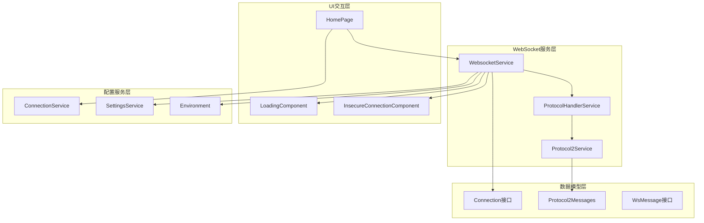
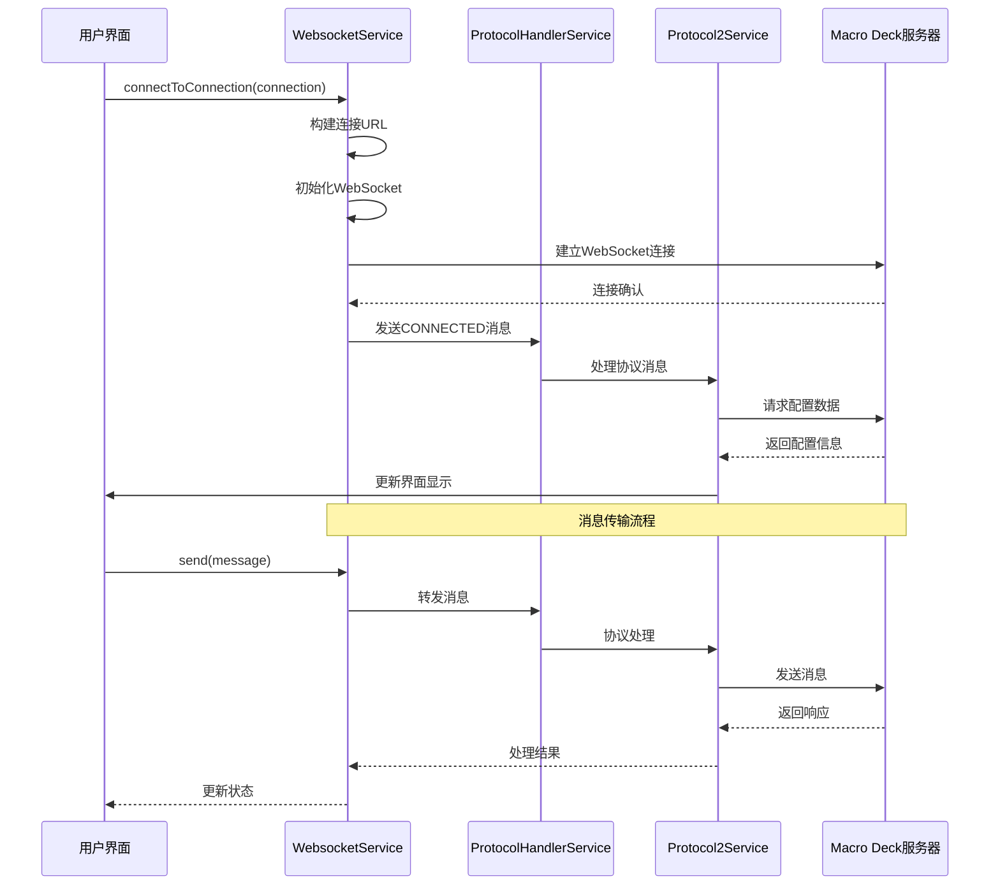
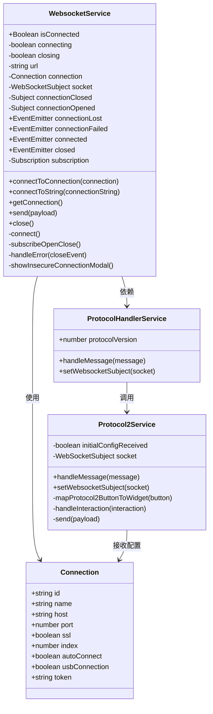
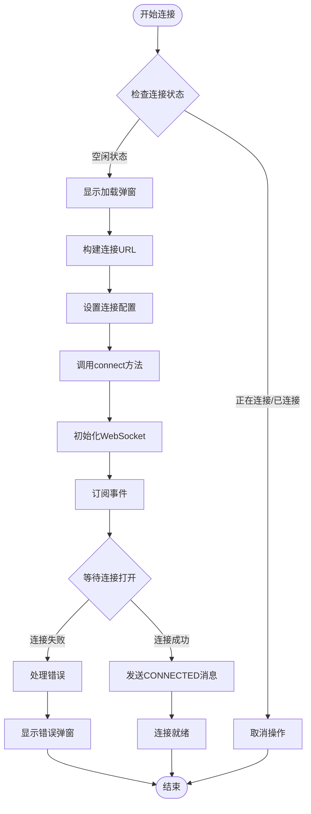
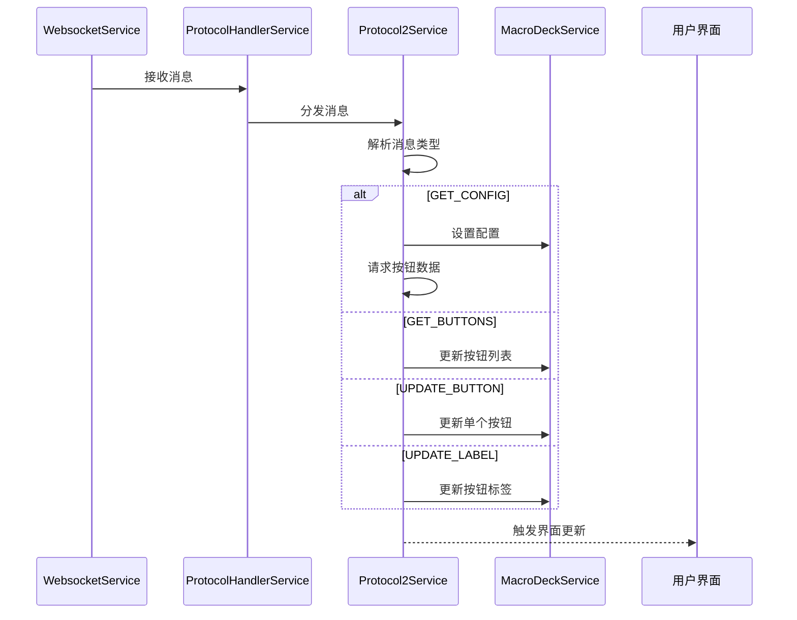
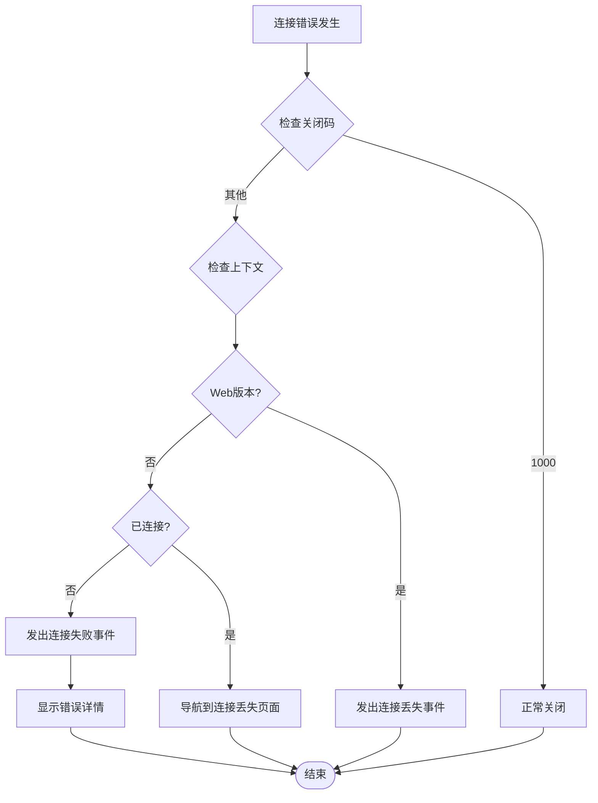
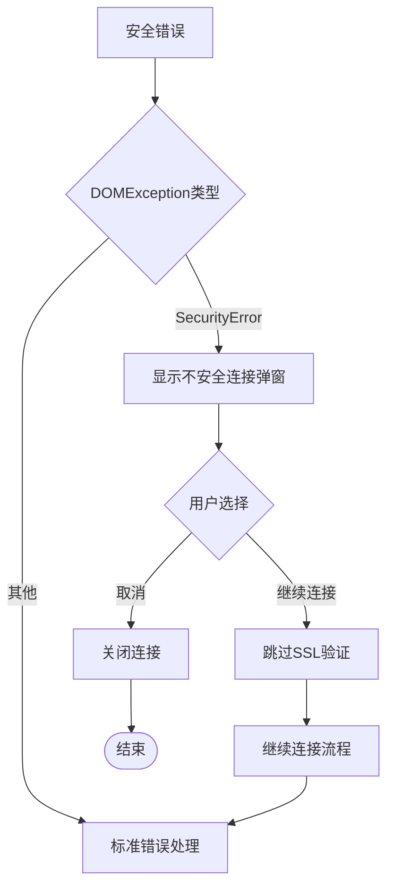
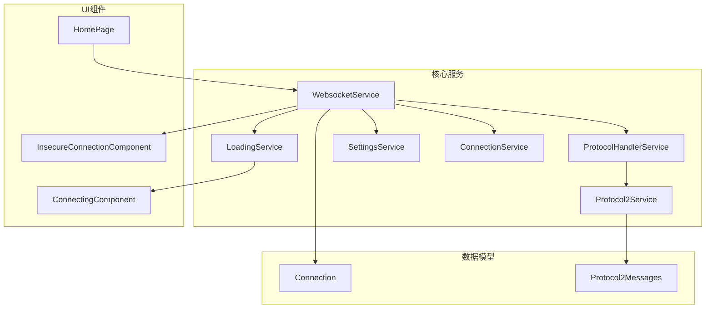

# WebSocket API

<cite>
**本文档引用的文件**
- [websocket.service.ts](file://src/app/services/websocket/websocket.service.ts)
- [connection.service.ts](file://src/app/services/connection/connection.service.ts)
- [connection.ts](file://src/app/datatypes/connection.ts)
- [protocol-handler.service.ts](file://src/app/services/protocol/protocol-handler.service.ts)
- [protocol2.service.ts](file://src/app/services/protocol/protocol2.service.ts)
- [protocol2-messages.ts](file://src/app/datatypes/protocol2/protocol2-messages.ts)
- [home.page.ts](file://src/app/pages/home/home.page.ts)
- [connecting.component.ts](file://src/app/pages/home/modals/connecting/connecting.component.ts)
- [insecure-connection.component.ts](file://src/app/pages/home/modals/insecure-connection/insecure-connection.component.ts)
- [loading.service.ts](file://src/app/services/loading/loading.service.ts)
- [settings.service.ts](file://src/app/services/settings/settings.service.ts)
- [environment.ts](file://src/environments/environment.ts)
</cite>

## 目录
1. [简介](#简介)
2. [项目结构](#项目结构)
3. [核心组件](#核心组件)
4. [架构概览](#架构概览)
5. [详细组件分析](#详细组件分析)
6. [依赖关系分析](#依赖关系分析)
7. [性能考虑](#性能考虑)
8. [故障排除指南](#故障排除指南)
9. [结论](#结论)

## 简介
本文档详细记录了Macro Deck客户端应用中的WebSocket API实现，重点分析WebsocketService类的功能特性、使用方法和最佳实践。该服务实现了与Macro Deck服务器的实时通信，支持多种连接方式（网络连接、USB直连）、SSL安全连接、消息收发机制以及完整的错误处理流程。

## 项目结构
WebSocket功能主要分布在以下模块中：

**图表来源**
- [websocket.service.ts:1-402](file://src/app/services/websocket/websocket.service.ts#L1-L402)
- [connection.service.ts:1-179](file://src/app/services/connection/connection.service.ts#L1-L179)
- [protocol-handler.service.ts:1-65](file://src/app/services/protocol/protocol-handler.service.ts#L1-L65)

**章节来源**
- [websocket.service.ts:16-57](file://src/app/services/websocket/websocket.service.ts#L16-L57)
- [connection.service.ts:6-179](file://src/app/services/connection/connection.service.ts#L6-L179)

## 核心组件

### WebsocketService类概述
WebsocketService是整个WebSocket通信的核心服务，提供以下主要功能：

- **连接管理**：支持通过Connection对象或直接连接字符串建立连接
- **消息处理**：自动处理协议消息的接收和转发
- **状态监控**：跟踪连接状态（connected、connecting、closing）
- **错误处理**：完善的错误检测和用户友好的错误提示
- **生命周期管理**：智能的连接建立、维护和清理

### 主要公共方法

#### connectToConnection(Connection)
- **参数**：Connection对象，包含主机地址、端口、SSL配置等
- **返回值**：Promise<void>
- **功能**：根据Connection配置建立WebSocket连接
- **特点**：支持USB直连和网络连接两种模式

#### connectToString(string)
- **参数**：完整的WebSocket连接URL字符串
- **返回值**：Promise<void>
- **功能**：直接使用提供的连接字符串建立连接
- **用途**：适用于快速连接或特殊连接场景

#### send(any)
- **参数**：任意JSON可序列化对象
- **返回值**：void
- **功能**：通过WebSocket发送消息到服务器
- **注意**：消息格式需符合协议规范

#### close()
- **参数**：无
- **返回值**：void
- **功能**：主动关闭WebSocket连接
- **行为**：标记closing状态并清理资源

### 状态属性
- **isConnected**：布尔值，指示当前连接状态
- **connecting**：私有属性，表示连接进行中
- **closing**：私有属性，表示主动关闭中

### 事件监听
- **connected**：连接成功事件
- **closed**：连接关闭事件  
- **connectionLost**：连接丢失事件
- **connectionFailed**：连接失败事件

**章节来源**
- [websocket.service.ts:59-191](file://src/app/services/websocket/websocket.service.ts#L59-L191)
- [websocket.service.ts:275-372](file://src/app/services/websocket/websocket.service.ts#L275-L372)

## 架构概览

WebSocket服务采用分层架构设计，确保职责分离和代码可维护性：

**图表来源**
- [websocket.service.ts:101-171](file://src/app/services/websocket/websocket.service.ts#L101-L171)
- [protocol-handler.service.ts:22-36](file://src/app/services/protocol/protocol-handler.service.ts#L22-L36)
- [protocol2.service.ts:41-95](file://src/app/services/protocol/protocol2.service.ts#L41-L95)

## 详细组件分析

### WebsocketService类结构

**图表来源**
- [websocket.service.ts:20-50](file://src/app/services/websocket/websocket.service.ts#L20-L50)
- [connection.ts:1-33](file://src/app/datatypes/connection.ts#L1-L33)
- [protocol-handler.service.ts:9-36](file://src/app/services/protocol/protocol-handler.service.ts#L9-L36)
- [protocol2.service.ts:19-34](file://src/app/services/protocol/protocol2.service.ts#L19-L34)

### 连接建立流程

#### 网络连接建立过程

**图表来源**
- [websocket.service.ts:63-134](file://src/app/services/websocket/websocket.service.ts#L63-L134)
- [websocket.service.ts:300-330](file://src/app/services/websocket/websocket.service.ts#L300-L330)

#### USB直连连接方式

USB连接具有特殊配置选项：

- **主机地址**：固定为127.0.0.1
- **端口配置**：通过SettingsService动态获取
- **SSL设置**：可选择启用或禁用
- **自动连接**：支持配置为自动连接

**章节来源**
- [connection.service.ts:22-34](file://src/app/services/connection/connection.service.ts#L22-L34)
- [connection.service.ts:118-129](file://src/app/services/connection/connection.service.ts#L118-L129)

### 消息处理机制

#### 协议消息处理流程

**图表来源**
- [protocol-handler.service.ts:22-28](file://src/app/services/protocol/protocol-handler.service.ts#L22-L28)
- [protocol2.service.ts:41-95](file://src/app/services/protocol/protocol2.service.ts#L41-L95)

#### 用户交互消息发送

用户与界面的交互会转换为特定的协议消息：

| 交互类型 | 协议方法 | 消息格式 |
|---------|---------|---------|
| 按钮按下 | BUTTON_PRESS | `{Method: "BUTTON_PRESS", Message: "row_col"}` |
| 按钮释放 | BUTTON_RELEASE | `{Method: "BUTTON_RELEASE", Message: "row_col"}` |
| 长按开始 | BUTTON_LONG_PRESS | `{Method: "BUTTON_LONG_PRESS", Message: "row_col"}` |
| 长按释放 | BUTTON_LONG_PRESS_RELEASE | `{Method: "BUTTON_LONG_PRESS_RELEASE", Message: "row_col"}` |

**章节来源**
- [protocol2.service.ts:139-160](file://src/app/services/protocol/protocol2.service.ts#L139-L160)
- [protocol2-messages.ts:9-23](file://src/app/datatypes/protocol2/protocol2-messages.ts#L9-L23)

### 错误处理机制

#### 连接错误分类处理

**图表来源**
- [websocket.service.ts:197-219](file://src/app/services/websocket/websocket.service.ts#L197-L219)
- [websocket.service.ts:374-393](file://src/app/services/websocket/websocket.service.ts#L374-L393)

#### SSL安全连接处理

当遇到SSL证书验证失败时的特殊处理流程：

**图表来源**
- [websocket.service.ts:125-131](file://src/app/services/websocket/websocket.service.ts#L125-L131)
- [websocket.service.ts:224-229](file://src/app/services/websocket/websocket.service.ts#L224-L229)

**章节来源**
- [websocket.service.ts:120-132](file://src/app/services/websocket/websocket.service.ts#L120-L132)
- [websocket.service.ts:317-328](file://src/app/services/websocket/websocket.service.ts#L317-L328)

## 依赖关系分析

### 服务间依赖关系

**图表来源**
- [websocket.service.ts:51-57](file://src/app/services/websocket/websocket.service.ts#L51-L57)
- [protocol-handler.service.ts:14-15](file://src/app/services/protocol/protocol-handler.service.ts#L14-L15)
- [protocol2.service.ts:27-29](file://src/app/services/protocol/protocol2.service.ts#L27-L29)

### 外部依赖

- **RxJS**：用于Observable和WebSocketSubject的实现
- **Ionic Angular**：提供模态对话框和平台集成
- **Angular**：依赖注入和组件架构

**章节来源**
- [websocket.service.ts:1-15](file://src/app/services/websocket/websocket.service.ts#L1-L15)
- [protocol2.service.ts:1-14](file://src/app/services/protocol/protocol2.service.ts#L1-L14)

## 性能考虑

### 连接优化策略

1. **连接状态管理**：通过connecting和closing标志避免重复连接
2. **内存管理**：及时清理订阅和WebSocket资源
3. **错误恢复**：智能的重连机制和错误降级处理
4. **UI响应**：异步加载提示和用户交互反馈

### 消息处理优化

- **协议分发**：通过ProtocolHandlerService实现消息路由
- **批量更新**：按钮列表的批量处理减少UI刷新频率
- **增量更新**：支持单个按钮的精确更新

## 故障排除指南

### 常见连接问题

#### 连接超时
- 检查网络连接和防火墙设置
- 验证服务器地址和端口配置
- 确认SSL证书有效性

#### 认证失败
- 验证Connection.token配置
- 检查服务器端的访问控制设置
- 确认客户端ID生成和存储

#### 消息传输失败
- 检查协议版本兼容性
- 验证消息格式和字段完整性
- 确认WebSocket连接状态

### 调试建议

1. **启用详细日志**：观察连接建立和消息传输过程
2. **检查事件订阅**：确保所有必要的事件都被正确订阅
3. **验证配置**：确认Connection对象的各个字段设置正确

**章节来源**
- [websocket.service.ts:142-157](file://src/app/services/websocket/websocket.service.ts#L142-L157)
- [websocket.service.ts:332-347](file://src/app/services/websocket/websocket.service.ts#L332-L347)

## 结论

WebsocketService提供了完整而健壮的WebSocket通信解决方案，具有以下优势：

1. **功能完整**：支持多种连接方式和协议版本
2. **用户体验友好**：提供详细的连接状态反馈和错误提示
3. **架构清晰**：良好的分层设计便于维护和扩展
4. **错误处理完善**：全面的错误检测和用户友好的处理机制

该服务为Macro Deck客户端应用提供了稳定可靠的实时通信基础，支持从简单网络连接到复杂的USB直连等多种使用场景。