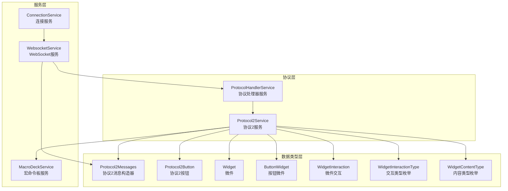
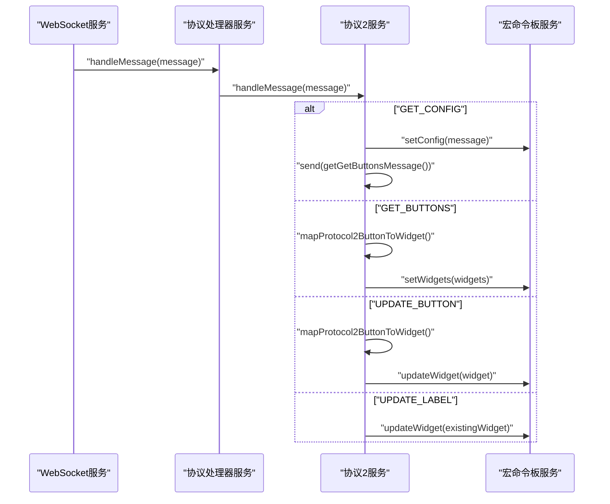
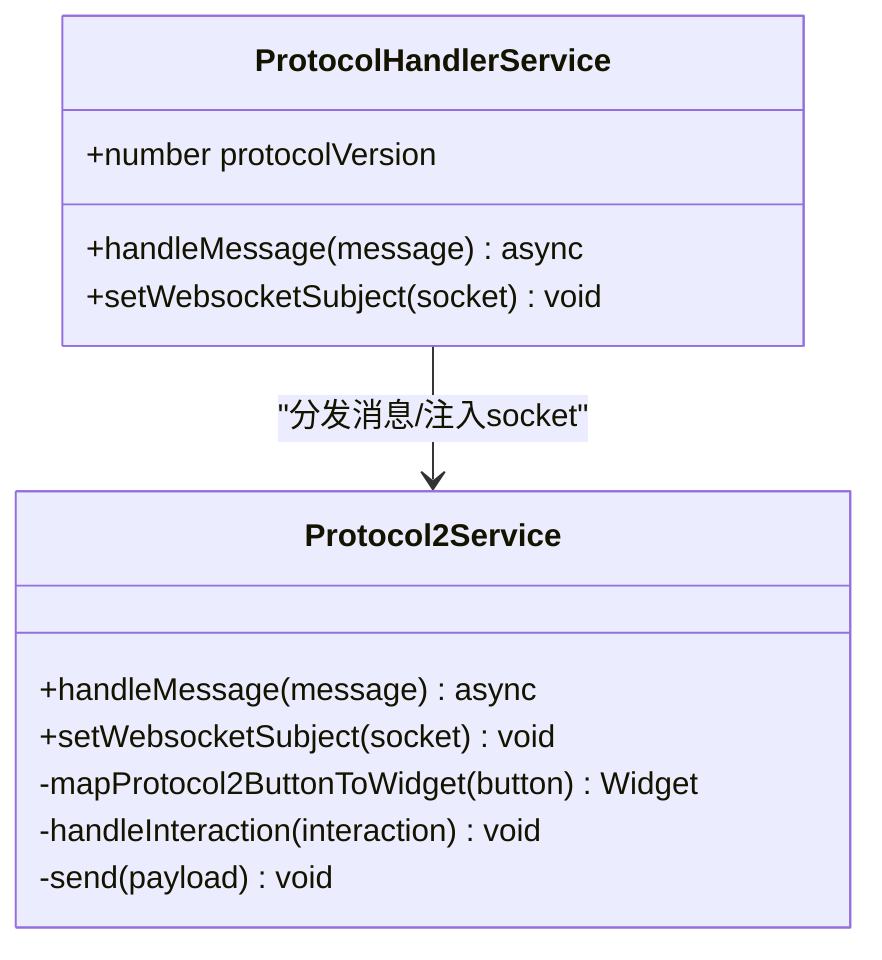
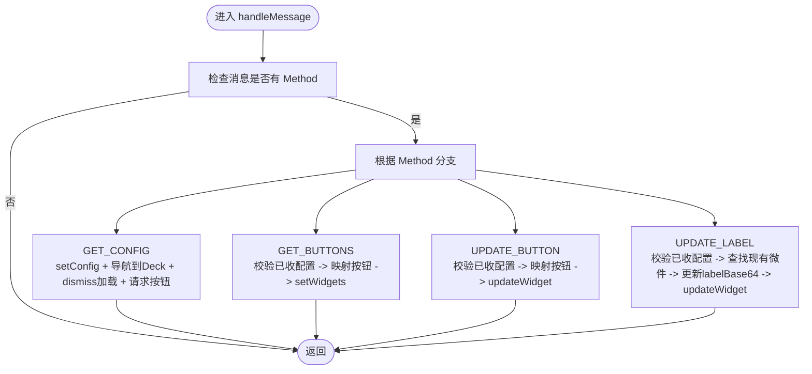
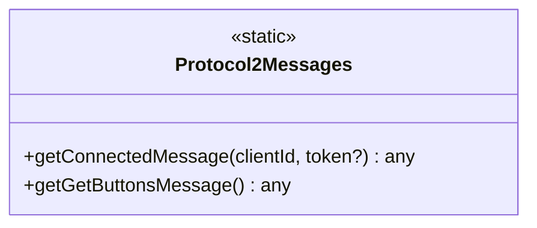
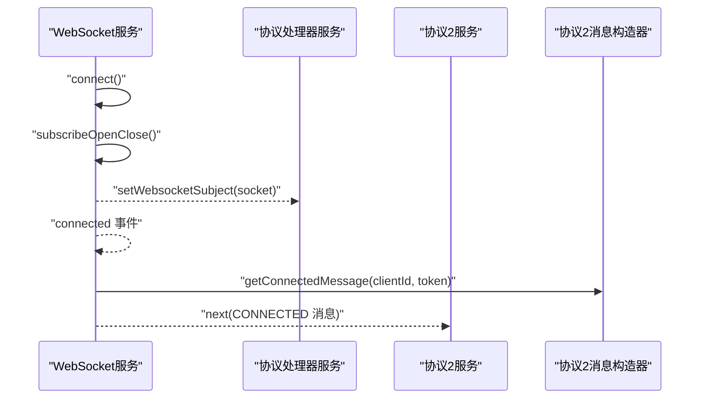
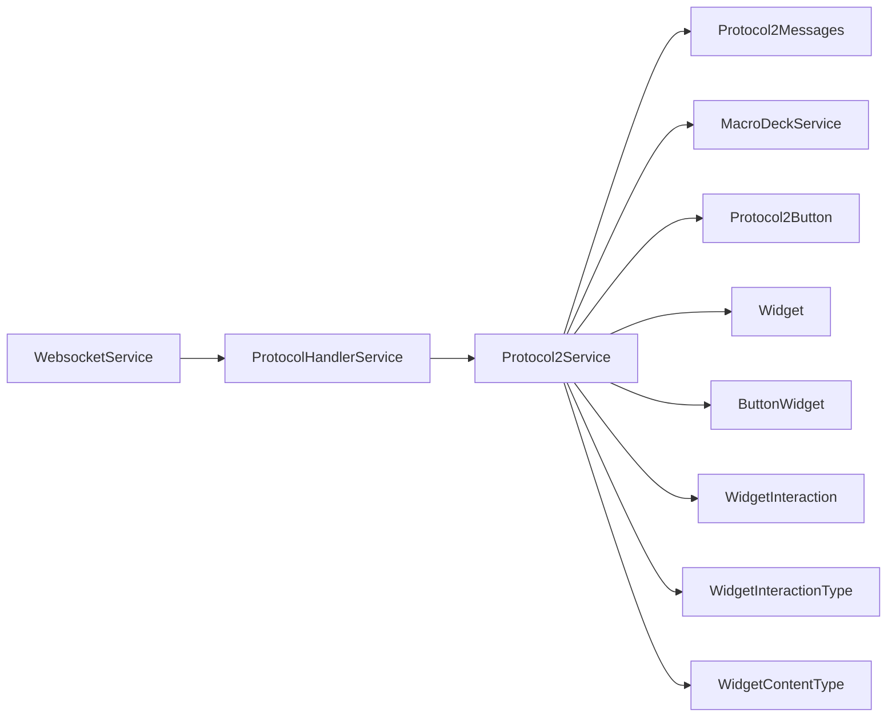

# 协议处理API

<cite>
**本文引用的文件**
- [protocol-handler.service.ts](file://src/app/services/protocol/protocol-handler.service.ts)
- [protocol2.service.ts](file://src/app/services/protocol/protocol2.service.ts)
- [protocol2-messages.ts](file://src/app/datatypes/protocol2/protocol2-messages.ts)
- [protocol2-button.ts](file://src/app/datatypes/protocol2/protocol2-button.ts)
- [widget.ts](file://src/app/datatypes/widgets/widget.ts)
- [button-widget.ts](file://src/app/datatypes/widgets/button-widget.ts)
- [widget-interaction.ts](file://src/app/datatypes/widgets/widget-interaction.ts)
- [widget-interaction-type.ts](file://src/app/enums/widget-interaction-type.ts)
- [widget-content-type.ts](file://src/app/enums/widget-content-type.ts)
- [macro-deck.service.ts](file://src/app/services/macro-deck/macro-deck.service.ts)
- [websocket.service.ts](file://src/app/services/websocket/websocket.service.ts)
- [connection.service.ts](file://src/app/services/connection/connection.service.ts)
- [navigation-destination.ts](file://src/app/enums/navigation-destination.ts)
- [ws-message.ts](file://src/app/datatypes/ws-message.ts)
</cite>

## 目录
1. [简介](#简介)
2. [项目结构](#项目结构)
3. [核心组件](#核心组件)
4. [架构总览](#架构总览)
5. [详细组件分析](#详细组件分析)
6. [依赖关系分析](#依赖关系分析)
7. [性能考量](#性能考量)
8. [故障排查指南](#故障排查指南)
9. [结论](#结论)
10. [附录](#附录)

## 简介
本文件面向协议处理API，系统性梳理协议版本管理、消息格式、数据类型转换与协议兼容性处理，重点覆盖以下内容：
- 协议处理器服务与协议2服务的职责边界与协作流程
- 核心方法说明：handleMessage()、setWebsocketSubject()、handleInteraction()、mapProtocol2ButtonToWidget()、send() 等
- 协议版本管理机制与未来扩展策略
- 协议2消息构造器提供的消息类型与字段语义
- 消息格式、数据类型转换与协议兼容性处理
- 协议扩展与自定义消息类型的开发指南
- 协议调试与错误处理最佳实践

## 项目结构
协议处理相关代码主要分布在以下模块：
- 协议层：协议处理器服务、协议2服务、协议2消息构造器
- 数据类型层：协议2按钮、微件、交互、枚举
- 服务层：宏命令板服务、WebSocket服务、连接服务
- 导航与环境：导航目的地枚举、WebSocket消息接口

图表来源
- [protocol-handler.service.ts:1-65](file://src/app/services/protocol/protocol-handler.service.ts#L1-L65)
- [protocol2.service.ts:1-296](file://src/app/services/protocol/protocol2.service.ts#L1-L296)
- [protocol2-messages.ts:1-57](file://src/app/datatypes/protocol2/protocol2-messages.ts#L1-L57)
- [protocol2-button.ts:1-21](file://src/app/datatypes/protocol2/protocol2-button.ts#L1-L21)
- [widget.ts:1-33](file://src/app/datatypes/widgets/widget.ts#L1-L33)
- [button-widget.ts:1-16](file://src/app/datatypes/widgets/button-widget.ts#L1-L16)
- [widget-interaction.ts:1-18](file://src/app/datatypes/widgets/widget-interaction.ts#L1-L18)
- [widget-interaction-type.ts:1-18](file://src/app/enums/widget-interaction-type.ts#L1-L18)
- [widget-content-type.ts:1-12](file://src/app/enums/widget-content-type.ts#L1-L12)
- [macro-deck.service.ts:1-111](file://src/app/services/macro-deck/macro-deck.service.ts#L1-L111)
- [websocket.service.ts:1-402](file://src/app/services/websocket/websocket.service.ts#L1-L402)
- [connection.service.ts:1-179](file://src/app/services/connection/connection.service.ts#L1-L179)

章节来源
- [protocol-handler.service.ts:1-65](file://src/app/services/protocol/protocol-handler.service.ts#L1-L65)
- [protocol2.service.ts:1-296](file://src/app/services/protocol/protocol2.service.ts#L1-L296)
- [websocket.service.ts:1-402](file://src/app/services/websocket/websocket.service.ts#L1-L402)

## 核心组件
本节聚焦协议处理API的关键类与方法，解释其职责、输入输出与调用关系。

- 协议处理器服务（ProtocolHandlerService）
  - 职责：根据协议版本号将消息分发至对应协议服务；向协议服务注入WebSocket主题对象
  - 关键方法
    - handleMessage(message: any): 异步分发消息到协议2服务
    - setWebsocketSubject(socket: WebSocketSubject<any>): 注入WebSocket主题，供协议2服务使用
  - 协议版本管理：当前默认版本为2，保留扩展到其他版本的空间

- 协议2服务（Protocol2Service）
  - 职责：解析服务器消息、映射按钮数据为微件、处理用户交互并发送协议消息
  - 关键方法
    - handleMessage(message: any): 解析并处理服务器消息（GET_CONFIG、GET_BUTTONS、UPDATE_BUTTON、UPDATE_LABEL）
    - setWebsocketSubject(socket: WebSocketSubject<any>): 初始化WebSocket主题并重置初始配置状态
    - mapProtocol2ButtonToWidget(button: Protocol2Button): 将协议2按钮映射为内部Widget
    - handleInteraction(interaction: WidgetInteraction): 将交互事件映射为协议方法并发送
    - send(payload: any): 通过WebSocket发送消息
  - 内部状态：initialConfigReceived（是否已收到初始配置）

- 协议2消息构造器（Protocol2Messages）
  - 职责：生成与服务器通信的消息对象
  - 关键方法
    - getConnectedMessage(clientId: string, token?: string): 生成连接确认消息（包含Method、Client-Id、API、Device-Type、Token）
    - getGetButtonsMessage(): 生成请求按钮列表消息（包含Method）

- 宏命令板服务（MacroDeckService）
  - 职责：维护面板配置与微件列表，发布配置更新与交互事件
  - 关键方法
    - setConfig(message: any): 更新面板配置并发出事件
    - setWidgets(widgets: Widget[]): 设置完整微件列表
    - updateWidget(widget: Widget): 更新或追加微件

- WebSocket服务（WebsocketService）
  - 职责：管理WebSocket连接、消息订阅、错误处理、连接状态与导航
  - 关键方法
    - connectToConnection(connection: Connection): 建立连接
    - connectToString(connectionString: string): 通过字符串连接
    - close(): 主动关闭连接
    - send(payload: any): 发送消息
    - subscribeOpenClose(): 订阅连接打开/关闭事件
    - handleError(closeEvent: CloseEvent): 错误处理逻辑
  - 与协议层集成：在连接打开时注入WebSocket主题并发送连接确认消息

章节来源
- [protocol-handler.service.ts:11-37](file://src/app/services/protocol/protocol-handler.service.ts#L11-L37)
- [protocol2.service.ts:21-161](file://src/app/services/protocol/protocol2.service.ts#L21-L161)
- [protocol2-messages.ts:9-34](file://src/app/datatypes/protocol2/protocol2-messages.ts#L9-L34)
- [macro-deck.service.ts:36-66](file://src/app/services/macro-deck/macro-deck.service.ts#L36-L66)
- [websocket.service.ts:101-172](file://src/app/services/websocket/websocket.service.ts#L101-L172)

## 架构总览
下图展示从WebSocket接收消息到协议处理再到UI更新的整体流程，以及协议版本管理的入口。

图表来源
- [websocket.service.ts:115-119](file://src/app/services/websocket/websocket.service.ts#L115-L119)
- [protocol-handler.service.ts:22-28](file://src/app/services/protocol/protocol-handler.service.ts#L22-L28)
- [protocol2.service.ts:41-95](file://src/app/services/protocol/protocol2.service.ts#L41-L95)
- [macro-deck.service.ts:49-65](file://src/app/services/macro-deck/macro-deck.service.ts#L49-L65)

## 详细组件分析

### 协议处理器服务（ProtocolHandlerService）
- 设计要点
  - 采用“版本号+分发”的模式，当前版本为2，便于后续扩展新版本
  - 通过setWebsocketSubject将WebSocket主题注入到协议2服务，确保消息发送通道可用
- 方法详解
  - handleMessage(message: any): 根据protocolVersion选择对应协议服务处理
  - setWebsocketSubject(socket: WebSocketSubject<any>): 将socket传给协议2服务

图表来源
- [protocol-handler.service.ts:9-37](file://src/app/services/protocol/protocol-handler.service.ts#L9-L37)
- [protocol2.service.ts:19-161](file://src/app/services/protocol/protocol2.service.ts#L19-L161)

章节来源
- [protocol-handler.service.ts:11-37](file://src/app/services/protocol/protocol-handler.service.ts#L11-L37)

### 协议2服务（Protocol2Service）
- 设计要点
  - 通过订阅宏命令板服务的交互事件，将用户操作转换为协议方法并发送
  - 对服务器消息进行分类处理：配置、按钮列表、单按钮更新、标签更新
  - 使用initialConfigReceived避免在未收到初始配置前处理按钮相关消息
- 方法详解
  - handleMessage(message: any): 分支处理四种消息类型，分别更新配置、设置/更新微件
  - setWebsocketSubject(socket: WebSocketSubject<any>): 初始化socket并重置状态
  - mapProtocol2ButtonToWidget(button: Protocol2Button): 将协议2按钮映射为Widget
  - handleInteraction(interaction: WidgetInteraction): 交互类型到协议方法的映射
  - send(payload: any): 通过WebSocket发送消息

图表来源
- [protocol2.service.ts:41-95](file://src/app/services/protocol/protocol2.service.ts#L41-L95)

章节来源
- [protocol2.service.ts:21-161](file://src/app/services/protocol/protocol2.service.ts#L21-L161)

### 协议2消息构造器（Protocol2Messages）
- 设计要点
  - 提供静态方法生成标准协议消息，保证字段一致性
  - CONNECTED消息包含客户端标识、API版本、设备类型，可选附加Token
- 方法详解
  - getConnectedMessage(clientId: string, token?: string): 生成连接确认消息
  - getGetButtonsMessage(): 生成请求按钮列表消息

图表来源
- [protocol2-messages.ts:2-34](file://src/app/datatypes/protocol2/protocol2-messages.ts#L2-L34)

章节来源
- [protocol2-messages.ts:9-34](file://src/app/datatypes/protocol2/protocol2-messages.ts#L9-L34)

### 宏命令板服务（MacroDeckService）
- 设计要点
  - 维护面板配置与微件列表，提供配置更新事件与交互事件
  - updateWidget支持更新或追加微件，依据行列坐标定位
- 方法详解
  - setConfig(message: any): 更新面板配置并发出事件
  - setWidgets(widgets: Widget[]): 设置完整微件列表
  - updateWidget(widget: Widget): 更新或追加微件

章节来源
- [macro-deck.service.ts:36-66](file://src/app/services/macro-deck/macro-deck.service.ts#L36-L66)

### WebSocket服务（WebsocketService）
- 设计要点
  - 负责连接生命周期管理、消息订阅、错误处理与导航
  - 在连接打开时注入WebSocket主题并发送连接确认消息
- 方法详解
  - connectToConnection(connection: Connection): 建立连接
  - connect(): 创建WebSocket主题并订阅消息与错误
  - subscribeOpenClose(): 订阅连接打开/关闭事件，处理导航与错误
  - handleError(closeEvent: CloseEvent): 根据关闭码与运行环境决定处理策略
  - send(payload: any): 发送消息

图表来源
- [websocket.service.ts:141-172](file://src/app/services/websocket/websocket.service.ts#L141-L172)
- [protocol-handler.service.ts:34-36](file://src/app/services/protocol/protocol-handler.service.ts#L34-L36)
- [protocol2-messages.ts:9-23](file://src/app/datatypes/protocol2/protocol2-messages.ts#L9-L23)

章节来源
- [websocket.service.ts:101-172](file://src/app/services/websocket/websocket.service.ts#L101-L172)

### 数据类型与枚举
- 协议2按钮（Protocol2Button）
  - 字段：IconBase64、Position_X、Position_Y、LabelBase64、BackgroundColorHex
- 微件（Widget）
  - 字段：column、row、colSpan、rowSpan、backgroundColorHex、widgetContentType、widgetContent
- 按钮微件（ButtonWidget）
  - 扩展自WidgetContent，包含iconBase64与labelBase64
- 微件交互（WidgetInteraction）
  - 字段：widget、widgetInteractionType
- 枚举
  - WidgetInteractionType：按钮按下、短按释放、长按、长按释放
  - WidgetContentType：empty、button
  - NavigationDestination：Home、Deck、ConnectionLost

章节来源
- [protocol2-button.ts:2-13](file://src/app/datatypes/protocol2/protocol2-button.ts#L2-L13)
- [widget.ts:5-20](file://src/app/datatypes/widgets/widget.ts#L5-L20)
- [button-widget.ts:4-9](file://src/app/datatypes/widgets/button-widget.ts#L4-L9)
- [widget-interaction.ts:5-10](file://src/app/datatypes/widgets/widget-interaction.ts#L5-L10)
- [widget-interaction-type.ts:2-11](file://src/app/enums/widget-interaction-type.ts#L2-L11)
- [widget-content-type.ts:2-7](file://src/app/enums/widget-content-type.ts#L2-L7)
- [navigation-destination.ts:2-9](file://src/app/enums/navigation-destination.ts#L2-L9)

## 依赖关系分析
- 协议层依赖
  - ProtocolHandlerService依赖Protocol2Service
  - Protocol2Service依赖MacroDeckService、Protocol2Messages、Protocol2Button、Widget、ButtonWidget、WidgetInteraction、WidgetInteractionType、WidgetContentType、LoadingService、NavigationService
- 服务层依赖
  - WebsocketService依赖ProtocolHandlerService、Protocol2Messages、SettingsService、NavigationService、LoadingService、ModalController
  - MacroDeckService依赖WebsocketService、Widget、WidgetInteraction
- 数据类型与枚举被广泛复用

图表来源
- [websocket.service.ts:51-56](file://src/app/services/websocket/websocket.service.ts#L51-L56)
- [protocol-handler.service.ts:14](file://src/app/services/protocol/protocol-handler.service.ts#L14)
- [protocol2.service.ts:27-34](file://src/app/services/protocol/protocol2.service.ts#L27-L34)

章节来源
- [protocol2.service.ts:1-296](file://src/app/services/protocol/protocol2.service.ts#L1-L296)
- [websocket.service.ts:1-402](file://src/app/services/websocket/websocket.service.ts#L1-L402)

## 性能考量
- 消息处理分支控制
  - 通过initialConfigReceived避免在未收到初始配置前处理按钮相关消息，减少无效计算
- 微件更新策略
  - updateWidget采用坐标匹配更新，避免全量替换；若未找到则追加，保证列表完整性
- WebSocket发送
  - send方法直接委托给WebSocketSubject.next，避免额外序列化开销
- 加载与导航
  - 首次配置完成后立即导航到Deck页面并dismiss加载，提升用户体验

[本节为通用指导，不涉及具体文件分析]

## 故障排查指南
- 连接失败与安全错误
  - WebSocket服务在error回调中识别DOMException并弹出不安全连接提示
  - handleError根据关闭码与运行环境决定触发连接丢失或连接失败事件
- 连接关闭码处理
  - 正常关闭码1000不作处理；非正常关闭码触发相应页面导航或事件
- 消息格式问题
  - handleMessage在无Method字段时直接返回，避免异常传播
  - UPDATE_LABEL需先存在对应微件，否则忽略更新
- 调试建议
  - 在handleMessage与handleInteraction处添加日志，记录Method与关键参数
  - 在send方法前后打印payload，核对消息结构
  - 使用NavigationService的导航事件验证页面流转

章节来源
- [websocket.service.ts:120-133](file://src/app/services/websocket/websocket.service.ts#L120-L133)
- [websocket.service.ts:197-219](file://src/app/services/websocket/websocket.service.ts#L197-L219)
- [protocol2.service.ts:42-44](file://src/app/services/protocol/protocol2.service.ts#L42-L44)
- [protocol2.service.ts:78-88](file://src/app/services/protocol/protocol2.service.ts#L78-L88)

## 结论
本协议处理API以ProtocolHandlerService为核心入口，结合Protocol2Service完成消息解析、微件映射与交互发送，配合MacroDeckService与WebSocketService形成完整的实时通信闭环。通过静态消息构造器与明确的数据类型定义，保证了消息格式的一致性与可扩展性。未来扩展新协议版本时，可在ProtocolHandlerService中增加版本分支，并在Protocol2Service基础上新增对应服务，保持清晰的职责分离与良好的可维护性。

[本节为总结性内容，不涉及具体文件分析]

## 附录

### 协议版本管理机制与扩展指南
- 当前版本
  - protocolVersion默认为2，handleMessage根据该值分发到Protocol2Service
- 扩展步骤
  1. 新增协议服务（如Protocol3Service），实现与Protocol2Service相同的接口（handleMessage、setWebsocketSubject等）
  2. 在ProtocolHandlerService中增加case分支，根据protocolVersion选择对应协议服务
  3. 如需新增消息类型，扩展Protocol2Messages或新增消息构造器类
  4. 在MacroDeckService中适配新的微件模型或交互类型
  5. 在WebSocketService中保持连接与消息发送逻辑不变，确保向新协议服务注入socket

章节来源
- [protocol-handler.service.ts:22-28](file://src/app/services/protocol/protocol-handler.service.ts#L22-L28)
- [protocol2.service.ts:19-34](file://src/app/services/protocol/protocol2.service.ts#L19-L34)

### 消息格式与数据类型转换
- 消息字段规范
  - CONNECTED：Method、Client-Id、API、Device-Type、Token（可选）
  - GET_BUTTONS：Method
- 数据类型转换
  - 协议2按钮字段映射到Widget：Position_X/Y映射为column/row，IconBase64/LabelBase64映射到ButtonWidget
  - 交互事件映射：WidgetInteractionType枚举映射为协议方法字符串
- 兼容性处理
  - 未收到初始配置前忽略按钮相关消息
  - UPDATE_LABEL仅更新labelBase64，不影响其他字段

章节来源
- [protocol2-messages.ts:9-34](file://src/app/datatypes/protocol2/protocol2-messages.ts#L9-L34)
- [protocol2-button.ts:2-13](file://src/app/datatypes/protocol2/protocol2-button.ts#L2-L13)
- [widget.ts:5-20](file://src/app/datatypes/widgets/widget.ts#L5-L20)
- [button-widget.ts:4-9](file://src/app/datatypes/widgets/button-widget.ts#L4-L9)
- [widget-interaction-type.ts:2-11](file://src/app/enums/widget-interaction-type.ts#L2-L11)

### 开发指南：协议扩展与自定义消息类型
- 新增消息类型
  - 在Protocol2Messages中添加静态方法生成消息对象
  - 在Protocol2Service.handleMessage中增加对应分支处理
- 新增交互类型
  - 在WidgetInteractionType中添加枚举项
  - 在Protocol2Service.handleInteraction中增加映射
- 新增微件类型
  - 定义新的WidgetContent接口并扩展WidgetContentType
  - 在Protocol2Service.mapProtocol2ButtonToWidget中增加映射逻辑
- 测试建议
  - 编写单元测试覆盖消息分支与数据映射
  - 使用Mock服务验证交互事件与消息发送

章节来源
- [protocol2-messages.ts:35-57](file://src/app/datatypes/protocol2/protocol2-messages.ts#L35-L57)
- [protocol2.service.ts:139-160](file://src/app/services/protocol/protocol2.service.ts#L139-L160)
- [widget-interaction-type.ts:12-17](file://src/app/enums/widget-interaction-type.ts#L12-L17)
- [widget-content-type.ts:8-11](file://src/app/enums/widget-content-type.ts#L8-L11)

### WebSocket消息接口
- WsMessage接口用于封装消息来源与内容，便于统一处理与调试

章节来源
- [ws-message.ts:2-7](file://src/app/datatypes/ws-message.ts#L2-L7)