# 服务层API

<cite>
**本文档引用的文件**
- [connection.service.ts](file://src/app/services/connection/connection.service.ts)
- [settings.service.ts](file://src/app/services/settings/settings.service.ts)
- [macro-deck.service.ts](file://src/app/services/macro-deck/macro-deck.service.ts)
- [navigation.service.ts](file://src/app/services/navigation/navigation.service.ts)
- [current-platform.service.ts](file://src/app/services/current-platform/current-platform.service.ts)
- [ping.service.ts](file://src/app/services/ping/ping.service.ts)
- [loading.service.ts](file://src/app/services/loading/loading.service.ts)
- [diagnostic.service.ts](file://src/app/services/diagnostic/diagnostic.service.ts)
- [theme.service.ts](file://src/app/services/theme/theme.service.ts)
- [wakelock.service.ts](file://src/app/services/wakelock/wakelock.service.ts)
- [websocket.service.ts](file://src/app/services/websocket/websocket.service.ts)
- [connection.ts](file://src/app/datatypes/connection.ts)
- [navigation-destination.ts](file://src/app/enums/navigation-destination.ts)
- [appearance-type.ts](file://src/app/enums/appearance-type.ts)
- [screen-orientation-type.ts](file://src/app/enums/screen-orientation-type.ts)
</cite>

## 目录
1. [简介](#简介)
2. [项目结构](#项目结构)
3. [核心组件](#核心组件)
4. [架构总览](#架构总览)
5. [详细组件分析](#详细组件分析)
6. [依赖分析](#依赖分析)
7. [性能考虑](#性能考虑)
8. [故障排查指南](#故障排查指南)
9. [结论](#结论)
10. [附录](#附录)

## 简介
本文件面向服务层API的使用者与维护者，系统梳理并说明以下核心服务类的公共接口与使用方式：
- ConnectionService：连接配置的增删改查与持久化
- SettingsService：应用配置项的读写与默认值管理
- MacroDeckService：控制面板配置与微件状态管理
- NavigationService：应用内页面导航
- WebsocketService：与Macro Deck服务器的WebSocket通信
- PingService：服务器可用性探测
- LoadingService：连接过程中的加载提示
- ThemeService：主题与深色模式管理
- WakelockService：屏幕常亮控制
- CurrentPlatformService：平台检测
- DiagnosticService：诊断信息与平台能力检测

同时给出服务间依赖关系、调用模式、初始化与配置管理要点、状态同步机制，以及扩展与自定义服务开发的指导原则。

## 项目结构
服务层位于 src/app/services 下，采用按职责分层组织，每个服务以独立文件实现单一职责，通过Angular依赖注入在根作用域提供，便于全局访问。

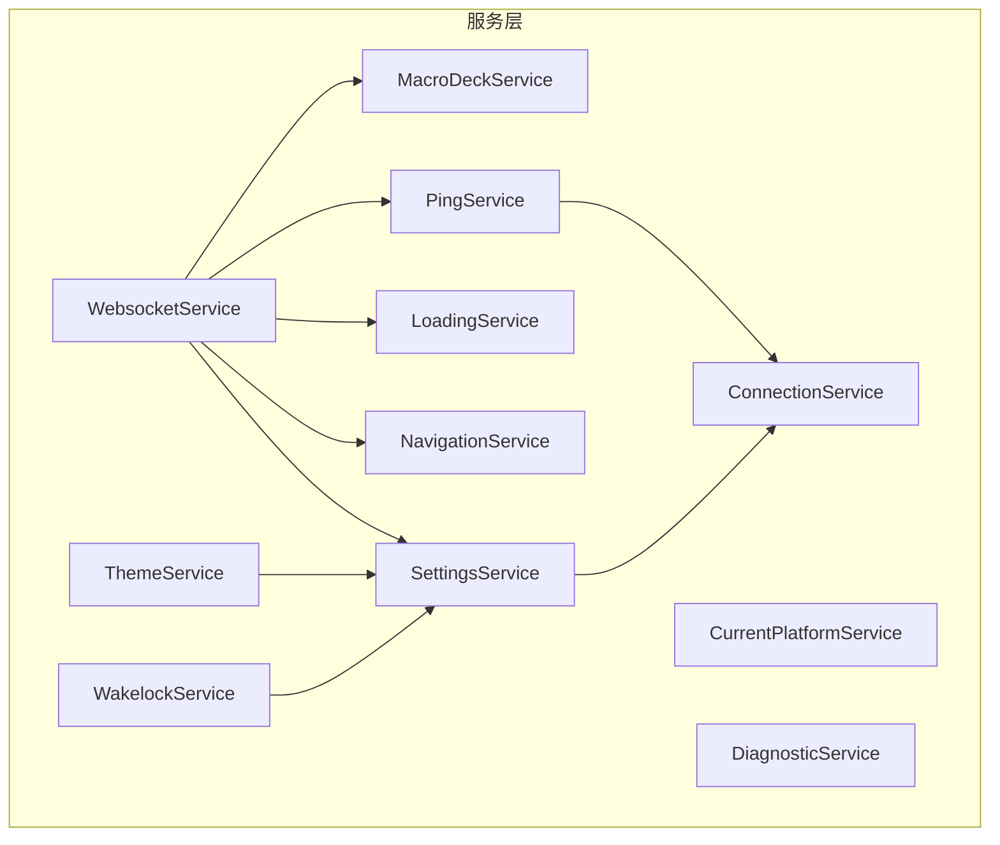

图表来源
- [connection.service.ts:10-179](file://src/app/services/connection/connection.service.ts#L10-179)
- [settings.service.ts:26-389](file://src/app/services/settings/settings.service.ts#L26-389)
- [macro-deck.service.ts:10-111](file://src/app/services/macro-deck/macro-deck.service.ts#L10-111)
- [navigation.service.ts:13-86](file://src/app/services/navigation/navigation.service.ts#L13-86)
- [websocket.service.ts:20-402](file://src/app/services/websocket/websocket.service.ts#L20-402)
- [ping.service.ts:13-228](file://src/app/services/ping/ping.service.ts#L13-228)
- [loading.service.ts:9-87](file://src/app/services/loading/loading.service.ts#L9-87)
- [theme.service.ts:9-104](file://src/app/services/theme/theme.service.ts#L9-104)
- [wakelock.service.ts:10-105](file://src/app/services/wakelock/wakelock.service.ts#L10-105)
- [current-platform.service.ts:8-77](file://src/app/services/current-platform/current-platform.service.ts#L8-77)
- [diagnostic.service.ts:10-147](file://src/app/services/diagnostic/diagnostic.service.ts#L10-147)

章节来源
- [connection.service.ts:10-179](file://src/app/services/connection/connection.service.ts#L10-179)
- [settings.service.ts:26-389](file://src/app/services/settings/settings.service.ts#L26-389)
- [macro-deck.service.ts:10-111](file://src/app/services/macro-deck/macro-deck.service.ts#L10-111)
- [navigation.service.ts:13-86](file://src/app/services/navigation/navigation.service.ts#L13-86)
- [websocket.service.ts:20-402](file://src/app/services/websocket/websocket.service.ts#L20-402)
- [ping.service.ts:13-228](file://src/app/services/ping/ping.service.ts#L13-228)
- [loading.service.ts:9-87](file://src/app/services/loading/loading.service.ts#L9-87)
- [theme.service.ts:9-104](file://src/app/services/theme/theme.service.ts#L9-104)
- [wakelock.service.ts:10-105](file://src/app/services/wakelock/wakelock.service.ts#L10-105)
- [current-platform.service.ts:8-77](file://src/app/services/current-platform/current-platform.service.ts#L8-77)
- [diagnostic.service.ts:10-147](file://src/app/services/diagnostic/diagnostic.service.ts#L10-147)

## 核心组件
本节对各服务的关键API进行概述，包括主要方法、参数、返回值与典型使用场景。

- ConnectionService
  - 方法与用途
    - getUsbConnection(): 异步获取USB连接配置（来自SettingsService）
    - getConnections(): 异步获取已保存连接列表（按index升序）
    - saveConnections(connections): 异步保存连接列表
    - addUpdateConnection(connection): 新增或更新连接；无id则生成新id并追加
    - deleteConnection(id): 根据id删除连接
  - 使用场景
    - 应用启动时加载连接列表
    - 用户在“添加连接”界面保存新连接
    - 清理无效或不再使用的连接

- SettingsService
  - 方法与用途
    - set/getAppearance(), set/getShowMenuButton(), set/getSkipSslValidation(), set/getScreenOrientation(), set/getButtonLongPressDelay(), set/getWakeLockEnabled(), set/getButtonWidgetBorderStyle()
    - set/getUsbAutoConnect(), set/getUsbPort(), set/getUsbUseSsl()
    - set/getLastConnection(), increaseConnectionCount(), getClientId()
  - 使用场景
    - 初始化UI主题与偏好
    - 记录最近一次连接ID与累计连接次数
    - 生成并缓存客户端唯一ID

- MacroDeckService
  - 方法与用途
    - setConfig(message): 设置面板布局与样式参数（行、列、间距、圆角、背景）
    - setWidgets(widgets): 设置完整微件列表
    - updateWidget(widget): 按行列坐标更新或追加微件
  - 使用场景
    - 接收服务器下发的面板配置消息
    - 实时更新单个微件的状态与内容

- NavigationService
  - 方法与用途
    - navigateTo(destination): 导航至目标页面（Home/Deck/ConnectionLost）
  - 使用场景
    - 连接成功后进入Deck页面
    - 连接失败或断开时进入对应提示页面

- WebsocketService
  - 方法与用途
    - connectToConnection(connection)/connectToString(connectionString): 建立WebSocket连接
    - getConnection(): 返回当前连接配置
    - send(payload): 发送消息
    - close(): 主动关闭连接
    - 事件：connected/closed/connectionLost/connectionFailed
  - 使用场景
    - 登录与握手阶段发送“已连接”消息
    - 分发收到的消息给协议处理器
    - 处理连接错误与安全异常

- PingService
  - 方法与用途
    - start()/stop()/restart(): 启动/停止/重启周期性Ping检测
    - availableConnections/usbConnectionAvailable: 可用连接集合与USB可用状态
    - 事件：connectionAvailable/connectionUnavailable
  - 使用场景
    - 后台持续检测服务器可达性
    - 通知UI展示可用连接列表

- LoadingService
  - 方法与用途
    - showLoading(text)/dismiss(): 显示/关闭加载弹窗
    - canceled事件：用户取消加载
  - 使用场景
    - 连接过程中阻塞用户操作
    - 防止重复叠加多个弹窗

- ThemeService
  - 方法与用途
    - updateTheme(): 根据设置切换深色/浅色/跟随系统主题
  - 使用场景
    - 应用启动与设置变更时刷新主题

- WakelockService
  - 方法与用途
    - updateWakeLock(): 根据设置启用/禁用屏幕常亮
  - 使用场景
    - 在连接期间保持屏幕常亮，避免休眠

- CurrentPlatformService
  - 方法与用途
    - isNative()/isBrowser(): 判断运行平台
  - 使用场景
    - 条件渲染或行为差异（如导航页面选择）

- DiagnosticService
  - 方法与用途
    - getVersion()/isAndroidOreo()/getAndroidSdkVersion()/isAndroid()/isiOS()/isiOSorAndroid()
  - 使用场景
    - 版本信息展示与平台能力适配

章节来源
- [connection.service.ts:18-101](file://src/app/services/connection/connection.service.ts#L18-101)
- [settings.service.ts:32-246](file://src/app/services/settings/settings.service.ts#L32-246)
- [macro-deck.service.ts:32-65](file://src/app/services/macro-deck/macro-deck.service.ts#L32-65)
- [navigation.service.ts:24-46](file://src/app/services/navigation/navigation.service.ts#L24-46)
- [websocket.service.ts:59-191](file://src/app/services/websocket/websocket.service.ts#L59-191)
- [ping.service.ts:32-128](file://src/app/services/ping/ping.service.ts#L32-128)
- [loading.service.ts:20-48](file://src/app/services/loading/loading.service.ts#L20-48)
- [theme.service.ts:16-39](file://src/app/services/theme/theme.service.ts#L16-39)
- [wakelock.service.ts:18-58](file://src/app/services/wakelock/wakelock.service.ts#L18-58)
- [current-platform.service.ts:16-44](file://src/app/services/current-platform/current-platform.service.ts#L16-44)
- [diagnostic.service.ts:14-88](file://src/app/services/diagnostic/diagnostic.service.ts#L14-88)

## 架构总览
下图展示了服务层与外部模块的关系，以及关键事件流：

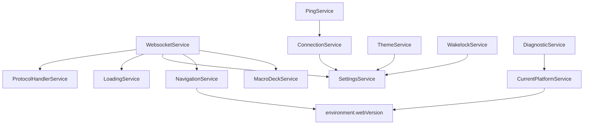

图表来源
- [websocket.service.ts:51-55](file://src/app/services/websocket/websocket.service.ts#L51-55)
- [ping.service.ts:29-30](file://src/app/services/ping/ping.service.ts#L29-30)
- [connection.service.ts:15-16](file://src/app/services/connection/connection.service.ts#L15-16)
- [theme.service.ts](file://src/app/services/theme/theme.service.ts#L11)
- [wakelock.service.ts](file://src/app/services/wakelock/wakelock.service.ts#L15)
- [navigation.service.ts](file://src/app/services/navigation/navigation.service.ts#L16)
- [current-platform.service.ts](file://src/app/services/current-platform/current-platform.service.ts#L12)
- [diagnostic.service.ts](file://src/app/services/diagnostic/diagnostic.service.ts#L12)

## 详细组件分析

### ConnectionService 分析
- 设计要点
  - 以本地存储键名统一管理连接列表
  - 与SettingsService协作生成USB连接配置
  - 提供原子化的增删改查操作
- 数据结构
  - Connection接口字段：id、name、host、port、ssl、index、autoConnect、usbConnection、token
- 错误处理
  - 存储为空时返回空数组
  - 删除不存在id时不改变列表
- 性能与复杂度
  - 查询：O(n log n)（排序），其余O(n)
  - 更新：O(n)（查找+替换/追加）

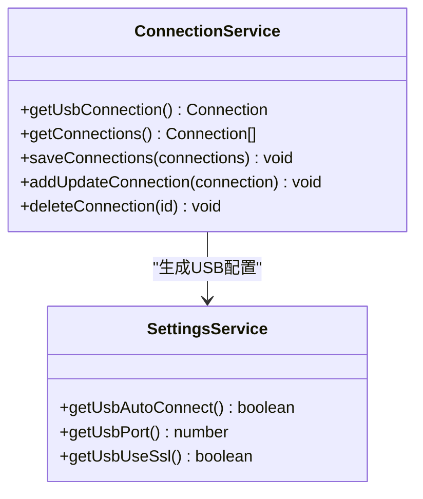

图表来源
- [connection.service.ts:18-101](file://src/app/services/connection/connection.service.ts#L18-101)
- [settings.service.ts:84-94](file://src/app/services/settings/settings.service.ts#L84-94)

章节来源
- [connection.service.ts:18-101](file://src/app/services/connection/connection.service.ts#L18-101)
- [connection.ts:1-33](file://src/app/datatypes/connection.ts#L1-L33)

### SettingsService 分析
- 设计要点
  - 以键值对形式封装各类配置项
  - 提供默认值回退策略
  - 生成并缓存客户端唯一ID
- 配置项概览
  - 外观主题、菜单按钮可见性、SSL校验跳过、屏幕方向、按钮长按延迟、唤醒锁、USB连接参数、按钮微件边框样式、连接计数、最后连接ID、客户端ID
- 使用建议
  - 所有读取操作均应先确保ID生成完成（内部已处理）
  - 写入操作为异步，注意调用顺序

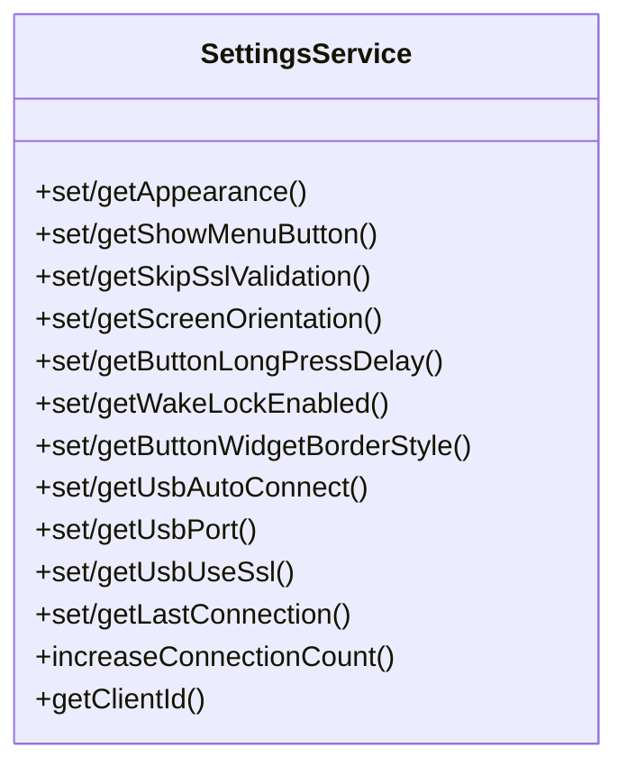

图表来源
- [settings.service.ts:26-389](file://src/app/services/settings/settings.service.ts#L26-389)

章节来源
- [settings.service.ts:26-389](file://src/app/services/settings/settings.service.ts#L26-389)
- [appearance-type.ts:1-15](file://src/app/enums/appearance-type.ts#L1-L15)
- [screen-orientation-type.ts:1-21](file://src/app/enums/screen-orientation-type.ts#L1-L21)

### MacroDeckService 分析
- 设计要点
  - 通过事件驱动配置更新与交互事件
  - 维护面板布局参数与微件列表
- 状态同步
  - setConfig触发configUpdate事件
  - updateWidget按坐标更新或追加微件

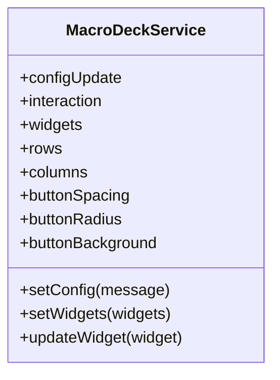

图表来源
- [macro-deck.service.ts:10-111](file://src/app/services/macro-deck/macro-deck.service.ts#L10-111)

章节来源
- [macro-deck.service.ts:10-111](file://src/app/services/macro-deck/macro-deck.service.ts#L10-111)

### NavigationService 分析
- 设计要点
  - 根据web/native版本选择不同首页组件
  - 通过ion-nav进行页面切换
- 依赖
  - environment.webVersion
  - 页面组件类型（Home/Deck/ConnectionLost）

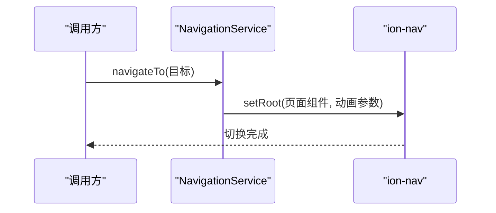

图表来源
- [navigation.service.ts:24-46](file://src/app/services/navigation/navigation.service.ts#L24-46)
- [navigation-destination.ts:1-15](file://src/app/enums/navigation-destination.ts#L1-L15)

章节来源
- [navigation.service.ts:13-86](file://src/app/services/navigation/navigation.service.ts#L13-86)
- [navigation-destination.ts:1-15](file://src/app/enums/navigation-destination.ts#L1-L15)

### WebsocketService 分析
- 设计要点
  - 管理连接生命周期（连接、关闭、错误）
  - 与协议处理器解耦，消息分发由协议层处理
  - 连接成功后发送“已连接”握手消息
- 事件流
  - opened: 更新状态、记录连接统计、发送握手消息
  - closed: 触发事件、导航或发出失败事件
  - error: 处理安全错误（如证书问题）

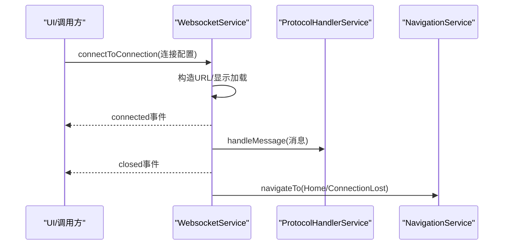

图表来源
- [websocket.service.ts:59-191](file://src/app/services/websocket/websocket.service.ts#L59-191)
- [websocket.service.ts:332-393](file://src/app/services/websocket/websocket.service.ts#L332-393)

章节来源
- [websocket.service.ts:20-402](file://src/app/services/websocket/websocket.service.ts#L20-402)

### PingService 分析
- 设计要点
  - 并行监控USB与网络连接可用性
  - 使用RxJS定时请求与超时控制
  - 维护可用连接集合与USB可用标志
- 算法流程

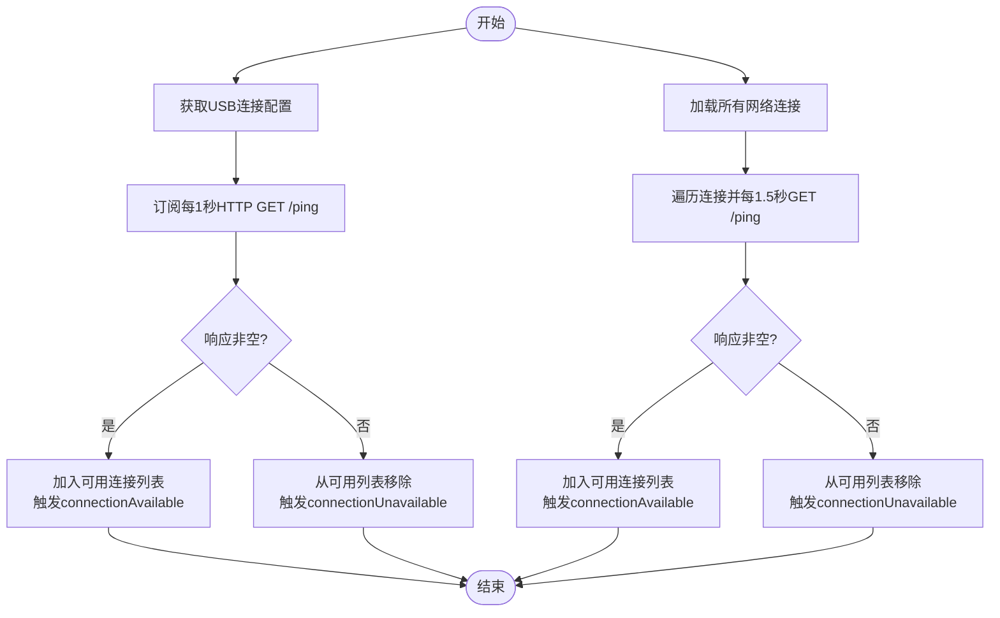

图表来源
- [ping.service.ts:36-128](file://src/app/services/ping/ping.service.ts#L36-128)
- [connection.service.ts:18-50](file://src/app/services/connection/connection.service.ts#L18-50)

章节来源
- [ping.service.ts:13-228](file://src/app/services/ping/ping.service.ts#L13-228)
- [connection.service.ts:18-101](file://src/app/services/connection/connection.service.ts#L18-101)

### LoadingService 分析
- 设计要点
  - 单例弹窗管理，避免叠加
  - 提供canceled事件供外部中断连接流程
  - 禁止点击背景关闭，保证流程可控

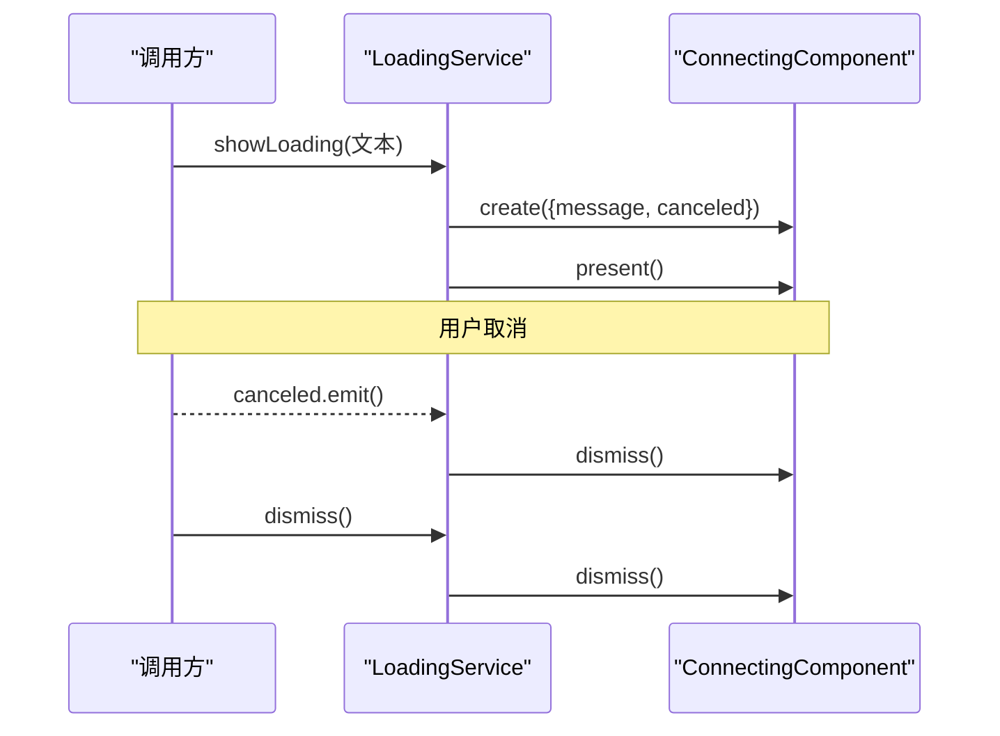

图表来源
- [loading.service.ts:20-48](file://src/app/services/loading/loading.service.ts#L20-48)

章节来源
- [loading.service.ts:9-87](file://src/app/services/loading/loading.service.ts#L9-87)

### ThemeService 分析
- 设计要点
  - 支持跟随系统深色模式、强制深色、强制浅色
  - 注册/注销系统媒体查询监听器
- 依赖
  - SettingsService获取外观设置

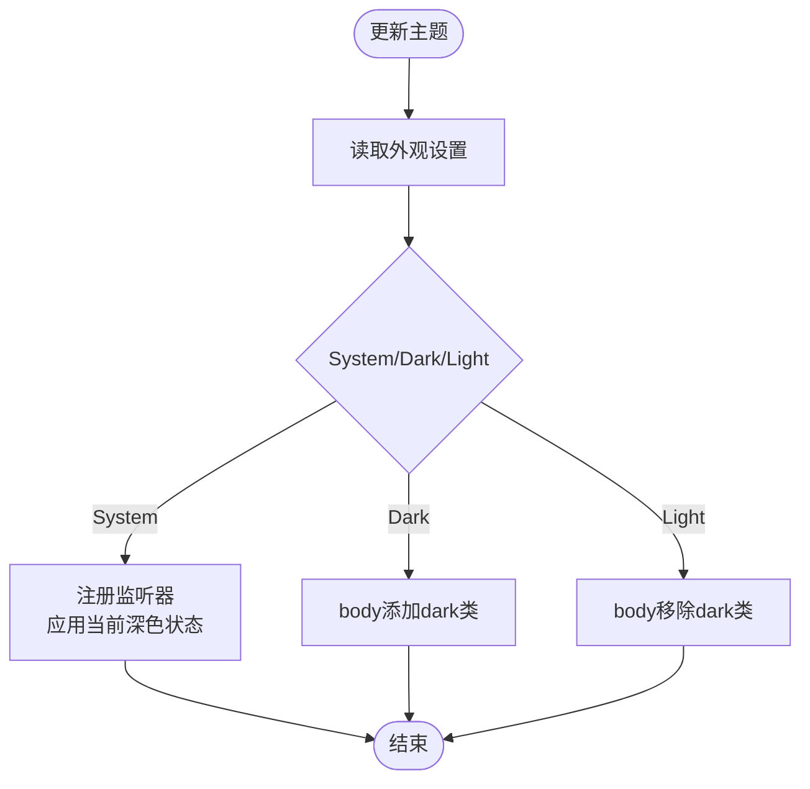

图表来源
- [theme.service.ts:16-39](file://src/app/services/theme/theme.service.ts#L16-39)
- [settings.service.ts:96-110](file://src/app/services/settings/settings.service.ts#L96-110)

章节来源
- [theme.service.ts:9-104](file://src/app/services/theme/theme.service.ts#L9-104)
- [appearance-type.ts:1-15](file://src/app/enums/appearance-type.ts#L1-L15)

### WakelockService 分析
- 设计要点
  - 优先使用原生KeepAwake，回退到NoSleep.js
  - 捕获浏览器需要用户交互的异常
- 依赖
  - SettingsService获取唤醒锁开关

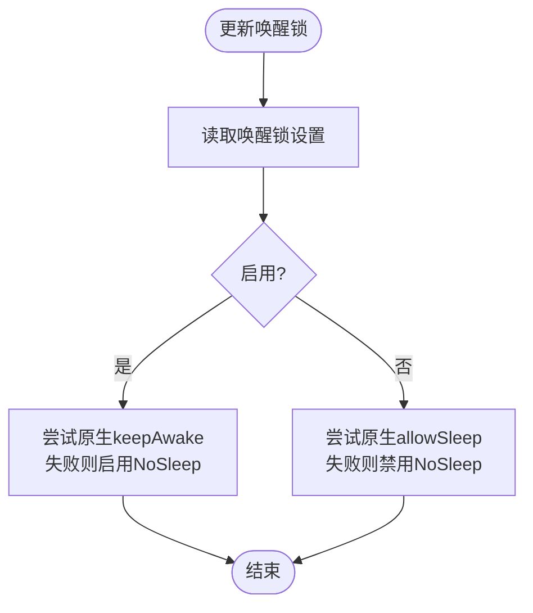

图表来源
- [wakelock.service.ts:18-58](file://src/app/services/wakelock/wakelock.service.ts#L18-58)
- [settings.service.ts:192-206](file://src/app/services/settings/settings.service.ts#L192-206)

章节来源
- [wakelock.service.ts:10-105](file://src/app/services/wakelock/wakelock.service.ts#L10-105)

### CurrentPlatformService 与 DiagnosticService 分析
- 设计要点
  - CurrentPlatformService：区分native/browser
  - DiagnosticService：版本号、Android Oreo检测、平台判断

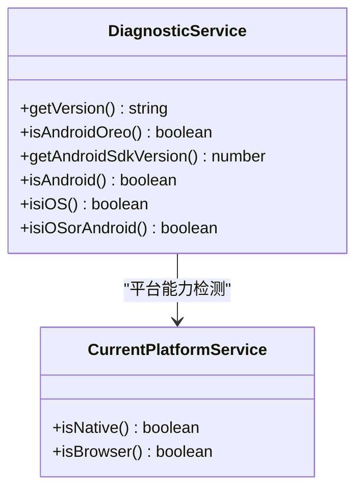

图表来源
- [current-platform.service.ts:8-77](file://src/app/services/current-platform/current-platform.service.ts#L8-77)
- [diagnostic.service.ts:10-147](file://src/app/services/diagnostic/diagnostic.service.ts#L10-147)

章节来源
- [current-platform.service.ts:8-77](file://src/app/services/current-platform/current-platform.service.ts#L8-77)
- [diagnostic.service.ts:10-147](file://src/app/services/diagnostic/diagnostic.service.ts#L10-147)

## 依赖分析
- 低耦合高内聚
  - 各服务职责清晰，通过SettingsService统一读写配置
- 关键依赖链
  - WebsocketService → SettingsService/NavigationService/LoadingService/ProtocolHandlerService
  - PingService → ConnectionService
  - ConnectionService → SettingsService
  - ThemeService/WakelockService → SettingsService
  - NavigationService → environment.webVersion
- 潜在循环依赖
  - 未发现直接循环依赖；事件发布订阅避免了强耦合

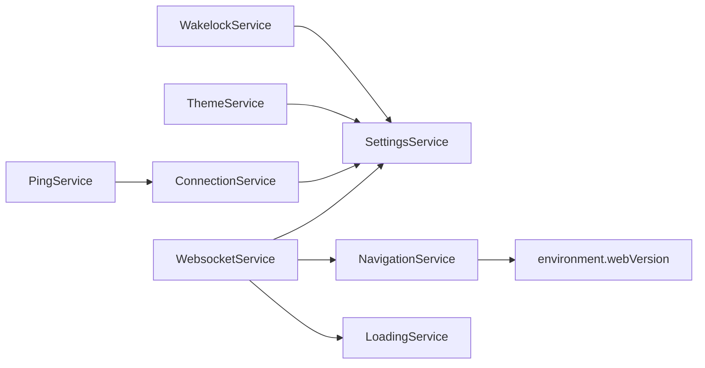

图表来源
- [websocket.service.ts:51-55](file://src/app/services/websocket/websocket.service.ts#L51-55)
- [ping.service.ts:29-30](file://src/app/services/ping/ping.service.ts#L29-30)
- [connection.service.ts:15-16](file://src/app/services/connection/connection.service.ts#L15-16)
- [navigation.service.ts](file://src/app/services/navigation/navigation.service.ts#L16)
- [theme.service.ts](file://src/app/services/theme/theme.service.ts#L11)
- [wakelock.service.ts](file://src/app/services/wakelock/wakelock.service.ts#L15)

章节来源
- [websocket.service.ts:20-402](file://src/app/services/websocket/websocket.service.ts#L20-402)
- [ping.service.ts:13-228](file://src/app/services/ping/ping.service.ts#L13-228)
- [connection.service.ts:10-179](file://src/app/services/connection/connection.service.ts#L10-179)
- [settings.service.ts:26-389](file://src/app/services/settings/settings.service.ts#L26-389)
- [navigation.service.ts:13-86](file://src/app/services/navigation/navigation.service.ts#L13-86)
- [theme.service.ts:9-104](file://src/app/services/theme/theme.service.ts#L9-104)
- [wakelock.service.ts:10-105](file://src/app/services/wakelock/wakelock.service.ts#L10-105)

## 性能考虑
- 连接探测
  - PingService对USB与网络分别设定不同轮询间隔，减少不必要的负载
- WebSocket
  - 使用RxJS的timeout与catchError避免阻塞；错误时及时释放订阅
- 主题与唤醒锁
  - 仅在设置变更时触发更新，避免频繁DOM操作
- 存储访问
  - ConnectionService批量读写JSON，建议在UI批处理时合并调用

## 故障排查指南
- 连接失败
  - 检查WebsocketService的connectionFailed事件参数，定位关闭码与原因
  - 若为安全错误（如证书问题），会弹出不安全连接提示
- 连接丢失
  - Web版直接触发connectionLost事件；原生版根据状态导航到ConnectionLost页面
- 加载弹窗无法关闭
  - 确认canceled事件是否正确传播；LoadingService会捕获异常并记录日志
- Ping检测不生效
  - 确认ConnectionService返回的连接列表与SettingsService的USB参数
  - 检查HTTP GET /ping可达性与超时阈值
- 主题不生效
  - 确认SettingsService的外观设置值；System模式需系统深色模式媒体查询支持
- 唤醒锁无效
  - 浏览器环境下需用户交互才能启用；捕获异常属预期行为

章节来源
- [websocket.service.ts:194-219](file://src/app/services/websocket/websocket.service.ts#L194-219)
- [websocket.service.ts:374-393](file://src/app/services/websocket/websocket.service.ts#L374-393)
- [loading.service.ts:20-48](file://src/app/services/loading/loading.service.ts#L20-48)
- [ping.service.ts:79-128](file://src/app/services/ping/ping.service.ts#L79-128)
- [theme.service.ts:16-39](file://src/app/services/theme/theme.service.ts#L16-39)
- [wakelock.service.ts:18-58](file://src/app/services/wakelock/wakelock.service.ts#L18-58)

## 结论
该服务层以轻量、可测试的方式实现了连接管理、配置持久化、主题与平台适配、实时通信与状态同步等功能。通过明确的事件契约与依赖注入，既保证了模块内聚，又提供了良好的扩展空间。建议在后续迭代中：
- 将部分配置项迁移到集中式配置管理器
- 对高频存储操作增加去抖/节流
- 补充单元测试覆盖关键分支与边界条件

## 附录
- 初始化与配置管理最佳实践
  - 应用启动时优先调用SettingsService的getClientId()以确保ID生成
  - 在UI初始化阶段调用ThemeService.updateTheme()与WakelockService.updateWakeLock()
  - 启动PingService.start()以预热可用连接列表
- 状态同步建议
  - 使用MacroDeckService的事件驱动模式，避免直接修改共享状态
  - WebSocket消息到达后统一交由协议处理器分发
- 扩展与自定义服务开发指导
  - 遵循单一职责：每个服务只负责一类功能
  - 明确依赖：尽量通过构造函数注入，避免全局状态
  - 事件化通信：对外暴露EventEmitter，内部通过服务间调用
  - 可测试性：为服务编写简单工厂方法或Mock，便于单元测试
  - 文档化：为公共方法补充简要注释，说明输入输出与副作用