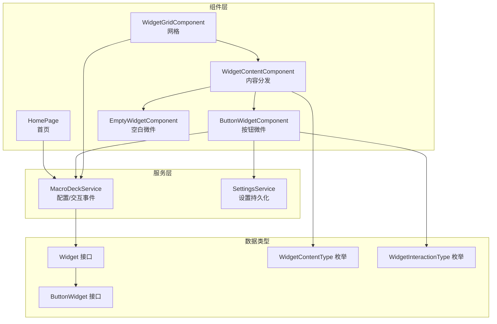
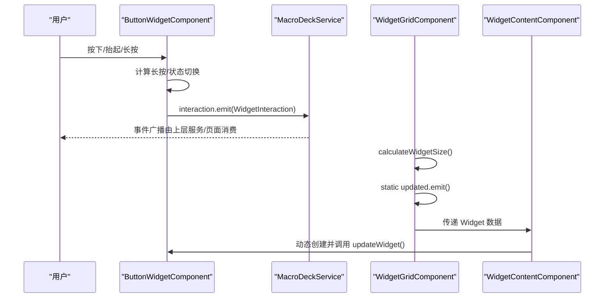
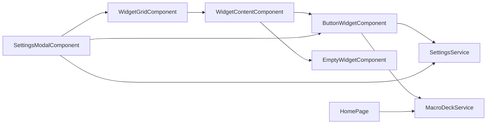

# 组件API

<cite>
**本文档引用的文件**
- [button-widget.component.ts](file://src/app/widget-content-components/button-widget/button-widget.component.ts)
- [button-widget.component.html](file://src/app/widget-content-components/button-widget/button-widget.component.html)
- [button-widget-border-style.ts](file://src/app/widget-content-components/button-widget/button-widget-border-style.ts)
- [widget-grid.component.ts](file://src/app/pages/deck/widget-grid/widget-grid.component.ts)
- [widget-grid.component.html](file://src/app/pages/deck/widget-grid/widget-grid.component.html)
- [widget-content.component.ts](file://src/app/pages/deck/widget-grid/widget-content/widget-content.component.ts)
- [empty-widget.component.ts](file://src/app/widget-content-components/empty-widget/empty-widget.component.ts)
- [home.page.ts](file://src/app/pages/home/home.page.ts)
- [home.page.html](file://src/app/pages/home/home.page.html)
- [macro-deck.service.ts](file://src/app/services/macro-deck/macro-deck.service.ts)
- [settings-modal.component.ts](file://src/app/pages/shared/modals/settings-modal/settings-modal.component.ts)
- [settings-modal.component.html](file://src/app/pages/shared/modals/settings-modal/settings-modal.component.html)
- [settings.service.ts](file://src/app/services/settings/settings.service.ts)
- [widget.ts](file://src/app/datatypes/widgets/widget.ts)
- [button-widget.ts](file://src/app/datatypes/widgets/button-widget.ts)
- [widget-interaction-type.ts](file://src/app/enums/widget-interaction-type.ts)
- [widget-content-type.ts](file://src/app/enums/widget-content-type.ts)
</cite>

## 目录
1. [简介](#简介)
2. [项目结构](#项目结构)
3. [核心组件](#核心组件)
4. [架构总览](#架构总览)
5. [组件详细分析](#组件详细分析)
6. [依赖关系分析](#依赖关系分析)
7. [性能考量](#性能考量)
8. [故障排查指南](#故障排查指南)
9. [结论](#结论)
10. [附录](#附录)

## 简介
本文件面向开发者与集成者，系统化梳理 Macro Deck 客户端应用中的组件API，重点覆盖以下组件：
- ButtonWidgetComponent：按钮型微件渲染与交互
- WidgetGridComponent：微件网格布局与尺寸计算
- WidgetContentComponent：微件内容动态分发
- EmptyWidgetComponent：空白微件占位
- HomePage：首页连接管理与导航入口
- MacroDeckService：微件配置与交互事件总线
- SettingsModalComponent 与 SettingsService：设置项持久化与应用

文档涵盖各组件的公共接口（输入/输出、事件）、生命周期方法、状态管理、事件处理机制、组件间通信、数据绑定与样式定制要点，并提供扩展与自定义组件开发建议及使用示例。

## 项目结构
组件与数据模型主要分布在如下目录：
- 组件层：widget-content-components、pages/deck/widget-grid、pages/home、pages/shared/modals
- 数据类型：datatypes/widgets 及枚举
- 服务层：services 下各子服务（macro-deck、settings、websocket 等）

图表来源
- [home.page.ts:1-551](file://src/app/pages/home/home.page.ts#L1-L551)
- [widget-grid.component.ts:1-335](file://src/app/pages/deck/widget-grid/widget-grid.component.ts#L1-L335)
- [widget-content.component.ts:1-152](file://src/app/pages/deck/widget-grid/widget-content/widget-content.component.ts#L1-L152)
- [button-widget.component.ts:1-393](file://src/app/widget-content-components/button-widget/button-widget.component.ts#L1-L393)
- [empty-widget.component.ts:1-57](file://src/app/widget-content-components/empty-widget/empty-widget.component.ts#L1-L57)
- [macro-deck.service.ts:1-111](file://src/app/services/macro-deck/macro-deck.service.ts#L1-L111)
- [settings.service.ts:1-35](file://src/app/services/settings/settings.service.ts#L1-L35)
- [widget.ts:1-33](file://src/app/datatypes/widgets/widget.ts#L1-L33)
- [button-widget.ts:1-16](file://src/app/datatypes/widgets/button-widget.ts#L1-L16)
- [widget-content-type.ts:1-12](file://src/app/enums/widget-content-type.ts#L1-L12)
- [widget-interaction-type.ts:1-18](file://src/app/enums/widget-interaction-type.ts#L1-L18)

章节来源
- [widget-grid.component.ts:1-335](file://src/app/pages/deck/widget-grid/widget-grid.component.ts#L1-L335)
- [widget-content.component.ts:1-152](file://src/app/pages/deck/widget-grid/widget-content/widget-content.component.ts#L1-L152)
- [button-widget.component.ts:1-393](file://src/app/widget-content-components/button-widget/button-widget.component.ts#L1-L393)
- [empty-widget.component.ts:1-57](file://src/app/widget-content-components/empty-widget/empty-widget.component.ts#L1-L57)
- [home.page.ts:1-551](file://src/app/pages/home/home.page.ts#L1-L551)
- [macro-deck.service.ts:1-111](file://src/app/services/macro-deck/macro-deck.service.ts#L1-L111)
- [settings.service.ts:1-35](file://src/app/services/settings/settings.service.ts#L1-L35)
- [widget.ts:1-33](file://src/app/datatypes/widgets/widget.ts#L1-L33)
- [button-widget.ts:1-16](file://src/app/datatypes/widgets/button-widget.ts#L1-L16)
- [widget-content-type.ts:1-12](file://src/app/enums/widget-content-type.ts#L1-L12)
- [widget-interaction-type.ts:1-18](file://src/app/enums/widget-interaction-type.ts#L1-L18)

## 核心组件
本节对关键组件进行API级梳理，包括输入/输出属性、事件、方法与生命周期。

- ButtonWidgetComponent
  - 输入属性
    - updateWidget(widget: Widget): void —— 更新渲染数据（图标/Base64、前景图/Base64、背景色、边框样式）
    - updateSelf(): Promise<void> —— 基于当前 widget 重新渲染
  - 事件
    - 通过 MacroDeckService.interaction.emit 触发交互事件（按下、短按释放、长按、长按释放）
  - 生命周期
    - ngOnInit(): 订阅 WidgetGridComponent.updated 与 SettingsModalComponent.settingsApplied，触发重绘
    - ngOnDestroy(): 取消订阅
  - 方法
    - onMouseDown(event): 启动长按计时器，添加按下样式，发送 ButtonPress
    - onMouseUp(event): 根据是否长按触发短按/长按释放事件，清理状态
    - onMouseLeave(event): 离开时视为释放
    - setClass(target, className, value): 安全增删CSS类
    - adjustColor(color, amount): 调整十六进制颜色明暗
    - setBorderStyle(style): 根据设置应用边框样式
  - 关键依赖
    - MacroDeckService.interaction
    - SettingsService（读取按钮长按延迟、边框样式）
    - DomSanitizer（Base64 资源URL）
    - WidgetGridComponent（静态属性：borderRadiusPoints；静态事件：updated）

- WidgetGridComponent
  - 输入属性
    - 无公开输入属性
  - 输出事件
    - static updated: EventEmitter<any> —— 布局更新时广播
  - 方法
    - calculateWidgetSize(): void —— 计算按钮尺寸、间距、圆角，并触发 updated
    - getWidgetStyle(index: number): any —— 返回绝对定位样式（宽高、top/left）
    - getWidgetContentStyle(): any —— 返回内容边距样式
    - getWidgetFromIndex(index: number): Widget | undefined —— 获取网格位置的微件或默认空白微件
    - countTotalWidgets(): number —— 返回总微件数
  - 生命周期
    - ngAfterContentInit(): 订阅 MacroDeckService.configUpdate，监听窗口resize，初始延迟计算
    - ngOnDestroy(): 取消订阅
  - 关键依赖
    - MacroDeckService（rows/columns/widgets 等配置）
    - ApplicationRef.tick（强制变更检测）

- WidgetContentComponent
  - 输入属性
    - data: Widget | undefined —— 设置后自动更新内容组件
  - 输出事件
    - 无公开输出事件
  - 方法
    - updateContent(data: Widget | undefined): void —— 根据 WidgetContentType 动态创建并更新子组件（EmptyWidget 或 ButtonWidget）
  - 生命周期
    - ngOnDestroy(): 取消订阅
  - 关键依赖
    - ViewContainerRef 动态创建组件
    - ButtonWidgetComponent、EmptyWidgetComponent

- EmptyWidgetComponent
  - 输入属性
    - updateWidget(widget: Widget): void —— 更新背景色
  - 输出事件
    - 无公开输出事件
  - 方法
    - 无公开方法
  - 生命周期
    - 无

- HomePage
  - 输入属性
    - 无公开输入属性
  - 输出事件
    - 无公开输出事件
  - 生命周期
    - ngOnInit(): 初始化 clientId/version
    - ionViewWillEnter(): 同步可用连接状态
    - ionViewDidEnter(): 订阅 Ping/WebSocket 事件，启动 Ping
    - ionViewDidLeave(): 停止 Ping，取消订阅
  - 方法
    - openAddConnectionModal(existingConnection?, quickSetupQrCodeData?): Promise<void> —— 打开新增/编辑连接弹窗
    - handleReorder(event): Promise<void> —— 重排连接顺序并保存
    - deleteConnection(connection): Promise<void> —— 删除连接（带确认）
    - editConnection(connection): Promise<void> —— 打开编辑弹窗
    - connect(connection): Promise<void> —— 建立 WebSocket 连接
    - connectUsb(): Promise<void> —— 通过 USB 连接
    - openSettings(): Promise<void> —— 打开设置弹窗并重启 Ping
    - showDonateButton(): boolean —— iOS 不显示捐赠按钮
    - openDonate(): void —— 打开捐赠链接
  - 关键依赖
    - ConnectionService、WebSocketService、PingService、SettingsService、DiagnosticService、WakeLockService
    - ModalController、AlertController

- MacroDeckService
  - 输入属性
    - 无公开输入属性
  - 输出事件
    - @Output() configUpdate: EventEmitter<any> —— 配置更新事件
    - @Output() interaction: EventEmitter<WidgetInteraction> —— 用户交互事件（按钮按下/长按等）
  - 属性
    - widgets: Widget[]
    - rows: number
    - columns: number
    - buttonSpacing: number
    - buttonRadius: number
    - buttonBackground: boolean
  - 方法
    - setConfig(message: any): void —— 设置面板配置并触发 configUpdate
    - setWidgets(widgets: Widget[]): void —— 设置完整微件列表
    - updateWidget(widget: Widget): void —— 更新或追加单个微件

- SettingsModalComponent 与 SettingsService
  - SettingsModalComponent
    - 保存设置并调用 SettingsService 持久化，随后发出 settingsApplied 事件
  - SettingsService
    - 提供 get/set 方法读写各类设置项（如按钮长按延迟、边框样式等）

章节来源
- [button-widget.component.ts:1-393](file://src/app/widget-content-components/button-widget/button-widget.component.ts#L1-L393)
- [widget-grid.component.ts:1-335](file://src/app/pages/deck/widget-grid/widget-grid.component.ts#L1-L335)
- [widget-content.component.ts:1-152](file://src/app/pages/deck/widget-grid/widget-content/widget-content.component.ts#L1-L152)
- [empty-widget.component.ts:1-57](file://src/app/widget-content-components/empty-widget/empty-widget.component.ts#L1-L57)
- [home.page.ts:1-551](file://src/app/pages/home/home.page.ts#L1-L551)
- [macro-deck.service.ts:1-111](file://src/app/services/macro-deck/macro-deck.service.ts#L1-L111)
- [settings-modal.component.ts:92-250](file://src/app/pages/shared/modals/settings-modal/settings-modal.component.ts#L92-L250)
- [settings.service.ts:1-35](file://src/app/services/settings/settings.service.ts#L1-L35)

## 架构总览
组件间通信与数据流概览如下：

图表来源
- [button-widget.component.ts:1-393](file://src/app/widget-content-components/button-widget/button-widget.component.ts#L1-L393)
- [macro-deck.service.ts:1-111](file://src/app/services/macro-deck/macro-deck.service.ts#L1-L111)
- [widget-grid.component.ts:1-335](file://src/app/pages/deck/widget-grid/widget-grid.component.ts#L1-L335)
- [widget-content.component.ts:1-152](file://src/app/pages/deck/widget-grid/widget-content/widget-content.component.ts#L1-L152)

## 组件详细分析

### ButtonWidgetComponent API 规范
- 输入
  - updateWidget(widget: Widget): void
  - updateSelf(): Promise<void>
- 输出
  - 通过 MacroDeckService.interaction.emit 发出交互事件
- 事件
  - 按下：WidgetInteractionType.ButtonPress
  - 短按释放：WidgetInteractionType.ButtonShortPressRelease
  - 长按：WidgetInteractionType.ButtonLongPress
  - 长按释放：WidgetInteractionType.ButtonLongPressRelease
- 生命周期
  - ngOnInit(): 订阅 WidgetGridComponent.updated 与 SettingsModalComponent.settingsApplied
  - ngOnDestroy(): 取消订阅
- 方法
  - onMouseDown(event): 添加按下样式，发送 ButtonPress，启动长按计时器
  - onMouseUp(event): 根据长按标志发送短按/长按释放事件，清理状态
  - onMouseLeave(event): 离开时视为释放
  - setClass(target, className, value): 安全增删CSS类
  - adjustColor(color, amount): 颜色明暗调整
  - setBorderStyle(style): 应用边框样式（None/Colored）
- 样式定制
  - 背景色来自 widget.backgroundColorHex
  - 边框样式来自 SettingsService.getButtonWidgetBorderStyle()
  - 圆角半径来自 WidgetGridComponent.borderRadiusPoints
- HTML 结构
  - 支持前景图与图标图层叠加，背景层用于填充色

章节来源
- [button-widget.component.ts:1-393](file://src/app/widget-content-components/button-widget/button-widget.component.ts#L1-L393)
- [button-widget.component.html:1-14](file://src/app/widget-content-components/button-widget/button-widget.component.html#L1-L14)
- [button-widget-border-style.ts:1-12](file://src/app/widget-content-components/button-widget/button-widget-border-style.ts#L1-L12)
- [widget-grid.component.ts:1-335](file://src/app/pages/deck/widget-grid/widget-grid.component.ts#L1-L335)
- [macro-deck.service.ts:1-111](file://src/app/services/macro-deck/macro-deck.service.ts#L1-L111)
- [settings.service.ts:1-35](file://src/app/services/settings/settings.service.ts#L1-L35)

### WidgetGridComponent API 规范
- 输入
  - 无公开输入属性
- 输出
  - static updated: EventEmitter<any>
- 方法
  - calculateWidgetSize(): void —— 计算按钮尺寸、间距、圆角并触发更新
  - getWidgetStyle(index: number): any —— 返回定位样式（width/height/top/left）
  - getWidgetContentStyle(): any —— 返回内容边距样式
  - getWidgetFromIndex(index: number): Widget | undefined —— 获取网格位置微件或默认空白微件
  - countTotalWidgets(): number —— 总微件数
- 生命周期
  - ngAfterContentInit(): 订阅配置更新与窗口resize，初始延迟计算
  - ngOnDestroy(): 取消订阅
- 数据来源
  - rows/columns/widgets 来自 MacroDeckService
  - borderRadiusPoints 作为静态属性供子组件使用

章节来源
- [widget-grid.component.ts:1-335](file://src/app/pages/deck/widget-grid/widget-grid.component.ts#L1-L335)
- [widget-grid.component.html:1-13](file://src/app/pages/deck/widget-grid/widget-grid.component.html#L1-L13)
- [macro-deck.service.ts:1-111](file://src/app/services/macro-deck/macro-deck.service.ts#L1-L111)

### WidgetContentComponent API 规范
- 输入
  - data: Widget | undefined —— 自动更新内容组件
- 输出
  - 无公开输出事件
- 方法
  - updateContent(data: Widget | undefined): void —— 根据 WidgetContentType 动态创建并更新子组件
- 生命周期
  - ngOnDestroy(): 取消订阅
- 动态组件映射
  - WidgetContentType.empty -> EmptyWidgetComponent
  - WidgetContentType.button -> ButtonWidgetComponent

章节来源
- [widget-content.component.ts:1-152](file://src/app/pages/deck/widget-grid/widget-content/widget-content.component.ts#L1-L152)

### EmptyWidgetComponent API 规范
- 输入
  - updateWidget(widget: Widget): void —— 更新背景色
- 输出
  - 无公开输出事件
- 方法
  - 无公开方法
- 生命周期
  - 无

章节来源
- [empty-widget.component.ts:1-57](file://src/app/widget-content-components/empty-widget/empty-widget.component.ts#L1-L57)

### HomePage API 规范
- 输入
  - 无公开输入属性
- 输出
  - 无公开输出事件
- 生命周期
  - ngOnInit(): 初始化 clientId/version
  - ionViewWillEnter(): 同步可用连接状态
  - ionViewDidEnter(): 订阅 Ping/WebSocket 事件，启动 Ping
  - ionViewDidLeave(): 停止 Ping，取消订阅
- 方法
  - openAddConnectionModal(existingConnection?, quickSetupQrCodeData?): Promise<void>
  - handleReorder(event): Promise<void>
  - deleteConnection(connection): Promise<void>
  - editConnection(connection): Promise<void>
  - connect(connection): Promise<void>
  - connectUsb(): Promise<void>
  - openSettings(): Promise<void>
  - showDonateButton(): boolean
  - openDonate(): void
- 关键依赖
  - ConnectionService、WebSocketService、PingService、SettingsService、DiagnosticService、WakeLockService、ModalController、AlertController

章节来源
- [home.page.ts:1-551](file://src/app/pages/home/home.page.ts#L1-L551)
- [home.page.html:1-123](file://src/app/pages/home/home.page.html#L1-L123)

### MacroDeckService API 规范
- 输入
  - 无公开输入属性
- 输出
  - @Output() configUpdate: EventEmitter<any>
  - @Output() interaction: EventEmitter<WidgetInteraction>
- 属性
  - widgets: Widget[]
  - rows: number
  - columns: number
  - buttonSpacing: number
  - buttonRadius: number
  - buttonBackground: boolean
- 方法
  - setConfig(message: any): void
  - setWidgets(widgets: Widget[]): void
  - updateWidget(widget: Widget): void

章节来源
- [macro-deck.service.ts:1-111](file://src/app/services/macro-deck/macro-deck.service.ts#L1-L111)

### SettingsModalComponent 与 SettingsService
- SettingsModalComponent
  - 保存设置项并通过 SettingsService 持久化，随后发出 settingsApplied 事件
- SettingsService
  - 提供 get/set 方法读写设置项（如按钮长按延迟、边框样式等）

章节来源
- [settings-modal.component.ts:92-250](file://src/app/pages/shared/modals/settings-modal/settings-modal.component.ts#L92-L250)
- [settings-modal.component.html:74-106](file://src/app/pages/shared/modals/settings-modal/settings-modal.component.html#L74-L106)
- [settings.service.ts:1-35](file://src/app/services/settings/settings.service.ts#L1-L35)

## 依赖关系分析
- 组件耦合
  - ButtonWidgetComponent 依赖 MacroDeckService.interaction 与 SettingsService
  - WidgetGridComponent 依赖 MacroDeckService 配置与 ApplicationRef.tick
  - WidgetContentComponent 依赖 WidgetContentType 枚举与动态组件创建
  - HomePage 依赖多个服务（Connection、WebSocket、Ping、Settings、Diagnostic、WakeLock）
- 事件链路
  - WidgetGridComponent.static updated -> ButtonWidgetComponent.updateSelf
  - SettingsModalComponent.settingsApplied -> ButtonWidgetComponent.updateSelf
  - ButtonWidgetComponent.emitInteraction -> MacroDeckService.interaction

图表来源
- [widget-grid.component.ts:1-335](file://src/app/pages/deck/widget-grid/widget-grid.component.ts#L1-L335)
- [widget-content.component.ts:1-152](file://src/app/pages/deck/widget-grid/widget-content/widget-content.component.ts#L1-L152)
- [button-widget.component.ts:1-393](file://src/app/widget-content-components/button-widget/button-widget.component.ts#L1-L393)
- [empty-widget.component.ts:1-57](file://src/app/widget-content-components/empty-widget/empty-widget.component.ts#L1-L57)
- [macro-deck.service.ts:1-111](file://src/app/services/macro-deck/macro-deck.service.ts#L1-L111)
- [settings-modal.component.ts:92-250](file://src/app/pages/shared/modals/settings-modal/settings-modal.component.ts#L92-L250)
- [settings.service.ts:1-35](file://src/app/services/settings/settings.service.ts#L1-L35)
- [home.page.ts:1-551](file://src/app/pages/home/home.page.ts#L1-L551)

## 性能考量
- 布局计算
  - WidgetGridComponent 在窗口 resize 时采用延迟计算，减少频繁重排
  - 使用 ApplicationRef.tick 主动触发变更检测，避免视图不同步
- 交互优化
  - ButtonWidgetComponent 使用长按计时器与状态标记，避免重复触发
  - 通过 setClass 安全增删 CSS 类，降低 DOM 操作成本
- 渲染策略
  - WidgetContentComponent 按需动态创建组件，避免不必要的渲染
  - Base64 图片通过 DomSanitizer 安全注入，避免跨域与安全风险

## 故障排查指南
- 按钮无响应或长按不触发
  - 检查 SettingsService.getButtonLongPressDelay 是否正确读取
  - 确认 ButtonWidgetComponent.onMouseDown 中计时器逻辑执行
- 边框样式未生效
  - 确认 SettingsService.getButtonWidgetBorderStyle 返回值与 ButtonWidgetBorderStyle 枚举一致
  - 检查 WidgetGridComponent.borderRadiusPoints 是否被正确赋值
- 微件布局错乱
  - 检查 WidgetGridComponent.calculateWidgetSize 是否被调用
  - 确认 MacroDeckService.configUpdate 是否触发 updated 事件
- 设置修改后未即时生效
  - 确认 SettingsModalComponent.settingsApplied 是否发出事件
  - 检查 ButtonWidgetComponent.ngOnInit 是否订阅 updated 与 settingsApplied

章节来源
- [button-widget.component.ts:1-393](file://src/app/widget-content-components/button-widget/button-widget.component.ts#L1-L393)
- [widget-grid.component.ts:1-335](file://src/app/pages/deck/widget-grid/widget-grid.component.ts#L1-L335)
- [settings-modal.component.ts:92-250](file://src/app/pages/shared/modals/settings-modal/settings-modal.component.ts#L92-L250)

## 结论
本文档系统化梳理了 Macro Deck 客户端中的核心组件API，明确了输入/输出、事件、生命周期与状态管理机制。通过清晰的组件边界与事件总线，实现了微件渲染、交互与配置的解耦。建议在扩展新组件时遵循现有模式：通过 WidgetContentComponent 动态分发、通过 MacroDeckService 发布事件、通过 SettingsService 管理配置，并在需要时订阅 WidgetGridComponent.updated 以实现响应式更新。

## 附录
- 数据模型
  - Widget：描述微件位置、大小与内容
  - ButtonWidget：按钮型微件内容（图标/Base64、标签/Base64）
  - WidgetContentType：empty/button
  - WidgetInteractionType：按钮交互枚举
- 使用示例与集成模式
  - 新增按钮微件：在 WidgetGridComponent 中放置 Widget，设置 widgetContentType 为 button，填充 ButtonWidget 内容
  - 自定义边框样式：通过 SettingsModalComponent 修改按钮边框样式并保存
  - 处理交互事件：订阅 MacroDeckService.interaction，解析 WidgetInteraction 并执行相应动作
  - 响应布局变化：订阅 WidgetGridComponent.updated，在组件内部调用 updateSelf 以刷新渲染

章节来源
- [widget.ts:1-33](file://src/app/datatypes/widgets/widget.ts#L1-L33)
- [button-widget.ts:1-16](file://src/app/datatypes/widgets/button-widget.ts#L1-L16)
- [widget-content-type.ts:1-12](file://src/app/enums/widget-content-type.ts#L1-L12)
- [widget-interaction-type.ts:1-18](file://src/app/enums/widget-interaction-type.ts#L1-L18)
- [macro-deck.service.ts:1-111](file://src/app/services/macro-deck/macro-deck.service.ts#L1-L111)
- [settings-modal.component.html:74-106](file://src/app/pages/shared/modals/settings-modal/settings-modal.component.html#L74-L106)