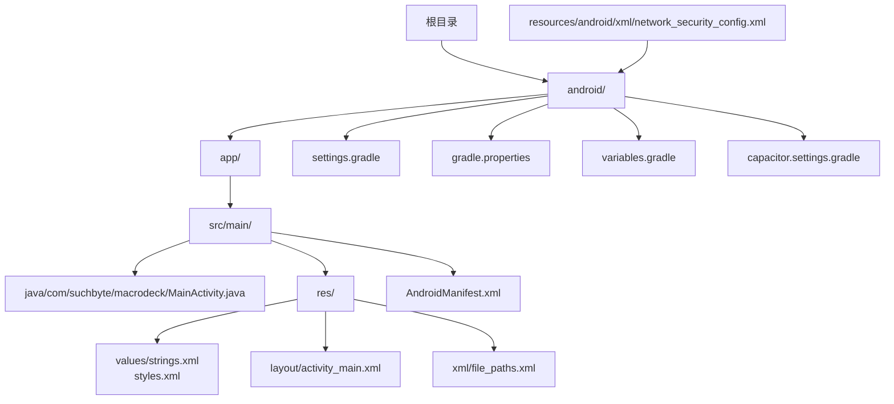
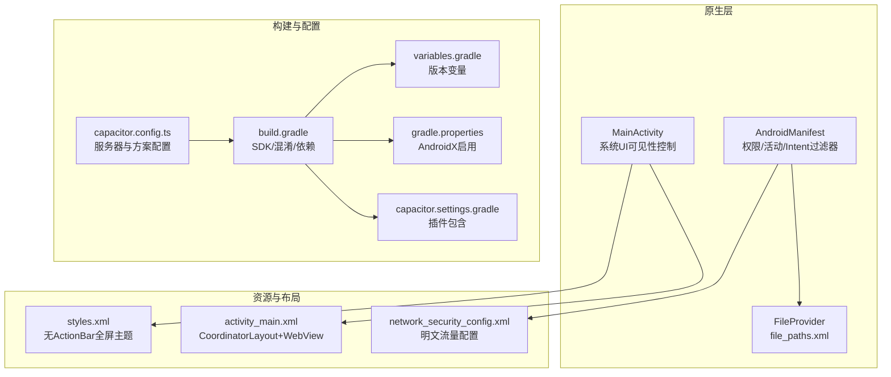
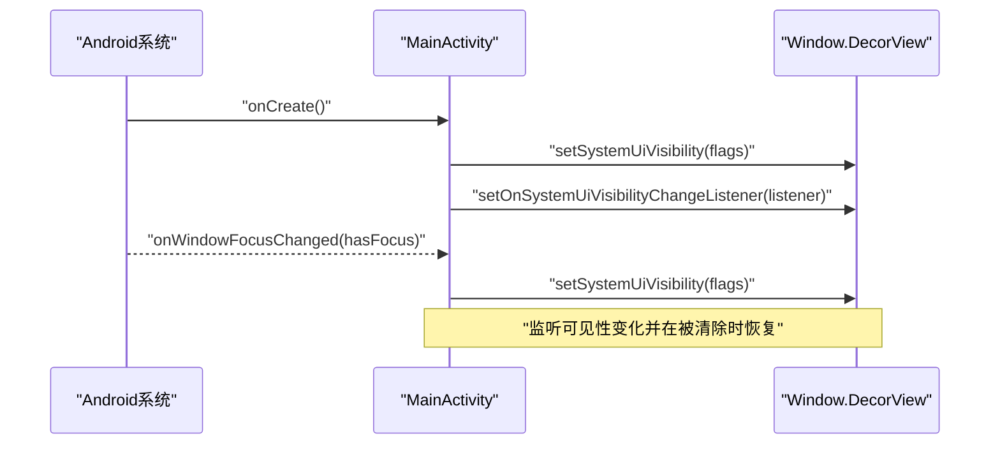
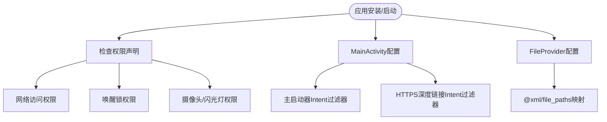
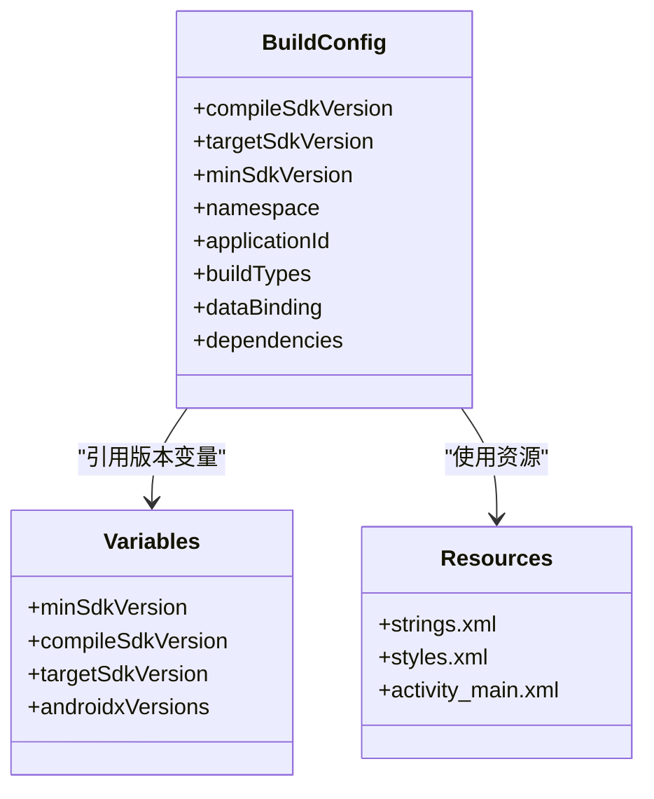
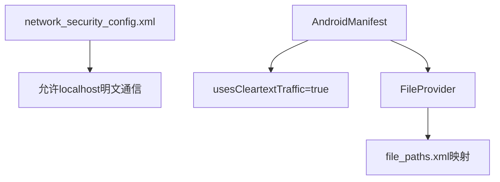
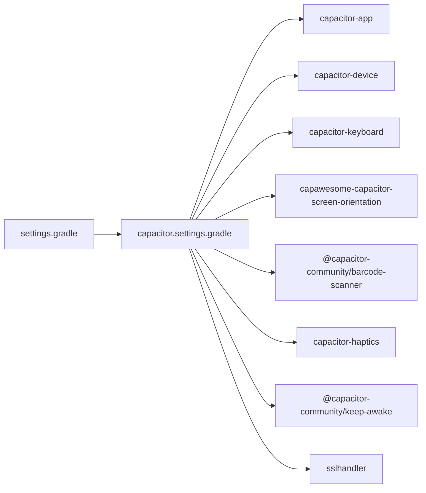
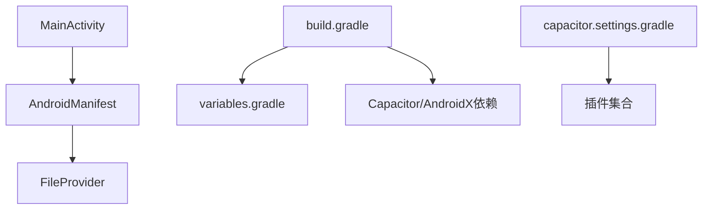

# Android平台集成

<cite>
**本文档引用的文件**
- [MainActivity.java](file://android/app/src/main/java/com/suchbyte/macrodeck/MainActivity.java)
- [AndroidManifest.xml](file://android/app/src/main/AndroidManifest.xml)
- [build.gradle](file://android/app/build.gradle)
- [proguard-rules.pro](file://android/app/proguard-rules.pro)
- [strings.xml](file://android/app/src/main/res/values/strings.xml)
- [styles.xml](file://android/app/src/main/res/values/styles.xml)
- [activity_main.xml](file://android/app/src/main/res/layout/activity_main.xml)
- [file_paths.xml](file://android/app/src/main/res/xml/file_paths.xml)
- [network_security_config.xml](file://resources/android/xml/network_security_config.xml)
- [settings.gradle](file://android/settings.gradle)
- [gradle.properties](file://android/gradle.properties)
- [capacitor.settings.gradle](file://android/capacitor.settings.gradle)
- [variables.gradle](file://android/variables.gradle)
- [capacitor.config.ts](file://capacitor.config.ts)
</cite>

## 目录
1. [简介](#简介)
2. [项目结构](#项目结构)
3. [核心组件](#核心组件)
4. [架构概览](#架构概览)
5. [详细组件分析](#详细组件分析)
6. [依赖关系分析](#依赖关系分析)
7. [性能考虑](#性能考虑)
8. [故障排除指南](#故障排除指南)
9. [结论](#结论)
10. [附录](#附录)

## 简介
本文件面向Android平台集成，围绕Macro-Deck-Client-App的Android子项目进行系统化梳理与说明。重点覆盖以下方面：
- Android项目结构与配置：MainActivity中的系统UI配置与沉浸式体验实现
- 权限声明、应用配置与Intent过滤器设置
- 构建配置（build.gradle）、混淆规则（ProGuard）与资源文件配置
- Android特有能力：系统UI可见性控制、文件路径配置等
- 构建、调试与发布流程
- 权限管理、安全配置与性能优化建议

## 项目结构
Android子项目采用Capacitor框架，基于Gradle多模块工程组织，核心目录与职责如下：
- app：应用主模块，包含Java源码、资源文件、清单文件与构建脚本
- resources/android/xml：网络与安全配置（如明文流量配置）
- .github/workflows：CI/CD工作流定义（复用构建与部署任务）
- capacitor_plugins：自定义Capacitor插件（如SSL处理器）

**图表来源**
- [MainActivity.java:1-38](file://android/app/src/main/java/com/suchbyte/macrodeck/MainActivity.java#L1-L38)
- [AndroidManifest.xml:1-61](file://android/app/src/main/AndroidManifest.xml#L1-L61)
- [build.gradle:1-61](file://android/app/build.gradle#L1-L61)
- [strings.xml:1-8](file://android/app/src/main/res/values/strings.xml#L1-L8)
- [styles.xml:1-16](file://android/app/src/main/res/values/styles.xml#L1-L16)
- [activity_main.xml:1-13](file://android/app/src/main/res/layout/activity_main.xml#L1-L13)
- [file_paths.xml:1-5](file://android/app/src/main/res/xml/file_paths.xml#L1-L5)
- [network_security_config.xml:1-7](file://resources/android/xml/network_security_config.xml#L1-L7)
- [settings.gradle:1-5](file://android/settings.gradle#L1-L5)
- [gradle.properties:1-23](file://android/gradle.properties#L1-L23)
- [capacitor.settings.gradle:1-28](file://android/capacitor.settings.gradle#L1-L28)
- [variables.gradle:1-17](file://android/variables.gradle#L1-L17)

**章节来源**
- [MainActivity.java:1-38](file://android/app/src/main/java/com/suchbyte/macrodeck/MainActivity.java#L1-L38)
- [AndroidManifest.xml:1-61](file://android/app/src/main/AndroidManifest.xml#L1-L61)
- [build.gradle:1-61](file://android/app/build.gradle#L1-L61)
- [strings.xml:1-8](file://android/app/src/main/res/values/strings.xml#L1-L8)
- [styles.xml:1-16](file://android/app/src/main/res/values/styles.xml#L1-L16)
- [activity_main.xml:1-13](file://android/app/src/main/res/layout/activity_main.xml#L1-L13)
- [file_paths.xml:1-5](file://android/app/src/main/res/xml/file_paths.xml#L1-L5)
- [network_security_config.xml:1-7](file://resources/android/xml/network_security_config.xml#L1-L7)
- [settings.gradle:1-5](file://android/settings.gradle#L1-L5)
- [gradle.properties:1-23](file://android/gradle.properties#L1-L23)
- [capacitor.settings.gradle:1-28](file://android/capacitor.settings.gradle#L1-L28)
- [variables.gradle:1-17](file://android/variables.gradle#L1-L17)

## 核心组件
- MainActivity：继承BridgeActivity，负责系统UI可见性控制与沉浸式体验维持；通过监听系统UI可见性变化与窗口焦点变化，确保全屏沉浸状态持续
- AndroidManifest：声明应用权限、特性、活动与Intent过滤器；配置FileProvider用于外部文件分享
- 资源与布局：styles.xml定义无ActionBar主题并启用全屏；activity_main.xml承载WebView容器
- 构建配置：build.gradle定义SDK版本、混淆策略、数据绑定与依赖；variables.gradle集中管理版本变量；gradle.properties启用AndroidX
- 安全配置：network_security_config.xml允许本地localhost明文通信；AndroidManifest中开启usesCleartextTraffic

**章节来源**
- [MainActivity.java:8-37](file://android/app/src/main/java/com/suchbyte/macrodeck/MainActivity.java#L8-L37)
- [AndroidManifest.xml:8-57](file://android/app/src/main/AndroidManifest.xml#L8-L57)
- [styles.xml:5-14](file://android/app/src/main/res/values/styles.xml#L5-L14)
- [activity_main.xml:9-11](file://android/app/src/main/res/layout/activity_main.xml#L9-L11)
- [build.gradle:3-49](file://android/app/build.gradle#L3-L49)
- [variables.gradle:1-17](file://android/variables.gradle#L1-L17)
- [gradle.properties:22-22](file://android/gradle.properties#L22-L22)
- [network_security_config.xml:3-5](file://resources/android/xml/network_security_config.xml#L3-L5)

## 架构概览
应用采用Capacitor架构，原生层（MainActivity）承载系统UI与生命周期，WebView承载前端页面，通过Capacitor桥接原生能力。

**图表来源**
- [MainActivity.java:8-37](file://android/app/src/main/java/com/suchbyte/macrodeck/MainActivity.java#L8-L37)
- [AndroidManifest.xml:15-57](file://android/app/src/main/AndroidManifest.xml#L15-L57)
- [file_paths.xml:2-5](file://android/app/src/main/res/xml/file_paths.xml#L2-L5)
- [styles.xml:5-14](file://android/app/src/main/res/values/styles.xml#L5-L14)
- [activity_main.xml:2-12](file://android/app/src/main/res/layout/activity_main.xml#L2-L12)
- [network_security_config.xml:2-6](file://resources/android/xml/network_security_config.xml#L2-L6)
- [build.gradle:3-49](file://android/app/build.gradle#L3-L49)
- [variables.gradle:1-17](file://android/variables.gradle#L1-L17)
- [gradle.properties:22-22](file://android/gradle.properties#L22-L22)
- [capacitor.settings.gradle:1-28](file://android/capacitor.settings.gradle#L1-L28)
- [capacitor.config.ts:3-12](file://capacitor.config.ts#L3-L12)

## 详细组件分析

### MainActivity：系统UI可见性与沉浸式体验
- 目标：实现并维持沉浸式全屏体验，隐藏导航栏与状态栏，避免系统UI遮挡
- 关键点：
  - 在onCreate中设置系统UI可见性标志位，包含稳定布局、隐藏导航与全屏、沉浸式粘性模式
  - 注册系统UI可见性变化监听器，当检测到可见性被清除时自动恢复沉浸式标志
  - 在onWindowFocusChanged回调中再次强制设置，保证焦点变化后仍保持沉浸式
- 复杂度：O(1)，仅在生命周期关键节点执行一次设置与监听注册

**图表来源**
- [MainActivity.java:10-29](file://android/app/src/main/java/com/suchbyte/macrodeck/MainActivity.java#L10-L29)

**章节来源**
- [MainActivity.java:8-37](file://android/app/src/main/java/com/suchbyte/macrodeck/MainActivity.java#L8-L37)

### AndroidManifest：权限、活动与Intent过滤器
- 权限声明：
  - 网络访问：INTERNET、ACCESS_NETWORK_STATE、ACCESS_WIFI_STATE
  - 唤醒锁：WAKE_LOCK
  - 摄像头与闪光灯：CAMERA、FLASHLIGHT
  - 摄像头硬件特性：android.hardware.camera（可选）
- 应用配置：
  - 允许备份、图标、主题、支持RTL（此处为false）、明文流量（cleartextTraffic）
  - Google Analytics自动屏幕上报关闭、MLKit条码依赖声明
- 活动与启动器：
  - MainActivity，单任务启动模式，响应多种配置变更
  - 主启动器Intent过滤器（MAIN + LAUNCHER）
  - 自动域名验证的HTTPS Intent过滤器（https://macro-deck.app）
- FileProvider：
  - 使用androidx.core.content.FileProvider，authority由包名动态生成
  - 通过@xml/file_paths映射外部存储与缓存路径

**图表来源**
- [AndroidManifest.xml:4-57](file://android/app/src/main/AndroidManifest.xml#L4-L57)
- [file_paths.xml:2-5](file://android/app/src/main/res/xml/file_paths.xml#L2-L5)

**章节来源**
- [AndroidManifest.xml:4-57](file://android/app/src/main/AndroidManifest.xml#L4-L57)
- [file_paths.xml:1-5](file://android/app/src/main/res/xml/file_paths.xml#L1-L5)

### 构建配置：build.gradle、ProGuard与资源
- SDK与工具链：
  - compileSdkVersion、targetSdkVersion、minSdkVersion集中于variables.gradle
  - namespace与applicationId固定为com.suchbyte.macrodeck
- 构建类型：
  - release：未启用代码压缩（minifyEnabled=false），使用默认ProGuard规则与自定义proguard-rules.pro
- 功能与依赖：
  - dataBinding启用
  - 依赖Capacitor核心与cordova插件集合，以及AndroidX库
  - 尝试应用Google Services插件（若存在google-services.json）
- 资源与字符串：
  - strings.xml定义应用名、活动标题、包名与自定义URL Scheme
  - styles.xml定义无ActionBar全屏主题
  - activity_main.xml以CoordinatorLayout包裹WebView作为内容视图

**图表来源**
- [build.gradle:3-49](file://android/app/build.gradle#L3-L49)
- [variables.gradle:1-17](file://android/variables.gradle#L1-L17)
- [strings.xml:2-7](file://android/app/src/main/res/values/strings.xml#L2-L7)
- [styles.xml:5-14](file://android/app/src/main/res/values/styles.xml#L5-L14)
- [activity_main.xml:2-12](file://android/app/src/main/res/layout/activity_main.xml#L2-L12)

**章节来源**
- [build.gradle:3-49](file://android/app/build.gradle#L3-L49)
- [proguard-rules.pro:1-22](file://android/app/proguard-rules.pro#L1-L22)
- [strings.xml:1-8](file://android/app/src/main/res/values/strings.xml#L1-L8)
- [styles.xml:1-16](file://android/app/src/main/res/values/styles.xml#L1-L16)
- [activity_main.xml:1-13](file://android/app/src/main/res/layout/activity_main.xml#L1-L13)
- [variables.gradle:1-17](file://android/variables.gradle#L1-L17)

### 安全配置：网络与文件共享
- 明文HTTP流量：
  - resources/android/xml/network_security_config.xml允许localhost域明文通信
  - AndroidManifest中android:usesCleartextTraffic="true"配合上述配置
- 文件共享：
  - FileProvider authority由${applicationId}.fileprovider动态生成
  - file_paths.xml映射external-path与cache-path，便于外部图片与缓存访问

**图表来源**
- [network_security_config.xml:2-6](file://resources/android/xml/network_security_config.xml#L2-L6)
- [AndroidManifest.xml:22-57](file://android/app/src/main/AndroidManifest.xml#L22-L57)
- [file_paths.xml:2-5](file://android/app/src/main/res/xml/file_paths.xml#L2-L5)

**章节来源**
- [network_security_config.xml:1-7](file://resources/android/xml/network_security_config.xml#L1-L7)
- [AndroidManifest.xml:22-57](file://android/app/src/main/AndroidManifest.xml#L22-L57)
- [file_paths.xml:1-5](file://android/app/src/main/res/xml/file_paths.xml#L1-L5)

### Capacitor集成与插件生态
- settings.gradle：包含app与capacitor-cordova-android-plugins模块
- capacitor.settings.gradle：动态包含多个官方与社区插件（如App、Device、Keyboard、ScreenOrientation、BarcodeScanner、Haptics、KeepAwake、sslhandler）
- capacitor.config.ts：定义appId、appName、webDir与Android服务器方案（http）

**图表来源**
- [settings.gradle:1-5](file://android/settings.gradle#L1-L5)
- [capacitor.settings.gradle:1-28](file://android/capacitor.settings.gradle#L1-L28)
- [capacitor.config.ts:3-12](file://capacitor.config.ts#L3-L12)

**章节来源**
- [settings.gradle:1-5](file://android/settings.gradle#L1-L5)
- [capacitor.settings.gradle:1-28](file://android/capacitor.settings.gradle#L1-L28)
- [capacitor.config.ts:1-16](file://capacitor.config.ts#L1-L16)

## 依赖关系分析
- 组件耦合：
  - MainActivity依赖系统UI与Window DecorView，耦合度低但对生命周期敏感
  - AndroidManifest与FileProvider强耦合，影响文件分享与外部访问
  - build.gradle与variables.gradle弱耦合，集中管理版本提升可维护性
- 外部依赖：
  - Capacitor核心与插件生态提供跨平台能力
  - AndroidX库与测试框架保障兼容性与质量
- 可能的循环依赖：
  - 未发现直接循环依赖；各模块通过settings.gradle与capacitor.settings.gradle间接关联

**图表来源**
- [MainActivity.java:8-37](file://android/app/src/main/java/com/suchbyte/macrodeck/MainActivity.java#L8-L37)
- [AndroidManifest.xml:15-57](file://android/app/src/main/AndroidManifest.xml#L15-L57)
- [build.gradle:3-49](file://android/app/build.gradle#L3-L49)
- [variables.gradle:1-17](file://android/variables.gradle#L1-L17)
- [capacitor.settings.gradle:1-28](file://android/capacitor.settings.gradle#L1-L28)

**章节来源**
- [MainActivity.java:8-37](file://android/app/src/main/java/com/suchbyte/macrodeck/MainActivity.java#L8-L37)
- [AndroidManifest.xml:15-57](file://android/app/src/main/AndroidManifest.xml#L15-L57)
- [build.gradle:3-49](file://android/app/build.gradle#L3-L49)
- [variables.gradle:1-17](file://android/variables.gradle#L1-L17)
- [capacitor.settings.gradle:1-28](file://android/capacitor.settings.gradle#L1-L28)

## 性能考虑
- 系统UI可见性控制：
  - 频繁设置系统UI可见性可能引发布局抖动，建议在必要时才触发更新
  - 监听器回调需避免重复设置，可在回调中增加状态判断
- WebView渲染：
  - CoordinatorLayout+WebView组合适合全屏展示，注意内存占用与滚动性能
  - 合理配置WebView缓存与离线资源，减少首屏加载时间
- 构建与混淆：
  - 当前release未启用混淆，有利于调试与稳定性；若后续启用，需完善ProGuard规则并进行充分测试
- 依赖与版本：
  - 使用统一的版本变量（variables.gradle）有助于避免版本冲突带来的性能问题
  - AndroidX迁移已启用，确保与最新系统行为一致

## 故障排除指南
- 沉浸式体验失效：
  - 检查MainActivity是否正确设置系统UI可见性标志位
  - 确认onWindowFocusChanged回调是否被调用且再次设置标志位
- 深度链接无法打开：
  - 核对AndroidManifest中Intent过滤器的scheme与host是否匹配
  - 确保autoVerify为true且域名已正确配置
- 文件分享失败：
  - 检查FileProvider authority与file_paths.xml映射是否正确
  - 确认目标路径在external-path或cache-path范围内
- 明文HTTP请求被阻止：
  - 确认network_security_config.xml与AndroidManifest中的cleartextTraffic配置生效
- 构建失败：
  - 检查variables.gradle中的SDK版本是否与本地环境匹配
  - 若缺少google-services.json，确认是否需要Firebase服务或移除相关插件

**章节来源**
- [MainActivity.java:10-29](file://android/app/src/main/java/com/suchbyte/macrodeck/MainActivity.java#L10-L29)
- [AndroidManifest.xml:35-45](file://android/app/src/main/AndroidManifest.xml#L35-L45)
- [file_paths.xml:2-5](file://android/app/src/main/res/xml/file_paths.xml#L2-L5)
- [network_security_config.xml:2-6](file://resources/android/xml/network_security_config.xml#L2-L6)
- [build.gradle:8-12](file://android/app/build.gradle#L8-L12)
- [capacitor.config.ts:7-9](file://capacitor.config.ts#L7-L9)

## 结论
本Android集成方案以Capacitor为核心，结合系统UI可见性控制与WebView容器，实现了稳定的沉浸式体验与跨平台能力。通过集中化的版本管理与清晰的资源/清单配置，提升了可维护性与一致性。建议在后续迭代中逐步引入混淆与性能监控，同时完善权限最小化与安全策略，以满足更严格的生产要求。

## 附录
- 构建、调试与发布流程（建议步骤）：
  - 开发阶段：使用Android Studio或命令行同步Capacitor配置，运行模拟器或真机调试
  - 构建Release：在CI中执行Gradle构建，生成APK/Bundle；根据需要启用混淆与签名
  - 发布准备：更新versionCode/versionName，生成签名密钥，上传至应用商店或分发平台
- 权限管理最佳实践：
  - 仅申请必要权限，遵循最小权限原则
  - 在运行时动态申请敏感权限（如相机、网络状态）
  - 提供权限说明与用户引导，提升透明度
- 安全配置建议：
  - 生产环境禁用明文HTTP，改为HTTPS
  - 对深度链接添加域名验证与参数校验
  - 定期审查第三方插件与依赖的安全公告
- 性能优化建议：
  - 减少不必要的系统UI可见性设置
  - 合理配置WebView与缓存策略
  - 使用数据绑定与懒加载优化UI渲染