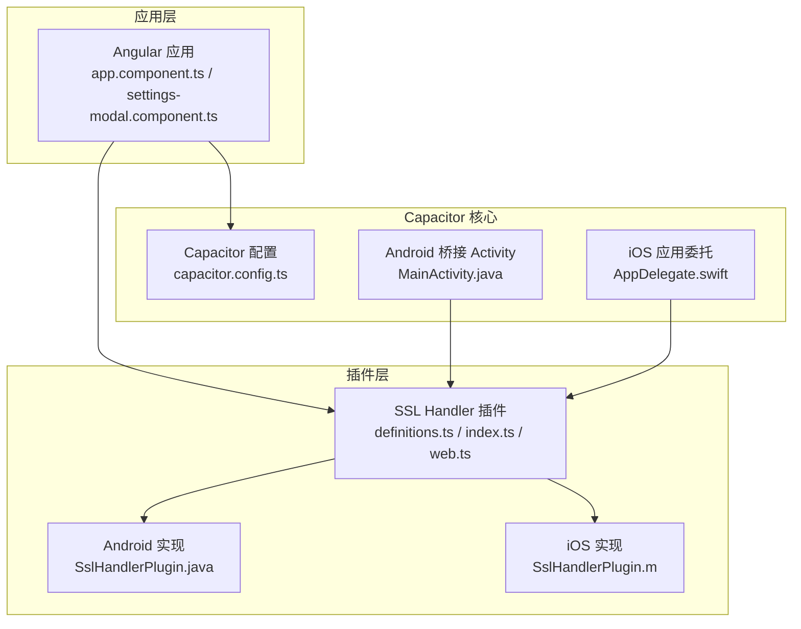
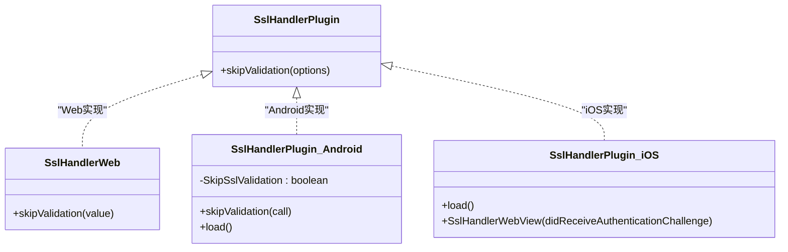
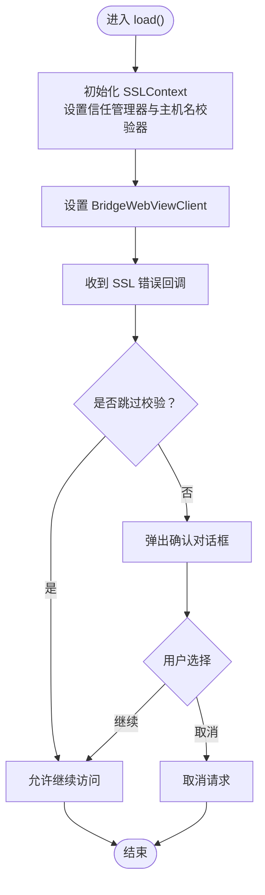
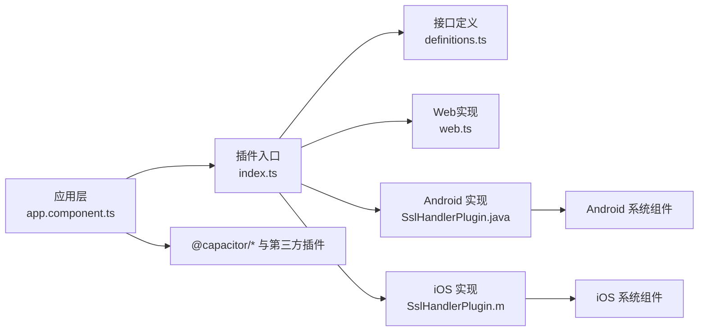

# Capacitor插件系统

<cite>
**本文档引用的文件**
- [capacitor.config.ts](file://capacitor.config.ts)
- [package.json](file://package.json)
- [MainActivity.java](file://android/app/src/main/java/com/suchbyte/macrodeck/MainActivity.java)
- [AppDelegate.swift](file://ios/App/App/AppDelegate.swift)
- [app.component.ts](file://src/app/app.component.ts)
- [settings-modal.component.ts](file://src/app/pages/shared/modals/settings-modal/settings-modal.component.ts)
- [definitions.ts](file://capacitor_plugins/sslhandler/src/definitions.ts)
- [index.ts](file://capacitor_plugins/sslhandler/src/index.ts)
- [web.ts](file://capacitor_plugins/sslhandler/src/web.ts)
- [SslHandlerPlugin.java](file://capacitor_plugins/sslhandler/android/src/main/java/com/suchbyte/sslhandler/SslHandlerPlugin.java)
- [SslHandlerPlugin.m](file://capacitor_plugins/sslhandler/ios/Plugin/SslHandlerPlugin.m)
- [build.gradle（Android库）](file://capacitor_plugins/sslhandler/android/build.gradle)
- [Sslhandler.podspec](file://capacitor_plugins/sslhandler/Sslhandler.podspec)
- [AndroidManifest.xml（Android库）](file://capacitor_plugins/sslhandler/android/src/main/AndroidManifest.xml)
- [Podfile.lock](file://ios/App/Podfile.lock)
</cite>

## 目录
1. [简介](#简介)
2. [项目结构](#项目结构)
3. [核心组件](#核心组件)
4. [架构总览](#架构总览)
5. [详细组件分析](#详细组件分析)
6. [依赖关系分析](#依赖关系分析)
7. [性能考量](#性能考量)
8. [故障排查指南](#故障排查指南)
9. [结论](#结论)
10. [附录](#附录)

## 简介
本文件面向Macro-Deck-Client-App中的Capacitor插件系统，重点围绕SSL Handler插件展开，系统性阐述Capacitor如何在Web与原生之间建立桥接通道，如何通过TypeScript接口定义与原生实现完成跨平台能力扩展，并给出插件开发、调试、测试与发布全流程的最佳实践。同时结合项目中已有的自定义插件与第三方插件集成方式，帮助开发者快速上手并高质量交付插件。

## 项目结构
该项目采用Angular + Capacitor架构，Capacitor配置集中于根目录的配置文件；Android端通过BridgeActivity承载WebView与插件运行环境；iOS端通过AppDelegate代理应用生命周期并与Capacitor生态协作。插件以本地包形式引入，位于capacitor_plugins目录下，当前包含一个名为sslhandler的自定义插件。



图表来源
- [capacitor.config.ts:1-16](file://capacitor.config.ts#L1-L16)
- [MainActivity.java:1-38](file://android/app/src/main/java/com/suchbyte/macrodeck/MainActivity.java#L1-L38)
- [AppDelegate.swift:1-55](file://ios/App/App/AppDelegate.swift#L1-L55)
- [app.component.ts:55-81](file://src/app/app.component.ts#L55-L81)
- [settings-modal.component.ts:100-100](file://src/app/pages/shared/modals/settings-modal/settings-modal.component.ts#L100-L100)
- [definitions.ts:1-4](file://capacitor_plugins/sslhandler/src/definitions.ts#L1-L4)
- [index.ts:1-11](file://capacitor_plugins/sslhandler/src/index.ts#L1-L11)
- [web.ts:1-9](file://capacitor_plugins/sslhandler/src/web.ts#L1-L9)
- [SslHandlerPlugin.java:1-101](file://capacitor_plugins/sslhandler/android/src/main/java/com/suchbyte/sslhandler/SslHandlerPlugin.java#L1-L101)
- [SslHandlerPlugin.m:1-40](file://capacitor_plugins/sslhandler/ios/Plugin/SslHandlerPlugin.m#L1-L40)

章节来源
- [capacitor.config.ts:1-16](file://capacitor.config.ts#L1-L16)
- [package.json:1-92](file://package.json#L1-L92)
- [MainActivity.java:1-38](file://android/app/src/main/java/com/suchbyte/macrodeck/MainActivity.java#L1-L38)
- [AppDelegate.swift:1-55](file://ios/App/App/AppDelegate.swift#L1-L55)

## 核心组件
- Capacitor配置：定义应用标识、应用名、Web目录、服务器协议等，确保Web与原生通信路径正确。
- 插件接口定义：通过TypeScript接口声明插件能力，约束调用参数与返回行为。
- 插件注册与分发：使用registerPlugin按平台动态加载对应实现，未实现平台提供空实现。
- 原生实现：Android通过WebViewClient拦截SSL错误并可选择跳过校验；iOS通过方法交换（Swizzling）增强WKWebView认证处理。
- 应用侧调用：在应用初始化或设置变更时调用插件方法，实现运行期策略切换。

章节来源
- [capacitor.config.ts:1-16](file://capacitor.config.ts#L1-L16)
- [definitions.ts:1-4](file://capacitor_plugins/sslhandler/src/definitions.ts#L1-L4)
- [index.ts:1-11](file://capacitor_plugins/sslhandler/src/index.ts#L1-L11)
- [web.ts:1-9](file://capacitor_plugins/sslhandler/src/web.ts#L1-L9)
- [SslHandlerPlugin.java:1-101](file://capacitor_plugins/sslhandler/android/src/main/java/com/suchbyte/sslhandler/SslHandlerPlugin.java#L1-L101)
- [SslHandlerPlugin.m:1-40](file://capacitor_plugins/sslhandler/ios/Plugin/SslHandlerPlugin.m#L1-L40)
- [app.component.ts:55-81](file://src/app/app.component.ts#L55-L81)
- [settings-modal.component.ts:100-100](file://src/app/pages/shared/modals/settings-modal/settings-modal.component.ts#L100-L100)

## 架构总览
Capacitor在Web与原生之间建立双向通道：应用通过TypeScript调用插件API，Capacitor根据平台选择对应原生实现；原生实现可直接操作系统能力（如网络证书校验），并将结果回传给Web层。SSL Handler插件展示了“策略开关”型插件的典型模式：应用层决定是否跳过SSL校验，原生层据此调整WebView行为。

```mermaid
sequenceDiagram
participant UI as "应用界面<br/>app.component.ts / settings-modal.component.ts"
participant TS as "插件TS层<br/>index.ts / web.ts"
participant AND as "Android 实现<br/>SslHandlerPlugin.java"
participant IOS as "iOS 实现<br/>SslHandlerPlugin.m"
UI->>TS : 调用 skipValidation({value})
TS->>AND : 平台匹配到 Android 实现
TS->>IOS : 平台匹配到 iOS 实现
AND->>AND : 更新全局跳过标志
AND->>AND : 设置信任管理器与WebViewClient
IOS->>IOS : 方法交换替换认证回调
AND-->>TS : resolve()
IOS-->>TS : resolve()
TS-->>UI : 调用完成
```

图表来源
- [index.ts:5-7](file://capacitor_plugins/sslhandler/src/index.ts#L5-L7)
- [web.ts:6-7](file://capacitor_plugins/sslhandler/src/web.ts#L6-L7)
- [SslHandlerPlugin.java:34-38](file://capacitor_plugins/sslhandler/android/src/main/java/com/suchbyte/sslhandler/SslHandlerPlugin.java#L34-L38)
- [SslHandlerPlugin.java:52-99](file://capacitor_plugins/sslhandler/android/src/main/java/com/suchbyte/sslhandler/SslHandlerPlugin.java#L52-L99)
- [SslHandlerPlugin.m:32-37](file://capacitor_plugins/sslhandler/ios/Plugin/SslHandlerPlugin.m#L32-L37)

## 详细组件分析

### SSL Handler 插件架构与实现
该插件用于控制WebView的SSL证书校验行为，支持在本地网络环境下临时跳过校验，同时保留用户确认机制。



图表来源
- [definitions.ts:1-4](file://capacitor_plugins/sslhandler/src/definitions.ts#L1-L4)
- [web.ts:5-8](file://capacitor_plugins/sslhandler/src/web.ts#L5-L8)
- [SslHandlerPlugin.java:32-38](file://capacitor_plugins/sslhandler/android/src/main/java/com/suchbyte/sslhandler/SslHandlerPlugin.java#L32-L38)
- [SslHandlerPlugin.m:7-37](file://capacitor_plugins/sslhandler/ios/Plugin/SslHandlerPlugin.m#L7-L37)

#### Android 实现要点
- 使用注解声明插件名称与方法，接收布尔参数并更新全局标志位。
- 在load阶段安装全局信任管理器与主机名校验器，重写WebViewClient的SSL错误回调，按标志决定是否允许继续。
- 通过对话框提示用户风险并提供继续/取消选项。



图表来源
- [SslHandlerPlugin.java:52-99](file://capacitor_plugins/sslhandler/android/src/main/java/com/suchbyte/sslhandler/SslHandlerPlugin.java#L52-L99)

章节来源
- [SslHandlerPlugin.java:1-101](file://capacitor_plugins/sslhandler/android/src/main/java/com/suchbyte/sslhandler/SslHandlerPlugin.java#L1-L101)
- [SslHandlerPlugin.m:1-40](file://capacitor_plugins/sslhandler/ios/Plugin/SslHandlerPlugin.m#L1-L40)

#### iOS 实现要点
- 通过Objective-C方法交换（Swizzling）在类级别替换WKNavigationDelegate的认证回调，使所有WKWebView统一走新的处理逻辑。
- 将系统信任对象作为凭据传递，异步执行回调，避免阻塞主线程。

章节来源
- [SslHandlerPlugin.m:1-40](file://capacitor_plugins/sslhandler/ios/Plugin/SslHandlerPlugin.m#L1-L40)

#### TypeScript 接口与注册
- 定义插件接口，约束方法签名。
- 使用registerPlugin注册插件，指定web端懒加载模块；未实现平台默认导出空实现类。

章节来源
- [definitions.ts:1-4](file://capacitor_plugins/sslhandler/src/definitions.ts#L1-L4)
- [index.ts:1-11](file://capacitor_plugins/sslhandler/src/index.ts#L1-L11)
- [web.ts:1-9](file://capacitor_plugins/sslhandler/src/web.ts#L1-L9)

#### 应用侧调用流程
- 在应用启动或设置变更时调用插件方法，传入目标状态。
- 应用层负责持久化用户偏好并在合适时机生效。

章节来源
- [app.component.ts:55-81](file://src/app/app.component.ts#L55-L81)
- [settings-modal.component.ts:100-100](file://src/app/pages/shared/modals/settings-modal/settings-modal.component.ts#L100-L100)

### 第三方插件集成与最佳实践
- 通过npm/yarn安装第三方插件并在package.json中声明依赖。
- iOS端通过CocoaPods管理依赖，Podfile.lock记录具体版本；Android端通过Gradle仓库引入。
- 对于需要系统权限或特殊配置的插件，需在各自平台的清单或配置文件中补充必要项。

章节来源
- [package.json:16-57](file://package.json#L16-L57)
- [Podfile.lock:34-76](file://ios/App/Podfile.lock#L34-L76)

## 依赖关系分析
- 应用对插件的依赖：应用通过导入插件入口文件进行调用。
- 插件对Capacitor核心的依赖：插件基于@capacitor/core提供的注册与桥接能力。
- 平台实现对系统组件的依赖：Android依赖WebView与SSL相关API；iOS依赖WKWebView与URL认证体系。
- 项目对第三方插件的依赖：通过package.json与Podfile.lock统一管理。



图表来源
- [index.ts:1-11](file://capacitor_plugins/sslhandler/src/index.ts#L1-L11)
- [definitions.ts:1-4](file://capacitor_plugins/sslhandler/src/definitions.ts#L1-L4)
- [web.ts:1-9](file://capacitor_plugins/sslhandler/src/web.ts#L1-L9)
- [SslHandlerPlugin.java:1-101](file://capacitor_plugins/sslhandler/android/src/main/java/com/suchbyte/sslhandler/SslHandlerPlugin.java#L1-L101)
- [SslHandlerPlugin.m:1-40](file://capacitor_plugins/sslhandler/ios/Plugin/SslHandlerPlugin.m#L1-L40)
- [package.json:16-57](file://package.json#L16-L57)

章节来源
- [package.json:16-57](file://package.json#L16-L57)
- [Podfile.lock:34-76](file://ios/App/Podfile.lock#L34-L76)

## 性能考量
- 插件懒加载：通过动态import仅在需要时加载Web实现，减少初始包体与启动时间。
- 原生实现最小化：Android/iOS仅在必要处注入逻辑（如WebViewClient或方法交换），避免全局Hook带来的额外开销。
- 全局SSL上下文：一次性初始化并复用，避免重复创建导致的资源浪费。
- 用户交互：Android弹窗与iOS认证回调均采用异步处理，避免阻塞主线程。

## 故障排查指南
- 插件未生效
  - 检查插件是否在package.json中声明且已安装。
  - 确认index.ts中的注册名称与调用一致。
  - 验证Android/iOS实现是否正确接入（Android需确保WebViewClient被替换；iOS需确认方法交换成功）。
- Android SSL错误仍阻止访问
  - 确认skipValidation调用已执行且标志位被正确设置。
  - 检查WebViewClient的onReceivedSslError回调是否被触发。
- iOS认证问题
  - 确认Swizzling是否在应用启动早期执行。
  - 检查WKNavigationDelegate方法是否被正确替换。
- WebView显示异常
  - Android端检查BridgeActivity与WebView配置；iOS端检查Storyboard与CAPBridgeViewController关联。

章节来源
- [index.ts:5-7](file://capacitor_plugins/sslhandler/src/index.ts#L5-L7)
- [SslHandlerPlugin.java:52-99](file://capacitor_plugins/sslhandler/android/src/main/java/com/suchbyte/sslhandler/SslHandlerPlugin.java#L52-L99)
- [SslHandlerPlugin.m:7-37](file://capacitor_plugins/sslhandler/ios/Plugin/SslHandlerPlugin.m#L7-L37)

## 结论
本项目通过Capacitor实现了Web与原生的高效桥接，SSL Handler插件展示了策略型插件的完整生命周期：从接口定义、平台实现到应用侧调用与持久化。结合第三方插件的标准化集成方式，开发者可以快速扩展功能并保持良好的跨平台一致性。建议在后续迭代中完善单元测试与端到端测试覆盖，并持续关注Capacitor版本升级与安全策略更新。

## 附录

### 开发流程与最佳实践
- TypeScript接口定义
  - 明确方法名、参数类型与返回值，遵循小而精的原则。
  - 将平台差异抽象在实现层，接口层保持稳定。
- 原生实现
  - Android：使用注解声明插件与方法，注意线程与生命周期；合理设置WebViewClient。
  - iOS：谨慎使用方法交换，确保在应用启动早期执行；避免影响其他模块。
- 跨平台兼容性
  - 未实现平台提供空实现类，保证编译与运行不中断。
  - 平台特定配置（如权限、系统组件）需在各自平台清单中补充。
- 调试与测试
  - 使用浏览器开发者工具调试Web层；Android使用Chrome DevTools调试WebView；iOS使用Safari Web Inspector。
  - 编写单元测试与端到端测试，覆盖关键分支（如跳过/不跳过SSL校验）。
- 发布与维护
  - 统一管理版本号与依赖锁定；iOS通过Podfile.lock固定版本；Android通过Gradle配置统一SDK版本。
  - 提供清晰的README与CHANGELOG，便于团队协作与外部贡献。

### 关键文件速览
- 插件入口与接口
  - [definitions.ts:1-4](file://capacitor_plugins/sslhandler/src/definitions.ts#L1-L4)
  - [index.ts:1-11](file://capacitor_plugins/sslhandler/src/index.ts#L1-L11)
  - [web.ts:1-9](file://capacitor_plugins/sslhandler/src/web.ts#L1-L9)
- Android实现
  - [SslHandlerPlugin.java:1-101](file://capacitor_plugins/sslhandler/android/src/main/java/com/suchbyte/sslhandler/SslHandlerPlugin.java#L1-L101)
  - [build.gradle（Android库）:1-59](file://capacitor_plugins/sslhandler/android/build.gradle#L1-L59)
  - [AndroidManifest.xml（Android库）:1-3](file://capacitor_plugins/sslhandler/android/src/main/AndroidManifest.xml#L1-L3)
- iOS实现
  - [SslHandlerPlugin.m:1-40](file://capacitor_plugins/sslhandler/ios/Plugin/SslHandlerPlugin.m#L1-L40)
  - [Sslhandler.podspec:1-18](file://capacitor_plugins/sslhandler/Sslhandler.podspec#L1-L18)
- 应用集成
  - [app.component.ts:55-81](file://src/app/app.component.ts#L55-L81)
  - [settings-modal.component.ts:100-100](file://src/app/pages/shared/modals/settings-modal/settings-modal.component.ts#L100-L100)
- 平台配置
  - [capacitor.config.ts:1-16](file://capacitor.config.ts#L1-L16)
  - [MainActivity.java:1-38](file://android/app/src/main/java/com/suchbyte/macrodeck/MainActivity.java#L1-L38)
  - [AppDelegate.swift:1-55](file://ios/App/App/AppDelegate.swift#L1-L55)
  - [package.json:1-92](file://package.json#L1-L92)
  - [Podfile.lock:34-76](file://ios/App/Podfile.lock#L34-L76)