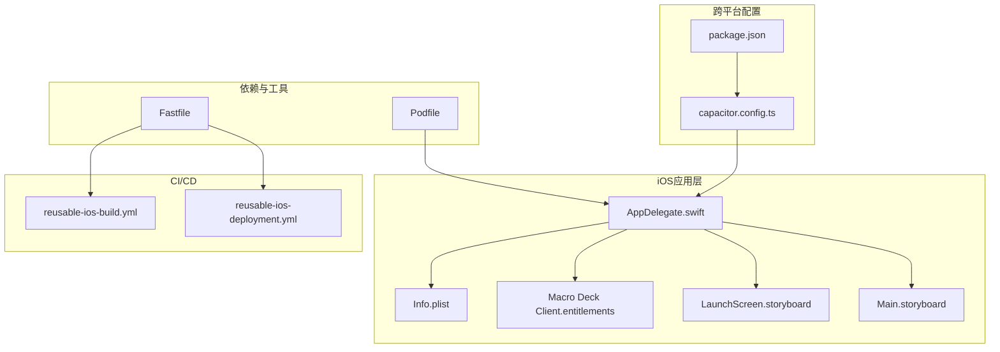
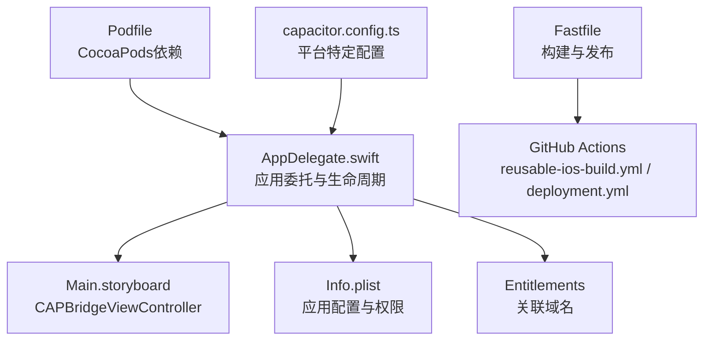
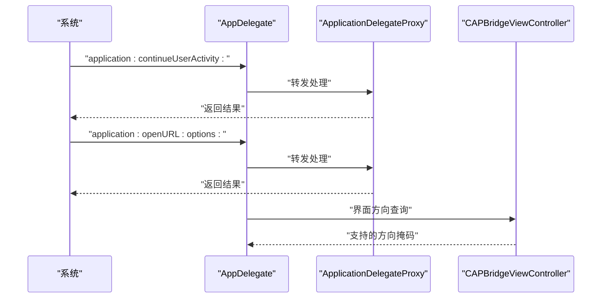
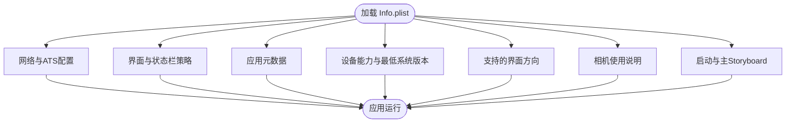
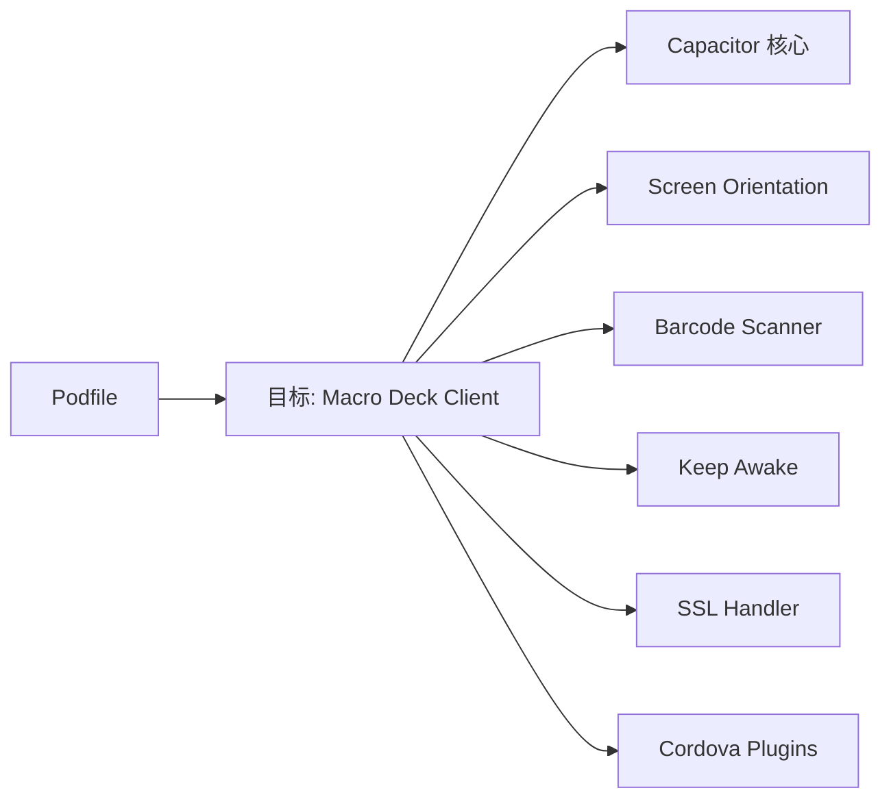
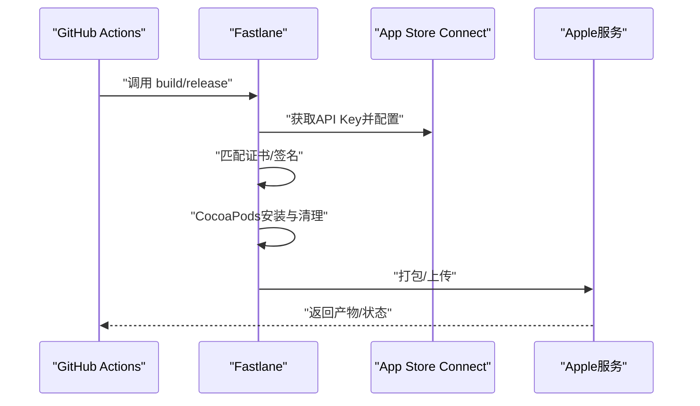
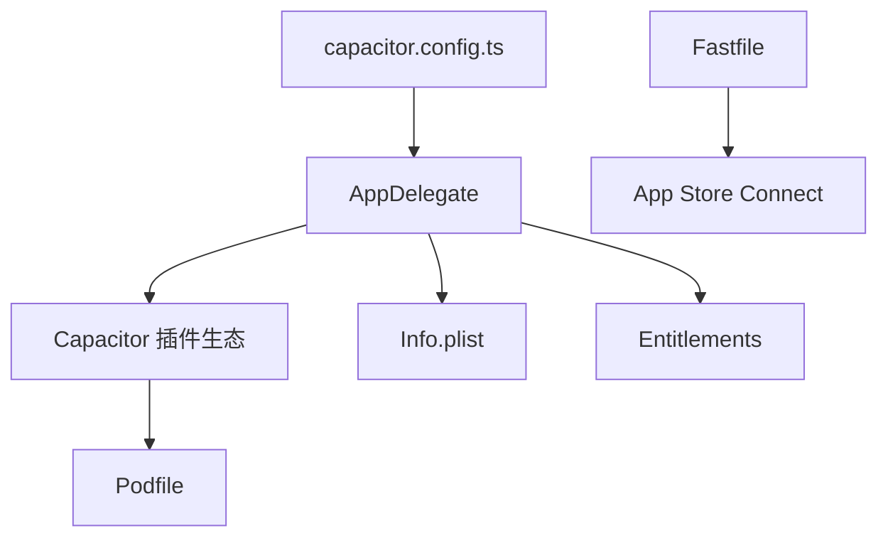

# iOS平台集成

<cite>
**本文引用的文件**
- [AppDelegate.swift](file://ios/App/App/AppDelegate.swift)
- [Info.plist](file://ios/App/App/Info.plist)
- [Podfile](file://ios/App/Podfile)
- [Macro Deck Client.entitlements](file://ios/App/Macro Deck Client.entitlements)
- [LaunchScreen.storyboard](file://ios/App/App/Base.lproj/LaunchScreen.storyboard)
- [Main.storyboard](file://ios/App/App/Base.lproj/Main.storyboard)
- [capacitor.config.ts](file://capacitor.config.ts)
- [package.json](file://package.json)
- [reusable-ios-build.yml](file://.github/workflows/reusable-ios-build.yml)
- [reusable-ios-deployment.yml](file://.github/workflows/reusable-ios-deployment.yml)
- [Fastfile](file://ios/App/fastlane/Fastfile)
- [.gitignore（iOS）](file://ios/.gitignore)
</cite>

## 目录
1. [引言](#引言)
2. [项目结构](#项目结构)
3. [核心组件](#核心组件)
4. [架构总览](#架构总览)
5. [详细组件分析](#详细组件分析)
6. [依赖关系分析](#依赖关系分析)
7. [性能与优化](#性能与优化)
8. [故障排查指南](#故障排查指南)
9. [结论](#结论)
10. [附录](#附录)

## 引言
本文件面向在iOS平台上集成Macro-Deck-Client-App的开发者，系统性梳理iOS工程结构、Swift入口点AppDelegate的职责与配置、Info.plist中的应用配置与权限声明、Xcode工作空间与CocoaPods依赖管理、Capacitor生态下的iOS特性实现（应用委托处理、权限请求、系统集成）、以及构建、签名与App Store发布流程。同时覆盖Entitlements配置、推送通知相关注意事项、性能优化建议及iOS版本兼容与设备适配考量。

## 项目结构
iOS相关代码位于ios/App目录，采用Capacitor框架组织，包含以下关键层级：
- 应用入口与配置：AppDelegate.swift、Info.plist、Entitlements、Storyboard
- 依赖管理：Podfile
- 构建与发布：Fastlane配置（Fastfile）
- 工作流集成：GitHub Actions可复用工作流（reusable-ios-build.yml、reusable-ios-deployment.yml）

图表来源
- [AppDelegate.swift:1-55](file://ios/App/App/AppDelegate.swift#L1-L55)
- [Info.plist:1-61](file://ios/App/App/Info.plist#L1-L61)
- [Macro Deck Client.entitlements:1-11](file://ios/App/Macro Deck Client.entitlements#L1-L11)
- [LaunchScreen.storyboard:1-33](file://ios/App/App/Base.lproj/LaunchScreen.storyboard#L1-L33)
- [Main.storyboard:1-20](file://ios/App/App/Base.lproj/Main.storyboard#L1-L20)
- [Podfile:1-33](file://ios/App/Podfile#L1-L33)
- [Fastfile:1-68](file://ios/App/fastlane/Fastfile#L1-L68)
- [capacitor.config.ts:1-16](file://capacitor.config.ts#L1-L16)
- [package.json:1-92](file://package.json#L1-L92)
- [reusable-ios-build.yml:1-72](file://.github/workflows/reusable-ios-build.yml#L1-L72)
- [reusable-ios-deployment.yml:1-38](file://.github/workflows/reusable-ios-deployment.yml#L1-L38)

章节来源
- [AppDelegate.swift:1-55](file://ios/App/App/AppDelegate.swift#L1-L55)
- [Info.plist:1-61](file://ios/App/App/Info.plist#L1-L61)
- [Podfile:1-33](file://ios/App/Podfile#L1-L33)
- [capacitor.config.ts:1-16](file://capacitor.config.ts#L1-L16)
- [package.json:1-92](file://package.json#L1-L92)

## 核心组件
- 应用委托（AppDelegate）
  - 负责应用生命周期回调、URL Scheme与Universal Links处理、屏幕方向支持等。
  - 集成Capacitor Screen Orientation插件以控制界面方向。
- 应用信息与权限（Info.plist）
  - 声明应用显示名、版本号、最低系统版本、启动与主Storyboard、所需设备能力、支持的方向、状态栏隐藏策略、ATS配置、相机使用说明等。
- 依赖与插件（Podfile）
  - 指定iOS平台最低版本、安装策略、CocoaPods工作区与目标名称，并声明Capacitor生态插件集合。
- Entitlements
  - 配置关联域名（Associated Domains），用于Universal Links。
- Storyboard
  - 启动页与桥接控制器视图，承载Web内容容器。
- CI/CD与Fastlane
  - 通过Fastlane lane完成证书获取、签名设置、清理缓存、CocoaPods安装、打包与上传TestFlight；GitHub Actions工作流负责下载基线产物并触发构建或发布。

章节来源
- [AppDelegate.swift:10-52](file://ios/App/App/AppDelegate.swift#L10-L52)
- [Info.plist:5-58](file://ios/App/App/Info.plist#L5-L58)
- [Podfile:3-28](file://ios/App/Podfile#L3-L28)
- [Macro Deck Client.entitlements:4-10](file://ios/App/Macro Deck Client.entitlements#L4-L10)
- [LaunchScreen.storyboard:14-19](file://ios/App/App/Base.lproj/LaunchScreen.storyboard#L14-L19)
- [Main.storyboard:14-14](file://ios/App/App/Base.lproj/Main.storyboard#L14-L14)
- [Fastfile:4-35](file://ios/App/fastlane/Fastfile#L4-L35)
- [reusable-ios-build.yml:47-58](file://.github/workflows/reusable-ios-build.yml#L47-L58)

## 架构总览
下图展示iOS端从应用委托到Capacitor桥接、再到插件生态的整体交互关系。

图表来源
- [AppDelegate.swift:1-55](file://ios/App/App/AppDelegate.swift#L1-L55)
- [Main.storyboard:14-14](file://ios/App/App/Base.lproj/Main.storyboard#L14-L14)
- [Info.plist:1-61](file://ios/App/App/Info.plist#L1-L61)
- [Macro Deck Client.entitlements:1-11](file://ios/App/Macro Deck Client.entitlements#L1-L11)
- [Podfile:1-33](file://ios/App/Podfile#L1-L33)
- [capacitor.config.ts:3-12](file://capacitor.config.ts#L3-L12)
- [Fastfile:1-68](file://ios/App/fastlane/Fastfile#L1-L68)
- [reusable-ios-build.yml:1-72](file://.github/workflows/reusable-ios-build.yml#L1-L72)
- [reusable-ios-deployment.yml:1-38](file://.github/workflows/reusable-ios-deployment.yml#L1-L38)

## 详细组件分析

### AppDelegate.swift 分析
- 生命周期与系统事件
  - 应用启动、前后台切换、终止等回调均按需保留，便于后续扩展。
- 屏幕方向控制
  - 通过Capacitor Screen Orientation插件统一管理支持的方向集。
- URL与活动处理
  - 实现URL Scheme与Universal Links回调，交由ApplicationDelegateProxy转发至Capacitor处理，确保协议跳转与深度链接一致行为。

图表来源
- [AppDelegate.swift:41-52](file://ios/App/App/AppDelegate.swift#L41-L52)
- [AppDelegate.swift:15-17](file://ios/App/App/AppDelegate.swift#L15-L17)
- [Main.storyboard:14-14](file://ios/App/App/Base.lproj/Main.storyboard#L14-L14)

章节来源
- [AppDelegate.swift:10-52](file://ios/App/App/AppDelegate.swift#L10-L52)

### Info.plist 配置详解
- ATS与网络
  - 允许任意连接（NSAllowsArbitraryLoads），满足开发与测试场景需求。
- 界面与状态栏
  - 全屏模式、隐藏状态栏、基于视图控制器的状态栏外观。
- 应用元数据
  - 显示名、Bundle标识、版本号、包类型、短版本字符串、包版本等。
- 设备与方向
  - 最低系统要求、所需设备能力（armv7）、iPhone/iPad支持的方向数组。
- 权限与隐私
  - 相机使用说明（NSCameraUsageDescription），用于扫码功能。
- 启动与主界面
  - 启动Storyboard与主Storyboard文件名。

图表来源
- [Info.plist:5-58](file://ios/App/App/Info.plist#L5-L58)

章节来源
- [Info.plist:5-58](file://ios/App/App/Info.plist#L5-L58)

### Podfile 与依赖管理
- 平台与安装策略
  - 指定iOS最低版本、禁用输入输出路径缓存以避免Xcode缓存问题。
- Capacitor生态插件
  - 包含核心库、App/Device/Haptics/Keyboard、屏幕方向、条码扫描、保持唤醒、SSL处理器、Cordova插件桥接等。
- 目标与安装钩子
  - 定义目标名为“Macro Deck Client”，并在post_install阶段校验部署目标。

图表来源
- [Podfile:3-28](file://ios/App/Podfile#L3-L28)

章节来源
- [Podfile:1-33](file://ios/App/Podfile#L1-L33)

### Entitlements 与关联域名
- 关联域名（Associated Domains）
  - 配置applinks:macro-deck.app，用于启用Universal Links，使系统能将特定域名流量交由应用处理。
- 适用场景
  - 深度链接、安全回跳、应用间跳转等。

章节来源
- [Macro Deck Client.entitlements:4-10](file://ios/App/Macro Deck Client.entitlements#L4-L10)

### Storyboard 与桥接
- LaunchScreen
  - 提供启动时的全屏背景图像，提升首屏体验。
- Main
  - 使用CAPBridgeViewController作为根控制器，承载WebView内容，实现跨平台页面渲染。

章节来源
- [LaunchScreen.storyboard:14-19](file://ios/App/App/Base.lproj/LaunchScreen.storyboard#L14-L19)
- [Main.storyboard:14-14](file://ios/App/App/Base.lproj/Main.storyboard#L14-L14)

### Capacitor 平台配置
- 应用标识与名称
  - appId与appName用于生成原生层识别的应用标识与显示名。
- Web目录与服务器
  - webDir指向www，服务器配置中为Android指定scheme。
- iOS专用scheme
  - ios.scheme用于URL Scheme与Deep Link集成。

章节来源
- [capacitor.config.ts:3-12](file://capacitor.config.ts#L3-L12)

### CI/CD 与发布流程
- 可复用构建工作流
  - 下载基线产物（www、node_modules、ios），安装SSH密钥，执行Fastlane构建，产出ipa与App Store信息。
- 可复用发布工作流
  - 下载已构建产物，安装SSH密钥，执行Fastlane发布至TestFlight。
- Fastlane lane
  - build：更新构建号与版本号、拉取证书、设置签名、清理DerivedData、CocoaPods安装、打包并生成App Store信息。
  - release：上传至TestFlight，支持跳过等待处理。

图表来源
- [reusable-ios-build.yml:47-58](file://.github/workflows/reusable-ios-build.yml#L47-L58)
- [reusable-ios-deployment.yml:28-37](file://.github/workflows/reusable-ios-deployment.yml#L28-L37)
- [Fastfile:4-35](file://ios/App/fastlane/Fastfile#L4-L35)

章节来源
- [reusable-ios-build.yml:1-72](file://.github/workflows/reusable-ios-build.yml#L1-L72)
- [reusable-ios-deployment.yml:1-38](file://.github/workflows/reusable-ios-deployment.yml#L1-L38)
- [Fastfile:1-68](file://ios/App/fastlane/Fastfile#L1-L68)

## 依赖关系分析
- 组件耦合
  - AppDelegate与Capacitor桥接紧密耦合，负责系统级事件与插件代理转发。
  - Info.plist与Entitlements分别影响运行期网络策略与系统能力开关。
  - Podfile集中声明第三方能力，降低模块内散落配置带来的维护成本。
- 外部依赖
  - App Store Connect API Key、Match证书体系、Fastlane工具链。
- 潜在风险
  - ATS全开可能带来生产环境安全风险，建议在生产构建中收紧策略。
  - 未显式声明推送通知权限，若后续接入推送需补充相应权限与配置。

图表来源
- [AppDelegate.swift:1-55](file://ios/App/App/AppDelegate.swift#L1-L55)
- [Info.plist:1-61](file://ios/App/App/Info.plist#L1-L61)
- [Macro Deck Client.entitlements:1-11](file://ios/App/Macro Deck Client.entitlements#L1-L11)
- [Podfile:1-33](file://ios/App/Podfile#L1-L33)
- [capacitor.config.ts:1-16](file://capacitor.config.ts#L1-L16)
- [Fastfile:1-68](file://ios/App/fastlane/Fastfile#L1-L68)

章节来源
- [AppDelegate.swift:1-55](file://ios/App/App/AppDelegate.swift#L1-L55)
- [Podfile:1-33](file://ios/App/Podfile#L1-L33)
- [capacitor.config.ts:1-16](file://capacitor.config.ts#L1-L16)
- [Fastfile:1-68](file://ios/App/fastlane/Fastfile#L1-L68)

## 性能与优化
- 启动性能
  - 合理利用LaunchScreen减少白屏时间；避免在applicationDidFinishLaunching中执行阻塞任务。
- 界面方向与渲染
  - 通过Screen Orientation插件统一方向策略，减少重复判断逻辑。
- 网络与安全
  - 生产构建中建议收紧ATS策略，仅对必要域名放行；避免全开任意连接。
- 电池与后台
  - 合理使用“保持唤醒”插件，避免不必要的常驻；在后台时释放非必要资源。
- 依赖体积与安装
  - CocoaPods安装时启用清理与缓存策略，缩短CI时间；按需引入插件，避免冗余依赖。

## 故障排查指南
- 构建失败（CocoaPods）
  - 清理DerivedData与Pod缓存，重新执行pod install；确认平台版本与部署目标一致。
- 证书与签名
  - 确认Fastlane已正确匹配开发/发布证书；检查MATCH密钥与密码。
- 版本号与构建号
  - 确保在CI中传入VERSION_NUMBER与BUILD_NUMBER；核对Fastfile中的增量逻辑。
- URL Scheme/Universal Links
  - 确认Info.plist与Entitlements中域名配置一致；验证Associated Domains是否开启。
- 权限弹窗
  - 若出现相机权限弹窗，确认Info.plist中NSCameraUsageDescription存在且描述清晰。

章节来源
- [Fastfile:4-35](file://ios/App/fastlane/Fastfile#L4-L35)
- [Info.plist:20-21](file://ios/App/App/Info.plist#L20-L21)
- [Macro Deck Client.entitlements:4-10](file://ios/App/Macro Deck Client.entitlements#L4-L10)

## 结论
该iOS集成方案基于Capacitor生态，通过AppDelegate统一承接系统事件与插件代理、借助Info.plist与Entitlements声明应用配置与系统能力、以Podfile集中管理依赖，并结合Fastlane与GitHub Actions实现自动化构建与发布。建议在生产环境中收紧网络策略、完善推送通知相关配置，并持续优化启动与渲染性能，以获得更佳用户体验。

## 附录
- iOS版本与设备适配
  - 最低系统版本：iOS 13.0；设备能力包含armv7；支持iPhone与iPad多方向。
- 开发与调试
  - 使用Xcode工作空间打开ios/App/App.xcworkspace；在模拟器/真机上进行调试。
- 生成物与产物
  - 构建产物包含ipa与App Store信息文件，可通过Fastlane上传至TestFlight。

章节来源
- [Podfile:3](file://ios/App/Podfile#L3)
- [Info.plist:34-56](file://ios/App/App/Info.plist#L34-L56)
- [Fastfile:26-34](file://ios/App/fastlane/Fastfile#L26-L34)
- [reusable-ios-build.yml:64-70](file://.github/workflows/reusable-ios-build.yml#L64-L70)