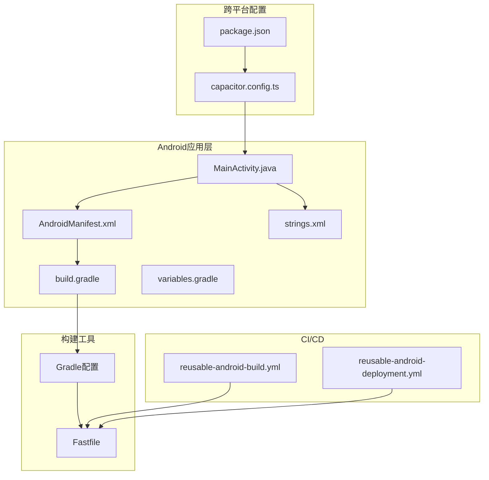
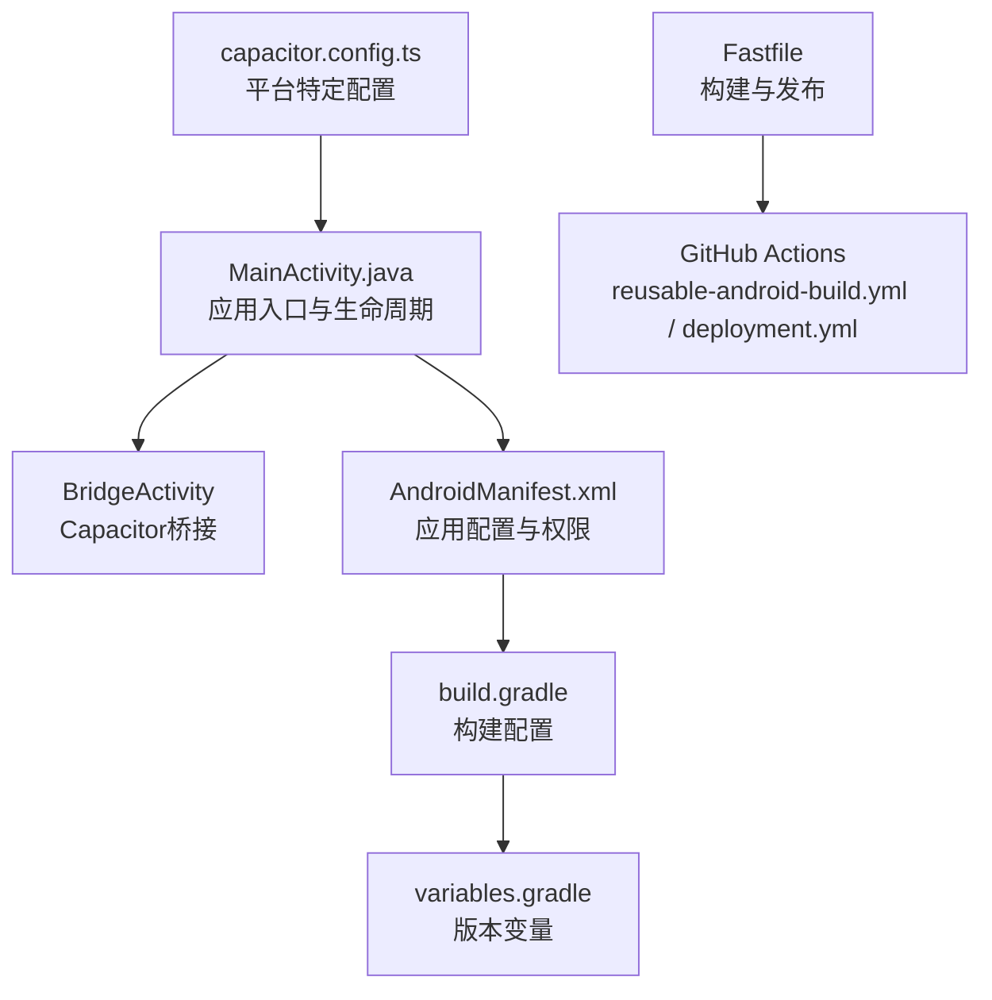
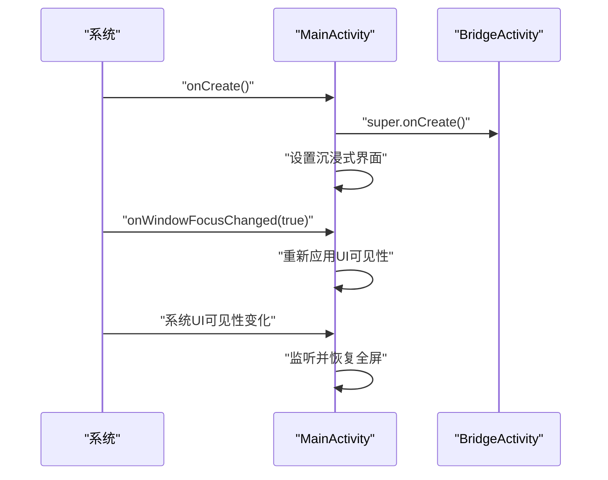
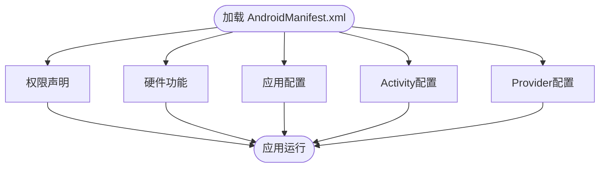
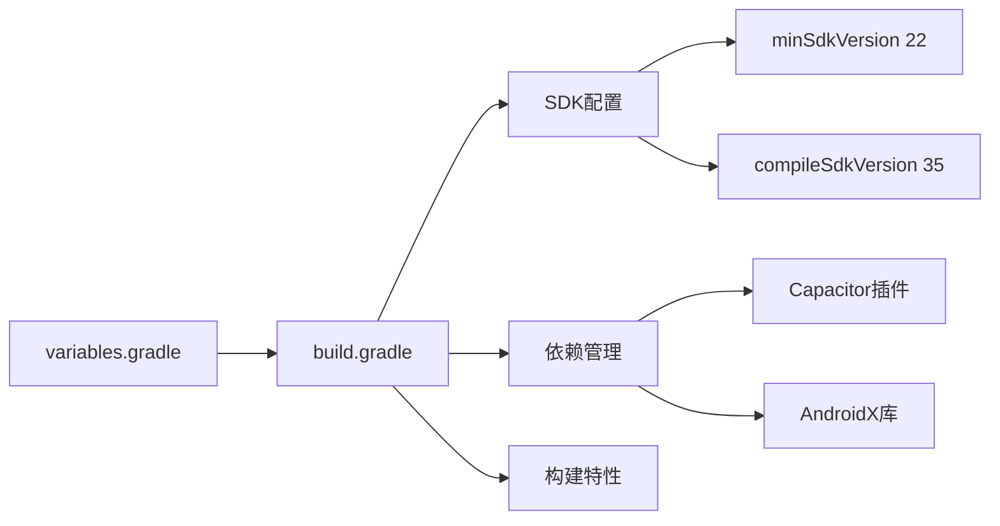
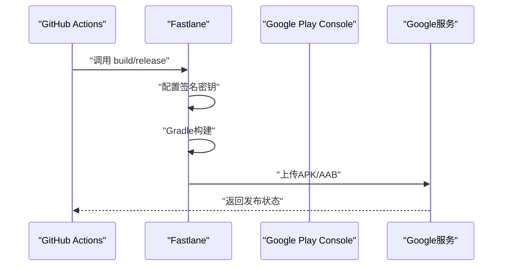
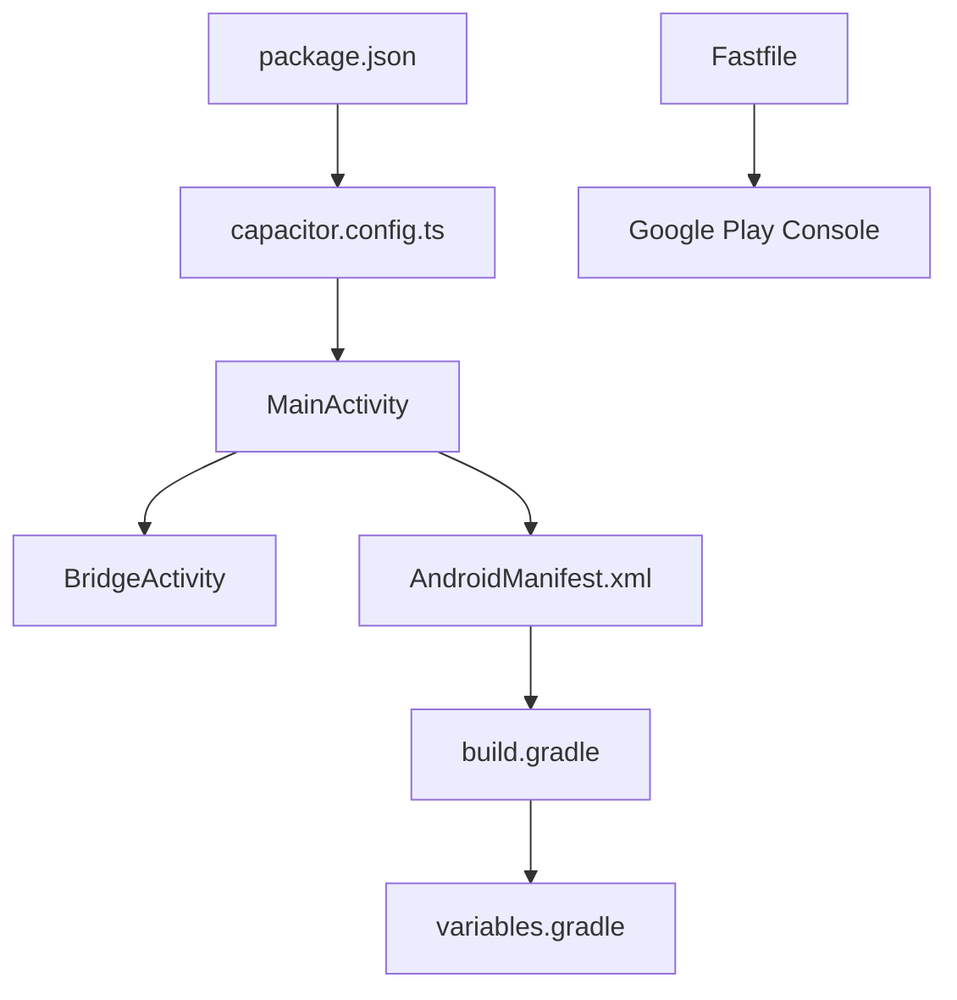

# Android单一平台集成

<cite>
**本文档引用的文件**
- [capacitor.config.ts](file://capacitor.config.ts)
- [package.json](file://package.json)
- [AndroidManifest.xml](file://android/app/src/main/AndroidManifest.xml)
- [MainActivity.java](file://android/app/src/main/java/com/suchbyte/macrodeck/MainActivity.java)
- [build.gradle](file://android/app/build.gradle)
- [variables.gradle](file://android/variables.gradle)
- [strings.xml](file://android/app/src/main/res/values/strings.xml)
- [reusable-android-build.yml](file://.github/workflows/reusable-android-build.yml)
- [reusable-android-deployment.yml](file://.github/workflows/reusable-android-deployment.yml)
- [Fastfile（Android）](file://android/fastlane/Fastfile)
- [.gitignore（Android）](file://android/.gitignore)
</cite>

## 更新摘要
**所做更改**
- 移除了所有iOS平台相关内容和配置
- 更新为完整的Android单一平台支持文档
- 删除了iOS工作流、iOS部署配置和iOS特定的Capacitor插件说明
- 新增了Android平台的完整配置和构建流程

## 目录
1. [引言](#引言)
2. [项目结构](#项目结构)
3. [核心组件](#核心组件)
4. [架构总览](#架构总览)
5. [详细组件分析](#详细组件分析)
6. [依赖关系分析](#依赖关系分析)
7. [性能与优化](#性能与优化)
8. [故障排查指南](#故障排查指南)
9. [结论](#结论)
10. [附录](#附录)

## 引言
本文件面向在Android平台上集成Macro-Deck-Client-App的开发者，系统性梳理Android工程结构、Java/Kotlin入口点MainActivity的职责与配置、AndroidManifest.xml中的应用配置与权限声明、Gradle构建系统与依赖管理、Capacitor生态下的Android特性实现（应用生命周期处理、权限请求、系统集成）、以及构建、签名与Google Play发布流程。同时覆盖Android版本兼容性、设备适配考量和性能优化建议。

**重要说明**：该文档已更新为Android单一平台支持，iOS平台集成已在项目中完全移除。

## 项目结构
Android相关代码位于android目录，采用Capacitor框架组织，包含以下关键层级：
- 应用入口与配置：MainActivity.java、AndroidManifest.xml、strings.xml
- 构建与依赖：build.gradle、variables.gradle、settings.gradle
- 构建与发布：Fastlane配置（Fastfile）
- 工作流集成：GitHub Actions可复用工作流（reusable-android-build.yml、reusable-android-deployment.yml）

**图表来源**
- [MainActivity.java:1-38](file://android/app/src/main/java/com/suchbyte/macrodeck/MainActivity.java#L1-L38)
- [AndroidManifest.xml:1-61](file://android/app/src/main/AndroidManifest.xml#L1-L61)
- [strings.xml:1-8](file://android/app/src/main/res/values/strings.xml#L1-L8)
- [build.gradle:1-61](file://android/app/build.gradle#L1-L61)
- [variables.gradle:1-17](file://android/variables.gradle#L1-L17)
- [capacitor.config.ts:1-16](file://capacitor.config.ts#L1-L16)
- [package.json:1-93](file://package.json#L1-L93)
- [reusable-android-build.yml:1-82](file://.github/workflows/reusable-android-build.yml#L1-L82)
- [reusable-android-deployment.yml:1-30](file://.github/workflows/reusable-android-deployment.yml#L1-L30)

**章节来源**
- [MainActivity.java:1-38](file://android/app/src/main/java/com/suchbyte/macrodeck/MainActivity.java#L1-L38)
- [AndroidManifest.xml:1-61](file://android/app/src/main/AndroidManifest.xml#L1-L61)
- [build.gradle:1-61](file://android/app/build.gradle#L1-L61)
- [capacitor.config.ts:1-16](file://capacitor.config.ts#L1-L16)
- [package.json:1-93](file://package.json#L1-L93)

## 核心组件
- 应用入口（MainActivity）
  - 继承自BridgeActivity，负责应用生命周期回调、沉浸式界面处理、系统UI可见性控制等。
  - 实现系统UI可见性监听器，确保全屏体验的一致性。
- 应用清单与权限（AndroidManifest.xml）
  - 声明应用显示名、包名、版本信息、权限列表（网络、摄像头、WAKE_LOCK等）。
  - 配置Intent Filter支持Deep Link和Universal Links。
- 构建配置（build.gradle）
  - 设置编译SDK版本、目标SDK版本、最小SDK版本、版本号和版本名称。
  - 配置构建类型、数据绑定、ProGuard混淆规则。
- Gradle变量（variables.gradle）
  - 定义SDK版本、依赖库版本、测试框架版本等全局变量。
- CI/CD与Fastlane
  - 通过Fastlane lane完成签名密钥配置、Gradle构建、APK/AAB打包与Google Play发布。
  - GitHub Actions工作流负责下载基线产物并触发Android构建或发布。

**章节来源**
- [MainActivity.java:8-37](file://android/app/src/main/java/com/suchbyte/macrodeck/MainActivity.java#L8-L37)
- [AndroidManifest.xml:8-13](file://android/app/src/main/AndroidManifest.xml#L8-L13)
- [build.gradle:3-31](file://android/app/build.gradle#L3-L31)
- [variables.gradle:1-17](file://android/variables.gradle#L1-L17)
- [Fastfile（Android）:1-68](file://android/fastlane/Fastfile#L1-L68)
- [reusable-android-build.yml:20-82](file://.github/workflows/reusable-android-build.yml#L20-L82)

## 架构总览
下图展示Android端从应用入口到Capacitor桥接、再到插件生态的整体交互关系。

**图表来源**
- [MainActivity.java:1-38](file://android/app/src/main/java/com/suchbyte/macrodeck/MainActivity.java#L1-L38)
- [AndroidManifest.xml:1-61](file://android/app/src/main/AndroidManifest.xml#L1-L61)
- [build.gradle:1-61](file://android/app/build.gradle#L1-L61)
- [variables.gradle:1-17](file://android/variables.gradle#L1-L17)
- [capacitor.config.ts:3-12](file://capacitor.config.ts#L3-L12)
- [Fastfile（Android）:1-68](file://android/fastlane/Fastfile#L1-L68)
- [reusable-android-build.yml:1-82](file://.github/workflows/reusable-android-build.yml#L1-L82)
- [reusable-android-deployment.yml:1-30](file://.github/workflows/reusable-android-deployment.yml#L1-L30)

## 详细组件分析

### MainActivity.java 分析
- 应用生命周期管理
  - 继承BridgeActivity，自动获得Capacitor提供的WebView容器和插件支持。
  - 在onCreate中设置沉浸式界面，隐藏导航栏和状态栏，提供更好的用户体验。
- 系统UI可见性控制
  - 实现OnSystemUiVisibilityChangeListener，监听系统UI变化并自动恢复全屏模式。
  - 使用SYSTEM_UI_FLAG_IMMERSIVE_STICKY确保用户交互后UI不会意外消失。
- 界面焦点处理
  - 在onWindowFocusChanged中重新应用UI可见性标志，确保焦点变化时界面状态正确。

**图表来源**
- [MainActivity.java:9-22](file://android/app/src/main/java/com/suchbyte/macrodeck/MainActivity.java#L9-L22)
- [MainActivity.java:24-29](file://android/app/src/main/java/com/suchbyte/macrodeck/MainActivity.java#L24-L29)

**章节来源**
- [MainActivity.java:1-38](file://android/app/src/main/java/com/suchbyte/macrodeck/MainActivity.java#L1-L38)

### AndroidManifest.xml 配置详解
- 权限声明
  - INTERNET：网络访问权限
  - ACCESS_NETWORK_STATE：网络状态访问
  - WAKE_LOCK：保持设备唤醒
  - ACCESS_WIFI_STATE：WiFi状态访问
  - CAMERA/FLASHLIGHT：相机和手电筒权限
- 功能声明
  - android.hardware.camera：硬件相机支持
  - google_analytics_automatic_screen_reporting_enabled：禁用自动屏幕报告
  - com.google.mlkit.vision.DEPENDENCIES：ML Kit依赖配置
- Activity配置
  - singleTask启动模式：避免重复实例
  - 支持多种配置变更：方向、键盘、屏幕尺寸等
  - Intent Filter：主启动器和Deep Link支持
- Provider配置
  - FileProvider：文件共享和外部访问支持

**图表来源**
- [AndroidManifest.xml:8-13](file://android/app/src/main/AndroidManifest.xml#L8-L13)
- [AndroidManifest.xml:24-25](file://android/app/src/main/AndroidManifest.xml#L24-L25)
- [AndroidManifest.xml:27-47](file://android/app/src/main/AndroidManifest.xml#L27-L47)

**章节来源**
- [AndroidManifest.xml:1-61](file://android/app/src/main/AndroidManifest.xml#L1-L61)

### 构建配置与依赖管理
- SDK版本配置
  - minSdkVersion: 22（Android 5.1+）
  - compileSdkVersion: 35
  - targetSdkVersion: 35
- 构建特性
  - dataBinding: true（启用数据绑定）
  - aaptOptions：忽略特定文件模式，优化资源打包
- 依赖管理
  - Capacitor核心库和插件
  - AndroidX支持库
  - 测试框架（JUnit、Espresso）
- Google Services集成
  - 可选的Firebase配置检测
  - 推送通知支持条件性启用

**图表来源**
- [variables.gradle:1-17](file://android/variables.gradle#L1-L17)
- [build.gradle:3-49](file://android/app/build.gradle#L3-L49)

**章节来源**
- [build.gradle:1-61](file://android/app/build.gradle#L1-L61)
- [variables.gradle:1-17](file://android/variables.gradle#L1-L17)

### 字符串资源配置
- 应用名称和标题
  - app_name：应用显示名称
  - title_activity_main：主Activity标题
- 包名和自定义URL Scheme
  - package_name：应用包名
  - custom_url_scheme：Deep Link支持

**章节来源**
- [strings.xml:1-8](file://android/app/src/main/res/values/strings.xml#L1-L8)

### Capacitor平台配置
- Android专用配置
  - androidScheme：HTTP协议用于Android平台
  - ios.scheme：iOS专用的URL Scheme配置
- 跨平台配置
  - appId和appName：应用标识和显示名称
  - webDir：Web资源目录

**章节来源**
- [capacitor.config.ts:3-12](file://capacitor.config.ts#L3-L12)

### CI/CD 与发布流程
- 可复用构建工作流
  - 下载基线产物（www、node_modules、android），配置签名密钥，执行Fastlane构建。
  - 产出APK和AAB格式的应用包，支持Google Play发布。
- 可复用发布工作流
  - 下载已构建产物，配置Play Store凭据，执行Fastlane发布。
- Fastlane lane
  - build：设置版本号、配置签名、Gradle构建、生成APK/AAB。
  - release：上传至Google Play Console，支持自动发布。

**图表来源**
- [reusable-android-build.yml:46-68](file://.github/workflows/reusable-android-build.yml#L46-L68)
- [reusable-android-deployment.yml:23-29](file://.github/workflows/reusable-android-deployment.yml#L23-L29)
- [Fastfile（Android）:1-68](file://android/fastlane/Fastfile#L1-L68)

**章节来源**
- [reusable-android-build.yml:1-82](file://.github/workflows/reusable-android-build.yml#L1-L82)
- [reusable-android-deployment.yml:1-30](file://.github/workflows/reusable-android-deployment.yml#L1-L30)
- [Fastfile（Android）:1-68](file://android/fastlane/Fastfile#L1-L68)

## 依赖关系分析
- 组件耦合
  - MainActivity与BridgeActivity紧密耦合，负责应用入口和系统UI处理。
  - AndroidManifest.xml与build.gradle相互依赖，权限和配置需要保持一致。
  - variables.gradle为所有构建配置提供版本管理，降低版本不一致风险。
- 外部依赖
  - Google Play Developer API、Firebase服务、Fastlane工具链。
- 潜在风险
  - Google Services配置缺失时推送通知功能不可用。
  - 权限声明不足可能导致功能异常或应用被拒绝。
  - SDK版本不匹配可能引发兼容性问题。

**图表来源**
- [MainActivity.java:1-38](file://android/app/src/main/java/com/suchbyte/macrodeck/MainActivity.java#L1-L38)
- [AndroidManifest.xml:1-61](file://android/app/src/main/AndroidManifest.xml#L1-L61)
- [build.gradle:1-61](file://android/app/build.gradle#L1-L61)
- [variables.gradle:1-17](file://android/variables.gradle#L1-L17)
- [capacitor.config.ts:1-16](file://capacitor.config.ts#L1-L16)
- [Fastfile（Android）:1-68](file://android/fastlane/Fastfile#L1-L68)
- [package.json:1-93](file://package.json#L1-L93)

**章节来源**
- [MainActivity.java:1-38](file://android/app/src/main/java/com/suchbyte/macrodeck/MainActivity.java#L1-L38)
- [AndroidManifest.xml:1-61](file://android/app/src/main/AndroidManifest.xml#L1-L61)
- [build.gradle:1-61](file://android/app/build.gradle#L1-L61)
- [capacitor.config.ts:1-16](file://capacitor.config.ts#L1-L16)
- [Fastfile（Android）:1-68](file://android/fastlane/Fastfile#L1-L68)
- [package.json:1-93](file://package.json#L1-L93)

## 性能与优化
- 启动性能
  - 启用数据绑定减少findViewById调用，提升界面初始化效率。
  - 合理配置aaptOptions忽略不需要的文件，减小APK体积。
- 内存管理
  - 使用单任务启动模式避免重复实例占用内存。
  - 合理使用WAKE_LOCK权限，避免不必要的电量消耗。
- 网络优化
  - 配置适当的网络权限，避免过度的网络访问。
  - 使用ACCESS_NETWORK_STATE监控网络状态，优化资源加载。
- 构建优化
  - Gradle缓存配置提升构建速度。
  - ProGuard混淆保护代码，减小APK体积。
- 兼容性优化
  - 支持多种屏幕密度和方向，确保在不同设备上的表现一致。

## 故障排查指南
- 构建失败（Gradle）
  - 检查SDK版本配置是否与本地环境匹配。
  - 清理Gradle缓存，重新同步项目。
  - 确认Google Services配置文件存在且有效。
- 签名问题
  - 确认keystore文件路径和密码配置正确。
  - 检查环境变量ANDROID_KEYSTORE_*是否设置。
- 权限相关问题
  - 确认AndroidManifest.xml中的权限声明完整。
  - 检查运行时权限请求逻辑。
- Deep Link问题
  - 验证Intent Filter配置和自定义URL Scheme。
  - 确认域名验证和HTTPS配置。
- Google Play发布问题
  - 检查Fastlane配置和Play Store凭据。
  - 确认APK/AAB文件完整性。

**章节来源**
- [build.gradle:53-60](file://android/app/build.gradle#L53-L60)
- [AndroidManifest.xml:40-45](file://android/app/src/main/AndroidManifest.xml#L40-L45)
- [Fastfile（Android）:1-68](file://android/fastlane/Fastfile#L1-L68)

## 结论
该Android集成方案基于Capacitor生态，通过MainActivity统一承接应用入口和系统UI处理、借助AndroidManifest.xml声明应用配置与权限、以Gradle构建系统管理依赖，并结合Fastlane与GitHub Actions实现自动化构建与发布。建议在生产环境中完善权限管理、优化构建配置，并持续关注Google Play的最新要求，以获得最佳的用户体验和发布效果。

## 附录
- Android版本与设备适配
  - 最低SDK版本：API 22（Android 5.1）
  - 目标SDK版本：API 35（Android 14）
  - 支持多种屏幕密度和方向配置
- 开发与调试
  - 使用Android Studio进行开发和调试
  - 支持模拟器和真机调试
- 生成物与产物
  - 构建产物包含APK和AAB格式，可通过Fastlane上传至Google Play Console

**章节来源**
- [variables.gradle:1-17](file://android/variables.gradle#L1-L17)
- [build.gradle:8-12](file://android/app/build.gradle#L8-L12)
- [Fastfile（Android）:74-79](file://android/fastlane/Fastfile#L74-L79)
- [reusable-android-build.yml:74-81](file://.github/workflows/reusable-android-build.yml#L74-L81)