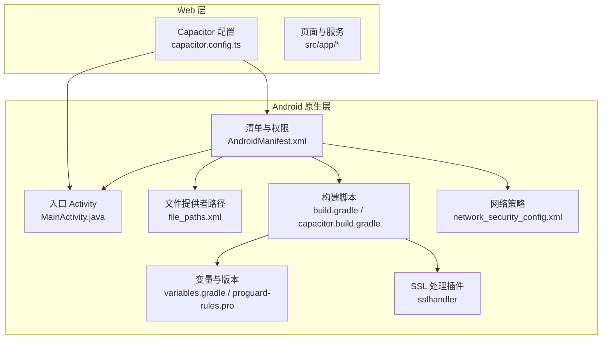
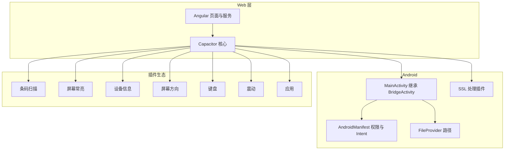
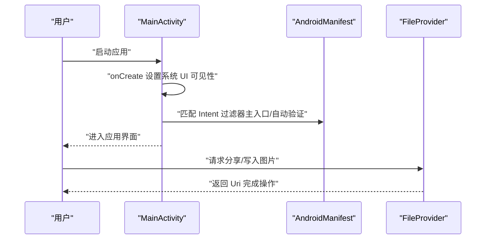
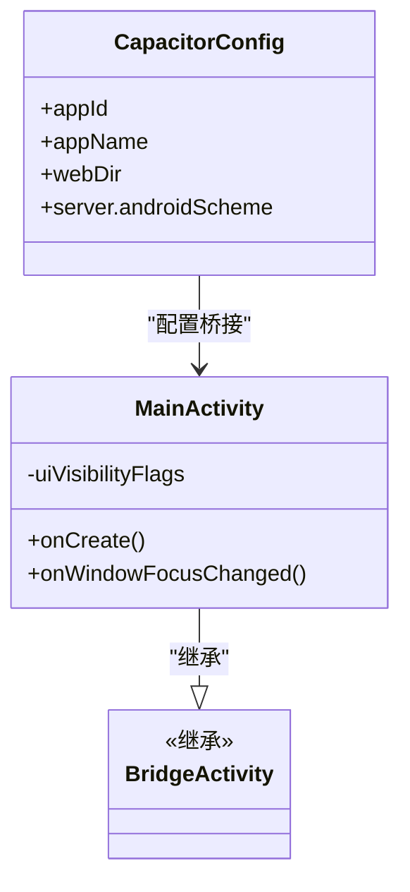
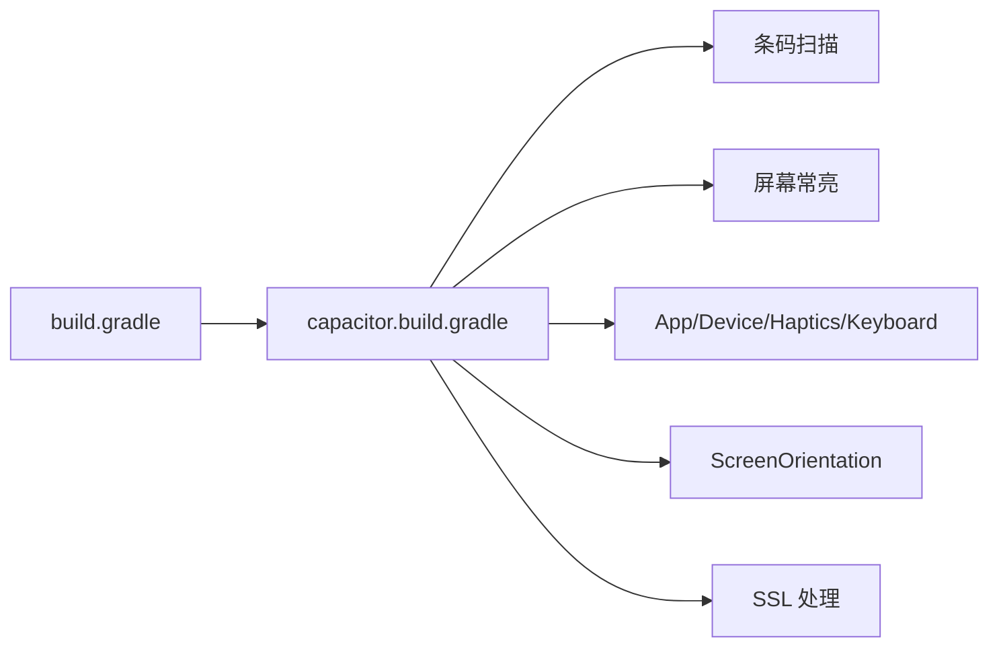

# 原生平台集成

<cite>
**本文档引用的文件**
- [capacitor.config.ts](file://capacitor.config.ts)
- [android\app\src\main\AndroidManifest.xml](file://android/app/src/main/AndroidManifest.xml)
- [android\app\src\main\java\com\suchbyte\macrodeck\MainActivity.java](file://android/app/src/main/java/com/suchbyte/macrodeck/MainActivity.java)
- [android\app\src\main\res\xml\file_paths.xml](file://android/app/src/main/res/xml/file_paths.xml)
- [android\app\build.gradle](file://android/app/build.gradle)
- [android\app\capacitor.build.gradle](file://android/app/capacitor.build.gradle)
- [android\variables.gradle](file://android/variables.gradle)
- [android\app\proguard-rules.pro](file://android/app/proguard-rules.pro)
- [resources\android\xml\network_security_config.xml](file://resources/android/xml/network_security_config.xml)
- [ios\App\App\Info.plist](file://ios/App/App/Info.plist)
- [ios\App\App\AppDelegate.swift](file://ios/App/App/AppDelegate.swift)
- [ios\App\Macro Deck Client.entitlements](file://ios/App/Macro Deck Client.entitlements)
- [ios\App\Podfile](file://ios/App/Podfile)
- [capacitor_plugins\sslhandler\android\build.gradle](file://capacitor_plugins/sslhandler/android/build.gradle)
- [capacitor_plugins\sslhandler\android\src\main\java\com\suchbyte\sslhandler\SslHandlerPlugin.java](file://capacitor_plugins/sslhandler/android/src/main/java/com/suchbyte/sslhandler/SslHandlerPlugin.java)
- [capacitor_plugins\sslhandler\ios\Plugin\SslHandlerPlugin.h](file://capacitor_plugins/sslhandler/ios/Plugin/SslHandlerPlugin.h)
- [capacitor_plugins\sslhandler\ios\Plugin\SslHandlerPlugin.m](file://capacitor_plugins/sslhandler/ios/Plugin/SslHandlerPlugin.m)
- [android\fastlane\Fastfile](file://android/fastlane/Fastfile)
- [ios\App\fastlane\Fastfile](file://ios/App/fastlane/Fastfile)
</cite>

## 更新摘要
**所做更改**
- 更新了平台聚焦策略：从多平台支持简化为仅Android平台
- 重构了Capacitor插件系统，大幅精简iOS相关配置
- 平台特定功能集中到Android实现，iOS配置大幅简化
- 更新了架构图和组件分析以反映新的平台聚焦

## 目录
1. [简介](#简介)
2. [项目结构](#项目结构)
3. [核心组件](#核心组件)
4. [架构总览](#架构总览)
5. [详细组件分析](#详细组件分析)
6. [依赖分析](#依赖分析)
7. [性能考虑](#性能考虑)
8. [故障排查指南](#故障排查指南)
9. [结论](#结论)
10. [附录](#附录)

## 简介
本文件面向开发者，系统化梳理 Macro-Deck-Client-App 在 Android 平台上的原生平台集成方案。重点覆盖以下方面：
- Capacitor 框架如何实现 Web 技术与原生能力的桥接
- Android 平台特定配置：AndroidManifest 权限与 Intent 过滤器、MainActivity 入口点、FileProvider 路径
- 原生功能实现要点：相机扫描（条码）、屏幕常亮、系统导航栏沉浸式显示、网络状态与明文流量策略
- 构建与发布流程：Gradle 与 Fastlane 配置、签名与应用商店发布
- 平台差异与兼容性建议、扩展与自定义最佳实践

**重要变更**：项目已从多平台支持简化为仅Android平台，iOS相关配置大幅精简，Capacitor插件系统集中到Android实现。

## 项目结构
本项目采用 Capacitor 单端统一工程结构，专注于 Android 平台的原生层配置与资源，并通过 Capacitor CLI 同步到 web 层。

**图表来源**
- [capacitor.config.ts:1-16](file://capacitor.config.ts#L1-L16)
- [android\app\src\main\AndroidManifest.xml:1-61](file://android/app/src/main/AndroidManifest.xml#L1-L61)
- [android\app\src\main\java\com\suchbyte\macrodeck\MainActivity.java:1-38](file://android/app/src/main/java/com/suchbyte/macrodeck/MainActivity.java#L1-L38)
- [android\app\src\main\res\xml\file_paths.xml:1-5](file://android/app/src/main/res/xml/file_paths.xml#L1-L5)
- [android\app\build.gradle:1-61](file://android/app/build.gradle#L1-L61)
- [android\app\capacitor.build.gradle:1-27](file://android/app/capacitor.build.gradle#L1-L27)
- [android\variables.gradle:1-17](file://android/variables.gradle#L1-L17)
- [resources\android\xml\network_security_config.xml:1-7](file://resources/android/xml/network_security_config.xml#L1-L7)

**章节来源**
- [capacitor.config.ts:1-16](file://capacitor.config.ts#L1-L16)
- [android\app\build.gradle:1-61](file://android/app/build.gradle#L1-L61)
- [ios\App\Podfile:1-33](file://ios/App/Podfile#L1-L33)

## 核心组件
- Capacitor 配置：统一应用 ID、应用名、webDir、服务器 Scheme（Android 明文 http），用于桥接 Web 与原生层。
- Android 清单与权限：相机、网络状态、唤醒锁、闪光灯、明文流量；FileProvider 与 Intent 过滤器（含自动验证的 HTTPS 主机）。
- 原生能力插件：条码扫描、屏幕常亮、设备信息、键盘、震动、屏幕方向、SSL 处理等。
- 构建与发布：Gradle 任务与 Fastlane 脚本，负责 Android AAB/APK 的构建与上传。

**重要变更**：iOS平台配置已被移除，所有原生功能集中在Android实现。

**章节来源**
- [capacitor.config.ts:1-16](file://capacitor.config.ts#L1-L16)
- [android\app\src\main\AndroidManifest.xml:1-61](file://android/app/src/main/AndroidManifest.xml#L1-L61)
- [ios\App\App\Info.plist:1-61](file://ios/App/App/Info.plist#L1-L61)
- [ios\App\App\AppDelegate.swift:1-55](file://ios/App/App/AppDelegate.swift#L1-L55)
- [android\app\capacitor.build.gradle:10-21](file://android/app/capacitor.build.gradle#L10-L21)
- [ios\App\Podfile:11-23](file://ios/App/Podfile#L11-L23)

## 架构总览
Capacitor 将 Web 内容运行于 WebView 中，通过 Capacitor 插件系统调用原生能力。Android 使用 BridgeActivity 作为入口，iOS 相关配置已被移除。

**图表来源**
- [android\app\src\main\java\com\suchbyte\macrodeck\MainActivity.java:8-38](file://android/app/src/main/java/com/suchbyte/macrodeck/MainActivity.java#L8-L38)
- [android\app\src\main\AndroidManifest.xml:27-57](file://android/app/src/main/AndroidManifest.xml#L27-L57)
- [android\app\src\main\res\xml\file_paths.xml:1-5](file://android/app/src/main/res/xml/file_paths.xml#L1-L5)
- [android\app\capacitor.build.gradle:11-19](file://android/app/capacitor.build.gradle#L11-L19)

## 详细组件分析

### Android 平台集成
- 入口 Activity 与系统 UI
  - MainActivity 继承 BridgeActivity，并在窗口焦点变化时重设系统 UI 可见性，实现沉浸式体验。
  - 关键行为：系统栏可见性监听与恢复、全屏与导航栏隐藏标志位组合。
- 清单与权限
  - 必需权限：网络访问、网络状态、唤醒锁、WIFI 状态、相机、闪光灯。
  - 特殊配置：明文流量允许（cleartextTrafficPermitted）、Google MLKit 依赖声明、Google Analytics 关闭自动屏幕上报。
  - Intent 过滤器：主入口与自动验证的 HTTPS 主机（Universal Links 支持）。
- 文件提供者
  - FileProvider 提供外部存储与缓存路径映射，便于分享与相机写入。
- 构建与版本
  - Gradle 默认配置包含编译/目标 SDK、最小 SDK、数据绑定、混淆规则。
  - 变量集中管理版本号与第三方库版本。
  - Capacitor 生成的构建脚本注入插件依赖。
- 网络安全策略
  - network_security_config.xml 对 localhost 开放明文流量，满足开发调试场景。

**图表来源**
- [android\app\src\main\java\com\suchbyte\macrodeck\MainActivity.java:10-29](file://android/app/src/main/java/com/suchbyte/macrodeck/MainActivity.java#L10-L29)
- [android\app\src\main\AndroidManifest.xml:27-47](file://android/app/src/main/AndroidManifest.xml#L27-L47)
- [android\app\src\main\res\xml\file_paths.xml:2-4](file://android/app/src/main/res/xml/file_paths.xml#L2-L4)

**章节来源**
- [android\app\src\main\java\com\suchbyte\macrodeck\MainActivity.java:1-38](file://android/app/src/main/java/com/suchbyte/macrodeck/MainActivity.java#L1-L38)
- [android\app\src\main\AndroidManifest.xml:1-61](file://android/app/src/main/AndroidManifest.xml#L1-L61)
- [android\app\src\main\res\xml\file_paths.xml:1-5](file://android/app/src/main/res/xml/file_paths.xml#L1-L5)
- [resources\android\xml\network_security_config.xml:1-7](file://resources/android/xml/network_security_config.xml#L1-L7)
- [android\app\build.gradle:1-61](file://android/app/build.gradle#L1-L61)
- [android\app\capacitor.build.gradle:10-21](file://android/app/capacitor.build.gradle#L10-L21)
- [android\variables.gradle:1-17](file://android/variables.gradle#L1-L17)

### Capacitor 桥接与原生能力
- 配置与桥接
  - Capacitor 配置指定应用 ID、名称、webDir 与平台 Scheme，确保 Web 与原生通信通道正确建立。
- 插件生态
  - Android：条码扫描、屏幕常亮、App/Device/Haptics/Keyboard/ScreenOrientation/SSL 等模块在构建脚本中显式引入。
  - iOS：相关配置已被移除，所有插件集中在Android实现。
- 典型能力示例
  - 相机访问：Android 通过 Manifest 权限与相机功能。
  - 屏幕常亮：通过 keep-awake 插件在业务需要时保持 CPU 运行。
  - 网络状态：Android 通过 ACCESS_NETWORK_STATE/WIFI_STATE 权限查询。
  - SSL 处理：Android 与 iOS 均引入 sslhandler 插件以增强证书与握手处理。

**图表来源**
- [android\app\src\main\java\com\suchbyte\macrodeck\MainActivity.java:8-38](file://android/app/src/main/java/com/suchbyte/macrodeck/MainActivity.java#L8-L38)
- [capacitor.config.ts:3-12](file://capacitor.config.ts#L3-L12)

**章节来源**
- [capacitor.config.ts:1-16](file://capacitor.config.ts#L1-L16)
- [android\app\capacitor.build.gradle:11-19](file://android/app/capacitor.build.gradle#L11-L19)
- [ios\App\Podfile:14-22](file://ios/App/Podfile#L14-L22)

### 平台差异与兼容性
- 系统 UI 与沉浸式
  - Android：通过系统 UI 可见性标志位控制导航栏与状态栏隐藏；MainActivity 在焦点变化时重设可见性。
  - iOS：相关配置已被移除，不再支持iOS平台。
- 网络与安全
  - Android：清单中允许明文流量；网络策略 XML 对 localhost 放行；相机与网络权限明确声明。
  - iOS：Info.plist ATS 允许任意加载；Entitlements 支持 Universal Links（已移除）。
- 插件一致性
  - Android 通过 Capacitor 插件体系提供一致的 API 表面，避免平台差异对业务逻辑的影响。
  - iOS 插件配置已被移除，所有功能集中在Android实现。

**章节来源**
- [android\app\src\main\java\com\suchbyte\macrodeck\MainActivity.java:10-29](file://android/app/src/main/java/com/suchbyte/macrodeck/MainActivity.java#L10-L29)
- [android\app\src\main\AndroidManifest.xml:22-25](file://android/app/src/main/AndroidManifest.xml#L22-L25)
- [resources\android\xml\network_security_config.xml:3-5](file://resources/android/xml/network_security_config.xml#L3-L5)
- [ios\App\App\Info.plist:5-9](file://ios/App/App/Info.plist#L5-L9)
- [ios\App\Macro Deck Client.entitlements:7-7](file://ios/App/Macro Deck Client.entitlements#L7-L7)

## 依赖分析
- Android 依赖链
  - Gradle 默认配置 → Capacitor 生成构建脚本 → 插件模块（条码扫描、屏幕常亮、App/Device/Haptics/Keyboard/ScreenOrientation/SSL）。
  - 变量集中管理 SDK 与第三方库版本，减少重复与冲突。
- iOS 依赖链
  - iOS 相关配置已被移除，不再维护iOS依赖链。

**图表来源**
- [android\app\build.gradle:39-49](file://android/app/build.gradle#L39-L49)
- [android\app\capacitor.build.gradle:11-19](file://android/app/capacitor.build.gradle#L11-L19)

**章节来源**
- [android\app\build.gradle:1-61](file://android/app/build.gradle#L1-L61)
- [android\app\capacitor.build.gradle:1-27](file://android/app/capacitor.build.gradle#L1-L27)
- [ios\App\Podfile:1-33](file://ios/App/Podfile#L1-L33)

## 性能考虑
- 构建优化
  - Android：关闭 Release 混淆可提升调试效率；按需开启数据绑定；合理设置 SDK 版本以平衡兼容与性能。
  - iOS：相关配置已被移除，不再适用。
- 运行时优化
  - 屏幕常亮仅在必要时启用，避免过度耗电。
  - 相机扫描与网络请求应结合业务场景进行节流与缓存。
- 资源与安全
  - Android 明文流量仅在开发阶段使用；生产环境建议迁移至 HTTPS 并移除明文策略。
  - iOS ATS 与 Entitlements 配置已被移除。

## 故障排查指南
- Android
  - 系统 UI 不生效：检查 MainActivity 中系统 UI 可见性标志位与焦点回调逻辑。
  - 文件分享失败：确认 FileProvider authorities 与 file_paths.xml 路径映射是否正确。
  - 权限未生效：确认清单中权限声明与运行时申请流程（如适用）。
- iOS
  - iOS 相关配置已被移除，不再支持iOS平台。
- 构建与发布
  - Android：Fastlane 任务需提供版本号与签名参数；aab 与 apk 产物路径需与脚本一致。
  - iOS：相关配置已被移除，不再适用。

**章节来源**
- [android\app\src\main\java\com\suchbyte\macrodeck\MainActivity.java:10-29](file://android/app/src/main/java/com/suchbyte/macrodeck/MainActivity.java#L10-L29)
- [android\app\src\main\res\xml\file_paths.xml:2-4](file://android/app/src/main/res/xml/file_paths.xml#L2-L4)
- [ios\App\Macro Deck Client.entitlements:5-8](file://ios/App/Macro Deck Client.entitlements#L5-L8)
- [ios\App\App\Info.plist:40-56](file://ios/App/App/Info.plist#L40-L56)
- [android\fastlane\Fastfile:14-45](file://android/fastlane/Fastfile#L14-L45)

## 结论
本项目通过 Capacitor 将 Angular/Web 技术与原生能力解耦，专注于 Android 平台的原生层配置与实现。围绕相机、网络、屏幕常亮与链接处理等核心能力，项目提供了清晰的配置与实现路径。iOS平台配置已被移除，所有原生功能集中在Android实现。建议在生产环境中严格区分开发与生产的网络策略与权限配置，并持续关注插件版本与平台政策更新。

## 附录
- 平台特定构建与发布
  - Android：使用 Fastlane lane build 执行 Gradle bundle/assemble 并签名；通过 release lane 上传到 Play Store。
  - iOS：相关配置已被移除，不再支持iOS平台。
- 最佳实践
  - 保持 Capacitor 与插件版本同步，定期执行更新。
  - 在 Android 清单中仅保留必要权限，避免过度授权引发用户拒绝。
  - 使用 Fastlane 管理版本号与构建号，确保发布一致性。
  - SSL 处理插件已集成到Android实现中，无需额外配置。

**章节来源**
- [android\fastlane\Fastfile:1-56](file://android/fastlane/Fastfile#L1-L56)
- [ios\App\fastlane\Fastfile:1-68](file://ios/App/fastlane/Fastfile#L1-L68)