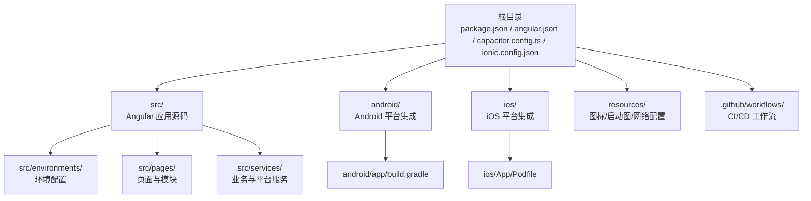
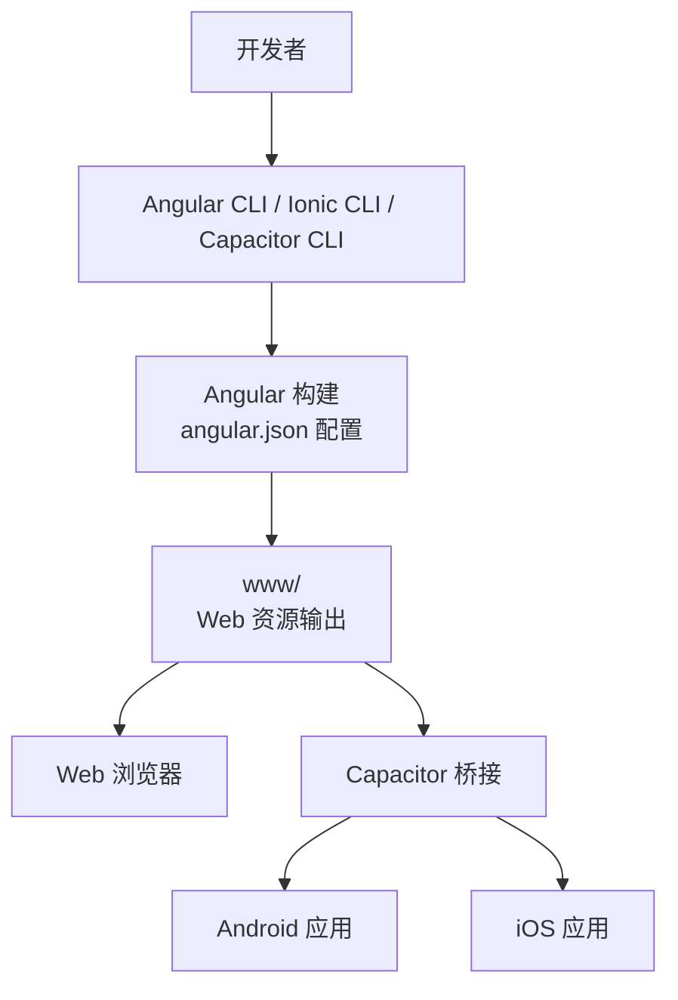
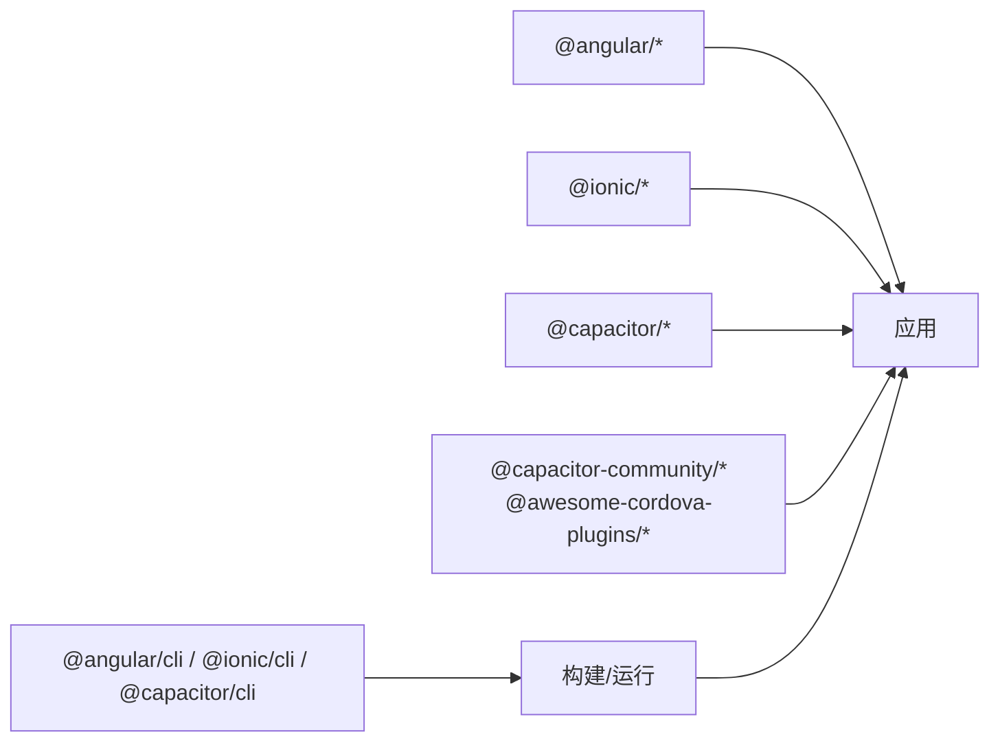

# 快速开始

<cite>
**本文引用的文件**
- [package.json](file://package.json)
- [angular.json](file://angular.json)
- [capacitor.config.ts](file://capacitor.config.ts)
- [ionic.config.json](file://ionic.config.json)
- [tsconfig.json](file://tsconfig.json)
- [tsconfig.app.json](file://tsconfig.app.json)
- [.browserslistrc](file://.browserslistrc)
- [Dockerfile](file://Dockerfile)
- [README.md](file://README.md)
- [src/main.ts](file://src/main.ts)
- [src/app/app.module.ts](file://src/app/app.module.ts)
- [src/environments/environment.ts](file://src/environments/environment.ts)
- [src/environments/environment.web.ts](file://src/environments/environment.web.ts)
- [android/app/build.gradle](file://android/app/build.gradle)
- [ios/App/Podfile](file://ios/App/Podfile)
- [.github/workflows/ci.yml](file://.github/workflows/ci.yml)
</cite>

## 目录
1. [简介](#简介)
2. [项目结构](#项目结构)
3. [核心组件](#核心组件)
4. [架构总览](#架构总览)
5. [详细组件分析](#详细组件分析)
6. [依赖分析](#依赖分析)
7. [性能考虑](#性能考虑)
8. [故障排除指南](#故障排除指南)
9. [结论](#结论)
10. [附录](#附录)

## 简介
本指南面向初学者，帮助你在本地快速搭建 Macro-Deck-Client-App 的开发环境并成功运行项目。该应用基于 Angular 与 Ionic 框架，采用 Capacitor 进行跨平台编译，支持 Web、Android 与 iOS 平台。你将学到：
- 开发环境要求与工具链准备（Node.js、Angular CLI、Ionic CLI、Capacitor CLI、Android Studio、Xcode）
- 项目克隆、依赖安装与开发服务器启动
- 多平台运行方式（Web 开发服务器、Android 模拟器调试、iOS 模拟器调试）
- 常见开发工具配置建议（IDE 设置、调试工具、热重载）
- 首次运行常见问题与解决方案

## 项目结构
该项目采用“单仓库多平台”架构，核心目录与职责如下：
- 根目录：包管理与构建配置（package.json、angular.json、capacitor.config.ts、ionic.config.json、tsconfig.*、.browserslistrc、Dockerfile）
- src：前端源码（Angular 应用入口、模块、页面、服务、数据类型、资源与环境配置）
- android：Android 平台集成（Gradle 配置、Capacitor 集成、资源与清单）
- ios：iOS 平台集成（Podfile、Xcode 工作区、资源与 entitlements）
- resources：图标、启动图与网络配置等静态资源
- .github/workflows：CI/CD 工作流（版本确定、基础构建、iOS/Android 构建与部署）

**图表来源**
- [package.json:1-92](file://package.json#L1-L92)
- [angular.json:1-203](file://angular.json#L1-L203)
- [capacitor.config.ts:1-16](file://capacitor.config.ts#L1-L16)
- [ionic.config.json:1-10](file://ionic.config.json#L1-L10)
- [src/environments/environment.ts:1-36](file://src/environments/environment.ts#L1-L36)
- [android/app/build.gradle:1-61](file://android/app/build.gradle#L1-L61)
- [ios/App/Podfile:1-33](file://ios/App/Podfile#L1-L33)

**章节来源**
- [README.md:1-25](file://README.md#L1-L25)
- [package.json:1-92](file://package.json#L1-L92)
- [angular.json:1-203](file://angular.json#L1-L203)

## 核心组件
- 包管理与脚本：通过 package.json 定义 Angular、Ionic、Capacitor 及开发工具版本，并提供启动开发服务器、构建、测试、Lint 等脚本。
- 构建与配置：angular.json 定义了多配置构建目标（development、web、production、web_production），以及服务端口与资源处理策略；capacitor.config.ts 配置了应用 ID、名称、Web 打包目录与平台服务器参数。
- TypeScript 与浏览器兼容：tsconfig.json 与 tsconfig.app.json 指定编译目标、模块系统与严格模式；.browserslistrc 指定受支持的浏览器范围。
- 平台集成：ionic.config.json 声明使用 Capacitor/Cordova 集成；android/app/build.gradle 与 ios/App/Podfile 分别定义 Android 与 iOS 的 SDK、插件与依赖。

**章节来源**
- [package.json:7-14](file://package.json#L7-L14)
- [angular.json:13-139](file://angular.json#L13-L139)
- [capacitor.config.ts:3-13](file://capacitor.config.ts#L3-L13)
- [tsconfig.json:4-26](file://tsconfig.json#L4-L26)
- [tsconfig.app.json:4-15](file://tsconfig.app.json#L4-L15)
- [.browserslistrc:11-17](file://.browserslistrc#L11-L17)
- [ionic.config.json:3-6](file://ionic.config.json#L3-L6)
- [android/app/build.gradle:3-49](file://android/app/build.gradle#L3-L49)
- [ios/App/Podfile:3-23](file://ios/App/Podfile#L3-L23)

## 架构总览
应用采用“统一代码库 + 平台桥接”的架构：
- Web：直接由 Angular 构建输出至 www 目录，可作为 PWA 使用。
- Android/iOS：通过 Capacitor 将 Web 输出打包为原生应用，加载本地 www 资源并注入原生能力（如屏幕方向、键盘、设备信息等）。

**图表来源**
- [angular.json:15-46](file://angular.json#L15-L46)
- [capacitor.config.ts:6](file://capacitor.config.ts#L6)
- [ionic.config.json:3-6](file://ionic.config.json#L3-L6)

## 详细组件分析

### 开发环境要求
- Node.js 与包管理
  - 推荐使用 Node.js 22.x LTS（镜像中使用 22.14.0）。Dockerfile 显示全局安装了 @angular/cli、@ionic/cli、@capacitor/cli，并使用 yarn 安装依赖。
  - 参考路径：[Dockerfile:1-16](file://Dockerfile#L1-L16)
- Angular 与 Ionic
  - Angular 19.x 与 Ionic Angular 8.x。package.json 中声明了对应版本。
  - 参考路径：[package.json:17-42](file://package.json#L17-L42)
- Capacitor
  - Capacitor Core 与平台插件版本在 package.json 中声明；capacitor.config.ts 指定 webDir 为 www。
  - 参考路径：[package.json:30-37](file://package.json#L30-L37)，[capacitor.config.ts:6](file://capacitor.config.ts#L6)
- Android 开发
  - Android Gradle 插件与 SDK 版本在 android/app/build.gradle 中定义；minSdkVersion 与 targetSdkVersion 由根级 ext 字段提供。
  - 参考路径：[android/app/build.gradle:4-12](file://android/app/build.gradle#L4-L12)
- iOS 开发
  - iOS 平台最低版本 13.0；Podfile 声明 Capacitor 与相关插件。
  - 参考路径：[ios/App/Podfile:3](file://ios/App/Podfile#L3)，[ios/App/Podfile:11-23](file://ios/App/Podfile#L11-L23)

**章节来源**
- [Dockerfile:1-16](file://Dockerfile#L1-L16)
- [package.json:17-57](file://package.json#L17-L57)
- [capacitor.config.ts:6](file://capacitor.config.ts#L6)
- [android/app/build.gradle:4-12](file://android/app/build.gradle#L4-L12)
- [ios/App/Podfile:3](file://ios/App/Podfile#L3)
- [ios/App/Podfile:11-23](file://ios/App/Podfile#L11-L23)

### 项目克隆与依赖安装
- 克隆仓库后，使用 yarn 安装依赖（Dockerfile 中演示了全局安装 CLI 后执行 yarn install）。
- 参考路径：
  - [Dockerfile:10](file://Dockerfile#L10)
  - [package.json:59-90](file://package.json#L59-L90)

**章节来源**
- [Dockerfile:10](file://Dockerfile#L10)
- [package.json:59-90](file://package.json#L59-L90)

### 启动开发服务器（Web）
- 使用 Angular CLI 启动开发服务器，默认配置 development。
- 参考路径：
  - [package.json:9](file://package.json#L9)
  - [angular.json:122-139](file://angular.json#L122-L139)

**章节来源**
- [package.json:9](file://package.json#L9)
- [angular.json:122-139](file://angular.json#L122-L139)

### Android 调试（模拟器/真机）
- 步骤概览
  1) 在 Android Studio 中创建或打开模拟器
  2) 在项目根目录执行 Capacitor 命令进行同步与预览（例如添加平台、同步、运行）
  3) 在 Android Studio 中选择设备并运行
- 参考路径：
  - [capacitor.config.ts:6](file://capacitor.config.ts#L6)
  - [ionic.config.json:3-6](file://ionic.config.json#L3-L6)
  - [android/app/build.gradle:4-12](file://android/app/build.gradle#L4-L12)

**章节来源**
- [capacitor.config.ts:6](file://capacitor.config.ts#L6)
- [ionic.config.json:3-6](file://ionic.config.json#L3-L6)
- [android/app/build.gradle:4-12](file://android/app/build.gradle#L4-L12)

### iOS 调试（模拟器/真机）
- 步骤概览
  1) 在终端进入 ios/App 并执行 pod install 安装依赖
  2) 在 Xcode 中打开 .xcworkspace 工作区
  3) 选择模拟器或连接真机制品，点击运行
- 参考路径：
  - [ios/App/Podfile:3](file://ios/App/Podfile#L3)
  - [ios/App/Podfile:11-23](file://ios/App/Podfile#L11-L23)

**章节来源**
- [ios/App/Podfile:3](file://ios/App/Podfile#L3)
- [ios/App/Podfile:11-23](file://ios/App/Podfile#L11-L23)

### 环境与配置要点
- 环境变量
  - environment.ts 用于原生应用开发环境；environment.web.ts 用于 Web 开发环境。
  - 参考路径：
    - [src/environments/environment.ts:4-11](file://src/environments/environment.ts#L4-L11)
    - [src/environments/environment.web.ts:2-9](file://src/environments/environment.web.ts#L2-L9)
- 构建配置
  - angular.json 提供 development、web、production、web_production 多配置；默认 production。
  - 参考路径：[angular.json:47-121](file://angular.json#L47-L121)
- TypeScript 编译目标
  - 目标 ES2022，模块系统 ES2020，启用严格模式。
  - 参考路径：[tsconfig.json:19-25](file://tsconfig.json#L19-L25)

**章节来源**
- [src/environments/environment.ts:4-11](file://src/environments/environment.ts#L4-L11)
- [src/environments/environment.web.ts:2-9](file://src/environments/environment.web.ts#L2-L9)
- [angular.json:47-121](file://angular.json#L47-L121)
- [tsconfig.json:19-25](file://tsconfig.json#L19-L25)

## 依赖分析
- 前端框架与工具
  - Angular 19.x、Ionic Angular 8.x、Service Worker、RxJS、Zone.js 等。
  - 参考路径：[package.json:17-57](file://package.json#L17-L57)
- 原生桥接与插件
  - @capacitor/* 核心与平台插件、@awesome-cordova-plugins/*、@capacitor-community/* 插件。
  - 参考路径：[package.json:30-57](file://package.json#L30-L57)
- 构建与测试
  - @angular-devkit/build-angular、@angular/cli、@capacitor/cli、@ionic/cli、Karma、ESLint 等。
  - 参考路径：[package.json:60-90](file://package.json#L60-L90)

**图表来源**
- [package.json:17-57](file://package.json#L17-L57)
- [package.json:60-90](file://package.json#L60-L90)

**章节来源**
- [package.json:17-90](file://package.json#L17-L90)

## 性能考虑
- 构建优化
  - production 与 web_production 配置启用了体积预算与输出哈希，适合发布场景。
  - 参考路径：[angular.json:87-107](file://angular.json#L87-L107)，[angular.json:48-69](file://angular.json#L48-L69)
- Service Worker
  - 在非开发模式下注册，提升缓存与离线体验。
  - 参考路径：[src/app/app.module.ts:31-35](file://src/app/app.module.ts#L31-L35)
- 浏览器兼容
  - .browserslistrc 指定 Chrome 61+、Safari 11+、iOS 11+ 等，确保现代浏览器支持。
  - 参考路径：[.browserslistrc:11-17](file://.browserslistrc#L11-L17)

**章节来源**
- [angular.json:48-107](file://angular.json#L48-L107)
- [src/app/app.module.ts:31-35](file://src/app/app.module.ts#L31-L35)
- [.browserslistrc:11-17](file://.browserslistrc#L11-L17)

## 故障排除指南
- Node 版本不匹配
  - 症状：安装失败或构建报错
  - 解决：使用 Node.js 22.x LTS（镜像中使用 22.14.0），确保 yarn 或 npm 版本兼容
  - 参考路径：[Dockerfile:1](file://Dockerfile#L1)
- Android 构建失败（找不到 SDK/插件）
  - 症状：Gradle 同步失败或找不到 minSdkVersion/targetSdkVersion
  - 解决：在 Android Studio 中安装对应 SDK 与构建工具；确认根级 ext 字段已正确设置
  - 参考路径：[android/app/build.gradle:4-12](file://android/app/build.gradle#L4-L12)
- iOS 构建失败（CocoaPods）
  - 症状：pod install 报错或 Xcode 编译失败
  - 解决：在 ios/App 目录执行 pod install；确保 Xcode 与 CocoaPods 版本兼容；检查 Podfile 声明的平台版本
  - 参考路径：[ios/App/Podfile:3](file://ios/App/Podfile#L3)，[ios/App/Podfile:30-32](file://ios/App/Podfile#L30-L32)
- Web 端热重载无效
  - 症状：修改代码后浏览器未自动刷新
  - 解决：确认使用 development 配置启动；检查 angular.json 中 dev-server 配置是否正确
  - 参考路径：[angular.json:122-139](file://angular.json#L122-L139)
- Capacitor 预览无法加载 www
  - 症状：原生应用启动后白屏或加载失败
  - 解决：确保已执行构建并将 www 生成到正确目录；检查 capacitor.config.ts 中 webDir 配置
  - 参考路径：[capacitor.config.ts:6](file://capacitor.config.ts#L6)

**章节来源**
- [Dockerfile:1](file://Dockerfile#L1)
- [android/app/build.gradle:4-12](file://android/app/build.gradle#L4-L12)
- [ios/App/Podfile:3](file://ios/App/Podfile#L3)
- [ios/App/Podfile:30-32](file://ios/App/Podfile#L30-L32)
- [angular.json:122-139](file://angular.json#L122-L139)
- [capacitor.config.ts:6](file://capacitor.config.ts#L6)

## 结论
通过本指南，你可以完成从环境准备到多平台运行的全流程。建议优先在 Web 环境验证功能，再逐步接入 Android/iOS 平台。遇到问题时，优先核对 Node 版本、CLI 版本与平台 SDK/插件版本，确保配置与依赖一致。

## 附录

### 快速操作清单
- 安装 Node.js 22.x（推荐使用 22.14.0）
- 全局安装 Angular CLI、Ionic CLI、Capacitor CLI
- 使用 yarn 安装依赖
- 启动 Web 开发服务器
- Android：在 Android Studio 创建模拟器，执行 Capacitor 平台命令后运行
- iOS：在终端执行 pod install，使用 Xcode 打开工作区并运行

**章节来源**
- [Dockerfile:6-10](file://Dockerfile#L6-L10)
- [package.json:59-90](file://package.json#L59-L90)
- [package.json:9](file://package.json#L9)
- [ionic.config.json:3-6](file://ionic.config.json#L3-L6)
- [android/app/build.gradle:4-12](file://android/app/build.gradle#L4-L12)
- [ios/App/Podfile:3](file://ios/App/Podfile#L3)