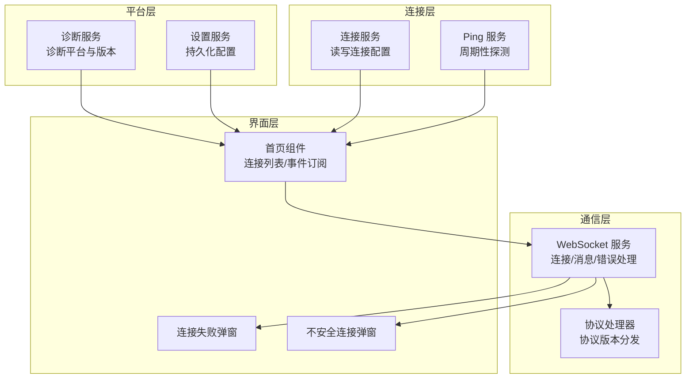
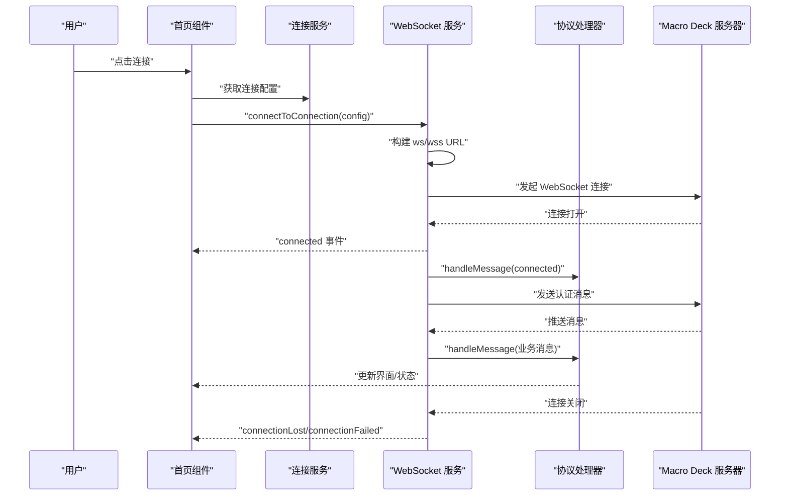
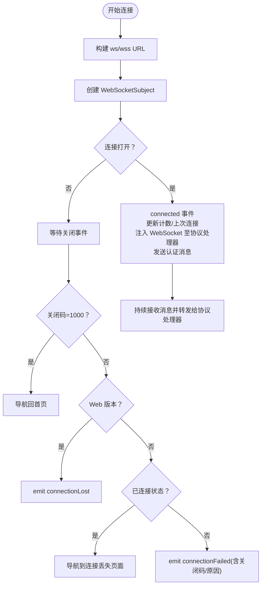
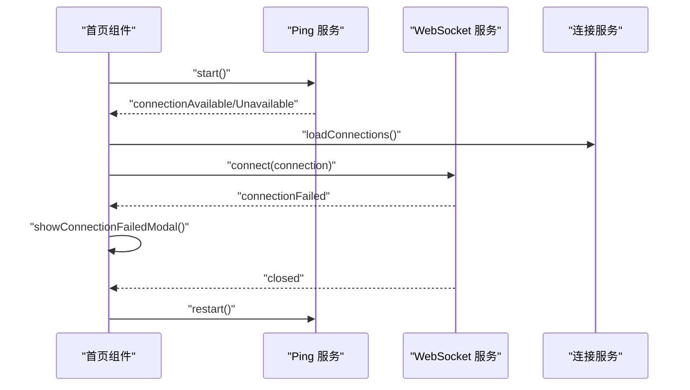
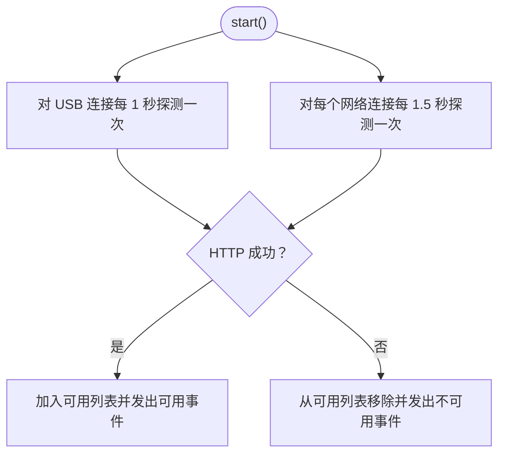
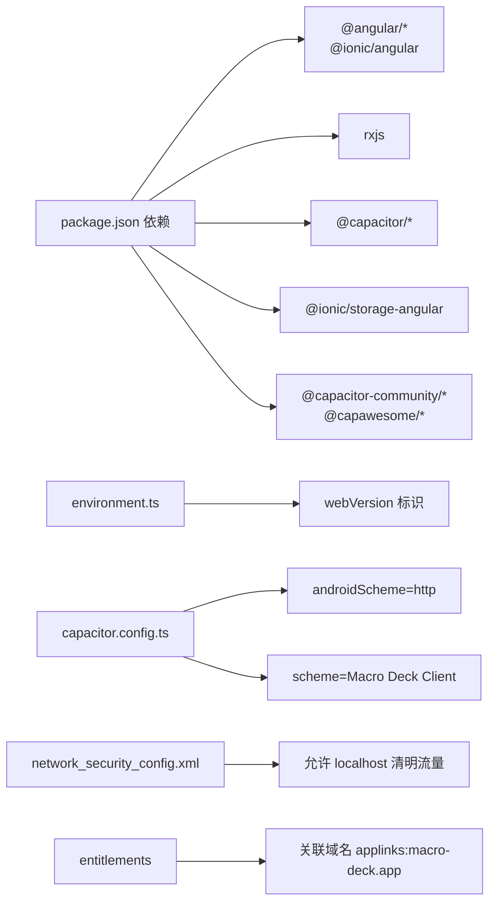

# 故障排除

<cite>
**本文档引用的文件**
- [README.md](file://README.md)
- [package.json](file://package.json)
- [capacitor.config.ts](file://capacitor.config.ts)
- [resources/android/xml/network_security_config.xml](file://resources/android/xml/network_security_config.xml)
- [ios/App/Macro Deck Client.entitlements](file://ios/App/Macro Deck Client.entitlements)
- [src/app/services/diagnostic/diagnostic.service.ts](file://src/app/services/diagnostic/diagnostic.service.ts)
- [src/app/services/connection/connection.service.ts](file://src/app/services/connection/connection.service.ts)
- [src/app/services/websocket/websocket.service.ts](file://src/app/services/websocket/websocket.service.ts)
- [src/app/pages/home/home.page.ts](file://src/app/pages/home/home.page.ts)
- [src/app/pages/home/modals/connection-failed/connection-failed.component.ts](file://src/app/pages/home/modals/connection-failed/connection-failed.component.ts)
- [src/app/pages/home/modals/insecure-connection/insecure-connection.component.ts](file://src/app/pages/home/modals/insecure-connection/insecure-connection.component.ts)
- [src/app/services/ping/ping.service.ts](file://src/app/services/ping/ping.service.ts)
- [src/app/services/settings/settings.service.ts](file://src/app/services/settings/settings.service.ts)
- [src/app/services/protocol/protocol-handler.service.ts](file://src/app/services/protocol/protocol-handler.service.ts)
- [src/app/datatypes/connection.ts](file://src/app/datatypes/connection.ts)
- [src/environments/environment.ts](file://src/environments/environment.ts)
</cite>

## 目录
1. [简介](#简介)
2. [项目结构](#项目结构)
3. [核心组件](#核心组件)
4. [架构总览](#架构总览)
5. [详细组件分析](#详细组件分析)
6. [依赖分析](#依赖分析)
7. [性能考虑](#性能考虑)
8. [故障排除指南](#故障排除指南)
9. [结论](#结论)
10. [附录](#附录)

## 简介
本指南面向开发者与高级用户，系统化梳理 Macro-Deck-Client-App 的连接、网络、平台兼容与性能相关问题的诊断与修复路径。内容覆盖：
- 连接问题：主机可达性、端口与协议、SSL/TLS、认证令牌
- WebSocket 连接失败：错误码与原因、安全错误、重连策略
- 平台特定问题：Android 清明流量与网络配置、iOS 深度链接与权限
- 性能问题：Ping 检测频率、内存与订阅管理、WakeLock 与后台行为
- 日志与追踪：控制台输出、事件流、错误弹窗与诊断服务
- 预防性维护与最佳实践：连接配置校验、超时与重试、平台适配

## 项目结构
该应用采用 Angular + Ionic 架构，统一代码库跨 iOS、Android 与 Web 平台。关键模块包括：
- 诊断与平台检测：诊断服务提供版本与平台信息
- 连接管理：本地存储连接配置，支持 USB 与网络连接
- Ping 检测：周期性探测服务器可用性
- WebSocket 通信：建立与维护实时连接，处理错误与安全提示
- 设置与协议：客户端 ID、连接计数、协议版本分发

图示来源
- [src/app/services/diagnostic/diagnostic.service.ts:10-89](file://src/app/services/diagnostic/diagnostic.service.ts#L10-L89)
- [src/app/services/connection/connection.service.ts:10-102](file://src/app/services/connection/connection.service.ts#L10-L102)
- [src/app/services/ping/ping.service.ts:13-130](file://src/app/services/ping/ping.service.ts#L13-L130)
- [src/app/services/websocket/websocket.service.ts:20-230](file://src/app/services/websocket/websocket.service.ts#L20-L230)
- [src/app/services/protocol/protocol-handler.service.ts:9-37](file://src/app/services/protocol/protocol-handler.service.ts#L9-L37)
- [src/app/pages/home/home.page.ts:39-139](file://src/app/pages/home/home.page.ts#L39-L139)
- [src/app/pages/home/modals/connection-failed/connection-failed.component.ts:13-26](file://src/app/pages/home/modals/connection-failed/connection-failed.component.ts#L13-L26)
- [src/app/pages/home/modals/insecure-connection/insecure-connection.component.ts:13-21](file://src/app/pages/home/modals/insecure-connection/insecure-connection.component.ts#L13-L21)

章节来源
- [README.md:1-25](file://README.md#L1-L25)
- [package.json:1-92](file://package.json#L1-L92)
- [capacitor.config.ts:1-16](file://capacitor.config.ts#L1-L16)

## 核心组件
- 诊断服务：提供平台检测、版本号前缀、Android Oreo 兼容性判断
- 连接服务：本地持久化连接配置，支持 USB 与网络连接的增删改查
- Ping 服务：对 USB 与已保存连接进行周期性探测，发出可用/不可用事件
- WebSocket 服务：建立 WebSocket 连接，处理打开/关闭/错误事件，展示不安全连接提示
- 首页组件：聚合连接列表、Ping 事件、WebSocket 事件，触发连接与设置
- 设置服务：客户端 ID、连接计数、屏幕方向、WakeLock、USB 参数等
- 协议处理器：根据协议版本分发消息到对应协议服务

章节来源
- [src/app/services/diagnostic/diagnostic.service.ts:10-89](file://src/app/services/diagnostic/diagnostic.service.ts#L10-L89)
- [src/app/services/connection/connection.service.ts:10-102](file://src/app/services/connection/connection.service.ts#L10-L102)
- [src/app/services/ping/ping.service.ts:13-130](file://src/app/services/ping/ping.service.ts#L13-L130)
- [src/app/services/websocket/websocket.service.ts:20-230](file://src/app/services/websocket/websocket.service.ts#L20-L230)
- [src/app/pages/home/home.page.ts:39-139](file://src/app/pages/home/home.page.ts#L39-L139)
- [src/app/services/settings/settings.service.ts:26-247](file://src/app/services/settings/settings.service.ts#L26-L247)
- [src/app/services/protocol/protocol-handler.service.ts:9-37](file://src/app/services/protocol/protocol-handler.service.ts#L9-L37)

## 架构总览
下图展示从用户操作到 WebSocket 连接与消息处理的关键流程。

图示来源
- [src/app/pages/home/home.page.ts:251-254](file://src/app/pages/home/home.page.ts#L251-L254)
- [src/app/services/connection/connection.service.ts:118-130](file://src/app/services/connection/connection.service.ts#L118-L130)
- [src/app/services/websocket/websocket.service.ts:63-87](file://src/app/services/websocket/websocket.service.ts#L63-L87)
- [src/app/services/websocket/websocket.service.ts:159-171](file://src/app/services/websocket/websocket.service.ts#L159-L171)
- [src/app/services/protocol/protocol-handler.service.ts:22-28](file://src/app/services/protocol/protocol-handler.service.ts#L22-L28)

## 详细组件分析

### WebSocket 服务（连接与错误处理）
- 连接建立：根据连接配置构造 ws/wss URL，创建 RxJS WebSocketSubject，订阅打开/关闭/消息事件
- 连接成功：更新连接计数与上次连接，向协议处理器注入 WebSocket 主题，发送“已连接”认证消息
- 连接关闭：区分主动关闭与异常关闭；异常关闭根据平台与状态导航至连接丢失或触发连接失败事件
- 安全错误：当出现安全异常（如证书不受信）时，弹出不安全连接提示弹窗
- 取消连接：监听加载弹窗取消事件，主动关闭连接并释放订阅

图示来源
- [src/app/services/websocket/websocket.service.ts:63-87](file://src/app/services/websocket/websocket.service.ts#L63-L87)
- [src/app/services/websocket/websocket.service.ts:141-172](file://src/app/services/websocket/websocket.service.ts#L141-L172)
- [src/app/services/websocket/websocket.service.ts:197-219](file://src/app/services/websocket/websocket.service.ts#L197-L219)
- [src/app/services/websocket/websocket.service.ts:224-229](file://src/app/services/websocket/websocket.service.ts#L224-L229)

章节来源
- [src/app/services/websocket/websocket.service.ts:20-230](file://src/app/services/websocket/websocket.service.ts#L20-L230)

### 首页组件（事件聚合与交互）
- 订阅 Ping 服务：连接可用/不可用事件，自动连接 USB 与已保存连接
- 订阅 WebSocket：连接失败弹窗、连接关闭后重启 Ping
- 触发连接：调用 WakeLock 与 WebSocket 服务执行连接
- 快速设置：接收深度链接扫描事件，打开新增连接弹窗

图示来源
- [src/app/pages/home/home.page.ts:89-139](file://src/app/pages/home/home.page.ts#L89-L139)
- [src/app/services/ping/ping.service.ts:36-72](file://src/app/services/ping/ping.service.ts#L36-L72)
- [src/app/services/websocket/websocket.service.ts:120-133](file://src/app/services/websocket/websocket.service.ts#L120-L133)

章节来源
- [src/app/pages/home/home.page.ts:39-139](file://src/app/pages/home/home.page.ts#L39-L139)

### Ping 服务（可用性检测）
- 对 USB 连接与已保存网络连接分别进行周期性探测
- HTTP GET /ping，超时 800ms，异常视为不可用
- 维护可用连接列表与 USB 可用标志，并发出事件

图示来源
- [src/app/services/ping/ping.service.ts:36-72](file://src/app/services/ping/ping.service.ts#L36-L72)
- [src/app/services/ping/ping.service.ts:119-128](file://src/app/services/ping/ping.service.ts#L119-L128)

章节来源
- [src/app/services/ping/ping.service.ts:13-130](file://src/app/services/ping/ping.service.ts#L13-L130)

### 连接服务（本地持久化）
- 读取/保存连接列表，按索引排序
- 生成新连接 ID（基于时间戳），支持 USB 连接默认参数
- 删除连接并更新存储

章节来源
- [src/app/services/connection/connection.service.ts:10-102](file://src/app/services/connection/connection.service.ts#L10-L102)
- [src/app/datatypes/connection.ts:1-33](file://src/app/datatypes/connection.ts#L1-L33)

### 诊断服务（平台与版本）
- 提供版本号字符串（原生平台含前缀，Web 显示“Web Client”）
- 判断 Android Oreo（SDK 26/27）以规避屏幕方向锁定限制
- 判断平台类型与是否为原生平台

章节来源
- [src/app/services/diagnostic/diagnostic.service.ts:10-89](file://src/app/services/diagnostic/diagnostic.service.ts#L10-L89)

### 设置服务（配置与统计）
- 客户端 ID 生成与获取
- 连接计数累加、上次连接记录
- 屏幕方向、WakeLock、外观主题、按钮长按延迟、USB 参数、跳过 SSL 校验等

章节来源
- [src/app/services/settings/settings.service.ts:26-247](file://src/app/services/settings/settings.service.ts#L26-L247)

### 协议处理器（版本分发）
- 根据协议版本将消息分发至对应协议服务（当前版本为 2）

章节来源
- [src/app/services/protocol/protocol-handler.service.ts:9-37](file://src/app/services/protocol/protocol-handler.service.ts#L9-L37)

## 依赖分析
- 平台与运行时
  - Capacitor 配置定义了 Android Scheme 与 iOS Scheme，影响 WebView 与原生桥接行为
  - Android 网络安全配置允许 localhost 清明流量，便于本地调试
  - iOS 权限清单包含关联域名（Deep Link）能力
- 依赖与版本
  - Angular、Ionic、RxJS、@capacitor/* 等核心依赖
  - @ionic/storage 用于本地持久化
  - @capacitor-community/barcode-scanner、@capawesome/capacitor-screen-orientation 等插件

图示来源
- [package.json:16-58](file://package.json#L16-L58)
- [src/environments/environment.ts:4-11](file://src/environments/environment.ts#L4-L11)
- [capacitor.config.ts:3-13](file://capacitor.config.ts#L3-L13)
- [resources/android/xml/network_security_config.xml:1-7](file://resources/android/xml/network_security_config.xml#L1-L7)
- [ios/App/Macro Deck Client.entitlements:1-11](file://ios/App/Macro Deck Client.entitlements#L1-L11)

章节来源
- [package.json:1-92](file://package.json#L1-L92)
- [src/environments/environment.ts:1-36](file://src/environments/environment.ts#L1-L36)
- [capacitor.config.ts:1-16](file://capacitor.config.ts#L1-L16)
- [resources/android/xml/network_security_config.xml:1-7](file://resources/android/xml/network_security_config.xml#L1-L7)
- [ios/App/Macro Deck Client.entitlements:1-11](file://ios/App/Macro Deck Client.entitlements#L1-L11)

## 性能考虑
- Ping 检测频率与超时
  - USB：1 秒间隔，降低 CPU 占用
  - 网络：1.5 秒间隔，避免频繁探测
  - 超时 800ms，异常即视为不可用，减少阻塞
- 订阅与内存
  - 首页组件在视图离开时取消所有订阅，避免内存泄漏
  - WebSocket 关闭时释放订阅与加载弹窗
- WakeLock 与后台行为
  - 连接前更新 WakeLock，防止锁屏导致任务中断
- 协议处理
  - 消息到达后立即分发，避免主线程阻塞

章节来源
- [src/app/services/ping/ping.service.ts:36-72](file://src/app/services/ping/ping.service.ts#L36-L72)
- [src/app/pages/home/home.page.ts:80-83](file://src/app/pages/home/home.page.ts#L80-L83)
- [src/app/services/websocket/websocket.service.ts:141-172](file://src/app/services/websocket/websocket.service.ts#L141-L172)
- [src/app/services/settings/settings.service.ts:196-206](file://src/app/services/settings/settings.service.ts#L196-L206)

## 故障排除指南

### 一、连接问题排查流程
1. 确认服务器可达性
   - 使用 Ping 服务探测 /ping 接口，检查可用连接列表
   - 若不可用，检查主机地址、端口、防火墙与网络策略
2. 校验连接配置
   - 确认连接名称、主机、端口、SSL 开关、认证令牌
   - USB 连接默认主机为 127.0.0.1，端口与 SSL 可在设置中调整
3. 观察错误弹窗
   - 连接失败弹窗会显示关闭码、原因与清理状态
   - 不安全连接弹窗提示证书问题，需在服务器侧正确配置证书
4. 查看诊断信息
   - 版本号与平台信息有助于定位平台差异问题

章节来源
- [src/app/services/ping/ping.service.ts:36-72](file://src/app/services/ping/ping.service.ts#L36-L72)
- [src/app/services/connection/connection.service.ts:118-130](file://src/app/services/connection/connection.service.ts#L118-L130)
- [src/app/pages/home/modals/connection-failed/connection-failed.component.ts:13-26](file://src/app/pages/home/modals/connection-failed/connection-failed.component.ts#L13-L26)
- [src/app/pages/home/modals/insecure-connection/insecure-connection.component.ts:13-21](file://src/app/pages/home/modals/insecure-connection/insecure-connection.component.ts#L13-L21)
- [src/app/services/diagnostic/diagnostic.service.ts:19-26](file://src/app/services/diagnostic/diagnostic.service.ts#L19-L26)

### 二、WebSocket 连接失败处理
- 异常关闭码
  - 1000 表示正常关闭，无需处理
  - 其他码：区分 Web 版本与原生版本，分别触发连接丢失或连接失败事件
- 安全错误
  - 出现安全异常（如证书不受信）时，弹出不安全连接提示
  - 建议在服务器侧配置受信任证书或在测试环境使用受信 CA
- 取消连接
  - 加载弹窗取消会主动关闭连接并释放订阅
- 重连策略
  - 连接关闭后自动回到首页；若需要重试，可在失败后手动再次连接

章节来源
- [src/app/services/websocket/websocket.service.ts:197-219](file://src/app/services/websocket/websocket.service.ts#L197-L219)
- [src/app/services/websocket/websocket.service.ts:120-133](file://src/app/services/websocket/websocket.service.ts#L120-L133)
- [src/app/services/websocket/websocket.service.ts:362-368](file://src/app/services/websocket/websocket.service.ts#L362-L368)

### 三、网络连接问题排查步骤
- 本地调试
  - Android 清明流量：网络配置允许 localhost，便于本地服务调试
  - Web 版本：检查 CORS 与反向代理配置
- 端口与协议
  - 确认端口开放与防火墙策略
  - SSL 开启时使用 wss，未开启时使用 ws
- 超时与重试
  - Ping 超时 800ms，若频繁不可用，检查服务器响应时间与网络质量

章节来源
- [resources/android/xml/network_security_config.xml:1-7](file://resources/android/xml/network_security_config.xml#L1-L7)
- [src/app/services/websocket/websocket.service.ts:74](file://src/app/services/websocket/websocket.service.ts#L74)
- [src/app/services/ping/ping.service.ts:120-127](file://src/app/services/ping/ping.service.ts#L120-L127)

### 四、平台兼容性问题
- Android
  - Android Oreo（8.x）不支持屏幕方向锁定，需在诊断服务中识别并规避
  - 清明流量配置允许本地调试，生产环境请关闭
- iOS
  - 关联域名（applinks）用于深度链接，确保服务器端已正确配置
  - 原生应用 Scheme 与 Capacitor 配置一致
- Web
  - environment.webVersion 影响连接失败事件的处理逻辑

章节来源
- [src/app/services/diagnostic/diagnostic.service.ts:33-40](file://src/app/services/diagnostic/diagnostic.service.ts#L33-L40)
- [resources/android/xml/network_security_config.xml:1-7](file://resources/android/xml/network_security_config.xml#L1-L7)
- [ios/App/Macro Deck Client.entitlements:1-11](file://ios/App/Macro Deck Client.entitlements#L1-L11)
- [capacitor.config.ts:7-12](file://capacitor.config.ts#L7-L12)
- [src/environments/environment.ts:8](file://src/environments/environment.ts#L8)

### 五、日志分析与错误追踪
- 控制台输出
  - WebSocket 关闭事件会打印关闭码，便于快速定位异常关闭原因
- 事件流
  - 首页组件订阅 connectionFailed 与 closed 事件，结合日志定位问题阶段
- 错误弹窗
  - 连接失败弹窗承载关闭码与原因，截图或复制粘贴用于问题复现与反馈
- 诊断服务
  - 版本号与平台信息可用于判断是否为平台特定问题

章节来源
- [src/app/services/websocket/websocket.service.ts:142-147](file://src/app/services/websocket/websocket.service.ts#L142-L147)
- [src/app/pages/home/home.page.ts:128-131](file://src/app/pages/home/home.page.ts#L128-L131)
- [src/app/pages/home/modals/connection-failed/connection-failed.component.ts:13-26](file://src/app/pages/home/modals/connection-failed/connection-failed.component.ts#L13-L26)
- [src/app/services/diagnostic/diagnostic.service.ts:19-26](file://src/app/services/diagnostic/diagnostic.service.ts#L19-L26)

### 六、性能分析与优化建议
- Ping 检测
  - 保持默认间隔与超时，避免过度探测导致电量与网络消耗
- 订阅管理
  - 确保在页面离开时取消订阅，避免内存泄漏
- WakeLock
  - 连接期间启用 WakeLock，防止锁屏导致连接中断
- 协议处理
  - 将耗时操作异步化，避免阻塞消息处理线程

章节来源
- [src/app/services/ping/ping.service.ts:36-72](file://src/app/services/ping/ping.service.ts#L36-L72)
- [src/app/pages/home/home.page.ts:80-83](file://src/app/pages/home/home.page.ts#L80-L83)
- [src/app/services/settings/settings.service.ts:196-206](file://src/app/services/settings/settings.service.ts#L196-L206)

### 七、预防性维护与最佳实践
- 定期校验连接配置
  - 检查主机、端口、SSL 与令牌，确保与服务器一致
- 服务器证书
  - 使用受信 CA 证书，避免安全错误弹窗
- 平台适配
  - Android 关注 Oreo 兼容性，iOS 关注 Deep Link 与权限
- 日志留存
  - 记录关闭码与原因，便于后续问题复盘
- 自动连接
  - 合理使用自动连接，避免频繁重连造成资源浪费

章节来源
- [src/app/services/connection/connection.service.ts:118-130](file://src/app/services/connection/connection.service.ts#L118-L130)
- [src/app/services/websocket/websocket.service.ts:120-133](file://src/app/services/websocket/websocket.service.ts#L120-L133)
- [src/app/services/diagnostic/diagnostic.service.ts:33-40](file://src/app/services/diagnostic/diagnostic.service.ts#L33-L40)

## 结论
本指南提供了从连接配置、WebSocket 建立、错误处理到平台适配与性能优化的系统化排障路径。建议在问题发生时，先通过 Ping 与错误弹窗定位问题阶段，再结合控制台日志与诊断信息进行深入分析，并依据平台差异采取针对性修复措施。

## 附录
- 用户自助工具与资源
  - 截图或复制连接失败弹窗中的关闭码与原因
  - 在 Web 平台使用浏览器开发者工具查看网络面板与控制台
  - 在原生平台使用设备日志工具（Android Logcat/iOS Console）捕获异常
  - 参考项目 README 与平台配置文件进行基础核对

章节来源
- [README.md:1-25](file://README.md#L1-L25)
- [src/app/pages/home/modals/connection-failed/connection-failed.component.ts:13-26](file://src/app/pages/home/modals/connection-failed/connection-failed.component.ts#L13-L26)