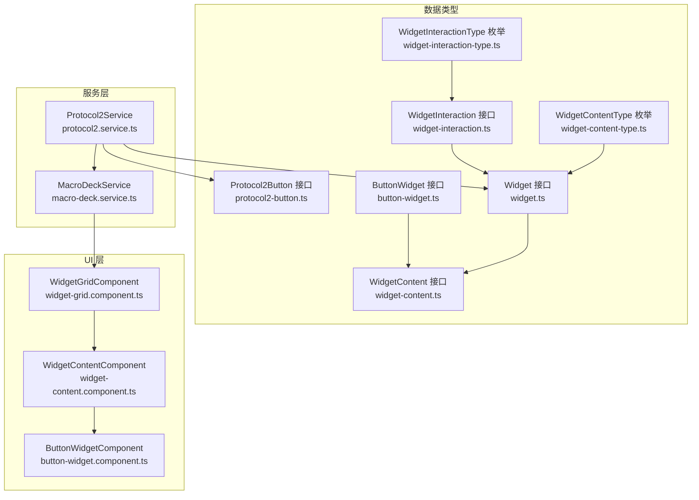
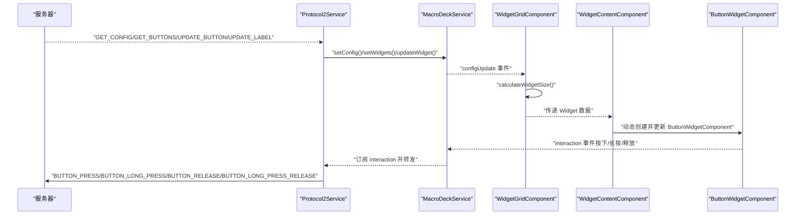
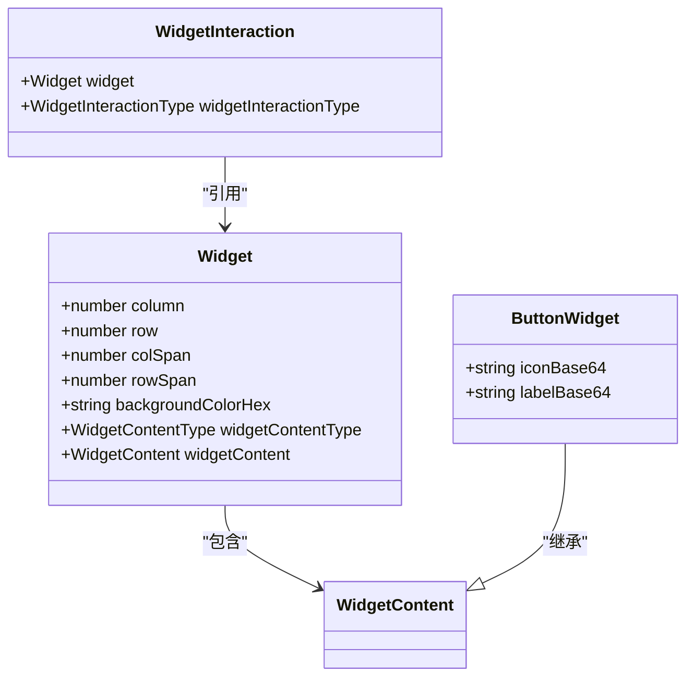
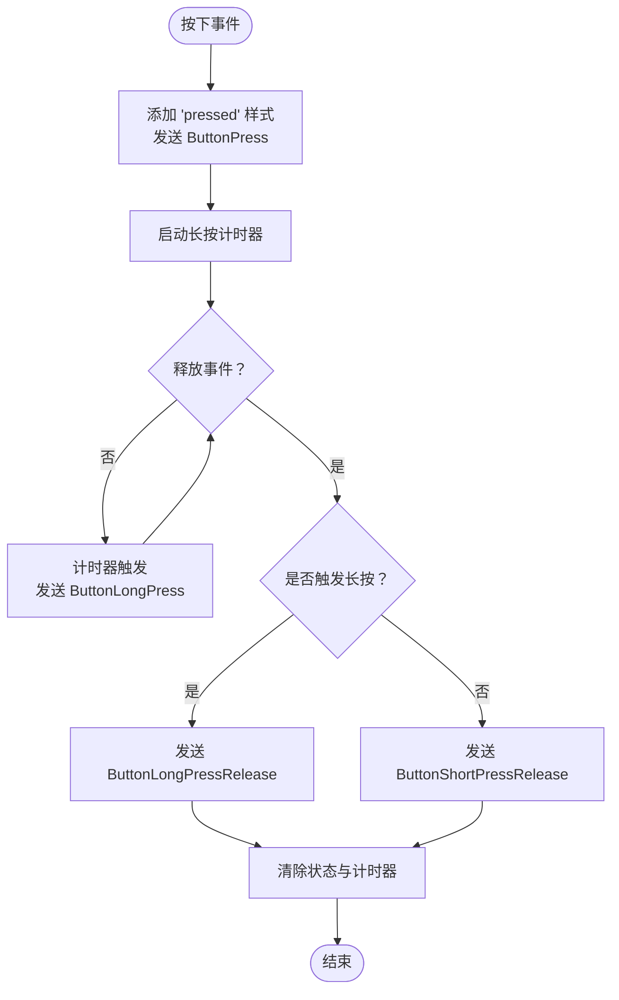
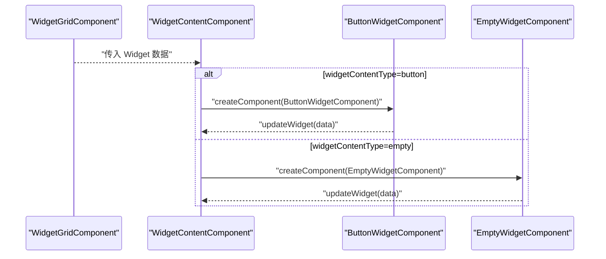
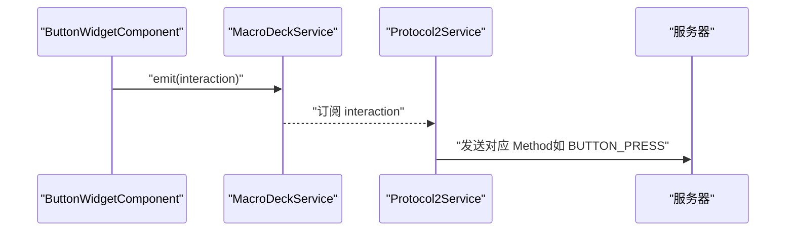
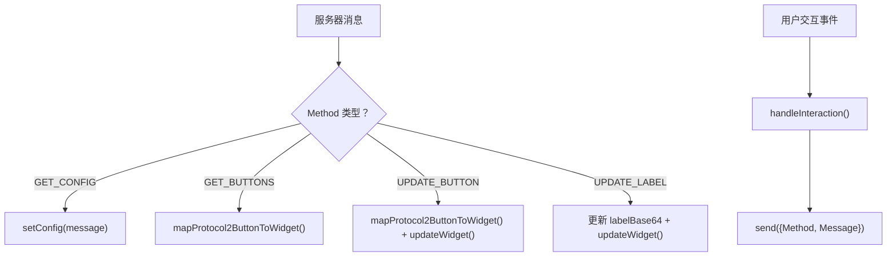
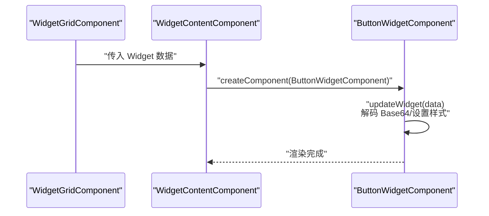
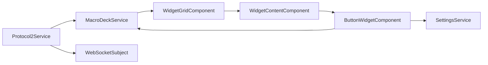

# 微件数据类型

<cite>
**本文档引用的文件**
- [widget.ts](file://src/app/datatypes/widgets/widget.ts)
- [button-widget.ts](file://src/app/datatypes/widgets/button-widget.ts)
- [widget-content.ts](file://src/app/datatypes/widgets/widget-content.ts)
- [widget-interaction.ts](file://src/app/datatypes/widgets/widget-interaction.ts)
- [widget-content-type.ts](file://src/app/enums/widget-content-type.ts)
- [widget-interaction-type.ts](file://src/app/enums/widget-interaction-type.ts)
- [protocol2-button.ts](file://src/app/datatypes/protocol2/protocol2-button.ts)
- [protocol2-messages.ts](file://src/app/datatypes/protocol2/protocol2-messages.ts)
- [button-widget.component.ts](file://src/app/widget-content-components/button-widget/button-widget.component.ts)
- [widget-grid.component.ts](file://src/app/pages/deck/widget-grid/widget-grid.component.ts)
- [widget-content.component.ts](file://src/app/pages/deck/widget-grid/widget-content/widget-content.component.ts)
- [macro-deck.service.ts](file://src/app/services/macro-deck/macro-deck.service.ts)
- [protocol2.service.ts](file://src/app/services/protocol/protocol2.service.ts)
</cite>

## 目录
1. [简介](#简介)
2. [项目结构](#项目结构)
3. [核心组件](#核心组件)
4. [架构总览](#架构总览)
5. [详细组件分析](#详细组件分析)
6. [依赖分析](#依赖分析)
7. [性能考虑](#性能考虑)
8. [故障排除指南](#故障排除指南)
9. [结论](#结论)
10. [附录](#附录)

## 简介
本文件系统性梳理了 Macro Deck 客户端应用中的微件数据类型体系，重点覆盖：
- Widget 基类接口的结构与继承关系
- ButtonWidget 按钮微件的具体实现，包括视觉属性、交互行为与状态管理
- WidgetContent 微件内容的数据结构、内容类型与渲染逻辑
- WidgetInteraction 微件交互的数据模型，涵盖点击、长按等事件处理
- 微件数据模型的序列化与反序列化流程，以及与 UI 组件的绑定方式

## 项目结构
围绕微件数据类型的相关文件主要分布在以下模块：
- datatypes/widgets：微件数据接口与内容类型定义
- enums：内容类型与交互类型的枚举
- datatypes/protocol2：协议2相关数据模型
- widget-content-components：按钮微件 UI 组件
- pages/deck/widget-grid：网格布局与内容渲染组件
- services：服务层负责数据流与协议处理
- services/protocol：协议2消息解析与微件映射

**图表来源**
- [widget.ts:1-33](file://src/app/datatypes/widgets/widget.ts#L1-L33)
- [widget-content.ts:1-6](file://src/app/datatypes/widgets/widget-content.ts#L1-L6)
- [button-widget.ts:1-16](file://src/app/datatypes/widgets/button-widget.ts#L1-L16)
- [widget-interaction.ts:1-18](file://src/app/datatypes/widgets/widget-interaction.ts#L1-L18)
- [widget-content-type.ts:1-12](file://src/app/enums/widget-content-type.ts#L1-L12)
- [widget-interaction-type.ts:1-18](file://src/app/enums/widget-interaction-type.ts#L1-L18)
- [protocol2-button.ts:1-21](file://src/app/datatypes/protocol2/protocol2-button.ts#L1-L21)
- [macro-deck.service.ts:1-111](file://src/app/services/macro-deck/macro-deck.service.ts#L1-L111)
- [protocol2.service.ts:1-296](file://src/app/services/protocol/protocol2.service.ts#L1-L296)
- [widget-grid.component.ts:1-335](file://src/app/pages/deck/widget-grid/widget-grid.component.ts#L1-L335)
- [widget-content.component.ts:1-152](file://src/app/pages/deck/widget-grid/widget-content/widget-content.component.ts#L1-L152)
- [button-widget.component.ts:1-393](file://src/app/widget-content-components/button-widget/button-widget.component.ts#L1-L393)

**章节来源**
- [widget.ts:1-33](file://src/app/datatypes/widgets/widget.ts#L1-L33)
- [widget-content.ts:1-6](file://src/app/datatypes/widgets/widget-content.ts#L1-L6)
- [button-widget.ts:1-16](file://src/app/datatypes/widgets/button-widget.ts#L1-L16)
- [widget-interaction.ts:1-18](file://src/app/datatypes/widgets/widget-interaction.ts#L1-L18)
- [widget-content-type.ts:1-12](file://src/app/enums/widget-content-type.ts#L1-L12)
- [widget-interaction-type.ts:1-18](file://src/app/enums/widget-interaction-type.ts#L1-L18)
- [protocol2-button.ts:1-21](file://src/app/datatypes/protocol2/protocol2-button.ts#L1-L21)
- [macro-deck.service.ts:1-111](file://src/app/services/macro-deck/macro-deck.service.ts#L1-L111)
- [protocol2.service.ts:1-296](file://src/app/services/protocol/protocol2.service.ts#L1-L296)
- [widget-grid.component.ts:1-335](file://src/app/pages/deck/widget-grid/widget-grid.component.ts#L1-L335)
- [widget-content.component.ts:1-152](file://src/app/pages/deck/widget-grid/widget-content/widget-content.component.ts#L1-L152)
- [button-widget.component.ts:1-393](file://src/app/widget-content-components/button-widget/button-widget.component.ts#L1-L393)

## 核心组件
- Widget 接口：描述微件在网格中的位置、尺寸、背景色、内容类型与具体内容数据
- WidgetContent 接口：作为各类微件内容的基类
- ButtonWidget 接口：继承自 WidgetContent，扩展按钮的图标与标签数据
- WidgetInteraction 接口：封装一次微件交互，包含被交互的微件与交互类型
- WidgetContentType 枚举：标识内容类型（空、按钮）
- WidgetInteractionType 枚举：标识交互类型（按下、短按释放、长按、长按释放）

这些接口共同构成微件数据模型的核心，支撑从协议解析到 UI 渲染的完整链路。

**章节来源**
- [widget.ts:4-20](file://src/app/datatypes/widgets/widget.ts#L4-L20)
- [widget-content.ts:1-6](file://src/app/datatypes/widgets/widget-content.ts#L1-L6)
- [button-widget.ts:3-9](file://src/app/datatypes/widgets/button-widget.ts#L3-L9)
- [widget-interaction.ts:4-10](file://src/app/datatypes/widgets/widget-interaction.ts#L4-L10)
- [widget-content-type.ts:1-12](file://src/app/enums/widget-content-type.ts#L1-L12)
- [widget-interaction-type.ts:1-18](file://src/app/enums/widget-interaction-type.ts#L1-L18)

## 架构总览
下图展示了从协议消息到 UI 渲染与交互事件回传的端到端流程。

**图表来源**
- [protocol2.service.ts:41-95](file://src/app/services/protocol/protocol2.service.ts#L41-L95)
- [macro-deck.service.ts:11-14](file://src/app/services/macro-deck/macro-deck.service.ts#L11-L14)
- [widget-grid.component.ts:68-116](file://src/app/pages/deck/widget-grid/widget-grid.component.ts#L68-L116)
- [widget-content.component.ts:45-79](file://src/app/pages/deck/widget-grid/widget-content/widget-content.component.ts#L45-L79)
- [button-widget.component.ts:325-391](file://src/app/widget-content-components/button-widget/button-widget.component.ts#L325-L391)

## 详细组件分析

### Widget 基类接口与继承关系
- 结构要点
  - 位置与尺寸：column、row、colSpan、rowSpan
  - 视觉属性：backgroundColorHex
  - 内容关联：widgetContentType、widgetContent
- 继承关系
  - WidgetContent 为内容基类
  - ButtonWidget 继承 WidgetContent，扩展 iconBase64、labelBase64
  - WidgetInteraction 关联 Widget 与其交互类型

**图表来源**
- [widget.ts:4-20](file://src/app/datatypes/widgets/widget.ts#L4-L20)
- [widget-content.ts:1-6](file://src/app/datatypes/widgets/widget-content.ts#L1-L6)
- [button-widget.ts:3-9](file://src/app/datatypes/widgets/button-widget.ts#L3-L9)
- [widget-interaction.ts:4-10](file://src/app/datatypes/widgets/widget-interaction.ts#L4-L10)

**章节来源**
- [widget.ts:4-32](file://src/app/datatypes/widgets/widget.ts#L4-L32)
- [button-widget.ts:3-15](file://src/app/datatypes/widgets/button-widget.ts#L3-L15)
- [widget-interaction.ts:4-17](file://src/app/datatypes/widgets/widget-interaction.ts#L4-L17)

### ButtonWidget 按钮微件实现
- 视觉属性
  - 背景色：来自 Widget.backgroundColorHex
  - 图标与标签：Base64 编码，经 DomSanitizer 安全注入 data URL
  - 边框：根据背景色调整明暗，支持无边框或彩色边框样式
- 交互行为
  - 按下：添加 pressed 样式，发送 ButtonPress
  - 释放：根据是否触发长按，发送 ButtonShortPressRelease 或 ButtonLongPressRelease
  - 长按：超过阈值后发送 ButtonLongPress，并在释放时发送 ButtonLongPressRelease
- 状态管理
  - pressed：记录当前是否处于按下状态
  - longPressTrigger：标记是否已触发长按
  - longPressTimeout：长按计时器
  - 通过 SettingsService 读取边框样式与长按延迟

**图表来源**
- [button-widget.component.ts:131-184](file://src/app/widget-content-components/button-widget/button-widget.component.ts#L131-L184)
- [button-widget.component.ts:325-391](file://src/app/widget-content-components/button-widget/button-widget.component.ts#L325-L391)

**章节来源**
- [button-widget.component.ts:88-103](file://src/app/widget-content-components/button-widget/button-widget.component.ts#L88-L103)
- [button-widget.component.ts:131-184](file://src/app/widget-content-components/button-widget/button-widget.component.ts#L131-L184)
- [button-widget.component.ts:218-226](file://src/app/widget-content-components/button-widget/button-widget.component.ts#L218-L226)

### WidgetContent 微件内容与渲染逻辑
- 数据结构
  - WidgetContent 为空接口，作为扩展基类
  - ButtonWidget 扩展图标与标签字段
- 渲染逻辑
  - WidgetContentComponent 根据 Widget.widgetContentType 动态创建对应内容组件
  - 当内容类型变化时销毁并重建组件；否则仅更新数据
  - 支持 empty 与 button 两种内容类型

**图表来源**
- [widget-content.component.ts:45-79](file://src/app/pages/deck/widget-grid/widget-content/widget-content.component.ts#L45-L79)
- [widget-grid.component.ts:172-190](file://src/app/pages/deck/widget-grid/widget-grid.component.ts#L172-L190)

**章节来源**
- [widget-content.ts:1-6](file://src/app/datatypes/widgets/widget-content.ts#L1-L6)
- [widget-content.component.ts:45-79](file://src/app/pages/deck/widget-grid/widget-content/widget-content.component.ts#L45-L79)
- [widget-grid.component.ts:172-190](file://src/app/pages/deck/widget-grid/widget-grid.component.ts#L172-L190)

### WidgetInteraction 微件交互数据模型
- 结构
  - widget：被交互的微件
  - widgetInteractionType：交互类型（按下、短按释放、长按、长按释放）
- 事件流转
  - ButtonWidgetComponent 通过 MacroDeckService.interaction 发出交互事件
  - Protocol2Service 订阅交互事件，映射为协议方法并发送至服务器

**图表来源**
- [widget-interaction.ts:4-10](file://src/app/datatypes/widgets/widget-interaction.ts#L4-L10)
- [button-widget.component.ts:218-226](file://src/app/widget-content-components/button-widget/button-widget.component.ts#L218-L226)
- [protocol2.service.ts:139-160](file://src/app/services/protocol/protocol2.service.ts#L139-L160)

**章节来源**
- [widget-interaction.ts:4-17](file://src/app/datatypes/widgets/widget-interaction.ts#L4-L17)
- [button-widget.component.ts:218-226](file://src/app/widget-content-components/button-widget/button-widget.component.ts#L218-L226)
- [protocol2.service.ts:139-160](file://src/app/services/protocol/protocol2.service.ts#L139-L160)

### 序列化与反序列化（协议2）
- 反序列化（服务器 -> 客户端）
  - Protocol2Service 接收服务器消息，根据 Method 分发处理
  - GET_CONFIG：更新面板配置并请求按钮数据
  - GET_BUTTONS/UPDATE_BUTTON：将 Protocol2Button 映射为 Widget[]
  - UPDATE_LABEL：仅更新按钮标签 Base64
- 序列化（客户端 -> 服务器）
  - MacroDeckService.interaction 订阅交互事件
  - Protocol2Service 将交互类型映射为协议方法并发送

**图表来源**
- [protocol2.service.ts:41-95](file://src/app/services/protocol/protocol2.service.ts#L41-L95)
- [protocol2.service.ts:111-125](file://src/app/services/protocol/protocol2.service.ts#L111-L125)
- [protocol2.service.ts:254-268](file://src/app/services/protocol/protocol2.service.ts#L254-L268)
- [protocol2.service.ts:274-294](file://src/app/services/protocol/protocol2.service.ts#L274-L294)

**章节来源**
- [protocol2-button.ts:1-21](file://src/app/datatypes/protocol2/protocol2-button.ts#L1-L21)
- [protocol2-messages.ts:1-57](file://src/app/datatypes/protocol2/protocol2-messages.ts#L1-L57)
- [protocol2.service.ts:41-95](file://src/app/services/protocol/protocol2.service.ts#L41-L95)
- [protocol2.service.ts:111-125](file://src/app/services/protocol/protocol2.service.ts#L111-L125)
- [protocol2.service.ts:254-268](file://src/app/services/protocol/protocol2.service.ts#L254-L268)
- [protocol2.service.ts:274-294](file://src/app/services/protocol/protocol2.service.ts#L274-L294)

### 与 UI 组件的绑定方式
- WidgetGridComponent
  - 计算微件尺寸、间距与圆角，生成绝对定位样式
  - 提供 getWidgetFromIndex() 生成默认空白微件占位
- WidgetContentComponent
  - 根据内容类型动态创建 ButtonWidgetComponent 或 EmptyWidgetComponent
  - 通过 updateWidget(data) 将 Widget 数据传递给子组件
- ButtonWidgetComponent
  - 解码 Base64 图片为安全 URL，设置背景色与边框
  - 处理鼠标/触摸事件，发出交互事件

**图表来源**
- [widget-grid.component.ts:132-154](file://src/app/pages/deck/widget-grid/widget-grid.component.ts#L132-L154)
- [widget-grid.component.ts:172-190](file://src/app/pages/deck/widget-grid/widget-grid.component.ts#L172-L190)
- [widget-content.component.ts:66-71](file://src/app/pages/deck/widget-grid/widget-content/widget-content.component.ts#L66-L71)
- [button-widget.component.ts:88-103](file://src/app/widget-content-components/button-widget/button-widget.component.ts#L88-L103)

**章节来源**
- [widget-grid.component.ts:132-154](file://src/app/pages/deck/widget-grid/widget-grid.component.ts#L132-L154)
- [widget-grid.component.ts:172-190](file://src/app/pages/deck/widget-grid/widget-grid.component.ts#L172-L190)
- [widget-content.component.ts:66-71](file://src/app/pages/deck/widget-grid/widget-content/widget-content.component.ts#L66-L71)
- [button-widget.component.ts:88-103](file://src/app/widget-content-components/button-widget/button-widget.component.ts#L88-L103)

## 依赖分析
- 组件耦合
  - WidgetGridComponent 依赖 MacroDeckService 获取配置与微件数据
  - WidgetContentComponent 依赖 WidgetContentType 枚举进行动态组件选择
  - ButtonWidgetComponent 依赖 SettingsService 与 MacroDeckService 进行样式与事件处理
  - Protocol2Service 依赖 MacroDeckService 与 WebSocket 主题进行消息收发
- 外部依赖
  - RxJS 事件流（EventEmitter/Subscription）
  - Angular DomSanitizer 与 Renderer2

**图表来源**
- [protocol2.service.ts:27-34](file://src/app/services/protocol/protocol2.service.ts#L27-L34)
- [macro-deck.service.ts:11-14](file://src/app/services/macro-deck/macro-deck.service.ts#L11-L14)
- [widget-grid.component.ts:33-35](file://src/app/pages/deck/widget-grid/widget-grid.component.ts#L33-L35)
- [widget-content.component.ts:4-8](file://src/app/pages/deck/widget-grid/widget-content/widget-content.component.ts#L4-L8)
- [button-widget.component.ts:49-53](file://src/app/widget-content-components/button-widget/button-widget.component.ts#L49-L53)

**章节来源**
- [protocol2.service.ts:27-34](file://src/app/services/protocol/protocol2.service.ts#L27-L34)
- [macro-deck.service.ts:11-14](file://src/app/services/macro-deck/macro-deck.service.ts#L11-L14)
- [widget-grid.component.ts:33-35](file://src/app/pages/deck/widget-grid/widget-grid.component.ts#L33-L35)
- [widget-content.component.ts:4-8](file://src/app/pages/deck/widget-grid/widget-content/widget-content.component.ts#L4-L8)
- [button-widget.component.ts:49-53](file://src/app/widget-content-components/button-widget/button-widget.component.ts#L49-L53)

## 性能考虑
- 动态组件创建
  - WidgetContentComponent 在内容类型变化时销毁并重建组件，避免不必要的重复创建
- 样式计算
  - WidgetGridComponent 在窗口 resize 时延迟计算，减少频繁重排
- 事件处理
  - ButtonWidgetComponent 使用计时器实现长按检测，避免阻塞主线程
- 图片渲染
  - Base64 图片通过 DomSanitizer 注入 data URL，避免额外网络请求

[本节为通用指导，不直接分析具体文件]

## 故障排除指南
- 交互事件未生效
  - 检查 MacroDeckService.interaction 是否正确订阅
  - 确认 Protocol2Service.handleInteraction 已映射交互类型
- 图片不显示
  - 确认 Base64 数据有效且被 DomSanitizer 安全注入
  - 检查 MIME 类型与 data URL 前缀
- 长按无效
  - 检查 SettingsService.getButtonLongPressDelay 返回值
  - 确认计时器未被提前清理
- 布局错乱
  - 确认 WidgetGridComponent.calculateWidgetSize 正常执行
  - 检查容器尺寸与内边距计算

**章节来源**
- [button-widget.component.ts:174-183](file://src/app/widget-content-components/button-widget/button-widget.component.ts#L174-L183)
- [button-widget.component.ts:218-226](file://src/app/widget-content-components/button-widget/button-widget.component.ts#L218-L226)
- [widget-grid.component.ts:92-116](file://src/app/pages/deck/widget-grid/widget-grid.component.ts#L92-L116)

## 结论
本文档系统梳理了微件数据类型的设计与实现，明确了 Widget、WidgetContent、ButtonWidget、WidgetInteraction 的接口职责与相互关系，并结合 UI 组件与服务层展示了从协议解析到交互回传的完整链路。通过动态组件与事件驱动的架构设计，系统实现了灵活的内容渲染与稳定的交互体验。

[本节为总结性内容，不直接分析具体文件]

## 附录
- 关键路径参考
  - Widget 接口定义：[widget.ts:4-20](file://src/app/datatypes/widgets/widget.ts#L4-L20)
  - ButtonWidget 接口定义：[button-widget.ts:3-9](file://src/app/datatypes/widgets/button-widget.ts#L3-L9)
  - WidgetInteraction 接口定义：[widget-interaction.ts:4-10](file://src/app/datatypes/widgets/widget-interaction.ts#L4-L10)
  - 内容类型枚举：[widget-content-type.ts:1-12](file://src/app/enums/widget-content-type.ts#L1-L12)
  - 交互类型枚举：[widget-interaction-type.ts:1-18](file://src/app/enums/widget-interaction-type.ts#L1-L18)
  - 协议2按钮数据模型：[protocol2-button.ts:1-21](file://src/app/datatypes/protocol2/protocol2-button.ts#L1-L21)
  - 协议2消息构建：[protocol2-messages.ts:1-57](file://src/app/datatypes/protocol2/protocol2-messages.ts#L1-L57)
  - 按钮微件组件：[button-widget.component.ts:1-393](file://src/app/widget-content-components/button-widget/button-widget.component.ts#L1-L393)
  - 网格组件：[widget-grid.component.ts:1-335](file://src/app/pages/deck/widget-grid/widget-grid.component.ts#L1-L335)
  - 内容组件：[widget-content.component.ts:1-152](file://src/app/pages/deck/widget-grid/widget-content/widget-content.component.ts#L1-L152)
  - 宏服务：[macro-deck.service.ts:1-111](file://src/app/services/macro-deck/macro-deck.service.ts#L1-L111)
  - 协议2服务：[protocol2.service.ts:1-296](file://src/app/services/protocol/protocol2.service.ts#L1-L296)

[本节为参考清单，不直接分析具体文件]