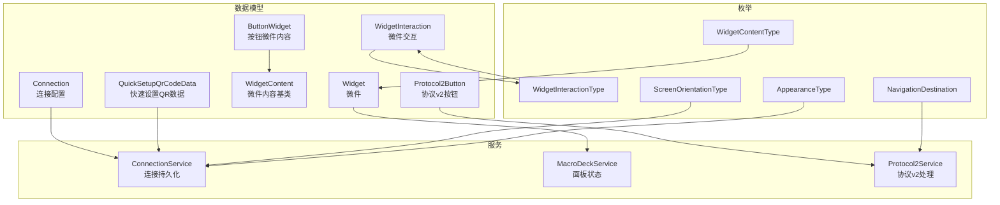
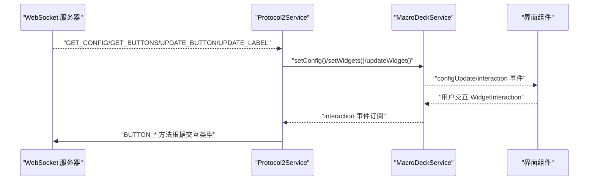
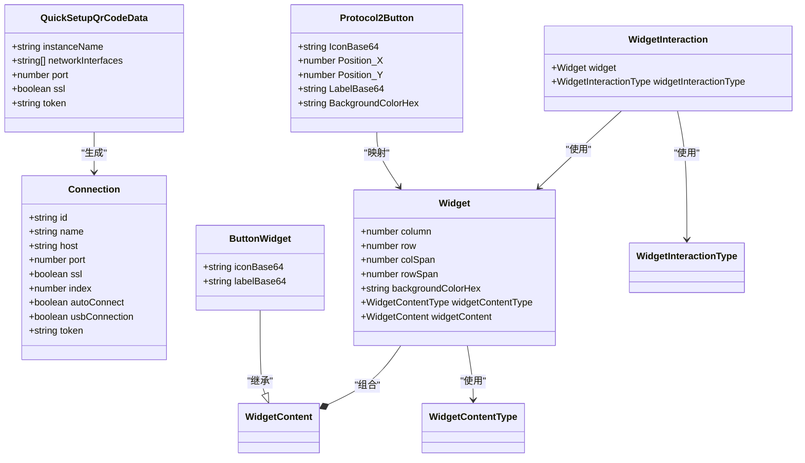

# 数据模型设计

<cite>
**本文档引用的文件**
- [connection.ts](file://src/app/datatypes/connection.ts)
- [widget.ts](file://src/app/datatypes/widgets/widget.ts)
- [widget-content.ts](file://src/app/datatypes/widgets/widget-content.ts)
- [button-widget.ts](file://src/app/datatypes/widgets/button-widget.ts)
- [widget-interaction.ts](file://src/app/datatypes/widgets/widget-interaction.ts)
- [protocol2-button.ts](file://src/app/datatypes/protocol2/protocol2-button.ts)
- [quick-setup-qr-code-data.ts](file://src/app/datatypes/quick-setup-qr-code-data.ts)
- [widget-content-type.ts](file://src/app/enums/widget-content-type.ts)
- [widget-interaction-type.ts](file://src/app/enums/widget-interaction-type.ts)
- [screen-orientation-type.ts](file://src/app/enums/screen-orientation-type.ts)
- [appearance-type.ts](file://src/app/enums/appearance-type.ts)
- [navigation-destination.ts](file://src/app/enums/navigation-destination.ts)
- [connection.service.ts](file://src/app/services/connection/connection.service.ts)
- [macro-deck.service.ts](file://src/app/services/macro-deck/macro-deck.service.ts)
- [protocol2.service.ts](file://src/app/services/protocol/protocol2.service.ts)
</cite>

## 更新摘要
**所做更改**
- 更新了核心数据模型的字段定义和验证规则
- 修订了协议2数据类型的简化版本
- 更新了微件数据类型的结构定义
- 完善了枚举类型的使用说明
- 修正了数据模型间的依赖关系

## 目录
1. [简介](#简介)
2. [项目结构](#项目结构)
3. [核心组件](#核心组件)
4. [架构总览](#架构总览)
5. [详细组件分析](#详细组件分析)
6. [依赖分析](#依赖分析)
7. [性能考虑](#性能考虑)
8. [故障排查指南](#故障排查指南)
9. [结论](#结论)
10. [附录](#附录)

## 简介
本文件面向开发者，系统性梳理 Macro-Deck-Client-App 的数据模型设计，重点覆盖以下核心数据类型：
- 连接配置 Connection：描述 Macro Deck 服务器连接参数与行为开关
- 微件数据 Widget：描述面板网格中微件的位置、尺寸与内容
- 协议按钮 Protocol2Button：描述协议 v2 中按钮的布局与显示属性
- 快速设置 QR 数据 QuickSetupQrCodeData：描述通过二维码分享的连接信息
同时，文档解释各模型字段的业务含义、数据类型与验证要点，并说明枚举类型（如 WidgetContentType、WidgetInteractionType、ScreenOrientationType 等）的使用方式；最后给出数据模型间的关系图、依赖关系、序列化/反序列化处理方式以及与后端 API 的数据交换格式。

## 项目结构
数据模型主要位于 src/app/datatypes 及 src/app/enums 目录，配合服务层进行读写与转换：
- datatypes：存放实体模型与协议适配模型
- enums：存放业务枚举类型
- services：存放与模型交互的服务，负责持久化、映射与事件分发

**图表来源**
- [connection.ts:1-22](file://src/app/datatypes/connection.ts#L1-L22)
- [widget.ts:1-21](file://src/app/datatypes/widgets/widget.ts#L1-L21)
- [widget-content.ts:1-4](file://src/app/datatypes/widgets/widget-content.ts#L1-L4)
- [button-widget.ts:1-10](file://src/app/datatypes/widgets/button-widget.ts#L1-L10)
- [widget-interaction.ts:1-11](file://src/app/datatypes/widgets/widget-interaction.ts#L1-L11)
- [protocol2-button.ts:1-14](file://src/app/datatypes/protocol2/protocol2-button.ts#L1-L14)
- [quick-setup-qr-code-data.ts:1-14](file://src/app/datatypes/quick-setup-qr-code-data.ts#L1-L14)
- [widget-content-type.ts:1-8](file://src/app/enums/widget-content-type.ts#L1-L8)
- [widget-interaction-type.ts:1-12](file://src/app/enums/widget-interaction-type.ts#L1-L12)
- [screen-orientation-type.ts:1-14](file://src/app/enums/screen-orientation-type.ts#L1-L14)
- [appearance-type.ts:1-10](file://src/app/enums/appearance-type.ts#L1-L10)
- [navigation-destination.ts:1-10](file://src/app/enums/navigation-destination.ts#L1-L10)
- [connection.service.ts](file://src/app/services/connection/connection.service.ts)
- [macro-deck.service.ts](file://src/app/services/macro-deck/macro-deck.service.ts)
- [protocol2.service.ts](file://src/app/services/protocol/protocol2.service.ts)

## 核心组件
本节对关键数据模型进行逐项说明，包括字段定义、数据类型、验证规则与业务含义。

### 连接配置 Connection
- 字段与类型
  - id: string（唯一标识符）
  - name: string（连接显示名称）
  - host: string（服务器主机地址）
  - port: number（服务器端口号）
  - ssl: boolean（是否启用 SSL 加密连接）
  - index: number | undefined（连接在列表中的排序索引）
  - autoConnect: boolean | undefined（是否自动连接）
  - usbConnection: boolean | undefined（是否使用 USB 连接）
  - token: string | undefined（认证令牌）
- 验证规则
  - host 非空且符合主机格式
  - port 为有效端口范围（1-65535）
  - ssl 与 token 配合使用（若启用 SSL，建议提供 token）
  - index 与排序一致性（服务层按 index 排序）
- 业务含义
  - 描述一次 Macro Deck 服务器的连接参数，支持网络与 USB 两种接入方式
- 序列化/反序列化
  - 使用 JSON 存储于本地存储，读取时解析并排序
- 关联服务
  - ConnectionService 提供增删改查与持久化

### 微件数据 Widget
- 字段与类型
  - column: number（微件所在列索引）
  - row: number（微件所在行索引）
  - colSpan: number（微件跨列数）
  - rowSpan: number（微件跨行数）
  - backgroundColorHex: string | undefined（微件背景颜色，十六进制色值）
  - widgetContentType: WidgetContentType（微件内容类型枚举）
  - widgetContent: WidgetContent | undefined（微件具体内容数据）
- 验证规则
  - column、row、colSpan、rowSpan 均为非负整数
  - colSpan、rowSpan 至少为 1
  - backgroundColorHex 符合十六进制颜色格式
  - widgetContentType 与 widgetContent 类型一致
- 业务含义
  - 描述面板网格中一个单元格的布局与内容
- 关联模型
  - WidgetContent 为内容基类，ButtonWidget 为其子类

### 按钮微件内容 ButtonWidget
- 字段与类型
  - iconBase64: string | undefined（按钮图标的 Base64 编码数据）
  - labelBase64: string | undefined（按钮标签的 Base64 编码数据）
- 验证规则
  - Base64 字符串格式校验（由上层调用方保证）
- 业务含义
  - 表示按钮微件的具体内容（图标与标签）

### 微件交互 WidgetInteraction
- 字段与类型
  - widget: Widget（被交互的微件）
  - widgetInteractionType: WidgetInteractionType（交互类型枚举）
- 验证规则
  - 枚举值必须属于预定义集合
- 业务含义
  - 描述一次用户与微件的交互事件（如按下、短按释放、长按、长按释放等）

### 协议按钮 Protocol2Button
- 字段与类型
  - IconBase64: string | undefined（按钮图标的 Base64 编码数据）
  - Position_X: number（按钮在网格中的列位置）
  - Position_Y: number（按钮在网格中的行位置）
  - LabelBase64: string | undefined（按钮标签的 Base64 编码数据）
  - BackgroundColorHex: string | undefined（按钮背景颜色，十六进制色值）
- 验证规则
  - Position_X、Position_Y 为非负整数
  - Base64 字段由服务层转换为内部模型
- 业务含义
  - 服务器推送的按钮布局与显示属性，需映射为内部 Widget 模型

### 快速设置 QR 数据 QuickSetupQrCodeData
- 字段与类型
  - instanceName: string（Macro Deck 实例名称）
  - networkInterfaces: string[]（服务器可用的网络接口地址列表）
  - port: number（服务器端口号）
  - ssl: boolean（是否启用 SSL 加密）
  - token: string（认证令牌）
- 验证规则
  - networkInterfaces 非空且包含有效 IP 地址
  - port 为有效端口
  - token 在启用 SSL 时建议提供
- 业务含义
  - 通过二维码分享的连接信息，便于快速添加连接

**章节来源**
- [connection.ts:1-22](file://src/app/datatypes/connection.ts#L1-L22)
- [widget.ts:1-21](file://src/app/datatypes/widgets/widget.ts#L1-L21)
- [widget-content.ts:1-4](file://src/app/datatypes/widgets/widget-content.ts#L1-L4)
- [button-widget.ts:1-10](file://src/app/datatypes/widgets/button-widget.ts#L1-L10)
- [widget-interaction.ts:1-11](file://src/app/datatypes/widgets/widget-interaction.ts#L1-L11)
- [protocol2-button.ts:1-14](file://src/app/datatypes/protocol2/protocol2-button.ts#L1-L14)
- [quick-setup-qr-code-data.ts:1-14](file://src/app/datatypes/quick-setup-qr-code-data.ts#L1-L14)

## 架构总览
下图展示数据模型在服务层的流转与映射关系：

**图表来源**
- [protocol2.service.ts](file://src/app/services/protocol/protocol2.service.ts)
- [macro-deck.service.ts](file://src/app/services/macro-deck/macro-deck.service.ts)

**章节来源**
- [protocol2.service.ts](file://src/app/services/protocol/protocol2.service.ts)
- [macro-deck.service.ts](file://src/app/services/macro-deck/macro-deck.service.ts)

## 详细组件分析

### Connection 连接配置
- 用途
  - 描述 Macro Deck 服务器连接参数，支持网络与 USB 两种接入
- 关键点
  - 服务层通过 JSON 序列化存储，读取时按 index 排序
  - 支持自动生成 id 与默认 index
- 扩展建议
  - 可增加连接健康检查字段（如 lastConnected、failedAttempts）
  - 可增加连接超时与重试策略字段

**章节来源**
- [connection.ts:1-22](file://src/app/datatypes/connection.ts#L1-L22)
- [connection.service.ts](file://src/app/services/connection/connection.service.ts)

### Widget 微件数据
- 用途
  - 描述面板网格中微件的位置、尺寸与内容
- 关键点
  - 与枚举 WidgetContentType 绑定，确保内容类型与具体实现一致
  - 与 WidgetInteractionType 结合，驱动交互事件
- 扩展建议
  - 可增加点击区域、边距、对齐方式等布局属性
  - 可增加条件渲染字段（如权限、状态）

**章节来源**
- [widget.ts:1-21](file://src/app/datatypes/widgets/widget.ts#L1-L21)
- [widget-content-type.ts:1-8](file://src/app/enums/widget-content-type.ts#L1-L8)
- [widget-interaction-type.ts:1-12](file://src/app/enums/widget-interaction-type.ts#L1-L12)

### Protocol2Button 协议按钮
- 用途
  - 服务器推送的按钮布局与显示属性
- 关键点
  - 通过 Protocol2Service 映射为内部 Widget 模型
  - 仅在收到初始配置后处理
- 扩展建议
  - 可增加多语言标签字段
  - 可增加按钮状态（禁用、高亮等）

**章节来源**
- [protocol2-button.ts:1-14](file://src/app/datatypes/protocol2/protocol2-button.ts#L1-L14)
- [protocol2.service.ts](file://src/app/services/protocol/protocol2.service.ts)

### QuickSetupQrCodeData 快速设置数据
- 用途
  - 通过二维码分享的连接信息，便于快速添加连接
- 关键点
  - 与 Connection 模型字段一一对应
  - 服务层可据此生成 Connection 对象
- 扩展建议
  - 可增加二维码版本号与签名字段以增强安全性
  - 可增加过期时间字段

**章节来源**
- [quick-setup-qr-code-data.ts:1-14](file://src/app/datatypes/quick-setup-qr-code-data.ts#L1-L14)
- [connection.service.ts](file://src/app/services/connection/connection.service.ts)

### 枚举类型
- WidgetContentType
  - empty: 空白微件
  - button: 按钮微件
- WidgetInteractionType
  - ButtonPress: 按钮按下
  - ButtonShortPressRelease: 按钮短按释放
  - ButtonLongPress: 按钮长按
  - ButtonLongPressRelease: 按钮长按释放
- ScreenOrientationType
  - Auto: 自动旋转
  - Landscape: 横屏（正向）
  - LandscapeAlt: 横屏（反向）
  - Portrait: 竖屏（正向）
  - PortraitAlt: 竖屏（反向）
- AppearanceType
  - System: 跟随系统设置
  - Dark: 深色主题
  - Light: 浅色主题
- NavigationDestination
  - Home: 首页（连接管理）
  - Deck: 控制面板页面
  - ConnectionLost: 连接丢失页面

**章节来源**
- [widget-content-type.ts:1-8](file://src/app/enums/widget-content-type.ts#L1-L8)
- [widget-interaction-type.ts:1-12](file://src/app/enums/widget-interaction-type.ts#L1-L12)
- [screen-orientation-type.ts:1-14](file://src/app/enums/screen-orientation-type.ts#L1-L14)
- [appearance-type.ts:1-10](file://src/app/enums/appearance-type.ts#L1-L10)
- [navigation-destination.ts:1-10](file://src/app/enums/navigation-destination.ts#L1-L10)

## 依赖分析
- 模型依赖
  - Widget 依赖 WidgetContentType 与 WidgetContent
  - ButtonWidget 继承 WidgetContent
  - WidgetInteraction 依赖 Widget 与 WidgetInteractionType
  - Protocol2Button 由 Protocol2Service 映射为 Widget
- 服务依赖
  - ConnectionService 依赖 Storage 与 SettingsService
  - MacroDeckService 管理 Widget 列表与面板配置
  - Protocol2Service 订阅 MacroDeckService 的交互事件并转发至服务器

**图表来源**
- [connection.ts:1-22](file://src/app/datatypes/connection.ts#L1-L22)
- [widget.ts:1-21](file://src/app/datatypes/widgets/widget.ts#L1-L21)
- [widget-content.ts:1-4](file://src/app/datatypes/widgets/widget-content.ts#L1-L4)
- [button-widget.ts:1-10](file://src/app/datatypes/widgets/button-widget.ts#L1-L10)
- [widget-interaction.ts:1-11](file://src/app/datatypes/widgets/widget-interaction.ts#L1-L11)
- [protocol2-button.ts:1-14](file://src/app/datatypes/protocol2/protocol2-button.ts#L1-L14)
- [quick-setup-qr-code-data.ts:1-14](file://src/app/datatypes/quick-setup-qr-code-data.ts#L1-L14)

**章节来源**
- [widget.ts:1-21](file://src/app/datatypes/widgets/widget.ts#L1-L21)
- [button-widget.ts:1-10](file://src/app/datatypes/widgets/button-widget.ts#L1-L10)
- [widget-interaction.ts:1-11](file://src/app/datatypes/widgets/widget-interaction.ts#L1-L11)
- [protocol2-button.ts:1-14](file://src/app/datatypes/protocol2/protocol2-button.ts#L1-L14)
- [quick-setup-qr-code-data.ts:1-14](file://src/app/datatypes/quick-setup-qr-code-data.ts#L1-L14)

## 性能考虑
- 序列化/反序列化
  - Connection 列表采用 JSON 存储，读取时一次性解析并排序，避免频繁 IO
- 映射效率
  - Protocol2Button 到 Widget 的映射为 O(n) 遍历，n 为按钮数量；建议在按钮数量较大时考虑缓存坐标到索引的映射
- 事件驱动
  - 通过 MacroDeckService 的事件机制解耦交互处理，降低耦合度与提升响应性

## 故障排查指南
- 连接配置无法加载
  - 检查本地存储键名与 JSON 格式是否正确
  - 确认 index 字段存在且为数字
- 微件不显示或错位
  - 检查 colSpan、rowSpan 是否为至少 1 的正整数
  - 确认 backgroundColorHex 格式正确
- 交互无响应
  - 确认 WidgetInteractionType 枚举值合法
  - 检查 Protocol2Service 是否已订阅 MacroDeckService.interaction
- 协议消息未生效
  - 确认已收到初始配置（initialConfigReceived），再处理后续消息
  - 检查坐标映射逻辑（Position_X/Position_Y 与 row/column 的对应关系）

**章节来源**
- [connection.service.ts](file://src/app/services/connection/connection.service.ts)
- [macro-deck.service.ts](file://src/app/services/macro-deck/macro-deck.service.ts)
- [protocol2.service.ts](file://src/app/services/protocol/protocol2.service.ts)

## 结论
本数据模型体系围绕 Connection、Widget、Protocol2Button、QuickSetupQrCodeData 四大核心实体展开，结合枚举类型与服务层实现，形成从本地存储到协议解析再到界面渲染的完整闭环。通过清晰的职责划分与事件驱动机制，既保证了扩展性，也兼顾了性能与可维护性。建议在后续迭代中引入更强的校验与错误恢复能力，并完善安全与审计相关字段。

## 附录
- 数据交换格式（与后端 API）
  - GET_CONFIG：服务器推送面板配置（Rows、Columns、ButtonSpacing、ButtonRadius、ButtonBackground）
  - GET_BUTTONS：服务器推送按钮列表（Protocol2Button 数组）
  - UPDATE_BUTTON：服务器推送单个按钮完整数据更新
  - UPDATE_LABEL：服务器推送单个按钮标签更新
  - 客户端交互：根据 WidgetInteractionType 映射为 BUTTON_PRESS/BUTTON_RELEASE/BUTTON_LONG_PRESS/BUTTON_LONG_PRESS_RELEASE，并携带 Message（格式为 "row_col"）

**章节来源**
- [protocol2.service.ts](file://src/app/services/protocol/protocol2.service.ts)
- [widget-interaction-type.ts:1-12](file://src/app/enums/widget-interaction-type.ts#L1-L12)