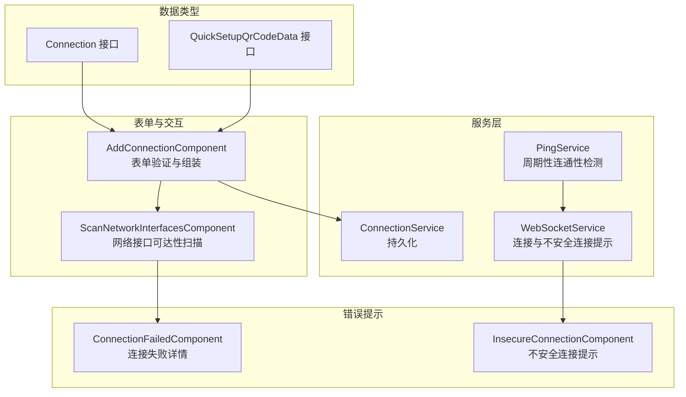
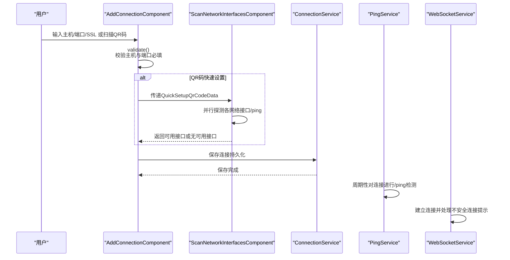
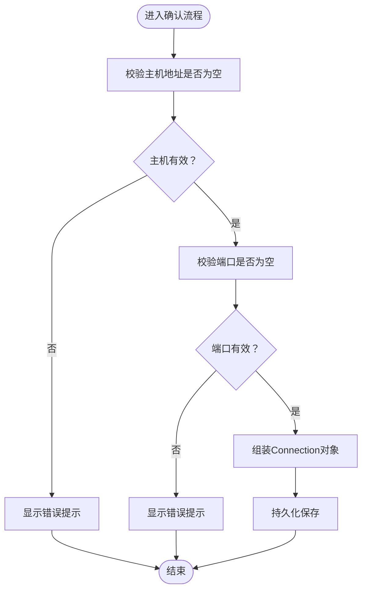
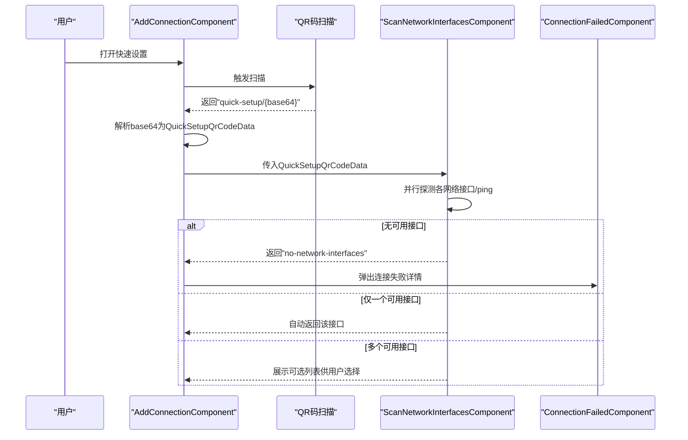
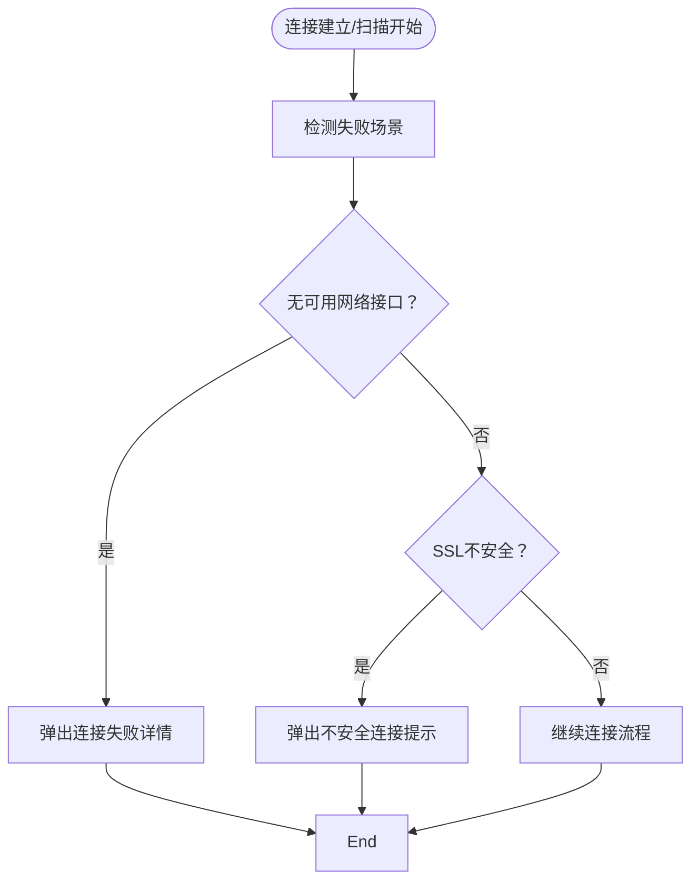
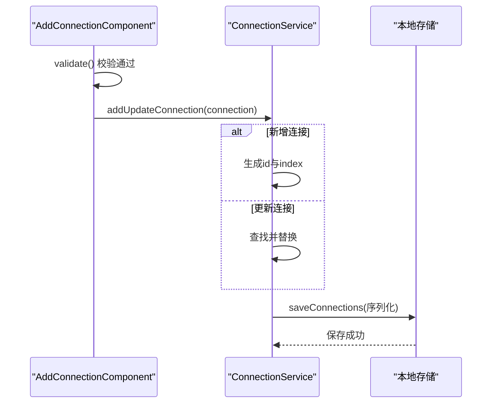
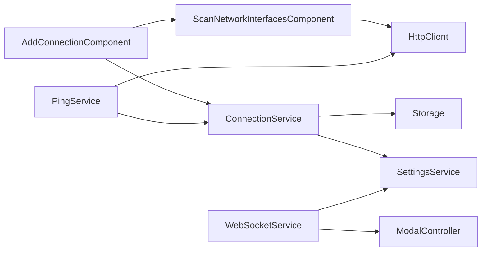

# 数据验证规则

<cite>
**本文档引用的文件**
- [connection.ts](file://src/app/datatypes/connection.ts)
- [quick-setup-qr-code-data.ts](file://src/app/datatypes/quick-setup-qr-code-data.ts)
- [add-connection.component.ts](file://src/app/pages/home/modals/add-connection/add-connection.component.ts)
- [add-connection.component.html](file://src/app/pages/home/modals/add-connection/add-connection.component.html)
- [scan-network-interfaces.component.ts](file://src/app/pages/home/modals/scan-network-interfaces/scan-network-interfaces.component.ts)
- [scan-network-interfaces.component.html](file://src/app/pages/home/modals/scan-network-interfaces/scan-network-interfaces.component.html)
- [connection-failed.component.html](file://src/app/pages/home/modals/connection-failed/connection-failed.component.html)
- [connection.service.ts](file://src/app/services/connection/connection.service.ts)
- [ping.service.ts](file://src/app/services/ping/ping.service.ts)
- [websocket.service.ts](file://src/app/services/websocket/websocket.service.ts)
- [insecure-connection.component.ts](file://src/app/pages/home/modals/insecure-connection/insecure-connection.component.ts)
- [network_security_config.xml](file://resources/android/xml/network_security_config.xml)
</cite>

## 目录
1. [简介](#简介)
2. [项目结构](#项目结构)
3. [核心组件](#核心组件)
4. [架构总览](#架构总览)
5. [详细组件分析](#详细组件分析)
6. [依赖关系分析](#依赖关系分析)
7. [性能考虑](#性能考虑)
8. [故障排除指南](#故障排除指南)
9. [结论](#结论)

## 简介
本文件系统性梳理 Macro Deck 客户端应用中的数据验证规则与策略，重点覆盖：
- 连接配置（Connection）的数据验证规则：主机地址格式、端口范围、SSL 配置验证等
- 快速设置 QR 码数据（QuickSetupQrCodeData）的验证逻辑：QR 码数据格式检查与服务器信息验证
- 数据模型的输入验证策略：前端表单验证与后端数据校验
- 错误处理机制与用户友好提示
- 数据持久化前的验证流程与数据完整性保障

## 项目结构
围绕“连接配置”和“快速设置 QR 码”的验证链路，涉及以下关键模块：
- 数据类型层：定义 Connection 与 QuickSetupQrCodeData 的字段约束
- 表单与交互层：AddConnectionComponent 与 ScanNetworkInterfacesComponent 提供输入收集与验证
- 服务层：ConnectionService 负责持久化；PingService 与 WebSocketService 提供运行期可用性与连接状态验证
- 错误提示层：ConnectionFailedComponent 与 InsecureConnectionComponent 提供用户反馈

图表来源
- [connection.ts:1-33](file://src/app/datatypes/connection.ts#L1-L33)
- [quick-setup-qr-code-data.ts:1-21](file://src/app/datatypes/quick-setup-qr-code-data.ts#L1-L21)
- [add-connection.component.ts:1-382](file://src/app/pages/home/modals/add-connection/add-connection.component.ts#L1-L382)
- [scan-network-interfaces.component.ts:1-201](file://src/app/pages/home/modals/scan-network-interfaces/scan-network-interfaces.component.ts#L1-L201)
- [connection.service.ts:1-179](file://src/app/services/connection/connection.service.ts#L1-L179)
- [ping.service.ts:35-194](file://src/app/services/ping/ping.service.ts#L35-L194)
- [websocket.service.ts:218-252](file://src/app/services/websocket/websocket.service.ts#L218-L252)

章节来源
- [connection.ts:1-33](file://src/app/datatypes/connection.ts#L1-L33)
- [quick-setup-qr-code-data.ts:1-21](file://src/app/datatypes/quick-setup-qr-code-data.ts#L1-L21)

## 核心组件
- Connection 数据模型：定义连接的唯一标识、名称、主机、端口、SSL、排序索引、自动连接、USB 标记与认证令牌等字段。字段类型与可空性构成基础验证依据。
- QuickSetupQrCodeData 数据模型：定义实例名、网络接口列表、端口、SSL 开关与认证令牌。用于快速设置场景下的数据承载与校验。

章节来源
- [connection.ts:2-21](file://src/app/datatypes/connection.ts#L2-L21)
- [quick-setup-qr-code-data.ts:2-13](file://src/app/datatypes/quick-setup-qr-code-data.ts#L2-L13)

## 架构总览
连接配置与快速设置的验证流程贯穿“前端表单收集与即时校验 → 后端/服务层可用性检测 → 错误提示与回退 → 持久化”。

图表来源
- [add-connection.component.ts:145-183](file://src/app/pages/home/modals/add-connection/add-connection.component.ts#L145-L183)
- [scan-network-interfaces.component.ts:55-103](file://src/app/pages/home/modals/scan-network-interfaces/scan-network-interfaces.component.ts#L55-L103)
- [connection.service.ts:147-165](file://src/app/services/connection/connection.service.ts#L147-L165)
- [ping.service.ts:119-128](file://src/app/services/ping/ping.service.ts#L119-L128)
- [websocket.service.ts:224-229](file://src/app/services/websocket/websocket.service.ts#L224-L229)

## 详细组件分析

### 连接配置验证（Connection）
- 字段约束与验证要点
  - 主机地址（host）：字符串类型，必填。前端表单通过 ngModel 双向绑定，后端在 confirm 时进行非空校验。
  - 端口（port）：数值类型，必填。前端通过 min="1" 限制最小值，后端进一步校验非空。
  - SSL（ssl）：布尔开关，决定协议为 http/https。与端口组合影响连通性检测与 WebSocket 协议选择。
  - 其他字段（id/name/index/autoConnect/usbConnection/token）：用于展示、排序、自动连接与认证，不在本次验证范围内。
- 前端表单验证
  - HTML 层：使用 Ionic 输入控件与标签，ngModel 绑定，按钮根据输入内容动态启用。
  - 业务层：confirm 前调用 validate，若校验失败则弹出错误提示并阻断提交。
- 后端/服务层验证
  - ConnectionService 在 addUpdateConnection 时进行 id 生成与列表更新，但不执行额外字段合法性校验。
  - PingService 通过周期性 /ping 检测连接可用性，间接验证 host/port/ssl 组合的有效性。
  - WebSocketService 在建立连接时处理不安全连接提示，属于运行期安全提示而非构建期验证。

图表来源
- [add-connection.component.ts:145-183](file://src/app/pages/home/modals/add-connection/add-connection.component.ts#L145-L183)
- [connection.service.ts:147-165](file://src/app/services/connection/connection.service.ts#L147-L165)

章节来源
- [add-connection.component.html:62-71](file://src/app/pages/home/modals/add-connection/add-connection.component.html#L62-L71)
- [add-connection.component.ts:145-183](file://src/app/pages/home/modals/add-connection/add-connection.component.ts#L145-L183)
- [connection.service.ts:147-165](file://src/app/services/connection/connection.service.ts#L147-L165)
- [ping.service.ts:119-128](file://src/app/services/ping/ping.service.ts#L119-L128)

### 快速设置 QR 码数据验证（QuickSetupQrCodeData）
- 数据模型要点
  - 实例名（instanceName）：字符串，用于界面展示。
  - 网络接口列表（networkInterfaces）：字符串数组，表示服务器可用的网络接口地址。
  - 端口（port）：数值，与 SSL 组合决定探测 URL。
  - SSL（ssl）：布尔，决定 http/https 探测。
  - 认证令牌（token）：字符串，用于连接鉴权。
- 验证与处理流程
  - QR 码解析：扫描结果中提取 "quick-setup/" 后的 Base64 数据，解码并解析为 QuickSetupQrCodeData。
  - 前端填充：将 instanceName/port/ssl 填充至表单，随后打开网络接口扫描弹窗。
  - 网络接口扫描：并行对每个网络接口发起 /ping 请求，超时 3 秒，分类为可用/不可用。
  - 结果处理：无可用接口时返回 "no-network-interfaces"，由上层弹出连接失败提示；仅一个可用接口时自动选择；多于一个时由用户手动选择。

图表来源
- [add-connection.component.ts:66-134](file://src/app/pages/home/modals/add-connection/add-connection.component.ts#L66-L134)
- [scan-network-interfaces.component.ts:55-103](file://src/app/pages/home/modals/scan-network-interfaces/scan-network-interfaces.component.ts#L55-L103)
- [connection-failed.component.html:1-37](file://src/app/pages/home/modals/connection-failed/connection-failed.component.html#L1-L37)

章节来源
- [add-connection.component.ts:66-134](file://src/app/pages/home/modals/add-connection/add-connection.component.ts#L66-L134)
- [scan-network-interfaces.component.ts:55-103](file://src/app/pages/home/modals/scan-network-interfaces/scan-network-interfaces.component.ts#L55-L103)
- [quick-setup-qr-code-data.ts:2-13](file://src/app/datatypes/quick-setup-qr-code-data.ts#L2-L13)

### 数据模型输入验证策略
- 前端表单验证
  - 主机/端口/SSL：通过 HTML 控件与 ngModel 绑定，按钮启用条件与最小值约束共同形成基础校验。
  - 名称/自动连接：可选字段，不影响连接成功与否。
- 后端数据校验
  - ConnectionService：负责连接列表的增删改查与持久化，不包含字段合法性校验。
  - PingService：通过 /ping 周期性检测连接有效性，作为运行期可用性验证。
  - WebSocketService：在建立连接时处理不安全连接提示，属于运行期安全提示。

章节来源
- [add-connection.component.html:62-76](file://src/app/pages/home/modals/add-connection/add-connection.component.html#L62-L76)
- [connection.service.ts:147-165](file://src/app/services/connection/connection.service.ts#L147-L165)
- [ping.service.ts:119-128](file://src/app/services/ping/ping.service.ts#L119-L128)
- [websocket.service.ts:224-229](file://src/app/services/websocket/websocket.service.ts#L224-L229)

### 错误处理机制与用户友好提示
- 连接失败详情：当扫描无可用接口或连接建立失败时，弹出连接失败详情，包含原因说明与技术细节。
- 不安全连接提示：当 SSL 证书验证失败或存在不安全连接风险时，弹出不安全连接提示，引导用户确认或调整设置。
- 表单错误提示：表单校验失败时弹出错误提示，明确指出缺失项（主机/端口）。

图表来源
- [scan-network-interfaces.component.ts:96-103](file://src/app/pages/home/modals/scan-network-interfaces/scan-network-interfaces.component.ts#L96-L103)
- [connection-failed.component.html:1-37](file://src/app/pages/home/modals/connection-failed/connection-failed.component.html#L1-L37)
- [insecure-connection.component.ts:1-40](file://src/app/pages/home/modals/insecure-connection/insecure-connection.component.ts#L1-L40)
- [websocket.service.ts:224-229](file://src/app/services/websocket/websocket.service.ts#L224-L229)

章节来源
- [connection-failed.component.html:1-37](file://src/app/pages/home/modals/connection-failed/connection-failed.component.html#L1-L37)
- [insecure-connection.component.ts:1-40](file://src/app/pages/home/modals/insecure-connection/insecure-connection.component.ts#L1-L40)
- [add-connection.component.ts:189-200](file://src/app/pages/home/modals/add-connection/add-connection.component.ts#L189-L200)

### 数据持久化前的验证流程与完整性保证
- 持久化前验证
  - 表单层：validate 校验主机与端口必填。
  - 组装层：confirm 将表单数据组装为 Connection 对象，必要时填充名称与令牌。
- 持久化
  - ConnectionService.saveConnections 与 addUpdateConnection 负责写入本地存储，保持列表顺序与去重。
- 完整性保证
  - ConnectionService.addUpdateConnection：若无 id 则生成基于时间戳的 id，并分配排序索引；若存在 id 则替换或追加，保证列表一致性。
  - PingService：周期性检测连接可用性，异常时触发 unavailable 事件，便于 UI 与后续流程处理。
  - WebSocketService：在连接失败或不安全场景下提供用户可见的提示，避免静默失败。

图表来源
- [add-connection.component.ts:145-167](file://src/app/pages/home/modals/add-connection/add-connection.component.ts#L145-L167)
- [connection.service.ts:147-165](file://src/app/services/connection/connection.service.ts#L147-L165)

章节来源
- [connection.service.ts:147-165](file://src/app/services/connection/connection.service.ts#L147-L165)
- [ping.service.ts:119-128](file://src/app/services/ping/ping.service.ts#L119-L128)

## 依赖关系分析
- 组件耦合
  - AddConnectionComponent 依赖 QuickSetupQrCodeData 与 ScanNetworkInterfacesComponent，负责表单验证与组装。
  - ScanNetworkInterfacesComponent 依赖 HttpClient 与 ModalController，负责网络接口可达性检测。
  - ConnectionService 依赖 Storage 与 SettingsService，负责连接持久化与 USB 连接配置。
  - PingService 依赖 HttpClient 与 ConnectionService，负责连接可用性检测。
  - WebSocketService 依赖 ModalController 与 SettingsService，负责连接建立与不安全连接提示。
- 外部依赖
  - Android 网络安全配置允许 localhost 明文流量，便于开发调试阶段的 http 连接。

图表来源
- [add-connection.component.ts:1-382](file://src/app/pages/home/modals/add-connection/add-connection.component.ts#L1-L382)
- [scan-network-interfaces.component.ts:1-201](file://src/app/pages/home/modals/scan-network-interfaces/scan-network-interfaces.component.ts#L1-L201)
- [connection.service.ts:1-179](file://src/app/services/connection/connection.service.ts#L1-L179)
- [ping.service.ts:35-194](file://src/app/services/ping/ping.service.ts#L35-L194)
- [websocket.service.ts:218-252](file://src/app/services/websocket/websocket.service.ts#L218-L252)

章节来源
- [network_security_config.xml:1-6](file://resources/android/xml/network_security_config.xml#L1-L6)

## 性能考虑
- 并行探测：ScanNetworkInterfacesComponent 对网络接口进行并行 /ping 探测，缩短等待时间。
- 超时控制：探测超时 3 秒，避免长时间阻塞；PingService 对 /ping 请求设置 800ms 超时，提高响应速度。
- 周期性检测：PingService 以不同频率对 USB 与网络连接进行检测，平衡准确性与性能。

## 故障排除指南
- 无法连接到服务器
  - 检查防火墙/杀毒软件是否拦截；确认同一网络；尝试关闭 VPN；切换 Wi-Fi 频段；检查路由器 SSID/AP 隔离设置。
  - 使用 ConnectionFailedComponent 查看详细信息与建议。
- 无可用网络接口
  - 确认 QR 码中的网络接口列表是否正确；检查端口占用情况；尝试更换端口或网络适配器。
- 不安全连接
  - 若出现不安全连接提示，确认 SSL 证书有效性或调整连接方式（如使用 http，但需注意安全性）。

章节来源
- [connection-failed.component.html:16-26](file://src/app/pages/home/modals/connection-failed/connection-failed.component.html#L16-L26)
- [insecure-connection.component.ts:1-40](file://src/app/pages/home/modals/insecure-connection/insecure-connection.component.ts#L1-L40)

## 结论
本应用采用“前端表单即时校验 + 运行期连通性检测 + 用户可见错误提示”的多层次验证策略。Connection 与 QuickSetupQrCodeData 的数据模型为验证提供了清晰的字段边界，AddConnectionComponent 与 ScanNetworkInterfacesComponent 负责输入收集与可达性验证，ConnectionService 与 PingService 提供持久化与可用性保障，WebSocketService 与相关提示组件确保运行期安全与用户体验。整体设计在保证数据完整性的同时，提供了良好的用户反馈与可诊断性。