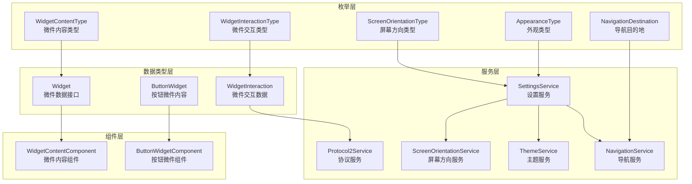
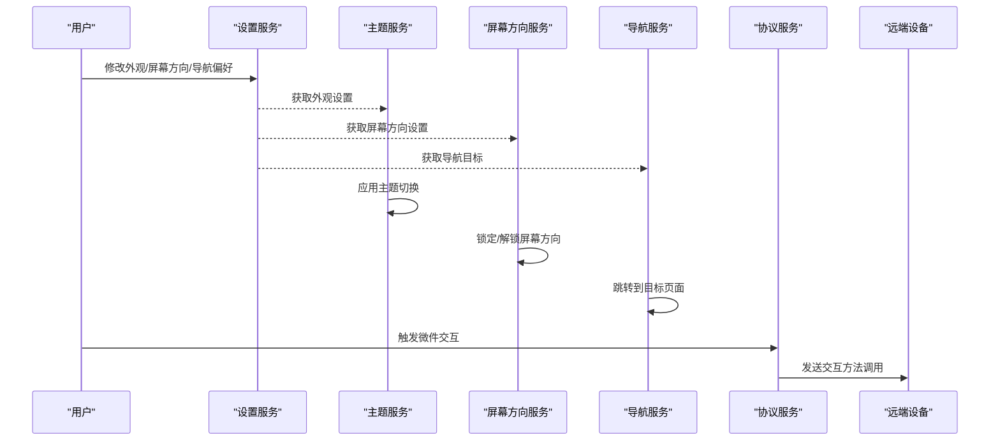
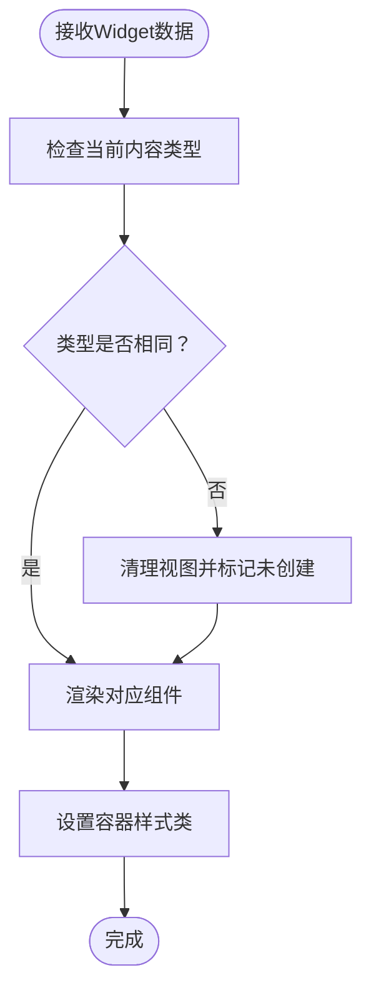
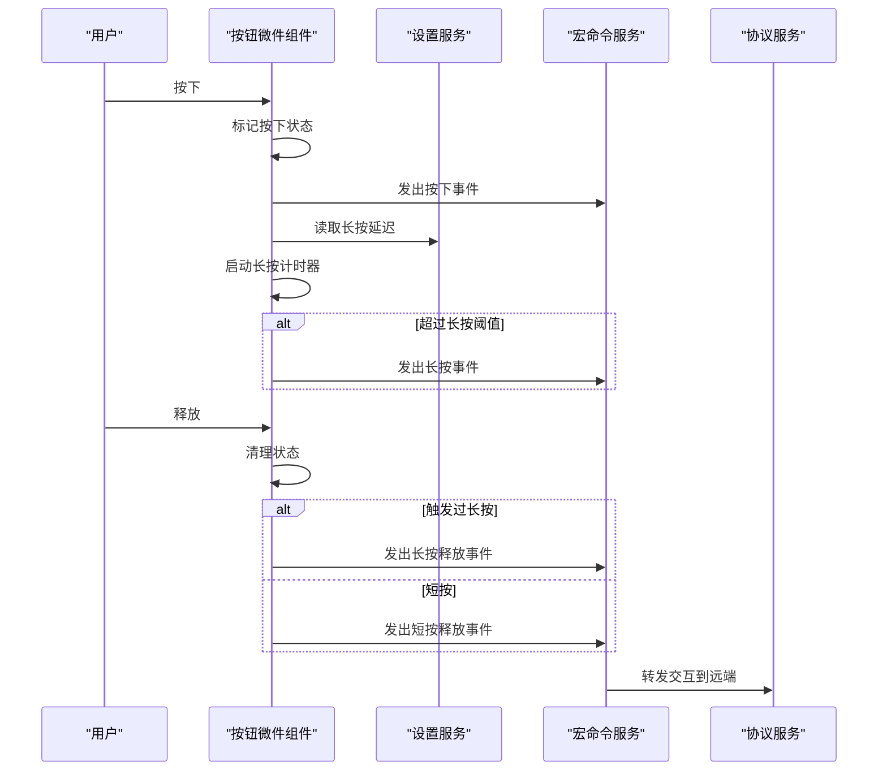
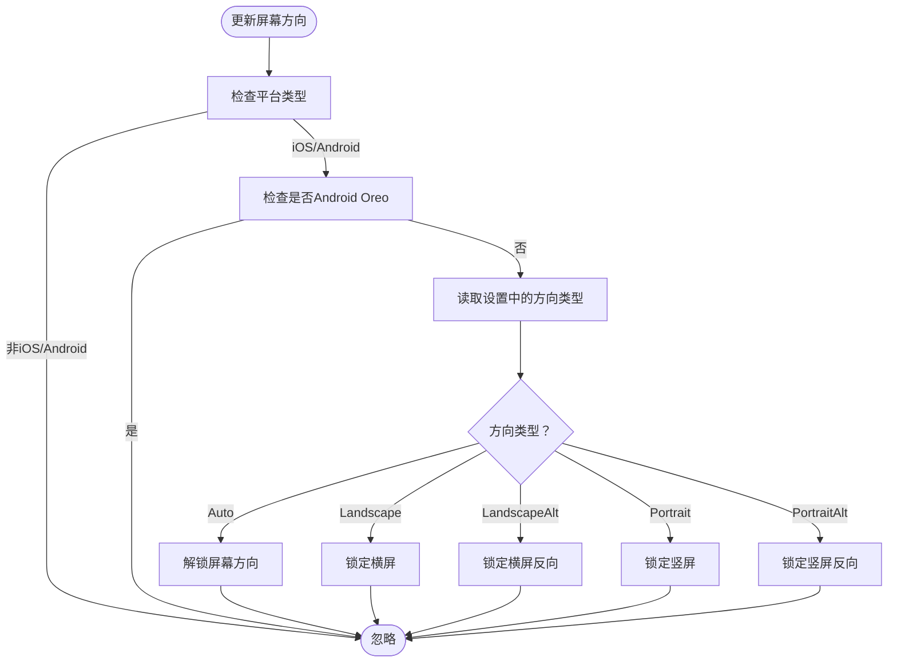
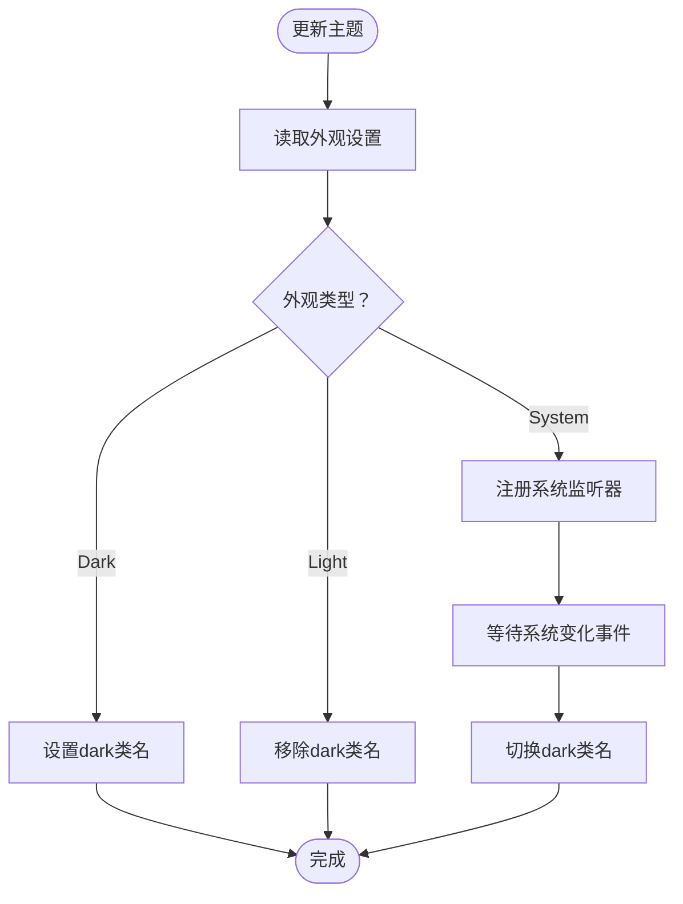
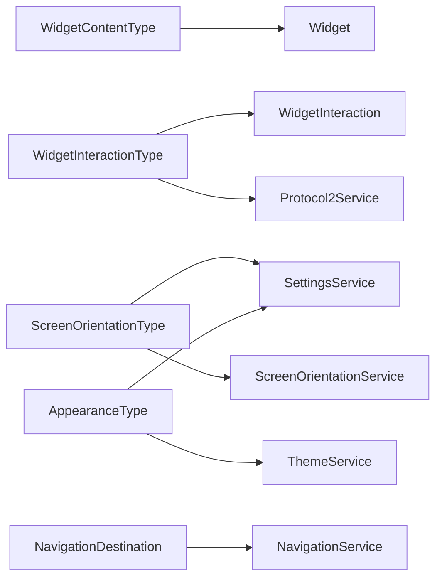

# 枚举类型

<cite>
**本文档引用的文件**
- [widget-content-type.ts](file://src/app/enums/widget-content-type.ts)
- [widget-interaction-type.ts](file://src/app/enums/widget-interaction-type.ts)
- [screen-orientation-type.ts](file://src/app/enums/screen-orientation-type.ts)
- [appearance-type.ts](file://src/app/enums/appearance-type.ts)
- [navigation-destination.ts](file://src/app/enums/navigation-destination.ts)
- [widget.ts](file://src/app/datatypes/widgets/widget.ts)
- [button-widget.ts](file://src/app/datatypes/widgets/button-widget.ts)
- [widget-content.component.ts](file://src/app/pages/deck/widget-grid/widget-content/widget-content.component.ts)
- [button-widget.component.ts](file://src/app/widget-content-components/button-widget/button-widget.component.ts)
- [widget-interaction.ts](file://src/app/datatypes/widgets/widget-interaction.ts)
- [protocol2.service.ts](file://src/app/services/protocol/protocol2.service.ts)
- [screen-orientation.service.ts](file://src/app/services/screen-orientation/screen-orientation.service.ts)
- [theme.service.ts](file://src/app/services/theme/theme.service.ts)
- [settings.service.ts](file://src/app/services/settings/settings.service.ts)
- [navigation.service.ts](file://src/app/services/navigation/navigation.service.ts)
</cite>

## 目录
1. [简介](#简介)
2. [项目结构](#项目结构)
3. [核心组件](#核心组件)
4. [架构概览](#架构概览)
5. [详细组件分析](#详细组件分析)
6. [依赖关系分析](#依赖关系分析)
7. [性能考虑](#性能考虑)
8. [故障排除指南](#故障排除指南)
9. [结论](#结论)

## 简介
本文件系统性梳理了Macro Deck客户端应用中的枚举类型设计与实现，重点涵盖以下五个核心枚举：

- WidgetContentType：微件内容类型，用于标识界面中微件显示的具体内容种类（空白、按钮等）
- WidgetInteractionType：微件交互类型，定义用户与微件交互的行为分类（按下、短按释放、长按、长按释放等）
- ScreenOrientationType：屏幕方向类型，控制设备屏幕旋转锁定策略（自动、横屏、竖屏等）
- AppearanceType：外观类型，管理应用的主题外观设置（跟随系统、深色、浅色）
- NavigationDestination：导航目的地，定义应用内部可跳转的目标页面

通过对各枚举在数据类型、服务层、组件层以及协议通信中的使用方式进行深入分析，帮助开发者准确理解每个枚举的设计意图、使用场景和最佳实践。

## 项目结构
枚举类型主要位于 `src/app/enums/` 目录下，与之紧密关联的数据类型位于 `src/app/datatypes/`，服务层位于 `src/app/services/`，UI组件位于 `src/app/widget-content-components/` 和 `src/app/pages/`。整体采用分层架构：枚举定义于低耦合的枚举层，通过数据类型与服务层进行业务编排，最终在组件层呈现给用户。

**图表来源**
- [widget-content-type.ts:1-12](file://src/app/enums/widget-content-type.ts#L1-L12)
- [widget-interaction-type.ts:1-18](file://src/app/enums/widget-interaction-type.ts#L1-L18)
- [screen-orientation-type.ts:1-21](file://src/app/enums/screen-orientation-type.ts#L1-L21)
- [appearance-type.ts:1-15](file://src/app/enums/appearance-type.ts#L1-L15)
- [navigation-destination.ts:1-15](file://src/app/enums/navigation-destination.ts#L1-L15)
- [widget.ts:1-33](file://src/app/datatypes/widgets/widget.ts#L1-L33)
- [button-widget.ts:1-16](file://src/app/datatypes/widgets/button-widget.ts#L1-L16)
- [widget-interaction.ts:1-17](file://src/app/datatypes/widgets/widget-interaction.ts#L1-L17)
- [settings.service.ts:1-389](file://src/app/services/settings/settings.service.ts#L1-L389)
- [screen-orientation.service.ts:1-104](file://src/app/services/screen-orientation/screen-orientation.service.ts#L1-L104)
- [theme.service.ts:1-103](file://src/app/services/theme/theme.service.ts#L1-L103)
- [navigation.service.ts:37-85](file://src/app/services/navigation/navigation.service.ts#L37-L85)
- [protocol2.service.ts:148-295](file://src/app/services/protocol/protocol2.service.ts#L148-L295)
- [widget-content.component.ts:1-151](file://src/app/pages/deck/widget-grid/widget-content/widget-content.component.ts#L1-L151)
- [button-widget.component.ts:1-393](file://src/app/widget-content-components/button-widget/button-widget.component.ts#L1-L393)

**章节来源**
- [widget-content-type.ts:1-12](file://src/app/enums/widget-content-type.ts#L1-L12)
- [widget-interaction-type.ts:1-18](file://src/app/enums/widget-interaction-type.ts#L1-L18)
- [screen-orientation-type.ts:1-21](file://src/app/enums/screen-orientation-type.ts#L1-L21)
- [appearance-type.ts:1-15](file://src/app/enums/appearance-type.ts#L1-L15)
- [navigation-destination.ts:1-15](file://src/app/enums/navigation-destination.ts#L1-L15)

## 核心组件

### WidgetContentType（微件内容类型）
- 定义：用于标识微件中显示的具体内容种类
- 枚举值：
  - empty：空白微件，用于占位或空区域
  - button：按钮微件，承载图标、标签和交互逻辑
- 使用场景：
  - 在微件数据结构中作为内容类型标识
  - 在微件内容组件中根据类型动态创建对应子组件
  - 在协议解析中将远端按钮映射为对应的Widget对象

**章节来源**
- [widget-content-type.ts:1-12](file://src/app/enums/widget-content-type.ts#L1-L12)
- [widget.ts:16-17](file://src/app/datatypes/widgets/widget.ts#L16-L17)
- [widget-content.component.ts:127-142](file://src/app/pages/deck/widget-grid/widget-content/widget-content.component.ts#L127-L142)
- [protocol2.service.ts:254-268](file://src/app/services/protocol/protocol2.service.ts#L254-L268)

### WidgetInteractionType（微件交互类型）
- 定义：描述用户与微件交互的不同行为
- 枚举值：
  - ButtonPress：按钮按下
  - ButtonShortPressRelease：按钮短按释放
  - ButtonLongPress：按钮长按
  - ButtonLongPressRelease：按钮长按释放
- 使用场景：
  - 在按钮微件组件中处理鼠标/触摸事件，区分短按与长按
  - 在协议服务中将交互事件映射为远端方法调用
  - 在微件交互数据结构中传递交互类型信息

**章节来源**
- [widget-interaction-type.ts:1-18](file://src/app/enums/widget-interaction-type.ts#L1-L18)
- [button-widget.component.ts:131-184](file://src/app/widget-content-components/button-widget/button-widget.component.ts#L131-L184)
- [protocol2.service.ts:274-294](file://src/app/services/protocol/protocol2.service.ts#L274-L294)
- [widget-interaction.ts:9-9](file://src/app/datatypes/widgets/widget-interaction.ts#L9-L9)

### ScreenOrientationType（屏幕方向类型）
- 定义：控制设备屏幕旋转锁定方式
- 枚举值：
  - Auto：自动旋转
  - Landscape：横屏（正向）
  - LandscapeAlt：横屏（反向）
  - Portrait：竖屏（正向）
  - PortraitAlt：竖屏（反向）
- 使用场景：
  - 通过设置服务持久化用户选择
  - 屏幕方向服务根据设置调用原生能力锁定/解锁屏幕方向
  - 在特定平台（如Android Oreo）进行兼容性判断

**章节来源**
- [screen-orientation-type.ts:1-21](file://src/app/enums/screen-orientation-type.ts#L1-L21)
- [settings.service.ts:164-174](file://src/app/services/settings/settings.service.ts#L164-L174)
- [screen-orientation.service.ts:33-54](file://src/app/services/screen-orientation/screen-orientation.service.ts#L33-L54)

### AppearanceType（外观类型）
- 定义：控制应用的明暗主题设置
- 枚举值：
  - System：跟随系统设置
  - Dark：深色主题
  - Light：浅色主题
- 使用场景：
  - 通过设置服务持久化用户选择
  - 主题服务根据设置更新DOM类名，实现主题切换
  - 监听系统深色模式变化并实时响应

**章节来源**
- [appearance-type.ts:1-15](file://src/app/enums/appearance-type.ts#L1-L15)
- [settings.service.ts:100-110](file://src/app/services/settings/settings.service.ts#L100-L110)
- [theme.service.ts:22-39](file://src/app/services/theme/theme.service.ts#L22-L39)

### NavigationDestination（导航目的地）
- 定义：定义应用内可跳转的页面目标
- 枚举值：
  - Home：首页（连接管理）
  - Deck：控制面板页面
  - ConnectionLost：连接丢失页面
- 使用场景：
  - 导航服务根据目标枚举值执行页面跳转
  - 在不同环境（Web/原生）下选择对应页面组件
  - 通过ion-nav根节点进行无动画跳转

**章节来源**
- [navigation-destination.ts:1-15](file://src/app/enums/navigation-destination.ts#L1-L15)
- [navigation.service.ts:67-84](file://src/app/services/navigation/navigation.service.ts#L67-L84)

## 架构概览
下图展示了枚举类型在系统中的流转路径：从设置服务读取用户偏好，到服务层应用到运行时状态，再到组件层呈现UI，最后通过协议服务与远端设备通信。

**图表来源**
- [settings.service.ts:100-174](file://src/app/services/settings/settings.service.ts#L100-L174)
- [theme.service.ts:20-39](file://src/app/services/theme/theme.service.ts#L20-L39)
- [screen-orientation.service.ts:72-103](file://src/app/services/screen-orientation/screen-orientation.service.ts#L72-L103)
- [navigation.service.ts:67-84](file://src/app/services/navigation/navigation.service.ts#L67-L84)
- [protocol2.service.ts:274-294](file://src/app/services/protocol/protocol2.service.ts#L274-L294)

## 详细组件分析

### 微件内容类型与动态渲染
WidgetContentComponent根据Widget.widgetContentType动态创建对应的内容组件，实现多态渲染。当内容类型发生变化时，会清理现有视图并重新创建组件实例，确保渲染一致性。

**图表来源**
- [widget-content.component.ts:115-146](file://src/app/pages/deck/widget-grid/widget-content/widget-content.component.ts#L115-L146)

**章节来源**
- [widget-content.component.ts:115-146](file://src/app/pages/deck/widget-grid/widget-content/widget-content.component.ts#L115-L146)
- [widget.ts:16-17](file://src/app/datatypes/widgets/widget.ts#L16-L17)

### 按钮微件交互流程
按钮微件组件处理鼠标/触摸事件，区分短按与长按，并通过宏命令服务发出交互事件。长按通过延时器实现，超过阈值后触发长按事件并在释放时区分长按释放。

**图表来源**
- [button-widget.component.ts:131-184](file://src/app/widget-content-components/button-widget/button-widget.component.ts#L131-L184)
- [protocol2.service.ts:274-294](file://src/app/services/protocol/protocol2.service.ts#L274-L294)

**章节来源**
- [button-widget.component.ts:131-184](file://src/app/widget-content-components/button-widget/button-widget.component.ts#L131-L184)
- [protocol2.service.ts:274-294](file://src/app/services/protocol/protocol2.service.ts#L274-L294)

### 屏幕方向控制机制
屏幕方向服务根据设置服务中的ScreenOrientationType配置，调用原生屏幕方向锁定API。对特定平台（如Android Oreo）进行兼容性处理，避免不支持锁定的设备出现异常。

**图表来源**
- [screen-orientation.service.ts:72-103](file://src/app/services/screen-orientation/screen-orientation.service.ts#L72-L103)

**章节来源**
- [screen-orientation.service.ts:72-103](file://src/app/services/screen-orientation/screen-orientation.service.ts#L72-L103)
- [settings.service.ts:164-174](file://src/app/services/settings/settings.service.ts#L164-L174)

### 外观主题切换流程
主题服务根据设置服务中的AppearanceType配置，动态切换DOM的dark类名。当选择System模式时，注册系统深色模式变化监听器，实现自动跟随。

**图表来源**
- [theme.service.ts:20-57](file://src/app/services/theme/theme.service.ts#L20-L57)

**章节来源**
- [theme.service.ts:20-57](file://src/app/services/theme/theme.service.ts#L20-L57)
- [settings.service.ts:100-110](file://src/app/services/settings/settings.service.ts#L100-L110)

## 依赖关系分析
枚举类型之间的依赖关系相对简单，主要体现为数据类型与服务层的耦合。WidgetContentType与Widget数据类型强关联；WidgetInteractionType与WidgetInteraction数据类型和协议服务相关；ScreenOrientationType与AppearanceType分别被设置服务和主题/屏幕方向服务使用；NavigationDestination被导航服务直接消费。

**图表来源**
- [widget.ts:16-17](file://src/app/datatypes/widgets/widget.ts#L16-L17)
- [widget-interaction.ts:9-9](file://src/app/datatypes/widgets/widget-interaction.ts#L9-L9)
- [settings.service.ts:100-174](file://src/app/services/settings/settings.service.ts#L100-L174)
- [screen-orientation.service.ts:33-54](file://src/app/services/screen-orientation/screen-orientation.service.ts#L33-L54)
- [theme.service.ts:22-39](file://src/app/services/theme/theme.service.ts#L22-L39)
- [navigation.service.ts:67-84](file://src/app/services/navigation/navigation.service.ts#L67-L84)

**章节来源**
- [widget.ts:16-17](file://src/app/datatypes/widgets/widget.ts#L16-L17)
- [widget-interaction.ts:9-9](file://src/app/datatypes/widgets/widget-interaction.ts#L9-L9)
- [settings.service.ts:100-174](file://src/app/services/settings/settings.service.ts#L100-L174)
- [screen-orientation.service.ts:33-54](file://src/app/services/screen-orientation/screen-orientation.service.ts#L33-L54)
- [theme.service.ts:22-39](file://src/app/services/theme/theme.service.ts#L22-L39)
- [navigation.service.ts:67-84](file://src/app/services/navigation/navigation.service.ts#L67-L84)

## 性能考虑
- 枚举值命名与数值分配：建议保持连续且有意义的数值分配，便于调试和扩展
- 动态组件创建：WidgetContentComponent在类型变化时清理并重建组件，避免内存泄漏但可能带来轻微性能开销
- 事件处理：按钮微件的长按检测使用setTimeout，应合理设置延迟阈值以平衡用户体验与CPU占用
- 主题切换：System模式下的媒体查询监听仅在需要时注册，避免不必要的事件监听
- 屏幕方向：仅在原生平台且非Android Oreo时执行锁定操作，减少无效调用

## 故障排除指南
- 屏幕方向锁定无效
  - 检查平台诊断结果，确认是否为Android Oreo
  - 验证设置服务中的ScreenOrientationType值
  - 查看服务调用是否抛出异常
- 主题切换不生效
  - 确认AppearanceType设置值正确
  - 检查DOM元素是否具备dark类名
  - 验证系统深色模式监听器是否注册成功
- 导航跳转异常
  - 确认NavigationDestination枚举值与页面组件映射一致
  - 检查ion-nav根节点是否存在
- 交互事件未到达远端
  - 验证WidgetInteractionType映射是否正确
  - 检查协议服务的发送逻辑

**章节来源**
- [screen-orientation.service.ts:52-54](file://src/app/services/screen-orientation/screen-orientation.service.ts#L52-L54)
- [theme.service.ts:55-57](file://src/app/services/theme/theme.service.ts#L55-L57)
- [navigation.service.ts:68-71](file://src/app/services/navigation/navigation.service.ts#L68-L71)
- [protocol2.service.ts:274-294](file://src/app/services/protocol/protocol2.service.ts#L274-L294)

## 结论
本项目的枚举类型设计遵循单一职责原则，通过清晰的命名和明确的使用边界，有效支撑了微件系统、交互协议、主题外观和导航控制等核心功能。建议在后续迭代中：
- 为枚举值添加统一的注释规范，提升可读性
- 对动态组件创建增加缓存策略，减少频繁重建
- 优化长按检测的阈值配置，提供用户可调参数
- 扩展更多微件内容类型，丰富UI表现力
- 增强错误处理与日志记录，便于问题定位