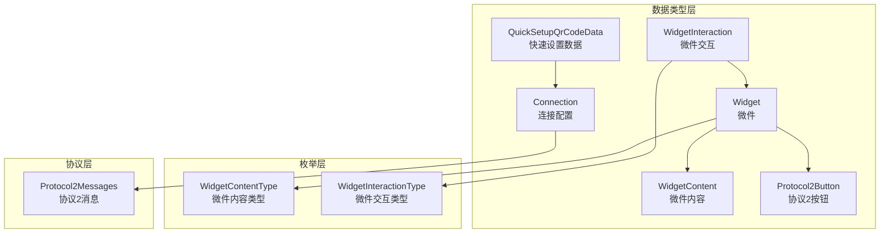
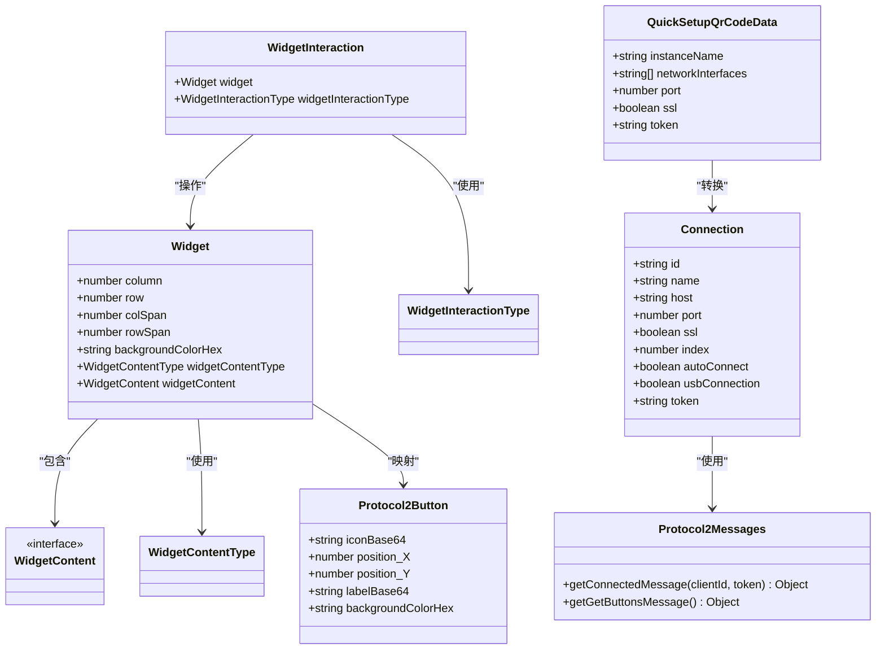
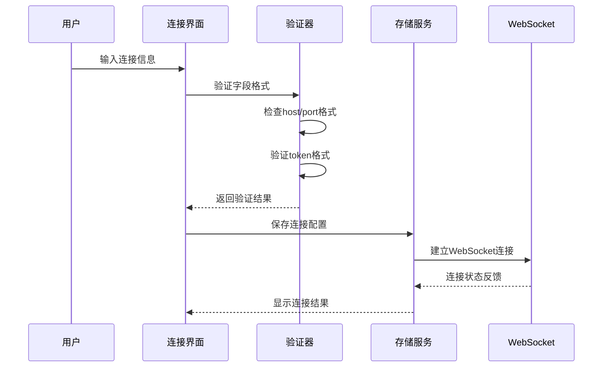
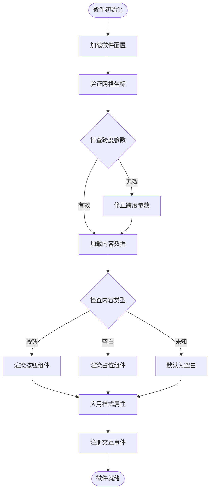
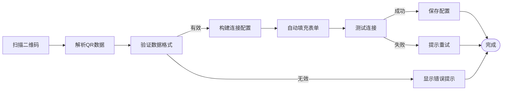
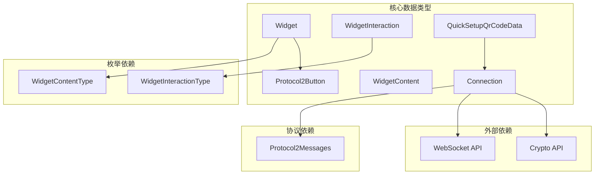

# 核心数据类型

<cite>
**本文档引用的文件**
- [connection.ts](file://src/app/datatypes/connection.ts)
- [widget.ts](file://src/app/datatypes/widgets/widget.ts)
- [widget-content.ts](file://src/app/datatypes/widgets/widget-content.ts)
- [widget-interaction.ts](file://src/app/datatypes/widgets/widget-interaction.ts)
- [quick-setup-qr-code-data.ts](file://src/app/datatypes/quick-setup-qr-code-data.ts)
- [widget-content-type.ts](file://src/app/enums/widget-content-type.ts)
- [widget-interaction-type.ts](file://src/app/enums/widget-interaction-type.ts)
- [protocol2-button.ts](file://src/app/datatypes/protocol2/protocol2-button.ts)
- [protocol2-messages.ts](file://src/app/datatypes/protocol2/protocol2-messages.ts)
</cite>

## 目录
1. [简介](#简介)
2. [项目结构](#项目结构)
3. [核心组件](#核心组件)
4. [架构概览](#架构概览)
5. [详细组件分析](#详细组件分析)
6. [依赖关系分析](#依赖关系分析)
7. [性能考虑](#性能考虑)
8. [故障排除指南](#故障排除指南)
9. [结论](#结论)

## 简介
本文件专注于Macro Deck客户端应用的核心数据类型设计与实现，涵盖连接配置、微件系统以及快速设置数据结构。通过对代码仓库中数据类型定义文件的深入分析，为开发者提供清晰的字段说明、使用示例和最佳实践指导。

## 项目结构
核心数据类型主要位于以下目录：
- 连接配置：src/app/datatypes/connection.ts
- 微件系统：src/app/datatypes/widgets/
- 快速设置：src/app/datatypes/quick-setup-qr-code-data.ts
- 枚举类型：src/app/enums/

**图表来源**
- [connection.ts:1-33](file://src/app/datatypes/connection.ts#L1-L33)
- [widget.ts:1-33](file://src/app/datatypes/widgets/widget.ts#L1-L33)
- [widget-content.ts:1-6](file://src/app/datatypes/widgets/widget-content.ts#L1-L6)
- [widget-interaction.ts:1-18](file://src/app/datatypes/widgets/widget-interaction.ts#L1-L18)
- [quick-setup-qr-code-data.ts:1-21](file://src/app/datatypes/quick-setup-qr-code-data.ts#L1-L21)
- [widget-content-type.ts:1-12](file://src/app/enums/widget-content-type.ts#L1-L12)
- [widget-interaction-type.ts:1-18](file://src/app/enums/widget-interaction-type.ts#L1-L18)
- [protocol2-button.ts:1-21](file://src/app/datatypes/protocol2/protocol2-button.ts#L1-L21)
- [protocol2-messages.ts:1-57](file://src/app/datatypes/protocol2/protocol2-messages.ts#L1-L57)

**章节来源**
- [connection.ts:1-33](file://src/app/datatypes/connection.ts#L1-L33)
- [widget.ts:1-33](file://src/app/datatypes/widgets/widget.ts#L1-L33)
- [quick-setup-qr-code-data.ts:1-21](file://src/app/datatypes/quick-setup-qr-code-data.ts#L1-L21)

## 核心组件

### 连接配置接口(Connection)
Connection接口定义了Macro Deck服务器连接的所有必要参数，采用强类型设计确保运行时安全性。

**字段定义与业务含义**：

- **id** (string): 连接唯一标识符，用于区分不同的服务器连接配置
- **name** (string): 连接显示名称，在用户界面中展示
- **host** (string): 服务器主机地址，支持IP地址或域名
- **port** (number): 服务器端口号，默认端口通常为80或443
- **ssl** (boolean): 是否启用SSL/TLS加密连接，保障通信安全
- **index** (number | undefined): 连接在列表中的排序索引，控制显示顺序
- **autoConnect** (boolean | undefined): 是否自动连接到该服务器
- **usbConnection** (boolean | undefined): 是否使用USB直连模式
- **token** (string | undefined): JWT认证令牌，用于服务器身份验证

**验证规则**：
- id必须为非空字符串且全局唯一
- host必须符合URL或IP地址格式
- port必须为1-65535之间的有效端口号
- ssl为布尔值，true表示启用加密
- token遵循JWT标准格式

**章节来源**
- [connection.ts:1-33](file://src/app/datatypes/connection.ts#L1-L33)

### 微件数据结构(Widget)
Widget接口描述了界面网格中单个微件的完整信息，包括位置、尺寸、外观和内容。

**基本属性**：
- **column** (number): 微件所在网格的列索引，从0开始计数
- **row** (number): 微件所在网格的行索引，从0开始计数
- **colSpan** (number): 微件跨越的列数，决定水平尺寸
- **rowSpan** (number): 微件跨越的行数，决定垂直尺寸
- **backgroundColorHex** (string | undefined): 背景色的十六进制值，支持透明度

**内容关联**：
- **widgetContentType** (WidgetContentType): 内容类型枚举，决定微件显示何种内容
- **widgetContent** (WidgetContent | undefined): 具体内容数据，与类型对应

**布局管理**：
微件系统采用基于网格的布局算法，通过colSpan和rowSpan实现灵活的尺寸调整。

**章节来源**
- [widget.ts:1-33](file://src/app/datatypes/widgets/widget.ts#L1-L33)
- [widget-content-type.ts:1-12](file://src/app/enums/widget-content-type.ts#L1-L12)

### 快速设置数据(QuickSetupQrCodeData)
QuickSetupQrCodeData接口定义了通过二维码分享服务器连接信息的标准化格式。

**字段定义**：
- **instanceName** (string): Macro Deck实例的显示名称
- **networkInterfaces** (string[]): 可用网络接口地址数组，支持多网卡环境
- **port** (number): 服务器监听端口号
- **ssl** (boolean): 是否启用SSL加密标志
- **token** (string): 认证令牌，用于安全访问

**使用场景**：
- 移动设备扫描二维码快速添加服务器连接
- 设备间无线分享连接配置
- 一键部署和配置Macro Deck实例

**章节来源**
- [quick-setup-qr-code-data.ts:1-21](file://src/app/datatypes/quick-setup-qr-code-data.ts#L1-L21)

### 微件交互数据(WidgetInteraction)
WidgetInteraction接口封装了用户与微件的交互事件，提供统一的事件处理机制。

**字段定义**：
- **widget** (Widget): 被交互的目标微件对象
- **widgetInteractionType** (WidgetInteractionType): 交互类型枚举

**交互类型**：
- ButtonPress: 按钮按下事件
- ButtonShortPressRelease: 短按释放事件  
- ButtonLongPress: 长按事件
- ButtonLongPressRelease: 长按释放事件

**章节来源**
- [widget-interaction.ts:1-18](file://src/app/datatypes/widgets/widget-interaction.ts#L1-L18)
- [widget-interaction-type.ts:1-18](file://src/app/enums/widget-interaction-type.ts#L1-L18)

## 架构概览

**图表来源**
- [connection.ts:1-33](file://src/app/datatypes/connection.ts#L1-L33)
- [widget.ts:1-33](file://src/app/datatypes/widgets/widget.ts#L1-L33)
- [widget-content.ts:1-6](file://src/app/datatypes/widgets/widget-content.ts#L1-L6)
- [widget-interaction.ts:1-18](file://src/app/datatypes/widgets/widget-interaction.ts#L1-L18)
- [quick-setup-qr-code-data.ts:1-21](file://src/app/datatypes/quick-setup-qr-code-data.ts#L1-L21)
- [protocol2-button.ts:1-21](file://src/app/datatypes/protocol2/protocol2-button.ts#L1-L21)
- [protocol2-messages.ts:1-57](file://src/app/datatypes/protocol2/protocol2-messages.ts#L1-L57)

## 详细组件分析

### 连接配置流程

**图表来源**
- [connection.ts:1-33](file://src/app/datatypes/connection.ts#L1-L33)
- [protocol2-messages.ts:1-57](file://src/app/datatypes/protocol2/protocol2-messages.ts#L1-L57)

### 微件渲染流程

**图表来源**
- [widget.ts:1-33](file://src/app/datatypes/widgets/widget.ts#L1-L33)
- [widget-content-type.ts:1-12](file://src/app/enums/widget-content-type.ts#L1-L12)

### 快速设置数据处理

**图表来源**
- [quick-setup-qr-code-data.ts:1-21](file://src/app/datatypes/quick-setup-qr-code-data.ts#L1-L21)
- [connection.ts:1-33](file://src/app/datatypes/connection.ts#L1-L33)

**章节来源**
- [connection.ts:1-33](file://src/app/datatypes/connection.ts#L1-L33)
- [widget.ts:1-33](file://src/app/datatypes/widgets/widget.ts#L1-L33)
- [quick-setup-qr-code-data.ts:1-21](file://src/app/datatypes/quick-setup-qr-code-data.ts#L1-L21)

## 依赖关系分析

**图表来源**
- [widget-content-type.ts:1-12](file://src/app/enums/widget-content-type.ts#L1-L12)
- [widget-interaction-type.ts:1-18](file://src/app/enums/widget-interaction-type.ts#L1-L18)
- [protocol2-messages.ts:1-57](file://src/app/datatypes/protocol2/protocol2-messages.ts#L1-L57)

**章节来源**
- [widget-content-type.ts:1-12](file://src/app/enums/widget-content-type.ts#L1-L12)
- [widget-interaction-type.ts:1-18](file://src/app/enums/widget-interaction-type.ts#L1-L18)
- [protocol2-messages.ts:1-57](file://src/app/datatypes/protocol2/protocol2-messages.ts#L1-L57)

## 性能考虑
- 数据类型设计采用接口而非复杂类层次，减少内存开销
- 可选字段使用undefined类型，避免不必要的默认值分配
- 枚举类型提供编译时类型检查，减少运行时错误
- 协议消息使用静态工厂方法，优化对象创建性能

## 故障排除指南

### 常见问题诊断
1. **连接失败**: 检查host和port配置，确认SSL设置匹配服务器配置
2. **微件显示异常**: 验证colSpan和rowSpan参数，确保不超出网格边界
3. **交互无响应**: 确认WidgetInteractionType枚举值正确，检查事件绑定
4. **二维码解析错误**: 验证JSON格式完整性，检查token格式有效性

### 调试建议
- 使用浏览器开发者工具监控网络请求
- 在控制台输出关键数据结构进行验证
- 实施渐进式功能测试，先验证基础功能再扩展

**章节来源**
- [connection.ts:1-33](file://src/app/datatypes/connection.ts#L1-L33)
- [widget.ts:1-33](file://src/app/datatypes/widgets/widget.ts#L1-L33)

## 结论
本文件详细阐述了Macro Deck客户端应用的核心数据类型设计。通过强类型接口、枚举约束和协议规范，实现了可靠的数据结构体系。建议在实际开发中遵循本文档的最佳实践，确保数据一致性和系统稳定性。