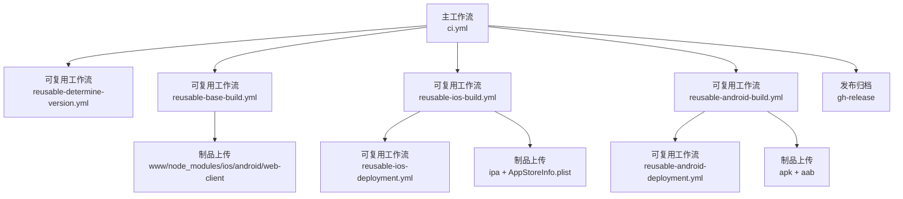
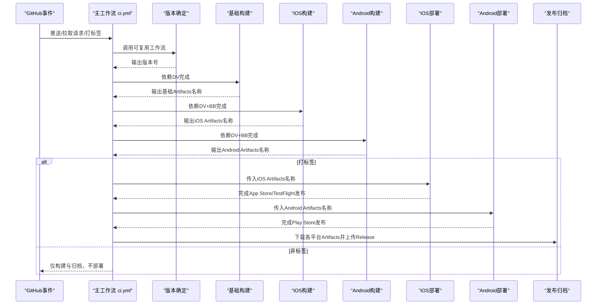
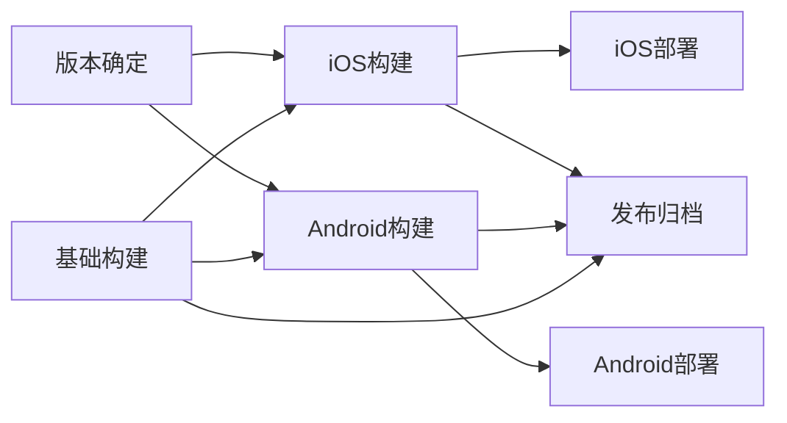

# CI/CD流程

<cite>
**本文引用的文件**
- [.github/workflows/ci.yml](file://.github/workflows/ci.yml)
- [.github/workflows/reusable-determine-version.yml](file://.github/workflows/reusable-determine-version.yml)
- [.github/workflows/reusable-base-build.yml](file://.github/workflows/reusable-base-build.yml)
- [.github/workflows/reusable-ios-build.yml](file://.github/workflows/reusable-ios-build.yml)
- [.github/workflows/reusable-android-build.yml](file://.github/workflows/reusable-android-build.yml)
- [.github/workflows/reusable-ios-deployment.yml](file://.github/workflows/reusable-ios-deployment.yml)
- [.github/workflows/reusable-android-deployment.yml](file://.github/workflows/reusable-android-deployment.yml)
- [android/fastlane/Fastfile](file://android/fastlane/Fastfile)
- [ios/App/fastlane/Fastfile](file://ios/App/fastlane/Fastfile)
- [package.json](file://package.json)
- [capacitor.config.ts](file://capacitor.config.ts)
- [android/variables.gradle](file://android/variables.gradle)
- [ios/App/Macro Deck Client.entitlements](file://ios/App/Macro Deck Client.entitlements)
- [karma.conf.js](file://karma.conf.js)
- [tsconfig.spec.json](file://tsconfig.spec.json)
</cite>

## 目录
1. [简介](#简介)
2. [项目结构](#项目结构)
3. [核心组件](#核心组件)
4. [架构总览](#架构总览)
5. [详细组件分析](#详细组件分析)
6. [依赖关系分析](#依赖关系分析)
7. [性能与可靠性考量](#性能与可靠性考量)
8. [故障排除指南](#故障排除指南)
9. [结论](#结论)
10. [附录：环境变量与密钥管理最佳实践](#附录环境变量与密钥管理最佳实践)

## 简介
本指南面向Macro-Deck-Client-App的CI/CD流程，系统性解析主工作流ci.yml的执行逻辑与可复用工作流设计模式，覆盖版本确定、基础构建、平台构建、自动化测试与质量检查、以及App Store与Play Store的自动部署路径。同时提供调试方法、故障排除建议及环境变量与密钥管理的最佳实践。

## 项目结构
本仓库采用“主工作流 + 多个可复用工作流”的分层设计：
- 主工作流ci.yml负责编排：版本确定 → 基础构建 → 平台构建（iOS/Android）→ 可选部署（App Store/TestFlight、Play Store）→ 发布制品归档。
- 可复用工作流分别承担独立职责：版本确定、基础构建、iOS构建、Android构建、iOS部署、Android部署。
- 平台侧通过Fastlane完成打包与发布，密钥与证书通过GitHub Secrets与Vars注入。

图表来源
- [.github/workflows/ci.yml:1-89](file://.github/workflows/ci.yml#L1-L89)
- [.github/workflows/reusable-determine-version.yml:1-35](file://.github/workflows/reusable-determine-version.yml#L1-L35)
- [.github/workflows/reusable-base-build.yml:1-76](file://.github/workflows/reusable-base-build.yml#L1-L76)
- [.github/workflows/reusable-ios-build.yml:1-72](file://.github/workflows/reusable-ios-build.yml#L1-L72)
- [.github/workflows/reusable-android-build.yml:1-82](file://.github/workflows/reusable-android-build.yml#L1-L82)
- [.github/workflows/reusable-ios-deployment.yml:1-38](file://.github/workflows/reusable-ios-deployment.yml#L1-L38)
- [.github/workflows/reusable-android-deployment.yml:1-30](file://.github/workflows/reusable-android-deployment.yml#L1-L30)

章节来源
- [.github/workflows/ci.yml:1-89](file://.github/workflows/ci.yml#L1-L89)

## 核心组件
- 主工作流ci.yml：定义触发条件、作业依赖顺序、可选部署与发布归档。
- 版本确定工作流：根据分支或标签推断版本号，输出供后续作业使用。
- 基础构建工作流：同步Capacitor工程、构建Ionic应用、生成Web客户端制品并上传多类Artifacts。
- 平台构建工作流：iOS与Android分别下载基础Artifacts，注入密钥/证书，调用Fastlane完成打包。
- 部署工作流：在打标签时自动部署到App Store/TestFlight与Play Store。
- 发布归档：将各平台产物重命名并上传至GitHub Release。

章节来源
- [.github/workflows/ci.yml:1-89](file://.github/workflows/ci.yml#L1-L89)
- [.github/workflows/reusable-determine-version.yml:1-35](file://.github/workflows/reusable-determine-version.yml#L1-L35)
- [.github/workflows/reusable-base-build.yml:1-76](file://.github/workflows/reusable-base-build.yml#L1-L76)
- [.github/workflows/reusable-ios-build.yml:1-72](file://.github/workflows/reusable-ios-build.yml#L1-L72)
- [.github/workflows/reusable-android-build.yml:1-82](file://.github/workflows/reusable-android-build.yml#L1-L82)
- [.github/workflows/reusable-ios-deployment.yml:1-38](file://.github/workflows/reusable-ios-deployment.yml#L1-L38)
- [.github/workflows/reusable-android-deployment.yml:1-30](file://.github/workflows/reusable-android-deployment.yml#L1-L30)

## 架构总览
下图展示从触发到发布的端到端流程，包括版本推断、基础构建、平台构建、可选部署与发布归档。

图表来源
- [.github/workflows/ci.yml:1-89](file://.github/workflows/ci.yml#L1-L89)
- [.github/workflows/reusable-determine-version.yml:1-35](file://.github/workflows/reusable-determine-version.yml#L1-L35)
- [.github/workflows/reusable-base-build.yml:1-76](file://.github/workflows/reusable-base-build.yml#L1-L76)
- [.github/workflows/reusable-ios-build.yml:1-72](file://.github/workflows/reusable-ios-build.yml#L1-L72)
- [.github/workflows/reusable-android-build.yml:1-82](file://.github/workflows/reusable-android-build.yml#L1-L82)
- [.github/workflows/reusable-ios-deployment.yml:1-38](file://.github/workflows/reusable-ios-deployment.yml#L1-L38)
- [.github/workflows/reusable-android-deployment.yml:1-30](file://.github/workflows/reusable-android-deployment.yml#L1-L30)

## 详细组件分析

### 主工作流：ci.yml
- 触发条件：对main分支推送、打标签、以及拉取请求。
- 作业编排：
  - 版本确定：调用reusable-determine-version.yml，输出版本号。
  - 基础构建：依赖版本确定，输出基础Artifacts名称。
  - 平台构建：iOS与Android分别依赖版本确定与基础构建，继承密钥并传入版本与Artifacts名称。
  - 可选部署：仅当ref为tag时触发，分别调用iOS与Android部署工作流。
  - 发布归档：仅当ref为tag时，下载iOS/Android/Web客户端Artifacts，重命名为统一命名，上传至GitHub Release。

章节来源
- [.github/workflows/ci.yml:1-89](file://.github/workflows/ci.yml#L1-L89)

### 可复用工作流：版本确定（reusable-determine-version.yml）
- 输入：无
- 输出：version（不含前缀“v”的标签名或默认版本）
- 步骤要点：
  - 检出代码并fetch完整历史。
  - 若当前为标签，则去除“v”前缀作为version；否则使用固定默认版本。
  - 将version写入GITHUB_OUTPUT供下游作业消费。

章节来源
- [.github/workflows/reusable-determine-version.yml:1-35](file://.github/workflows/reusable-determine-version.yml#L1-L35)

### 可复用工作流：基础构建（reusable-base-build.yml）
- 输入：无
- 输出：artifact_name（用于命名所有Artifacts）
- 步骤要点：
  - 检出代码并安装Node与Ionic依赖。
  - 运行Ionic生产构建，同步iOS/Android工程。
  - 上传四类Artifacts：www、node_modules、ios、android。
  - 清理www后构建Web客户端并打包zip，上传web-client制品。
  - 设置1天保留期，避免长期占用空间。

章节来源
- [.github/workflows/reusable-base-build.yml:1-76](file://.github/workflows/reusable-base-build.yml#L1-L76)

### 可复用工作流：iOS构建（reusable-ios-build.yml）
- 输入：version、base-build-artifact-name
- 输出：artifact_name（iOS Artifacts名称）
- 步骤要点：
  - 下载基础Artifacts（www/node_modules/ios）。
  - 注入SSH密钥以访问匹配证书。
  - 通过Fastlane执行构建，设置版本号与构建号。
  - 上传ipa与AppStoreInfo.plist，并设置1天保留期。

章节来源
- [.github/workflows/reusable-ios-build.yml:1-72](file://.github/workflows/reusable-ios-build.yml#L1-L72)

### 可复用工作流：Android构建（reusable-android-build.yml）
- 输入：version、base-build-artifact-name
- 输出：artifact_name（Android Artifacts名称）
- 步骤要点：
  - 下载基础Artifacts（www/node_modules/android）。
  - 解码并保存Keystore至工作区。
  - 使用Gradle与Fastlane构建APK与AAB。
  - 上传APK与AAB，并设置1天保留期。

章节来源
- [.github/workflows/reusable-android-build.yml:1-82](file://.github/workflows/reusable-android-build.yml#L1-L82)

### 可复用工作流：iOS部署（reusable-ios-deployment.yml）
- 输入：ios-build-artifact-name
- 步骤要点：
  - 下载iOS Artifacts。
  - 注入SSH密钥与App Store Connect凭据。
  - 调用Fastlane release，上传至TestFlight。

章节来源
- [.github/workflows/reusable-ios-deployment.yml:1-38](file://.github/workflows/reusable-ios-deployment.yml#L1-L38)

### 可复用工作流：Android部署（reusable-android-deployment.yml）
- 输入：android-build-artifact-name
- 步骤要点：
  - 下载Android Artifacts。
  - 通过Fastlane release上传AAB至Play Console草稿。

章节来源
- [.github/workflows/reusable-android-deployment.yml:1-30](file://.github/workflows/reusable-android-deployment.yml#L1-L30)

### 平台打包与发布细节（Fastlane）
- Android Fastfile：
  - 校验BUILD_NUMBER与VERSION_NUMBER。
  - 自动递增versionCode并设置versionName。
  - 使用签名属性构建APK与Bundle。
  - 上传AAB至Play Console草稿。
- iOS Fastfile：
  - 校验BUILD_NUMBER与VERSION_NUMBER。
  - 递增build number与version number。
  - 获取证书与配置签名，导出ipa并生成App Store信息。
  - 上传至TestFlight。

章节来源
- [android/fastlane/Fastfile:1-56](file://android/fastlane/Fastfile#L1-L56)
- [ios/App/fastlane/Fastfile:1-68](file://ios/App/fastlane/Fastfile#L1-L68)

### 自动化测试与质量检查
- 测试框架：Karma + Jasmine，配置位于karma.conf.js与tsconfig.spec.json。
- 覆盖率：覆盖率报告输出至HTML与文本摘要。
- 运行方式：在本地或CI中通过Angular CLI脚本触发测试任务。
- 建议：可在主工作流中增加测试作业，确保每次构建均产出测试报告与覆盖率数据。

章节来源
- [karma.conf.js:1-45](file://karma.conf.js#L1-L45)
- [tsconfig.spec.json:1-19](file://tsconfig.spec.json#L1-L19)

### 发布流程（App Store与Play Store）
- App Store（iOS）：
  - 在ci.yml中，当ref为tag时，调用reusable-ios-deployment.yml。
  - 该工作流下载iOS Artifacts，注入App Store Connect凭据与证书，执行Fastlane release上传至TestFlight。
- Play Store（Android）：
  - 在ci.yml中，当ref为tag时，调用reusable-android-deployment.yml。
  - 该工作流下载Android Artifacts，注入Play Console凭据，执行Fastlane release上传AAB至草稿。

章节来源
- [.github/workflows/ci.yml:36-50](file://.github/workflows/ci.yml#L36-L50)
- [.github/workflows/reusable-ios-deployment.yml:1-38](file://.github/workflows/reusable-ios-deployment.yml#L1-L38)
- [.github/workflows/reusable-android-deployment.yml:1-30](file://.github/workflows/reusable-android-deployment.yml#L1-L30)
- [ios/App/fastlane/Fastfile:58-67](file://ios/App/fastlane/Fastfile#L58-L67)
- [android/fastlane/Fastfile:48-55](file://android/fastlane/Fastfile#L48-L55)

### 发布归档（GitHub Release）
- 条件：仅当ref为tag时执行。
- 步骤：
  - 下载iOS、Android、Web客户端Artifacts。
  - 重命名为统一命名（如macro-deck-client-ios.ipa、macro-deck-client-android.apk、macro-deck-web-client.zip）。
  - 使用gh-release上传至对应标签。

章节来源
- [.github/workflows/ci.yml:52-89](file://.github/workflows/ci.yml#L52-L89)

## 依赖关系分析
- 作业耦合：
  - ios-build与android-build均依赖determine-version与base-build。
  - 部署作业依赖各自平台构建作业。
  - 发布归档作业依赖所有平台构建作业。
- 密钥与凭据：
  - iOS：App Store Connect Key（ID、Issuer ID、Key Content）、Match SSH私钥与known_hosts、证书密码。
  - Android：Keystore Base64、Keystore密码、Keystore别名、Play Console凭据。
- 平台配置：
  - Capacitor配置与Entitlements影响iOS打包与能力声明。
  - Android Gradle变量控制SDK版本与依赖版本。

图表来源
- [.github/workflows/ci.yml:1-89](file://.github/workflows/ci.yml#L1-L89)
- [.github/workflows/reusable-determine-version.yml:1-35](file://.github/workflows/reusable-determine-version.yml#L1-L35)
- [.github/workflows/reusable-base-build.yml:1-76](file://.github/workflows/reusable-base-build.yml#L1-L76)
- [.github/workflows/reusable-ios-build.yml:1-72](file://.github/workflows/reusable-ios-build.yml#L1-L72)
- [.github/workflows/reusable-android-build.yml:1-82](file://.github/workflows/reusable-android-build.yml#L1-L82)
- [.github/workflows/reusable-ios-deployment.yml:1-38](file://.github/workflows/reusable-ios-deployment.yml#L1-L38)
- [.github/workflows/reusable-android-deployment.yml:1-30](file://.github/workflows/reusable-android-deployment.yml#L1-L30)

章节来源
- [.github/workflows/ci.yml:1-89](file://.github/workflows/ci.yml#L1-L89)

## 性能与可靠性考量
- 并行度：iOS与Android构建并行执行，缩短整体流水线时间。
- 缓存策略：Java/Gradle缓存由对应Action启用，减少重复安装时间。
- 资源清理：基础构建后清理www目录，避免污染后续Web客户端构建。
- 保留期：Artifacts设置1天保留期，降低存储压力。
- 错误早发现：Fastlane lanes对缺失环境变量进行校验并报错，避免静默失败。

## 故障排除指南
- 版本确定异常
  - 现象：未正确识别标签或默认版本不符合预期。
  - 排查：确认触发ref是否为tag；检查版本确定工作流输出是否被上游消费。
  - 参考
    - [.github/workflows/reusable-determine-version.yml:20-34](file://.github/workflows/reusable-determine-version.yml#L20-L34)
- 基础构建失败
  - 现象：Ionic构建或Capacitor同步失败。
  - 排查：检查Node与Ionic依赖安装步骤；确认www/node_modules/ios/android是否成功上传。
  - 参考
    - [.github/workflows/reusable-base-build.yml:20-48](file://.github/workflows/reusable-base-build.yml#L20-L48)
- iOS构建失败
  - 现象：Fastlane构建失败或证书/签名问题。
  - 排查：确认SSH密钥与known_hosts配置；检查App Store Connect凭据；验证版本号与构建号设置。
  - 参考
    - [.github/workflows/reusable-ios-build.yml:42-58](file://.github/workflows/reusable-ios-build.yml#L42-L58)
    - [ios/App/fastlane/Fastfile:3-34](file://ios/App/fastlane/Fastfile#L3-L34)
- Android构建失败
  - 现象：Gradle签名或打包失败。
  - 排查：确认Keystore Base64解码成功；检查版本号与构建号设置；验证签名属性。
  - 参考
    - [.github/workflows/reusable-android-build.yml:46-68](file://.github/workflows/reusable-android-build.yml#L46-L68)
    - [android/fastlane/Fastfile:14-45](file://android/fastlane/Fastfile#L14-L45)
- 部署失败
  - 现象：TestFlight或Play Console上传失败。
  - 排查：确认对应凭据与密钥已注入；检查Artifacts下载路径与文件存在性。
  - 参考
    - [.github/workflows/reusable-ios-deployment.yml:23-37](file://.github/workflows/reusable-ios-deployment.yml#L23-L37)
    - [.github/workflows/reusable-android-deployment.yml:23-29](file://.github/workflows/reusable-android-deployment.yml#L23-L29)
- 发布归档失败
  - 现象：Release上传失败或产物重命名错误。
  - 排查：确认各Artifacts名称与路径；检查重命名与上传命令。
  - 参考
    - [.github/workflows/ci.yml:58-86](file://.github/workflows/ci.yml#L58-L86)

## 结论
本CI/CD体系通过主工作流编排多个可复用工作流，实现了版本自动推断、跨平台并行构建、可选部署与发布归档的完整闭环。配合Fastlane与GitHub Secrets，既保证了安全性也提升了可维护性。建议在现有基础上补充测试作业与覆盖率报告，进一步完善质量门禁。

## 附录：环境变量与密钥管理最佳实践
- iOS相关
  - APPSTORE_KEY_ID、APPSTORE_KEY_ISSUER_ID、APPSTORE_KEY_CONTENT：用于App Store Connect API Key认证。
  - MATCH_SSH_PRIVATE_KEY、MATCH_KNOWN_HOSTS：用于fastlane match证书同步。
  - 参考
    - [.github/workflows/reusable-ios-build.yml:48-53](file://.github/workflows/reusable-ios-build.yml#L48-L53)
    - [.github/workflows/reusable-ios-deployment.yml:29-33](file://.github/workflows/reusable-ios-deployment.yml#L29-L33)
    - [ios/App/fastlane/Fastfile:50-55](file://ios/App/fastlane/Fastfile#L50-L55)
- Android相关
  - ANDROID_KEYSTORE_BASE64：Keystore的Base64编码。
  - ANDROID_KEYSTORE_PASSWORD、ANDROID_KEYSTORE_KEY：Keystore密码与别名。
  - PLAYSTORE_CREDENTIALS：Play Console JSON凭据。
  - 参考
    - [.github/workflows/reusable-android-build.yml:46-63](file://.github/workflows/reusable-android-build.yml#L46-L63)
    - [.github/workflows/reusable-android-deployment.yml:24-25](file://.github/workflows/reusable-android-deployment.yml#L24-L25)
    - [android/fastlane/Fastfile:48-54](file://android/fastlane/Fastfile#L48-L54)
- 其他
  - Capacitor与平台配置：Capacitor应用ID、应用名、iOS Scheme、Entitlements域名等。
  - 参考
    - [capacitor.config.ts:3-12](file://capacitor.config.ts#L3-L12)
    - [ios/App/Macro Deck Client.entitlements:4-8](file://ios/App/Macro Deck Client.entitlements#L4-L8)
    - [android/variables.gradle:1-16](file://android/variables.gradle#L1-L16)
- 最佳实践
  - 严格区分Secrets与Vars：敏感信息放入Secrets，非敏感配置放入Vars。
  - 限制权限：仅授予必要权限（如发布Release需要contents: write）。
  - 分离开发与生产密钥：避免在PR或非tag分支使用生产密钥。
  - 定期轮换：定期更新App Store Connect Key与Play Console凭据。
  - 文档化：在README或Wiki记录各密钥用途与轮换流程。