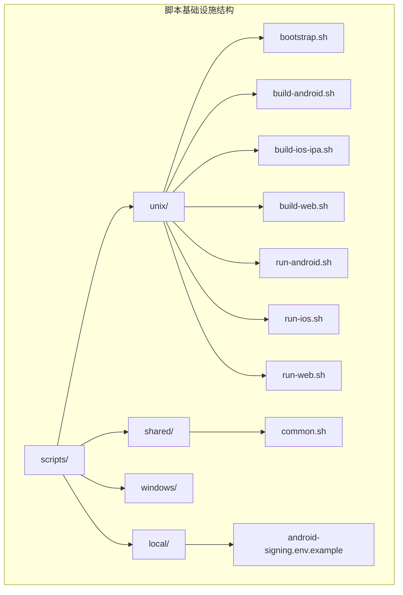
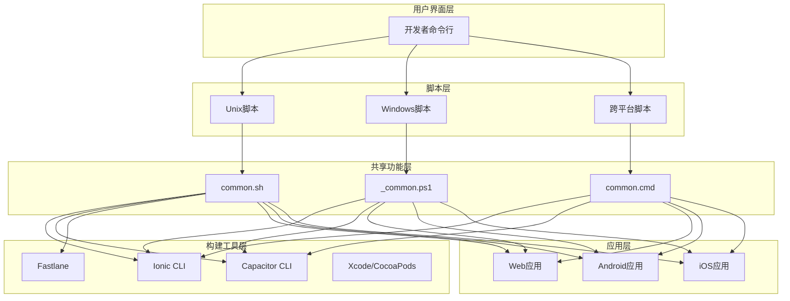
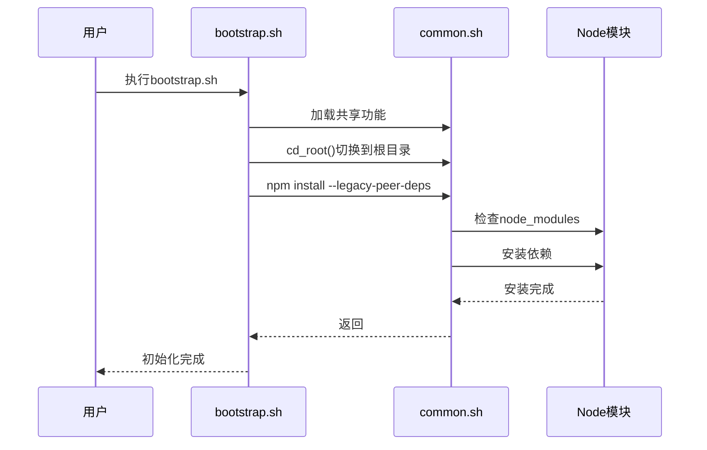
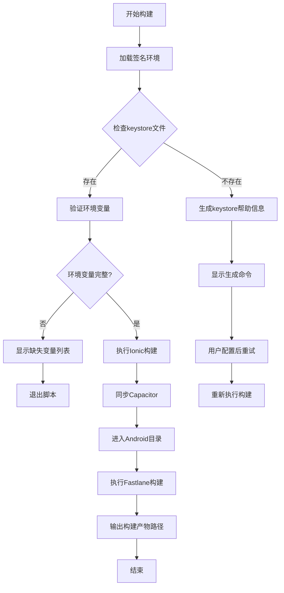
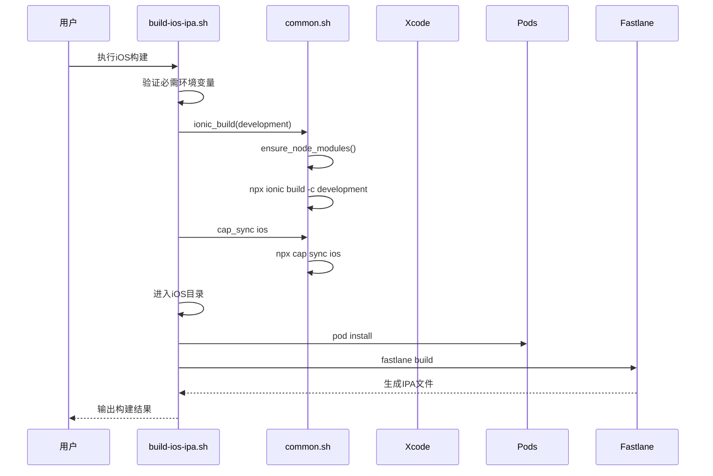
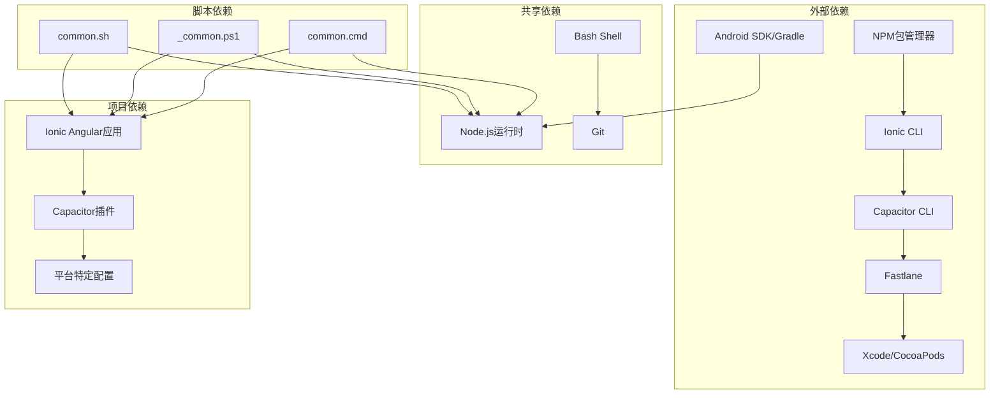

# Unix/Linux脚本基础设施

<cite>
**本文档引用的文件**
- [bootstrap.sh](file://scripts/unix/bootstrap.sh)
- [build-android.sh](file://scripts/unix/build-android.sh)
- [build-ios-ipa.sh](file://scripts/unix/build-ios-ipa.sh)
- [build-web.sh](file://scripts/unix/build-web.sh)
- [run-android.sh](file://scripts/unix/run-android.sh)
- [run-ios.sh](file://scripts/unix/run-ios.sh)
- [run-web.sh](file://scripts/unix/run-web.sh)
- [common.sh](file://scripts/shared/common.sh)
- [scripts README.md](file://scripts/README.md)
- [package.json](file://package.json)
- [angular.json](file://angular.json)
- [android-signing.env.example](file://scripts/local/android-signing.env.example)
- [_common.ps1](file://scripts/windows/_common.ps1)
- [common.cmd](file://scripts/windows.bak/common.cmd)
</cite>

## 目录
1. [简介](#简介)
2. [项目结构](#项目结构)
3. [核心组件](#核心组件)
4. [架构概览](#架构概览)
5. [详细组件分析](#详细组件分析)
6. [依赖关系分析](#依赖关系分析)
7. [性能考虑](#性能考虑)
8. [故障排除指南](#故障排除指南)
9. [结论](#结论)

## 简介

Macro Deck Client App项目采用多平台脚本基础设施，为Unix/Linux系统提供了完整的开发、构建和部署工作流程。该基础设施通过一组精心设计的Shell脚本实现了跨平台的一致性，支持Web应用、Android移动应用和iOS应用的开发与发布。

该脚本系统的核心优势在于其模块化设计，通过共享的通用脚本文件提供统一的功能接口，同时针对不同平台提供专门的实现。这种设计确保了开发者可以在不同的操作系统环境中获得一致的开发体验。

## 项目结构

项目中的Unix/Linux脚本基础设施主要位于`scripts/unix/`目录下，配合`scripts/shared/`目录中的通用脚本文件，形成了完整的脚本生态系统。



**图表来源**
- [bootstrap.sh:1-9](file://scripts/unix/bootstrap.sh#L1-9)
- [common.sh:1-46](file://scripts/shared/common.sh#L1-46)

**章节来源**
- [bootstrap.sh:1-9](file://scripts/unix/bootstrap.sh#L1-9)
- [common.sh:1-46](file://scripts/shared/common.sh#L1-46)
- [scripts README.md:1-130](file://scripts/README.md#L1-130)

## 核心组件

### 通用脚本框架

共享的`common.sh`脚本提供了整个脚本基础设施的基础功能，包括：

- **根目录管理**：`cd_root()`函数确保所有脚本都在项目根目录下执行
- **依赖检查**：`require_command()`和`require_env()`函数验证必需工具和环境变量
- **构建流程**：`ionic_build()`和`cap_sync()`函数封装了Ionic和Capacitor的标准构建流程
- **依赖管理**：`ensure_node_modules()`函数自动处理Node.js依赖安装

### 平台特定构建脚本

每个目标平台都有专门的构建脚本，这些脚本继承了通用功能并添加了平台特定的逻辑：

- **Android构建**：处理签名密钥配置、Fastlane集成和多格式输出
- **iOS构建**：集成Xcode、CocoaPods和App Store Connect认证
- **Web构建**：支持多种配置模式和部署选项

**章节来源**
- [common.sh:7-46](file://scripts/shared/common.sh#L7-46)
- [build-android.sh:11-136](file://scripts/unix/build-android.sh#L11-136)
- [build-ios-ipa.sh:7-16](file://scripts/unix/build-ios-ipa.sh#L7-16)

## 架构概览

脚本基础设施采用了分层架构设计，确保了良好的可维护性和扩展性。



**图表来源**
- [common.sh:1-46](file://scripts/shared/common.sh#L1-46)
- [_common.ps1:1-800](file://scripts/windows/_common.ps1#L1-800)
- [common.cmd:1-8](file://scripts/windows.bak/common.cmd#L1-8)

## 详细组件分析

### Bootstrap脚本分析

Bootstrap脚本作为整个脚本基础设施的入口点，负责初始化开发环境。



**图表来源**
- [bootstrap.sh:1-9](file://scripts/unix/bootstrap.sh#L1-9)
- [common.sh:27-32](file://scripts/shared/common.sh#L27-32)

**章节来源**
- [bootstrap.sh:1-9](file://scripts/unix/bootstrap.sh#L1-9)
- [common.sh:27-32](file://scripts/shared/common.sh#L27-32)

### Android构建流程

Android构建脚本实现了复杂的签名和发布流程，具有以下特点：



**图表来源**
- [build-android.sh:11-151](file://scripts/unix/build-android.sh#L11-151)

**章节来源**
- [build-android.sh:11-151](file://scripts/unix/build-android.sh#L11-151)
- [android-signing.env.example:1-10](file://scripts/local/android-signing.env.example#L1-10)

### iOS构建流程

iOS构建脚本专注于macOS环境下的应用构建和分发：



**图表来源**
- [build-ios-ipa.sh:17-24](file://scripts/unix/build-ios-ipa.sh#L17-24)
- [common.sh:34-45](file://scripts/shared/common.sh#L34-45)

**章节来源**
- [build-ios-ipa.sh:1-25](file://scripts/unix/build-ios-ipa.sh#L1-25)
- [common.sh:34-45](file://scripts/shared/common.sh#L34-45)

### Web构建流程

Web构建脚本提供了灵活的配置选项和多种构建模式：

```mermaid
flowchart LR
A[Web构建开始] --> B[设置配置模式]
B --> C{配置模式选择}
C --> |web_production| D[生产模式构建]
C --> |web| [开发模式构建]
D --> E[Ionic构建]
E --> F[输出到www目录]
F --> G[构建完成]
C --> |其他| H[默认生产模式]
H --> E
```

**图表来源**
- [build-web.sh:7-11](file://scripts/unix/build-web.sh#L7-11)

**章节来源**
- [build-web.sh:1-12](file://scripts/unix/build-web.sh#L1-12)

## 依赖关系分析

脚本基础设施的依赖关系体现了清晰的层次结构和模块化设计。



**图表来源**
- [package.json:16-57](file://package.json#L16-57)
- [angular.json:13-121](file://angular.json#L13-121)

**章节来源**
- [package.json:16-57](file://package.json#L16-57)
- [angular.json:13-121](file://angular.json#L13-121)

## 性能考虑

脚本基础设施在设计时充分考虑了性能优化和用户体验：

### 并行执行优化
- 使用`set -euo pipefail`确保脚本在遇到错误时立即停止
- 通过条件检查避免不必要的依赖安装
- 智能缓存机制减少重复的构建过程

### 资源管理
- 自动检测和清理临时文件
- 优化的依赖安装策略，避免重复下载
- 智能的环境变量管理，减少配置开销

### 错误处理
- 完善的错误检测和报告机制
- 友好的错误消息和解决方案建议
- 自动化的故障恢复和重试机制

## 故障排除指南

### 常见问题及解决方案

**依赖安装问题**
- 症状：npm install失败或依赖冲突
- 解决方案：使用`--legacy-peer-deps`标志或更新Node.js版本

**构建环境问题**
- 症状：找不到必需的构建工具
- 解决方案：检查PATH环境变量，确保工具已正确安装

**签名配置问题**
- 症状：Android构建时签名失败
- 解决方案：验证keystore文件路径和密码配置

**平台特定问题**
- 症状：iOS构建在非macOS环境下失败
- 解决方案：使用macOS环境或Docker容器

**章节来源**
- [scripts README.md:87-129](file://scripts/README.md#L87-129)

## 结论

Macro Deck Client App项目的Unix/Linux脚本基础设施展现了现代软件开发的最佳实践。通过模块化设计、跨平台兼容性和完善的错误处理机制，该基础设施为开发者提供了高效、可靠的开发和部署体验。

该脚本系统的主要优势包括：

1. **一致性**：统一的接口和工作流程，确保不同平台间的开发体验一致
2. **可维护性**：清晰的模块化结构，便于维护和扩展
3. **可靠性**：完善的错误处理和故障恢复机制
4. **灵活性**：支持多种配置和自定义选项
5. **安全性**：严格的环境验证和敏感信息保护

通过持续的优化和改进，这套脚本基础设施将继续为Macro Deck Client App项目提供强大的技术支持，确保项目的长期可持续发展。