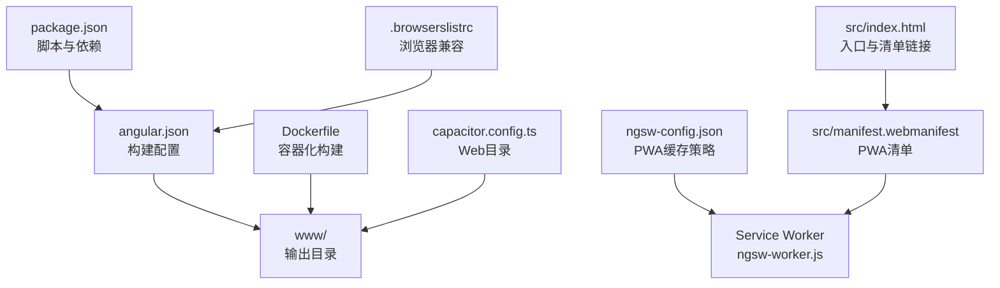
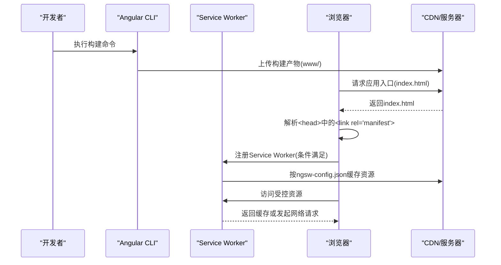
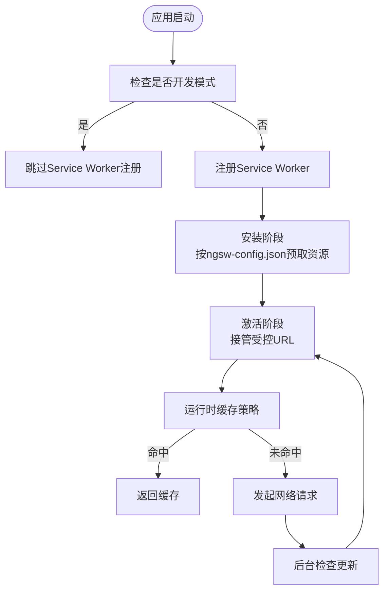
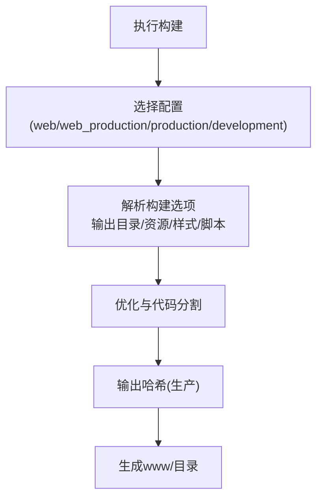
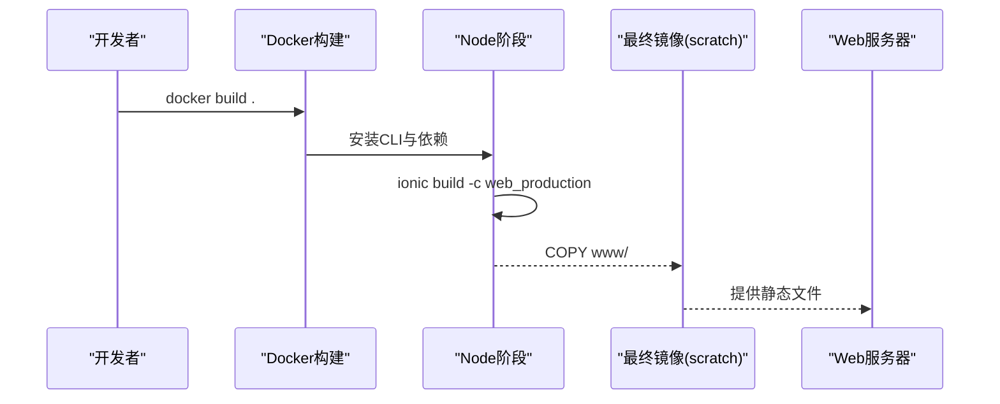
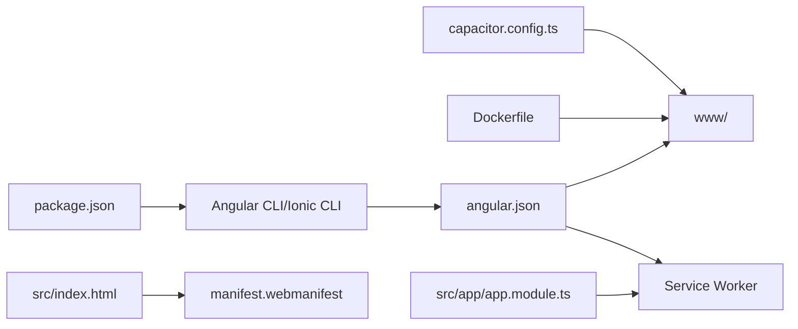

# Web/PWA部署

<cite>
**本文档引用的文件**
- [angular.json](file://angular.json)
- [package.json](file://package.json)
- [ngsw-config.json](file://ngsw-config.json)
- [src/manifest.webmanifest](file://src/manifest.webmanifest)
- [Dockerfile](file://Dockerfile)
- [.browserslistrc](file://.browserslistrc)
- [src/index.html](file://src/index.html)
- [src/app/app.module.ts](file://src/app/app.module.ts)
- [src/environments/environment.web.prod.ts](file://src/environments/environment.web.prod.ts)
- [src/environments/environment.web.ts](file://src/environments/environment.web.ts)
- [capacitor.config.ts](file://capacitor.config.ts)
- [ionic.config.json](file://ionic.config.json)
- [.github/workflows/ci.yml](file://.github/workflows/ci.yml)
</cite>

## 目录
1. [简介](#简介)
2. [项目结构](#项目结构)
3. [核心组件](#核心组件)
4. [架构概览](#架构概览)
5. [详细组件分析](#详细组件分析)
6. [依赖关系分析](#依赖关系分析)
7. [性能考虑](#性能考虑)
8. [故障排除指南](#故障排除指南)
9. [结论](#结论)
10. [附录](#附录)

## 简介
本指南面向Web与PWA平台的部署需求，围绕以下目标展开：  
- PWA配置与Service Worker设置：缓存策略、离线能力、更新机制  
- Angular CLI生产构建配置：代码分割、资源优化、Bundle分析  
- manifest.webmanifest配置：应用图标、主题色、显示模式  
- Docker容器化部署：Dockerfile、镜像构建、容器运行  
- HTTPS与域名：部署要求与CDN选项  
- 浏览器兼容性测试与性能监控建议  

本项目同时支持Capacitor跨平台集成，因此在Web/PWA部署时，会重点说明与Web环境相关的配置与最佳实践。

## 项目结构
该项目采用Angular + Ionic + Capacitor的混合架构，Web/PWA部署主要关注以下文件与配置：
- 构建与打包：angular.json、package.json、Dockerfile  
- PWA与Service Worker：ngsw-config.json、src/manifest.webmanifest、src/app/app.module.ts  
- 环境配置：src/environments/environment.web.prod.ts、src/environments/environment.web.ts  
- 兼容性与清单：.browserslistrc、src/index.html  
- 集成配置：capacitor.config.ts、ionic.config.json  
- 自动化：.github/workflows/ci.yml

**图表来源**
- [angular.json:13-46](file://angular.json#L13-L46)
- [Dockerfile:10-11](file://Dockerfile#L10-L11)
- [ngsw-config.json:1-31](file://ngsw-config.json#L1-L31)
- [src/manifest.webmanifest:1-48](file://src/manifest.webmanifest#L1-L48)
- [src/index.html:26](file://src/index.html#L26)
- [capacitor.config.ts:6](file://capacitor.config.ts#L6)

**章节来源**
- [angular.json:1-203](file://angular.json#L1-L203)
- [package.json:1-92](file://package.json#L1-L92)
- [Dockerfile:1-16](file://Dockerfile#L1-L16)
- [.browserslistrc:1-17](file://.browserslistrc#L1-L17)
- [src/index.html:1-36](file://src/index.html#L1-L36)
- [capacitor.config.ts:1-16](file://capacitor.config.ts#L1-L16)
- [ionic.config.json:1-10](file://ionic.config.json#L1-L10)

## 核心组件
- Angular CLI构建配置：定义输出目录、资源处理、Service Worker开关与NGSW配置路径、多环境配置（web/web_production/production/development）  
- PWA与Service Worker：通过ngsw-config.json定义缓存组（预取/惰性）、资源匹配规则；通过manifest.webmanifest定义应用元数据  
- Docker容器化：使用多阶段构建，安装CLI工具与依赖，执行ionic build -c web_production，最终仅保留www产物  
- 环境配置：区分web开发与web生产环境，控制特性开关与版本信息  
- 兼容性与清单：.browserslistrc声明目标浏览器；src/index.html引入manifest与基础配置

**章节来源**
- [angular.json:47-120](file://angular.json#L47-L120)
- [ngsw-config.json:1-31](file://ngsw-config.json#L1-L31)
- [src/manifest.webmanifest:1-48](file://src/manifest.webmanifest#L1-L48)
- [Dockerfile:1-16](file://Dockerfile#L1-L16)
- [src/environments/environment.web.prod.ts:1-15](file://src/environments/environment.web.prod.ts#L1-L15)
- [src/environments/environment.web.ts:1-15](file://src/environments/environment.web.ts#L1-L15)
- [.browserslistrc:11-16](file://.browserslistrc#L11-L16)
- [src/index.html:26](file://src/index.html#L26)

## 架构概览
下图展示Web/PWA部署的关键流程：构建、Service Worker注册、缓存策略与清单文件。

**图表来源**
- [angular.json:44-45](file://angular.json#L44-L45)
- [src/app/app.module.ts:31-35](file://src/app/app.module.ts#L31-L35)
- [ngsw-config.json:1-31](file://ngsw-config.json#L1-L31)
- [src/index.html:26](file://src/index.html#L26)

## 详细组件分析

### PWA配置与Service Worker
- 清单文件（manifest.webmanifest）
  - 名称、短名称、主题色、背景色、显示模式、作用域与起始URL  
  - 图标集：覆盖常见尺寸，使用maskable any用途以适配不同平台圆角/遮罩  
- Service Worker与NGSW
  - 在构建配置中启用serviceWorker并指定ngswConfigPath  
  - 在应用模块中注册Service Worker，开发模式禁用，稳定后注册  
  - NGSW配置包含两个资源组：应用核心资源（预取）与静态资源（惰性+预取更新）  
- 离线与更新机制
  - 预取策略确保关键HTML/CSS/JS在安装时缓存  
  - 惰性策略用于图片等资源，首次访问后缓存  
  - 更新通过NGSW后台检查与激活流程实现

**图表来源**
- [src/app/app.module.ts:31-35](file://src/app/app.module.ts#L31-L35)
- [ngsw-config.json:4-29](file://ngsw-config.json#L4-L29)

**章节来源**
- [src/manifest.webmanifest:1-48](file://src/manifest.webmanifest#L1-L48)
- [src/app/app.module.ts:31-35](file://src/app/app.module.ts#L31-L35)
- [ngsw-config.json:1-31](file://ngsw-config.json#L1-L31)
- [angular.json:44-45](file://angular.json#L44-L45)

### Angular CLI生产构建配置
- 输出与资源
  - 输出目录：www  
  - 资源：assets、SVG图标、manifest文件  
  - 样式与脚本：主题变量、全局样式、第三方CSS/JS  
- 环境配置
  - web_production：设置baseHref/deployUrl、预算限制、文件替换为web生产环境、开启输出哈希  
  - web：web开发环境配置（非生产优化）  
  - production/development：原生平台配置  
- 代码分割与优化
  - 默认生产配置启用outputHashing=all，有利于长期缓存与CDN分发  
  - 可结合路由懒加载与模块拆分进一步优化Bundle大小  
- Bundle分析
  - 建议使用webpack-bundle-analyzer或Angular CLI内置分析工具进行分析  
  - 结合.browserslistrc目标浏览器，评估polyfill与转译范围

**图表来源**
- [angular.json:15-46](file://angular.json#L15-L46)
- [angular.json:47-120](file://angular.json#L47-L120)
- [.browserslistrc:11-16](file://.browserslistrc#L11-L16)

**章节来源**
- [angular.json:13-120](file://angular.json#L13-L120)
- [package.json:7-14](file://package.json#L7-L14)
- [.browserslistrc:1-17](file://.browserslistrc#L1-L17)

### manifest.webmanifest配置
- 关键字段
  - name/short_name：应用名称与简称  
  - theme_color/background_color：主题色与背景色  
  - display：fullscreen  
  - scope/start_url：作用域与起始URL  
  - icons：多尺寸PNG图标，purpose为maskable any  
- 部署建议
  - 确保icons路径与实际资源一致  
  - 主题色与背景色应与UI设计一致，提升安装体验

**章节来源**
- [src/manifest.webmanifest:1-48](file://src/manifest.webmanifest#L1-L48)
- [src/index.html:26](file://src/index.html#L26)

### Docker容器化部署
- 多阶段构建
  - 第一阶段：安装Node、CLI与yarn依赖，执行ionic build -c web_production  
  - 第二阶段：从第一阶段复制www至scratch镜像，仅保留运行时产物  
- 运行方式
  - 使用nginx或静态文件服务器提供www目录  
  - 通过反向代理配置HTTPS与CDN

**图表来源**
- [Dockerfile:1-16](file://Dockerfile#L1-L16)

**章节来源**
- [Dockerfile:1-16](file://Dockerfile#L1-L16)

### 环境与版本控制
- web开发/生产环境
  - environment.web.ts：开发模式，webVersion=true  
  - environment.web.prod.ts：生产模式，webVersion=true  
- 版本号
  - 两份web环境文件均包含version字段，便于前端识别版本

**章节来源**
- [src/environments/environment.web.ts:1-15](file://src/environments/environment.web.ts#L1-L15)
- [src/environments/environment.web.prod.ts:1-15](file://src/environments/environment.web.prod.ts#L1-L15)

### 浏览器兼容性与清单
- 目标浏览器
  - Chrome/ChromeAndroid/Firefox/Edge/Safari/iOS均有明确版本要求  
- HTML清单与基础配置
  - index.html包含manifest链接、主题色、viewport、iOS相关meta等

**章节来源**
- [.browserslistrc:11-16](file://.browserslistrc#L11-L16)
- [src/index.html:1-36](file://src/index.html#L1-L36)

### GitHub Actions自动化（Web产物）
- 工作流
  - CI工作流在构建完成后，将Web客户端产物归档并发布到GitHub Releases  
  - 与Capacitor原生构建并行，确保Web/PWA产物可独立分发

**章节来源**
- [.github/workflows/ci.yml:1-89](file://.github/workflows/ci.yml#L1-L89)

## 依赖关系分析
- 构建链路
  - package.json scripts驱动Angular CLI与Ionic CLI  
  - angular.json定义构建目标与配置，输出至www  
  - Dockerfile调用ionic build -c web_production  
- PWA链路
  - src/index.html引入manifest  
  - src/app/app.module.ts注册Service Worker  
  - ngsw-config.json定义缓存策略  
- 平台集成
  - capacitor.config.ts指定webDir为www，与构建输出一致

**图表来源**
- [package.json:7-14](file://package.json#L7-L14)
- [angular.json:13-46](file://angular.json#L13-L46)
- [Dockerfile:10-11](file://Dockerfile#L10-L11)
- [src/index.html:26](file://src/index.html#L26)
- [src/manifest.webmanifest:1-48](file://src/manifest.webmanifest#L1-L48)
- [src/app/app.module.ts:31-35](file://src/app/app.module.ts#L31-L35)
- [capacitor.config.ts:6](file://capacitor.config.ts#L6)

**章节来源**
- [package.json:1-92](file://package.json#L1-L92)
- [angular.json:1-203](file://angular.json#L1-L203)
- [Dockerfile:1-16](file://Dockerfile#L1-L16)
- [capacitor.config.ts:1-16](file://capacitor.config.ts#L1-L16)

## 性能考虑
- 代码分割与懒加载
  - 启用路由级懒加载与按需模块加载，减少首屏Bundle体积  
- 资源优化
  - 使用outputHashing=all，结合CDN长缓存策略  
  - 对图片与字体进行压缩与格式优化（如WebP/AVIF）  
- 缓存策略
  - 依据ngsw-config.json合理划分预取与惰性缓存资源  
  - 控制缓存更新频率，避免陈旧资源影响用户体验  
- 构建预算
  - 利用angular.json中的budgets配置，设定初始与样式预算阈值，及时发现体积膨胀  

[本节为通用指导，无需特定文件引用]

## 故障排除指南
- Service Worker未注册
  - 确认app.module.ts中enabled条件与注册策略符合预期  
  - 检查index.html是否正确引入manifest与基础标签  
- 缓存未生效
  - 检查ngsw-config.json资源匹配规则与installMode/updateMode  
  - 确认构建时serviceWorker与ngswConfigPath配置正确  
- Docker部署空白页
  - 确认webDir与构建输出目录一致（www）  
  - 检查静态服务器对index.html的回退配置与baseHref  
- HTTPS与CDN
  - 确保CDN支持HTTP/2与现代加密套件  
  - 配置Strict-Transport-Security与安全响应头  
- 浏览器兼容性
  - 使用.browserslistrc目标查询，验证关键功能在目标浏览器可用性  
  - 对不支持的特性添加polyfill或降级方案  

**章节来源**
- [src/app/app.module.ts:31-35](file://src/app/app.module.ts#L31-L35)
- [src/index.html:26](file://src/index.html#L26)
- [ngsw-config.json:1-31](file://ngsw-config.json#L1-L31)
- [capacitor.config.ts:6](file://capacitor.config.ts#L6)
- [.browserslistrc:11-16](file://.browserslistrc#L11-L16)

## 结论
本指南梳理了Web/PWA部署所需的关键配置与流程：  
- 通过angular.json与Dockerfile完成生产构建与容器化  
- 借助ngsw-config.json与manifest.webmanifest实现PWA缓存与安装体验  
- 结合.browserslistrc与index.html保障兼容性与清单正确性  
- 借助GitHub Actions实现Web产物的自动化归档与发布  
在实际部署中，建议配合CDN与HTTPS、性能监控与浏览器兼容性测试，持续优化用户体验与稳定性。

[本节为总结性内容，无需特定文件引用]

## 附录
- 关键配置速览
  - 构建：angular.json（输出目录、资源、Service Worker、配置集）  
  - PWA：ngsw-config.json（缓存组）、manifest.webmanifest（清单）  
  - 环境：environment.web.ts/prod.ts（web版本与版本号）  
  - 容器：Dockerfile（多阶段构建与产物复制）  
  - 兼容：.browserslistrc（目标浏览器）、index.html（清单与基础配置）  
  - 集成：capacitor.config.ts（webDir）、ionic.config.json（项目类型）

[本节为概览性内容，无需特定文件引用]