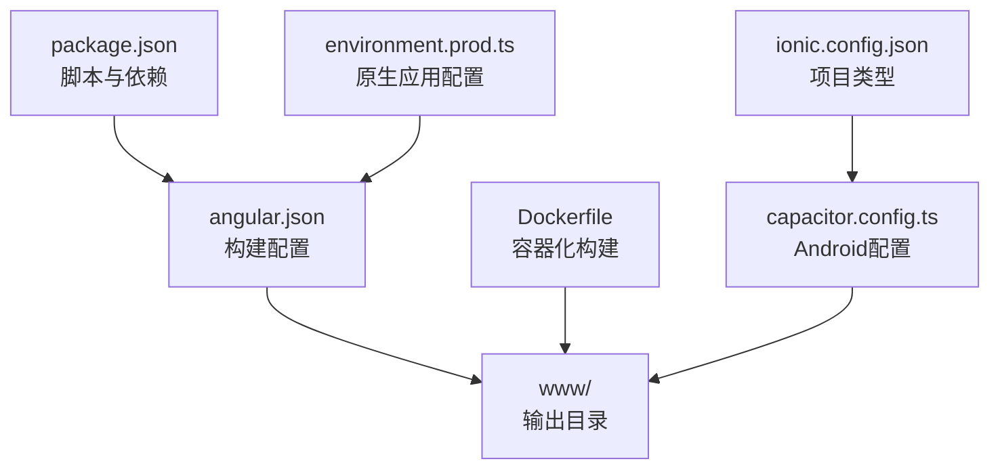
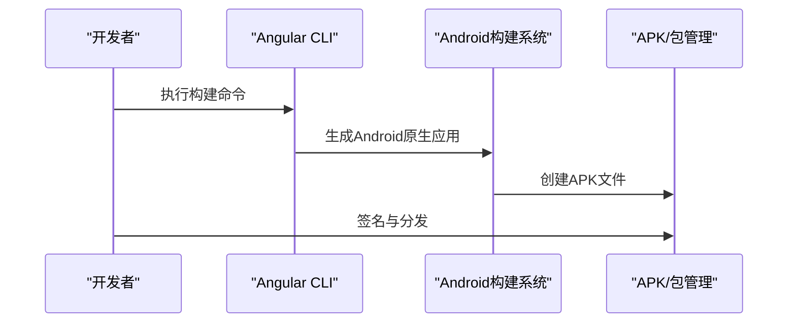
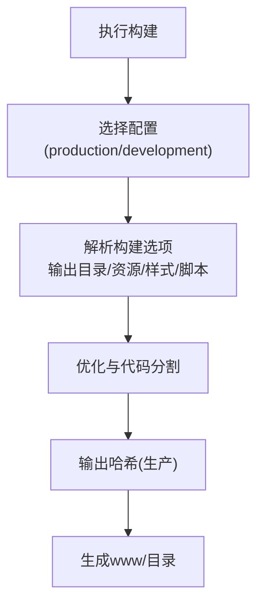
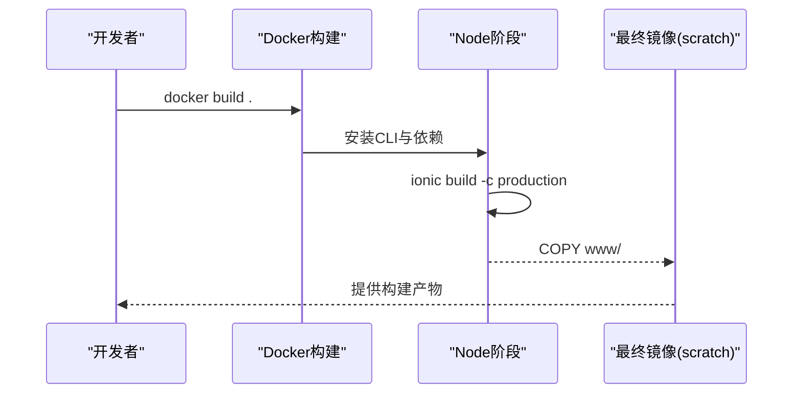
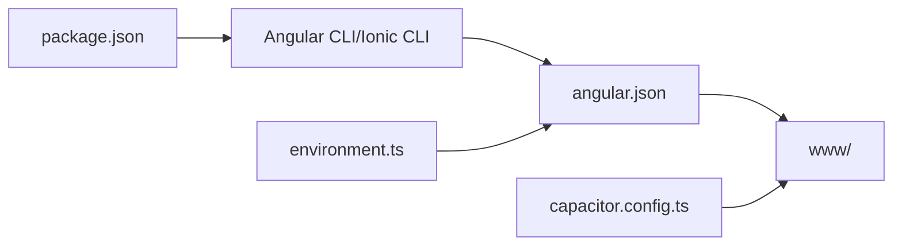

# Web/PWA部署

<cite>
**本文档引用的文件**
- [angular.json](file://angular.json)
- [package.json](file://package.json)
- [ngsw-config.json](file://ngsw-config.json)
- [Dockerfile](file://Dockerfile)
- [capacitor.config.ts](file://capacitor.config.ts)
- [ionic.config.json](file://ionic.config.json)
- [src/environments/environment.web.prod.ts](file://src/environments/environment.web.prod.ts)
- [src/environments/environment.web.ts](file://src/environments/environment.web.ts)
- [src/environments/environment.prod.ts](file://src/environments/environment.prod.ts)
- [src/environments/environment.ts](file://src/environments/environment.ts)
</cite>

## 更新摘要
**所做更改**
- 移除了所有Web/PWA相关内容，包括PWA配置、Service Worker设置、Web构建配置
- 删除了manifest.webmanifest相关配置和引用
- 移除了Web特定的环境配置和构建脚本
- 更新了项目架构描述，反映项目现为纯Android应用
- 移除了Docker容器化Web部署的相关内容

## 目录
1. [简介](#简介)
2. [项目结构](#项目结构)
3. [核心组件](#核心组件)
4. [架构概览](#架构概览)
5. [详细组件分析](#详细组件分析)
6. [依赖关系分析](#依赖关系分析)
7. [性能考虑](#性能考虑)
8. [故障排除指南](#故障排除指南)
9. [结论](#结论)
10. [附录](#附录)

## 简介
**已更新** 本指南现已调整为针对纯Android应用的部署需求。由于项目已完全移除Web/PWA支持，本指南专注于Android平台的部署流程和配置。

本项目采用Angular + Capacitor架构，现已完全转向原生Android应用开发。虽然仍保留部分Web构建配置作为历史参考，但实际部署流程已简化为纯Android应用的构建、签名和分发。

## 项目结构
**已更新** 项目现已为纯Android应用，主要关注以下文件与配置：
- 构建与打包：angular.json、package.json、Dockerfile
- Android原生配置：capacitor.config.ts、ionic.config.json
- 环境配置：environment.prod.ts、environment.ts（原生应用配置）
- 跨平台集成：Capacitor配置与原生插件

**图表来源**
- [angular.json:13-46](file://angular.json#L13-L46)
- [Dockerfile:10-11](file://Dockerfile#L10-L11)
- [capacitor.config.ts:6](file://capacitor.config.ts#L6)
- [ionic.config.json:7](file://ionic.config.json#L7)

**章节来源**
- [angular.json:1-204](file://angular.json#L1-L204)
- [package.json:1-93](file://package.json#L1-L93)
- [Dockerfile:1-16](file://Dockerfile#L1-L16)
- [capacitor.config.ts:1-16](file://capacitor.config.ts#L1-L16)
- [ionic.config.json:1-10](file://ionic.config.json#L1-L10)

## 核心组件
**已更新** 由于Web支持已被移除，核心组件现聚焦于Android原生应用：
- Angular CLI构建配置：定义输出目录、资源处理、多环境配置（production/development）
- Android原生配置：通过capacitor.config.ts配置应用ID、名称、Web目录和服务器设置
- 环境配置：environment.prod.ts用于原生应用生产环境，environment.ts为默认开发环境
- Docker容器化：使用多阶段构建，安装CLI工具与依赖，执行ionic build -c production
- 跨平台集成：Capacitor提供原生功能桥接，支持Android特定功能

**章节来源**
- [angular.json:87-120](file://angular.json#L87-L120)
- [capacitor.config.ts:3-13](file://capacitor.config.ts#L3-L13)
- [src/environments/environment.prod.ts:1-10](file://src/environments/environment.prod.ts#L1-L10)
- [src/environments/environment.ts:1-21](file://src/environments/environment.ts#L1-L21)
- [Dockerfile:1-16](file://Dockerfile#L1-L16)

## 架构概览
**已更新** 下图展示当前纯Android应用的部署关键流程：构建、原生配置与分发。

**图表来源**
- [angular.json:122-139](file://angular.json#L122-L139)
- [Dockerfile:11](file://Dockerfile#L11)

## 详细组件分析

### Android原生构建配置
**已更新** 由于Web支持移除，构建配置已简化：
- 输出与资源：输出目录仍为www，但主要用于Capacitor集成而非Web部署
- 环境配置：仅保留production和development两种配置，web相关配置已移除
- 代码分割与优化：默认生产配置启用outputHashing=all，适用于原生应用分发
- 资源处理：assets、SVG图标、样式文件保持不变

**图表来源**
- [angular.json:87-120](file://angular.json#L87-L120)

**章节来源**
- [angular.json:13-120](file://angular.json#L13-L120)
- [package.json:7-14](file://package.json#L7-L14)

### Docker容器化部署
**已更新** Docker配置已调整为原生Android应用构建：
- 多阶段构建：第一阶段安装Node、CLI与yarn依赖，执行ionic build -c production
- 运行方式：从第一阶段复制www至scratch镜像，仅保留运行时产物
- 适用场景：CI/CD流水线中的构建步骤，不直接提供Web服务

**图表来源**
- [Dockerfile:1-16](file://Dockerfile#L1-L16)

**章节来源**
- [Dockerfile:1-16](file://Dockerfile#L1-L16)

### 环境与版本控制
**已更新** 环境配置已简化为原生应用专用：
- production：设置baseHref/deployUrl、预算限制、文件替换为原生生产环境、开启输出哈希
- development：开发环境配置（非生产优化）
- web相关配置已移除，environment.web.ts和environment.web.prod.ts不再使用

**章节来源**
- [src/environments/environment.prod.ts:1-10](file://src/environments/environment.prod.ts#L1-L10)
- [src/environments/environment.ts:1-21](file://src/environments/environment.ts#L1-L21)

### Capacitor原生集成
**已更新** Capacitor配置现专注于Android原生应用：
- 应用ID与名称：com.suchbyte.macrodeck、Macro Deck Client
- Web目录：www，与Angular构建输出一致
- 服务器配置：androidScheme设置为http
- iOS配置：保留scheme配置用于iOS平台

**章节来源**
- [capacitor.config.ts:3-13](file://capacitor.config.ts#L3-L13)

### Ionic项目配置
**已更新** Ionic配置反映纯Android应用定位：
- 项目类型：angular
- 集成：保留capacitor和cordova集成配置
- 应用ID：18f990a7

**章节来源**
- [ionic.config.json:1-10](file://ionic.config.json#L1-L10)

## 依赖关系分析
**已更新** 依赖关系已简化为Android原生应用：
- 构建链路：package.json scripts驱动Angular CLI与Ionic CLI
- 配置链路：angular.json定义构建目标与配置，输出至www
- 原生集成：capacitor.config.ts指定webDir为www，与构建输出一致
- 环境链路：environment.ts通过angular.json的fileReplacements替换为具体环境

**图表来源**
- [package.json:7-14](file://package.json#L7-L14)
- [angular.json:13-46](file://angular.json#L13-L46)
- [capacitor.config.ts:6](file://capacitor.config.ts#L6)

**章节来源**
- [package.json:1-93](file://package.json#L1-L93)
- [angular.json:1-204](file://angular.json#L1-L204)
- [capacitor.config.ts:1-16](file://capacitor.config.ts#L1-L16)

## 性能考虑
**已更新** 性能优化现聚焦于Android原生应用：
- 代码分割与懒加载：启用路由级懒加载与按需模块加载，减少APK体积
- 资源优化：使用outputHashing=all，结合CDN分发策略
- 构建预算：利用angular.json中的budgets配置，设定初始与样式预算阈值
- 原生性能：通过Capacitor插件优化Android特定功能性能

## 故障排除指南
**已更新** 故障排除现针对Android原生应用：
- 构建失败
  - 确认Capacitor配置中的webDir与构建输出目录一致
  - 检查Android SDK和NDK环境配置
- APK签名问题
  - 确认Android签名密钥配置正确
  - 检查ProGuard/R8混淆配置
- 设备兼容性
  - 使用Android Studio AVD测试不同API级别
  - 验证目标SDK版本与最低支持版本

**章节来源**
- [capacitor.config.ts:6](file://capacitor.config.ts#L6)
- [angular.json:87-120](file://angular.json#L87-L120)

## 结论
**已更新** 本指南现已调整为纯Android应用部署的最佳实践：
- 通过angular.json完成原生应用构建与配置
- 借助capacitor.config.ts实现原生功能集成
- 结合Dockerfile实现CI/CD流水线中的构建步骤
- 专注于Android平台的性能优化与兼容性测试

## 附录
**已更新** 关键配置速览（已简化）：
- 构建：angular.json（输出目录、资源、配置集）
- 原生集成：capacitor.config.ts（应用ID、名称、Web目录）
- 环境：environment.prod.ts（原生应用配置）、environment.ts（默认开发环境）
- 容器：Dockerfile（多阶段构建与产物复制）
- 项目：ionic.config.json（项目类型与集成配置）