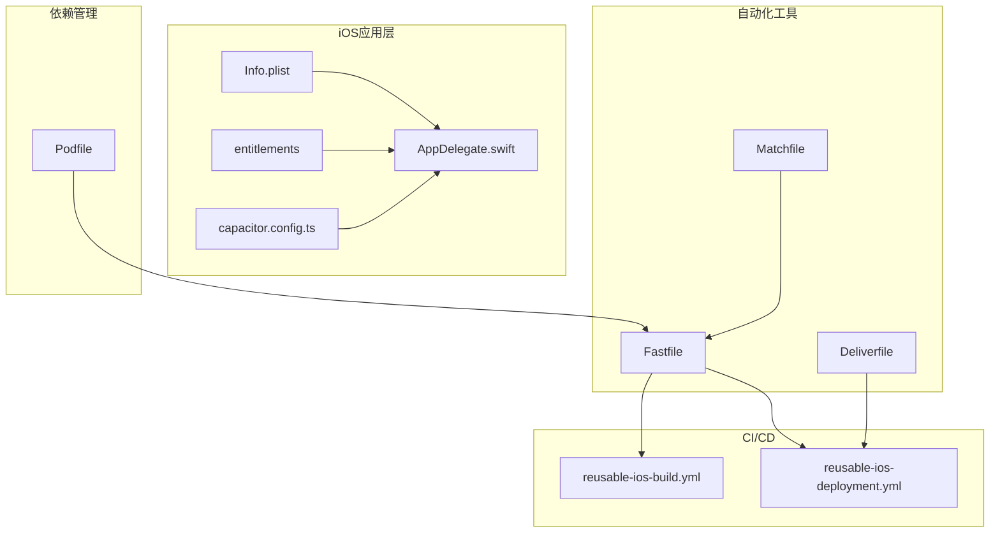
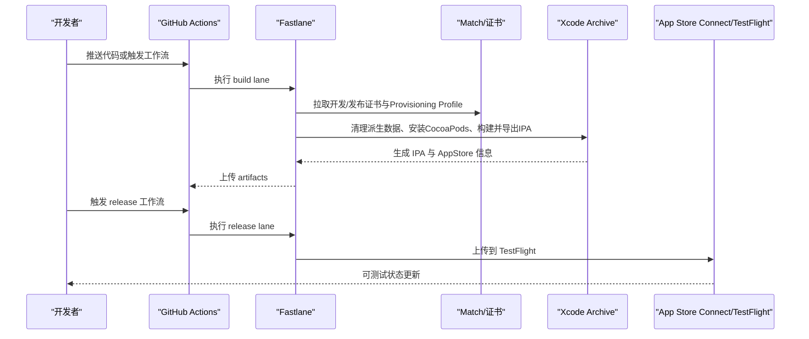
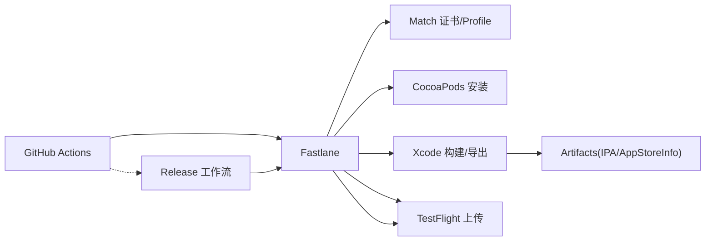

# iOS平台部署

<cite>
**本文档引用的文件**
- [Podfile](file://ios/App/Podfile)
- [Macro Deck Client.entitlements](file://ios/App/Macro Deck Client.entitlements)
- [Fastfile](file://ios/App/fastlane/Fastfile)
- [Deliverfile](file://ios/App/fastlane/Deliverfile)
- [Matchfile](file://ios/App/fastlane/Matchfile)
- [Info.plist](file://ios/App/App/Info.plist)
- [AppDelegate.swift](file://ios/App/App/AppDelegate.swift)
- [capacitor.config.ts](file://capacitor.config.ts)
- [reusable-ios-build.yml](file://.github/workflows/reusable-ios-build.yml)
- [reusable-ios-deployment.yml](file://.github/workflows/reusable-ios-deployment.yml)
- [README.md](file://ios/App/fastlane/README.md)
- [package.json](file://package.json)
</cite>

## 目录
1. [简介](#简介)
2. [项目结构概览](#项目结构概览)
3. [核心组件](#核心组件)
4. [架构总览](#架构总览)
5. [详细组件分析](#详细组件分析)
6. [依赖关系分析](#依赖关系分析)
7. [性能考虑](#性能考虑)
8. [故障排除指南](#故障排除指南)
9. [结论](#结论)

## 简介
本指南面向iOS平台部署，基于仓库中的Capacitor项目配置，系统性说明Xcode工作区配置、CocoaPods依赖管理、entitlements权限配置、签名与证书管理、App Store Connect集成与TestFlight测试流程，以及Archive构建与发布准备步骤。同时提供iOS特有的性能优化建议与审核注意事项，帮助团队在CI/CD环境中稳定地完成iOS应用的构建与分发。

## 项目结构概览
iOS相关配置集中在`ios/App`目录中，采用Capacitor框架，结合Fastlane进行自动化构建与发布，并通过GitHub Actions实现CI流水线。关键文件包括：
- CocoaPods配置：Podfile
- 应用权限清单：Macro Deck Client.entitlements
- 构建与发布脚本：fastlane/Fastfile、fastlane/Deliverfile、fastlane/Matchfile
- 应用元数据：Info.plist、AppDelegate.swift
- Capacitor配置：capacitor.config.ts
- CI工作流：.github/workflows/reusable-ios-build.yml、reusable-ios-deployment.yml

**图表来源**
- [Podfile:1-33](file://ios/App/Podfile#L1-L33)
- [Macro Deck Client.entitlements:1-11](file://ios/App/Macro Deck Client.entitlements#L1-L11)
- [Fastfile:1-68](file://ios/App/fastlane/Fastfile#L1-L68)
- [Deliverfile:1-10](file://ios/App/fastlane/Deliverfile#L1-L10)
- [Matchfile:1-13](file://ios/App/fastlane/Matchfile#L1-L13)
- [Info.plist:1-61](file://ios/App/App/Info.plist#L1-L61)
- [AppDelegate.swift:1-55](file://ios/App/App/AppDelegate.swift#L1-L55)
- [capacitor.config.ts:1-16](file://capacitor.config.ts#L1-L16)
- [reusable-ios-build.yml:1-72](file://.github/workflows/reusable-ios-build.yml#L1-L72)
- [reusable-ios-deployment.yml:1-38](file://.github/workflows/reusable-ios-deployment.yml#L1-L38)

**章节来源**
- [Podfile:1-33](file://ios/App/Podfile#L1-L33)
- [Macro Deck Client.entitlements:1-11](file://ios/App/Macro Deck Client.entitlements#L1-L11)
- [Fastfile:1-68](file://ios/App/fastlane/Fastfile#L1-L68)
- [Deliverfile:1-10](file://ios/App/fastlane/Deliverfile#L1-L10)
- [Matchfile:1-13](file://ios/App/fastlane/Matchfile#L1-L13)
- [Info.plist:1-61](file://ios/App/App/Info.plist#L1-L61)
- [AppDelegate.swift:1-55](file://ios/App/App/AppDelegate.swift#L1-L55)
- [capacitor.config.ts:1-16](file://capacitor.config.ts#L1-L16)
- [reusable-ios-build.yml:1-72](file://.github/workflows/reusable-ios-build.yml#L1-L72)
- [reusable-ios-deployment.yml:1-38](file://.github/workflows/reusable-ios-deployment.yml#L1-L38)

## 核心组件
- CocoaPods依赖管理：集中定义iOS平台版本、Framework模式、安装选项及Capacitor生态插件集合，确保构建一致性与缓存问题规避。
- entitlements权限：配置关联域名（Associated Domains），支持Universal Links等特性。
- Fastlane自动化：提供构建、证书拉取、签名设置、清理派生数据、CocoaPods安装、Archive导出与TestFlight上传的完整流程。
- CI/CD流水线：通过GitHub Actions调用Fastlane，实现可复用的iOS构建与部署作业。
- 应用元数据：Info.plist声明网络策略、启动画面、方向支持、相机使用说明等；AppDelegate处理生命周期与URL/Activity回调。

**章节来源**
- [Podfile:1-33](file://ios/App/Podfile#L1-L33)
- [Macro Deck Client.entitlements:1-11](file://ios/App/Macro Deck Client.entitlements#L1-L11)
- [Fastfile:1-68](file://ios/App/fastlane/Fastfile#L1-L68)
- [reusable-ios-build.yml:1-72](file://.github/workflows/reusable-ios-build.yml#L1-L72)
- [Info.plist:1-61](file://ios/App/App/Info.plist#L1-L61)
- [AppDelegate.swift:1-55](file://ios/App/App/AppDelegate.swift#L1-L55)

## 架构总览
下图展示从CI触发到最终发布的关键路径，包括构建、签名、打包与分发环节。

**图表来源**
- [reusable-ios-build.yml:1-72](file://.github/workflows/reusable-ios-build.yml#L1-L72)
- [reusable-ios-deployment.yml:1-38](file://.github/workflows/reusable-ios-deployment.yml#L1-L38)
- [Fastfile:1-68](file://ios/App/fastlane/Fastfile#L1-L68)
- [Matchfile:1-13](file://ios/App/fastlane/Matchfile#L1-L13)

## 详细组件分析

### Xcode工作区与项目设置
- 平台与Framework模式：Podfile指定iOS平台最低版本与Framework模式，提升兼容性与模块化。
- 安装选项：禁用输入输出路径缓存以避免Xcode缓存导致的构建问题。
- 目标配置：为应用目标添加Capacitor及其生态插件，确保运行时能力一致。
- 后置安装校验：通过post_install钩子检查部署目标，保证编译参数正确。

最佳实践
- 在本地与CI保持相同的Xcode命令行工具版本。
- 使用统一的Podfile.lock以锁定第三方依赖版本。
- 避免手动修改Xcode项目文件，优先通过Capacitor CLI与配置文件管理。

**章节来源**
- [Podfile:1-33](file://ios/App/Podfile#L1-L33)

### CocoaPods依赖管理
- 插件覆盖范围：包含Capacitor核心、设备、键盘、屏幕方向、条码扫描、唤醒锁、SSL处理器等。
- 版本策略：通过Capacitor生态插件路径引入，确保与Capacitor CLI版本匹配。
- 安装优化：禁用输入输出路径缓存，减少Xcode缓存引发的问题。

建议
- 在升级Capacitor或插件前，先在本地验证构建与运行。
- 使用`pod repo update`与`pod install --repo-update`保持仓库同步。

**章节来源**
- [Podfile:11-23](file://ios/App/Podfile#L11-L23)
- [package.json:16-58](file://package.json#L16-L58)

### entitlements权限配置
当前entitlements仅启用关联域名（Associated Domains），用于支持Universal Links。若需扩展推送通知、后台刷新等功能，应在entitlements中新增相应键值，并在Xcode中对应Target的Signing & Capabilities中勾选对应功能。

注意
- Associated Domains需要在Apple Developer Portal与Provisioning Profile中正确配置。
- 新增entitlements后需重新生成或更新Provisioning Profile。

**章节来源**
- [Macro Deck Client.entitlements:1-11](file://ios/App/Macro Deck Client.entitlements#L1-L11)

### iOS签名与证书管理
- 证书与Profile管理：通过Fastlane Match从Git仓库拉取证书与Profile，支持开发与App Store两种类型。
- API密钥：Fastlane App Store Connect API Key通过环境变量注入，无需交互式登录。
- 自动签名：Fastlane自动设置代码签名，清理派生数据，确保一致性。

操作要点
- 确保SSH密钥与已知主机配置正确，以便Match访问私有仓库。
- 在CI中设置APPSTORE_KEY_ID、APPSTORE_KEY_ISSUER_ID、APPSTORE_KEY_CONTENT与MATCH_PASSWORD等敏感变量。

**章节来源**
- [Fastfile:37-56](file://ios/App/fastlane/Fastfile#L37-L56)
- [Matchfile:1-13](file://ios/App/fastlane/Matchfile#L1-L13)

### App Store Connect集成与TestFlight测试流程
- 构建与导出：build lane执行版本号与构建号增量、清理派生数据、安装CocoaPods、构建并导出IPA，同时生成App Store信息。
- 测试分发：release lane直接上传至TestFlight，支持跳过等待处理与变更日志设置。
- 应用标识：Deliverfile中配置了应用Bundle Identifier，确保上传目标正确。

**章节来源**
- [Fastfile:3-35](file://ios/App/fastlane/Fastfile#L3-L35)
- [Fastfile:58-67](file://ios/App/fastlane/Fastfile#L58-L67)
- [Deliverfile:1-10](file://ios/App/fastlane/Deliverfile#L1-L10)

### Xcode Archive构建与发布准备
- 构建参数：通过Fastlane的build_app导出IPA并生成App Store信息，便于后续上传。
- 资产管理：Artifacts目录包含导出的IPA与App Store信息文件，供CI上传与归档。
- 版本控制：CI中动态计算BUILD_NUMBER，配合Fastlane增量版本号与构建号。

**章节来源**
- [Fastfile:26-34](file://ios/App/fastlane/Fastfile#L26-L34)
- [reusable-ios-build.yml:54-70](file://.github/workflows/reusable-ios-build.yml#L54-L70)

### 应用元数据与生命周期
- Info.plist关键项：包含网络策略（允许任意加载）、全屏显示、状态栏隐藏、相机使用说明、方向支持、应用名称与版本等。
- AppDelegate：处理应用生命周期事件与URL/Activity回调，集成屏幕方向插件以支持多方向。

**章节来源**
- [Info.plist:1-61](file://ios/App/App/Info.plist#L1-L61)
- [AppDelegate.swift:1-55](file://ios/App/App/AppDelegate.swift#L1-L55)
- [capacitor.config.ts:1-16](file://capacitor.config.ts#L1-L16)

## 依赖关系分析
下图展示iOS构建链路中各组件的依赖关系与调用顺序。

**图表来源**
- [reusable-ios-build.yml:1-72](file://.github/workflows/reusable-ios-build.yml#L1-L72)
- [reusable-ios-deployment.yml:1-38](file://.github/workflows/reusable-ios-deployment.yml#L1-L38)
- [Fastfile:1-68](file://ios/App/fastlane/Fastfile#L1-L68)
- [Matchfile:1-13](file://ios/App/fastlane/Matchfile#L1-L13)

**章节来源**
- [reusable-ios-build.yml:1-72](file://.github/workflows/reusable-ios-build.yml#L1-L72)
- [reusable-ios-deployment.yml:1-38](file://.github/workflows/reusable-ios-deployment.yml#L1-L38)
- [Fastfile:1-68](file://ios/App/fastlane/Fastfile#L1-L68)

## 性能考虑
- 构建性能
  - 使用禁用输入输出路径缓存的CocoaPods安装方式，减少Xcode缓存问题对构建的影响。
  - 在CI中预热CocoaPods缓存与Ruby环境，缩短首次安装时间。
- 运行时性能
  - 合理使用屏幕方向与唤醒锁插件，避免不必要的资源消耗。
  - 限制后台任务与网络请求，遵循iOS后台执行限制。
- 包体大小
  - 定期审查第三方库，移除未使用的插件与资源。
  - 使用App Store的“App Thinning”特性，确保按需分发。

[本节为通用指导，不直接分析具体文件]

## 故障排除指南
常见问题与解决思路
- 证书/Provisioning Profile错误
  - 确认Match仓库地址、存储模式与用户名配置正确。
  - 检查SSH密钥与known_hosts配置，确保CI可访问私有仓库。
  - 在本地使用fastlane match进行调试，确认证书链完整。
- 构建失败
  - 清理派生数据与Pods目录，重新安装依赖。
  - 核对Xcode命令行工具版本与iOS平台版本要求。
- 导出IPA失败
  - 确认Fastlane导出选项与签名设置一致。
  - 检查App Store Connect API Key配置与权限。
- TestFlight上传失败
  - 确认应用标识与Bundle ID一致。
  - 检查变更日志与二进制文件完整性。

**章节来源**
- [Matchfile:1-13](file://ios/App/fastlane/Matchfile#L1-L13)
- [Fastfile:37-56](file://ios/App/fastlane/Fastfile#L37-L56)
- [README.md:1-47](file://ios/App/fastlane/README.md#L1-L47)

## 结论
本指南基于仓库现有配置，提供了iOS平台部署的端到端方案：从Xcode工作区与CocoaPods依赖管理，到entitlements权限、签名与证书、App Store Connect集成与TestFlight分发，再到CI/CD流水线与构建导出。建议在实际落地时根据业务需求扩展entitlements与Capabilities，并持续优化构建与分发流程，确保高质量交付。