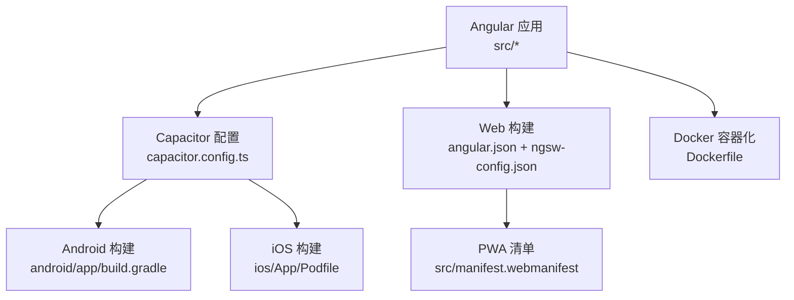
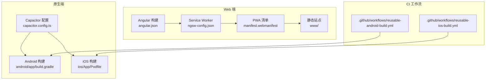
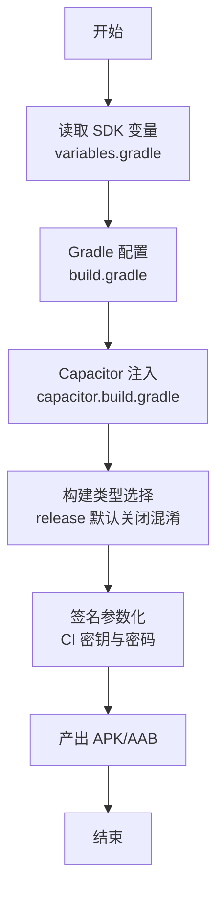
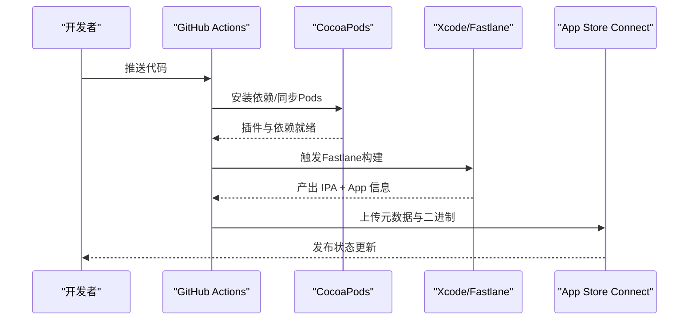
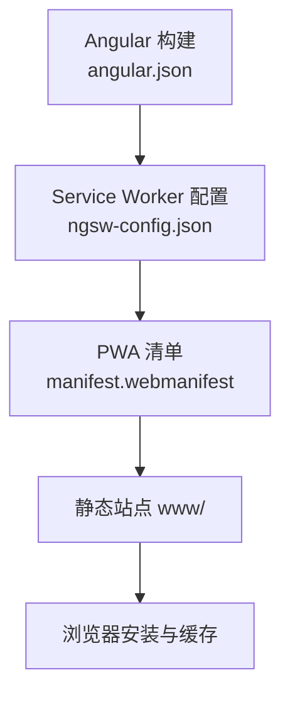
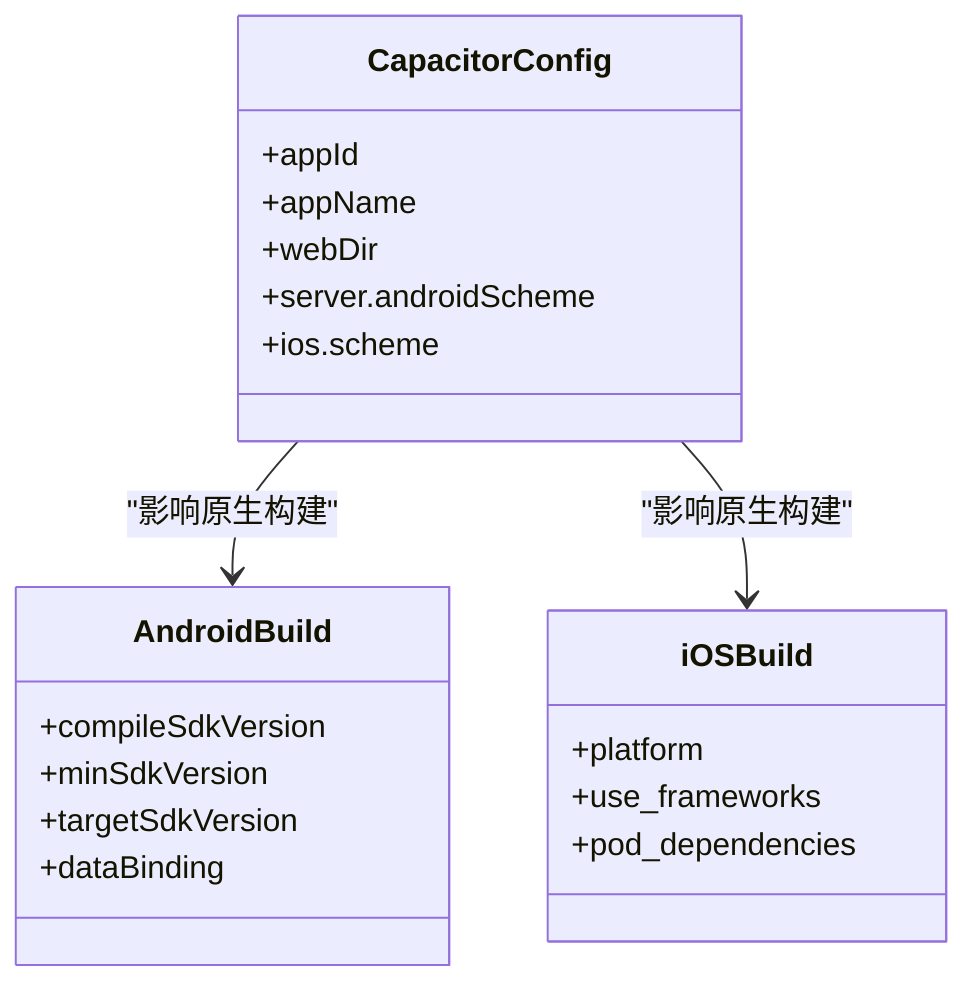
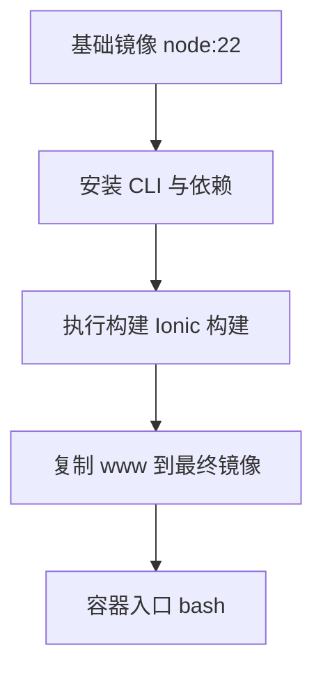
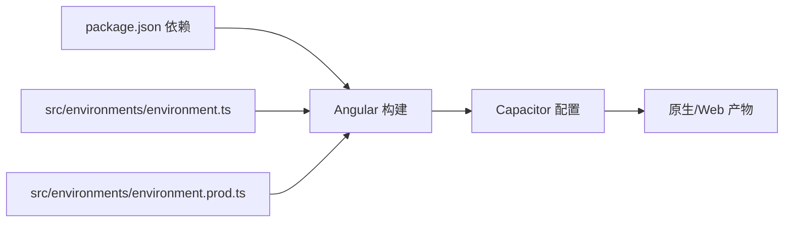

# 平台部署

<cite>
**本文引用的文件**
- [android\app\build.gradle](file://android/app/build.gradle)
- [android\variables.gradle](file://android/variables.gradle)
- [android\app\proguard-rules.pro](file://android/app/proguard-rules.pro)
- [android\app\capacitor.build.gradle](file://android/app/capacitor.build.gradle)
- [resources\android\xml\network_security_config.xml](file://resources/android/xml/network_security_config.xml)
- [.github\workflows\reusable-android-build.yml](file://.github/workflows/reusable-android-build.yml)
- [.github\workflows\reusable-ios-build.yml](file://.github/workflows/reusable-ios-build.yml)
- [ios\App\Podfile](file://ios/App/Podfile)
- [capacitor.config.ts](file://capacitor.config.ts)
- [package.json](file://package.json)
- [angular.json](file://angular.json)
- [src\manifest.webmanifest](file://src/manifest.webmanifest)
- [ngsw-config.json](file://ngsw-config.json)
- [Dockerfile](file://Dockerfile)
- [src\environments\environment.ts](file://src/environments/environment.ts)
- [src\environments\environment.prod.ts](file://src/environments/environment.prod.ts)
</cite>

## 目录
1. [简介](#简介)
2. [项目结构](#项目结构)
3. [核心组件](#核心组件)
4. [架构总览](#架构总览)
5. [详细组件分析](#详细组件分析)
6. [依赖关系分析](#依赖关系分析)
7. [性能考虑](#性能考虑)
8. [故障排查指南](#故障排查指南)
9. [结论](#结论)
10. [附录](#附录)

## 简介
本指南面向Macro-Deck-Client-App的多平台部署，覆盖Android APK构建、iOS IPA构建、Web PWA部署、Capacitor配置影响、Docker容器化以及各平台性能优化与发布注意事项。内容基于仓库中的实际配置文件与CI工作流，帮助开发者在不同平台上稳定交付高质量应用。

## 项目结构
该工程采用Angular + Capacitor多端统一架构：共享Web前端代码通过Capacitor桥接到原生平台能力；Android与iOS分别有各自的构建脚本与CI工作流；Web端以PWA形式发布，使用Service Worker进行离线缓存。

图表来源
- [capacitor.config.ts:1-16](file://capacitor.config.ts#L1-L16)
- [angular.json:1-203](file://angular.json#L1-L203)
- [src/manifest.webmanifest:1-48](file://src/manifest.webmanifest#L1-L48)
- [Dockerfile:1-16](file://Dockerfile#L1-L16)

章节来源
- [capacitor.config.ts:1-16](file://capacitor.config.ts#L1-L16)
- [angular.json:1-203](file://angular.json#L1-L203)
- [src/manifest.webmanifest:1-48](file://src/manifest.webmanifest#L1-L48)
- [Dockerfile:1-16](file://Dockerfile#L1-L16)

## 核心组件
- Capacitor配置：定义应用ID、名称、Web目录、服务器协议与平台特定scheme，决定原生与Web层交互方式。
- Angular构建配置：定义Web与原生两种构建目标，含Service Worker、资源打包、替换环境变量等。
- 平台构建脚本：Android使用Gradle与Fastlane，iOS使用CocoaPods与Fastlane，均通过GitHub Actions实现可复用构建。
- PWA清单与Service Worker：提供安装体验、图标集与缓存策略，确保Web端离线可用性。
- Dockerfile：在容器中完成依赖安装与构建，输出静态站点用于部署。

章节来源
- [capacitor.config.ts:1-16](file://capacitor.config.ts#L1-L16)
- [angular.json:1-203](file://angular.json#L1-L203)
- [src/manifest.webmanifest:1-48](file://src/manifest.webmanifest#L1-L48)
- [ngsw-config.json:1-31](file://ngsw-config.json#L1-L31)
- [Dockerfile:1-16](file://Dockerfile#L1-L16)

## 架构总览
下图展示从源码到各平台产物的关键路径：Web端经Angular构建生成www目录并启用Service Worker；Android/iOS端由Capacitor桥接原生能力并通过各自CI工作流产出APK/AAB/IPA。

图表来源
- [angular.json:1-203](file://angular.json#L1-L203)
- [ngsw-config.json:1-31](file://ngsw-config.json#L1-L31)
- [src/manifest.webmanifest:1-48](file://src/manifest.webmanifest#L1-L48)
- [capacitor.config.ts:1-16](file://capacitor.config.ts#L1-L16)
- [android/app/build.gradle:1-61](file://android/app/build.gradle#L1-L61)
- [ios/App/Podfile:1-33](file://ios/App/Podfile#L1-L33)
- [.github/workflows/reusable-android-build.yml:1-82](file://.github/workflows/reusable-android-build.yml#L1-L82)
- [.github/workflows/reusable-ios-build.yml:1-72](file://.github/workflows/reusable-ios-build.yml#L1-L72)

## 详细组件分析

### Android 平台：APK/AAB 构建与发布
- Gradle 配置要点
  - SDK版本与最小SDK在变量文件中集中管理，便于升级与一致性控制。
  - 构建类型默认关闭代码压缩与混淆，适合调试与稳定性优先场景。
  - 启用数据绑定，支持现代UI开发。
  - 通过Capacitor生成的构建脚本注入插件依赖，确保原生能力可用。
- 代码混淆与签名
  - 当前未启用混淆；如需增强安全性可在release构建中开启混淆并维护规则文件。
  - CI工作流通过密钥与凭据参数化构建，避免硬编码在仓库中。
- 网络安全
  - Android网络配置允许本地明文流量，满足开发阶段需求；生产建议收紧策略。
- CI 工作流
  - 使用Fastlane执行构建，产出APK与AAB；上传Artifacts供后续分发或发布。

图表来源
- [android/app/build.gradle:1-61](file://android/app/build.gradle#L1-L61)
- [android/variables.gradle:1-17](file://android/variables.gradle#L1-L17)
- [android/app/capacitor.build.gradle:1-27](file://android/app/capacitor.build.gradle#L1-L27)
- [.github/workflows/reusable-android-build.yml:1-82](file://.github/workflows/reusable-android-build.yml#L1-L82)

章节来源
- [android/app/build.gradle:1-61](file://android/app/build.gradle#L1-L61)
- [android/variables.gradle:1-17](file://android/variables.gradle#L1-L17)
- [android/app/proguard-rules.pro:1-22](file://android/app/proguard-rules.pro#L1-L22)
- [android/app/capacitor.build.gradle:1-27](file://android/app/capacitor.build.gradle#L1-L27)
- [resources/android/xml/network_security_config.xml:1-7](file://resources/android/xml/network_security_config.xml#L1-L7)
- [.github/workflows/reusable-android-build.yml:1-82](file://.github/workflows/reusable-android-build.yml#L1-L82)

### iOS 平台：IPA 构建与发布
- CocoaPods 与 Capacitor 插件
  - Podfile声明Capacitor核心与常用插件，确保屏幕方向、键盘、Haptics等能力可用。
  - 通过post_install校验最低部署目标，避免Xcode缓存导致的构建问题。
- CI 工作流
  - 使用Fastlane构建，集成App Store Connect密钥参数，产出IPA与App信息文件。
  - 通过SSH密钥与匹配密码管理证书与描述文件，自动化签名与分发准备。
- 平台配置
  - Capacitor iOS scheme与应用scheme在配置中定义，影响URL Scheme与Deep Link行为。

图表来源
- [ios/App/Podfile:1-33](file://ios/App/Podfile#L1-L33)
- [.github/workflows/reusable-ios-build.yml:1-72](file://.github/workflows/reusable-ios-build.yml#L1-L72)
- [capacitor.config.ts:1-16](file://capacitor.config.ts#L1-L16)

章节来源
- [ios/App/Podfile:1-33](file://ios/App/Podfile#L1-L33)
- [.github/workflows/reusable-ios-build.yml:1-72](file://.github/workflows/reusable-ios-build.yml#L1-L72)
- [capacitor.config.ts:1-16](file://capacitor.config.ts#L1-L16)

### Web 平台：PWA 部署
- 构建与资源
  - Angular构建输出至www目录，启用Service Worker与ngsw配置。
  - 资源包含HTML、CSS、JS、图标与manifest，按prefetch/lazy策略缓存。
- PWA 清单
  - 提供主题色、背景色、显示模式、起始页与多尺寸图标，适配桌面与移动端安装。
- HTTPS 要求
  - Service Worker仅在HTTPS环境下可注册；生产部署需启用TLS。
- 缓存策略
  - 预取关键资源，延迟加载静态资产；结合版本哈希与更新机制保证一致性。

图表来源
- [angular.json:1-203](file://angular.json#L1-L203)
- [ngsw-config.json:1-31](file://ngsw-config.json#L1-L31)
- [src/manifest.webmanifest:1-48](file://src/manifest.webmanifest#L1-L48)

章节来源
- [angular.json:1-203](file://angular.json#L1-L203)
- [ngsw-config.json:1-31](file://ngsw-config.json#L1-L31)
- [src/manifest.webmanifest:1-48](file://src/manifest.webmanifest#L1-L48)

### Capacitor 配置对各平台的影响
- 应用标识与名称
  - 统一的应用ID与名称确保跨平台一致的品牌识别。
- Web目录与服务器
  - webDir指向www，Capacitor在原生侧加载静态资源；服务器配置影响WebView访问策略。
- 平台scheme
  - Android与iOS分别定义scheme，影响自定义URL处理与Deep Link集成。
- 插件生态
  - Capacitor与Cordova插件通过Gradle/Pods注入，直接影响功能可用性与构建时间。

图表来源
- [capacitor.config.ts:1-16](file://capacitor.config.ts#L1-L16)
- [android/app/build.gradle:1-61](file://android/app/build.gradle#L1-L61)
- [ios/App/Podfile:1-33](file://ios/App/Podfile#L1-L33)

章节来源
- [capacitor.config.ts:1-16](file://capacitor.config.ts#L1-L16)
- [android/app/build.gradle:1-61](file://android/app/build.gradle#L1-L61)
- [ios/App/Podfile:1-33](file://ios/App/Podfile#L1-L33)

### Docker 容器化部署
- 多阶段构建
  - 第一阶段安装CLI与依赖后执行Ionic构建，输出www静态资源。
  - 最终镜像基于scratch，仅拷贝www作为运行时根文件系统，减小体积与攻击面。
- 运行时入口
  - 容器以bash作为入口，便于交互式调试；生产可替换为轻量HTTP服务容器。

图表来源
- [Dockerfile:1-16](file://Dockerfile#L1-L16)

章节来源
- [Dockerfile:1-16](file://Dockerfile#L1-L16)

## 依赖关系分析
- Angular与Capacitor
  - package.json声明Angular与Capacitor核心及平台插件，确保Web与原生能力一致。
- 构建链路
  - angular.json定义构建目标与Service Worker配置；Capacitor配置决定原生桥接；CI工作流驱动平台构建。
- 环境隔离
  - 环境文件区分开发/生产/Web，配合angular.json的fileReplacements实现按需替换。

图表来源
- [package.json:1-92](file://package.json#L1-L92)
- [angular.json:1-203](file://angular.json#L1-L203)
- [src/environments/environment.ts:1-36](file://src/environments/environment.ts#L1-L36)
- [src/environments/environment.prod.ts:1-15](file://src/environments/environment.prod.ts#L1-L15)

章节来源
- [package.json:1-92](file://package.json#L1-L92)
- [angular.json:1-203](file://angular.json#L1-L203)
- [src/environments/environment.ts:1-36](file://src/environments/environment.ts#L1-L36)
- [src/environments/environment.prod.ts:1-15](file://src/environments/environment.prod.ts#L1-L15)

## 性能考虑
- Web端
  - 启用输出哈希与预算限制，控制初始包体大小；prefetch/lazy策略平衡首屏速度与带宽占用。
  - Service Worker与PWA清单提升离线可用性与安装体验。
- Android
  - 关闭release混淆以减少构建与调试成本；如需进一步优化可开启混淆并维护规则。
  - 数据绑定已启用，保持UI响应性与开发效率。
- iOS
  - 通过CocoaPods精简依赖树，避免不必要的框架引入；关注最低部署目标与兼容性。
- 容器化
  - 使用scratch镜像裁剪运行时；若需要HTTP服务，建议使用轻量级反向代理镜像承载www目录。

## 故障排查指南
- Android
  - 签名失败：检查CI中密钥Base64解码、密码与别名是否正确；确认keystore路径与权限。
  - 网络访问异常：核对网络配置是否允许明文流量，生产环境建议收紧策略。
- iOS
  - 证书/描述文件问题：确认Match SSH私钥与密码、App Store Connect密钥参数完整。
  - 构建缓存：清理Xcode构建缓存并重新安装Pods。
- Web/PWA
  - Service Worker未注册：确认部署在HTTPS；检查ngsw配置与manifest路径。
  - 缓存不更新：验证版本哈希与更新策略；必要时强制刷新或清除浏览器缓存。
- 容器化
  - 构建失败：确认CLI安装顺序与yarn安装成功；检查构建命令与输出目录。
  - 运行异常：以bash进入容器检查www目录是否存在与权限是否正确。

章节来源
- [.github/workflows/reusable-android-build.yml:1-82](file://.github/workflows/reusable-android-build.yml#L1-L82)
- [resources/android/xml/network_security_config.xml:1-7](file://resources/android/xml/network_security_config.xml#L1-L7)
- [.github/workflows/reusable-ios-build.yml:1-72](file://.github/workflows/reusable-ios-build.yml#L1-L72)
- [ngsw-config.json:1-31](file://ngsw-config.json#L1-L31)
- [Dockerfile:1-16](file://Dockerfile#L1-L16)

## 结论
本指南基于仓库现有配置，给出了Android、iOS与Web三端的部署路径与最佳实践。通过Capacitor统一Web与原生能力，结合CI工作流与容器化，可实现高效稳定的多平台交付。建议在生产环境中完善安全策略（HTTPS、混淆）、证书与密钥管理，并持续监控各平台的性能与用户体验。

## 附录
- 关键配置速查
  - Capacitor：应用ID、名称、webDir、服务器scheme
  - Android：SDK版本、构建类型、数据绑定、混淆开关
  - iOS：平台版本、CocoaPods依赖、Fastlane参数
  - Web：构建目标、Service Worker、PWA清单、缓存策略
  - Docker：多阶段构建、运行时镜像、入口命令