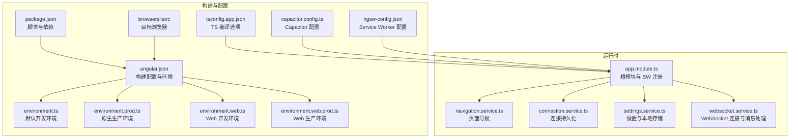
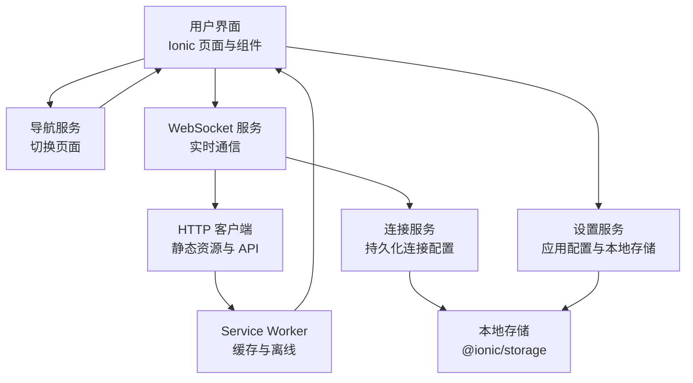
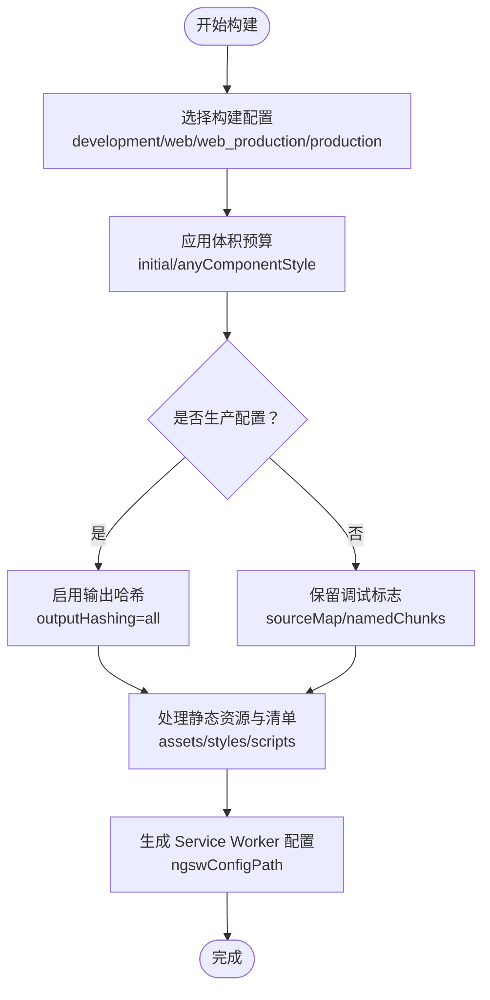
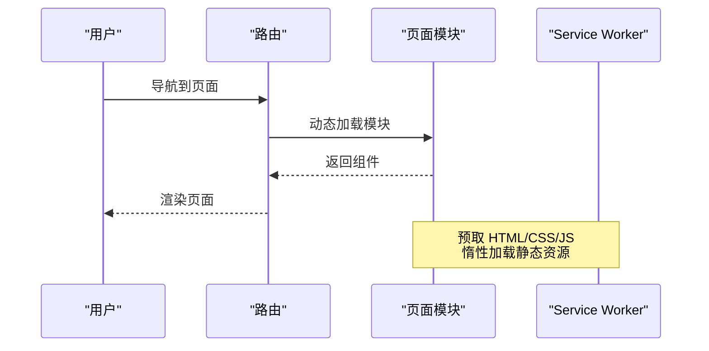
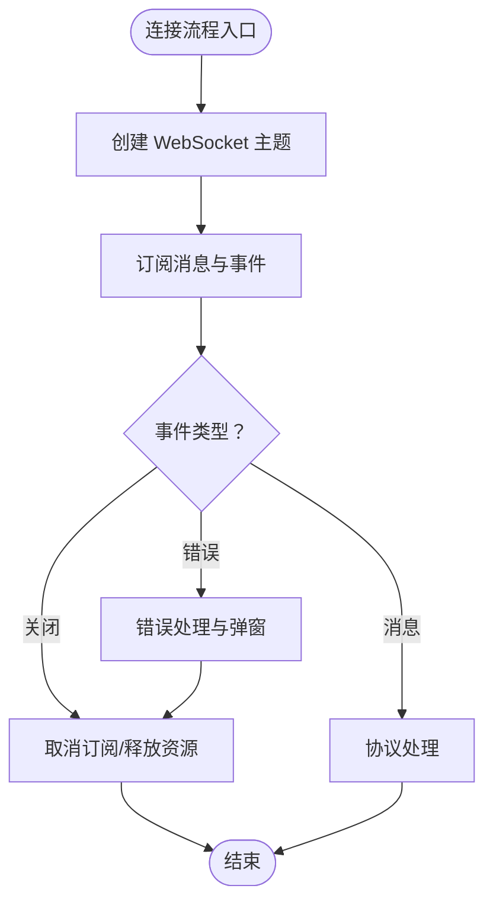
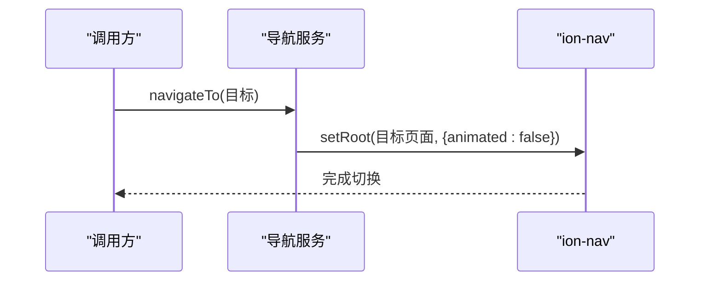
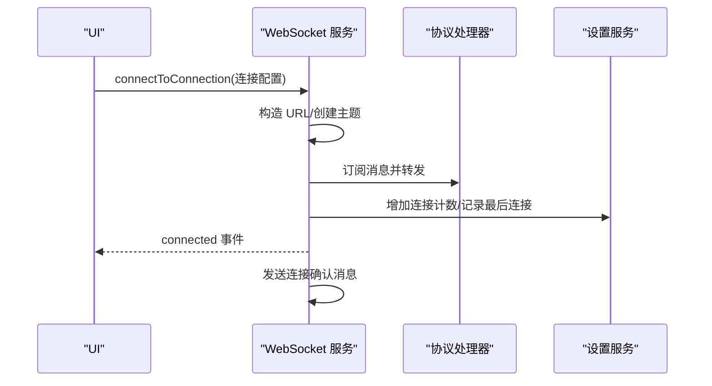
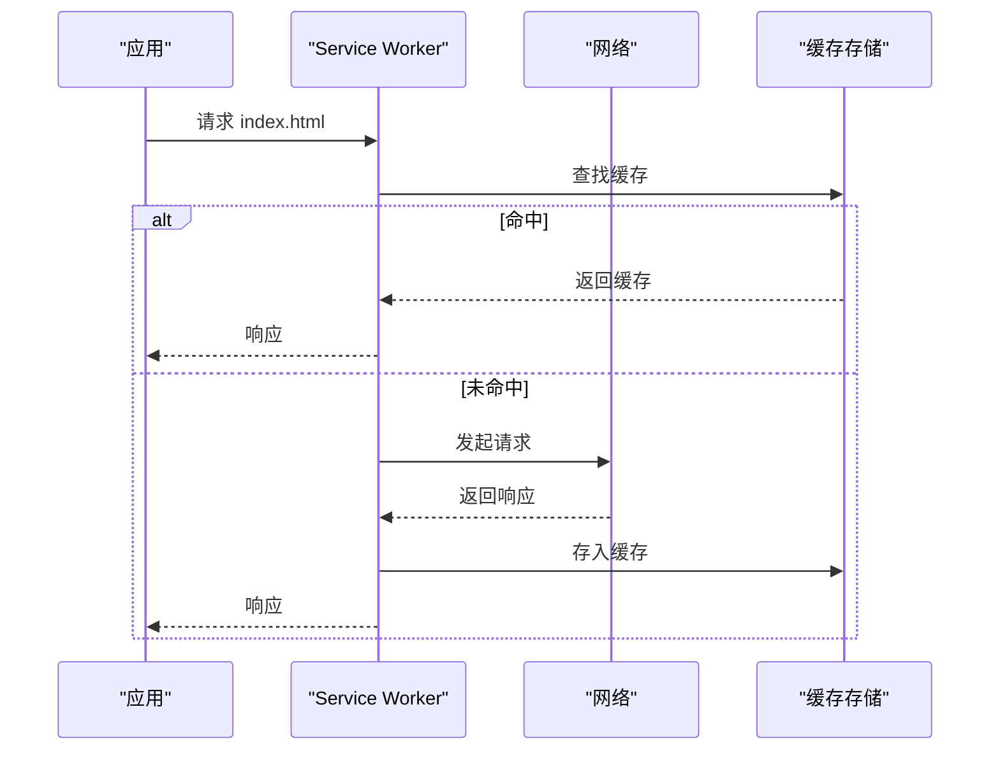
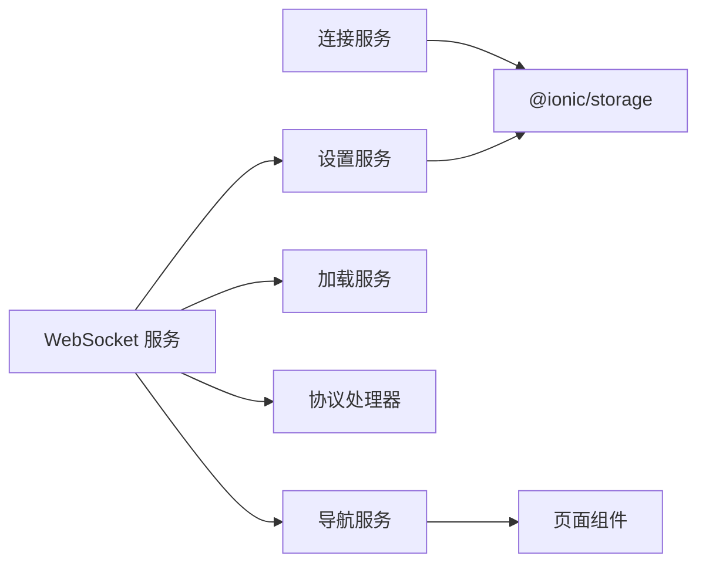

# 性能优化

<cite>
**本文引用的文件**
- [package.json](file://package.json)
- [angular.json](file://angular.json)
- [capacitor.config.ts](file://capacitor.config.ts)
- [ngsw-config.json](file://ngsw-config.json)
- [environment.ts](file://src/environments/environment.ts)
- [environment.prod.ts](file://src/environments/environment.prod.ts)
- [environment.web.prod.ts](file://src/environments/environment.web.prod.ts)
- [environment.web.ts](file://src/environments/environment.web.ts)
- [tsconfig.app.json](file://tsconfig.app.json)
-.browserslistrc](file://.browserslistrc)
- [app.module.ts](file://src/app/app.module.ts)
- [connection.service.ts](file://src/app/services/connection/connection.service.ts)
- [websocket.service.ts](file://src/app/services/websocket/websocket.service.ts)
- [navigation.service.ts](file://src/app/services/navigation/navigation.service.ts)
- [settings.service.ts](file://src/app/services/settings/settings.service.ts)
</cite>

## 目录
1. [简介](#简介)
2. [项目结构](#项目结构)
3. [核心组件](#核心组件)
4. [架构总览](#架构总览)
5. [详细组件分析](#详细组件分析)
6. [依赖分析](#依赖分析)
7. [性能考虑](#性能考虑)
8. [故障排查指南](#故障排查指南)
9. [结论](#结论)
10. [附录](#附录)

## 简介
本指南聚焦于 Macro-Deck-Client-App 的性能优化，覆盖构建期与运行时两大维度。构建期重点包括：Webpack/Browser 构建配置、代码分割与懒加载策略、产物体积预算与输出哈希；运行时重点包括：内存管理、渲染优化、网络请求优化、Service Worker 缓存与离线能力、资源与图片优化、性能监控与分析、用户体验优化与关键指标监控。

## 项目结构
该应用采用 Angular + Ionic + Capacitor 技术栈，结合 Service Worker 提供 PWA 能力，并通过多环境配置区分 Web 与原生生产/开发场景。关键结构与职责如下：
- 构建与打包：Angular CLI 构建器负责编译、优化与产物生成，支持多配置（development/web/web_production/production/ci）。
- 运行时框架：Angular 根模块整合 Ionic、HTTP、Service Worker 注册、页面模块与组件。
- 网络层：WebSocket 服务负责实时连接、消息分发与错误处理。
- 数据与设置：设置服务与连接服务负责本地持久化与配置读写。
- 离线与缓存：Angular Service Worker 配置定义预取与惰性加载资源组。

**图表来源**
- [package.json:1-92](file://package.json#L1-L92)
- [angular.json:1-203](file://angular.json#L1-L203)
- [environment.ts:1-36](file://src/environments/environment.ts#L1-L36)
- [environment.prod.ts:1-15](file://src/environments/environment.prod.ts#L1-L15)
- [environment.web.prod.ts:1-15](file://src/environments/environment.web.prod.ts#L1-L15)
- [environment.web.ts:1-15](file://src/environments/environment.web.ts#L1-L15)
- [tsconfig.app.json:1-16](file://tsconfig.app.json#L1-L16)
-.browserslistrc:1-17](file://.browserslistrc#L1-L17)
- [capacitor.config.ts:1-16](file://capacitor.config.ts#L1-L16)
- [ngsw-config.json:1-31](file://ngsw-config.json#L1-L31)
- [app.module.ts:1-87](file://src/app/app.module.ts#L1-L87)
- [navigation.service.ts:1-86](file://src/app/services/navigation/navigation.service.ts#L1-L86)
- [connection.service.ts:1-179](file://src/app/services/connection/connection.service.ts#L1-L179)
- [settings.service.ts:1-389](file://src/app/services/settings/settings.service.ts#L1-L389)
- [websocket.service.ts:1-402](file://src/app/services/websocket/websocket.service.ts#L1-L402)

**章节来源**
- [package.json:1-92](file://package.json#L1-L92)
- [angular.json:1-203](file://angular.json#L1-L203)
- [app.module.ts:1-87](file://src/app/app.module.ts#L1-L87)

## 核心组件
- 构建与环境配置：通过 angular.json 的多配置实现开发/生产/Web/原生差异化构建；配合 environment.* 文件实现运行时行为差异。
- Service Worker：在根模块中按环境注册，采用“稳定后注册”策略降低首屏阻塞。
- WebSocket 服务：集中管理连接生命周期、消息订阅与错误处理，避免重复订阅与泄漏。
- 导航与页面：统一通过导航服务切换页面，减少不必要的动画与重渲染。
- 设置与连接：设置服务与连接服务使用异步存储，避免主线程阻塞。

**章节来源**
- [app.module.ts:31-35](file://src/app/app.module.ts#L31-L35)
- [websocket.service.ts:101-134](file://src/app/services/websocket/websocket.service.ts#L101-L134)
- [navigation.service.ts:29-46](file://src/app/services/navigation/navigation.service.ts#L29-L46)
- [settings.service.ts:229-246](file://src/app/services/settings/settings.service.ts#L229-L246)
- [connection.service.ts:40-58](file://src/app/services/connection/connection.service.ts#L40-L58)

## 架构总览
应用整体采用“配置驱动 + 服务化”的架构，构建期通过 Angular CLI 与 Service Worker 配置实现离线与缓存，运行时通过服务层解耦网络、存储与界面逻辑。

**图表来源**
- [app.module.ts:19-42](file://src/app/app.module.ts#L19-L42)
- [websocket.service.ts:16-57](file://src/app/services/websocket/websocket.service.ts#L16-L57)
- [connection.service.ts:10-16](file://src/app/services/connection/connection.service.ts#L10-L16)
- [settings.service.ts:22-30](file://src/app/services/settings/settings.service.ts#L22-L30)
- [ngsw-config.json:1-31](file://ngsw-config.json#L1-L31)

## 详细组件分析

### 构建与打包优化
- 多配置与体积预算
  - development：禁用优化、开启 source map、命名块，便于调试。
  - web/web_production：针对 Web 环境设置 baseHref 与 deployUrl，启用输出哈希与初始体积预算。
  - production：启用输出哈希与体积预算，适配原生应用。
- 输出哈希与缓存友好
  - 启用 outputHashing: "all"，确保静态资源指纹化，利于浏览器与 Service Worker 缓存。
- 资源与清单
  - assets 包含 SVG、manifest.webmanifest，样式引入 Material Design Icons 与 Bootstrap。
- 目标浏览器
  - browserslist 指定 Chrome/Firefox/Safari/iOS 等现代浏览器，缩小 polyfill 与转译范围。

**图表来源**
- [angular.json:47-120](file://angular.json#L47-L120)
- [angular.json:19-44](file://angular.json#L19-L44)
- [.browserslistrc:11-17](file://.browserslistrc#L11-L17)

**章节来源**
- [angular.json:47-120](file://angular.json#L47-L120)
- [angular.json:19-44](file://angular.json#L19-L44)
- [.browserslistrc:11-17](file://.browserslistrc#L11-L17)

### 代码分割与懒加载
- 页面模块懒加载
  - 根模块导入多个页面模块，结合路由配置可实现按需加载；建议将大体量页面模块拆分为独立 chunk。
- Service Worker 预取与惰性加载
  - assetGroups 定义了 HTML/CSS/JS 与静态资源两类缓存组，前者预取、后者惰性加载，提升首屏与后续访问速度。

**图表来源**
- [app.module.ts:26-30](file://src/app/app.module.ts#L26-L30)
- [ngsw-config.json:4-29](file://ngsw-config.json#L4-L29)

**章节来源**
- [app.module.ts:26-30](file://src/app/app.module.ts#L26-L30)
- [ngsw-config.json:4-29](file://ngsw-config.json#L4-L29)

### 运行时性能优化

#### 内存管理
- WebSocket 订阅管理
  - 连接关闭与错误处理中统一取消订阅，避免内存泄漏。
  - 主动关闭时调用 complete 并释放订阅。
- 异步存储
  - 设置与连接服务均使用异步存储接口，避免阻塞主线程。

**图表来源**
- [websocket.service.ts:101-134](file://src/app/services/websocket/websocket.service.ts#L101-L134)
- [websocket.service.ts:332-360](file://src/app/services/websocket/websocket.service.ts#L332-L360)

**章节来源**
- [websocket.service.ts:101-134](file://src/app/services/websocket/websocket.service.ts#L101-L134)
- [websocket.service.ts:332-360](file://src/app/services/websocket/websocket.service.ts#L332-L360)

#### 渲染优化
- 导航策略
  - 导航服务使用 setRoot 并禁用动画，减少过渡开销。
- 页面模块组织
  - 将页面拆分为模块，按需加载，避免一次性初始化过多组件。

**图表来源**
- [navigation.service.ts:29-46](file://src/app/services/navigation/navigation.service.ts#L29-L46)

**章节来源**
- [navigation.service.ts:29-46](file://src/app/services/navigation/navigation.service.ts#L29-L46)

#### 网络请求优化
- 连接策略
  - 根据配置动态拼接 ws/wss 地址，优先使用稳定连接。
- 错误处理
  - 对安全错误弹窗提示，避免无意义重试。
- 连接确认
  - 成功连接后发送客户端 ID 与令牌，减少握手成本。

**图表来源**
- [websocket.service.ts:275-288](file://src/app/services/websocket/websocket.service.ts#L275-L288)
- [websocket.service.ts:349-360](file://src/app/services/websocket/websocket.service.ts#L349-L360)
- [settings.service.ts:219-222](file://src/app/services/settings/settings.service.ts#L219-L222)

**章节来源**
- [websocket.service.ts:275-288](file://src/app/services/websocket/websocket.service.ts#L275-L288)
- [websocket.service.ts:349-360](file://src/app/services/websocket/websocket.service.ts#L349-L360)
- [settings.service.ts:219-222](file://src/app/services/settings/settings.service.ts#L219-L222)

### Service Worker 缓存策略与离线功能
- 缓存组
  - “Macro Deck Client”：预取 index.html、CSS、JS、manifest，保证核心资源即时可用。
  - “assets”：惰性加载静态资源，降低首次缓存压力。
- 注册时机
  - 在非开发模式下注册，采用“稳定后或 30 秒”策略，避免阻塞首屏。
- 离线体验
  - 结合预取与清单，Web 版本具备基础离线能力；原生应用通过 Capacitor 与 Service Worker 协同提供离线缓存。

**图表来源**
- [ngsw-config.json:4-29](file://ngsw-config.json#L4-L29)
- [app.module.ts:31-35](file://src/app/app.module.ts#L31-L35)

**章节来源**
- [ngsw-config.json:4-29](file://ngsw-config.json#L4-L29)
- [app.module.ts:31-35](file://src/app/app.module.ts#L31-L35)

### 资源压缩与图片优化
- 构建期压缩
  - 生产配置启用输出哈希，结合 CDN 可进一步利用长期缓存。
- 图片与图标
  - 使用 SVG 与现代图片格式（webp/avif），减少体积与带宽占用。
- 样式与字体
  - Material Design Icons 与 Bootstrap 已内联，建议按需裁剪或使用子集化方案。

**章节来源**
- [angular.json:35-43](file://angular.json#L35-L43)
- [ngsw-config.json:23-27](file://ngsw-config.json#L23-L27)

### 性能监控与分析
- 构建期指标
  - 利用 budgets 监控初始包与样式体积，防止回归。
- 运行时指标
  - 建议集成性能 API（如 PerformanceObserver、Navigation Timing）与日志上报，记录首屏、交互延迟、内存峰值等。
- 用户体验指标
  - 关键指标：FCP/LCP/CLS/INP 等，结合业务埋点（连接耗时、页面切换耗时、消息到达延迟）。

**章节来源**
- [angular.json:51-62](file://angular.json#L51-L62)
- [angular.json:88-99](file://angular.json#L88-L99)

## 依赖分析
- 组件耦合
  - WebSocket 服务依赖设置服务、协议处理器、导航服务与加载服务，存在较强运行时耦合，建议通过事件总线或中间层解耦。
- 外部依赖
  - @angular/service-worker、@ionic/storage、rxjs 等为关键运行时依赖，需关注版本兼容与体积。
- 环境差异
  - environment.webVersion 控制页面类型与行为，确保跨平台一致性。

**图表来源**
- [websocket.service.ts:51-57](file://src/app/services/websocket/websocket.service.ts#L51-L57)
- [connection.service.ts:10-16](file://src/app/services/connection/connection.service.ts#L10-L16)
- [settings.service.ts:22-30](file://src/app/services/settings/settings.service.ts#L22-L30)
- [navigation.service.ts:15-21](file://src/app/services/navigation/navigation.service.ts#L15-L21)

**章节来源**
- [websocket.service.ts:51-57](file://src/app/services/websocket/websocket.service.ts#L51-L57)
- [connection.service.ts:10-16](file://src/app/services/connection/connection.service.ts#L10-L16)
- [settings.service.ts:22-30](file://src/app/services/settings/settings.service.ts#L22-L30)
- [navigation.service.ts:15-21](file://src/app/services/navigation/navigation.service.ts#L15-L21)

## 性能考虑
- 构建期
  - 启用 outputHashing 与体积预算，合理拆分 vendor chunk，避免单体 bundle。
  - 针对 Web 与原生分别配置 baseHref/deployUrl，减少路径解析开销。
- 运行时
  - 使用异步存储与惰性加载，避免阻塞主线程。
  - WebSocket 订阅统一管理，及时清理，防止内存泄漏。
  - 导航禁用动画，减少过渡渲染成本。
- 离线与缓存
  - 合理划分预取与惰性加载资源组，平衡首屏与缓存压力。
- 资源与图片
  - 优先使用现代格式与矢量图标，按需裁剪样式与字体。

[本节为通用指导，不直接分析具体文件]

## 故障排查指南
- 连接失败
  - 检查安全错误分支，确认是否弹出不安全连接提示；必要时调整 SSL 配置。
  - 若非主动关闭且关闭码非 1000，检查连接丢失或失败事件的触发路径。
- 加载卡顿
  - 确认是否存在未取消的订阅或重复订阅；检查导航动画是否被禁用。
- 缓存问题
  - 清理浏览器缓存或更新 Service Worker；核对 ngsw-config 的资源匹配规则。

**章节来源**
- [websocket.service.ts:120-133](file://src/app/services/websocket/websocket.service.ts#L120-L133)
- [websocket.service.ts:374-393](file://src/app/services/websocket/websocket.service.ts#L374-L393)
- [navigation.service.ts:29-46](file://src/app/services/navigation/navigation.service.ts#L29-L46)
- [ngsw-config.json:4-29](file://ngsw-config.json#L4-L29)

## 结论
通过合理的构建配置、代码分割与懒加载、运行时内存与渲染优化、以及完善的 Service Worker 缓存策略，Macro-Deck-Client-App 可在多平台环境下获得稳定的性能表现。建议持续关注体积预算与关键用户体验指标，结合实际业务场景迭代优化。

[本节为总结，不直接分析具体文件]

## 附录
- 环境变量与版本控制
  - environment.ts 提供默认开发配置；environment.web.ts 与 environment.web.prod.ts 分别对应 Web 开发与生产；environment.prod.ts 对应原生生产。
- TypeScript 与浏览器支持
  - tsconfig.app.json 限定编译入口；.browserslistrc 指定目标浏览器，有助于缩小打包范围。

**章节来源**
- [environment.ts:1-36](file://src/environments/environment.ts#L1-L36)
- [environment.web.ts:1-15](file://src/environments/environment.web.ts#L1-L15)
- [environment.web.prod.ts:1-15](file://src/environments/environment.web.prod.ts#L1-L15)
- [environment.prod.ts:1-15](file://src/environments/environment.prod.ts#L1-L15)
- [tsconfig.app.json:1-16](file://tsconfig.app.json#L1-L16)
-.browserslistrc:11-17](file://.browserslistrc#L11-L17)