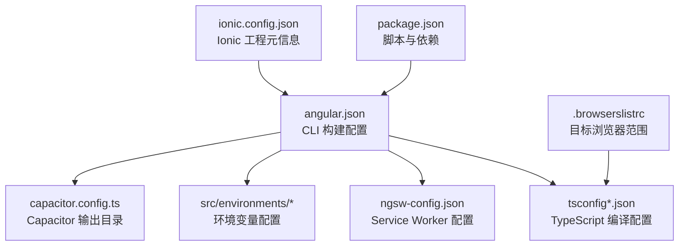
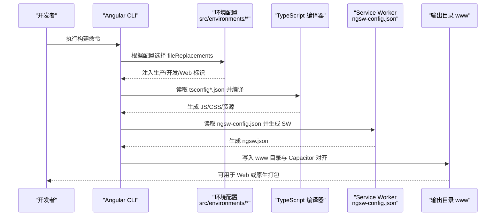
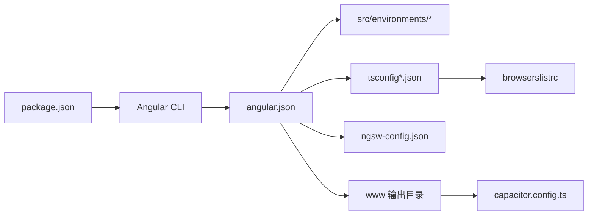

# 构建配置

<cite>
**本文引用的文件**
- [angular.json](file://angular.json)
- [package.json](file://package.json)
- [tsconfig.json](file://tsconfig.json)
- [tsconfig.app.json](file://tsconfig.app.json)
- [ngsw-config.json](file://ngsw-config.json)
- [src/environments/environment.ts](file://src/environments/environment.ts)
- [src/environments/environment.prod.ts](file://src/environments/environment.prod.ts)
- [src/environments/environment.web.ts](file://src/environments/environment.web.ts)
- [src/environments/environment.web.prod.ts](file://src/environments/environment.web.prod.ts)
- [.browserslistrc](file://.browserslistrc)
- [capacitor.config.ts](file://capacitor.config.ts)
- [ionic.config.json](file://ionic.config.json)
</cite>

## 目录
1. [简介](#简介)
2. [项目结构](#项目结构)
3. [核心组件](#核心组件)
4. [架构总览](#架构总览)
5. [详细组件分析](#详细组件分析)
6. [依赖关系分析](#依赖关系分析)
7. [性能考虑](#性能考虑)
8. [故障排查指南](#故障排查指南)
9. [结论](#结论)
10. [附录](#附录)

## 简介
本文件系统性梳理 Macro-Deck-Client-App 的构建配置，覆盖 Angular CLI 配置、TypeScript 编译配置、环境变量、Service Worker 配置与构建优化策略，并结合实际源码进行可视化说明，帮助开发者快速理解与高效维护构建流程。

## 项目结构
该工程采用 Angular + Capacitor + Ionic 的混合架构：
- 使用 Angular CLI 进行浏览器端与原生打包
- 使用 Capacitor 将 Web 资源桥接到原生平台
- 使用 Ionic 提供 UI 组件与主题样式
- 通过 Service Worker 实现 PWA 缓存策略

图表来源
- [angular.json:1-203](file://angular.json#L1-L203)
- [tsconfig.json:1-34](file://tsconfig.json#L1-L34)
- [tsconfig.app.json:1-16](file://tsconfig.app.json#L1-L16)
- [ngsw-config.json:1-31](file://ngsw-config.json#L1-L31)
- [capacitor.config.ts:1-16](file://capacitor.config.ts#L1-L16)
- [package.json:1-92](file://package.json#L1-L92)
- [.browserslistrc:1-17](file://.browserslistrc#L1-L17)
- [ionic.config.json:1-10](file://ionic.config.json#L1-L10)

章节来源
- [angular.json:1-203](file://angular.json#L1-L203)
- [package.json:1-92](file://package.json#L1-L92)
- [capacitor.config.ts:1-16](file://capacitor.config.ts#L1-L16)
- [ionic.config.json:1-10](file://ionic.config.json#L1-L10)

## 核心组件
- Angular CLI 构建目标与配置：定义构建目标、输出目录、资源处理、样式与脚本注入、Service Worker 启用与配置路径等。
- TypeScript 编译配置：基础编译选项、严格模式、模块解析策略、目标语言级别与库支持等。
- 环境变量配置：区分开发/生产与原生/Web 版本，通过 fileReplacements 动态替换。
- Service Worker 配置：定义缓存组、预取与懒加载策略、更新模式与资源匹配规则。
- 浏览器兼容性：通过 browserslist 指定目标浏览器集合，影响转译与 polyfill。
- Capacitor 输出目录：与构建输出目录保持一致，确保原生应用正确加载静态资源。

章节来源
- [angular.json:13-121](file://angular.json#L13-L121)
- [tsconfig.json:4-32](file://tsconfig.json#L4-L32)
- [tsconfig.app.json:3-15](file://tsconfig.app.json#L3-L15)
- [ngsw-config.json:1-31](file://ngsw-config.json#L1-L31)
- [.browserslistrc:11-17](file://.browserslistrc#L11-L17)
- [capacitor.config.ts:6](file://capacitor.config.ts#L6)

## 架构总览
下图展示从 CLI 到最终产物的关键路径与决策点，包括环境替换、Service Worker 生成与输出目录对齐。

图表来源
- [angular.json:13-121](file://angular.json#L13-L121)
- [src/environments/environment.ts:1-36](file://src/environments/environment.ts#L1-L36)
- [src/environments/environment.prod.ts:1-15](file://src/environments/environment.prod.ts#L1-L15)
- [src/environments/environment.web.ts:1-15](file://src/environments/environment.web.ts#L1-L15)
- [src/environments/environment.web.prod.ts:1-15](file://src/environments/environment.web.prod.ts#L1-L15)
- [ngsw-config.json:1-31](file://ngsw-config.json#L1-L31)
- [capacitor.config.ts:6](file://capacitor.config.ts#L6)

## 详细组件分析

### Angular CLI 构建配置（angular.json）
- 构建目标与输出
  - 输出目录：www（与 Capacitor 配置一致）
  - 入口：index.html、main.ts、polyfills.ts
  - TypeScript 配置：tsconfig.app.json
  - 样式与脚本：SCSS 主题、全局样式、第三方样式与脚本
  - 资源处理：assets 目录、Ionicons SVG、Web Manifest
  - Service Worker：启用并指定配置文件路径
- 配置集
  - web_production：设置 baseHref/deployUrl、预算限制、文件替换为 Web 生产环境、开启输出哈希
  - web：同 web_production，但关闭构建优化与 SourceMap，便于调试
  - production：预算限制、文件替换为原生生产环境、开启输出哈希
  - development：关闭构建优化与 SourceMap，保留命名块与许可证提取开关
  - ci：禁用进度条
- 服务端开发（serve）
  - 支持多配置映射到对应构建目标
- 测试与 Lint
  - 测试使用 Karma，配置与构建类似但更精简
  - Lint 使用 @angular-eslint/builder，检查 TS 与 HTML

章节来源
- [angular.json:13-121](file://angular.json#L13-L121)
- [angular.json:122-185](file://angular.json#L122-L185)

### TypeScript 编译配置（tsconfig*.json）
- 基础配置（tsconfig.json）
  - 严格模式：开启多项严格检查
  - 目标与模块：ES2022 与 ES2020
  - 模块解析：Node 解析策略
  - 库支持：ES2018 + DOM
  - SourceMap：开启
- 应用配置（tsconfig.app.json）
  - 继承基础配置
  - 显式声明入口文件 main.ts 与 polyfills.ts
  - 类型声明包含 src/**/*.d.ts

章节来源
- [tsconfig.json:4-32](file://tsconfig.json#L4-L32)
- [tsconfig.app.json:3-15](file://tsconfig.app.json#L3-L15)

### 环境变量配置（src/environments）
- 默认开发环境：production=false，webVersion=false，version="3.0.0"
- 原生生产环境：production=true，webVersion=false
- Web 开发环境：production=false，webVersion=true
- Web 生产环境：production=true，webVersion=true
- 文件替换机制：通过 angular.json 的 fileReplacements 将 src/environments/environment.ts 替换为上述任一文件，实现按环境注入

章节来源
- [src/environments/environment.ts:1-36](file://src/environments/environment.ts#L1-L36)
- [src/environments/environment.prod.ts:1-15](file://src/environments/environment.prod.ts#L1-L15)
- [src/environments/environment.web.ts:1-15](file://src/environments/environment.web.ts#L1-L15)
- [src/environments/environment.web.prod.ts:1-15](file://src/environments/environment.web.prod.ts#L1-L15)
- [angular.json:63-68](file://angular.json#L63-L68)
- [angular.json:100-105](file://angular.json#L100-L105)

### Service Worker 配置（ngsw-config.json）
- 缓存组
  - 应用组：预取首页、清单与所有 JS/CSS
  - 资源组：懒加载 assets 与多种媒体格式
- 更新策略
  - 应用组：prefetch 安装模式
  - 资源组：lazy 安装 + prefetch 更新模式
- 资源匹配
  - 通配符匹配与扩展名过滤，确保静态资源被缓存与更新

章节来源
- [ngsw-config.json:1-31](file://ngsw-config.json#L1-L31)

### 浏览器兼容性（.browserslistrc）
- 目标浏览器：Chrome/ChromeAndroid/Firefox/Edge/Safari/iOS
- 影响：决定 polyfill 与转译策略，配合 TypeScript lib 与 Angular 支持矩阵

章节来源
- [.browserslistrc:11-17](file://.browserslistrc#L11-L17)

### Capacitor 输出目录（capacitor.config.ts）
- webDir: "www"，与 Angular 构建输出目录一致，保证原生应用加载静态资源

章节来源
- [capacitor.config.ts:6](file://capacitor.config.ts#L6)

### Ionic 工程元信息（ionic.config.json）
- 工程类型：angular
- 集成：Capacitor 与 Cordova
- 用途：工具链识别与默认行为

章节来源
- [ionic.config.json:1-10](file://ionic.config.json#L1-L10)

## 依赖关系分析
- CLI 与配置
  - angular.json 决定构建目标、资源、Service Worker 与配置集
  - package.json 的 scripts 与 devDependencies 提供 CLI 与构建工具链
- 编译链路
  - tsconfig*.json 为 TypeScript 编译提供严格与目标设定
  - .browserslistrc 影响 polyfill 与转译范围
- 运行时集成
  - Capacitor 读取 www 目录作为 Web 资源根目录
  - Service Worker 由 ngsw-config.json 驱动生成

图表来源
- [package.json:1-92](file://package.json#L1-L92)
- [angular.json:13-121](file://angular.json#L13-L121)
- [tsconfig.json:1-34](file://tsconfig.json#L1-L34)
- [.browserslistrc:1-17](file://.browserslistrc#L1-L17)
- [ngsw-config.json:1-31](file://ngsw-config.json#L1-L31)
- [capacitor.config.ts:6](file://capacitor.config.ts#L6)

章节来源
- [package.json:1-92](file://package.json#L1-L92)
- [angular.json:13-121](file://angular.json#L13-L121)

## 性能考虑
- 输出哈希与缓存
  - production/web_production 配置开启 outputHashing，提升缓存命中率与版本控制能力
- 体积预算
  - initial 与 anyComponentStyle 预算限制，避免包体过大导致加载缓慢或样式膨胀
- 构建优化开关
  - development 关闭构建优化与 SourceMap，便于调试；生产环境开启优化与哈希
- Service Worker 缓存策略
  - 应用组预取，资源组懒加载+预取更新，平衡首屏速度与后续资源可用性
- 浏览器兼容性
  - 通过 browserslistrc 控制 polyfill 与转译范围，减少不必要的运行时开销

章节来源
- [angular.json:47-118](file://angular.json#L47-L118)
- [ngsw-config.json:4-29](file://ngsw-config.json#L4-L29)
- [.browserslistrc:11-17](file://.browserslistrc#L11-L17)

## 故障排查指南
- 构建后原生应用无法加载资源
  - 检查 Capacitor 配置的 webDir 是否指向 www
  - 确认 angular.json 的 outputPath 与 Capacitor 的 webDir 一致
- Service Worker 缓存未生效
  - 检查 ngsw-config.json 的资源匹配是否覆盖所需文件
  - 确认构建时启用了 serviceWorker 并指定了 ngswConfigPath
- 环境变量未按预期替换
  - 确认 angular.json 的 fileReplacements 正确映射到目标环境文件
  - 检查环境文件中的标识字段（如 production、webVersion）是否符合业务逻辑
- 包体超限或样式体积异常
  - 查看 budgets 配置，定位初始包或组件样式阈值
  - 分析第三方库引入情况，必要时拆分或按需加载
- 调试困难或构建过慢
  - development 配置适合调试；生产配置适合发布
  - 如需更快迭代，可在本地使用 development 配置并禁用 SourceMap 以外的优化

章节来源
- [capacitor.config.ts:6](file://capacitor.config.ts#L6)
- [angular.json:16](file://angular.json#L16)
- [angular.json:44-45](file://angular.json#L44-L45)
- [angular.json:63-68](file://angular.json#L63-L68)
- [angular.json:100-105](file://angular.json#L100-L105)
- [angular.json:47-118](file://angular.json#L47-L118)

## 结论
本项目通过 Angular CLI、TypeScript、Service Worker 与 Capacitor 的协同，实现了跨平台的构建与部署能力。合理利用配置集、预算限制与缓存策略，可以在保证开发体验的同时，获得高效的生产构建结果。建议在团队协作中统一构建脚本与配置，持续监控包体与缓存命中率，以维持良好的用户体验。

## 附录
- 常用构建命令
  - 开发启动：使用 package.json 中的 start 脚本，对应 development 配置
  - 构建：使用 build 脚本，对应 development 配置
  - 测试：使用 test 脚本，基于 Karma 与 Jasmine
  - Lint：使用 lint 脚本，基于 ESLint 与 Angular 规则
- 关键配置要点速览
  - 输出目录：www（与 Capacitor 对齐）
  - 环境替换：通过 fileReplacements 动态切换
  - Service Worker：启用并配置缓存组与更新策略
  - 预算与哈希：生产配置开启输出哈希与体积预算
  - 浏览器兼容：通过 browserslistrc 限定目标

章节来源
- [package.json:7-14](file://package.json#L7-L14)
- [angular.json:13-121](file://angular.json#L13-L121)
- [ngsw-config.json:1-31](file://ngsw-config.json#L1-L31)
- [.browserslistrc:11-17](file://.browserslistrc#L11-L17)