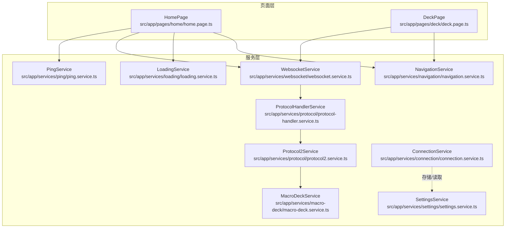
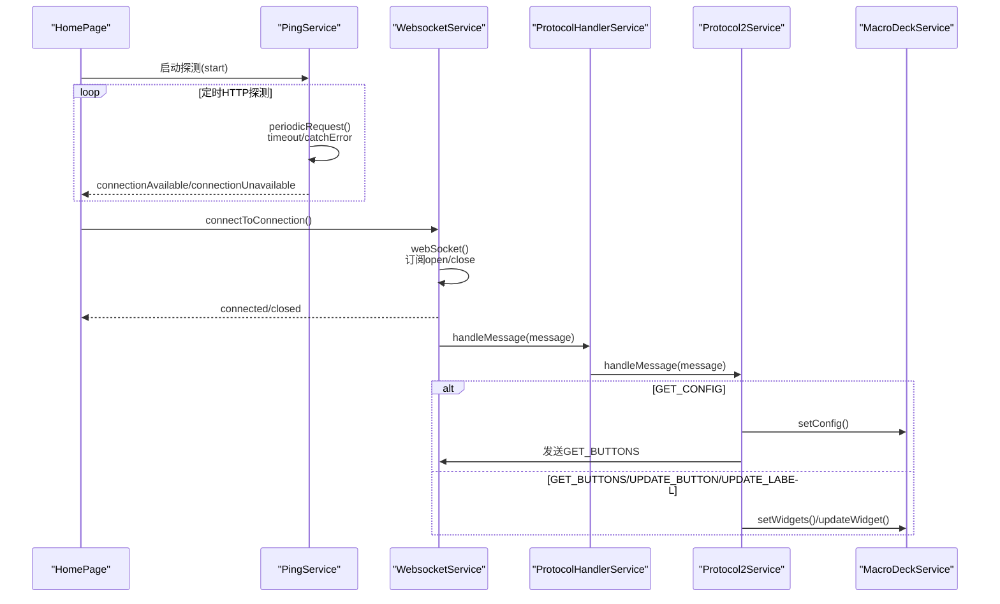
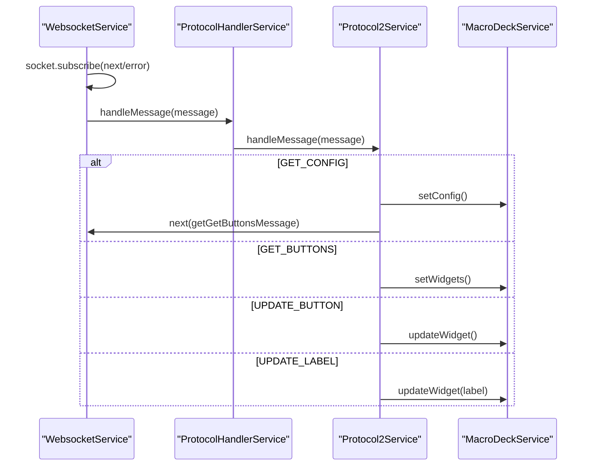
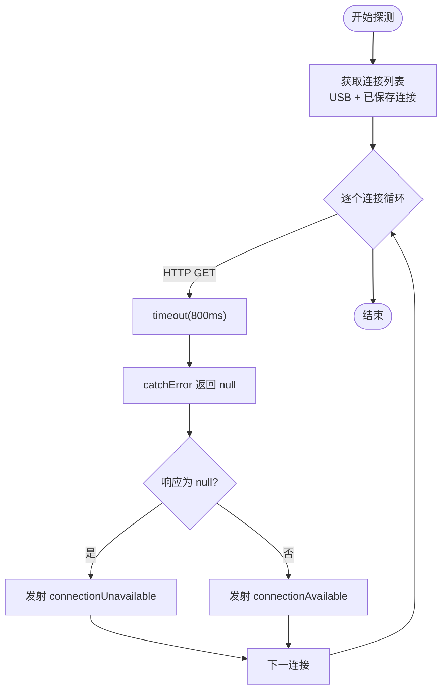
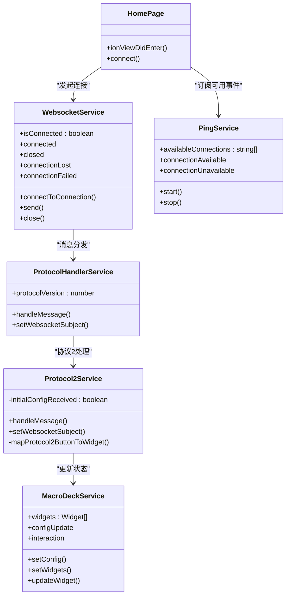
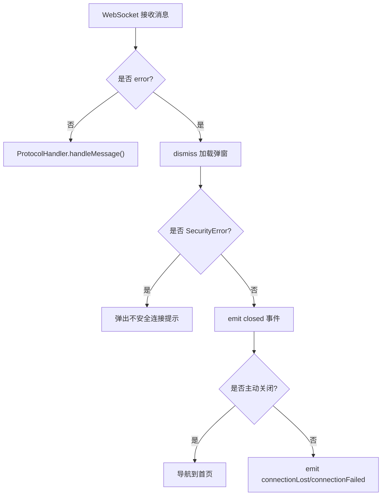
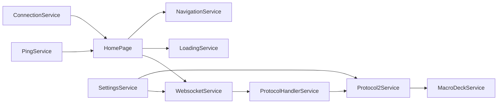

# 响应式数据流

<cite>
**本文引用的文件**   
- [src/app/services/websocket/websocket.service.ts](file://src/app/services/websocket/websocket.service.ts)
- [src/app/services/protocol/protocol-handler.service.ts](file://src/app/services/protocol/protocol-handler.service.ts)
- [src/app/services/protocol/protocol2.service.ts](file://src/app/services/protocol/protocol2.service.ts)
- [src/app/services/macro-deck/macro-deck.service.ts](file://src/app/services/macro-deck/macro-deck.service.ts)
- [src/app/services/ping/ping.service.ts](file://src/app/services/ping/ping.service.ts)
- [src/app/services/connection/connection.service.ts](file://src/app/services/connection/connection.service.ts)
- [src/app/services/settings/settings.service.ts](file://src/app/services/settings/settings.service.ts)
- [src/app/services/loading/loading.service.ts](file://src/app/services/loading/loading.service.ts)
- [src/app/services/navigation/navigation.service.ts](file://src/app/services/navigation/navigation.service.ts)
- [src/app/datatypes/protocol2/protocol2-messages.ts](file://src/app/datatypes/protocol2/protocol2-messages.ts)
- [src/app/pages/home/home.page.ts](file://src/app/pages/home/home.page.ts)
- [src/app/pages/deck/deck.page.ts](file://src/app/pages/deck/deck.page.ts)
- [src/app/enums/navigation-destination.ts](file://src/app/enums/navigation-destination.ts)
</cite>

## 目录
1. [简介](#简介)
2. [项目结构](#项目结构)
3. [核心组件](#核心组件)
4. [架构总览](#架构总览)
5. [组件详细分析](#组件详细分析)
6. [依赖关系分析](#依赖关系分析)
7. [性能考量](#性能考量)
8. [故障排查指南](#故障排查指南)
9. [结论](#结论)
10. [附录](#附录)

## 简介
本文件聚焦于Macro-Deck-Client-App中的响应式数据流设计与实现，系统梳理RxJS Observable在应用内的使用模式，包括：
- 观察者链式操作、数据转换与管道处理
- WebSocket消息流的订阅、过滤与映射
- 服务间数据传递的响应式模式与状态管理策略
- 异步数据流的错误处理与重试机制
- 最佳实践与性能优化建议

## 项目结构
应用采用Angular/Ionic架构，服务层广泛使用RxJS进行异步数据流编排；页面组件通过订阅服务事件驱动UI更新；WebSocket消息经由协议处理器分发至业务服务。

图示来源
- [src/app/pages/home/home.page.ts:1-551](file://src/app/pages/home/home.page.ts#L1-L551)
- [src/app/pages/deck/deck.page.ts:1-158](file://src/app/pages/deck/deck.page.ts#L1-L158)
- [src/app/services/websocket/websocket.service.ts:1-402](file://src/app/services/websocket/websocket.service.ts#L1-L402)
- [src/app/services/protocol/protocol-handler.service.ts:1-65](file://src/app/services/protocol/protocol-handler.service.ts#L1-L65)
- [src/app/services/protocol/protocol2.service.ts:1-296](file://src/app/services/protocol/protocol2.service.ts#L1-L296)
- [src/app/services/macro-deck/macro-deck.service.ts:1-111](file://src/app/services/macro-deck/macro-deck.service.ts#L1-L111)
- [src/app/services/ping/ping.service.ts:1-228](file://src/app/services/ping/ping.service.ts#L1-L228)
- [src/app/services/connection/connection.service.ts:1-179](file://src/app/services/connection/connection.service.ts#L1-L179)
- [src/app/services/settings/settings.service.ts:1-389](file://src/app/services/settings/settings.service.ts#L1-L389)
- [src/app/services/loading/loading.service.ts:1-87](file://src/app/services/loading/loading.service.ts#L1-L87)
- [src/app/services/navigation/navigation.service.ts:1-86](file://src/app/services/navigation/navigation.service.ts#L1-L86)

章节来源
- [src/app/pages/home/home.page.ts:1-551](file://src/app/pages/home/home.page.ts#L1-L551)
- [src/app/pages/deck/deck.page.ts:1-158](file://src/app/pages/deck/deck.page.ts#L1-L158)
- [src/app/services/websocket/websocket.service.ts:1-402](file://src/app/services/websocket/websocket.service.ts#L1-L402)
- [src/app/services/protocol/protocol-handler.service.ts:1-65](file://src/app/services/protocol/protocol-handler.service.ts#L1-L65)
- [src/app/services/protocol/protocol2.service.ts:1-296](file://src/app/services/protocol/protocol2.service.ts#L1-L296)
- [src/app/services/macro-deck/macro-deck.service.ts:1-111](file://src/app/services/macro-deck/macro-deck.service.ts#L1-L111)
- [src/app/services/ping/ping.service.ts:1-228](file://src/app/services/ping/ping.service.ts#L1-L228)
- [src/app/services/connection/connection.service.ts:1-179](file://src/app/services/connection/connection.service.ts#L1-L179)
- [src/app/services/settings/settings.service.ts:1-389](file://src/app/services/settings/settings.service.ts#L1-L389)
- [src/app/services/loading/loading.service.ts:1-87](file://src/app/services/loading/loading.service.ts#L1-L87)
- [src/app/services/navigation/navigation.service.ts:1-86](file://src/app/services/navigation/navigation.service.ts#L1-L86)

## 核心组件
- WebSocket服务：封装WebSocket连接、消息订阅、错误处理与事件发射，作为消息入口。
- 协议处理器：根据协议版本分发消息到具体协议服务。
- 协议2服务：解析服务器消息、映射为内部微件模型、处理用户交互并回发消息。
- 宏命令面板服务：维护面板配置与微件状态，向外发出变更事件。
- Ping服务：周期性HTTP探测服务器可用性，输出可用连接事件流。
- 连接/设置/加载/导航服务：提供持久化、状态与UI控制能力。

章节来源
- [src/app/services/websocket/websocket.service.ts:1-402](file://src/app/services/websocket/websocket.service.ts#L1-L402)
- [src/app/services/protocol/protocol-handler.service.ts:1-65](file://src/app/services/protocol/protocol-handler.service.ts#L1-L65)
- [src/app/services/protocol/protocol2.service.ts:1-296](file://src/app/services/protocol/protocol2.service.ts#L1-L296)
- [src/app/services/macro-deck/macro-deck.service.ts:1-111](file://src/app/services/macro-deck/macro-deck.service.ts#L1-L111)
- [src/app/services/ping/ping.service.ts:1-228](file://src/app/services/ping/ping.service.ts#L1-L228)
- [src/app/services/connection/connection.service.ts:1-179](file://src/app/services/connection/connection.service.ts#L1-L179)
- [src/app/services/settings/settings.service.ts:1-389](file://src/app/services/settings/settings.service.ts#L1-L389)
- [src/app/services/loading/loading.service.ts:1-87](file://src/app/services/loading/loading.service.ts#L1-L87)
- [src/app/services/navigation/navigation.service.ts:1-86](file://src/app/services/navigation/navigation.service.ts#L1-L86)

## 架构总览
下图展示从“可用连接探测”到“WebSocket消息处理”的完整响应式链路。

图示来源
- [src/app/pages/home/home.page.ts:89-139](file://src/app/pages/home/home.page.ts#L89-L139)
- [src/app/services/ping/ping.service.ts:36-72](file://src/app/services/ping/ping.service.ts#L36-L72)
- [src/app/services/websocket/websocket.service.ts:101-134](file://src/app/services/websocket/websocket.service.ts#L101-L134)
- [src/app/services/protocol/protocol-handler.service.ts:22-28](file://src/app/services/protocol/protocol-handler.service.ts#L22-L28)
- [src/app/services/protocol/protocol2.service.ts:41-95](file://src/app/services/protocol/protocol2.service.ts#L41-L95)
- [src/app/services/macro-deck/macro-deck.service.ts:36-65](file://src/app/services/macro-deck/macro-deck.service.ts#L36-L65)

## 组件详细分析

### WebSocket消息流与响应式处理
- 连接建立：使用RxJS WebSocketSubject创建连接，订阅open/close事件，结合LoadingService与NavigationService进行UI反馈。
- 消息处理：WebSocket消息进入后交由ProtocolHandlerService按协议版本分发；协议2服务解析消息类型，映射为内部模型，并在首次配置后请求按钮数据。
- 交互回发：宏命令面板服务对外发出交互事件，协议2服务订阅该事件并转换为协议方法名与坐标参数回发服务器。

图示来源
- [src/app/services/websocket/websocket.service.ts:115-133](file://src/app/services/websocket/websocket.service.ts#L115-L133)
- [src/app/services/protocol/protocol-handler.service.ts:22-28](file://src/app/services/protocol/protocol-handler.service.ts#L22-L28)
- [src/app/services/protocol/protocol2.service.ts:41-95](file://src/app/services/protocol/protocol2.service.ts#L41-L95)
- [src/app/datatypes/protocol2/protocol2-messages.ts:29-33](file://src/app/datatypes/protocol2/protocol2-messages.ts#L29-L33)

章节来源
- [src/app/services/websocket/websocket.service.ts:101-171](file://src/app/services/websocket/websocket.service.ts#L101-L171)
- [src/app/services/protocol/protocol2.service.ts:193-246](file://src/app/services/protocol/protocol2.service.ts#L193-L246)
- [src/app/datatypes/protocol2/protocol2-messages.ts:1-57](file://src/app/datatypes/protocol2/protocol2-messages.ts#L1-L57)

### Ping服务的响应式探测与事件流
- 定时HTTP请求：使用interval与switchMap组合，确保上一次请求完成后再发起下一次；超时800ms，捕获错误返回空值。
- 可用性事件：根据请求结果动态维护availableConnections列表，并发射connectionAvailable/connectionUnavailable事件。
- 自动连接：HomePage订阅可用事件，在USB或已保存连接开启自动连接时触发连接流程。

图示来源
- [src/app/services/ping/ping.service.ts:36-72](file://src/app/services/ping/ping.service.ts#L36-L72)
- [src/app/services/ping/ping.service.ts:216-228](file://src/app/services/ping/ping.service.ts#L216-L228)
- [src/app/pages/home/home.page.ts:94-121](file://src/app/pages/home/home.page.ts#L94-L121)

章节来源
- [src/app/services/ping/ping.service.ts:1-228](file://src/app/services/ping/ping.service.ts#L1-L228)
- [src/app/pages/home/home.page.ts:89-139](file://src/app/pages/home/home.page.ts#L89-L139)

### 服务间数据传递与状态管理
- WebsocketService与ProtocolHandlerService/Protocol2Service：通过setWebsocketSubject注入WebSocketSubject，使协议服务具备发送能力。
- Protocol2Service与MacroDeckService：协议服务将消息映射为微件模型，更新服务状态并通过EventEmitter通知UI。
- HomePage与各服务：订阅Ping/WS事件，驱动连接流程与UI导航；通过LoadingService统一管理加载弹窗生命周期。

图示来源
- [src/app/services/websocket/websocket.service.ts:1-402](file://src/app/services/websocket/websocket.service.ts#L1-L402)
- [src/app/services/protocol/protocol-handler.service.ts:1-65](file://src/app/services/protocol/protocol-handler.service.ts#L1-L65)
- [src/app/services/protocol/protocol2.service.ts:1-296](file://src/app/services/protocol/protocol2.service.ts#L1-L296)
- [src/app/services/macro-deck/macro-deck.service.ts:1-111](file://src/app/services/macro-deck/macro-deck.service.ts#L1-L111)
- [src/app/services/ping/ping.service.ts:1-228](file://src/app/services/ping/ping.service.ts#L1-L228)
- [src/app/pages/home/home.page.ts:1-551](file://src/app/pages/home/home.page.ts#L1-L551)

章节来源
- [src/app/services/websocket/websocket.service.ts:300-372](file://src/app/services/websocket/websocket.service.ts#L300-L372)
- [src/app/services/protocol/protocol2.service.ts:188-191](file://src/app/services/protocol/protocol2.service.ts#L188-L191)
- [src/app/services/macro-deck/macro-deck.service.ts:76-109](file://src/app/services/macro-deck/macro-deck.service.ts#L76-L109)
- [src/app/pages/home/home.page.ts:386-424](file://src/app/pages/home/home.page.ts#L386-L424)

### 异步数据流的错误处理与重试机制
- WebSocket错误：捕获DOMException中的SecurityError，弹出不安全连接提示；其他错误统一通过connectionClosed事件处理，区分主动关闭与异常关闭。
- Ping探测：timeout(800ms) + catchError返回null，避免单次失败导致流中断；通过Subscription集中管理订阅，支持stop/restart。
- 连接失败反馈：HomePage订阅connectionFailed事件，弹出错误详情对话框。

图示来源
- [src/app/services/websocket/websocket.service.ts:115-133](file://src/app/services/websocket/websocket.service.ts#L115-L133)
- [src/app/services/websocket/websocket.service.ts:197-219](file://src/app/services/websocket/websocket.service.ts#L197-L219)
- [src/app/pages/home/home.page.ts:123-131](file://src/app/pages/home/home.page.ts#L123-L131)

章节来源
- [src/app/services/websocket/websocket.service.ts:115-133](file://src/app/services/websocket/websocket.service.ts#L115-L133)
- [src/app/services/websocket/websocket.service.ts:197-219](file://src/app/services/websocket/websocket.service.ts#L197-L219)
- [src/app/services/ping/ping.service.ts:216-228](file://src/app/services/ping/ping.service.ts#L216-L228)
- [src/app/pages/home/home.page.ts:123-131](file://src/app/pages/home/home.page.ts#L123-L131)

### 数据转换与管道处理
- PingService使用interval + switchMap + timeout + catchError构建稳定的数据流，确保高并发探测场景下的资源可控。
- Protocol2Service在消息到达后进行类型分支与数据映射，将协议按钮字段映射为内部Widget结构，减少页面渲染复杂度。
- HomePage通过订阅事件流驱动UI状态变化，避免手动轮询，降低耦合度。

章节来源
- [src/app/services/ping/ping.service.ts:216-228](file://src/app/services/ping/ping.service.ts#L216-L228)
- [src/app/services/protocol/protocol2.service.ts:111-125](file://src/app/services/protocol/protocol2.service.ts#L111-L125)
- [src/app/pages/home/home.page.ts:386-424](file://src/app/pages/home/home.page.ts#L386-L424)

## 依赖关系分析
- 低耦合：页面仅依赖服务事件，不直接操作底层实现细节。
- 单向数据流：PingService → HomePage → WebsocketService → ProtocolHandlerService → Protocol2Service → MacroDeckService。
- 可观测性：大量使用EventEmitter与RxJS Observable，便于测试与调试。

图示来源
- [src/app/services/ping/ping.service.ts:1-228](file://src/app/services/ping/ping.service.ts#L1-L228)
- [src/app/pages/home/home.page.ts:1-551](file://src/app/pages/home/home.page.ts#L1-L551)
- [src/app/services/websocket/websocket.service.ts:1-402](file://src/app/services/websocket/websocket.service.ts#L1-L402)
- [src/app/services/protocol/protocol-handler.service.ts:1-65](file://src/app/services/protocol/protocol-handler.service.ts#L1-L65)
- [src/app/services/protocol/protocol2.service.ts:1-296](file://src/app/services/protocol/protocol2.service.ts#L1-L296)
- [src/app/services/macro-deck/macro-deck.service.ts:1-111](file://src/app/services/macro-deck/macro-deck.service.ts#L1-L111)
- [src/app/services/connection/connection.service.ts:1-179](file://src/app/services/connection/connection.service.ts#L1-L179)
- [src/app/services/settings/settings.service.ts:1-389](file://src/app/services/settings/settings.service.ts#L1-L389)
- [src/app/services/loading/loading.service.ts:1-87](file://src/app/services/loading/loading.service.ts#L1-L87)
- [src/app/services/navigation/navigation.service.ts:1-86](file://src/app/services/navigation/navigation.service.ts#L1-L86)

## 性能考量
- 流合并与去抖：PingService使用switchMap确保高频定时任务不会堆积；若未来需要进一步节流，可在上游引入debounce或throttle策略。
- 资源释放：WebSocket与Ping均使用Subscription统一管理订阅，页面离开时务必调用unsubscribe，避免内存泄漏。
- UI阻塞规避：LoadingService统一弹窗管理，避免多层叠加；WebSocket错误路径及时dismiss，缩短UI阻塞时间。
- 网络健壮性：PingService对HTTP请求设置超时与错误兜底，避免单点失败影响整体可用性。

## 故障排查指南
- WebSocket无法连接
  - 检查SSL/TLS配置与证书；若出现安全错误，系统会弹出不安全连接提示。
  - 查看connectionClosed事件是否携带非1000关闭码，结合environment.webVersion判断行为差异。
- Ping探测无效
  - 确认HTTP端口可达与/ping路由存在；检查timeout与catchError逻辑是否导致误判为不可用。
  - 核实availableConnections列表是否正确更新，以及HomePage订阅是否生效。
- 面板不刷新
  - 确认Protocol2Service已收到GET_CONFIG并请求GET_BUTTONS；检查MacroDeckService的setWidgets/updateWidget是否被调用。
  - 核对宏命令面板服务的configUpdate事件是否被页面监听并触发视图更新。

章节来源
- [src/app/services/websocket/websocket.service.ts:197-219](file://src/app/services/websocket/websocket.service.ts#L197-L219)
- [src/app/services/ping/ping.service.ts:216-228](file://src/app/services/ping/ping.service.ts#L216-L228)
- [src/app/services/protocol/protocol2.service.ts:193-246](file://src/app/services/protocol/protocol2.service.ts#L193-L246)
- [src/app/services/macro-deck/macro-deck.service.ts:89-109](file://src/app/services/macro-deck/macro-deck.service.ts#L89-L109)

## 结论
本项目通过RxJS将“可用性探测、WebSocket消息、UI状态”有机串联，形成清晰的响应式数据流闭环。服务边界明确、事件驱动强，具备良好的可维护性与扩展性。建议后续在高并发场景下引入更细粒度的去抖/节流策略，并持续完善错误日志与可观测性指标。

## 附录
- 导航目标枚举用于统一页面跳转，避免硬编码字符串带来的风险。
- 协议消息构建类集中管理消息格式，便于协议演进与兼容。

章节来源
- [src/app/enums/navigation-destination.ts:1-15](file://src/app/enums/navigation-destination.ts#L1-L15)
- [src/app/datatypes/protocol2/protocol2-messages.ts:1-57](file://src/app/datatypes/protocol2/protocol2-messages.ts#L1-L57)