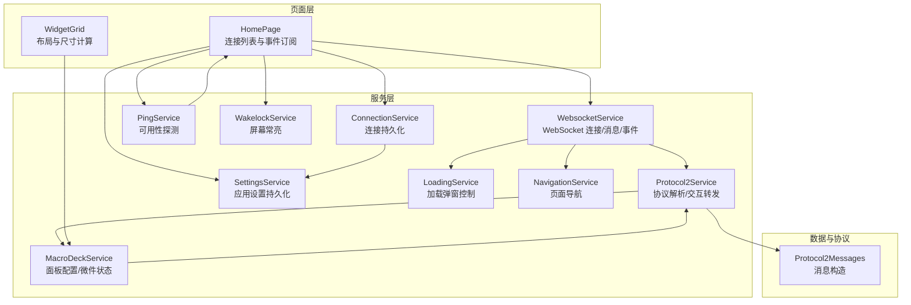
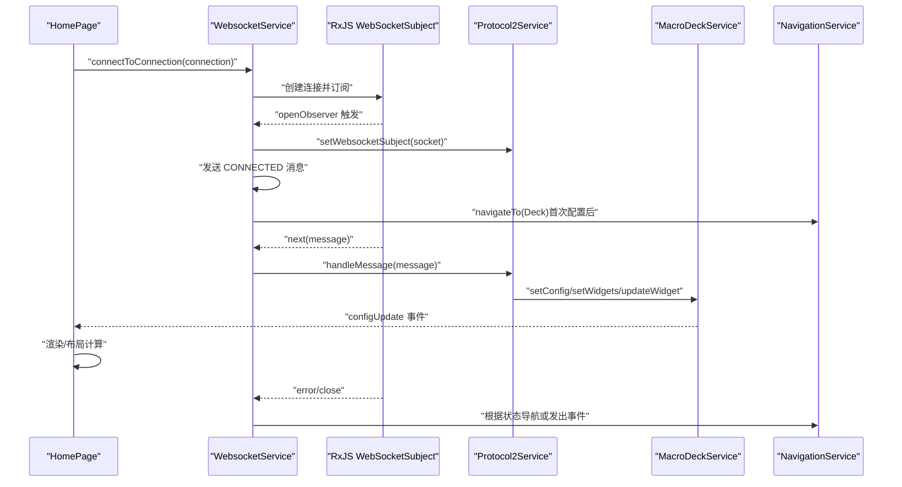
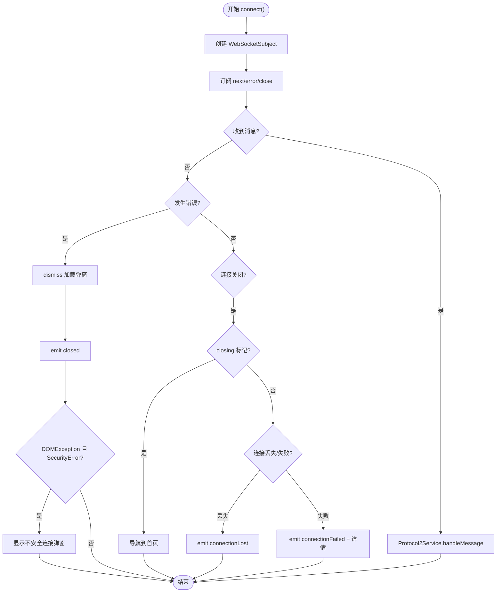
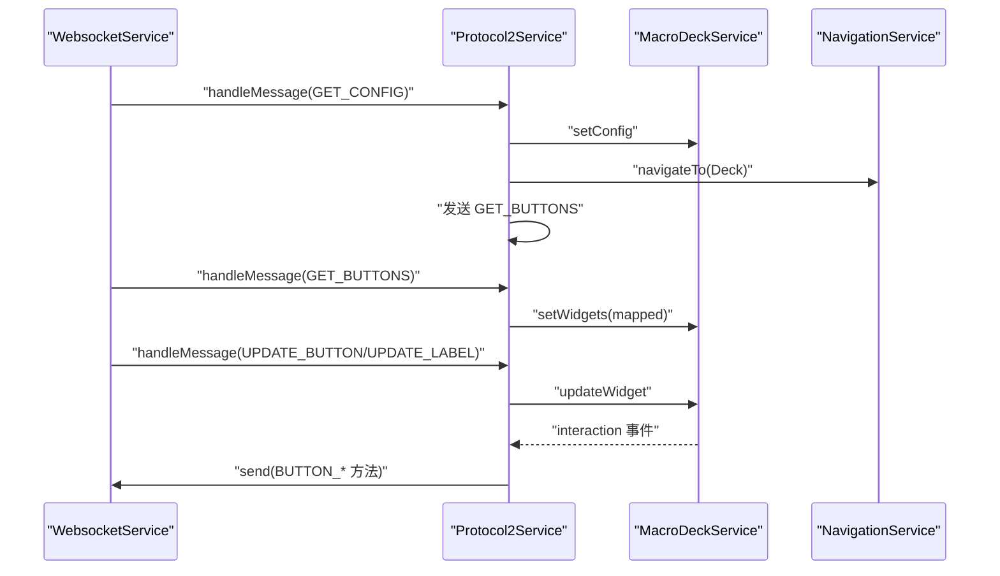
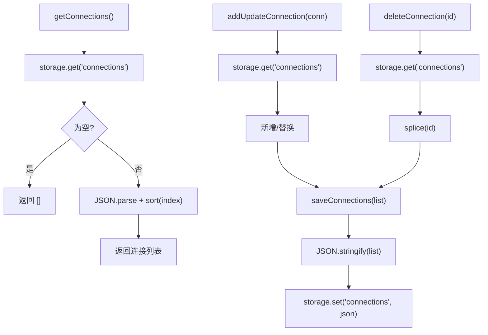
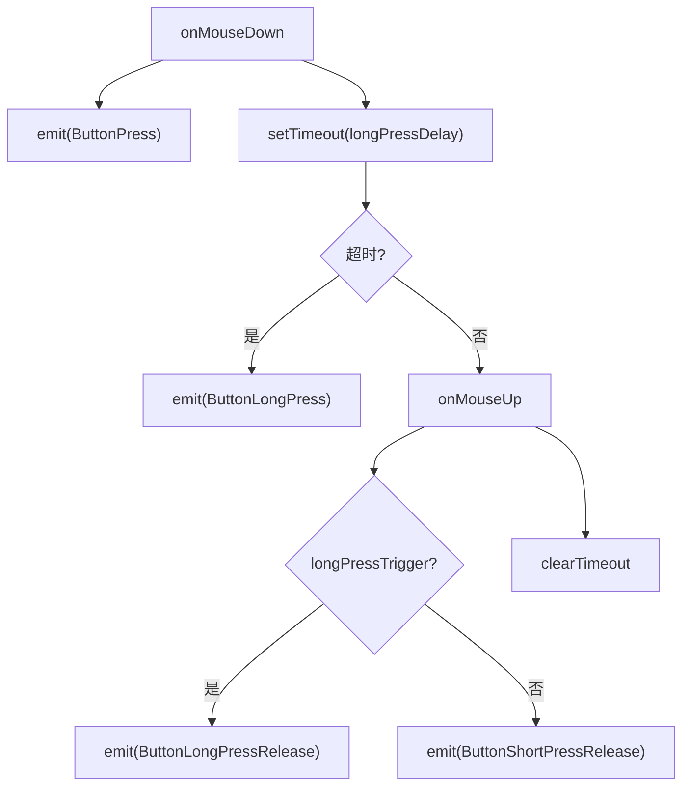
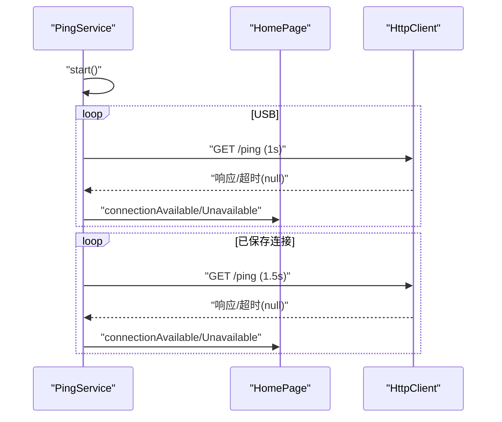
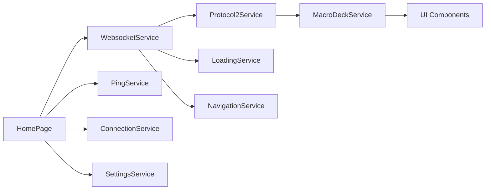

# 异步数据处理

<cite>
**本文档引用的文件**
- [websocket.service.ts](file://src/app/services/websocket/websocket.service.ts)
- [connection.service.ts](file://src/app/services/connection/connection.service.ts)
- [settings.service.ts](file://src/app/services/settings/settings.service.ts)
- [protocol2.service.ts](file://src/app/services/protocol/protocol2.service.ts)
- [macro-deck.service.ts](file://src/app/services/macro-deck/macro-deck.service.ts)
- [loading.service.ts](file://src/app/services/loading/loading.service.ts)
- [navigation.service.ts](file://src/app/services/navigation/navigation.service.ts)
- [home.page.ts](file://src/app/pages/home/home.page.ts)
- [ping.service.ts](file://src/app/services/ping/ping.service.ts)
- [protocol2-messages.ts](file://src/app/datatypes/protocol2/protocol2-messages.ts)
- [button-widget.component.ts](file://src/app/widget-content-components/button-widget/button-widget.component.ts)
- [widget-grid.component.ts](file://src/app/pages/deck/widget-grid/widget-grid.component.ts)
- [wakelock.service.ts](file://src/app/services/wakelock/wakelock.service.ts)
- [diagnostic.service.ts](file://src/app/services/diagnostic/diagnostic.service.ts)
</cite>

## 目录
1. [简介](#简介)
2. [项目结构](#项目结构)
3. [核心组件](#核心组件)
4. [架构总览](#架构总览)
5. [详细组件分析](#详细组件分析)
6. [依赖关系分析](#依赖关系分析)
7. [性能考虑](#性能考虑)
8. [故障排查指南](#故障排查指南)
9. [结论](#结论)
10. [附录](#附录)

## 简介
本文件系统性梳理 Macro-Deck-Client-App 中的异步数据处理模式，覆盖以下方面：
- 异步模式：Promise 与 RxJS Observable 的使用场景与边界
- 本地存储：Ionic Storage 的异步读写与数据持久化策略
- WebSocket：连接建立、维护与消息流处理
- 用户输入：异步响应与防抖/节流实践
- 错误处理与超时管理
- 性能优化与内存管理最佳实践

## 项目结构
应用采用 Angular + Ionic 架构，异步逻辑主要分布在服务层（Services）、页面层（Pages）与组件层（Components）。WebSocket 通信、协议解析、连接管理、设置与存储、导航与加载提示等均以服务形式提供。

图表来源
- [home.page.ts:39-139](file://src/app/pages/home/home.page.ts#L39-L139)
- [websocket.service.ts:20-172](file://src/app/services/websocket/websocket.service.ts#L20-L172)
- [protocol2.service.ts:19-160](file://src/app/services/protocol/protocol2.service.ts#L19-L160)
- [macro-deck.service.ts:10-66](file://src/app/services/macro-deck/macro-deck.service.ts#L10-L66)
- [connection.service.ts:10-102](file://src/app/services/connection/connection.service.ts#L10-L102)
- [settings.service.ts:26-246](file://src/app/services/settings/settings.service.ts#L26-L246)
- [loading.service.ts:9-49](file://src/app/services/loading/loading.service.ts#L9-L49)
- [navigation.service.ts:13-46](file://src/app/services/navigation/navigation.service.ts#L13-L46)
- [ping.service.ts:13-130](file://src/app/services/ping/ping.service.ts#L13-L130)
- [protocol2-messages.ts:2-34](file://src/app/datatypes/protocol2/protocol2-messages.ts#L2-L34)
- [widget-grid.component.ts:68-81](file://src/app/pages/deck/widget-grid/widget-grid.component.ts#L68-L81)

章节来源
- [home.page.ts:39-139](file://src/app/pages/home/home.page.ts#L39-L139)
- [websocket.service.ts:20-172](file://src/app/services/websocket/websocket.service.ts#L20-L172)
- [protocol2.service.ts:19-160](file://src/app/services/protocol/protocol2.service.ts#L19-L160)
- [macro-deck.service.ts:10-66](file://src/app/services/macro-deck/macro-deck.service.ts#L10-L66)
- [connection.service.ts:10-102](file://src/app/services/connection/connection.service.ts#L10-L102)
- [settings.service.ts:26-246](file://src/app/services/settings/settings.service.ts#L26-L246)
- [loading.service.ts:9-49](file://src/app/services/loading/loading.service.ts#L9-L49)
- [navigation.service.ts:13-46](file://src/app/services/navigation/navigation.service.ts#L13-L46)
- [ping.service.ts:13-130](file://src/app/services/ping/ping.service.ts#L13-L130)
- [protocol2-messages.ts:2-34](file://src/app/datatypes/protocol2/protocol2-messages.ts#L2-L34)
- [widget-grid.component.ts:68-81](file://src/app/pages/deck/widget-grid/widget-grid.component.ts#L68-L81)

## 核心组件
- WebSocket 服务：负责连接生命周期、消息订阅、错误处理与事件分发
- 协议2服务：解析服务器消息、映射为内部微件模型、转发用户交互
- 宏命令服务：持有面板配置与微件状态，发布配置更新事件
- 连接服务：基于 Ionic Storage 的连接配置持久化
- 设置服务：应用设置与客户端 ID 的持久化
- 加载服务：统一的加载弹窗展示与取消
- 导航服务：页面切换（首页/控制面板/连接丢失）
- Ping 服务：周期性探测服务器可用性
- 屏幕常亮服务：跨平台保持设备唤醒

章节来源
- [websocket.service.ts:20-172](file://src/app/services/websocket/websocket.service.ts#L20-L172)
- [protocol2.service.ts:19-160](file://src/app/services/protocol/protocol2.service.ts#L19-L160)
- [macro-deck.service.ts:10-66](file://src/app/services/macro-deck/macro-deck.service.ts#L10-L66)
- [connection.service.ts:10-102](file://src/app/services/connection/connection.service.ts#L10-L102)
- [settings.service.ts:26-246](file://src/app/services/settings/settings.service.ts#L26-L246)
- [loading.service.ts:9-49](file://src/app/services/loading/loading.service.ts#L9-L49)
- [navigation.service.ts:13-46](file://src/app/services/navigation/navigation.service.ts#L13-L46)
- [ping.service.ts:13-130](file://src/app/services/ping/ping.service.ts#L13-L130)
- [wakelock.service.ts:10-58](file://src/app/services/wakelock/wakelock.service.ts#L10-L58)

## 架构总览
WebSocket 作为实时数据通道，消息经协议服务解析后更新宏命令服务的状态，UI 组件订阅状态变化并渲染。连接管理与设置通过服务层持久化，Ping 服务提供连接可用性反馈，加载与导航服务贯穿连接生命周期。

图表来源
- [websocket.service.ts:101-171](file://src/app/services/websocket/websocket.service.ts#L101-L171)
- [protocol2.service.ts:193-208](file://src/app/services/protocol/protocol2.service.ts#L193-L208)
- [macro-deck.service.ts:36-43](file://src/app/services/macro-deck/macro-deck.service.ts#L36-L43)
- [navigation.service.ts:29-46](file://src/app/services/navigation/navigation.service.ts#L29-L46)
- [protocol2-messages.ts:9-23](file://src/app/datatypes/protocol2/protocol2-messages.ts#L9-L23)

## 详细组件分析

### WebSocket 连接与消息处理
- 连接建立：使用 RxJS 的 webSocket 创建 WebSocketSubject，订阅 open/close 事件，结合加载服务与事件发射器实现连接状态可视化
- 消息处理：收到消息后委派给协议处理器；错误处理包含安全异常弹窗提示
- 连接关闭：区分主动关闭与异常关闭，异常关闭时根据环境与连接状态决定导航或事件通知
- 发送消息：通过 socket.next 发送协议消息（如 CONNECTED）

图表来源
- [websocket.service.ts:101-171](file://src/app/services/websocket/websocket.service.ts#L101-L171)
- [websocket.service.ts:197-219](file://src/app/services/websocket/websocket.service.ts#L197-L219)

章节来源
- [websocket.service.ts:20-172](file://src/app/services/websocket/websocket.service.ts#L20-L172)

### 协议2消息解析与交互转发
- 首次配置：收到 GET_CONFIG 后导航到控制面板并请求按钮列表
- 按钮数据：GET_BUTTONS 映射为内部微件模型并设置到宏命令服务
- 按钮更新：UPDATE_BUTTON 与 UPDATE_LABEL 分别更新完整按钮与标签
- 用户交互：订阅宏命令服务的 interaction 事件，映射为协议方法并发送

图表来源
- [protocol2.service.ts:193-246](file://src/app/services/protocol/protocol2.service.ts#L193-L246)
- [macro-deck.service.ts:36-65](file://src/app/services/macro-deck/macro-deck.service.ts#L36-L65)
- [navigation.service.ts:29-46](file://src/app/services/navigation/navigation.service.ts#L29-L46)
- [protocol2-messages.ts:29-33](file://src/app/datatypes/protocol2/protocol2-messages.ts#L29-L33)

章节来源
- [protocol2.service.ts:19-160](file://src/app/services/protocol/protocol2.service.ts#L19-L160)

### 本地存储与数据持久化
- 连接持久化：ConnectionService 使用 Ionic Storage 读写连接列表，支持新增/更新/删除，并按索引排序
- 设置持久化：SettingsService 提供多项设置的读写，包含客户端 ID 生成与缓存
- 存储策略：JSON 序列化存储，读取时进行空值检查与默认值回退

图表来源
- [connection.service.ts:40-101](file://src/app/services/connection/connection.service.ts#L40-L101)
- [settings.service.ts:229-246](file://src/app/services/settings/settings.service.ts#L229-L246)

章节来源
- [connection.service.ts:10-102](file://src/app/services/connection/connection.service.ts#L10-L102)
- [settings.service.ts:26-246](file://src/app/services/settings/settings.service.ts#L26-L246)

### 用户输入处理与防抖/节流
- 输入事件：按钮组件在鼠标/触摸按下时发送按下事件并启动长按计时器；抬起时根据状态发送短按/长按释放事件
- 长按延迟：从设置服务读取长按延迟配置，超时后触发长按事件
- 布局更新：窗口 resize 事件使用 setTimeout 延迟计算，避免频繁重排

图表来源
- [button-widget.component.ts:174-183](file://src/app/widget-content-components/button-widget/button-widget.component.ts#L174-L183)
- [button-widget.component.ts:356-364](file://src/app/widget-content-components/button-widget/button-widget.component.ts#L356-L364)
- [widget-grid.component.ts:75-80](file://src/app/pages/deck/widget-grid/widget-grid.component.ts#L75-L80)

章节来源
- [button-widget.component.ts:174-183](file://src/app/widget-content-components/button-widget/button-widget.component.ts#L174-L183)
- [button-widget.component.ts:356-364](file://src/app/widget-content-components/button-widget/button-widget.component.ts#L356-L364)
- [widget-grid.component.ts:75-80](file://src/app/pages/deck/widget-grid/widget-grid.component.ts#L75-L80)

### Ping 服务与连接可用性探测
- 定时探测：对 USB 与所有已保存连接分别发起 HTTP 请求，间隔不同
- 可用性事件：连接可用/不可用时发射事件，HomePage 订阅后执行自动连接或 UI 更新
- 超时与错误：HTTP 请求设置超时，错误统一返回 null，确保探测稳健

图表来源
- [ping.service.ts:36-130](file://src/app/services/ping/ping.service.ts#L36-L130)
- [home.page.ts:94-121](file://src/app/pages/home/home.page.ts#L94-L121)

章节来源
- [ping.service.ts:13-130](file://src/app/services/ping/ping.service.ts#L13-L130)
- [home.page.ts:94-121](file://src/app/pages/home/home.page.ts#L94-L121)

### 加载提示与导航
- 加载弹窗：LoadingService 统一管理弹窗创建/关闭，支持“取消”事件中断连接流程
- 导航：NavigationService 根据环境选择不同首页组件，提供页面切换能力

章节来源
- [loading.service.ts:9-49](file://src/app/services/loading/loading.service.ts#L9-L49)
- [navigation.service.ts:13-46](file://src/app/services/navigation/navigation.service.ts#L13-L46)

### 屏幕常亮与诊断
- 屏幕常亮：WakelockService 在连接前根据设置启用/禁用常亮，优先使用原生 API，不支持时回退到 NoSleep.js
- 诊断：DiagnosticService 提供平台检测与版本信息

章节来源
- [wakelock.service.ts:10-58](file://src/app/services/wakelock/wakelock.service.ts#L10-L58)
- [diagnostic.service.ts:10-88](file://src/app/services/diagnostic/diagnostic.service.ts#L10-L88)

## 依赖关系分析
- 低耦合高内聚：各服务职责清晰，通过事件与消息解耦
- 数据流向：WebSocket -> 协议服务 -> 宏命令服务 -> UI 组件
- 订阅管理：页面与组件广泛使用 RxJS Subscription，生命周期中及时取消订阅，避免内存泄漏

图表来源
- [websocket.service.ts:20-172](file://src/app/services/websocket/websocket.service.ts#L20-L172)
- [protocol2.service.ts:19-160](file://src/app/services/protocol/protocol2.service.ts#L19-L160)
- [macro-deck.service.ts:10-66](file://src/app/services/macro-deck/macro-deck.service.ts#L10-L66)
- [home.page.ts:39-139](file://src/app/pages/home/home.page.ts#L39-L139)

章节来源
- [websocket.service.ts:20-172](file://src/app/services/websocket/websocket.service.ts#L20-L172)
- [protocol2.service.ts:19-160](file://src/app/services/protocol/protocol2.service.ts#L19-L160)
- [macro-deck.service.ts:10-66](file://src/app/services/macro-deck/macro-deck.service.ts#L10-L66)
- [home.page.ts:39-139](file://src/app/pages/home/home.page.ts#L39-L139)

## 性能考虑
- 异步模式选择
  - Promise：适合一次性任务（连接、存储、设置读取）
  - Observable：适合流式数据（WebSocket、HTTP 轮询、事件流）
- 防抖/节流
  - 布局计算使用 setTimeout 延迟，减少高频 resize 的重排压力
  - 长按延迟来自设置，避免频繁交互导致的过度事件
- 订阅管理
  - 页面与组件在进入/离开生命周期中正确订阅/取消，避免悬挂订阅
- 资源释放
  - 连接关闭时取消订阅、关闭加载弹窗、清理计时器
- 跨平台差异
  - 原生平台与 Web 平台在 WakeLock 行为上的差异需捕获异常，避免阻塞主线程

## 故障排查指南
- WebSocket 连接失败
  - 检查连接关闭事件与错误详情；区分异常关闭码与主动关闭
  - 安全错误（SSL 证书）会弹出不安全连接提示
- 连接丢失
  - 首次连接失败会发出失败事件；已连接断开会导航到连接丢失页面
- Ping 探测无效
  - 确认 /ping 路由可达与超时设置；检查网络与防火墙
- 加载弹窗无法关闭
  - 确认取消事件已正确传播至 WebSocket 服务并调用关闭流程
- 屏幕常亮异常
  - 浏览器需要用户交互才能启用 WakeLock，捕获异常属预期行为

章节来源
- [websocket.service.ts:197-219](file://src/app/services/websocket/websocket.service.ts#L197-L219)
- [websocket.service.ts:141-171](file://src/app/services/websocket/websocket.service.ts#L141-L171)
- [ping.service.ts:119-128](file://src/app/services/ping/ping.service.ts#L119-L128)
- [loading.service.ts:24-30](file://src/app/services/loading/loading.service.ts#L24-L30)
- [wakelock.service.ts:22-32](file://src/app/services/wakelock/wakelock.service.ts#L22-L32)

## 结论
本应用通过 Promise 与 RxJS Observable 的合理分工，实现了稳定的异步数据流：WebSocket 实时消息、HTTP 周期性探测、UI 状态驱动与持久化存储。配合完善的错误处理、超时管理与订阅生命周期治理，保证了在多平台环境下的可靠性与性能表现。

## 附录
- 消息构造工具：Protocol2Messages 提供 CONNECTED 与 GET_BUTTONS 等消息模板
- 客户端 ID：SettingsService 在首次访问时生成并缓存，确保连接鉴权一致性

章节来源
- [protocol2-messages.ts:2-34](file://src/app/datatypes/protocol2/protocol2-messages.ts#L2-L34)
- [settings.service.ts:229-246](file://src/app/services/settings/settings.service.ts#L229-L246)