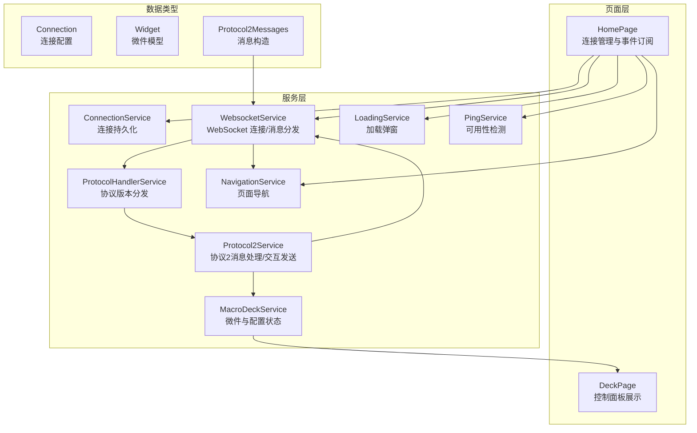
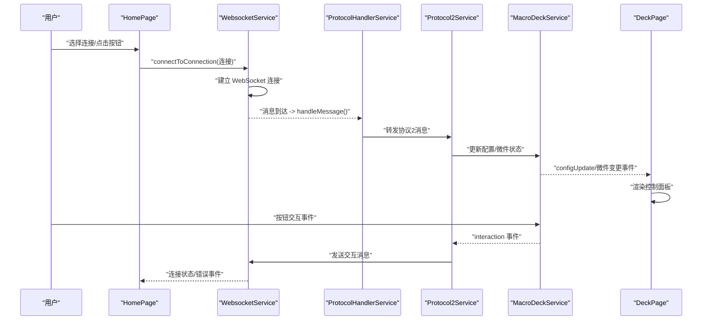
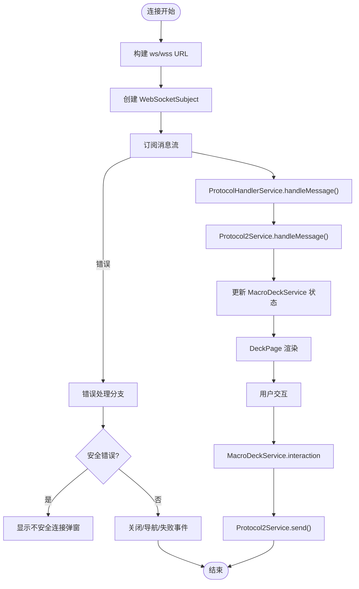
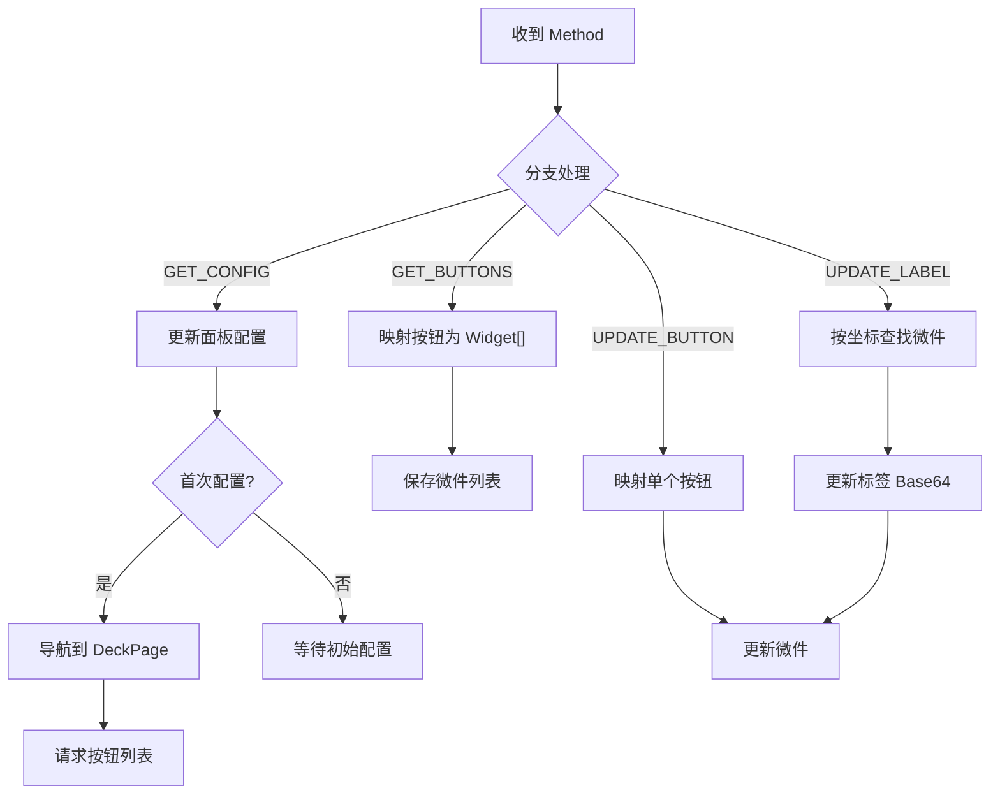
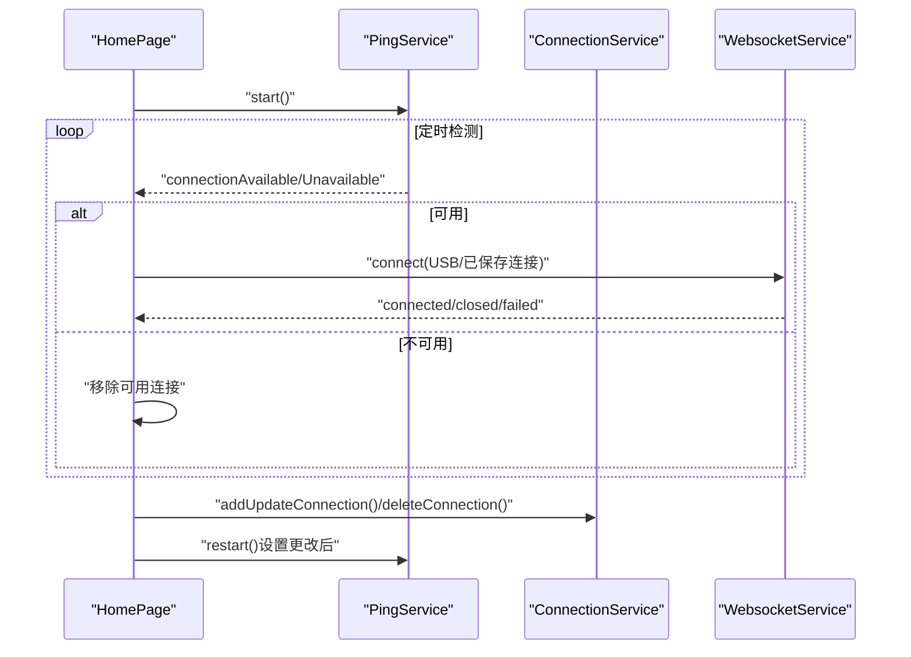
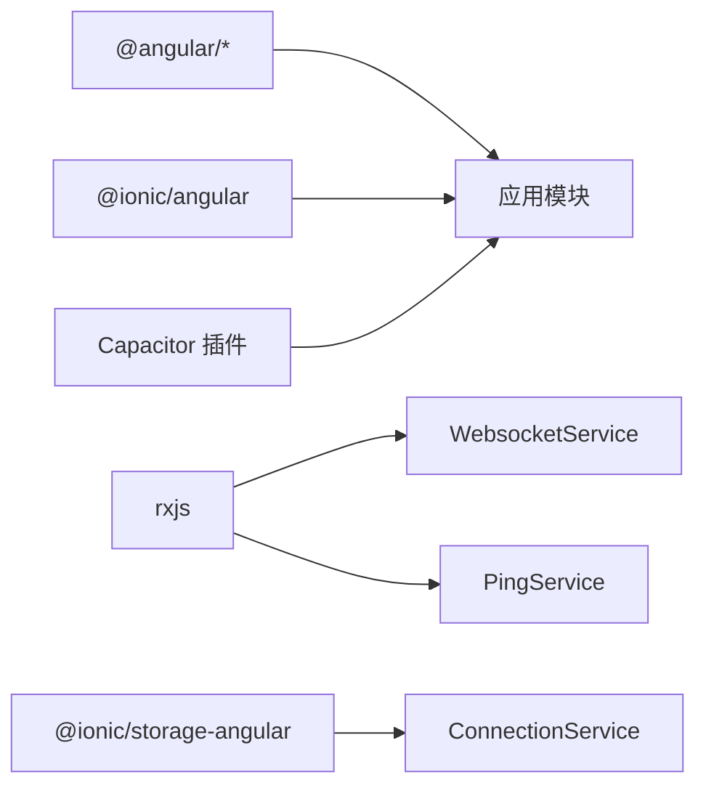

# 数据流模式

<cite>
**本文档引用的文件**
- [src/app/app.module.ts](file://src/app/app.module.ts)
- [src/app/services/connection/connection.service.ts](file://src/app/services/connection/connection.service.ts)
- [src/app/services/websocket/websocket.service.ts](file://src/app/services/websocket/websocket.service.ts)
- [src/app/services/macro-deck/macro-deck.service.ts](file://src/app/services/macro-deck/macro-deck.service.ts)
- [src/app/services/protocol/protocol-handler.service.ts](file://src/app/services/protocol/protocol-handler.service.ts)
- [src/app/services/protocol/protocol2.service.ts](file://src/app/services/protocol/protocol2.service.ts)
- [src/app/datatypes/protocol2/protocol2-messages.ts](file://src/app/datatypes/protocol2/protocol2-messages.ts)
- [src/app/pages/home/home.page.ts](file://src/app/pages/home/home.page.ts)
- [src/app/pages/deck/deck.page.ts](file://src/app/pages/deck/deck.page.ts)
- [src/app/services/navigation/navigation.service.ts](file://src/app/services/navigation/navigation.service.ts)
- [src/app/services/loading/loading.service.ts](file://src/app/services/loading/loading.service.ts)
- [src/app/services/ping/ping.service.ts](file://src/app/services/ping/ping.service.ts)
- [src/app/datatypes/widgets/widget.ts](file://src/app/datatypes/widgets/widget.ts)
- [src/app/enums/navigation-destination.ts](file://src/app/enums/navigation-destination.ts)
- [package.json](file://package.json)
</cite>

## 目录
1. [简介](#简介)
2. [项目结构](#项目结构)
3. [核心组件](#核心组件)
4. [架构总览](#架构总览)
5. [详细组件分析](#详细组件分析)
6. [依赖关系分析](#依赖关系分析)
7. [性能考虑](#性能考虑)
8. [故障排查指南](#故障排查指南)
9. [结论](#结论)

## 简介
本文件系统性梳理 Macro-Deck-Client-App 的数据流模式，覆盖从用户交互到服务器响应的完整链路，重点阐释以下方面：
- 响应式数据流设计：RxJS Observable 的链式组合、消息订阅与事件发射
- 服务间数据传递与状态同步：WebSocket、协议处理、UI 导航与微件状态
- 异步数据处理与错误处理：超时、取消、安全错误与连接状态恢复
- 性能优化与最佳实践：Ping 检测频率、Observable 组合策略、内存与订阅管理

## 项目结构
应用采用 Angular + Ionic 架构，模块化组织页面、服务与数据类型。WebSocket 通信贯穿连接管理、协议处理与 UI 展示，形成清晰的“事件驱动 + 响应式流”的数据流。

图示来源
- [src/app/pages/home/home.page.ts:1-551](file://src/app/pages/home/home.page.ts#L1-L551)
- [src/app/services/websocket/websocket.service.ts:1-402](file://src/app/services/websocket/websocket.service.ts#L1-L402)
- [src/app/services/protocol/protocol-handler.service.ts:1-65](file://src/app/services/protocol/protocol-handler.service.ts#L1-L65)
- [src/app/services/protocol/protocol2.service.ts:1-296](file://src/app/services/protocol/protocol2.service.ts#L1-L296)
- [src/app/services/macro-deck/macro-deck.service.ts:1-111](file://src/app/services/macro-deck/macro-deck.service.ts#L1-L111)
- [src/app/services/navigation/navigation.service.ts:1-86](file://src/app/services/navigation/navigation.service.ts#L1-L86)
- [src/app/services/loading/loading.service.ts:1-87](file://src/app/services/loading/loading.service.ts#L1-L87)
- [src/app/services/ping/ping.service.ts:1-228](file://src/app/services/ping/ping.service.ts#L1-L228)
- [src/app/services/connection/connection.service.ts:1-179](file://src/app/services/connection/connection.service.ts#L1-L179)
- [src/app/datatypes/widgets/widget.ts:1-33](file://src/app/datatypes/widgets/widget.ts#L1-L33)
- [src/app/datatypes/protocol2/protocol2-messages.ts:1-57](file://src/app/datatypes/protocol2/protocol2-messages.ts#L1-L57)

章节来源
- [src/app/app.module.ts:1-87](file://src/app/app.module.ts#L1-L87)
- [package.json:1-92](file://package.json#L1-L92)

## 核心组件
- 连接管理与持久化：ConnectionService 提供连接列表的增删改查与本地存储
- WebSocket 通信：WebsocketService 负责连接生命周期、消息订阅与错误处理，并向协议层转发
- 协议处理：ProtocolHandlerService 分发消息至协议2服务；Protocol2Service 负责消息解析、微件映射与交互上报
- 状态与视图：MacroDeckService 维护面板配置与微件列表；DeckPage 展示；NavigationService 控制页面跳转
- 反馈与检测：LoadingService 管理加载弹窗；PingService 周期性探测可用性并发出事件

章节来源
- [src/app/services/connection/connection.service.ts:1-179](file://src/app/services/connection/connection.service.ts#L1-L179)
- [src/app/services/websocket/websocket.service.ts:1-402](file://src/app/services/websocket/websocket.service.ts#L1-L402)
- [src/app/services/protocol/protocol-handler.service.ts:1-65](file://src/app/services/protocol/protocol-handler.service.ts#L1-L65)
- [src/app/services/protocol/protocol2.service.ts:1-296](file://src/app/services/protocol/protocol2.service.ts#L1-L296)
- [src/app/services/macro-deck/macro-deck.service.ts:1-111](file://src/app/services/macro-deck/macro-deck.service.ts#L1-L111)
- [src/app/pages/deck/deck.page.ts:1-158](file://src/app/pages/deck/deck.page.ts#L1-L158)
- [src/app/services/navigation/navigation.service.ts:1-86](file://src/app/services/navigation/navigation.service.ts#L1-L86)
- [src/app/services/loading/loading.service.ts:1-87](file://src/app/services/loading/loading.service.ts#L1-L87)
- [src/app/services/ping/ping.service.ts:1-228](file://src/app/services/ping/ping.service.ts#L1-L228)

## 架构总览
下图展示从用户交互到服务器响应的完整数据流，以及服务间的事件与状态流转。

图示来源
- [src/app/pages/home/home.page.ts:1-551](file://src/app/pages/home/home.page.ts#L1-L551)
- [src/app/services/websocket/websocket.service.ts:1-402](file://src/app/services/websocket/websocket.service.ts#L1-L402)
- [src/app/services/protocol/protocol-handler.service.ts:1-65](file://src/app/services/protocol/protocol-handler.service.ts#L1-L65)
- [src/app/services/protocol/protocol2.service.ts:1-296](file://src/app/services/protocol/protocol2.service.ts#L1-L296)
- [src/app/services/macro-deck/macro-deck.service.ts:1-111](file://src/app/services/macro-deck/macro-deck.service.ts#L1-L111)
- [src/app/pages/deck/deck.page.ts:1-158](file://src/app/pages/deck/deck.page.ts#L1-L158)

## 详细组件分析

### WebSocket 服务与消息链路
- 连接建立：根据连接配置构造 ws/wss 地址，创建 RxJS WebSocketSubject，订阅 open/close 与消息流
- 消息分发：收到消息后交由 ProtocolHandlerService，再由 Protocol2Service 处理
- 交互上报：订阅 MacroDeckService.interaction，将用户交互映射为协议方法并发送
- 错误处理：区分加载取消、安全错误（SSL）、非正常关闭码，分别执行关闭、弹窗或导航

图示来源
- [src/app/services/websocket/websocket.service.ts:1-402](file://src/app/services/websocket/websocket.service.ts#L1-L402)
- [src/app/services/protocol/protocol-handler.service.ts:1-65](file://src/app/services/protocol/protocol-handler.service.ts#L1-L65)
- [src/app/services/protocol/protocol2.service.ts:1-296](file://src/app/services/protocol/protocol2.service.ts#L1-L296)
- [src/app/services/macro-deck/macro-deck.service.ts:1-111](file://src/app/services/macro-deck/macro-deck.service.ts#L1-L111)

章节来源
- [src/app/services/websocket/websocket.service.ts:63-172](file://src/app/services/websocket/websocket.service.ts#L63-L172)
- [src/app/services/protocol/protocol2.service.ts:139-160](file://src/app/services/protocol/protocol2.service.ts#L139-L160)

### 协议2消息处理与微件映射
- 初始配置：GET_CONFIG 到达后，若首次收到则导航至控制面板并请求按钮列表
- 按钮数据：GET_BUTTONS 映射为内部 Widget 数组；UPDATE_BUTTON 单点更新；UPDATE_LABEL 仅更新标签
- 交互映射：将交互类型映射为协议方法名，携带行列坐标发送

图示来源
- [src/app/services/protocol/protocol2.service.ts:41-95](file://src/app/services/protocol/protocol2.service.ts#L41-L95)
- [src/app/services/protocol/protocol2.service.ts:111-125](file://src/app/services/protocol/protocol2.service.ts#L111-L125)
- [src/app/datatypes/widgets/widget.ts:1-33](file://src/app/datatypes/widgets/widget.ts#L1-L33)

章节来源
- [src/app/services/protocol/protocol2.service.ts:193-247](file://src/app/services/protocol/protocol2.service.ts#L193-L247)
- [src/app/datatypes/widgets/widget.ts:1-33](file://src/app/datatypes/widgets/widget.ts#L1-L33)

### 首页与连接生命周期
- Ping 检测：周期性 HTTP 请求探测可用性，发出连接可用/不可用事件
- 自动连接：USB 或已保存连接开启 autoConnect 时自动发起连接
- 连接失败：弹出失败详情弹窗；连接关闭后重启 Ping
- 快速设置：监听深度链接扫描事件，打开新增连接弹窗

图示来源
- [src/app/pages/home/home.page.ts:89-139](file://src/app/pages/home/home.page.ts#L89-L139)
- [src/app/services/ping/ping.service.ts:36-72](file://src/app/services/ping/ping.service.ts#L36-L72)
- [src/app/services/connection/connection.service.ts:65-101](file://src/app/services/connection/connection.service.ts#L65-L101)
- [src/app/services/websocket/websocket.service.ts:124-133](file://src/app/services/websocket/websocket.service.ts#L124-L133)

章节来源
- [src/app/pages/home/home.page.ts:386-424](file://src/app/pages/home/home.page.ts#L386-L424)
- [src/app/services/ping/ping.service.ts:156-189](file://src/app/services/ping/ping.service.ts#L156-L189)

### 导航与页面状态
- 导航服务：根据环境选择不同首页组件，统一通过 ion-nav 切换页面
- 控制面板：进入时检查连接状态，未连接则回到首页
- 页面生命周期：利用 ViewDidEnter/DidLeave 管理订阅与资源释放

章节来源
- [src/app/services/navigation/navigation.service.ts:29-46](file://src/app/services/navigation/navigation.service.ts#L29-L46)
- [src/app/pages/deck/deck.page.ts:44-52](file://src/app/pages/deck/deck.page.ts#L44-L52)

### 响应式数据流与事件发射
- 事件发射器：WebsocketService、PingService、MacroDeckService、LoadingService 等均使用 EventEmitter/Subject 发布事件
- 订阅管理：HomePage/DeckPage/PingService/Protocol2Service 等在生命周期内订阅并统一在离开时取消
- Observable 组合：PingService 使用 interval + switchMap + timeout + catchError 实现稳健的周期探测

章节来源
- [src/app/services/websocket/websocket.service.ts:34-56](file://src/app/services/websocket/websocket.service.ts#L34-L56)
- [src/app/services/ping/ping.service.ts:119-128](file://src/app/services/ping/ping.service.ts#L119-L128)
- [src/app/services/loading/loading.service.ts:14-18](file://src/app/services/loading/loading.service.ts#L14-L18)

## 依赖关系分析
- Angular/Ionic 生态：@angular/*、@ionic/angular、@ionic/storage-angular
- RxJS：webSocket、interval、switchMap、timeout、catchError 等
- Capacitor 插件：用于平台能力扩展（如唤醒锁、方向锁等）

图示来源
- [package.json:16-57](file://package.json#L16-L57)

章节来源
- [package.json:16-57](file://package.json#L16-L57)

## 性能考虑
- Ping 检测频率与并发
  - USB 连接每 1 秒探测一次，网络连接每 1.5 秒一次，避免过度占用带宽与 CPU
  - 使用 switchMap 替代 mergeMap，确保同一 URL 的旧请求被取消，减少无效 IO
- 超时与容错
  - HTTP 探测设置 800ms 超时，catchError 返回空值，保证探测链路稳定
- 订阅管理
  - 在页面离开时统一取消订阅，避免内存泄漏与后台持续任务
- 渲染优化
  - 首次 GET_CONFIG 成功后再请求按钮列表，避免无谓传输
  - UPDATE_LABEL 仅局部更新，减少不必要的视图刷新

## 故障排查指南
- 连接失败
  - 观察 WebsocketService.connectionFailed 事件参数，结合关闭码与原因定位
  - 若为安全错误（SSL），弹出不安全连接提示；否则根据连接阶段决定导航或提示
- 连接丢失
  - 非正常关闭码触发连接丢失页面；检查网络波动与服务器状态
- 加载弹窗无法关闭
  - 确认 LoadingService.dismiss 的调用路径与 openModal 引用；避免重复叠加
- Ping 不生效
  - 检查 HTTP URL 与端口；确认防火墙/代理未阻断；观察 timeout 与 catchError 行为

章节来源
- [src/app/services/websocket/websocket.service.ts:197-219](file://src/app/services/websocket/websocket.service.ts#L197-L219)
- [src/app/services/loading/loading.service.ts:24-30](file://src/app/services/loading/loading.service.ts#L24-L30)
- [src/app/services/ping/ping.service.ts:216-225](file://src/app/services/ping/ping.service.ts#L216-L225)

## 结论
本应用通过 RxJS 响应式流与事件驱动架构，实现了从连接管理、协议处理到 UI 渲染的高内聚低耦合数据流。关键优化点包括：合理的 Ping 频率、超时与容错策略、严格的订阅生命周期管理与局部状态更新。建议在后续迭代中进一步引入节流/去抖与缓存策略，以应对更复杂的交互场景与网络环境。