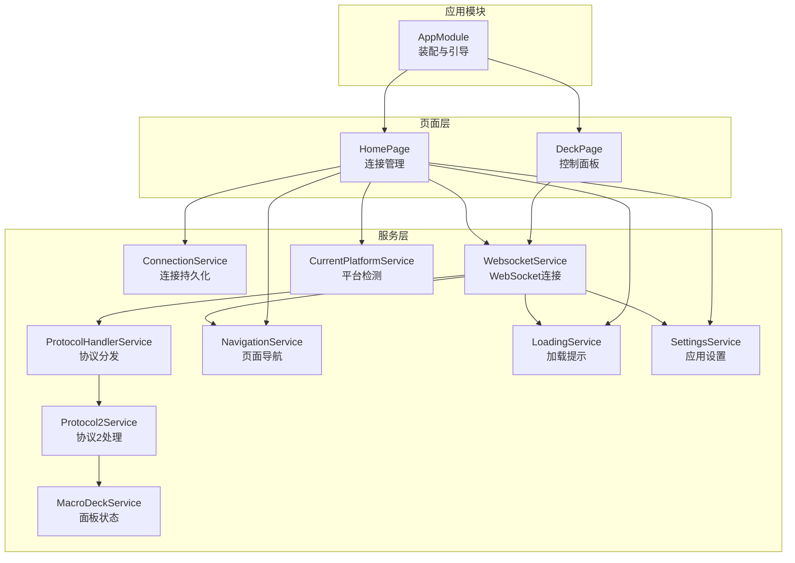
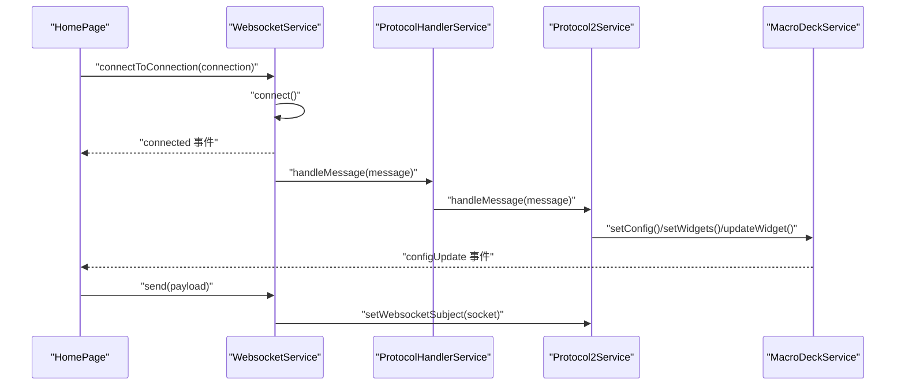
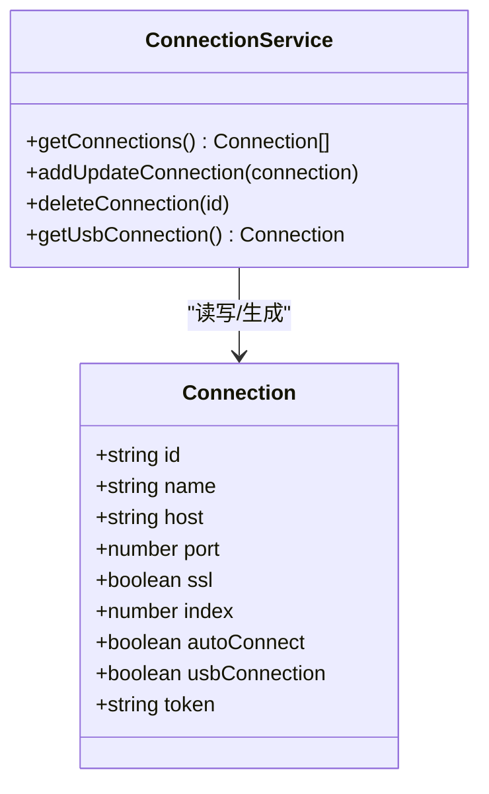
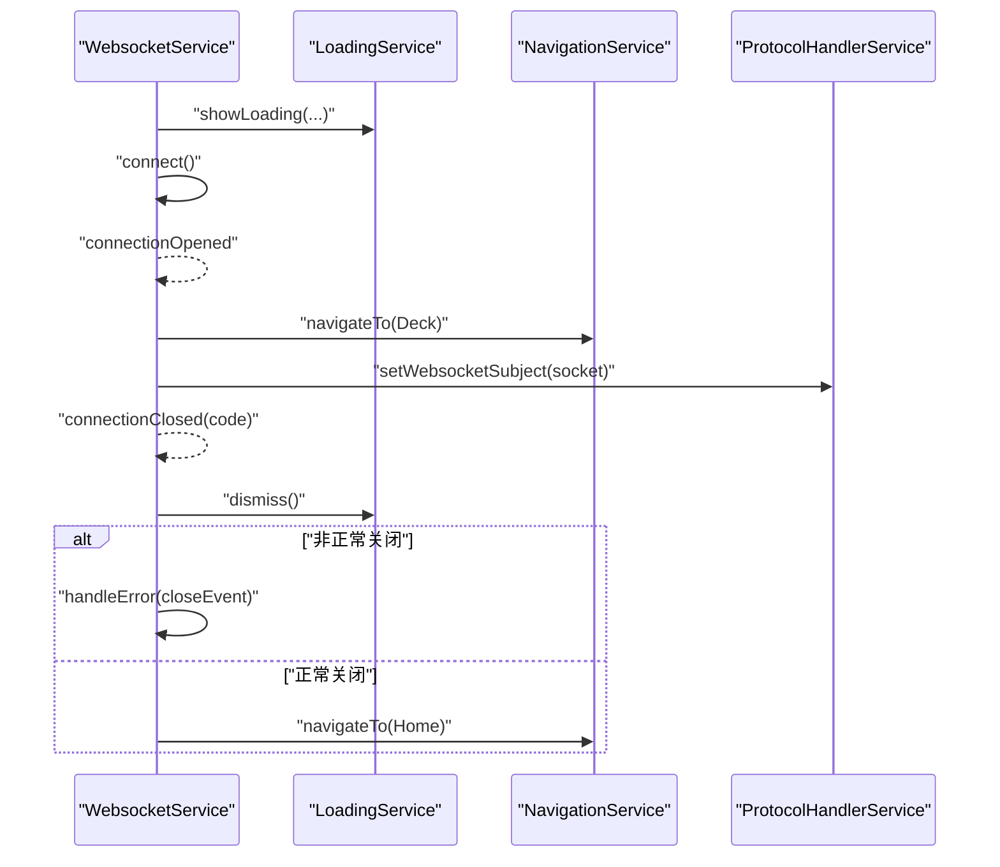
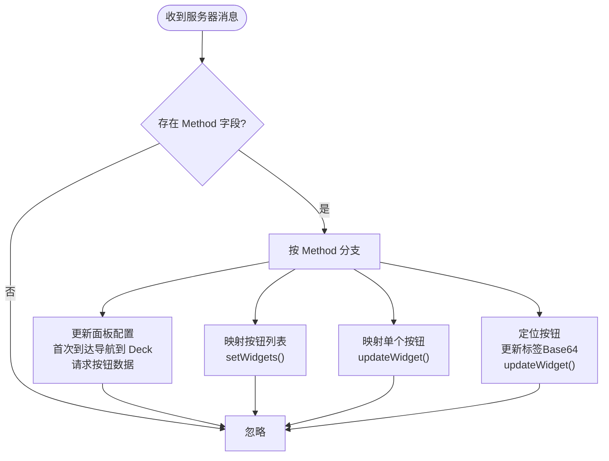
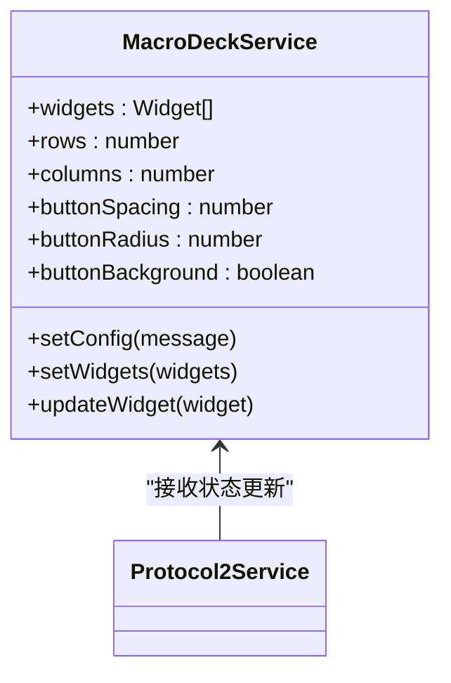
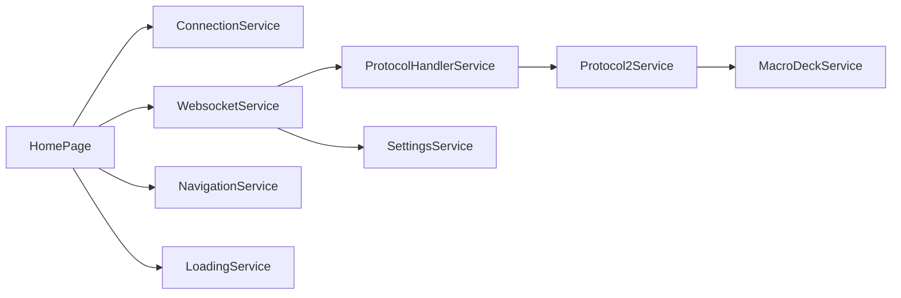

# 服务间通信

<cite>
**本文档引用的文件**
- [src/app/services/connection/connection.service.ts](file://src/app/services/connection/connection.service.ts)
- [src/app/services/websocket/websocket.service.ts](file://src/app/services/websocket/websocket.service.ts)
- [src/app/services/macro-deck/macro-deck.service.ts](file://src/app/services/macro-deck/macro-deck.service.ts)
- [src/app/services/protocol/protocol-handler.service.ts](file://src/app/services/protocol/protocol-handler.service.ts)
- [src/app/services/protocol/protocol2.service.ts](file://src/app/services/protocol/protocol2.service.ts)
- [src/app/services/settings/settings.service.ts](file://src/app/services/settings/settings.service.ts)
- [src/app/services/navigation/navigation.service.ts](file://src/app/services/navigation/navigation.service.ts)
- [src/app/services/loading/loading.service.ts](file://src/app/services/loading/loading.service.ts)
- [src/app/services/current-platform/current-platform.service.ts](file://src/app/services/current-platform/current-platform.service.ts)
- [src/app/pages/home/home.page.ts](file://src/app/pages/home/home.page.ts)
- [src/app/pages/deck/deck.page.ts](file://src/app/pages/deck/deck.page.ts)
- [src/app/datatypes/connection.ts](file://src/app/datatypes/connection.ts)
- [src/app/enums/navigation-destination.ts](file://src/app/enums/navigation-destination.ts)
- [src/app/datatypes/protocol2/protocol2-messages.ts](file://src/app/datatypes/protocol2/protocol2-messages.ts)
- [src/app/app.module.ts](file://src/app/app.module.ts)
</cite>

## 目录
1. [简介](#简介)
2. [项目结构](#项目结构)
3. [核心组件](#核心组件)
4. [架构总览](#架构总览)
5. [详细组件分析](#详细组件分析)
6. [依赖分析](#依赖分析)
7. [性能考虑](#性能考虑)
8. [故障排查指南](#故障排查指南)
9. [结论](#结论)
10. [附录](#附录)

## 简介
本文件聚焦于 Macro-Deck-Client-App 中服务间通信机制，系统梳理 ConnectionService、WebsocketService、MacroDeckService 与 ProtocolHandlerService 的协作流程、初始化顺序与生命周期管理、跨服务状态同步与数据共享策略，并总结依赖注入使用模式与循环依赖规避方法，最后提供调试技巧与性能监控建议。

## 项目结构
应用采用 Angular/Ionic 架构，服务层位于 src/app/services 下，页面组件位于 src/app/pages 下；数据类型与枚举位于 src/app/datatypes 与 src/app/enums。模块入口在 src/app/app.module.ts，负责全局模块与组件装配。

图示来源
- [src/app/app.module.ts:19-42](file://src/app/app.module.ts#L19-L42)
- [src/app/pages/home/home.page.ts:39-64](file://src/app/pages/home/home.page.ts#L39-L64)
- [src/app/pages/deck/deck.page.ts:24-38](file://src/app/pages/deck/deck.page.ts#L24-L38)

章节来源
- [src/app/app.module.ts:19-42](file://src/app/app.module.ts#L19-L42)

## 核心组件
- ConnectionService：负责连接配置的增删改查与本地持久化，提供 USB 连接快捷配置。
- WebsocketService：封装 WebSocket 连接、消息订阅、连接事件（打开/关闭/失败/丢失）、错误处理与加载提示联动。
- ProtocolHandlerService：协议版本分发器，当前默认转发至 Protocol2Service。
- Protocol2Service：协议2消息解析、按钮/标签更新、与 MacroDeckService 的状态同步、交互事件转发。
- MacroDeckService：维护面板配置与微件列表，发布配置更新与交互事件。
- NavigationService：统一页面导航，区分 Web 与原生页面。
- LoadingService：连接过程中的加载弹窗管理。
- SettingsService：应用设置与统计信息（连接次数、上次连接、客户端ID等）。
- CurrentPlatformService：平台检测（移动端/浏览器）。

章节来源
- [src/app/services/connection/connection.service.ts:10-102](file://src/app/services/connection/connection.service.ts#L10-L102)
- [src/app/services/websocket/websocket.service.ts:20-230](file://src/app/services/websocket/websocket.service.ts#L20-L230)
- [src/app/services/protocol/protocol-handler.service.ts:9-37](file://src/app/services/protocol/protocol-handler.service.ts#L9-L37)
- [src/app/services/protocol/protocol2.service.ts:19-161](file://src/app/services/protocol/protocol2.service.ts#L19-L161)
- [src/app/services/macro-deck/macro-deck.service.ts:10-66](file://src/app/services/macro-deck/macro-deck.service.ts#L10-L66)
- [src/app/services/navigation/navigation.service.ts:13-46](file://src/app/services/navigation/navigation.service.ts#L13-L46)
- [src/app/services/loading/loading.service.ts:9-49](file://src/app/services/loading/loading.service.ts#L9-L49)
- [src/app/services/settings/settings.service.ts:26-246](file://src/app/services/settings/settings.service.ts#L26-L246)
- [src/app/services/current-platform/current-platform.service.ts:8-44](file://src/app/services/current-platform/current-platform.service.ts#L8-L44)

## 架构总览
服务间通信遵循“事件驱动 + 依赖注入”的模式：页面组件通过依赖注入获取服务实例；服务之间通过 RxJS 事件流（EventEmitter/Subject）与方法调用协同工作；协议层通过 ProtocolHandlerService 将消息路由到 Protocol2Service，后者与 MacroDeckService 同步状态并回传交互事件。

图示来源
- [src/app/pages/home/home.page.ts:124-131](file://src/app/pages/home/home.page.ts#L124-L131)
- [src/app/services/websocket/websocket.service.ts:101-134](file://src/app/services/websocket/websocket.service.ts#L101-L134)
- [src/app/services/protocol/protocol-handler.service.ts:22-36](file://src/app/services/protocol/protocol-handler.service.ts#L22-L36)
- [src/app/services/protocol/protocol2.service.ts:41-95](file://src/app/services/protocol/protocol2.service.ts#L41-L95)
- [src/app/services/macro-deck/macro-deck.service.ts:36-65](file://src/app/services/macro-deck/macro-deck.service.ts#L36-L65)

## 详细组件分析

### ConnectionService 分析
- 职责：维护连接列表（本地存储）、新增/更新/删除连接、生成 USB 连接配置。
- 数据结构：Connection 接口定义连接字段。
- 生命周期：作为根作用域服务，随应用启动即可用；页面通过其读写连接列表。

图示来源
- [src/app/services/connection/connection.service.ts:10-102](file://src/app/services/connection/connection.service.ts#L10-L102)
- [src/app/datatypes/connection.ts:2-21](file://src/app/datatypes/connection.ts#L2-L21)

章节来源
- [src/app/services/connection/connection.service.ts:10-102](file://src/app/services/connection/connection.service.ts#L10-L102)
- [src/app/datatypes/connection.ts:2-21](file://src/app/datatypes/connection.ts#L2-L21)

### WebsocketService 分析
- 职责：建立/关闭 WebSocket 连接、订阅连接事件、错误处理、加载提示联动、向协议层转发消息。
- 生命周期：connectToConnection/connectToString 初始化连接；订阅 open/close/error；主动 close() 完成清理。
- 事件：connected/closed/connectionLost/connectionFailed；内部 connectionOpened/connectionClosed。
- 与协议层：connect 成功后 setWebsocketSubject(socket) 注入到协议层，随后发送 CONNECTED 消息。

图示来源
- [src/app/services/websocket/websocket.service.ts:101-172](file://src/app/services/websocket/websocket.service.ts#L101-L172)
- [src/app/services/websocket/websocket.service.ts:332-393](file://src/app/services/websocket/websocket.service.ts#L332-L393)
- [src/app/services/navigation/navigation.service.ts:29-46](file://src/app/services/navigation/navigation.service.ts#L29-L46)
- [src/app/services/loading/loading.service.ts:37-48](file://src/app/services/loading/loading.service.ts#L37-L48)

章节来源
- [src/app/services/websocket/websocket.service.ts:20-230](file://src/app/services/websocket/websocket.service.ts#L20-L230)

### ProtocolHandlerService 与 Protocol2Service 分析
- 职责：ProtocolHandlerService 作为协议版本分发器；Protocol2Service 负责消息解析、状态同步、交互事件转发。
- 状态同步：GET_CONFIG 触发导航到 Deck 并请求按钮数据；GET_BUTTONS/UPDATE_BUTTON/UPDATE_LABEL 更新 MacroDeckService。
- 交互转发：订阅 MacroDeckService.interaction，将交互类型映射为协议方法名并发送。

图示来源
- [src/app/services/protocol/protocol2.service.ts:41-95](file://src/app/services/protocol/protocol2.service.ts#L41-L95)
- [src/app/services/protocol/protocol2.service.ts:111-125](file://src/app/services/protocol/protocol2.service.ts#L111-L125)
- [src/app/services/protocol/protocol2.service.ts:139-160](file://src/app/services/protocol/protocol2.service.ts#L139-L160)

章节来源
- [src/app/services/protocol/protocol-handler.service.ts:9-37](file://src/app/services/protocol/protocol-handler.service.ts#L9-L37)
- [src/app/services/protocol/protocol2.service.ts:19-161](file://src/app/services/protocol/protocol2.service.ts#L19-L161)

### MacroDeckService 分析
- 职责：维护面板配置（行/列/间距/圆角/背景）与微件列表；发布 configUpdate 与 interaction 事件。
- 与协议层：接收 Protocol2Service 的 setConfig/setWidgets/updateWidget 调用，触发 UI 更新。
- 与页面层：DeckPage 订阅 configUpdate 以刷新界面。

图示来源
- [src/app/services/macro-deck/macro-deck.service.ts:10-66](file://src/app/services/macro-deck/macro-deck.service.ts#L10-L66)
- [src/app/services/protocol/protocol2.service.ts:41-95](file://src/app/services/protocol/protocol2.service.ts#L41-L95)

章节来源
- [src/app/services/macro-deck/macro-deck.service.ts:10-66](file://src/app/services/macro-deck/macro-deck.service.ts#L10-L66)

### 服务初始化顺序与生命周期管理
- 初始化顺序（典型路径）：AppModule -> HomePage -> WebsocketService -> ProtocolHandlerService -> Protocol2Service -> MacroDeckService。
- 生命周期要点：
  - WebsocketService 在连接打开后设置协议层的 WebSocket 主题，并发送 CONNECTED 消息。
  - Protocol2Service 首次收到 GET_CONFIG 后导航到 Deck 并请求按钮数据。
  - HomePage 订阅 WebSocket 事件与 PingService 事件，实现自动连接与错误提示。
  - DeckPage 在进入时检查连接状态，未连接则返回首页。

章节来源
- [src/app/services/websocket/websocket.service.ts:350-359](file://src/app/services/websocket/websocket.service.ts#L350-L359)
- [src/app/services/protocol/protocol2.service.ts:48-57](file://src/app/services/protocol/protocol2.service.ts#L48-L57)
- [src/app/pages/home/home.page.ts:89-139](file://src/app/pages/home/home.page.ts#L89-L139)
- [src/app/pages/deck/deck.page.ts:44-52](file://src/app/pages/deck/deck.page.ts#L44-L52)

### 跨服务状态同步与数据共享机制
- 事件驱动：WebsocketService.connected -> NavigationService.navigateTo(Deck)；MacroDeckService.configUpdate -> UI 刷新。
- 依赖注入：各服务以根作用域注入，页面组件通过构造函数注入所需服务。
- 数据共享：
  - 连接配置：ConnectionService 与 SettingsService 共享持久化能力。
  - 协议消息：WebsocketService 将消息交给 ProtocolHandlerService，再由 Protocol2Service 写入 MacroDeckService。
  - 平台差异：NavigationService 根据环境选择不同首页组件。

章节来源
- [src/app/services/navigation/navigation.service.ts:15-16](file://src/app/services/navigation/navigation.service.ts#L15-L16)
- [src/app/services/websocket/websocket.service.ts:159-171](file://src/app/services/websocket/websocket.service.ts#L159-L171)
- [src/app/services/protocol/protocol2.service.ts:48-57](file://src/app/services/protocol/protocol2.service.ts#L48-L57)

### 依赖注入使用模式与循环依赖避免
- 使用模式：服务均以 @Injectable({ providedIn: 'root' }) 提供，页面组件通过构造函数注入。
- 循环依赖规避：
  - WebsocketService 与 ProtocolHandlerService 通过 setWebsocketSubject(socket) 反向注入，避免直接互相构造。
  - Protocol2Service 通过订阅 MacroDeckService.interaction 实现解耦，避免直接依赖 UI 组件。
  - NavigationService 与 LoadingService 仅作为工具服务，不反向依赖业务服务。

章节来源
- [src/app/services/websocket/websocket.service.ts:165](file://src/app/services/websocket/websocket.service.ts#L165)
- [src/app/services/protocol/protocol2.service.ts:30-34](file://src/app/services/protocol/protocol2.service.ts#L30-L34)

## 依赖分析
- 低耦合高内聚：服务职责清晰，通过事件与方法调用协作。
- 关键依赖链：
  - HomePage 依赖 ConnectionService、WebsocketService、NavigationService、LoadingService。
  - WebsocketService 依赖 ProtocolHandlerService、NavigationService、LoadingService、SettingsService。
  - ProtocolHandlerService 依赖 Protocol2Service。
  - Protocol2Service 依赖 MacroDeckService、NavigationService、LoadingService。
  - MacroDeckService 与页面组件通过事件交互。

图示来源
- [src/app/pages/home/home.page.ts:56-64](file://src/app/pages/home/home.page.ts#L56-L64)
- [src/app/services/websocket/websocket.service.ts:51-57](file://src/app/services/websocket/websocket.service.ts#L51-L57)
- [src/app/services/protocol/protocol-handler.service.ts:14](file://src/app/services/protocol/protocol-handler.service.ts#L14)
- [src/app/services/protocol/protocol2.service.ts:27-29](file://src/app/services/protocol/protocol2.service.ts#L27-L29)
- [src/app/services/macro-deck/macro-deck.service.ts:29](file://src/app/services/macro-deck/macro-deck.service.ts#L29)

章节来源
- [src/app/pages/home/home.page.ts:56-64](file://src/app/pages/home/home.page.ts#L56-L64)
- [src/app/services/websocket/websocket.service.ts:51-57](file://src/app/services/websocket/websocket.service.ts#L51-L57)
- [src/app/services/protocol/protocol-handler.service.ts:14](file://src/app/services/protocol/protocol-handler.service.ts#L14)
- [src/app/services/protocol/protocol2.service.ts:27-29](file://src/app/services/protocol/protocol2.service.ts#L27-L29)

## 性能考虑
- 连接建立与消息处理：
  - 使用 RxJS webSocket 与 Subject/Subscription 管理连接与订阅，避免内存泄漏需确保在关闭时 unsubscribe。
  - 首次配置到达后才请求按钮数据，减少不必要的网络负载。
- 状态更新：
  - updateWidget 通过坐标查找替换，避免全量重绘；必要时可在 UI 层做变更检测优化。
- 加载提示：
  - LoadingService 在连接过程中统一展示/关闭，避免重复弹窗与阻塞。

## 故障排查指南
- 连接失败：
  - WebsocketService 在 error 回调中处理 SecurityError 并弹出不安全连接提示；同时发出 connectionFailed 事件，HomePage 可据此弹出错误弹窗。
- 连接丢失：
  - 非正常关闭码触发 handleError，根据环境与连接状态导航到 ConnectionLost 或 Home。
- 自动连接：
  - HomePage 监听 PingService 事件与连接配置 autoConnect，实现 USB/已保存连接的自动连接。
- 调试技巧：
  - 在 WebsocketService 的 subscribeOpenClose 中观察连接状态变化与关闭码。
  - 在 Protocol2Service 的 handleMessage 中打印 Method 与消息体，核对协议一致性。
  - 使用 SettingsService 的 getClientId 与 getConnectionCount 辅助定位设备与连接历史。

章节来源
- [src/app/services/websocket/websocket.service.ts:120-133](file://src/app/services/websocket/websocket.service.ts#L120-L133)
- [src/app/services/websocket/websocket.service.ts:197-219](file://src/app/services/websocket/websocket.service.ts#L197-L219)
- [src/app/pages/home/home.page.ts:94-131](file://src/app/pages/home/home.page.ts#L94-L131)
- [src/app/services/settings/settings.service.ts:229-246](file://src/app/services/settings/settings.service.ts#L229-L246)

## 结论
该应用通过清晰的服务边界与事件驱动机制实现了稳定的客户端与 Macro Deck 服务器通信：ConnectionService 负责连接配置，WebsocketService 负责连接与消息转发，ProtocolHandlerService/Protocol2Service 负责协议解析与状态同步，MacroDeckService 负责面板状态管理。配合 NavigationService、LoadingService、SettingsService 形成完整的生命周期与用户体验闭环。依赖注入与事件解耦有效避免了循环依赖，提升了可维护性与可测试性。

## 附录
- 协议消息构建：CONNECTED 与 GET_BUTTONS 的消息格式由 Protocol2Messages 提供。
- 页面导航目标：NavigationDestination 定义 Home/Deck/ConnectionLost 三类目标。

章节来源
- [src/app/datatypes/protocol2/protocol2-messages.ts:9-33](file://src/app/datatypes/protocol2/protocol2-messages.ts#L9-L33)
- [src/app/enums/navigation-destination.ts:2-9](file://src/app/enums/navigation-destination.ts#L2-L9)