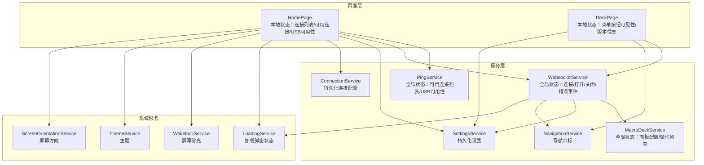
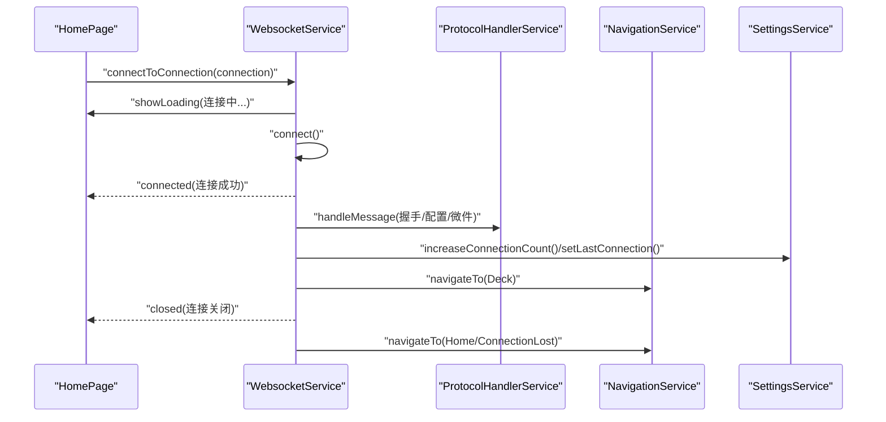
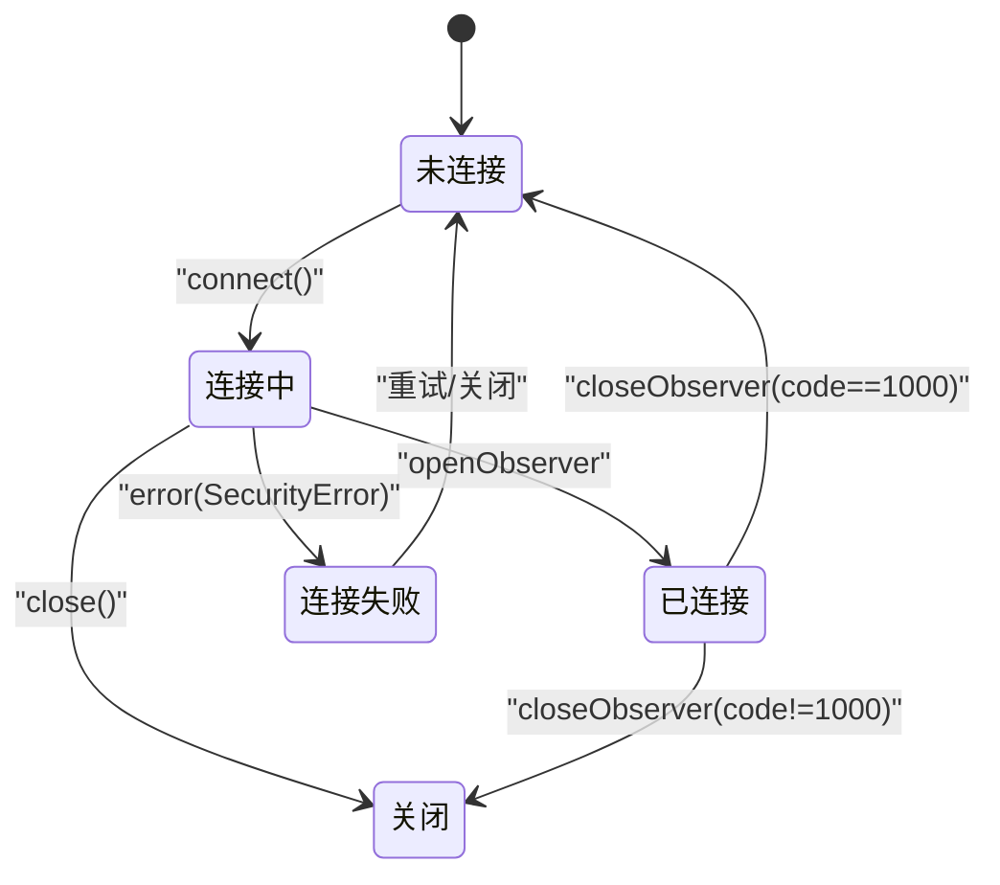
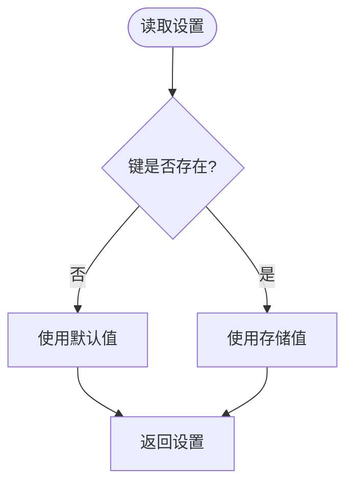
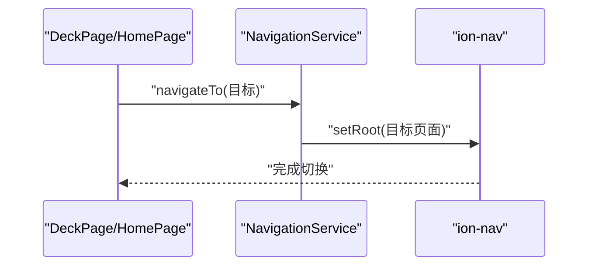
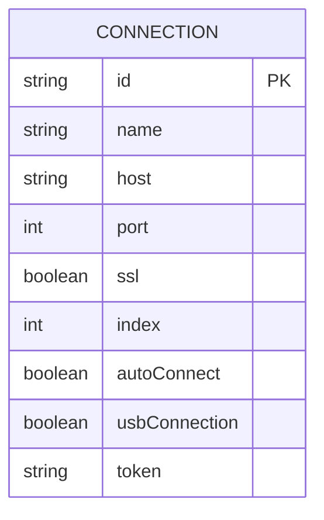
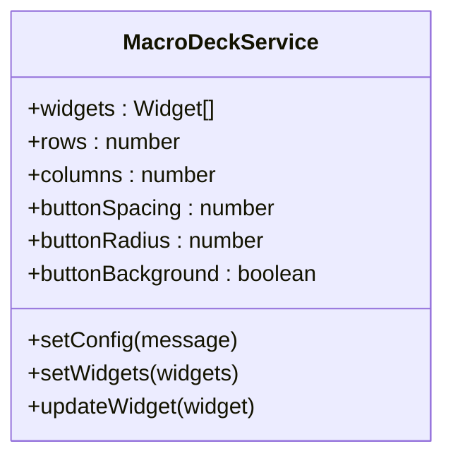
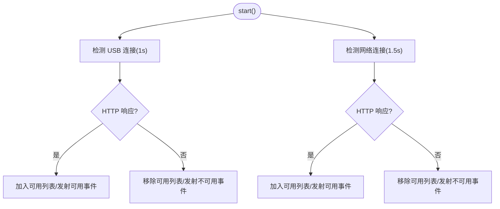
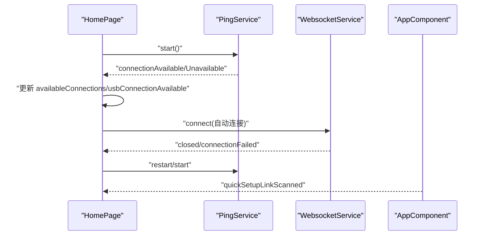
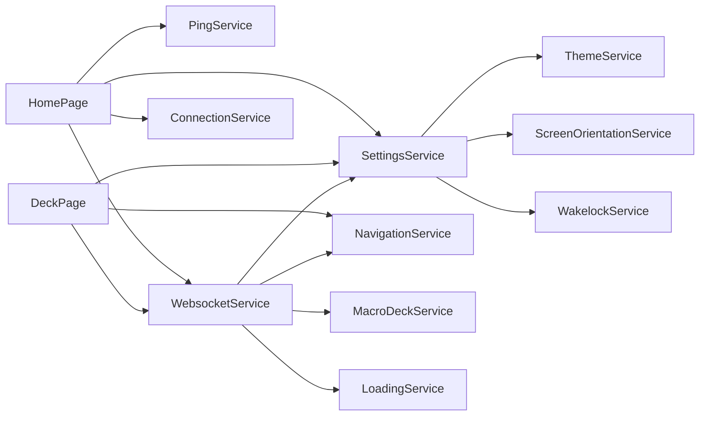

# 状态管理

<cite>
**本文档引用的文件**
- [src/app/app.component.ts](file://src/app/app.component.ts)
- [src/app/services/navigation/navigation.service.ts](file://src/app/services/navigation/navigation.service.ts)
- [src/app/enums/navigation-destination.ts](file://src/app/enums/navigation-destination.ts)
- [src/app/services/settings/settings.service.ts](file://src/app/services/settings/settings.service.ts)
- [src/app/services/connection/connection.service.ts](file://src/app/services/connection/connection.service.ts)
- [src/app/datatypes/connection.ts](file://src/app/datatypes/connection.ts)
- [src/app/services/macro-deck/macro-deck.service.ts](file://src/app/services/macro-deck/macro-deck.service.ts)
- [src/app/services/websocket/websocket.service.ts](file://src/app/services/websocket/websocket.service.ts)
- [src/app/pages/home/home.page.ts](file://src/app/pages/home/home.page.ts)
- [src/app/pages/deck/deck.page.ts](file://src/app/pages/deck/deck.page.ts)
- [src/app/services/ping/ping.service.ts](file://src/app/services/ping/ping.service.ts)
- [src/app/services/loading/loading.service.ts](file://src/app/services/loading/loading.service.ts)
- [src/app/services/wakelock/wakelock.service.ts](file://src/app/services/wakelock/wakelock.service.ts)
- [src/app/services/theme/theme.service.ts](file://src/app/services/theme/theme.service.ts)
- [src/app/services/screen-orientation/screen-orientation.service.ts](file://src/app/services/screen-orientation/screen-orientation.service.ts)
</cite>

## 目录
1. [简介](#简介)
2. [项目结构](#项目结构)
3. [核心组件](#核心组件)
4. [架构总览](#架构总览)
5. [详细组件分析](#详细组件分析)
6. [依赖关系分析](#依赖关系分析)
7. [性能考虑](#性能考虑)
8. [故障排查指南](#故障排查指南)
9. [结论](#结论)
10. [附录](#附录)

## 简介
本文件系统性梳理 Macro-Deck-Client-App 的状态管理模式，覆盖本地状态、全局状态与服务状态的分类与管理策略；解释连接状态、设置状态与导航状态的同步机制；阐述状态变更的触发条件与传播路径；说明状态持久化的实现方式与数据恢复机制；并总结状态管理的设计模式与最佳实践，包括状态不可变性与状态更新的原子性保障。

## 项目结构
应用采用 Angular + Capacitor 架构，页面组件通过服务层协调状态与行为。状态主要分布在以下层次：
- 本地状态：页面组件内的临时 UI 状态与业务流程状态（如连接列表、可用连接集合、菜单按钮可见性等）
- 全局状态：跨页面共享的服务状态（如 WebSocket 连接状态、宏面板配置与微件数据、Ping 检测结果）
- 服务状态：持久化状态（通过本地存储实现的设置项与连接配置）

图表来源
- [src/app/pages/home/home.page.ts:1-551](file://src/app/pages/home/home.page.ts#L1-L551)
- [src/app/pages/deck/deck.page.ts:1-158](file://src/app/pages/deck/deck.page.ts#L1-L158)
- [src/app/services/websocket/websocket.service.ts:1-402](file://src/app/services/websocket/websocket.service.ts#L1-L402)
- [src/app/services/macro-deck/macro-deck.service.ts:1-111](file://src/app/services/macro-deck/macro-deck.service.ts#L1-L111)
- [src/app/services/ping/ping.service.ts:1-228](file://src/app/services/ping/ping.service.ts#L1-L228)
- [src/app/services/navigation/navigation.service.ts:1-86](file://src/app/services/navigation/navigation.service.ts#L1-L86)
- [src/app/services/settings/settings.service.ts:1-389](file://src/app/services/settings/settings.service.ts#L1-L389)
- [src/app/services/connection/connection.service.ts:1-179](file://src/app/services/connection/connection.service.ts#L1-L179)
- [src/app/services/loading/loading.service.ts:1-87](file://src/app/services/loading/loading.service.ts#L1-L87)
- [src/app/services/wakelock/wakelock.service.ts:1-105](file://src/app/services/wakelock/wakelock.service.ts#L1-L105)
- [src/app/services/theme/theme.service.ts:1-104](file://src/app/services/theme/theme.service.ts#L1-L104)
- [src/app/services/screen-orientation/screen-orientation.service.ts:1-105](file://src/app/services/screen-orientation/screen-orientation.service.ts#L1-L105)

章节来源
- [src/app/app.component.ts:1-127](file://src/app/app.component.ts#L1-L127)
- [src/app/services/navigation/navigation.service.ts:1-86](file://src/app/services/navigation/navigation.service.ts#L1-L86)
- [src/app/enums/navigation-destination.ts:1-15](file://src/app/enums/navigation-destination.ts#L1-L15)

## 核心组件
- 连接状态（全局状态）
  - WebsocketService 提供连接生命周期状态（连接中/已连接/关闭/错误）、事件发射（connected/closed/connectionLost/connectionFailed）以及与协议处理的集成
- 设置状态（持久化状态）
  - SettingsService 提供主题、屏幕方向、屏幕常亮、外观、USB 连接参数、按钮长按延迟、客户端 ID 等设置的读写与默认值
- 导航状态（全局状态）
  - NavigationService 提供页面跳转能力，根据环境选择不同根页面组件
- 服务状态（持久化状态）
  - ConnectionService 提供连接配置的增删改查与持久化存储
- 本地状态（页面组件）
  - HomePage/DeckPage 维护 UI 与流程相关的本地状态（连接列表、可用连接、菜单按钮可见性等）

章节来源
- [src/app/services/websocket/websocket.service.ts:1-402](file://src/app/services/websocket/websocket.service.ts#L1-L402)
- [src/app/services/settings/settings.service.ts:1-389](file://src/app/services/settings/settings.service.ts#L1-L389)
- [src/app/services/connection/connection.service.ts:1-179](file://src/app/services/connection/connection.service.ts#L1-L179)
- [src/app/services/navigation/navigation.service.ts:1-86](file://src/app/services/navigation/navigation.service.ts#L1-L86)
- [src/app/pages/home/home.page.ts:1-551](file://src/app/pages/home/home.page.ts#L1-L551)
- [src/app/pages/deck/deck.page.ts:1-158](file://src/app/pages/deck/deck.page.ts#L1-L158)

## 架构总览
应用通过服务层统一管理状态，页面组件通过订阅服务事件与调用服务方法实现状态同步。连接状态通过 WebSocket 事件驱动导航与加载弹窗；设置状态通过服务读取影响系统行为（主题、屏幕方向、屏幕常亮）；连接配置通过本地存储持久化并在页面加载时恢复。

图表来源
- [src/app/pages/home/home.page.ts:1-551](file://src/app/pages/home/home.page.ts#L1-L551)
- [src/app/services/websocket/websocket.service.ts:1-402](file://src/app/services/websocket/websocket.service.ts#L1-L402)
- [src/app/services/navigation/navigation.service.ts:1-86](file://src/app/services/navigation/navigation.service.ts#L1-L86)
- [src/app/services/settings/settings.service.ts:1-389](file://src/app/services/settings/settings.service.ts#L1-L389)

## 详细组件分析

### 连接状态管理（WebsocketService）
- 状态字段
  - 连接标志：isConnected、connecting、closing
  - 连接配置：url、connection
  - 事件发射：connected、closed、connectionLost、connectionFailed
- 生命周期与事件
  - 连接建立：openObserver 触发 connected，发送握手消息，更新连接计数与上次连接
  - 连接关闭：closeObserver 触发 closed，区分正常关闭与异常关闭，异常时根据环境与当前连接状态决定导航至连接丢失或首页
  - 连接失败：error 回调中处理安全错误（SSL 证书问题）并弹窗提示
- 与导航/设置/协议的协作
  - 成功连接后设置 WebSocket 主题给协议处理器，导航至控制面板
  - 失败时发射 connectionFailed，由页面弹窗展示错误详情
  - 关闭时根据状态导航至首页或连接丢失页面

图表来源
- [src/app/services/websocket/websocket.service.ts:1-402](file://src/app/services/websocket/websocket.service.ts#L1-L402)

章节来源
- [src/app/services/websocket/websocket.service.ts:1-402](file://src/app/services/websocket/websocket.service.ts#L1-L402)

### 设置状态管理（SettingsService）
- 持久化键值
  - 客户端 ID、屏幕常亮、按钮长按延迟、屏幕方向、连接计数、上次连接、跳过 SSL、菜单按钮可见性、外观、USB 自动连接、USB 端口、USB 使用 SSL、按钮微件边框样式
- 默认值与读取
  - 大多数设置提供默认值，读取时若不存在返回默认值
- 生成与恢复
  - 客户端 ID 在首次访问时生成并持久化，后续直接读取
- 与其他服务的耦合
  - WebsocketService 在连接成功后写入连接计数与上次连接
  - ThemeService/ScreenOrientationService/WakelockService 读取设置以更新系统行为

图表来源
- [src/app/services/settings/settings.service.ts:1-389](file://src/app/services/settings/settings.service.ts#L1-L389)

章节来源
- [src/app/services/settings/settings.service.ts:1-389](file://src/app/services/settings/settings.service.ts#L1-L389)

### 导航状态管理（NavigationService）
- 导航目标
  - Home、Deck、ConnectionLost 三类页面
- 页面选择
  - 根据环境变量选择 WebHomePage 或 HomePage 作为首页
- 跳转实现
  - 使用 ion-nav 的 setRoot 实现页面切换，动画关闭以保证切换流畅

图表来源
- [src/app/services/navigation/navigation.service.ts:1-86](file://src/app/services/navigation/navigation.service.ts#L1-L86)
- [src/app/enums/navigation-destination.ts:1-15](file://src/app/enums/navigation-destination.ts#L1-L15)

章节来源
- [src/app/services/navigation/navigation.service.ts:1-86](file://src/app/services/navigation/navigation.service.ts#L1-L86)
- [src/app/enums/navigation-destination.ts:1-15](file://src/app/enums/navigation-destination.ts#L1-L15)

### 服务状态管理（ConnectionService）
- 数据模型
  - Connection 接口包含 id、name、host、port、ssl、index、autoConnect、usbConnection、token 等字段
- 持久化策略
  - 连接列表以 JSON 字符串形式存储于本地存储，键名为 connections
  - 新增连接时生成基于时间戳的 id 与顺序索引；更新连接时按 id 替换；删除连接时移除对应条目
- 与设置的协作
  - USB 连接配置来源于 SettingsService 的相关设置项

图表来源
- [src/app/datatypes/connection.ts:1-33](file://src/app/datatypes/connection.ts#L1-L33)
- [src/app/services/connection/connection.service.ts:1-179](file://src/app/services/connection/connection.service.ts#L1-L179)

章节来源
- [src/app/services/connection/connection.service.ts:1-179](file://src/app/services/connection/connection.service.ts#L1-L179)
- [src/app/datatypes/connection.ts:1-33](file://src/app/datatypes/connection.ts#L1-L33)

### 宏面板状态管理（MacroDeckService）
- 面板配置
  - 行数、列数、按钮间距、圆角半径、按钮背景等
- 微件数据
  - widgets 数组维护当前面板微件；支持整体替换与按坐标更新
- 事件驱动
  - configUpdate 事件用于通知视图刷新面板配置
  - interaction 事件用于上报用户交互

图表来源
- [src/app/services/macro-deck/macro-deck.service.ts:1-111](file://src/app/services/macro-deck/macro-deck.service.ts#L1-L111)

章节来源
- [src/app/services/macro-deck/macro-deck.service.ts:1-111](file://src/app/services/macro-deck/macro-deck.service.ts#L1-L111)

### Ping 状态管理（PingService）
- 状态字段
  - availableConnections：可用连接 id 列表
  - usbConnectionAvailable：USB 连接可用性
- 定时检测
  - 对 USB 连接每 1 秒检测一次，对网络连接每 1.5 秒检测一次
  - 超时 800ms 视为不可用
- 事件发射
  - connectionAvailable/connectionUnavailable 事件用于通知连接可用性变化

图表来源
- [src/app/services/ping/ping.service.ts:1-228](file://src/app/services/ping/ping.service.ts#L1-L228)

章节来源
- [src/app/services/ping/ping.service.ts:1-228](file://src/app/services/ping/ping.service.ts#L1-L228)

### 页面本地状态与同步机制
- HomePage
  - 本地状态：savedConnections、availableConnections、usbConnectionAvailable、savedConnectionsInitialized
  - 同步机制：订阅 PingService 的连接可用/不可用事件，自动连接 USB 或已保存的自动连接；订阅 WebSocket 的 closed 与 connectionFailed 事件；订阅深度链接扫描事件
- DeckPage
  - 本地状态：showMenuButton、clientId、version
  - 同步机制：进入页面检查连接状态，未连接则导航回首页；加载设置以控制菜单按钮可见性

图表来源
- [src/app/pages/home/home.page.ts:1-551](file://src/app/pages/home/home.page.ts#L1-L551)
- [src/app/services/ping/ping.service.ts:1-228](file://src/app/services/ping/ping.service.ts#L1-L228)
- [src/app/services/websocket/websocket.service.ts:1-402](file://src/app/services/websocket/websocket.service.ts#L1-L402)
- [src/app/app.component.ts:1-127](file://src/app/app.component.ts#L1-L127)

章节来源
- [src/app/pages/home/home.page.ts:1-551](file://src/app/pages/home/home.page.ts#L1-L551)
- [src/app/pages/deck/deck.page.ts:1-158](file://src/app/pages/deck/deck.page.ts#L1-L158)

## 依赖关系分析
- 低耦合高内聚
  - 各服务独立封装状态与行为，页面仅通过订阅事件与调用方法交互
- 事件驱动
  - WebsocketService/PingService/MacroDeckService 通过 EventEmitter 发射状态变化，页面与服务响应
- 持久化解耦
  - SettingsService/ConnectionService 将持久化细节封装在服务内部，页面仅感知读写接口

图表来源
- [src/app/pages/home/home.page.ts:1-551](file://src/app/pages/home/home.page.ts#L1-L551)
- [src/app/pages/deck/deck.page.ts:1-158](file://src/app/pages/deck/deck.page.ts#L1-L158)
- [src/app/services/websocket/websocket.service.ts:1-402](file://src/app/services/websocket/websocket.service.ts#L1-L402)
- [src/app/services/ping/ping.service.ts:1-228](file://src/app/services/ping/ping.service.ts#L1-L228)
- [src/app/services/macro-deck/macro-deck.service.ts:1-111](file://src/app/services/macro-deck/macro-deck.service.ts#L1-L111)
- [src/app/services/navigation/navigation.service.ts:1-86](file://src/app/services/navigation/navigation.service.ts#L1-L86)
- [src/app/services/settings/settings.service.ts:1-389](file://src/app/services/settings/settings.service.ts#L1-L389)
- [src/app/services/connection/connection.service.ts:1-179](file://src/app/services/connection/connection.service.ts#L1-L179)
- [src/app/services/loading/loading.service.ts:1-87](file://src/app/services/loading/loading.service.ts#L1-L87)
- [src/app/services/wakelock/wakelock.service.ts:1-105](file://src/app/services/wakelock/wakelock.service.ts#L1-L105)
- [src/app/services/theme/theme.service.ts:1-104](file://src/app/services/theme/theme.service.ts#L1-L104)
- [src/app/services/screen-orientation/screen-orientation.service.ts:1-105](file://src/app/services/screen-orientation/screen-orientation.service.ts#L1-L105)

## 性能考虑
- Ping 检测频率
  - USB 连接 1 秒间隔，网络连接 1.5 秒间隔，超时 800ms，平衡了实时性与资源消耗
- 事件订阅管理
  - 页面在进入/离开时正确注册与注销订阅，避免内存泄漏
- 加载弹窗
  - LoadingService 在每次显示前先关闭旧弹窗，避免叠加与阻塞
- 导航切换
  - NavigationService 使用 setRoot，关闭动画减少过渡开销

## 故障排查指南
- 连接失败
  - 检查 WebsocketService 的 connectionFailed 事件，查看错误详情；确认 SSL 配置与证书状态
- 连接丢失
  - WebsocketService 的 connectionLost 事件用于 Web 版本；原生版本在连接断开时导航至连接丢失页面
- 深度链接快速设置
  - AppComponent 监听 appUrlOpen 事件，解析 quick-setup 数据并发射 quickSetupLinkScanned 事件，HomePage 订阅后打开新增连接弹窗
- 加载弹窗无法关闭
  - 确认 LoadingService 的 canceled 事件是否被消费；确保在取消时调用 close() 关闭 WebSocket
- 屏幕常亮/主题/屏幕方向无效
  - 检查 WakelockService/ThemeService/ScreenOrientationService 的设置读取与平台支持情况

章节来源
- [src/app/services/websocket/websocket.service.ts:1-402](file://src/app/services/websocket/websocket.service.ts#L1-L402)
- [src/app/app.component.ts:1-127](file://src/app/app.component.ts#L1-L127)
- [src/app/services/loading/loading.service.ts:1-87](file://src/app/services/loading/loading.service.ts#L1-L87)
- [src/app/services/wakelock/wakelock.service.ts:1-105](file://src/app/services/wakelock/wakelock.service.ts#L1-L105)
- [src/app/services/theme/theme.service.ts:1-104](file://src/app/services/theme/theme.service.ts#L1-L104)
- [src/app/services/screen-orientation/screen-orientation.service.ts:1-105](file://src/app/services/screen-orientation/screen-orientation.service.ts#L1-L105)

## 结论
本应用采用“服务层集中管理 + 页面订阅响应”的状态管理模式，将连接状态、设置状态与导航状态清晰分离，并通过事件驱动实现跨组件同步。持久化状态通过本地存储实现，配合默认值与惰性生成策略，确保数据恢复与兼容性。建议在后续迭代中进一步引入状态不可变性与原子性更新的约束，以提升复杂场景下的可维护性与可预测性。

## 附录
- 设计模式与最佳实践
  - 状态不可变性：在更新宏面板微件时，优先创建新对象或新数组，避免就地修改导致的副作用
  - 原子性更新：批量更新设置或连接列表时，使用事务式写入（当前通过一次性 JSON 序列化写入实现，建议在需要更强一致性时引入锁或队列）
  - 事件命名规范：统一使用语义化事件名（如 connectionAvailable），便于调试与追踪
  - 错误边界：在 WebSocket 错误处理中明确区分安全错误与网络错误，分别采取弹窗与导航策略