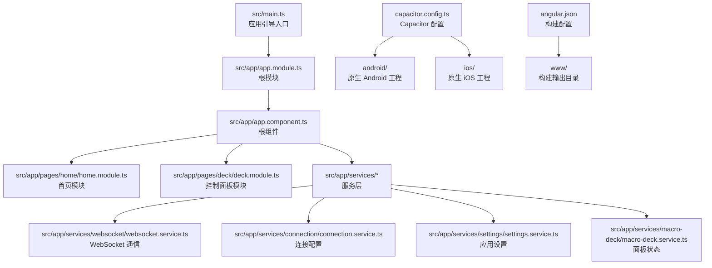
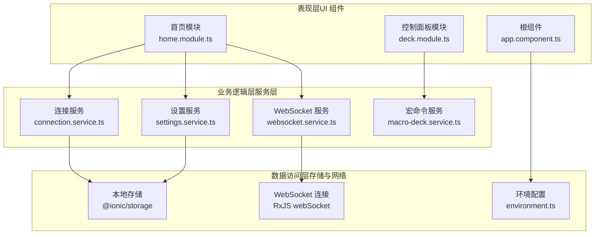
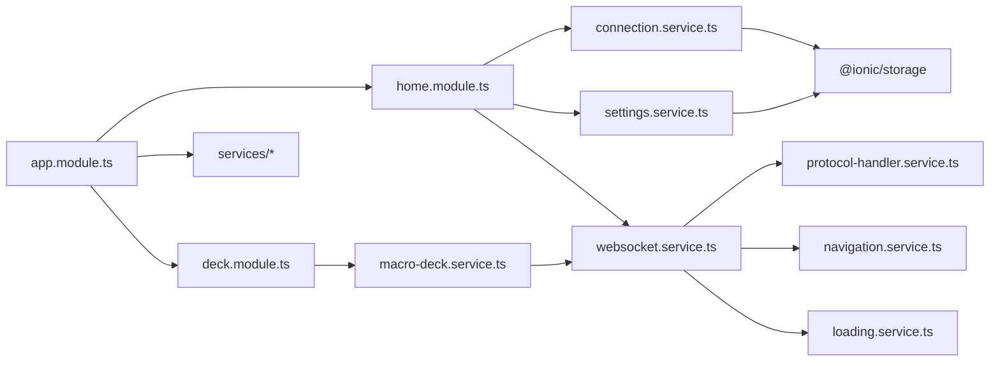

# 整体架构概览

<cite>
**本文档引用的文件**
- [package.json](file://package.json)
- [angular.json](file://angular.json)
- [capacitor.config.ts](file://capacitor.config.ts)
- [src/main.ts](file://src/main.ts)
- [src/app/app.module.ts](file://src/app/app.module.ts)
- [src/app/app.component.ts](file://src/app/app.component.ts)
- [src/app/services/connection/connection.service.ts](file://src/app/services/connection/connection.service.ts)
- [src/app/services/macro-deck/macro-deck.service.ts](file://src/app/services/macro-deck/macro-deck.service.ts)
- [src/app/services/websocket/websocket.service.ts](file://src/app/services/websocket/websocket.service.ts)
- [src/app/services/settings/settings.service.ts](file://src/app/services/settings/settings.service.ts)
- [src/app/pages/home/home.module.ts](file://src/app/pages/home/home.module.ts)
- [src/app/pages/deck/deck.module.ts](file://src/app/pages/deck/deck.module.ts)
- [src/app/datatypes/connection.ts](file://src/app/datatypes/connection.ts)
- [src/app/datatypes/widgets/widget.ts](file://src/app/datatypes/widgets/widget.ts)
- [src/environments/environment.ts](file://src/environments/environment.ts)
</cite>

## 目录
1. [简介](#简介)
2. [项目结构](#项目结构)
3. [核心组件](#核心组件)
4. [架构总览](#架构总览)
5. [详细组件分析](#详细组件分析)
6. [依赖关系分析](#依赖关系分析)
7. [性能考虑](#性能考虑)
8. [故障排查指南](#故障排查指南)
9. [结论](#结论)
10. [附录](#附录)

## 简介
本项目采用 Angular + Ionic + Capacitor 的混合移动开发架构，结合 Web 技术栈与原生能力，实现一套可在 Web、Android、iOS 平台运行的统一代码库。该架构以三层分离为核心：表现层（UI 组件）、业务逻辑层（服务层）、数据访问层（存储与网络），并通过模块化组织提升可维护性与可扩展性。同时，通过环境配置与构建系统区分 Web 与原生平台差异，满足多端部署需求。

## 项目结构
项目采用 Angular 单页应用（SPA）结构，配合 Capacitor 将 Web 构建产物桥接到原生平台。核心目录与职责如下：
- src/app：应用主体，包含页面、组件、服务、数据类型与模块
- src/environments：环境配置，区分 Web 与原生、开发与生产
- android/、ios/：原生工程，由 Capacitor 管理
- resources/：平台资源与网络策略配置
- 其他根级配置文件：包管理、构建、服务工作线程等

图表来源
- [src/main.ts:1-27](file://src/main.ts#L1-L27)
- [src/app/app.module.ts:1-87](file://src/app/app.module.ts#L1-L87)
- [src/app/app.component.ts:1-127](file://src/app/app.component.ts#L1-L127)
- [src/app/pages/home/home.module.ts:1-76](file://src/app/pages/home/home.module.ts#L1-L76)
- [src/app/pages/deck/deck.module.ts:1-44](file://src/app/pages/deck/deck.module.ts#L1-L44)
- [src/app/services/websocket/websocket.service.ts:1-402](file://src/app/services/websocket/websocket.service.ts#L1-L402)
- [src/app/services/connection/connection.service.ts:1-179](file://src/app/services/connection/connection.service.ts#L1-L179)
- [src/app/services/settings/settings.service.ts:1-389](file://src/app/services/settings/settings.service.ts#L1-L389)
- [src/app/services/macro-deck/macro-deck.service.ts:1-111](file://src/app/services/macro-deck/macro-deck.service.ts#L1-L111)
- [capacitor.config.ts:1-16](file://capacitor.config.ts#L1-L16)
- [angular.json:1-203](file://angular.json#L1-L203)

章节来源
- [package.json:1-92](file://package.json#L1-L92)
- [angular.json:1-203](file://angular.json#L1-L203)
- [capacitor.config.ts:1-16](file://capacitor.config.ts#L1-L16)
- [src/main.ts:1-27](file://src/main.ts#L1-L27)
- [src/app/app.module.ts:1-87](file://src/app/app.module.ts#L1-L87)
- [src/app/app.component.ts:1-127](file://src/app/app.component.ts#L1-L127)

## 核心组件
- 应用引导与模块
  - 引导入口：通过主程序引导 Angular 根模块，按环境启用生产模式
  - 根模块：集中导入页面模块、组件、服务与第三方库，配置 Service Worker
  - 根组件：初始化存储、屏幕方向、唤醒锁、主题；监听深度链接并支持快速设置
- 页面与模块
  - 首页模块：包含连接管理、扫描网络接口、二维码扫描等子模态
  - 控制面板模块：展示微件网格与内容组件
- 服务层
  - 连接服务：管理连接配置的增删改查与持久化
  - 设置服务：管理应用设置项与客户端标识
  - WebSocket 服务：封装连接、消息收发、错误处理与导航
  - 宏命令服务：管理面板配置与微件状态
- 数据类型
  - 连接配置：描述主机、端口、SSL、自动连接等
  - 微件：描述位置、尺寸、内容类型与具体数据

章节来源
- [src/main.ts:1-27](file://src/main.ts#L1-L27)
- [src/app/app.module.ts:1-87](file://src/app/app.module.ts#L1-L87)
- [src/app/app.component.ts:1-127](file://src/app/app.component.ts#L1-L127)
- [src/app/pages/home/home.module.ts:1-76](file://src/app/pages/home/home.module.ts#L1-L76)
- [src/app/pages/deck/deck.module.ts:1-44](file://src/app/pages/deck/deck.module.ts#L1-L44)
- [src/app/services/connection/connection.service.ts:1-179](file://src/app/services/connection/connection.service.ts#L1-L179)
- [src/app/services/settings/settings.service.ts:1-389](file://src/app/services/settings/settings.service.ts#L1-L389)
- [src/app/services/websocket/websocket.service.ts:1-402](file://src/app/services/websocket/websocket.service.ts#L1-L402)
- [src/app/services/macro-deck/macro-deck.service.ts:1-111](file://src/app/services/macro-deck/macro-deck.service.ts#L1-L111)
- [src/app/datatypes/connection.ts:1-33](file://src/app/datatypes/connection.ts#L1-L33)
- [src/app/datatypes/widgets/widget.ts:1-33](file://src/app/datatypes/widgets/widget.ts#L1-L33)

## 架构总览
整体架构采用“表现层-业务层-数据层”的分层设计，并通过模块化与服务注入实现高内聚低耦合。跨平台通过 Capacitor 将 Web 构建产物桥接到原生平台，同时利用环境变量区分 Web 与原生行为。

图表来源
- [src/app/pages/home/home.module.ts:1-76](file://src/app/pages/home/home.module.ts#L1-L76)
- [src/app/pages/deck/deck.module.ts:1-44](file://src/app/pages/deck/deck.module.ts#L1-L44)
- [src/app/app.component.ts:1-127](file://src/app/app.component.ts#L1-L127)
- [src/app/services/connection/connection.service.ts:1-179](file://src/app/services/connection/connection.service.ts#L1-L179)
- [src/app/services/settings/settings.service.ts:1-389](file://src/app/services/settings/settings.service.ts#L1-L389)
- [src/app/services/websocket/websocket.service.ts:1-402](file://src/app/services/websocket/websocket.service.ts#L1-L402)
- [src/app/services/macro-deck/macro-deck.service.ts:1-111](file://src/app/services/macro-deck/macro-deck.service.ts#L1-L111)
- [src/environments/environment.ts:1-36](file://src/environments/environment.ts#L1-L36)

## 详细组件分析

### 表现层（UI 组件）
- 首页模块：聚合连接管理、连接中、连接失败、连接丢失、不安全连接、网络接口扫描、二维码扫描等子组件，形成完整的连接流程 UI
- 控制面板模块：包含网格布局与微件内容组件，承载来自服务层的状态与事件
- 根组件：依据环境变量选择 Web/Home 页面作为根组件；初始化存储、屏幕方向、唤醒锁、主题；监听深度链接并触发快速设置事件

章节来源
- [src/app/pages/home/home.module.ts:1-76](file://src/app/pages/home/home.module.ts#L1-L76)
- [src/app/pages/deck/deck.module.ts:1-44](file://src/app/pages/deck/deck.module.ts#L1-L44)
- [src/app/app.component.ts:1-127](file://src/app/app.component.ts#L1-L127)

### 业务逻辑层（服务层）
- 连接服务：提供连接配置的增删改查与持久化，支持 USB 连接参数读取
- 设置服务：提供应用设置项的读写，包括外观、屏幕方向、唤醒锁、USB 参数、客户端 ID 等
- WebSocket 服务：封装连接生命周期、消息订阅、错误处理、导航与认证握手
- 宏命令服务：维护面板配置与微件列表，发布配置更新与交互事件

章节来源
- [src/app/services/connection/connection.service.ts:1-179](file://src/app/services/connection/connection.service.ts#L1-L179)
- [src/app/services/settings/settings.service.ts:1-389](file://src/app/services/settings/settings.service.ts#L1-L389)
- [src/app/services/websocket/websocket.service.ts:1-402](file://src/app/services/websocket/websocket.service.ts#L1-L402)
- [src/app/services/macro-deck/macro-deck.service.ts:1-111](file://src/app/services/macro-deck/macro-deck.service.ts#L1-L111)

### 数据访问层（存储与网络）
- 本地存储：使用 Ionic Storage 提供键值对持久化，支撑连接列表、设置项与客户端标识
- 网络通信：基于 RxJS webSocket 实现双向通信，支持 WSS/WS，集成协议处理与错误弹窗
- 环境配置：通过环境文件区分 Web 与原生、开发与生产，影响构建与运行时行为

章节来源
- [src/app/services/connection/connection.service.ts:1-179](file://src/app/services/connection/connection.service.ts#L1-L179)
- [src/app/services/websocket/websocket.service.ts:1-402](file://src/app/services/websocket/websocket.service.ts#L1-L402)
- [src/environments/environment.ts:1-36](file://src/environments/environment.ts#L1-L36)

### 跨平台架构设计
- Web 与原生统一代码库：通过环境配置与构建系统区分 Web 与原生差异，共享 UI 与业务逻辑
- Capacitor 桥接：将 Web 构建产物（www 目录）桥接到 Android/iOS 原生工程，提供原生能力调用与平台特性
- 平台特定行为：例如 Android 上的 SSL 验证跳过、深度链接监听、屏幕方向与唤醒锁等

章节来源
- [capacitor.config.ts:1-16](file://capacitor.config.ts#L1-L16)
- [angular.json:1-203](file://angular.json#L1-L203)
- [src/app/app.component.ts:1-127](file://src/app/app.component.ts#L1-L127)

### 可扩展性与模块化原则
- 模块化：页面与功能拆分为独立模块，按需导入，降低耦合度
- 服务注入：通过 Angular DI 注入各服务，便于替换与测试
- 环境隔离：通过环境文件与构建配置隔离平台差异
- 插件化：Capacitor 插件与自定义插件（如 SSL 处理）按需引入

章节来源
- [src/app/app.module.ts:1-87](file://src/app/app.module.ts#L1-L87)
- [package.json:1-92](file://package.json#L1-L92)

## 依赖关系分析

图表来源
- [src/app/app.module.ts:1-87](file://src/app/app.module.ts#L1-L87)
- [src/app/pages/home/home.module.ts:1-76](file://src/app/pages/home/home.module.ts#L1-L76)
- [src/app/pages/deck/deck.module.ts:1-44](file://src/app/pages/deck/deck.module.ts#L1-L44)
- [src/app/services/connection/connection.service.ts:1-179](file://src/app/services/connection/connection.service.ts#L1-L179)
- [src/app/services/settings/settings.service.ts:1-389](file://src/app/services/settings/settings.service.ts#L1-L389)
- [src/app/services/websocket/websocket.service.ts:1-402](file://src/app/services/websocket/websocket.service.ts#L1-L402)
- [src/app/services/macro-deck/macro-deck.service.ts:1-111](file://src/app/services/macro-deck/macro-deck.service.ts#L1-L111)

## 性能考虑
- 构建优化：生产构建开启输出哈希与体积预算，减少包体并提升缓存命中
- 服务工作线程：在非开发模式下延迟注册，提升首屏性能
- 连接管理：避免重复连接与订阅泄漏，及时释放资源
- 环境区分：Web 与原生差异化配置，减少不必要的原生调用

章节来源
- [angular.json:47-119](file://angular.json#L47-L119)
- [src/app/app.module.ts:31-38](file://src/app/app.module.ts#L31-L38)

## 故障排查指南
- 连接失败与丢失
  - 观察 WebSocket 服务的连接失败与丢失事件，区分 Web 与原生路径
  - 不安全连接场景：出现安全错误时弹出提示，检查 SSL 配置
- 深度链接与快速设置
  - 根组件监听深度链接事件，解析 base64 数据并触发快速设置事件
- 存储与设置
  - 连接列表与设置项均通过本地存储持久化，若异常可重置或检查键名一致性

章节来源
- [src/app/services/websocket/websocket.service.ts:197-229](file://src/app/services/websocket/websocket.service.ts#L197-L229)
- [src/app/app.component.ts:58-67](file://src/app/app.component.ts#L58-L67)
- [src/app/services/connection/connection.service.ts:40-101](file://src/app/services/connection/connection.service.ts#L40-L101)
- [src/app/services/settings/settings.service.ts:224-246](file://src/app/services/settings/settings.service.ts#L224-L246)

## 结论
该架构以 Angular + Ionic + Capacitor 为基础，实现了 Web 与原生平台的统一代码库与一致用户体验。通过三层分离与模块化设计，提升了系统的可维护性与可扩展性；通过环境与构建配置的差异化，兼顾了多端部署需求。建议持续关注构建体积与连接稳定性，进一步完善错误监控与日志体系。

## 附录
- 技术选型与权衡
  - Angular：成熟的前端框架，生态丰富，利于团队协作与长期维护
  - Ionic：提供移动端 UI 组件与原生桥接能力，降低跨平台开发成本
  - Capacitor：将 Web 产物桥接至原生平台，保持统一代码库的同时获得原生能力
  - RxJS：用于 WebSocket 通信与事件流管理，提升异步处理能力
- 架构决策要点
  - 分层清晰：UI、服务、数据三层职责明确，便于测试与演进
  - 模块化：页面与功能模块解耦，支持增量开发与按需加载
  - 环境隔离：通过环境与构建配置隔离平台差异，保证一致性