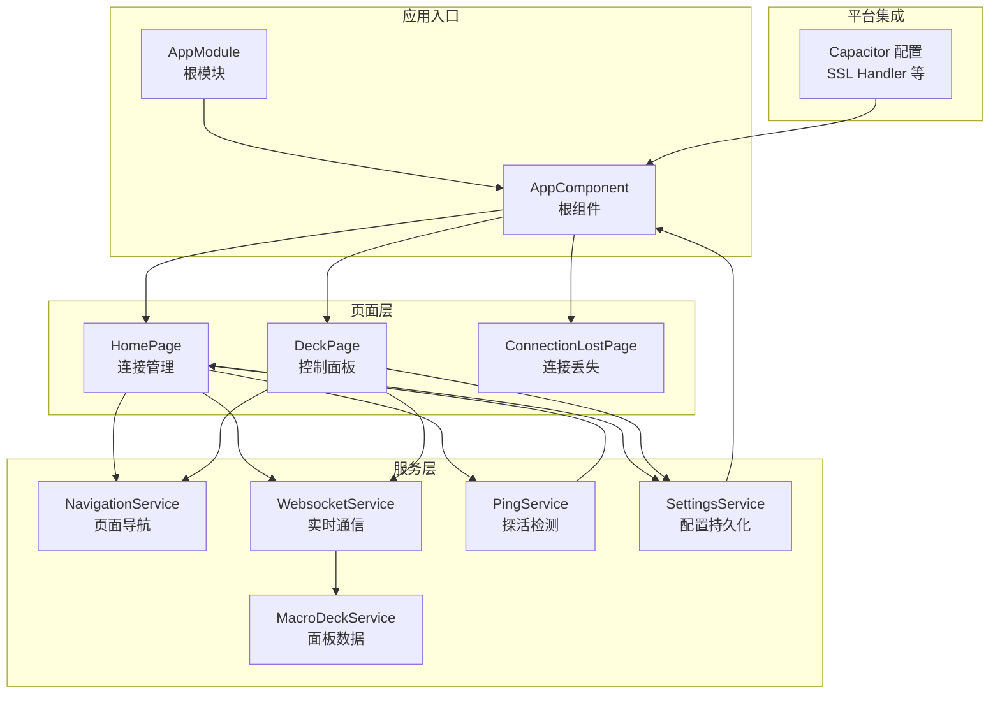
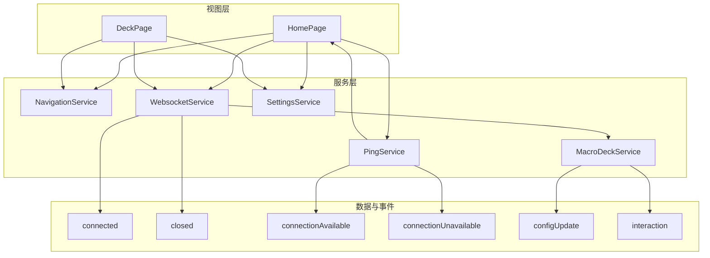
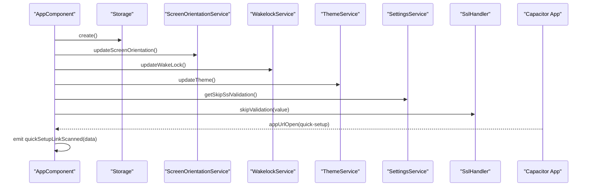
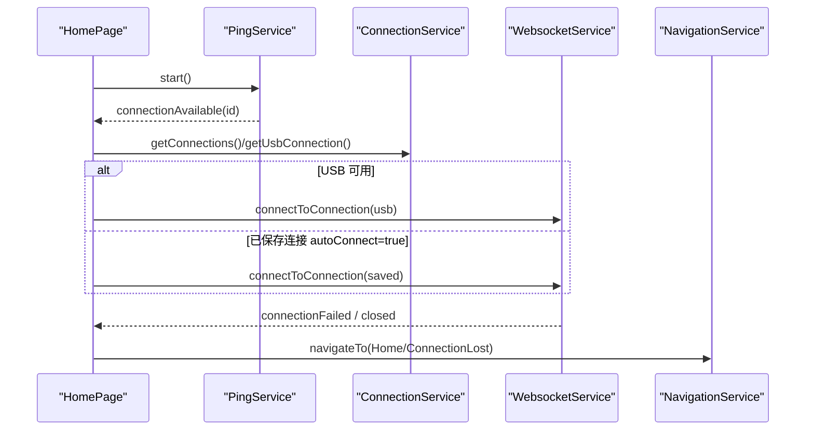
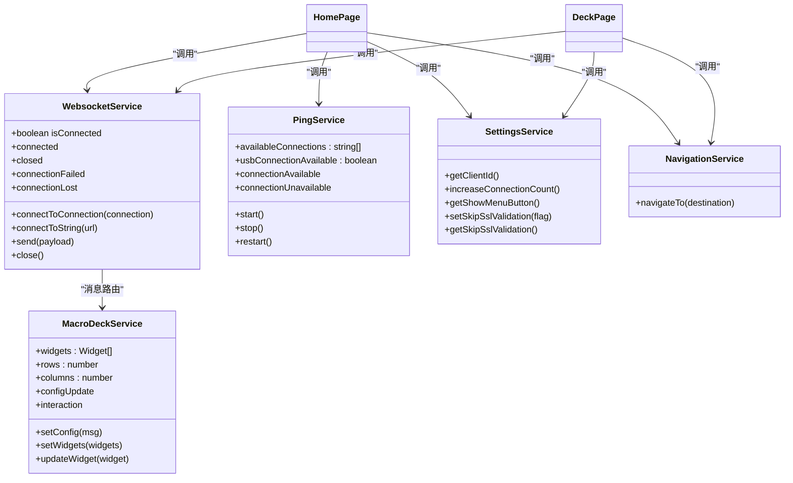
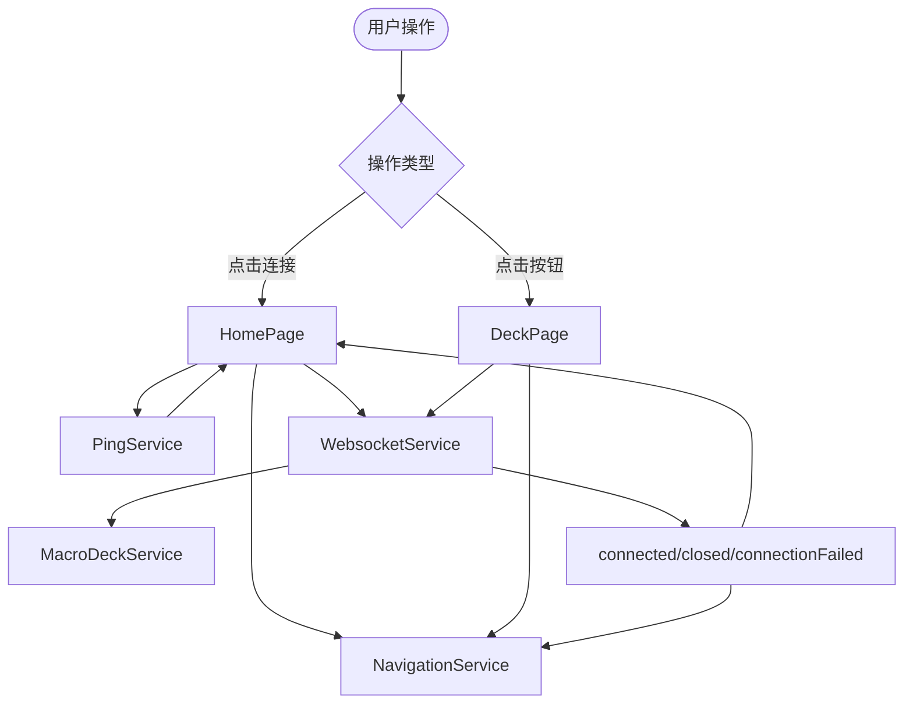
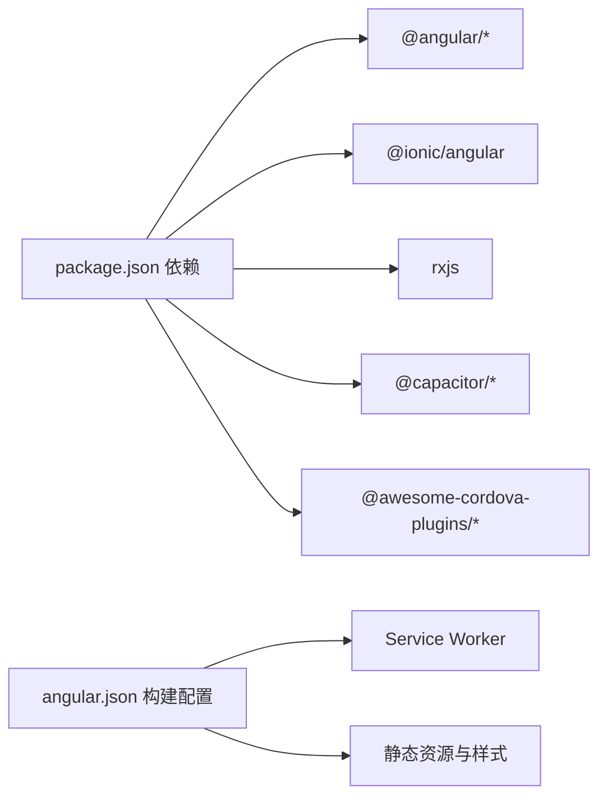

# 架构设计

<cite>
**本文档引用的文件**
- [src/app/app.component.ts](file://src/app/app.component.ts)
- [src/app/app.module.ts](file://src/app/app.module.ts)
- [src/app/pages/home/home.page.ts](file://src/app/pages/home/home.page.ts)
- [src/app/pages/deck/deck.page.ts](file://src/app/pages/deck/deck.page.ts)
- [src/app/services/navigation/navigation.service.ts](file://src/app/services/navigation/navigation.service.ts)
- [src/app/services/websocket/websocket.service.ts](file://src/app/services/websocket/websocket.service.ts)
- [src/app/services/macro-deck/macro-deck.service.ts](file://src/app/services/macro-deck/macro-deck.service.ts)
- [src/app/services/ping/ping.service.ts](file://src/app/services/ping/ping.service.ts)
- [src/app/services/settings/settings.service.ts](file://src/app/services/settings/settings.service.ts)
- [src/app/services/settings/settings.service.ts](file://src/app/services/settings/settings.service.ts)
- [src/app/datatypes/connection.ts](file://src/app/datatypes/connection.ts)
- [src/app/enums/navigation-destination.ts](file://src/app/enums/navigation-destination.ts)
- [src/app/widget-content-components/widget-content-components.module.ts](file://src/app/widget-content-components/widget-content-components.module.ts)
- [package.json](file://package.json)
- [angular.json](file://angular.json)
- [capacitor.config.ts](file://capacitor.config.ts)
</cite>

## 目录
1. [简介](#简介)
2. [项目结构](#项目结构)
3. [核心组件](#核心组件)
4. [架构总览](#架构总览)
5. [详细组件分析](#详细组件分析)
6. [依赖分析](#依赖分析)
7. [性能考虑](#性能考虑)
8. [故障排查指南](#故障排查指南)
9. [结论](#结论)
10. [附录](#附录)

## 简介
本项目为 Macro-Deck-Client-App，采用 Angular + Ionic + Capacitor 技术栈构建，支持 Web 与原生平台（Android/iOS）。系统采用模块化设计与服务导向架构，结合响应式编程模型（RxJS）实现异步事件驱动与组件解耦。核心职责包括：
- 应用根组件负责初始化与平台能力集成（如唤醒锁、屏幕方向、主题、SSL 跳过策略、深度链接监听）
- 页面组件负责业务场景展示与交互（首页连接管理、控制面板展示）
- 服务层负责跨组件共享的状态与能力（导航、WebSocket、Ping 探活、设置、宏面板数据）
- 数据流以事件驱动为主，通过服务间发布/订阅与组件生命周期钩子协同工作

## 项目结构
项目采用“按功能域分层 + 模块化”的组织方式：
- 根模块与根组件：集中导入页面模块、服务模块、第三方库与共享组件
- 页面层：Home、Deck、ConnectionLost 等页面模块，每个页面独立模块便于懒加载与维护
- 服务层：连接、导航、WebSocket、Ping、设置、主题、诊断、屏幕方向、唤醒锁等
- 数据类型与枚举：统一定义连接配置、导航目标、微件数据等
- 微件内容组件：按钮微件、空微件等复用组件模块
- 平台集成：Capacitor 配置与插件（如 SSL Handler）

**图表来源**
- [src/app/app.module.ts:18-43](file://src/app/app.module.ts#L18-L43)
- [src/app/app.component.ts:17-68](file://src/app/app.component.ts#L17-L68)
- [src/app/pages/home/home.page.ts:29-317](file://src/app/pages/home/home.page.ts#L29-L317)
- [src/app/pages/deck/deck.page.ts:14-86](file://src/app/pages/deck/deck.page.ts#L14-L86)
- [src/app/services/navigation/navigation.service.ts:9-86](file://src/app/services/navigation/navigation.service.ts#L9-L86)
- [src/app/services/websocket/websocket.service.ts:16-230](file://src/app/services/websocket/websocket.service.ts#L16-L230)
- [src/app/services/ping/ping.service.ts:9-130](file://src/app/services/ping/ping.service.ts#L9-L130)
- [src/app/services/settings/settings.service.ts:22-247](file://src/app/services/settings/settings.service.ts#L22-L247)
- [src/app/services/macro-deck/macro-deck.service.ts:6-66](file://src/app/services/macro-deck/macro-deck.service.ts#L6-L66)
- [capacitor.config.ts:1-16](file://capacitor.config.ts#L1-L16)

**章节来源**
- [src/app/app.module.ts:18-43](file://src/app/app.module.ts#L18-L43)
- [src/app/app.component.ts:17-68](file://src/app/app.component.ts#L17-L68)
- [angular.json:13-121](file://angular.json#L13-L121)
- [package.json:16-57](file://package.json#L16-L57)
- [capacitor.config.ts:1-16](file://capacitor.config.ts#L1-L16)

## 核心组件
- 根组件 AppComponent：负责应用初始化、平台能力配置（唤醒锁、屏幕方向、主题）、SSL 跳过策略、深度链接监听，并根据环境变量决定根页面（Web/Home）
- 根模块 AppModule：集中导入页面模块、Ionic、HTTP、Service Worker、存储、共享组件等，作为应用启动入口
- 页面组件：
  - HomePage：连接管理、Ping 探活、连接弹窗、USB 自动连接、设置弹窗、快速设置深度链接处理
  - DeckPage：控制面板展示、设置弹窗、全屏模式、连接状态检查
- 服务层：
  - NavigationService：基于 ion-nav 的页面切换
  - WebsocketService：WebSocket 连接、消息路由、错误处理、连接状态事件
  - PingService：HTTP 定时探活，输出连接可用/不可用事件
  - SettingsService：本地存储读写、客户端 ID 生成、连接统计、外观与行为配置
  - MacroDeckService：面板配置与微件数据状态管理

**章节来源**
- [src/app/app.component.ts:17-68](file://src/app/app.component.ts#L17-L68)
- [src/app/app.module.ts:18-43](file://src/app/app.module.ts#L18-L43)
- [src/app/pages/home/home.page.ts:29-317](file://src/app/pages/home/home.page.ts#L29-L317)
- [src/app/pages/deck/deck.page.ts:14-86](file://src/app/pages/deck/deck.page.ts#L14-L86)
- [src/app/services/navigation/navigation.service.ts:9-86](file://src/app/services/navigation/navigation.service.ts#L9-L86)
- [src/app/services/websocket/websocket.service.ts:16-230](file://src/app/services/websocket/websocket.service.ts#L16-L230)
- [src/app/services/ping/ping.service.ts:9-130](file://src/app/services/ping/ping.service.ts#L9-L130)
- [src/app/services/settings/settings.service.ts:22-247](file://src/app/services/settings/settings.service.ts#L22-L247)
- [src/app/services/macro-deck/macro-deck.service.ts:6-66](file://src/app/services/macro-deck/macro-deck.service.ts#L6-L66)

## 架构总览
系统采用“模块化 + 服务导向 + 响应式”架构：
- 模块化设计：页面与组件按功能拆分为独立模块，便于懒加载与维护
- 服务导向：将跨组件共享的能力抽象为服务，降低耦合度
- 响应式编程：大量使用 RxJS（interval、switchMap、timeout、Subject、EventEmitter）实现异步事件流
- MVVM 模式：页面组件承担视图模型职责，服务层承载业务逻辑与状态，组件通过输入/输出与服务交互
- 依赖注入：Angular DI 提供服务实例，确保单例与可测试性

**图表来源**
- [src/app/pages/home/home.page.ts:29-317](file://src/app/pages/home/home.page.ts#L29-L317)
- [src/app/pages/deck/deck.page.ts:14-86](file://src/app/pages/deck/deck.page.ts#L14-L86)
- [src/app/services/navigation/navigation.service.ts:9-86](file://src/app/services/navigation/navigation.service.ts#L9-L86)
- [src/app/services/websocket/websocket.service.ts:16-230](file://src/app/services/websocket/websocket.service.ts#L16-L230)
- [src/app/services/ping/ping.service.ts:9-130](file://src/app/services/ping/ping.service.ts#L9-L130)
- [src/app/services/macro-deck/macro-deck.service.ts:6-66](file://src/app/services/macro-deck/macro-deck.service.ts#L6-L66)

## 详细组件分析

### 根组件与根模块
- AppComponent：初始化存储、屏幕方向、唤醒锁、主题；Android 平台根据设置跳过 SSL 校验；监听深度链接并触发快速设置事件
- AppModule：导入页面模块、Ionic、HTTP、Service Worker、存储、共享组件；以 AppComponent 为引导启动

**图表来源**
- [src/app/app.component.ts:46-67](file://src/app/app.component.ts#L46-L67)
- [src/app/app.component.ts:106-125](file://src/app/app.component.ts#L106-L125)

**章节来源**
- [src/app/app.component.ts:17-68](file://src/app/app.component.ts#L17-L68)
- [src/app/app.module.ts:18-43](file://src/app/app.module.ts#L18-L43)

### 页面组件：Home 与 Deck
- HomePage：负责连接列表管理、Ping 探活、连接弹窗、USB 自动连接、设置弹窗、快速设置深度链接处理；通过 NavigationService 在页面间切换
- DeckPage：控制面板展示，检查连接状态并在未连接时返回首页；支持设置弹窗与全屏模式

**图表来源**
- [src/app/pages/home/home.page.ts:89-139](file://src/app/pages/home/home.page.ts#L89-L139)
- [src/app/services/ping/ping.service.ts:36-72](file://src/app/services/ping/ping.service.ts#L36-L72)
- [src/app/services/websocket/websocket.service.ts:63-87](file://src/app/services/websocket/websocket.service.ts#L63-L87)
- [src/app/services/navigation/navigation.service.ts:29-46](file://src/app/services/navigation/navigation.service.ts#L29-L46)

**章节来源**
- [src/app/pages/home/home.page.ts:29-317](file://src/app/pages/home/home.page.ts#L29-L317)
- [src/app/pages/deck/deck.page.ts:14-86](file://src/app/pages/deck/deck.page.ts#L14-L86)

### 服务层：WebSocket、Ping、设置、导航、宏面板
- WebsocketService：封装 WebSocket 连接、消息订阅、错误处理、连接状态事件；在连接成功后发送认证消息
- PingService：对 USB 与网络连接进行周期性 HTTP 探活，输出连接可用/不可用事件
- SettingsService：提供本地存储读写、客户端 ID 生成、连接统计、外观与行为配置
- NavigationService：基于 ion-nav 的页面切换，区分 Web 与原生根页面
- MacroDeckService：管理面板配置与微件数据，提供配置更新与交互事件

**图表来源**
- [src/app/services/websocket/websocket.service.ts:16-230](file://src/app/services/websocket/websocket.service.ts#L16-L230)
- [src/app/services/ping/ping.service.ts:9-130](file://src/app/services/ping/ping.service.ts#L9-L130)
- [src/app/services/settings/settings.service.ts:22-247](file://src/app/services/settings/settings.service.ts#L22-L247)
- [src/app/services/navigation/navigation.service.ts:9-86](file://src/app/services/navigation/navigation.service.ts#L9-L86)
- [src/app/services/macro-deck/macro-deck.service.ts:6-66](file://src/app/services/macro-deck/macro-deck.service.ts#L6-L66)

**章节来源**
- [src/app/services/websocket/websocket.service.ts:16-230](file://src/app/services/websocket/websocket.service.ts#L16-L230)
- [src/app/services/ping/ping.service.ts:9-130](file://src/app/services/ping/ping.service.ts#L9-L130)
- [src/app/services/settings/settings.service.ts:22-247](file://src/app/services/settings/settings.service.ts#L22-L247)
- [src/app/services/navigation/navigation.service.ts:9-86](file://src/app/services/navigation/navigation.service.ts#L9-L86)
- [src/app/services/macro-deck/macro-deck.service.ts:6-66](file://src/app/services/macro-deck/macro-deck.service.ts#L6-L66)

### 数据流向与组件通信
- 父子组件通信：页面组件通过构造函数注入服务，服务通过事件/状态暴露给视图
- 兄弟组件通信：通过共享服务（如 WebsocketService、PingService、SettingsService）进行状态共享
- 服务间依赖：WebsocketService 依赖 SettingsService（客户端 ID、连接统计）、NavigationService（页面切换）、ProtocolHandlerService（消息处理）；HomePage/DeckPage 依赖多个服务协作

**图表来源**
- [src/app/pages/home/home.page.ts:89-139](file://src/app/pages/home/home.page.ts#L89-L139)
- [src/app/pages/deck/deck.page.ts:44-52](file://src/app/pages/deck/deck.page.ts#L44-L52)
- [src/app/services/websocket/websocket.service.ts:141-172](file://src/app/services/websocket/websocket.service.ts#L141-L172)
- [src/app/services/ping/ping.service.ts:36-72](file://src/app/services/ping/ping.service.ts#L36-L72)

**章节来源**
- [src/app/pages/home/home.page.ts:89-139](file://src/app/pages/home/home.page.ts#L89-L139)
- [src/app/pages/deck/deck.page.ts:44-52](file://src/app/pages/deck/deck.page.ts#L44-L52)
- [src/app/services/websocket/websocket.service.ts:141-172](file://src/app/services/websocket/websocket.service.ts#L141-L172)

### 设计模式应用
- MVVM 模式：页面组件承担视图模型职责，服务承载业务逻辑与状态
- 依赖注入：Angular DI 提供服务实例，确保单例与可测试性
- 观察者模式：RxJS Subject/EventEmitter 实现事件发布/订阅，如连接状态、Ping 结果、面板配置更新
- 响应式编程：interval、switchMap、timeout、catchError 等操作符实现异步数据流与错误处理
- 服务导向架构：将连接、导航、设置、探活等功能抽象为服务，降低模块耦合

**章节来源**
- [src/app/services/websocket/websocket.service.ts:16-230](file://src/app/services/websocket/websocket.service.ts#L16-L230)
- [src/app/services/ping/ping.service.ts:9-130](file://src/app/services/ping/ping.service.ts#L9-L130)
- [src/app/services/macro-deck/macro-deck.service.ts:6-66](file://src/app/services/macro-deck/macro-deck.service.ts#L6-L66)

### 技术选型的架构考量
- Angular：提供完善的 DI、组件体系与响应式生态，适合复杂交互与状态管理
- Ionic：提供移动端 UI 组件与跨平台打包能力，适配 Web 与原生
- Capacitor：桥接原生能力（如唤醒锁、屏幕方向、SSL 处理、深度链接），统一 Web 与原生开发体验
- RxJS：事件驱动与异步数据流处理，满足 WebSocket 与定时探活场景
- Service Worker：提升缓存与离线体验，加速页面加载

**章节来源**
- [package.json:16-57](file://package.json#L16-L57)
- [angular.json:13-121](file://angular.json#L13-L121)
- [capacitor.config.ts:1-16](file://capacitor.config.ts#L1-L16)

## 依赖分析
- 模块依赖：AppModule 导入页面模块与共享模块，页面模块再导入共享组件与服务
- 运行时依赖：Angular 核心、Ionic、RxJS、@capacitor/*、@awesome-cordova-plugins/* 等
- 构建配置：angular.json 定义多环境构建与 Service Worker 配置

**图表来源**
- [package.json:16-57](file://package.json#L16-L57)
- [angular.json:13-121](file://angular.json#L13-L121)

**章节来源**
- [package.json:16-57](file://package.json#L16-L57)
- [angular.json:13-121](file://angular.json#L13-L121)

## 性能考虑
- 响应式数据流：合理使用 switchMap、timeout、catchError，避免内存泄漏与重复订阅
- 定时任务：PingService 对 USB 与网络分别设定不同间隔，减少不必要的请求
- 连接管理：WebSocket 连接失败时及时释放订阅与加载弹窗，避免资源占用
- 懒加载：页面模块按需加载，减小首屏体积
- Service Worker：生产环境启用，提升缓存命中率与加载速度

[本节为通用指导，不直接分析具体文件]

## 故障排查指南
- 连接失败：WebSocket 连接错误会触发连接失败事件，弹出错误弹窗；检查主机地址、端口、SSL 配置与网络连通性
- 连接丢失：非主动关闭时根据平台与连接状态导航至连接丢失页面或触发连接丢失事件
- SSL 证书问题：Android 平台可通过设置跳过 SSL 校验；Web 平台直接触发连接丢失事件
- Ping 不可用：确认主机 /ping 接口可达，检查防火墙与代理设置

**章节来源**
- [src/app/services/websocket/websocket.service.ts:197-229](file://src/app/services/websocket/websocket.service.ts#L197-L229)
- [src/app/services/websocket/websocket.service.ts:374-393](file://src/app/services/websocket/websocket.service.ts#L374-L393)
- [src/app/services/ping/ping.service.ts:119-128](file://src/app/services/ping/ping.service.ts#L119-L128)

## 结论
本项目通过 Angular + Ionic + Capacitor 的组合，实现了跨平台的 Macro Deck 客户端应用。模块化与服务导向的设计降低了组件耦合，响应式编程提升了异步事件处理能力。根组件负责平台能力集成与初始化，页面组件聚焦业务场景，服务层承载核心状态与能力。整体架构清晰、扩展性强，适合持续演进与维护。

[本节为总结性内容，不直接分析具体文件]

## 附录
- 数据类型与枚举：Connection、NavigationDestination 等
- 微件内容组件模块：按钮微件、空微件等复用组件

**章节来源**
- [src/app/datatypes/connection.ts:1-33](file://src/app/datatypes/connection.ts#L1-L33)
- [src/app/enums/navigation-destination.ts:1-15](file://src/app/enums/navigation-destination.ts#L1-L15)
- [src/app/widget-content-components/widget-content-components.module.ts:1-42](file://src/app/widget-content-components/widget-content-components.module.ts#L1-L42)