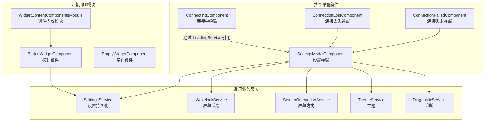
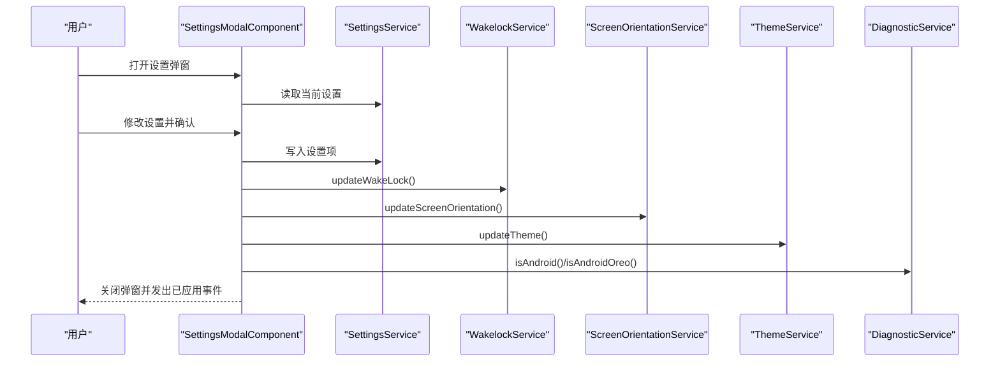
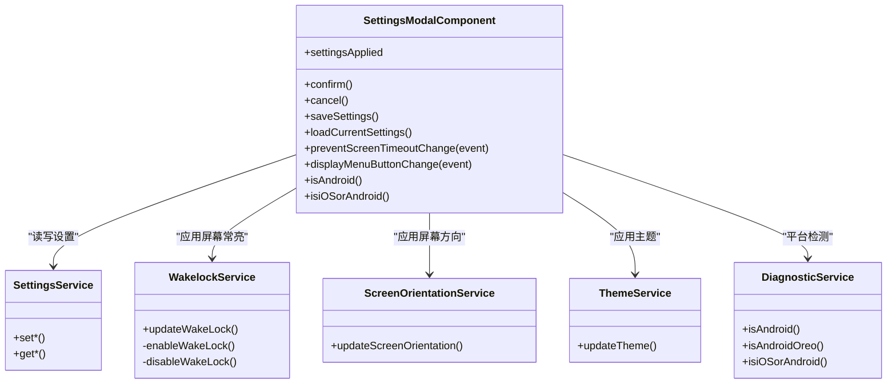
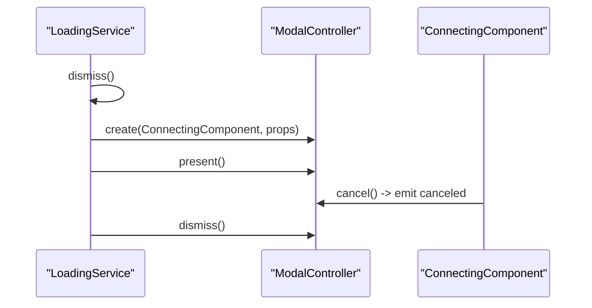
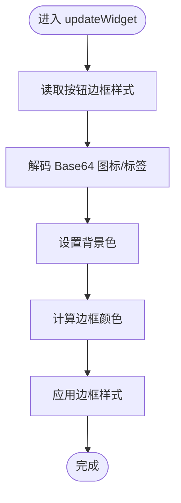
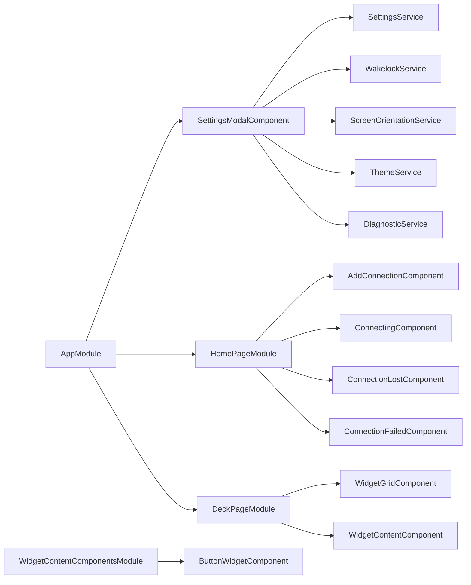

# 共享模块

<cite>
**本文档引用的文件**
- [settings-modal.component.ts](file://src/app/pages/shared/modals/settings-modal/settings-modal.component.ts)
- [settings-modal.component.spec.ts](file://src/app/pages/shared/modals/settings-modal/settings-modal.component.spec.ts)
- [home.module.ts](file://src/app/pages/home/home.module.ts)
- [deck.module.ts](file://src/app/pages/deck/deck.module.ts)
- [widget-content-components.module.ts](file://src/app/widget-content-components/widget-content-components.module.ts)
- [loading.service.ts](file://src/app/services/loading/loading.service.ts)
- [connecting.component.ts](file://src/app/pages/home/modals/connecting/connecting.component.ts)
- [connection-lost.component.ts](file://src/app/pages/home/modals/connection-lost/connection-lost.component.ts)
- [connection-failed.component.ts](file://src/app/pages/home/modals/connection-failed/connection-failed.component.ts)
- [settings.service.ts](file://src/app/services/settings/settings.service.ts)
- [wakelock.service.ts](file://src/app/services/wakelock/wakelock.service.ts)
- [screen-orientation.service.ts](file://src/app/services/screen-orientation/screen-orientation.service.ts)
- [theme.service.ts](file://src/app/services/theme/theme.service.ts)
- [diagnostic.service.ts](file://src/app/services/diagnostic/diagnostic.service.ts)
- [appearance-type.ts](file://src/app/enums/appearance-type.ts)
- [screen-orientation-type.ts](file://src/app/enums/screen-orientation-type.ts)
- [button-widget.component.ts](file://src/app/widget-content-components/button-widget/button-widget.component.ts)
- [app.module.ts](file://src/app/app.module.ts)
- [polyfills.ts](file://src/polyfills.ts)
- [zone-flags.ts](file://src/zone-flags.ts)
</cite>

## 目录
1. [简介](#简介)
2. [项目结构](#项目结构)
3. [核心组件](#核心组件)
4. [架构总览](#架构总览)
5. [详细组件分析](#详细组件分析)
6. [依赖关系分析](#依赖关系分析)
7. [性能考量](#性能考量)
8. [故障排查指南](#故障排查指南)
9. [结论](#结论)
10. [附录](#附录)

## 简介
本文件聚焦于 Macro-Deck-Client-App 中“共享模块”的设计与实现，目标是帮助开发者理解：
- 共享模块的设计目的与边界
- 哪些组件与服务被归类为共享模块
- SettingsModalComponent 等共享组件的模块化设计与跨页面复用机制
- 导入/导出规则与依赖管理策略
- 扩展指南与自定义共享组件的开发方法
- 性能影响分析与优化建议

## 项目结构
共享模块主要由以下三类组成：
- 页面级共享弹窗组件：如设置弹窗、连接中弹窗、连接丢失/失败弹窗等
- 通用业务服务：设置持久化、屏幕常亮、屏幕方向、主题、诊断等
- 可复用 UI 组件模块：如按钮微件、空白微件等

图表来源
- [settings-modal.component.ts:1-300](file://src/app/pages/shared/modals/settings-modal/settings-modal.component.ts#L1-L300)
- [connecting.component.ts:1-58](file://src/app/pages/home/modals/connecting/connecting.component.ts#L1-L58)
- [connection-lost.component.ts:1-40](file://src/app/pages/home/modals/connection-lost/connection-lost.component.ts#L1-L40)
- [connection-failed.component.ts:1-48](file://src/app/pages/home/modals/connection-failed/connection-failed.component.ts#L1-L48)
- [settings.service.ts:1-389](file://src/app/services/settings/settings.service.ts#L1-L389)
- [wakelock.service.ts:1-105](file://src/app/services/wakelock/wakelock.service.ts#L1-L105)
- [screen-orientation.service.ts:1-105](file://src/app/services/screen-orientation/screen-orientation.service.ts#L1-L105)
- [theme.service.ts:1-104](file://src/app/services/theme/theme.service.ts#L1-L104)
- [diagnostic.service.ts:1-147](file://src/app/services/diagnostic/diagnostic.service.ts#L1-L147)
- [widget-content-components.module.ts:1-42](file://src/app/widget-content-components/widget-content-components.module.ts#L1-L42)
- [button-widget.component.ts:66-105](file://src/app/widget-content-components/button-widget/button-widget.component.ts#L66-L105)

章节来源
- [app.module.ts:1-87](file://src/app/app.module.ts#L1-L87)
- [home.module.ts:1-76](file://src/app/pages/home/home.module.ts#L1-L76)
- [deck.module.ts:1-44](file://src/app/pages/deck/deck.module.ts#L1-L44)
- [widget-content-components.module.ts:1-42](file://src/app/widget-content-components/widget-content-components.module.ts#L1-L42)

## 核心组件
- SettingsModalComponent：设置弹窗，负责读取/写入设置、即时应用屏幕常亮、屏幕方向、主题，并在 Android 上动态跳过 SSL 校验；提供确认/取消逻辑与变更提醒弹窗。
- ConnectingComponent：连接中弹窗，承载加载提示与取消事件，供 LoadingService 管理生命周期。
- ConnectionLostComponent / ConnectionFailedComponent：连接状态异常弹窗，提供关闭能力。
- SettingsService：统一的设置持久化接口，封装本地存储键名与默认值。
- WakelockService / ScreenOrientationService / ThemeService：分别负责屏幕常亮、屏幕方向锁定与主题切换的即时应用。
- DiagnosticService：平台检测与版本信息获取。
- WidgetContentComponentsModule 与 ButtonWidgetComponent：微件内容模块与按钮微件，提供边框样式、图标/标签渲染与背景色适配。

章节来源
- [settings-modal.component.ts:1-300](file://src/app/pages/shared/modals/settings-modal/settings-modal.component.ts#L1-L300)
- [connecting.component.ts:1-58](file://src/app/pages/home/modals/connecting/connecting.component.ts#L1-L58)
- [connection-lost.component.ts:1-40](file://src/app/pages/home/modals/connection-lost/connection-lost.component.ts#L1-L40)
- [connection-failed.component.ts:1-48](file://src/app/pages/home/modals/connection-failed/connection-failed.component.ts#L1-L48)
- [settings.service.ts:1-389](file://src/app/services/settings/settings.service.ts#L1-L389)
- [wakelock.service.ts:1-105](file://src/app/services/wakelock/wakelock.service.ts#L1-L105)
- [screen-orientation.service.ts:1-105](file://src/app/services/screen-orientation/screen-orientation.service.ts#L1-L105)
- [theme.service.ts:1-104](file://src/app/services/theme/theme.service.ts#L1-L104)
- [diagnostic.service.ts:1-147](file://src/app/services/diagnostic/diagnostic.service.ts#L1-L147)
- [widget-content-components.module.ts:1-42](file://src/app/widget-content-components/widget-content-components.module.ts#L1-L42)
- [button-widget.component.ts:66-105](file://src/app/widget-content-components/button-widget/button-widget.component.ts#L66-L105)

## 架构总览
共享模块围绕“设置弹窗”为中心，向上承接 SettingsService，向下联动 WakelockService、ScreenOrientationService、ThemeService 与 DiagnosticService，同时通过 LoadingService 与 ConnectingComponent 提供一致的加载体验。微件模块为 UI 层提供可复用的展示组件。

图表来源
- [settings-modal.component.ts:63-103](file://src/app/pages/shared/modals/settings-modal/settings-modal.component.ts#L63-L103)
- [settings.service.ts:1-389](file://src/app/services/settings/settings.service.ts#L1-L389)
- [wakelock.service.ts:22-32](file://src/app/services/wakelock/wakelock.service.ts#L22-L32)
- [screen-orientation.service.ts:22-55](file://src/app/services/screen-orientation/screen-orientation.service.ts#L22-L55)
- [theme.service.ts:20-39](file://src/app/services/theme/theme.service.ts#L20-L39)
- [diagnostic.service.ts:33-40](file://src/app/services/diagnostic/diagnostic.service.ts#L33-L40)

## 详细组件分析

### SettingsModalComponent 分析
- 设计目的：集中式设置入口，统一读取/保存设置，即时应用关键系统行为（屏幕常亮、屏幕方向、主题），并在 Android 上动态调整 SSL 校验。
- 模块化设计：
  - 采用独立组件文件与模块导入，避免在各页面重复声明。
  - 通过静态事件总线对外广播“设置已应用”，便于全局监听与联动。
- 跨页面复用机制：
  - 在根模块中直接引入组件，使任意页面可通过路由或弹窗控制器打开。
  - 与服务解耦：仅依赖 SettingsService、WakelockService、ScreenOrientationService、ThemeService、DiagnosticService，降低对页面上下文的耦合。
- 依赖注入与平台差异：
  - 通过 DiagnosticService 判断平台与 Android Oreo 特性，避免在不支持的平台上执行无效操作。
  - 在 Android 上通过原生插件动态跳过 SSL 校验。

图表来源
- [settings-modal.component.ts:23-168](file://src/app/pages/shared/modals/settings-modal/settings-modal.component.ts#L23-L168)
- [settings.service.ts:26-246](file://src/app/services/settings/settings.service.ts#L26-L246)
- [wakelock.service.ts:10-58](file://src/app/services/wakelock/wakelock.service.ts#L10-L58)
- [screen-orientation.service.ts:12-55](file://src/app/services/screen-orientation/screen-orientation.service.ts#L12-L55)
- [theme.service.ts:9-39](file://src/app/services/theme/theme.service.ts#L9-L39)
- [diagnostic.service.ts:10-88](file://src/app/services/diagnostic/diagnostic.service.ts#L10-L88)

章节来源
- [settings-modal.component.ts:1-300](file://src/app/pages/shared/modals/settings-modal/settings-modal.component.ts#L1-L300)
- [settings-modal.component.spec.ts:1-23](file://src/app/pages/shared/modals/settings-modal/settings-modal.component.spec.ts#L1-L23)

### LoadingService 与 ConnectingComponent 协作流程
- 设计目的：统一管理连接过程中的加载弹窗，提供取消事件与安全关闭。
- 工作流：
  - LoadingService 在每次显示前先尝试关闭已有弹窗，避免重复叠加。
  - 通过 ModalController 创建 ConnectingComponent，并传递消息与取消事件。
  - 用户取消时，触发取消事件并关闭弹窗。

图表来源
- [loading.service.ts:24-48](file://src/app/services/loading/loading.service.ts#L24-L48)
- [connecting.component.ts:24-28](file://src/app/pages/home/modals/connecting/connecting.component.ts#L24-L28)

章节来源
- [loading.service.ts:1-86](file://src/app/services/loading/loading.service.ts#L1-L86)
- [connecting.component.ts:1-58](file://src/app/pages/home/modals/connecting/connecting.component.ts#L1-L58)

### 微件内容模块与按钮微件
- 设计目的：提供可复用的按钮微件与空白微件，统一渲染逻辑与样式。
- 关键点：
  - 通过 SettingsService 获取按钮边框样式，动态设置边框与背景。
  - 对 Base64 图片进行安全资源 URL 转换，避免 CSP 问题。
  - 计算边框颜色基于背景色明度调整，提升视觉一致性。

图表来源
- [button-widget.component.ts:88-103](file://src/app/widget-content-components/button-widget/button-widget.component.ts#L88-L103)
- [settings.service.ts:36-46](file://src/app/services/settings/settings.service.ts#L36-L46)

章节来源
- [widget-content-components.module.ts:1-42](file://src/app/widget-content-components/widget-content-components.module.ts#L1-L42)
- [button-widget.component.ts:66-105](file://src/app/widget-content-components/button-widget/button-widget.component.ts#L66-L105)

## 依赖关系分析
- 组件到服务：
  - SettingsModalComponent 依赖 SettingsService、WakelockService、ScreenOrientationService、ThemeService、DiagnosticService。
  - ConnectingComponent 依赖 ModalController 与环境变量。
  - ButtonWidgetComponent 依赖 SettingsService 与 Sanitizer。
- 模块到组件：
  - 根模块直接引入 SettingsModalComponent，确保其可在任意页面弹出。
  - Home 模块与 Deck 模块各自声明并导入其内部弹窗组件，形成页面内聚。
- 可复用模块：
  - WidgetContentComponentsModule 导出通用事件模块，供微件组件使用。

图表来源
- [app.module.ts:19-42](file://src/app/app.module.ts#L19-L42)
- [home.module.ts:21-38](file://src/app/pages/home/home.module.ts#L21-L38)
- [deck.module.ts:12-22](file://src/app/pages/deck/deck.module.ts#L12-L22)
- [widget-content-components.module.ts:8-19](file://src/app/widget-content-components/widget-content-components.module.ts#L8-L19)

章节来源
- [app.module.ts:1-87](file://src/app/app.module.ts#L1-L87)
- [home.module.ts:1-76](file://src/app/pages/home/home.module.ts#L1-L76)
- [deck.module.ts:1-44](file://src/app/pages/deck/deck.module.ts#L1-L44)

## 性能考量
- 变更检测与 Zone 修补：
  - 通过 zone-flags 禁止对特定 Web Component 回调的 Zone 修补，减少不必要的变更检测开销。
- 弹窗复用与生命周期：
  - LoadingService 在显示新弹窗前主动关闭旧弹窗，避免弹窗堆叠导致的内存与渲染压力。
- 服务层幂等与降级：
  - 屏幕常亮与屏幕方向在不支持的平台或系统版本上直接返回，避免无效调用与异常日志。
- 存储与渲染：
  - SettingsService 使用统一键名与默认值，减少分支判断；按钮微件对图片进行一次性安全 URL 转换，避免重复计算。

章节来源
- [polyfills.ts:1-103](file://src/polyfills.ts#L1-L103)
- [zone-flags.ts:1-12](file://src/zone-flags.ts#L1-L12)
- [loading.service.ts:24-48](file://src/app/services/loading/loading.service.ts#L24-L48)
- [wakelock.service.ts:22-32](file://src/app/services/wakelock/wakelock.service.ts#L22-L32)
- [screen-orientation.service.ts:22-55](file://src/app/services/screen-orientation/screen-orientation.service.ts#L22-L55)
- [settings.service.ts:36-46](file://src/app/services/settings/settings.service.ts#L36-L46)
- [button-widget.component.ts:92-102](file://src/app/widget-content-components/button-widget/button-widget.component.ts#L92-L102)

## 故障排查指南
- 设置未生效：
  - 确认 SettingsModalComponent 已调用保存并触发即时应用流程。
  - 检查对应服务（Wakelock/ScreenOrientation/Theme）是否在当前平台可用。
- Android 上 SSL 校验未跳过：
  - 确认平台检测与原生插件调用路径正确，且仅在 Android 平台上执行。
- 连接弹窗无法关闭或重复出现：
  - 检查 LoadingService 的 dismiss 与 present 调用顺序，确保先关闭再创建。
- 主题切换无效：
  - 确认 AppearanceType 设置与系统深色模式监听逻辑一致。
- 微件图标/标签不显示：
  - 检查 Base64 数据是否有效，以及安全 URL 转换是否成功。

章节来源
- [settings-modal.component.ts:84-103](file://src/app/pages/shared/modals/settings-modal/settings-modal.component.ts#L84-L103)
- [diagnostic.service.ts:33-40](file://src/app/services/diagnostic/diagnostic.service.ts#L33-L40)
- [loading.service.ts:37-48](file://src/app/services/loading/loading.service.ts#L37-L48)
- [theme.service.ts:20-39](file://src/app/services/theme/theme.service.ts#L20-L39)
- [button-widget.component.ts:92-98](file://src/app/widget-content-components/button-widget/button-widget.component.ts#L92-L98)

## 结论
共享模块通过“设置弹窗”为核心，串联起设置持久化、系统行为应用与 UI 渲染，实现了高内聚、低耦合的跨页面复用。配合 LoadingService 与弹窗组件，提供了统一的交互体验。通过平台检测与降级策略，保证了在不同设备与系统上的稳定性。建议在新增共享组件时遵循现有模块边界与依赖注入规范，确保可维护性与性能。

## 附录

### 共享模块清单与职责
- SettingsModalComponent：设置弹窗，读写设置并即时应用系统行为
- ConnectingComponent：连接中弹窗，承载加载与取消
- ConnectionLostComponent / ConnectionFailedComponent：连接异常弹窗
- SettingsService：设置持久化与默认值
- WakelockService / ScreenOrientationService / ThemeService：系统行为与主题应用
- DiagnosticService：平台检测与版本信息
- WidgetContentComponentsModule / ButtonWidgetComponent：可复用微件 UI

章节来源
- [settings-modal.component.ts:1-300](file://src/app/pages/shared/modals/settings-modal/settings-modal.component.ts#L1-L300)
- [connecting.component.ts:1-58](file://src/app/pages/home/modals/connecting/connecting.component.ts#L1-L58)
- [connection-lost.component.ts:1-40](file://src/app/pages/home/modals/connection-lost/connection-lost.component.ts#L1-L40)
- [connection-failed.component.ts:1-48](file://src/app/pages/home/modals/connection-failed/connection-failed.component.ts#L1-L48)
- [settings.service.ts:1-389](file://src/app/services/settings/settings.service.ts#L1-L389)
- [wakelock.service.ts:1-105](file://src/app/services/wakelock/wakelock.service.ts#L1-L105)
- [screen-orientation.service.ts:1-105](file://src/app/services/screen-orientation/screen-orientation.service.ts#L1-L105)
- [theme.service.ts:1-104](file://src/app/services/theme/theme.service.ts#L1-L104)
- [diagnostic.service.ts:1-147](file://src/app/services/diagnostic/diagnostic.service.ts#L1-L147)
- [widget-content-components.module.ts:1-42](file://src/app/widget-content-components/widget-content-components.module.ts#L1-L42)
- [button-widget.component.ts:66-105](file://src/app/widget-content-components/button-widget/button-widget.component.ts#L66-L105)

### 导入/导出规则与依赖管理策略
- 根模块集中引入共享组件（如 SettingsModalComponent），以便全局弹出。
- 页面模块仅导入本页面使用的子弹窗组件，保持页面内聚。
- 服务采用根作用域注入（providedIn: 'root'），避免重复实例化。
- 通过枚举类型（AppearanceType、ScreenOrientationType）约束设置值域，减少错误配置。

章节来源
- [app.module.ts:19-42](file://src/app/app.module.ts#L19-L42)
- [home.module.ts:21-38](file://src/app/pages/home/home.module.ts#L21-L38)
- [appearance-type.ts:1-15](file://src/app/enums/appearance-type.ts#L1-L15)
- [screen-orientation-type.ts:1-21](file://src/app/enums/screen-orientation-type.ts#L1-L21)

### 扩展指南与自定义共享组件开发方法
- 新增共享弹窗组件步骤：
  - 创建组件文件与模板，声明 imports（如 IonicModule、FormsModule）。
  - 在根模块中引入组件，确保可全局弹出。
  - 若涉及设置持久化，优先通过 SettingsService 读写，避免硬编码。
  - 若涉及系统行为（如屏幕常亮/方向/主题），在 SettingsModalComponent 或对应服务中统一调用。
- 新增共享 UI 组件步骤：
  - 在 widget-content-components.module 中声明并导出必要模块（如事件模块）。
  - 通过 SettingsService 获取样式参数，确保与全局主题一致。
- 依赖管理建议：
  - 避免在组件中直接依赖平台特有 API；通过服务抽象平台差异。
  - 使用 providedIn: 'root' 的服务在多处复用时无需重复导入模块。

章节来源
- [settings-modal.component.ts:18-22](file://src/app/pages/shared/modals/settings-modal/settings-modal.component.ts#L18-L22)
- [widget-content-components.module.ts:8-19](file://src/app/widget-content-components/widget-content-components.module.ts#L8-L19)
- [settings.service.ts:26-30](file://src/app/services/settings/settings.service.ts#L26-L30)