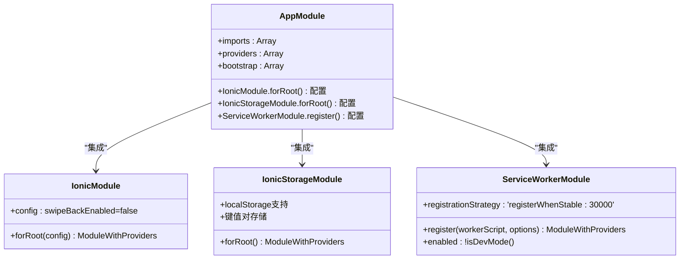
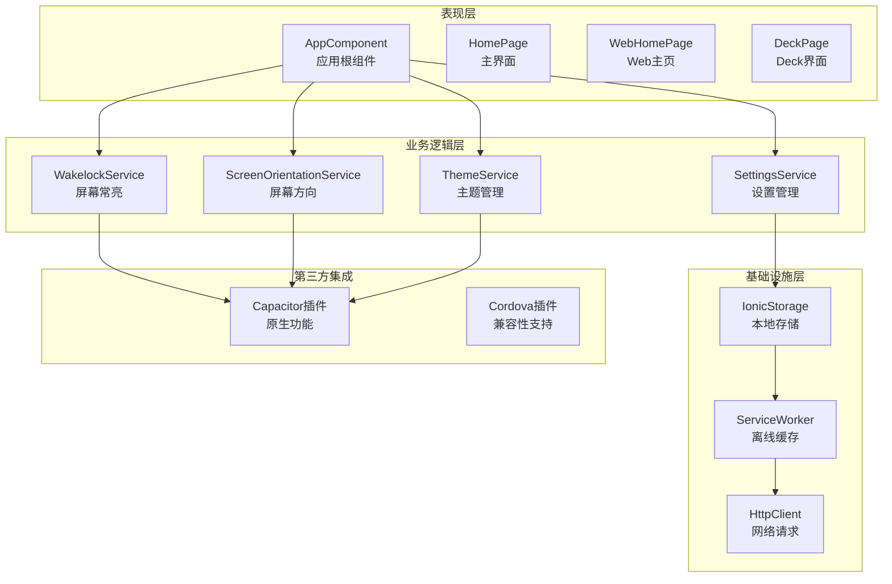
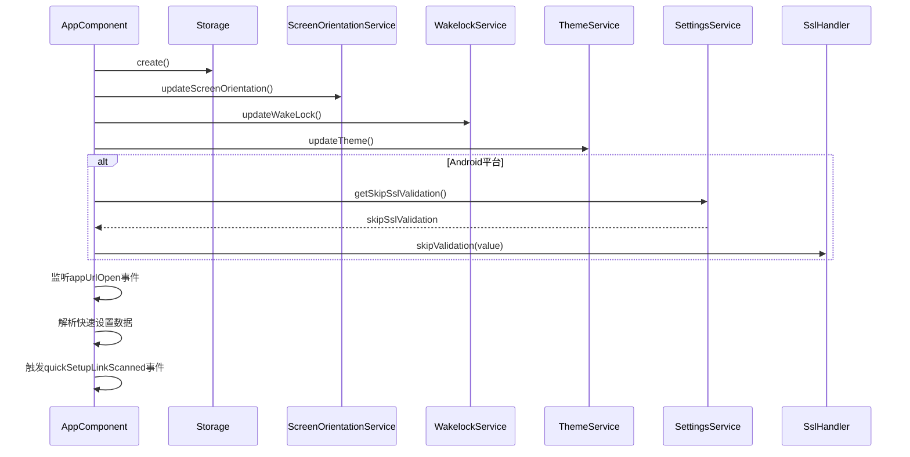
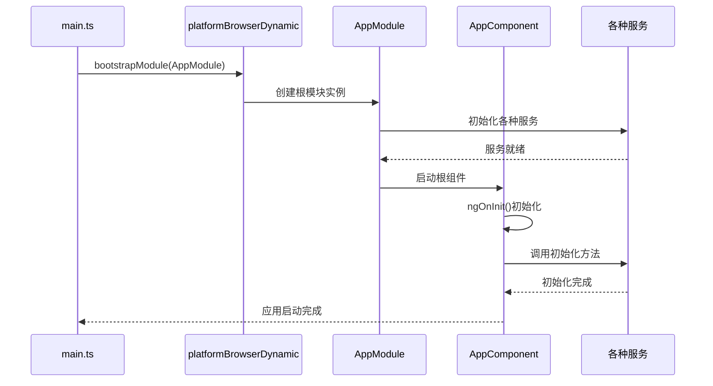
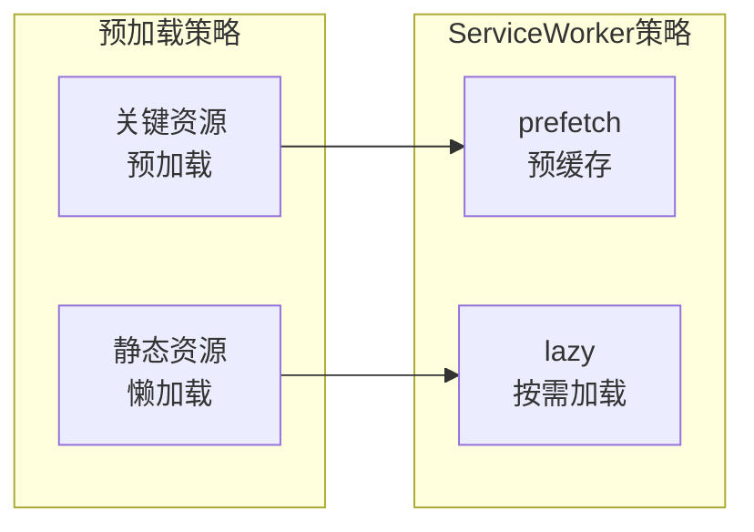

# 根模块AppModule

<cite>
**本文档引用的文件**
- [src/app/app.module.ts](file://src/app/app.module.ts)
- [src/app/app.component.ts](file://src/app/app.component.ts)
- [src/main.ts](file://src/main.ts)
- [angular.json](file://angular.json)
- [package.json](file://package.json)
- [ngsw-config.json](file://ngsw-config.json)
- [src/environments/environment.ts](file://src/environments/environment.ts)
- [src/app/widget-content-components/widget-content-components.module.ts](file://src/app/widget-content-components/widget-content-components.module.ts)
- [src/app/pages/home/home.module.ts](file://src/app/pages/home/home.module.ts)
- [src/app/pages/web-home/web-home.module.ts](file://src/app/pages/web-home/web-home.module.ts)
- [src/app/services/settings/settings.service.ts](file://src/app/services/settings/settings.service.ts)
- [src/app/services/wakelock/wakelock.service.ts](file://src/app/services/wakelock/wakelock.service.ts)
- [src/app/services/screen-orientation/screen-orientation.service.ts](file://src/app/services/screen-orientation/screen-orientation.service.ts)
- [src/app/services/theme/theme.service.ts](file://src/app/services/theme/theme.service.ts)
</cite>

## 目录
1. [简介](#简介)
2. [项目结构](#项目结构)
3. [核心组件](#核心组件)
4. [架构概览](#架构概览)
5. [详细组件分析](#详细组件分析)
6. [依赖关系分析](#依赖关系分析)
7. [性能考虑](#性能考虑)
8. [故障排除指南](#故障排除指南)
9. [结论](#结论)

## 简介

AppModule是Macro-Deck-Client-App应用的根模块，扮演着整个应用的"总指挥官"角色。它负责协调所有子模块、组件和服务的初始化，建立应用的基础架构，并确保各个功能模块能够协同工作。作为Angular应用的入口点，AppModule不仅定义了应用的结构，还决定了应用的运行时行为和用户体验。

在Macro-Deck-Client-App这个桌面端和移动端兼容的应用中，AppModule需要同时支持Web版本和原生应用版本，这要求根模块具备高度的灵活性和可配置性。

## 项目结构

Macro-Deck-Client-App采用基于功能的模块化架构，每个功能领域都有独立的模块进行管理。AppModule作为根模块，负责整合这些功能模块并提供统一的应用入口。

```mermaid
graph TB
subgraph "根模块结构"
AppModule[AppModule<br/>根模块]
AppComponent[AppComponent<br/>启动组件]
end
subgraph "功能模块"
HomePageModule[HomePageModule<br/>主界面模块]
WebHomePageModule[WebHomePageModule<br/>Web主页模块]
DeckPageModule[DeckPageModule<br/>Deck界面模块]
ConnectionLostPageModule[ConnectionLostPageModule<br/>连接丢失模块]
WidgetContentComponentsModule[WidgetContentComponentsModule<br/>微件组件模块]
end
subgraph "基础设施模块"
IonicModule[IonicModule.forRoot)<br/>Ionic框架集成]
IonicStorageModule[IonicStorageModule.forRoot()<br/>本地存储]
ServiceWorkerModule[ServiceWorkerModule.register()<br/>离线缓存]
HttpClientModule[HttpClientModule<br/>HTTP客户端]
FormsModule[FormsModule<br/>表单支持]
end
AppModule --> AppComponent
AppModule --> HomePageModule
AppModule --> WebHomePageModule
AppModule --> DeckPageModule
AppModule --> ConnectionLostPageModule
AppModule --> WidgetContentComponentsModule
AppModule --> IonicModule
AppModule --> IonicStorageModule
AppModule --> ServiceWorkerModule
AppModule --> HttpClientModule
AppModule --> FormsModule
```

**图表来源**
- [src/app/app.module.ts:19-43](file://src/app/app.module.ts#L19-L43)
- [src/app/pages/home/home.module.ts:21-38](file://src/app/pages/home/home.module.ts#L21-L38)
- [src/app/pages/web-home/web-home.module.ts:10-21](file://src/app/pages/web-home/web-home.module.ts#L10-L21)

**章节来源**
- [src/app/app.module.ts:18-43](file://src/app/app.module.ts#L18-L43)
- [angular.json:13-46](file://angular.json#L13-L46)

## 核心组件

### AppModule配置详解

AppModule的核心配置体现了应用的设计理念和技术选型。让我详细分析各个配置选项：

#### Ionic集成配置


**图表来源**
- [src/app/app.module.ts:20-38](file://src/app/app.module.ts#L20-L38)

#### 关键配置选项分析

**IonicModule.forRoot()设置**
- `swipeBackEnabled: false`：禁用iOS滑动返回手势，提供更一致的导航体验
- 为整个应用提供Ionic UI组件库的基础支持

**ServiceWorker注册策略**
- `enabled: !isDevMode()`：仅在生产模式下启用，避免开发调试时的缓存干扰
- `registrationStrategy: 'registerWhenStable:30000'`：应用稳定后或30秒后注册，确保资源加载完成

**IonicStorageModule配置**
- 提供跨平台的本地存储解决方案
- 支持Promise和Observable两种数据访问方式

**章节来源**
- [src/app/app.module.ts:23-35](file://src/app/app.module.ts#L23-L35)

### 模块导入顺序和依赖关系

模块的导入顺序遵循特定的逻辑，确保依赖关系得到正确处理：

```mermaid
flowchart TD
Start([应用启动]) --> BrowserModule[BrowserModule<br/>基础浏览器支持]
BrowserModule --> HttpClientModule[HttpClientModule<br/>HTTP请求支持]
HttpClientModule --> IonicModule[IonicModule.forRoot()<br/>UI框架集成]
IonicModule --> IonicStorageModule[IonicStorageModule.forRoot()<br/>本地存储]
IonicStorageModule --> FormsModule[FormsModule<br/>表单支持]
FormsModule --> WidgetContentComponentsModule[WidgetContentComponentsModule<br/>微件组件]
WidgetContentComponentsModule --> FeatureModules[功能模块集合]
FeatureModules --> ServiceWorkerModule[ServiceWorkerModule.register()<br/>离线缓存]
ServiceWorkerModule --> Bootstrap[AppComponent<br/>启动组件]
subgraph "功能模块"
HomePageModule[HomePageModule<br/>主界面]
WebHomePageModule[WebHomePageModule<br/>Web主页]
DeckPageModule[DeckPageModule<br/>Deck界面]
ConnectionLostPageModule[ConnectionLostPageModule<br/>连接丢失]
end
FeatureModules --> HomePageModule
FeatureModules --> WebHomePageModule
FeatureModules --> DeckPageModule
FeatureModules --> ConnectionLostPageModule
```

**图表来源**
- [src/app/app.module.ts:20-38](file://src/app/app.module.ts#L20-L38)

**章节来源**
- [src/app/app.module.ts:20-38](file://src/app/app.module.ts#L20-L38)

## 架构概览

AppModule采用分层架构设计，将不同职责的功能模块分离管理：



**图表来源**
- [src/app/app.module.ts:1-87](file://src/app/app.module.ts#L1-L87)
- [src/app/app.component.ts:26-68](file://src/app/app.component.ts#L26-L68)

## 详细组件分析

### AppComponent启动组件

AppComponent作为应用的启动组件，承担着应用初始化的重要职责：

#### 核心功能特性

**多平台适配支持**
- 通过环境变量判断Web版本和原生版本
- 动态选择对应的根页面组件

**初始化流程管理**
- 本地存储初始化
- 屏幕方向设置
- 屏幕常亮功能
- 主题系统配置

**深度链接处理**
- 监听应用URL打开事件
- 解析快速设置二维码数据
- 触发相应的业务逻辑

#### 初始化序列图



**图表来源**
- [src/app/app.component.ts:46-67](file://src/app/app.component.ts#L46-L67)

**章节来源**
- [src/app/app.component.ts:17-68](file://src/app/app.component.ts#L17-L68)

### 根模块引导过程

应用的引导过程遵循标准的Angular生命周期：



**图表来源**
- [src/main.ts:13-14](file://src/main.ts#L13-L14)
- [src/app/app.module.ts:40](file://src/app/app.module.ts#L40)

**章节来源**
- [src/main.ts:12-14](file://src/main.ts#L12-L14)

### 模块导入最佳实践

#### 选择特定模块的原因

**IonicModule.forRoot()**
- 提供完整的Ionic UI组件生态系统
- 支持响应式设计和跨平台一致性
- 禁用滑动返回提升用户体验

**IonicStorageModule.forRoot()**
- 跨平台本地存储解决方案
- 支持异步操作和错误处理
- 与Angular依赖注入系统集成

**ServiceWorkerModule.register()**
- 实现PWA离线缓存功能
- 提升应用加载性能
- 支持渐进式Web应用特性

**章节来源**
- [src/app/app.module.ts:20-38](file://src/app/app.module.ts#L20-L38)

## 依赖关系分析

### 外部依赖关系

AppModule依赖于多个外部库和框架：

```mermaid
graph LR
subgraph "Angular核心"
AngularCore[@angular/core]
AngularPlatformBrowser[@angular/platform-browser]
AngularPlatformBrowserDynamic[@angular/platform-browser-dynamic]
AngularServiceWorker[@angular/service-worker]
end
subgraph "Ionic框架"
IonicAngular[@ionic/angular]
IonicStorageAngular[@ionic/storage-angular]
end
subgraph "Capacitor生态"
CapacitorApp[@capacitor/app]
CapacitorScreenOrientation[@capawesome/capacitor-screen-orientation]
CapacitorKeepAwake[@capacitor-community/keep-awake]
end
subgraph "第三方库"
NoSleep[nosleep.js]
Bootstrap[bootstrap]
MaterialIcons[@mdi/font]
end
AppModule --> AngularCore
AppModule --> AngularPlatformBrowser
AppModule --> AngularServiceWorker
AppModule --> IonicAngular
AppModule --> IonicStorageAngular
AppModule --> CapacitorApp
AppModule --> CapacitorScreenOrientation
AppModule --> CapacitorKeepAwake
```

**图表来源**
- [package.json:16-57](file://package.json#L16-L57)

**章节来源**
- [package.json:16-57](file://package.json#L16-L57)

### 内部模块依赖

内部模块之间的依赖关系体现了清晰的层次结构：

```mermaid
graph TD
AppModule[AppModule<br/>根模块] --> WidgetContentComponentsModule[WidgetContentComponentsModule<br/>微件组件模块]
AppModule --> HomePageModule[HomePageModule<br/>主界面模块]
AppModule --> WebHomePageModule[WebHomePageModule<br/>Web主页模块]
AppModule --> DeckPageModule[DeckPageModule<br/>Deck界面模块]
AppModule --> ConnectionLostPageModule[ConnectionLostPageModule<br/>连接丢失模块]
HomePageModule --> WebHomePageModule
HomePageModule --> AddConnectionComponent[AddConnectionComponent<br/>添加连接弹窗]
HomePageModule --> ConnectingComponent[ConnectingComponent<br/>连接中弹窗]
HomePageModule --> ConnectionFailedComponent[ConnectionFailedComponent<br/>连接失败弹窗]
HomePageModule --> ConnectionLostComponent[ConnectionLostComponent<br/>连接丢失弹窗]
HomePageModule --> InsecureConnectionComponent[InsecureConnectionComponent<br/>不安全连接弹窗]
HomePageModule --> ScanNetworkInterfacesComponent[ScanNetworkInterfacesComponent<br/>扫描网络接口]
HomePageModule --> QrCodeScannerComponent[QrCodeScannerComponent<br/>二维码扫描器]
HomePageModule --> QrCodeScannerUiComponent[QrCodeScannerUiComponent<br/>二维码扫描UI]
WidgetContentComponentsModule --> ButtonWidgetComponent[ButtonWidgetComponent<br/>按钮微件]
WidgetContentComponentsModule --> EmptyWidgetComponent[EmptyWidgetComponent<br/>空微件]
```



**图表来源**
- [src/app/app.module.ts:8-16](file://src/app/app.module.ts#L8-L16)
- [src/app/pages/home/home.module.ts:7-18](file://src/app/pages/home/home.module.ts#L7-L18)

**章节来源**
- [src/app/app.module.ts:8-16](file://src/app/app.module.ts#L8-L16)
- [src/app/pages/home/home.module.ts:7-18](file://src/app/pages/home/home.module.ts#L7-L18)

## 性能考虑

### ServiceWorker缓存策略

应用采用了智能的ServiceWorker缓存策略来优化性能：

**缓存配置分析**
- 预缓存关键资源：HTML、CSS、JavaScript文件
- 懒加载静态资源：图片、图标等二进制文件
- 更新机制：支持增量更新和版本控制

**性能优化效果**
- 减少重复下载的资源
- 提升应用启动速度
- 支持离线访问能力

### 模块懒加载策略

虽然当前采用预加载策略，但应用架构已为未来的懒加载做好准备：



**章节来源**
- [ngsw-config.json:4-29](file://ngsw-config.json#L4-L29)

## 故障排除指南

### 常见配置问题及解决方案

**ServiceWorker注册失败**
- 检查生产模式配置
- 确认HTTPS环境
- 验证ServiceWorker脚本路径

**本地存储初始化问题**
- 确保在应用启动早期调用
- 检查浏览器兼容性
- 验证存储权限设置

**深度链接处理异常**
- 检查URL格式规范
- 验证Base64编码解码
- 确认JSON数据结构

**章节来源**
- [src/app/app.module.ts:31-35](file://src/app/app.module.ts#L31-L35)
- [src/app/app.component.ts:58-66](file://src/app/app.component.ts#L58-L66)

### 调试技巧

**开发环境调试**
- 使用Angular DevTools检查模块依赖
- 监控ServiceWorker缓存状态
- 跟踪组件生命周期事件

**生产环境监控**
- 监控应用启动时间
- 跟踪ServiceWorker更新情况
- 分析用户行为和崩溃日志

## 结论

AppModule作为Macro-Deck-Client-App的根模块，展现了现代Angular应用的最佳实践。通过精心设计的模块化架构、合理的依赖管理和完善的性能优化策略，该根模块为整个应用提供了稳定可靠的基础。

关键优势包括：
- 清晰的模块边界和职责分离
- 灵活的多平台支持
- 完善的性能优化策略
- 良好的可维护性和扩展性

未来可以考虑的方向：
- 实施模块懒加载策略
- 增强错误处理和恢复机制
- 优化内存使用和资源管理
- 加强安全性和隐私保护

通过持续的优化和改进，AppModule将继续为Macro-Deck-Client-App提供强大的技术支撑。