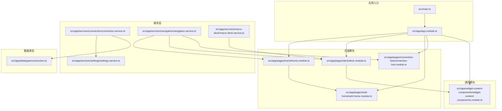
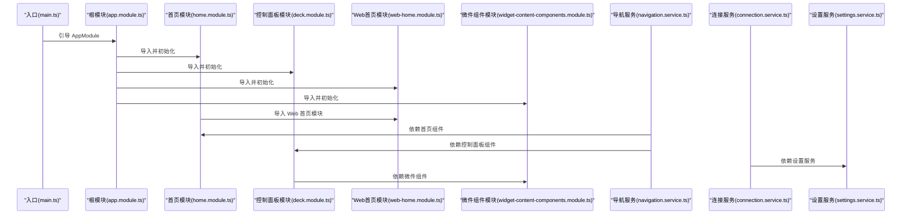
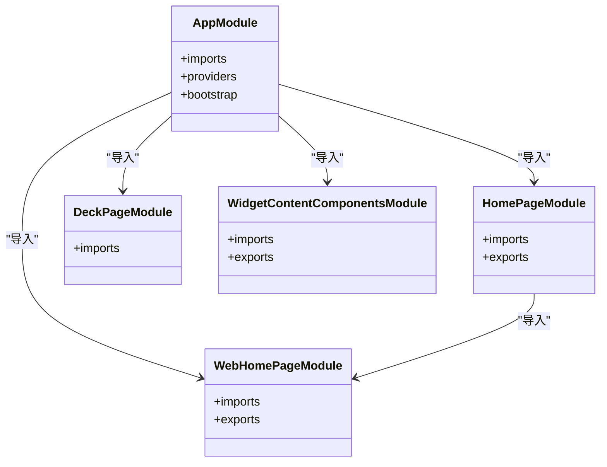
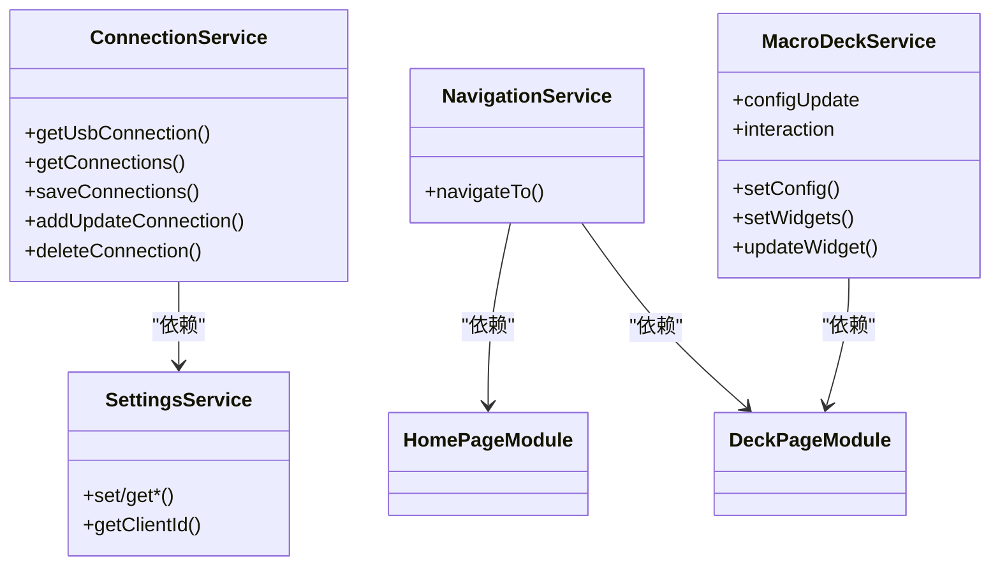
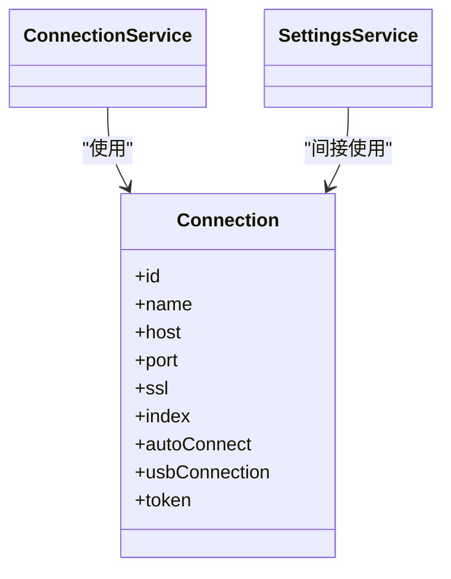
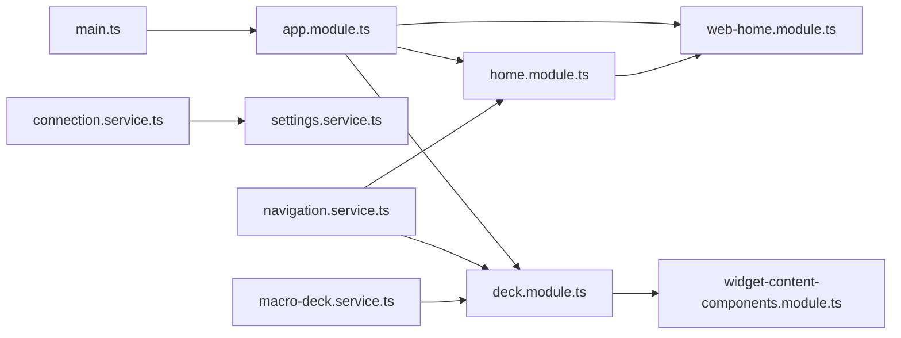

# 模块依赖关系

<cite>
**本文引用的文件**
- [package.json](file://package.json)
- [angular.json](file://angular.json)
- [capacitor.config.ts](file://capacitor.config.ts)
- [src/main.ts](file://src/main.ts)
- [src/app/app.module.ts](file://src/app/app.module.ts)
- [src/app/pages/home/home.module.ts](file://src/app/pages/home/home.module.ts)
- [src/app/pages/deck/deck.module.ts](file://src/app/pages/deck/deck.module.ts)
- [src/app/pages/web-home/web-home.module.ts](file://src/app/pages/web-home/web-home.module.ts)
- [src/app/widget-content-components/widget-content-components.module.ts](file://src/app/widget-content-components/widget-content-components.module.ts)
- [src/app/services/connection/connection.service.ts](file://src/app/services/connection/connection.service.ts)
- [src/app/services/settings/settings.service.ts](file://src/app/services/settings/settings.service.ts)
- [src/app/services/navigation/navigation.service.ts](file://src/app/services/navigation/navigation.service.ts)
- [src/app/services/macro-deck/macro-deck.service.ts](file://src/app/services/macro-deck/macro-deck.service.ts)
- [src/app/datatypes/connection.ts](file://src/app/datatypes/connection.ts)
</cite>

## 目录
1. [简介](#简介)
2. [项目结构](#项目结构)
3. [核心组件](#核心组件)
4. [架构总览](#架构总览)
5. [详细组件分析](#详细组件分析)
6. [依赖分析](#依赖分析)
7. [性能考虑](#性能考虑)
8. [故障排查指南](#故障排查指南)
9. [结论](#结论)
10. [附录](#附录)

## 简介
本文件聚焦于 Macro-Deck-Client-App 的模块依赖关系，系统性梳理模块间的导入与依赖层次、模块加载顺序与依赖解析机制、模块间数据传递与事件通信方式，并对潜在的循环依赖问题提出识别与规避策略。同时提供可视化图表与依赖分析工具的使用建议，给出调试技巧、性能影响评估以及模块重构与依赖优化的最佳实践。

## 项目结构
该应用采用 Angular + Ionic 架构，结合 Capacitor 实现跨平台能力。根模块集中导入页面模块与通用组件模块；页面模块进一步细分为首页、控制面板、Web 首页与连接丢失页；微件内容组件模块提供可复用的按钮与占位微件；服务层提供连接、设置、导航、宏命令面板等核心能力；数据类型定义位于 datatypes 目录。

图示来源
- [src/main.ts:1-27](file://src/main.ts#L1-L27)
- [src/app/app.module.ts:1-87](file://src/app/app.module.ts#L1-L87)
- [src/app/pages/home/home.module.ts:1-76](file://src/app/pages/home/home.module.ts#L1-L76)
- [src/app/pages/deck/deck.module.ts:1-44](file://src/app/pages/deck/deck.module.ts#L1-L44)
- [src/app/pages/web-home/web-home.module.ts:1-42](file://src/app/pages/web-home/web-home.module.ts#L1-L42)
- [src/app/widget-content-components/widget-content-components.module.ts:1-42](file://src/app/widget-content-components/widget-content-components.module.ts#L1-L42)
- [src/app/services/connection/connection.service.ts:1-179](file://src/app/services/connection/connection.service.ts#L1-L179)
- [src/app/services/settings/settings.service.ts:1-389](file://src/app/services/settings/settings.service.ts#L1-L389)
- [src/app/services/navigation/navigation.service.ts:1-86](file://src/app/services/navigation/navigation.service.ts#L1-L86)
- [src/app/services/macro-deck/macro-deck.service.ts:1-111](file://src/app/services/macro-deck/macro-deck.service.ts#L1-L111)
- [src/app/datatypes/connection.ts:1-33](file://src/app/datatypes/connection.ts#L1-L33)

章节来源
- [package.json:1-92](file://package.json#L1-L92)
- [angular.json:1-203](file://angular.json#L1-L203)
- [capacitor.config.ts:1-16](file://capacitor.config.ts#L1-L16)
- [src/main.ts:1-27](file://src/main.ts#L1-L27)
- [src/app/app.module.ts:1-87](file://src/app/app.module.ts#L1-L87)

## 核心组件
- 应用引导与根模块
  - 入口文件通过平台动态引导根模块，启用生产模式以提升性能。
  - 根模块集中导入页面模块、通用组件模块、HTTP 客户端、存储、表单、Service Worker 等。
- 页面模块
  - 首页模块导入 Web 首页模块与多个弹窗子组件，形成“首页 + 多弹窗”的组合。
  - 控制面板模块导入网格与内容组件，承载微件渲染。
  - Web 首页模块仅声明并导出 Web 首页组件，便于跨平台差异化。
- 通用组件模块
  - 提供按钮与空微件组件，并导出触摸事件模块，统一微件交互体验。
- 服务层
  - 连接服务：负责连接配置的增删改查与持久化。
  - 设置服务：负责主题、屏幕方向、USB 参数、客户端 ID 等配置项的存取。
  - 导航服务：根据环境变量选择首页组件类型，统一页面跳转。
  - 宏命令服务：管理面板配置与微件状态，提供配置变更与交互事件。

章节来源
- [src/main.ts:1-27](file://src/main.ts#L1-L27)
- [src/app/app.module.ts:1-87](file://src/app/app.module.ts#L1-L87)
- [src/app/pages/home/home.module.ts:1-76](file://src/app/pages/home/home.module.ts#L1-L76)
- [src/app/pages/deck/deck.module.ts:1-44](file://src/app/pages/deck/deck.module.ts#L1-L44)
- [src/app/pages/web-home/web-home.module.ts:1-42](file://src/app/pages/web-home/web-home.module.ts#L1-L42)
- [src/app/widget-content-components/widget-content-components.module.ts:1-42](file://src/app/widget-content-components/widget-content-components.module.ts#L1-L42)
- [src/app/services/connection/connection.service.ts:1-179](file://src/app/services/connection/connection.service.ts#L1-L179)
- [src/app/services/settings/settings.service.ts:1-389](file://src/app/services/settings/settings.service.ts#L1-L389)
- [src/app/services/navigation/navigation.service.ts:1-86](file://src/app/services/navigation/navigation.service.ts#L1-L86)
- [src/app/services/macro-deck/macro-deck.service.ts:1-111](file://src/app/services/macro-deck/macro-deck.service.ts#L1-L111)

## 架构总览
下图展示模块加载顺序与依赖解析的关键路径：入口 -> 根模块 -> 页面模块 -> 通用组件模块 -> 服务层；服务层之间通过依赖注入与事件总线实现松耦合通信。

图示来源
- [src/main.ts:1-27](file://src/main.ts#L1-L27)
- [src/app/app.module.ts:1-87](file://src/app/app.module.ts#L1-L87)
- [src/app/pages/home/home.module.ts:1-76](file://src/app/pages/home/home.module.ts#L1-L76)
- [src/app/pages/deck/deck.module.ts:1-44](file://src/app/pages/deck/deck.module.ts#L1-L44)
- [src/app/pages/web-home/web-home.module.ts:1-42](file://src/app/pages/web-home/web-home.module.ts#L1-L42)
- [src/app/widget-content-components/widget-content-components.module.ts:1-42](file://src/app/widget-content-components/widget-content-components.module.ts#L1-L42)
- [src/app/services/navigation/navigation.service.ts:1-86](file://src/app/services/navigation/navigation.service.ts#L1-L86)
- [src/app/services/connection/connection.service.ts:1-179](file://src/app/services/connection/connection.service.ts#L1-L179)
- [src/app/services/settings/settings.service.ts:1-389](file://src/app/services/settings/settings.service.ts#L1-L389)

## 详细组件分析

### 根模块与页面模块
- 根模块集中导入页面模块与通用组件模块，确保应用启动时完成主要功能单元的装配。
- 首页模块进一步导入 Web 首页模块与多个弹窗组件，形成“首页 + 多弹窗”组合，便于功能扩展与维护。
- 控制面板模块导入网格与内容组件，承载微件渲染与交互。

图示来源
- [src/app/app.module.ts:1-87](file://src/app/app.module.ts#L1-L87)
- [src/app/pages/home/home.module.ts:1-76](file://src/app/pages/home/home.module.ts#L1-L76)
- [src/app/pages/deck/deck.module.ts:1-44](file://src/app/pages/deck/deck.module.ts#L1-L44)
- [src/app/pages/web-home/web-home.module.ts:1-42](file://src/app/pages/web-home/web-home.module.ts#L1-L42)
- [src/app/widget-content-components/widget-content-components.module.ts:1-42](file://src/app/widget-content-components/widget-content-components.module.ts#L1-L42)

章节来源
- [src/app/app.module.ts:1-87](file://src/app/app.module.ts#L1-L87)
- [src/app/pages/home/home.module.ts:1-76](file://src/app/pages/home/home.module.ts#L1-L76)
- [src/app/pages/deck/deck.module.ts:1-44](file://src/app/pages/deck/deck.module.ts#L1-L44)
- [src/app/pages/web-home/web-home.module.ts:1-42](file://src/app/pages/web-home/web-home.module.ts#L1-L42)
- [src/app/widget-content-components/widget-content-components.module.ts:1-42](file://src/app/widget-content-components/widget-content-components.module.ts#L1-L42)

### 服务层组件与数据流
- 连接服务依赖设置服务与存储，负责连接配置的持久化与查询。
- 导航服务根据环境变量选择首页组件类型，统一页面跳转。
- 宏命令服务通过事件发射器向外广播配置更新与用户交互事件，供订阅方响应。

图示来源
- [src/app/services/connection/connection.service.ts:1-179](file://src/app/services/connection/connection.service.ts#L1-L179)
- [src/app/services/settings/settings.service.ts:1-389](file://src/app/services/settings/settings.service.ts#L1-L389)
- [src/app/services/navigation/navigation.service.ts:1-86](file://src/app/services/navigation/navigation.service.ts#L1-L86)
- [src/app/services/macro-deck/macro-deck.service.ts:1-111](file://src/app/services/macro-deck/macro-deck.service.ts#L1-L111)

章节来源
- [src/app/services/connection/connection.service.ts:1-179](file://src/app/services/connection/connection.service.ts#L1-L179)
- [src/app/services/settings/settings.service.ts:1-389](file://src/app/services/settings/settings.service.ts#L1-L389)
- [src/app/services/navigation/navigation.service.ts:1-86](file://src/app/services/navigation/navigation.service.ts#L1-L86)
- [src/app/services/macro-deck/macro-deck.service.ts:1-111](file://src/app/services/macro-deck/macro-deck.service.ts#L1-L111)

### 数据类型与模块边界
- 连接类型定义了服务器连接配置的字段集合，被连接服务与设置服务共同使用，明确模块边界与数据契约。

图示来源
- [src/app/datatypes/connection.ts:1-33](file://src/app/datatypes/connection.ts#L1-L33)
- [src/app/services/connection/connection.service.ts:1-179](file://src/app/services/connection/connection.service.ts#L1-L179)
- [src/app/services/settings/settings.service.ts:1-389](file://src/app/services/settings/settings.service.ts#L1-L389)

章节来源
- [src/app/datatypes/connection.ts:1-33](file://src/app/datatypes/connection.ts#L1-L33)
- [src/app/services/connection/connection.service.ts:1-179](file://src/app/services/connection/connection.service.ts#L1-L179)
- [src/app/services/settings/settings.service.ts:1-389](file://src/app/services/settings/settings.service.ts#L1-L389)

## 依赖分析
- 模块导入关系
  - 根模块集中导入页面模块与通用组件模块，形成“根 -> 子模块”的层次结构。
  - 首页模块导入 Web 首页模块，体现 Web 与原生版本的差异化适配。
  - 控制面板模块依赖微件组件模块，支撑微件渲染与交互。
- 服务依赖关系
  - 连接服务依赖设置服务与存储，承担配置持久化职责。
  - 导航服务依赖页面组件类型，通过环境变量实现跨平台切换。
  - 宏命令服务通过事件发射器与订阅方解耦，避免直接耦合。
- 潜在循环依赖
  - 从当前代码可见，模块间多为单向依赖（如根 -> 页面 -> 组件），未发现明显循环导入。
  - 若未来引入双向依赖（例如页面模块反向依赖根模块），需通过抽象接口或惰性加载规避。

图示来源
- [src/main.ts:1-27](file://src/main.ts#L1-L27)
- [src/app/app.module.ts:1-87](file://src/app/app.module.ts#L1-L87)
- [src/app/pages/home/home.module.ts:1-76](file://src/app/pages/home/home.module.ts#L1-L76)
- [src/app/pages/deck/deck.module.ts:1-44](file://src/app/pages/deck/deck.module.ts#L1-L44)
- [src/app/pages/web-home/web-home.module.ts:1-42](file://src/app/pages/web-home/web-home.module.ts#L1-L42)
- [src/app/widget-content-components/widget-content-components.module.ts:1-42](file://src/app/widget-content-components/widget-content-components.module.ts#L1-L42)
- [src/app/services/connection/connection.service.ts:1-179](file://src/app/services/connection/connection.service.ts#L1-L179)
- [src/app/services/settings/settings.service.ts:1-389](file://src/app/services/settings/settings.service.ts#L1-L389)
- [src/app/services/navigation/navigation.service.ts:1-86](file://src/app/services/navigation/navigation.service.ts#L1-L86)
- [src/app/services/macro-deck/macro-deck.service.ts:1-111](file://src/app/services/macro-deck/macro-deck.service.ts#L1-L111)

章节来源
- [src/app/app.module.ts:1-87](file://src/app/app.module.ts#L1-L87)
- [src/app/pages/home/home.module.ts:1-76](file://src/app/pages/home/home.module.ts#L1-L76)
- [src/app/pages/deck/deck.module.ts:1-44](file://src/app/pages/deck/deck.module.ts#L1-L44)
- [src/app/pages/web-home/web-home.module.ts:1-42](file://src/app/pages/web-home/web-home.module.ts#L1-L42)
- [src/app/widget-content-components/widget-content-components.module.ts:1-42](file://src/app/widget-content-components/widget-content-components.module.ts#L1-L42)
- [src/app/services/connection/connection.service.ts:1-179](file://src/app/services/connection/connection.service.ts#L1-L179)
- [src/app/services/settings/settings.service.ts:1-389](file://src/app/services/settings/settings.service.ts#L1-L389)
- [src/app/services/navigation/navigation.service.ts:1-86](file://src/app/services/navigation/navigation.service.ts#L1-L86)
- [src/app/services/macro-deck/macro-deck.service.ts:1-111](file://src/app/services/macro-deck/macro-deck.service.ts#L1-L111)

## 性能考虑
- 启动与构建
  - 生产模式启用以减少运行时开销；Angular 构建配置中针对 Web 与原生分别提供优化参数。
- 模块懒加载
  - 对非首屏使用的页面模块可考虑懒加载，降低初始包体与启动时间。
- 事件与状态
  - 宏命令服务通过事件发射器分发配置更新，避免全局状态同步带来的抖动。
- 存储与 I/O
  - 连接与设置服务均使用存储进行持久化，应避免频繁写入，合并批量操作以降低 I/O 成本。

章节来源
- [src/main.ts:1-27](file://src/main.ts#L1-L27)
- [angular.json:1-203](file://angular.json#L1-L203)
- [src/app/services/connection/connection.service.ts:1-179](file://src/app/services/connection/connection.service.ts#L1-L179)
- [src/app/services/settings/settings.service.ts:1-389](file://src/app/services/settings/settings.service.ts#L1-L389)
- [src/app/services/macro-deck/macro-deck.service.ts:1-111](file://src/app/services/macro-deck/macro-deck.service.ts#L1-L111)

## 故障排查指南
- 模块未生效
  - 检查根模块是否正确导入目标模块；确认页面模块的 imports 与 exports 配置。
- 组件无法渲染
  - 确认页面模块是否导入对应组件；检查组件是否在模块的 declarations 或 exports 中暴露。
- 导航异常
  - 核对导航服务的目标页面组件类型与环境变量配置；确保 ion-nav 可用。
- 数据不一致
  - 检查连接服务与设置服务的存储键值与默认值；关注异步读写顺序。
- 事件未触发
  - 确认宏命令服务的事件发射时机与订阅方绑定顺序；避免重复订阅导致的重复处理。

章节来源
- [src/app/app.module.ts:1-87](file://src/app/app.module.ts#L1-L87)
- [src/app/pages/home/home.module.ts:1-76](file://src/app/pages/home/home.module.ts#L1-L76)
- [src/app/pages/deck/deck.module.ts:1-44](file://src/app/pages/deck/deck.module.ts#L1-L44)
- [src/app/services/navigation/navigation.service.ts:1-86](file://src/app/services/navigation/navigation.service.ts#L1-L86)
- [src/app/services/connection/connection.service.ts:1-179](file://src/app/services/connection/connection.service.ts#L1-L179)
- [src/app/services/settings/settings.service.ts:1-389](file://src/app/services/settings/settings.service.ts#L1-L389)
- [src/app/services/macro-deck/macro-deck.service.ts:1-111](file://src/app/services/macro-deck/macro-deck.service.ts#L1-L111)

## 结论
本项目采用清晰的模块化架构：根模块集中装配页面与通用模块，页面模块细化功能边界，服务层通过依赖注入与事件机制实现松耦合通信。当前未见循环依赖迹象，建议在后续扩展中保持单向依赖与抽象接口，配合懒加载与事件驱动，持续优化启动性能与可维护性。

## 附录
- 依赖分析工具使用建议
  - 使用 TypeScript 编译器的 --noEmit 与 --skipLibCheck 选项进行快速依赖扫描。
  - 在大型项目中可引入 madge 或 dependents-graph 等工具生成依赖图谱，定位环状依赖与深层依赖链。
- 调试技巧
  - 在关键服务构造函数与事件发射点添加日志，追踪依赖注入与事件传播路径。
  - 使用浏览器开发者工具的 Network 面板监控存储读写与 WebSocket 通信。
- 重构与优化最佳实践
  - 将共享逻辑抽取为独立服务或工具模块，避免重复依赖。
  - 对高频调用的计算结果进行缓存，减少重复 I/O 与计算。
  - 通过接口与抽象类约束模块边界，降低耦合度与测试复杂度。