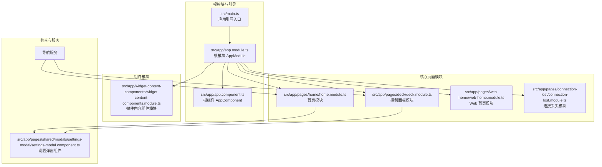
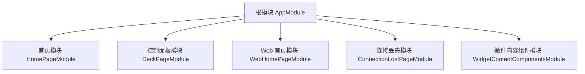
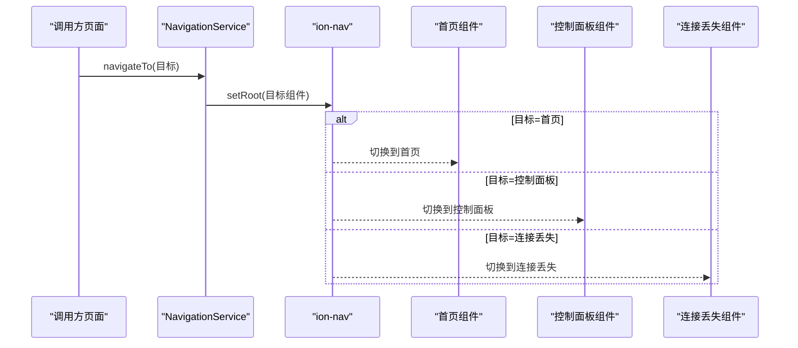
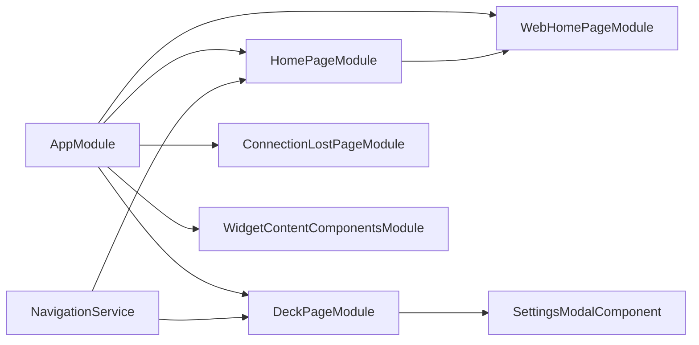

# 模块化设计

<cite>
**本文档引用的文件**
- [src/app/app.module.ts](file://src/app/app.module.ts)
- [src/app/app.component.ts](file://src/app/app.component.ts)
- [src/app/pages/home/home.module.ts](file://src/app/pages/home/home.module.ts)
- [src/app/pages/deck/deck.module.ts](file://src/app/pages/deck/deck.module.ts)
- [src/app/pages/web-home/web-home.module.ts](file://src/app/pages/web-home/web-home.module.ts)
- [src/app/pages/connection-lost/connection-lost.module.ts](file://src/app/pages/connection-lost/connection-lost.module.ts)
- [src/app/widget-content-components/widget-content-components.module.ts](file://src/app/widget-content-components/widget-content-components.module.ts)
- [src/app/services/navigation/navigation.service.ts](file://src/app/services/navigation/navigation.service.ts)
- [src/app/pages/shared/modals/settings-modal/settings-modal.component.ts](file://src/app/pages/shared/modals/settings-modal/settings-modal.component.ts)
- [src/main.ts](file://src/main.ts)
</cite>

## 更新摘要
**所做更改**
- 更新了模块化架构概述，反映当前保留的核心模块结构
- 修订了页面模块划分，说明各模块的当前职责和依赖关系
- 更新了组件模块设计，突出微件内容组件的简化结构
- 修正了导航服务和设置弹窗组件的架构说明
- 更新了架构图表，展示当前的模块依赖关系

## 目录
1. [简介](#简介)
2. [项目结构](#项目结构)
3. [核心组件](#核心组件)
4. [架构总览](#架构总览)
5. [详细组件分析](#详细组件分析)
6. [依赖分析](#依赖分析)
7. [性能考虑](#性能考虑)
8. [故障排查指南](#故障排查指南)
9. [结论](#结论)
10. [附录](#附录)

## 简介
本文件面向 Macro-Deck-Client-App 的模块化设计，系统性阐述应用的模块化架构与组织方式。经过前端架构重构后，应用采用了简化的模块化结构，重点包括：
- 根模块 AppModule 的职责与配置
- 核心功能模块划分：页面模块（home、deck、web-home、connection-lost）、组件模块（widget-content-components）
- 模块间的依赖关系与导入/导出机制
- 延迟加载策略与性能优化考量
- 模块设计最佳实践与扩展指南

## 项目结构
应用采用基于功能域的模块化组织方式，结合 Ionic/Angular 的页面模块与组件模块划分。经过重构后，模块结构得到简化，但仍保持清晰的功能分离：

**图表来源**
- [src/main.ts:1-15](file://src/main.ts#L1-L15)
- [src/app/app.module.ts:1-44](file://src/app/app.module.ts#L1-L44)
- [src/app/app.component.ts:1-69](file://src/app/app.component.ts#L1-L69)
- [src/app/pages/home/home.module.ts:1-39](file://src/app/pages/home/home.module.ts#L1-L39)
- [src/app/pages/deck/deck.module.ts:1-23](file://src/app/pages/deck/deck.module.ts#L1-L23)
- [src/app/pages/web-home/web-home.module.ts:1-22](file://src/app/pages/web-home/web-home.module.ts#L1-L22)
- [src/app/pages/connection-lost/connection-lost.module.ts:1-19](file://src/app/pages/connection-lost/connection-lost.module.ts#L1-L19)
- [src/app/widget-content-components/widget-content-components.module.ts:1-22](file://src/app/widget-content-components/widget-content-components.module.ts#L1-L22)

## 核心组件
- 根模块 AppModule：集中导入所有核心页面模块、组件模块、第三方库与服务工作线程，统一引导应用启动。
- 根组件 AppComponent：负责初始化存储、屏幕方向、唤醒锁、主题等全局能力，并监听深度链接事件。
- 页面模块：分别封装首页、控制面板、Web 首页、连接丢失等页面及其子组件。
- 组件模块：封装可复用的微件内容组件以及对外导出的通用模块。
- 导航服务：提供页面级导航逻辑，屏蔽具体页面实现细节。

**章节来源**
- [src/app/app.module.ts:18-43](file://src/app/app.module.ts#L18-L43)
- [src/app/app.component.ts:17-68](file://src/app/app.component.ts#L17-L68)
- [src/app/services/navigation/navigation.service.ts:9-47](file://src/app/services/navigation/navigation.service.ts#L9-L47)

## 架构总览
应用采用"根模块聚合 + 核心页面模块解耦 + 组件模块复用"的分层架构。根模块负责装配与引导；核心页面模块聚焦业务视图与交互；组件模块承载可复用 UI 元素；服务层提供横切关注点（导航、设置、网络等）。

**图表来源**
- [src/app/app.module.ts:19-42](file://src/app/app.module.ts#L19-L42)
- [src/app/pages/home/home.module.ts:20-38](file://src/app/pages/home/home.module.ts#L20-L38)
- [src/app/pages/deck/deck.module.ts:11-22](file://src/app/pages/deck/deck.module.ts#L11-L22)
- [src/app/pages/web-home/web-home.module.ts:9-21](file://src/app/pages/web-home/web-home.module.ts#L9-L21)
- [src/app/pages/connection-lost/connection-lost.module.ts:9-17](file://src/app/pages/connection-lost/connection-lost.module.ts#L9-L17)
- [src/app/widget-content-components/widget-content-components.module.ts:7-19](file://src/app/widget-content-components/widget-content-components.module.ts#L7-L19)

## 详细组件分析

### 根模块 AppModule 设计
- 职责：集中导入核心页面模块、组件模块、Ionic、HTTP、存储、表单、Service Worker 等，统一引导应用。
- 关键点：
  - 禁用 iOS 滑动返回手势，提升交互一致性。
  - 注册 Service Worker，生产环境启用，注册策略为"稳定后或30秒"。
  - 将设置弹窗组件与根组件纳入导入，便于跨模块使用。

**章节来源**
- [src/app/app.module.ts:19-42](file://src/app/app.module.ts#L19-L42)
- [src/app/app.module.ts:31-35](file://src/app/app.module.ts#L31-L35)

### 页面模块划分与职责
- 首页模块（home.module.ts）
  - 职责：声明首页页面与所有弹窗子组件（添加连接、连接中、连接失败、连接丢失、不安全连接、扫描网络接口、扫码器等）。
  - 依赖：Web 首页模块（用于 Web 环境下的页面复用）。
- 控制面板模块（deck.module.ts）
  - 职责：声明控制面板页面与微件网格、微件内容组件。
- Web 首页模块（web-home.module.ts）
  - 职责：声明并导出 Web 首页页面，供根组件按环境选择使用。
- 连接丢失模块（connection-lost.module.ts）
  - 职责：声明连接丢失页面，独立模块便于按需加载。

**章节来源**
- [src/app/pages/home/home.module.ts:20-38](file://src/app/pages/home/home.module.ts#L20-L38)
- [src/app/pages/deck/deck.module.ts:11-22](file://src/app/pages/deck/deck.module.ts#L11-L22)
- [src/app/pages/web-home/web-home.module.ts:9-21](file://src/app/pages/web-home/web-home.module.ts#L9-L21)
- [src/app/pages/connection-lost/connection-lost.module.ts:9-17](file://src/app/pages/connection-lost/connection-lost.module.ts#L9-L17)

### 组件模块（widget-content-components.module.ts）
- 职责：声明并导出按钮微件、空微件等可复用组件；同时导出触摸事件模块以供上层页面使用。
- 设计要点：将通用 UI 组件抽象为独立模块，降低页面耦合度，提升复用性。

**章节来源**
- [src/app/widget-content-components/widget-content-components.module.ts:7-19](file://src/app/widget-content-components/widget-content-components.module.ts#L7-L19)

### 导航服务（navigation.service.ts）
- 职责：提供页面级导航能力，屏蔽具体页面实现；根据环境变量选择首页组件类型。
- 关键流程：通过 DOM 中的 ion-nav 进行 setRoot 切换，支持首页、控制面板、连接丢失三类目标。

**图表来源**
- [src/app/services/navigation/navigation.service.ts:29-46](file://src/app/services/navigation/navigation.service.ts#L29-L46)

**章节来源**
- [src/app/services/navigation/navigation.service.ts:9-47](file://src/app/services/navigation/navigation.service.ts#L9-L47)

### 设置弹窗组件（settings-modal.component.ts）
- 职责：提供应用设置界面，支持屏幕常亮、菜单按钮、SSL 跳过、外观主题、屏幕方向、USB 连接参数、按钮微件边框样式等。
- 行为：保存设置后立即应用部分即时生效项（如唤醒锁、屏幕方向、主题），并通过事件通知上层刷新。

**章节来源**
- [src/app/pages/shared/modals/settings-modal/settings-modal.component.ts:13-103](file://src/app/pages/shared/modals/settings-modal/settings-modal.component.ts#L13-L103)

### 根组件与深度链接（app.component.ts）
- 职责：初始化存储、屏幕方向、唤醒锁、主题；在 Android 平台按设置决定是否跳过 SSL 校验；监听深度链接事件，解析快速设置二维码数据并广播事件。
- 与页面模块协作：根组件根据环境变量选择 Web 首页或原生首页作为根页面。

**章节来源**
- [src/app/app.component.ts:17-68](file://src/app/app.component.ts#L17-L68)

## 依赖分析
- 模块导入关系
  - AppModule 导入所有核心页面模块与组件模块，并引入 Ionic、HTTP、存储、表单、Service Worker。
  - 首页模块导入 Web 首页模块，以便在 Web 环境下复用页面。
  - 控制面板模块与设置弹窗组件存在直接依赖。
- 服务依赖关系
  - 导航服务被控制面板与首页页面使用，用于页面切换。
  - 根组件依赖诊断、设置、主题、唤醒锁服务进行初始化与运行时调整。
- 运行时依赖
  - angular.json 中配置了 Service Worker 与构建优化选项，影响打包体积与缓存策略。

**图表来源**
- [src/app/app.module.ts:20-36](file://src/app/app.module.ts#L20-L36)
- [src/app/pages/home/home.module.ts:26](file://src/app/pages/home/home.module.ts#L26)
- [src/app/pages/deck/deck.module.ts:17-19](file://src/app/pages/deck/deck.module.ts#L17-L19)
- [src/app/services/navigation/navigation.service.ts:15-20](file://src/app/services/navigation/navigation.service.ts#L15-L20)

**章节来源**
- [src/app/app.module.ts:20-36](file://src/app/app.module.ts#L20-L36)
- [src/app/pages/home/home.module.ts:26](file://src/app/pages/home/home.module.ts#L26)
- [src/app/pages/deck/deck.module.ts:17-19](file://src/app/pages/deck/deck.module.ts#L17-L19)
- [src/app/services/navigation/navigation.service.ts:15-20](file://src/app/services/navigation/navigation.service.ts#L15-L20)

## 性能考虑
- Service Worker 注册策略
  - 在非开发模式下启用，注册策略为"应用稳定后或30秒"，有助于首屏加载与离线体验。
- 构建配置
  - 生产环境开启输出哈希与预算限制，Web 环境提供额外的 baseHref 与 deployUrl，利于静态资源部署与缓存命中。
- 模块拆分带来的按需加载
  - 页面模块独立，结合路由懒加载可进一步减少初始包体；当前模块化已为懒加载奠定基础。
- 组件模块复用
  - 将通用微件抽取为独立模块，减少重复编译与运行时实例化成本。

**章节来源**
- [src/app/app.module.ts:31-35](file://src/app/app.module.ts#L31-L35)

## 故障排查指南
- 页面无法切换或空白
  - 检查导航服务的目标组件是否正确导入，确保 ion-nav 存在且可查询。
  - 确认环境变量导致的首页组件选择是否符合预期。
- 设置修改未生效
  - 检查设置弹窗保存逻辑是否调用即时应用方法（如唤醒锁、屏幕方向、主题）。
  - 确认 Android 平台的 SSL 跳过设置是否正确传递至 Capacitor 插件。
- 深度链接无效
  - 检查根组件对 appUrlOpen 事件的监听与数据解析流程。
  - 确认 URL 中的快速设置数据格式与编码是否正确。

**章节来源**
- [src/app/services/navigation/navigation.service.ts:29-46](file://src/app/services/navigation/navigation.service.ts#L29-L46)
- [src/app/pages/shared/modals/settings-modal/settings-modal.component.ts:84-103](file://src/app/pages/shared/modals/settings-modal/settings-modal.component.ts#L84-L103)
- [src/app/app.component.ts:58-66](file://src/app/app.component.ts#L58-L66)

## 结论
该应用通过明确的模块划分与清晰的依赖边界，实现了页面、组件与服务的解耦。根模块承担装配职责，核心页面模块聚焦业务视图，组件模块提升复用性，导航服务提供统一的页面切换能力。经过架构重构后，模块结构得到简化但仍保持良好的性能与可维护性。后续可在路由层面引入懒加载，进一步优化首屏加载与包体大小。

## 附录

### 模块设计最佳实践与扩展指南
- 模块划分原则
  - 页面模块：围绕单一业务视图组织，包含页面与其子组件与弹窗。
  - 组件模块：封装可复用 UI 组件，尽量保持无副作用与纯展示。
  - 共享模块：仅导出通用工具或第三方模块，避免引入业务逻辑。
- 导入/导出机制
  - 页面模块内部导入其依赖的子组件与弹窗；根模块统一导入页面模块与组件模块。
  - 组件模块仅导出必要依赖（如触摸事件模块），避免污染全局命名空间。
- 延迟加载策略
  - 将页面模块与组件模块拆分为独立文件，结合路由懒加载实现按需加载。
  - 对于大型第三方库或仅在特定场景使用的模块，优先考虑动态导入。
- 性能优化建议
  - 生产环境启用 Service Worker 与输出哈希，合理设置构建预算。
  - 减少根模块中的直接依赖，避免一次性加载过多模块。
  - 对高频组件进行虚拟滚动或分页处理，降低渲染压力。