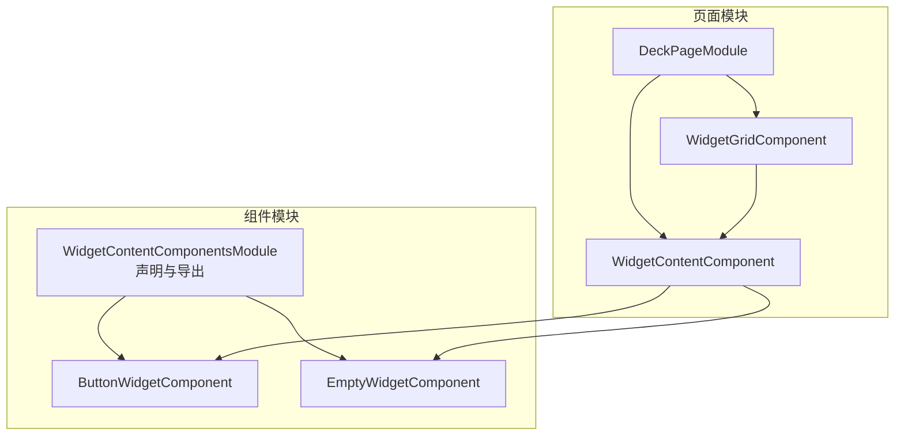
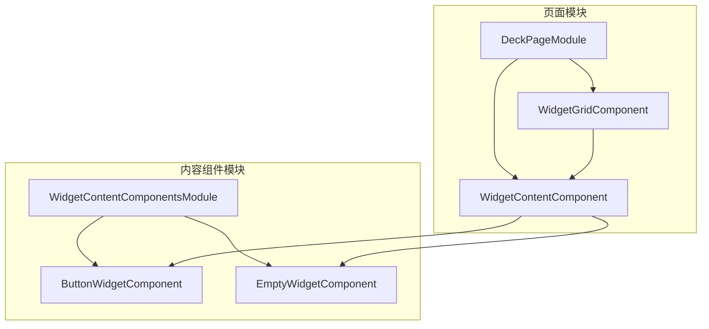
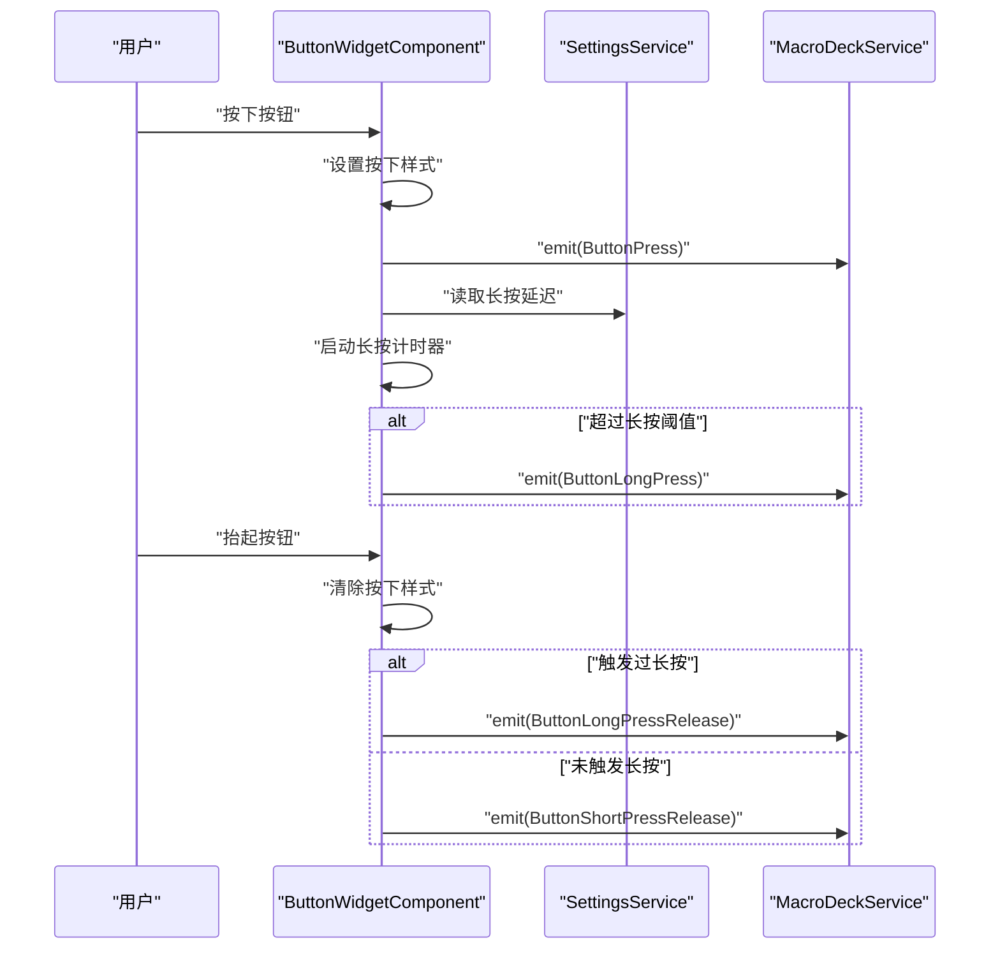
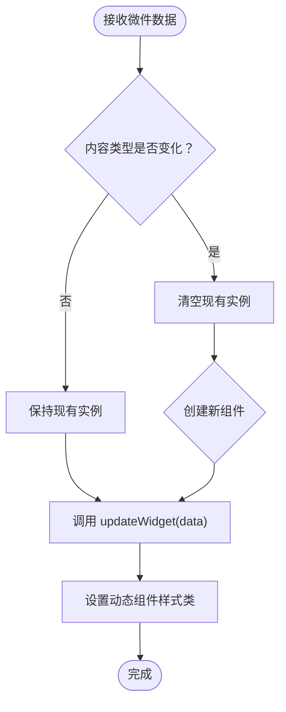
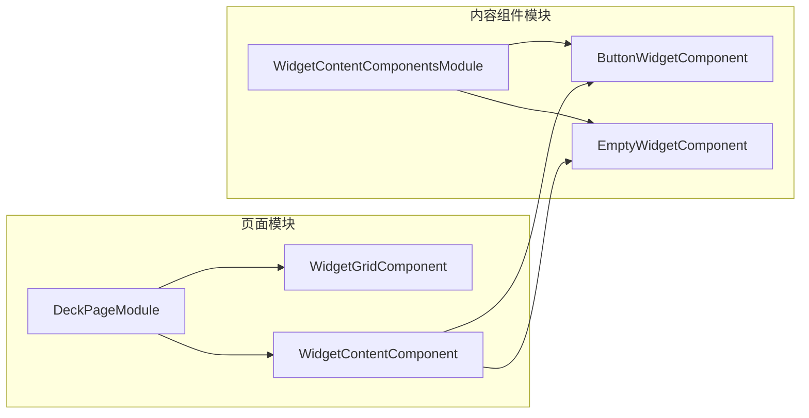

# 组件模块

<cite>
**本文档引用的文件**
- [widget-content-components.module.ts](file://src/app/widget-content-components/widget-content-components.module.ts)
- [button-widget.component.ts](file://src/app/widget-content-components/button-widget/button-widget.component.ts)
- [button-widget.component.html](file://src/app/widget-content-components/button-widget/button-widget.component.html)
- [button-widget-border-style.ts](file://src/app/widget-content-components/button-widget/button-widget-border-style.ts)
- [empty-widget.component.ts](file://src/app/widget-content-components/empty-widget/empty-widget.component.ts)
- [empty-widget.component.html](file://src/app/widget-content-components/empty-widget/empty-widget.component.html)
- [widget-grid.component.ts](file://src/app/pages/deck/widget-grid/widget-grid.component.ts)
- [widget-content.component.ts](file://src/app/pages/deck/widget-grid/widget-content/widget-content.component.ts)
- [widget-content.component.html](file://src/app/pages/deck/widget-grid/widget-content/widget-content.component.html)
- [widget.ts](file://src/app/datatypes/widgets/widget.ts)
- [button-widget.ts](file://src/app/datatypes/widgets/button-widget.ts)
- [widget-content-type.ts](file://src/app/enums/widget-content-type.ts)
- [widget-interaction-type.ts](file://src/app/enums/widget-interaction-type.ts)
- [settings.service.ts](file://src/app/services/settings/settings.service.ts)
- [deck.module.ts](file://src/app/pages/deck/deck.module.ts)
</cite>

## 目录
1. [简介](#简介)
2. [项目结构](#项目结构)
3. [核心组件](#核心组件)
4. [架构总览](#架构总览)
5. [详细组件分析](#详细组件分析)
6. [依赖分析](#依赖分析)
7. [性能考虑](#性能考虑)
8. [故障排查指南](#故障排查指南)
9. [结论](#结论)
10. [附录：自定义组件开发指南](#附录自定义组件开发指南)

## 简介
本文件聚焦于 Macro-Deck-Client-App 中“组件模块”的设计与实现，特别是 WidgetContentComponentsModule 的设计理念与组件组织方式。文档解释按钮微件与其他 UI 组件的模块化设计，涵盖组件的导入导出机制、依赖管理、与页面模块的交互关系，以及如何实现组件的复用与扩展。同时提供自定义组件开发的指导与最佳实践，并总结性能优化与懒加载策略。

## 项目结构
组件模块位于 src/app/widget-content-components 目录下，包含两个核心组件：按钮微件与空白微件；并通过模块集中声明与导出，供页面模块按需使用。

图表来源
- [widget-content-components.module.ts:1-42](file://src/app/widget-content-components/widget-content-components.module.ts#L1-L42)
- [deck.module.ts:1-44](file://src/app/pages/deck/deck.module.ts#L1-L44)
- [widget-grid.component.ts:1-335](file://src/app/pages/deck/widget-grid/widget-grid.component.ts#L1-L335)
- [widget-content.component.ts:1-152](file://src/app/pages/deck/widget-grid/widget-content/widget-content.component.ts#L1-L152)

章节来源
- [widget-content-components.module.ts:1-42](file://src/app/widget-content-components/widget-content-components.module.ts#L1-L42)
- [deck.module.ts:1-44](file://src/app/pages/deck/deck.module.ts#L1-L44)

## 核心组件
- 按钮微件组件：负责渲染按钮图标、标签与背景，处理按下/长按等交互事件，并通过服务层向后端发出交互事件。
- 空白微件组件：用于占位，展示背景色，便于网格对齐与视觉填充。
- 微件内容组件：根据微件类型动态创建并渲染对应子组件（按钮/空白），实现内容与表现的解耦。
- 微件网格组件：负责计算按钮尺寸、间距与圆角，生成绝对定位样式，并提供空白占位逻辑。

章节来源
- [button-widget.component.ts:1-393](file://src/app/widget-content-components/button-widget/button-widget.component.ts#L1-L393)
- [empty-widget.component.ts:1-57](file://src/app/widget-content-components/empty-widget/empty-widget.component.ts#L1-L57)
- [widget-content.component.ts:1-152](file://src/app/pages/deck/widget-grid/widget-content/widget-content.component.ts#L1-L152)
- [widget-grid.component.ts:1-335](file://src/app/pages/deck/widget-grid/widget-grid.component.ts#L1-L335)

## 架构总览
组件模块采用“内容组件模块 + 页面组件”的分层设计。内容组件模块集中声明与导出按钮/空白微件，页面模块引入网格与内容组件以完成布局与渲染。微件内容组件通过运行时动态创建的方式，将“类型选择”与“实例渲染”解耦，提升可扩展性。

图表来源
- [widget-content-components.module.ts:1-42](file://src/app/widget-content-components/widget-content-components.module.ts#L1-L42)
- [deck.module.ts:1-44](file://src/app/pages/deck/deck.module.ts#L1-L44)
- [widget-grid.component.ts:1-335](file://src/app/pages/deck/widget-grid/widget-grid.component.ts#L1-L335)
- [widget-content.component.ts:1-152](file://src/app/pages/deck/widget-grid/widget-content/widget-content.component.ts#L1-L152)

## 详细组件分析

### WidgetContentComponentsModule 设计理念与组织方式
- 导入与声明：模块集中导入按钮微件、空白微件及相关公共指令（如 NgStyle、NgIf），并在 imports 中统一声明，保证组件可用性。
- 导出策略：模块导出第三方事件模块（如 TouchEventModule），以便上层页面模块直接使用事件绑定能力，减少重复导入。
- 依赖管理：通过模块边界控制依赖范围，避免页面模块直接依赖第三方库，提升封装性与可维护性。

章节来源
- [widget-content-components.module.ts:1-42](file://src/app/widget-content-components/widget-content-components.module.ts#L1-L42)

### 按钮微件组件（ButtonWidgetComponent）
- 渲染职责：根据微件数据渲染前景图（标签）、图标与背景色；依据设置决定边框样式；支持圆角半径由网格统一提供。
- 交互处理：监听指针按下/抬起/离开事件，区分短按与长按，分别触发不同交互事件；长按阈值来自设置服务。
- 数据更新：订阅网格更新与设置应用事件，触发自身重绘；支持 Base64 图片的安全 URL 转换。
- 性能注意：使用 Renderer2 安全地增删 CSS 类，避免直接 DOM 操作引发的性能问题。

图表来源
- [button-widget.component.ts:1-393](file://src/app/widget-content-components/button-widget/button-widget.component.ts#L1-L393)
- [settings.service.ts:1-200](file://src/app/services/settings/settings.service.ts#L1-L200)
- [widget-interaction-type.ts:1-18](file://src/app/enums/widget-interaction-type.ts#L1-L18)

章节来源
- [button-widget.component.ts:1-393](file://src/app/widget-content-components/button-widget/button-widget.component.ts#L1-L393)
- [button-widget.component.html:1-14](file://src/app/widget-content-components/button-widget/button-widget.component.html#L1-L14)
- [button-widget-border-style.ts:1-12](file://src/app/widget-content-components/button-widget/button-widget-border-style.ts#L1-L12)
- [settings.service.ts:1-200](file://src/app/services/settings/settings.service.ts#L1-L200)
- [widget-interaction-type.ts:1-18](file://src/app/enums/widget-interaction-type.ts#L1-L18)

### 空白微件组件（EmptyWidgetComponent）
- 渲染职责：仅渲染背景色，圆角由网格组件提供；用于网格占位。
- 数据更新：接收微件数据后设置背景样式，保持与网格一致的视觉风格。

章节来源
- [empty-widget.component.ts:1-57](file://src/app/widget-content-components/empty-widget/empty-widget.component.ts#L1-L57)
- [empty-widget.component.html:1-4](file://src/app/widget-content-components/empty-widget/empty-widget.component.html#L1-L4)

### 微件内容组件（WidgetContentComponent）
- 动态渲染：根据微件内容类型（按钮/空白）动态创建对应组件实例，避免静态分支导致的复杂度上升。
- 生命周期管理：检测内容类型变化时清理旧实例并重建，确保组件状态正确；保持组件实例复用以降低开销。
- 样式注入：为动态组件设置统一的弹性布局类，保证在网格中自适应填充。

图表来源
- [widget-content.component.ts:1-152](file://src/app/pages/deck/widget-grid/widget-content/widget-content.component.ts#L1-L152)
- [widget-content-type.ts:1-12](file://src/app/enums/widget-content-type.ts#L1-L12)

章节来源
- [widget-content.component.ts:1-152](file://src/app/pages/deck/widget-grid/widget-content/widget-content.component.ts#L1-L152)
- [widget-content.component.html:1-2](file://src/app/pages/deck/widget-grid/widget-content/widget-content.component.html#L1-L2)
- [widget-content-type.ts:1-12](file://src/app/enums/widget-content-type.ts#L1-L12)

### 微件网格组件（WidgetGridComponent）
- 尺寸计算：根据容器尺寸与行列数计算按钮最佳尺寸、间距与圆角半径；响应窗口大小变化进行重算。
- 定位生成：为每个微件计算绝对定位样式，支持跨行跨列布局。
- 占位逻辑：若指定位置无微件数据，则构造空白占位微件，保证网格完整。
- 事件通知：尺寸更新时通过静态事件广播，驱动内容组件刷新。

章节来源
- [widget-grid.component.ts:1-335](file://src/app/pages/deck/widget-grid/widget-grid.component.ts#L1-L335)
- [widget.ts:1-33](file://src/app/datatypes/widgets/widget.ts#L1-L33)
- [button-widget.ts:1-16](file://src/app/datatypes/widgets/button-widget.ts#L1-L16)

### 页面模块与组件模块的交互
- 页面模块 DeckPageModule 直接声明并使用 WidgetGridComponent 与 WidgetContentComponent，不直接依赖第三方事件模块，而是通过内容组件模块间接获得事件能力。
- 内容组件模块集中导出第三方事件模块，简化页面模块的导入负担，提升模块复用性。

章节来源
- [deck.module.ts:1-44](file://src/app/pages/deck/deck.module.ts#L1-L44)
- [widget-content-components.module.ts:1-42](file://src/app/widget-content-components/widget-content-components.module.ts#L1-L42)

## 依赖分析
- 组件间依赖
  - WidgetContentComponent 依赖 ButtonWidgetComponent 与 EmptyWidgetComponent，实现多态渲染。
  - ButtonWidgetComponent 依赖设置服务与宏板服务，用于读取配置与发送交互事件。
  - WidgetGridComponent 依赖微件数据模型与内容组件，负责布局与样式生成。
- 模块间依赖
  - WidgetContentComponentsModule 向外导出第三方事件模块，供上层页面模块使用。
  - DeckPageModule 仅依赖 WidgetGridComponent 与 WidgetContentComponent，不直接依赖第三方库，降低耦合。

图表来源
- [widget-content-components.module.ts:1-42](file://src/app/widget-content-components/widget-content-components.module.ts#L1-L42)
- [deck.module.ts:1-44](file://src/app/pages/deck/deck.module.ts#L1-L44)
- [widget-content.component.ts:1-152](file://src/app/pages/deck/widget-grid/widget-content/widget-content.component.ts#L1-L152)

章节来源
- [widget-content-components.module.ts:1-42](file://src/app/widget-content-components/widget-content-components.module.ts#L1-L42)
- [deck.module.ts:1-44](file://src/app/pages/deck/deck.module.ts#L1-L44)

## 性能考虑
- 动态组件复用：WidgetContentComponent 在内容类型不变时复用同一实例，减少创建/销毁成本。
- 事件节流与延迟：网格尺寸重算使用延迟与 tick 触发，避免频繁重排。
- 最小化 DOM 操作：按钮组件通过 Renderer2 安全切换样式类，避免直接修改 DOM 属性带来的回流。
- 懒加载策略建议
  - 可将按钮微件与空白微件拆分为独立特性模块，结合路由或按需加载策略进一步降低首屏体积。
  - 对 Base64 图片渲染采用懒加载与缓存策略，减少内存占用与网络请求次数。
  - 将第三方事件模块的使用限制在必要场景，避免不必要的包体增长。

## 故障排查指南
- 按钮无响应或长按不生效
  - 检查设置服务中的长按延迟配置是否合理。
  - 确认按钮组件事件绑定是否正确，以及交互事件是否被服务层正确转发。
- 边框样式异常
  - 检查边框样式枚举与网格圆角半径是否一致。
  - 确认背景色与边框颜色对比度设置是否符合预期。
- 网格布局错位
  - 检查窗口尺寸变化监听与尺寸计算逻辑，确认重算时机与参数。
  - 核对微件跨行跨列配置与定位计算结果。

章节来源
- [settings.service.ts:1-200](file://src/app/services/settings/settings.service.ts#L1-L200)
- [button-widget-border-style.ts:1-12](file://src/app/widget-content-components/button-widget/button-widget-border-style.ts#L1-L12)
- [widget-grid.component.ts:1-335](file://src/app/pages/deck/widget-grid/widget-grid.component.ts#L1-L335)

## 结论
WidgetContentComponentsModule 通过清晰的模块边界与组件职责划分，实现了按钮与空白微件的高内聚、低耦合设计。配合动态内容组件与网格布局系统，形成可扩展、易维护的 UI 架构。建议在后续迭代中引入更细粒度的懒加载与缓存策略，持续优化性能与用户体验。

## 附录：自定义组件开发指南
- 组件职责单一：每个组件只负责一种内容类型的渲染与交互，便于测试与复用。
- 依赖注入规范：优先使用服务层读取配置与状态，避免在组件中直接访问全局状态。
- 动态渲染模式：参考 WidgetContentComponent 的实现，使用 ViewContainerRef 动态创建组件，支持类型扩展。
- 样式与主题：统一从网格组件获取圆角、间距等样式参数，确保整体一致性。
- 事件与通信：通过服务层发布/订阅交互事件，避免组件间直接耦合。
- 性能优化要点：避免在模板中执行复杂逻辑；使用变更检测策略与懒加载技术降低开销。