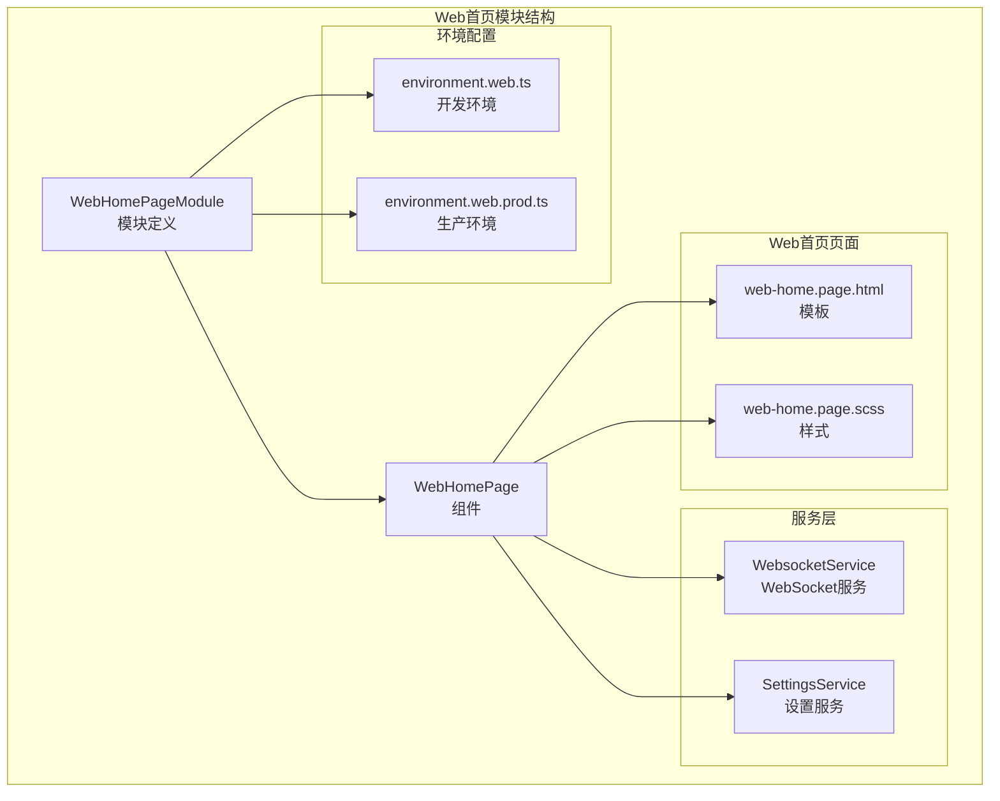
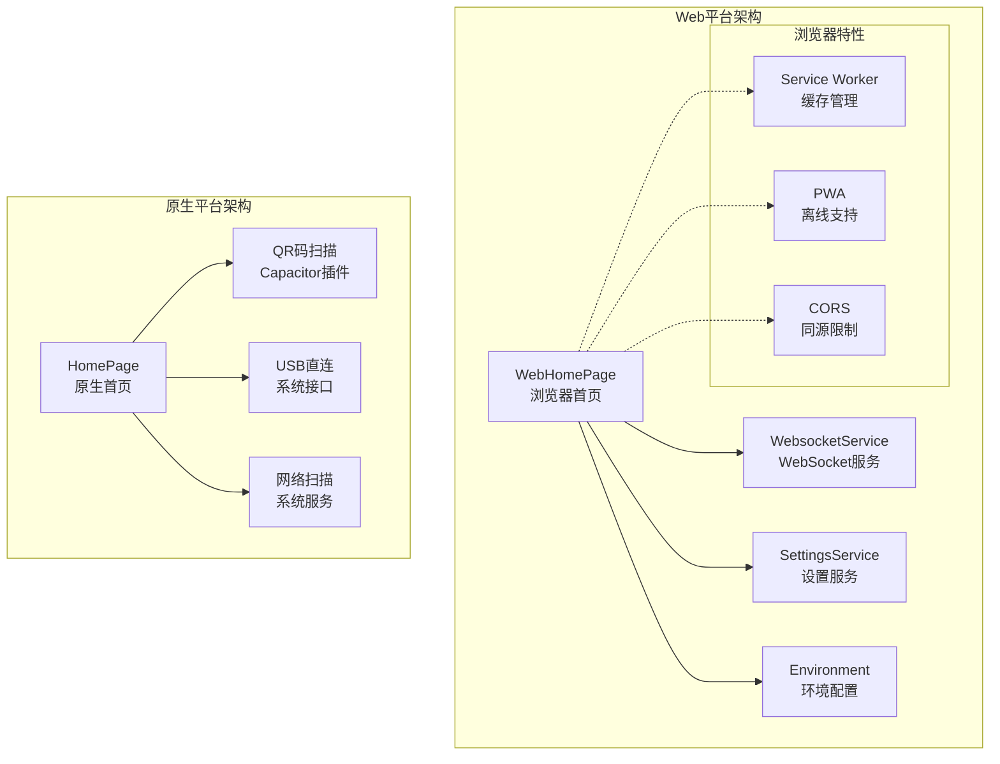
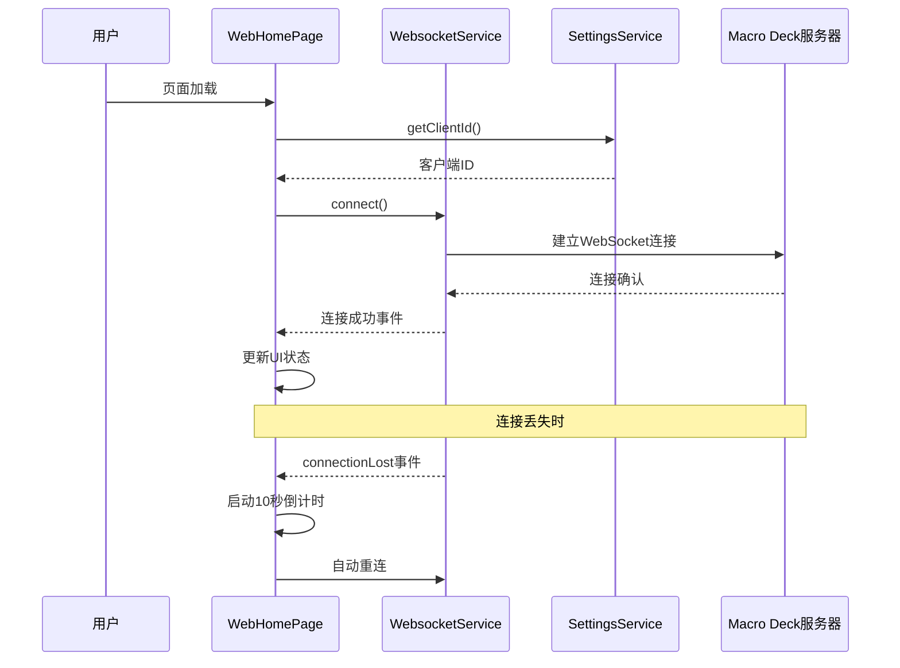
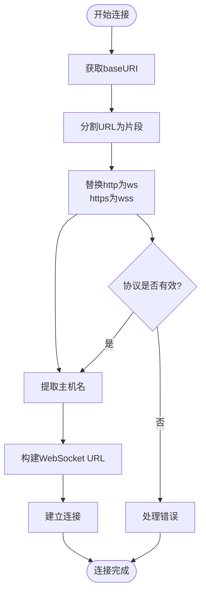
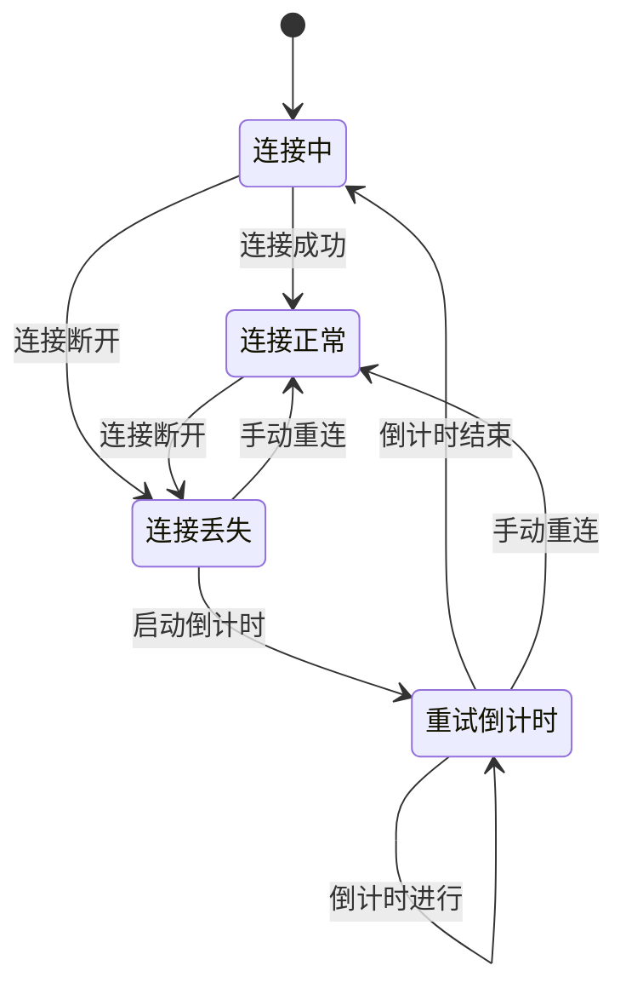
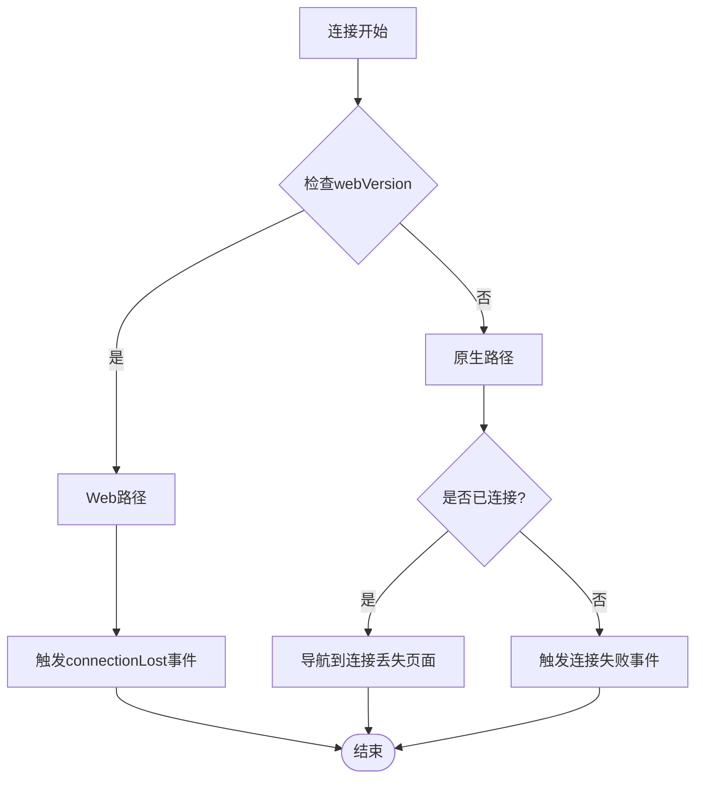
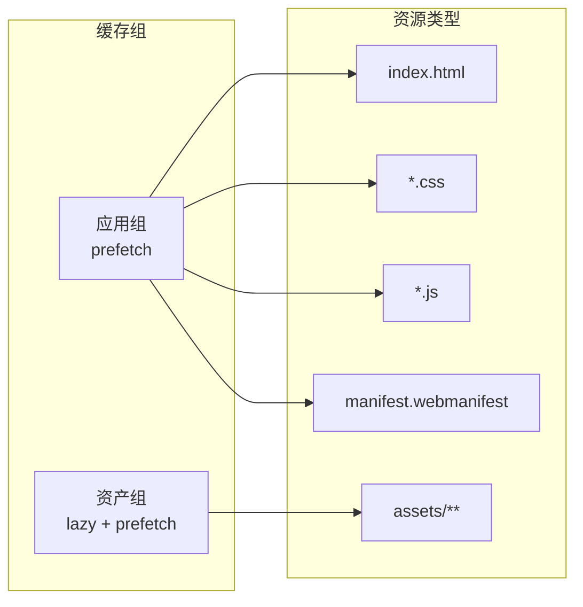
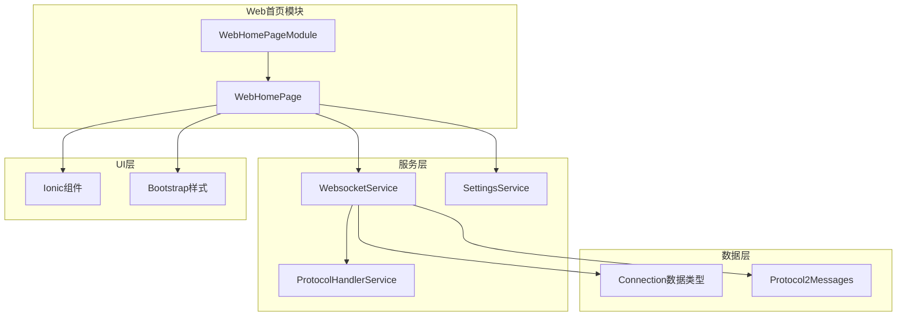

# Web首页模块

<cite>
**本文档引用的文件**
- [web-home.module.ts](file://src/app/pages/web-home/web-home.module.ts)
- [web-home.page.ts](file://src/app/pages/web-home/web-home.page.ts)
- [web-home.page.html](file://src/app/pages/web-home/web-home.page.html)
- [web-home.page.scss](file://src/app/pages/web-home/web-home.page.scss)
- [home.module.ts](file://src/app/pages/home/home.module.ts)
- [home.page.ts](file://src/app/pages/home/home.page.ts)
- [websocket.service.ts](file://src/app/services/websocket/websocket.service.ts)
- [settings.service.ts](file://src/app/services/settings/settings.service.ts)
- [environment.web.ts](file://src/environments/environment.web.ts)
- [environment.web.prod.ts](file://src/environments/environment.web.prod.ts)
- [qr-code-scanner.component.ts](file://src/app/pages/home/modals/add-connection/qr-code-scanner/qr-code-scanner.component.ts)
- [qr-code-scanner-ui.component.ts](file://src/app/pages/home/modals/add-connection/qr-code-scanner/qr-code-scanner-ui/qr-code-scanner-ui.component.ts)
- [manifest.webmanifest](file://src/manifest.webmanifest)
- [ngsw-config.json](file://src/ngsw-config.json)
- [package.json](file://src/package.json)
</cite>

## 目录
1. [简介](#简介)
2. [项目结构](#项目结构)
3. [核心组件](#核心组件)
4. [架构概览](#架构概览)
5. [详细组件分析](#详细组件分析)
6. [依赖关系分析](#依赖关系分析)
7. [性能考虑](#性能考虑)
8. [故障排除指南](#故障排除指南)
9. [结论](#结论)
10. [附录](#附录)

## 简介

Web首页模块是Macro-Deck-Client-App专门为Web平台设计的首页实现，与原生移动端首页模块相比具有显著的功能差异和适配策略。该模块专注于浏览器环境下的直接连接能力，提供了简化的用户界面和特定的连接管理机制。

Web首页模块的主要特点包括：
- 浏览器同源连接支持
- 简化的连接管理界面
- 自动重连机制
- PWA特性集成
- Service Worker缓存支持

## 项目结构

Web首页模块在项目中的组织结构如下：

**图表来源**
- [web-home.module.ts:1-42](file://src/app/pages/web-home/web-home.module.ts#L1-L42)
- [web-home.page.ts:1-146](file://src/app/pages/web-home/web-home.page.ts#L1-L146)

**章节来源**
- [web-home.module.ts:1-42](file://src/app/pages/web-home/web-home.module.ts#L1-L42)
- [web-home.page.ts:1-146](file://src/app/pages/web-home/web-home.page.ts#L1-L146)

## 核心组件

Web首页模块包含以下核心组件和服务：

### WebHomePage组件
WebHomePage是Web平台专用的首页组件，继承了基础的连接管理功能，但针对浏览器环境进行了简化：

- **客户端ID管理**：从SettingsService获取唯一的客户端标识符
- **版本信息显示**：显示"Web Version"标识
- **自动连接**：启动时自动尝试连接
- **连接丢失处理**：实现10秒倒计时自动重连
- **手动重连**：提供重试按钮

### WebHomePageModule模块
模块定义了Web首页的依赖注入和组件导出：

- **导入模块**：CommonModule、FormsModule、IonicModule
- **组件导出**：WebHomePage组件
- **路由集成**：与主应用模块集成

**章节来源**
- [web-home.page.ts:17-82](file://src/app/pages/web-home/web-home.page.ts#L17-L82)
- [web-home.module.ts:10-21](file://src/app/pages/web-home/web-home.module.ts#L10-L21)

## 架构概览

Web首页模块采用分层架构设计，与原生首页模块形成互补关系：

**图表来源**
- [web-home.page.ts:32-47](file://src/app/pages/web-home/web-home.page.ts#L32-L47)
- [home.page.ts:39-139](file://src/app/pages/home/home.page.ts#L39-L139)

## 详细组件分析

### WebHomePage组件详细分析

WebHomePage组件实现了浏览器环境下的连接管理逻辑：

#### 连接管理流程

**图表来源**
- [web-home.page.ts:40-79](file://src/app/pages/web-home/web-home.page.ts#L40-L79)
- [websocket.service.ts:141-172](file://src/app/services/websocket/websocket.service.ts#L141-L172)

#### 连接URL构建算法

WebHomePage实现了智能的连接URL构建逻辑：

**图表来源**
- [web-home.page.ts:132-142](file://src/app/pages/web-home/web-home.page.ts#L132-L142)

#### 连接丢失处理机制

WebHomePage实现了完整的连接丢失恢复机制：

**图表来源**
- [web-home.page.ts:53-62](file://src/app/pages/web-home/web-home.page.ts#L53-L62)
- [web-home.page.ts:121-130](file://src/app/pages/web-home/web-home.page.ts#L121-L130)

**章节来源**
- [web-home.page.ts:68-79](file://src/app/pages/web-home/web-home.page.ts#L68-L79)
- [web-home.page.ts:132-142](file://src/app/pages/web-home/web-home.page.ts#L132-L142)

### WebsocketService集成分析

WebsocketService在Web首页模块中的特殊处理：

#### Web版本专用错误处理

**图表来源**
- [websocket.service.ts:380-393](file://src/app/services/websocket/websocket.service.ts#L380-L393)

**章节来源**
- [websocket.service.ts:204-219](file://src/app/services/websocket/websocket.service.ts#L204-L219)
- [websocket.service.ts:380-393](file://src/app/services/websocket/websocket.service.ts#L380-L393)

### 环境配置分析

Web首页模块使用专门的环境配置：

#### 环境变量对比

| 配置项 | Web开发环境 | Web生产环境 | 原生环境 |
|--------|-------------|-------------|----------|
| production | false | true | false/true |
| webVersion | true | true | false |
| version | "3.0.0" | "3.0.0" | 动态获取 |

**章节来源**
- [environment.web.ts:2-9](file://src/environments/environment.web.ts#L2-L9)
- [environment.web.prod.ts:2-9](file://src/environments/environment.web.prod.ts#L2-L9)

### PWA和Service Worker集成

Web首页模块充分利用了现代浏览器的PWA特性：

#### Service Worker缓存策略

**图表来源**
- [ngsw-config.json:4-29](file://src/ngsw-config.json#L4-L29)

**章节来源**
- [ngsw-config.json:1-31](file://src/ngsw-config.json#L1-L31)
- [manifest.webmanifest:1-48](file://src/manifest.webmanifest#L1-L48)

## 依赖关系分析

Web首页模块与其他组件的依赖关系：

**图表来源**
- [web-home.module.ts:10-21](file://src/app/pages/web-home/web-home.module.ts#L10-L21)
- [web-home.page.ts:32-34](file://src/app/pages/web-home/web-home.page.ts#L32-L34)

**章节来源**
- [home.module.ts:21-37](file://src/app/pages/home/home.module.ts#L21-L37)
- [home.page.ts:154-192](file://src/app/pages/home/home.page.ts#L154-L192)

## 性能考虑

Web首页模块在性能优化方面采用了多项策略：

### 连接管理优化

1. **智能重连机制**：10秒倒计时避免频繁重连
2. **内存管理**：及时清理定时器和订阅
3. **UI响应性**：异步操作不影响主线程

### 缓存策略

1. **预缓存关键资源**：HTML、CSS、JS文件
2. **懒加载静态资源**：图片和其他媒体文件
3. **Service Worker管理**：智能更新策略

### 浏览器兼容性

1. **现代浏览器支持**：基于ES6+和现代API
2. **渐进式增强**：核心功能在旧版浏览器可用
3. **错误降级**：网络异常时提供清晰反馈

## 故障排除指南

### 常见问题及解决方案

#### 连接问题

| 问题症状 | 可能原因 | 解决方案 |
|----------|----------|----------|
| 无法连接服务器 | CORS限制 | 确保服务器支持跨域请求 |
| 连接频繁断开 | 网络不稳定 | 检查网络连接质量 |
| 自动重连无效 | 定时器未清理 | 检查组件生命周期管理 |

#### PWA相关问题

| 问题症状 | 可能原因 | 解决方案 |
|----------|----------|----------|
| 离线功能失效 | Service Worker注册失败 | 清除浏览器缓存重新加载 |
| 更新不生效 | 缓存版本过期 | 强制刷新页面或等待更新 |

**章节来源**
- [web-home.page.ts:53-62](file://src/app/pages/web-home/web-home.page.ts#L53-L62)
- [websocket.service.ts:197-219](file://src/app/services/websocket/websocket.service.ts#L197-L219)

## 结论

Web首页模块为Macro-Deck-Client-App提供了专门的浏览器端解决方案，通过以下方式实现了与原生平台的有效互补：

1. **功能差异化**：专注于浏览器同源连接，简化了复杂的连接管理
2. **用户体验优化**：提供了更简洁的界面和自动重连机制
3. **技术栈适配**：充分利用了现代浏览器的PWA和Service Worker特性
4. **维护成本降低**：共享核心业务逻辑，减少代码重复

Web首页模块的成功实施证明了多平台架构的优势，为用户在不同设备上提供了统一的应用体验。

## 附录

### 安装和部署指南

#### Web版本部署要求

1. **服务器配置**：需要支持WebSocket和CORS的HTTP服务器
2. **SSL证书**：生产环境建议使用HTTPS
3. **域名设置**：确保域名解析正确

#### PWA配置要点

1. **Service Worker**：确保Angular Service Worker正确配置
2. **清单文件**：验证manifest.webmanifest的完整性
3. **缓存策略**：根据实际需求调整ngsw-config.json

**章节来源**
- [package.json:25](file://src/package.json#L25)
- [manifest.webmanifest:1-48](file://src/manifest.webmanifest#L1-L48)
- [ngsw-config.json:1-31](file://src/ngsw-config.json#L1-L31)