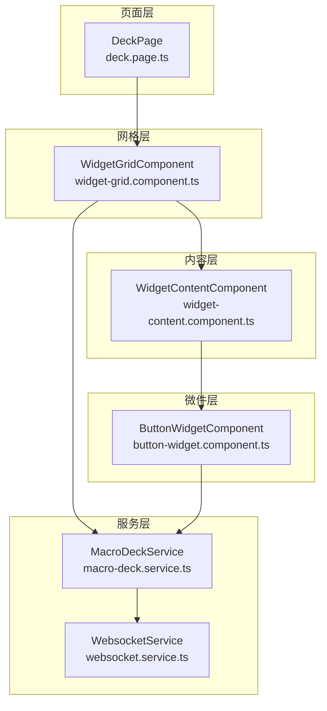
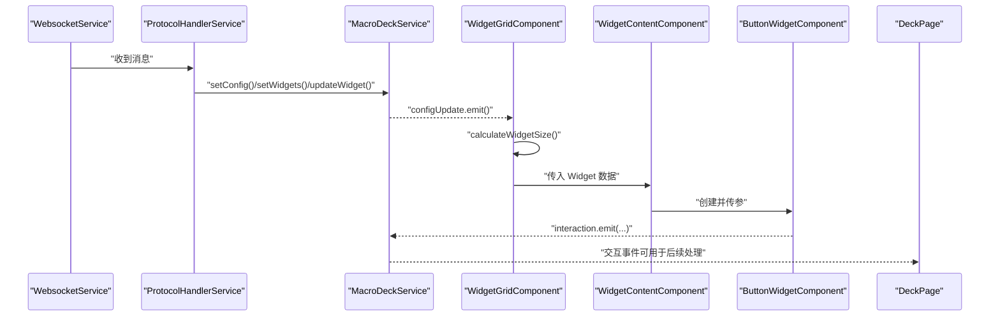
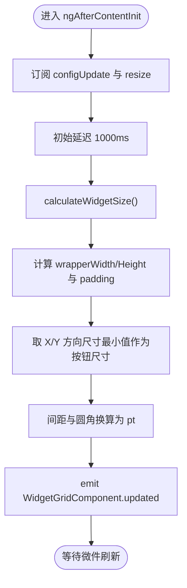
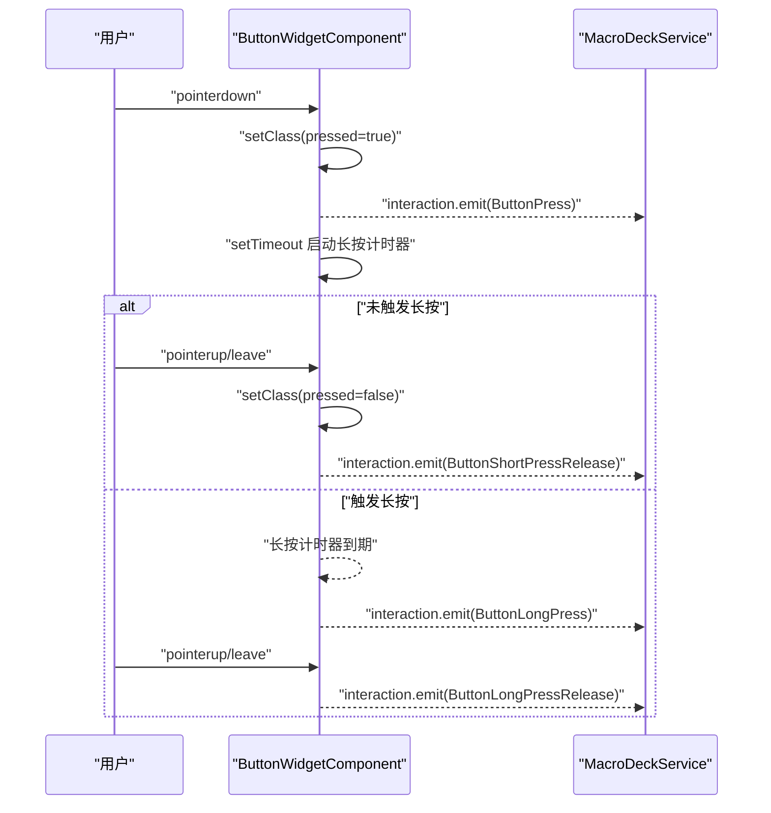
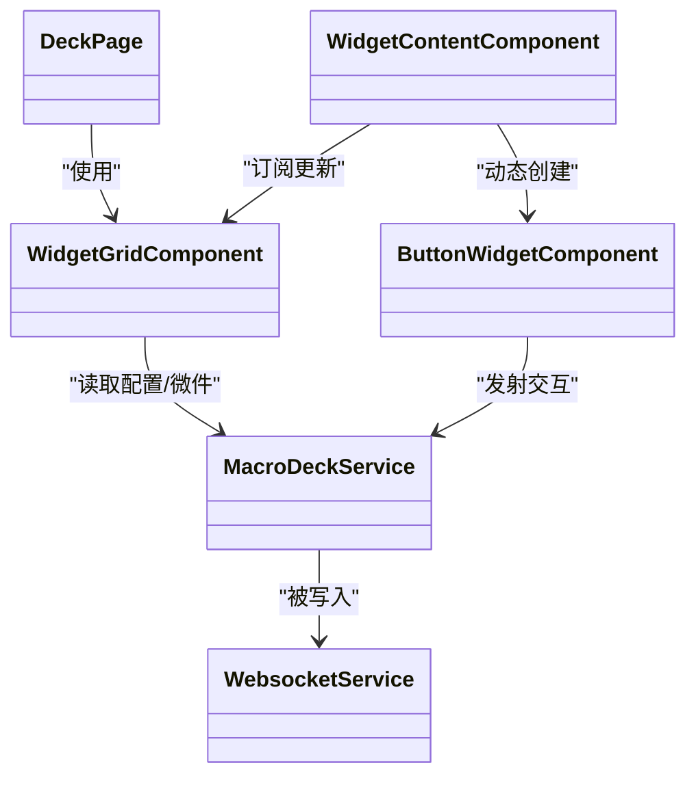

# 控制面板模块

<cite>
**本文档引用的文件**
- [deck.module.ts](file://src/app/pages/deck/deck.module.ts)
- [deck.page.ts](file://src/app/pages/deck/deck.page.ts)
- [deck.page.html](file://src/app/pages/deck/deck.page.html)
- [widget-grid.component.ts](file://src/app/pages/deck/widget-grid/widget-grid.component.ts)
- [widget-grid.component.html](file://src/app/pages/deck/widget-grid/widget-grid.component.html)
- [widget-content.component.ts](file://src/app/pages/deck/widget-grid/widget-content/widget-content.component.ts)
- [widget-content.component.html](file://src/app/pages/deck/widget-grid/widget-content/widget-content.component.html)
- [button-widget.component.ts](file://src/app/widget-content-components/button-widget/button-widget.component.ts)
- [button-widget.component.html](file://src/app/widget-content-components/button-widget/button-widget.component.html)
- [macro-deck.service.ts](file://src/app/services/macro-deck/macro-deck.service.ts)
- [websocket.service.ts](file://src/app/services/websocket/websocket.service.ts)
- [widget.ts](file://src/app/datatypes/widgets/widget.ts)
- [button-widget.ts](file://src/app/datatypes/widgets/button-widget.ts)
- [widget-content-type.ts](file://src/app/enums/widget-content-type.ts)
- [widget-interaction-type.ts](file://src/app/enums/widget-interaction-type.ts)
</cite>

## 目录
1. [简介](#简介)
2. [项目结构](#项目结构)
3. [核心组件](#核心组件)
4. [架构总览](#架构总览)
5. [组件详解](#组件详解)
6. [依赖关系分析](#依赖关系分析)
7. [性能考量](#性能考量)
8. [故障排查指南](#故障排查指南)
9. [结论](#结论)
10. [附录：自定义开发与样式定制](#附录自定义开发与样式定制)

## 简介
本文件系统化梳理 Macro-Deck-Client-App 的控制面板模块，重点围绕 DeckPageModule 的架构设计与组件组织，深入解析主控制面板页面 DeckPage 的功能实现与布局管理；全面阐述 widget-grid 组件系统的实现原理，包括按钮网格的渲染机制、微件的动态加载与交互处理；说明控制面板与 WebSocket 服务的数据绑定关系与实时更新机制；并提供按钮微件的自定义开发指南与样式定制方法，以及响应式设计与触摸交互优化策略。

## 项目结构
控制面板模块位于 src/app/pages/deck 下，采用“页面 + 子组件”的分层组织方式：
- 页面层：DeckPage 负责菜单、全屏、设置弹窗、连接状态检查与全局展示逻辑
- 网格层：WidgetGridComponent 负责网格布局计算、尺寸适配、微件定位与事件广播
- 内容层：WidgetContentComponent 负责根据微件类型动态创建并渲染具体微件组件
- 微件层：ButtonWidgetComponent 等负责具体微件的视觉呈现与交互事件发射
- 服务层：MacroDeckService 提供配置与微件数据状态管理；WebsocketService 提供实时通信与消息路由

图表来源
- [deck.page.ts:14-86](file://src/app/pages/deck/deck.page.ts#L14-L86)
- [widget-grid.component.ts:19-191](file://src/app/pages/deck/widget-grid/widget-grid.component.ts#L19-L191)
- [widget-content.component.ts:10-85](file://src/app/pages/deck/widget-grid/widget-content/widget-content.component.ts#L10-L85)
- [button-widget.component.ts:14-227](file://src/app/widget-content-components/button-widget/button-widget.component.ts#L14-L227)
- [macro-deck.service.ts:6-66](file://src/app/services/macro-deck/macro-deck.service.ts#L6-L66)
- [websocket.service.ts:16-230](file://src/app/services/websocket/websocket.service.ts#L16-L230)

章节来源
- [deck.module.ts:11-22](file://src/app/pages/deck/deck.module.ts#L11-L22)
- [deck.page.html:1-49](file://src/app/pages/deck/deck.page.html#L1-L49)

## 核心组件
- DeckPage：控制面板主页面，负责菜单、全屏、设置弹窗、连接状态检查与展示；通过注入 WebsocketService、ModalController、SettingsService、DiagnosticService、NavigationService 实现页面行为
- WidgetGridComponent：网格布局核心，监听配置更新与窗口尺寸变化，计算按钮尺寸、间距、圆角，生成每个微件的绝对定位样式，并提供空白占位微件
- WidgetContentComponent：动态内容组件，依据 WidgetContentType 在运行时创建并复用具体微件组件（如 EmptyWidget、ButtonWidget）
- ButtonWidgetComponent：按钮微件的具体实现，负责图标/前景图解码、背景色与边框样式、长按/短按交互事件发射
- MacroDeckService：核心状态服务，维护面板配置（行/列、间距、圆角、背景开关）、微件列表与交互事件发射
- WebsocketService：WebSocket 通信服务，负责连接生命周期、消息订阅与协议处理转发

章节来源
- [deck.page.ts:14-86](file://src/app/pages/deck/deck.page.ts#L14-L86)
- [widget-grid.component.ts:19-191](file://src/app/pages/deck/widget-grid/widget-grid.component.ts#L19-L191)
- [widget-content.component.ts:10-85](file://src/app/pages/deck/widget-grid/widget-content/widget-content.component.ts#L10-L85)
- [button-widget.component.ts:14-227](file://src/app/widget-content-components/button-widget/button-widget.component.ts#L14-L227)
- [macro-deck.service.ts:6-66](file://src/app/services/macro-deck/macro-deck.service.ts#L6-L66)
- [websocket.service.ts:16-230](file://src/app/services/websocket/websocket.service.ts#L16-L230)

## 架构总览
控制面板模块遵循“页面-网格-内容-微件-服务”的分层架构，数据与事件流如下：
- WebSocket 接收来自服务器的配置与微件数据，经协议处理后写入 MacroDeckService
- MacroDeckService 通过 configUpdate 通知 WidgetGridComponent 重新计算布局
- WidgetGridComponent 计算每个微件的绝对定位与尺寸，生成 WidgetContent 的输入数据
- WidgetContentComponent 根据 WidgetContentType 动态创建具体微件组件并传入数据
- ButtonWidgetComponent 等微件组件渲染 UI 并通过 MacroDeckService.interaction 发射交互事件
- DeckPage 展示页面并提供菜单、全屏、设置弹窗等交互入口

图表来源
- [websocket.service.ts:101-134](file://src/app/services/websocket/websocket.service.ts#L101-L134)
- [macro-deck.service.ts:36-65](file://src/app/services/macro-deck/macro-deck.service.ts#L36-L65)
- [widget-grid.component.ts:68-86](file://src/app/pages/deck/widget-grid/widget-grid.component.ts#L68-L86)
- [widget-content.component.ts:45-79](file://src/app/pages/deck/widget-grid/widget-content/widget-content.component.ts#L45-L79)
- [button-widget.component.ts:383-391](file://src/app/widget-content-components/button-widget/button-widget.component.ts#L383-L391)

## 组件详解

### DeckPage：主控制面板页面
- 职责
  - 连接状态检查：若未连接则导航至首页
  - 展示信息：读取客户端 ID 与应用版本
  - 设置弹窗：打开设置并重新加载设置
  - 全屏模式：请求全屏
  - 菜单按钮：根据设置决定是否显示悬浮菜单按钮
- 与服务交互
  - WebsocketService：检查连接状态、关闭连接
  - ModalController：打开设置弹窗
  - SettingsService：读取客户端 ID、版本、菜单按钮显示设置
  - DiagnosticService：获取版本号
  - NavigationService：导航到首页或连接丢失页

章节来源
- [deck.page.ts:14-86](file://src/app/pages/deck/deck.page.ts#L14-L86)
- [deck.page.html:1-49](file://src/app/pages/deck/deck.page.html#L1-L49)

### WidgetGridComponent：网格布局与渲染
- 职责
  - 监听 MacroDeckService.configUpdate 与窗口 resize，重新计算按钮尺寸、间距与圆角
  - 计算每个微件的绝对定位样式（width、height、top、left），支持跨行跨列
  - 生成空白占位微件以填充空位
  - 广播 WidgetGridComponent.updated 事件，驱动微件组件刷新
- 关键算法
  - 尺寸计算：取容器宽高分别除以列数与行数的商的最小值，保证正方形按钮
  - 间距与圆角：从百分比换算为 pt（px→pt 比例 72/96）
  - 定位：计算网格偏移量，再叠加列/行索引乘以按钮尺寸
- 性能要点
  - 使用 setTimeout 延迟计算，避免视图未渲染完成导致尺寸异常
  - 在布局更新后调用 ApplicationRef.tick() 触发变更检测

图表来源
- [widget-grid.component.ts:68-86](file://src/app/pages/deck/widget-grid/widget-grid.component.ts#L68-L86)
- [widget-grid.component.ts:92-116](file://src/app/pages/deck/widget-grid/widget-grid.component.ts#L92-L116)

章节来源
- [widget-grid.component.ts:19-191](file://src/app/pages/deck/widget-grid/widget-grid.component.ts#L19-L191)
- [widget-grid.component.html:1-13](file://src/app/pages/deck/widget-grid/widget-grid.component.html#L1-L13)

### WidgetContentComponent：动态内容装载
- 职责
  - 根据 Widget.widgetContentType 动态创建并复用具体微件组件
  - 当内容类型变化时清理旧组件并重建
  - 将 Widget 数据传入具体微件组件实例
- 生命周期
  - 输入属性 data 变化时触发 updateContent
  - 组件销毁时取消订阅

章节来源
- [widget-content.component.ts:10-85](file://src/app/pages/deck/widget-grid/widget-content/widget-content.component.ts#L10-L85)
- [widget-content.component.html:1-2](file://src/app/pages/deck/widget-grid/widget-content/widget-content.component.html#L1-L2)

### ButtonWidgetComponent：按钮微件
- 职责
  - 渲染按钮背景色、图标与前景图（Base64 解码为安全 URL）
  - 根据背景色调整边框颜色，支持无边框或彩色边框样式
  - 处理按下/抬起/长按/长按抬起事件，发射交互事件
- 交互流程
  - pointerdown：添加按下样式，发射 ButtonPress，启动长按计时器
  - pointerup/leave：根据是否触发长按发射短按/长按释放事件，清除计时器
- 与服务交互
  - 订阅 WidgetGridComponent.updated 与设置变更事件，自动刷新
  - 通过 MacroDeckService.interaction 发射交互事件

图表来源
- [button-widget.component.ts:131-184](file://src/app/widget-content-components/button-widget/button-widget.component.ts#L131-L184)
- [button-widget.component.ts:325-365](file://src/app/widget-content-components/button-widget/button-widget.component.ts#L325-L365)
- [macro-deck.service.ts:13-14](file://src/app/services/macro-deck/macro-deck.service.ts#L13-L14)

章节来源
- [button-widget.component.ts:14-227](file://src/app/widget-content-components/button-widget/button-widget.component.ts#L14-L227)
- [button-widget.component.html:1-14](file://src/app/widget-content-components/button-widget/button-widget.component.html#L1-L14)

### 数据模型与枚举
- Widget：描述微件位置、跨行跨列、背景色、内容类型与具体内容
- ButtonWidget：按钮微件内容，包含图标与标签的 Base64 数据
- WidgetContentType：内容类型枚举（empty、button）
- WidgetInteractionType：交互类型枚举（按下、短按释放、长按、长按释放）

章节来源
- [widget.ts:4-20](file://src/app/datatypes/widgets/widget.ts#L4-L20)
- [button-widget.ts:3-9](file://src/app/datatypes/widgets/button-widget.ts#L3-L9)
- [widget-content-type.ts:1-12](file://src/app/enums/widget-content-type.ts#L1-L12)
- [widget-interaction-type.ts:1-18](file://src/app/enums/widget-interaction-type.ts#L1-L18)

## 依赖关系分析
- 组件耦合
  - WidgetGridComponent 依赖 MacroDeckService 的配置与微件列表，同时向外广播布局更新事件
  - WidgetContentComponent 依赖 WidgetContentType 枚举，动态创建子组件
  - ButtonWidgetComponent 依赖 SettingsService 与 MacroDeckService，订阅布局更新事件
- 服务耦合
  - MacroDeckService 作为状态中心，被多个组件读取与写入
  - WebsocketService 负责消息接收与协议处理，最终写入 MacroDeckService
- 外部依赖
  - RxJS 用于事件流与订阅管理
  - Ionic 提供页面、菜单、模态框与全屏能力

图表来源
- [deck.page.ts:14-86](file://src/app/pages/deck/deck.page.ts#L14-L86)
- [widget-grid.component.ts:19-191](file://src/app/pages/deck/widget-grid/widget-grid.component.ts#L19-L191)
- [widget-content.component.ts:10-85](file://src/app/pages/deck/widget-grid/widget-content/widget-content.component.ts#L10-L85)
- [button-widget.component.ts:14-227](file://src/app/widget-content-components/button-widget/button-widget.component.ts#L14-L227)
- [macro-deck.service.ts:6-66](file://src/app/services/macro-deck/macro-deck.service.ts#L6-L66)
- [websocket.service.ts:16-230](file://src/app/services/websocket/websocket.service.ts#L16-L230)

## 性能考量
- 布局计算优化
  - 使用 setTimeout 延迟首次计算，确保视图渲染完成后再测量容器尺寸
  - 在窗口 resize 时延迟重算，减少频繁重排
- 变更检测
  - 布局更新后显式调用 ApplicationRef.tick()，避免脏检查风暴
- 动态组件
  - WidgetContentComponent 在内容类型不变时复用组件实例，减少创建/销毁成本
- 事件订阅
  - 组件销毁时统一取消订阅，防止内存泄漏

章节来源
- [widget-grid.component.ts:68-86](file://src/app/pages/deck/widget-grid/widget-grid.component.ts#L68-L86)
- [widget-content.component.ts:81-85](file://src/app/pages/deck/widget-grid/widget-content/widget-content.component.ts#L81-L85)

## 故障排查指南
- 连接问题
  - WebsocketService 在连接打开时发送连接确认消息；连接关闭时区分正常关闭码与异常关闭码，异常时触发相应事件或导航到连接丢失页
  - 若出现安全错误（如 SSL 不受信），会弹出不安全连接提示
- 页面跳转
  - DeckPage 在页面进入时检查连接状态，未连接则导航至首页
- 交互异常
  - ButtonWidgetComponent 在 pointerup/leave 时统一处理释放逻辑，避免重复发射事件
  - 长按计时器在释放时及时清除，防止后续误判

章节来源
- [websocket.service.ts:136-230](file://src/app/services/websocket/websocket.service.ts#L136-L230)
- [deck.page.ts:44-52](file://src/app/pages/deck/deck.page.ts#L44-L52)
- [button-widget.component.ts:131-184](file://src/app/widget-content-components/button-widget/button-widget.component.ts#L131-L184)

## 结论
控制面板模块通过清晰的分层架构与事件驱动机制，实现了从 WebSocket 数据到网格布局再到微件渲染与交互的完整链路。WidgetGridComponent 的布局计算与 WidgetContentComponent 的动态装载机制，使得面板具备良好的扩展性与可维护性。结合服务层的状态管理与事件发射，系统能够稳定地实现实时更新与交互反馈。

## 附录：自定义开发与样式定制

### 自定义按钮微件开发步骤
- 新增微件内容数据结构
  - 在 datatypes/widgets 下新增微件内容接口，继承 WidgetContent 并添加所需字段
- 新增微件组件
  - 在 widget-content-components 下创建新微件组件，实现渲染与交互逻辑
  - 在 widget-content-components.module.ts 中声明并导出新组件
- 注册内容类型
  - 在 enums/widget-content-type.ts 中新增内容类型枚举值
- 在 WidgetContentComponent 中接入
  - 在 updateContent 的 switch 分支中新增 case，创建并传参给新组件
- 在按钮微件样式中集成
  - 如需边框/背景等样式，参考 ButtonWidgetComponent 的样式设置方式

章节来源
- [widget-content-type.ts:1-12](file://src/app/enums/widget-content-type.ts#L1-L12)
- [widget-content.component.ts:58-79](file://src/app/pages/deck/widget-grid/widget-content/widget-content.component.ts#L58-L79)
- [button-widget.component.ts:109-124](file://src/app/widget-content-components/button-widget/button-widget.component.ts#L109-L124)

### 样式定制方法
- 按钮边框样式
  - 通过 SettingsService 获取边框样式配置，ButtonWidgetComponent 根据枚举设置 border-radius、边框颜色与内边距
- 背景色与前景图
  - 背景色直接应用到背景层；前景图与图标通过 Base64 解码为安全 URL 后渲染
- 网格间距与圆角
  - WidgetGridComponent 将百分比间距与圆角换算为 pt，应用到微件内容的 margin 与边框半径

章节来源
- [button-widget.component.ts:88-103](file://src/app/widget-content-components/button-widget/button-widget.component.ts#L88-L103)
- [button-widget.component.ts:308-323](file://src/app/widget-content-components/button-widget/button-widget.component.ts#L308-L323)
- [widget-grid.component.ts:278-280](file://src/app/pages/deck/widget-grid/widget-grid.component.ts#L278-L280)

### 响应式设计与触摸交互优化
- 响应式布局
  - WidgetGridComponent 监听窗口 resize，延迟重算网格尺寸，确保在不同屏幕尺寸下保持最佳显示效果
- 触摸交互
  - 使用 pointerdown/pointerup/pointerleave 事件替代 mouse 事件，提升触摸设备兼容性
  - 长按交互通过计时器实现，释放时统一处理，避免重复触发

章节来源
- [widget-grid.component.ts:74-80](file://src/app/pages/deck/widget-grid/widget-grid.component.ts#L74-L80)
- [button-widget.component.ts:2-4](file://src/app/widget-content-components/button-widget/button-widget.component.ts#L2-L4)
- [button-widget.component.ts:168-184](file://src/app/widget-content-components/button-widget/button-widget.component.ts#L168-L184)