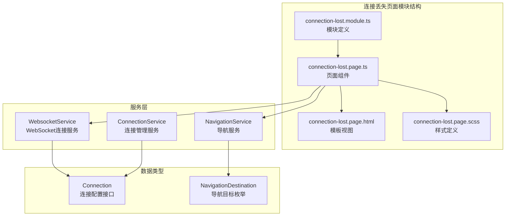
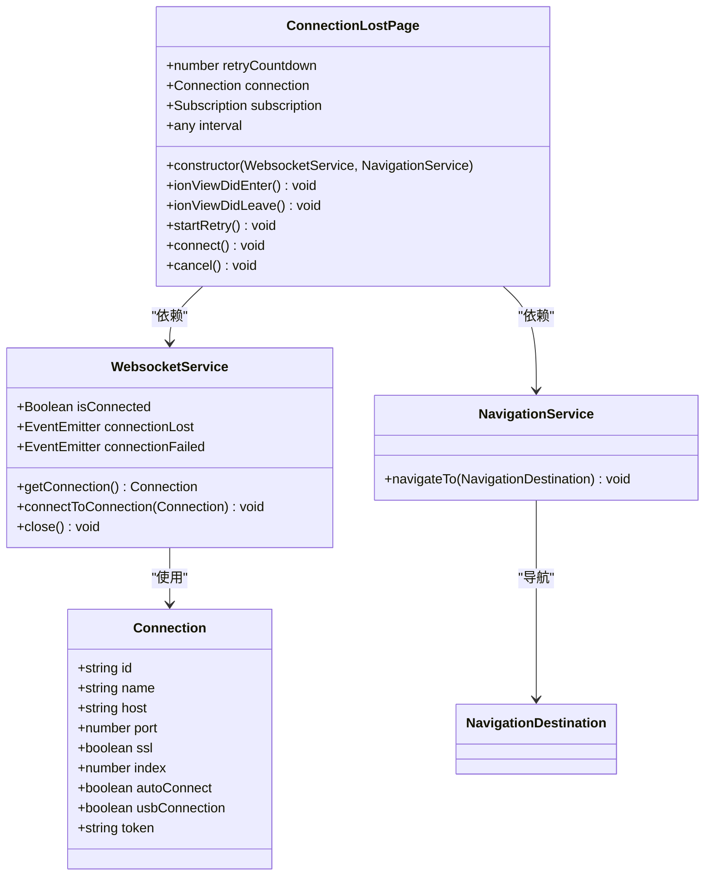
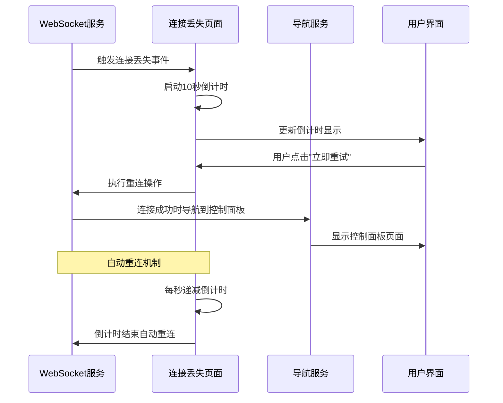
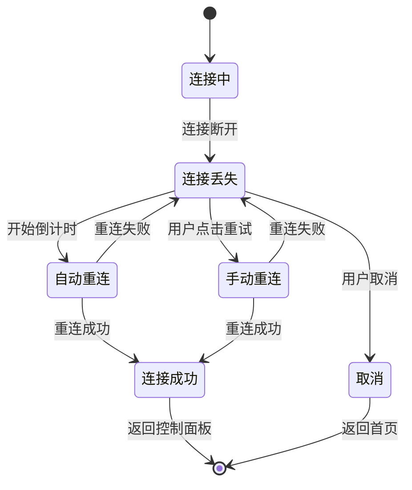
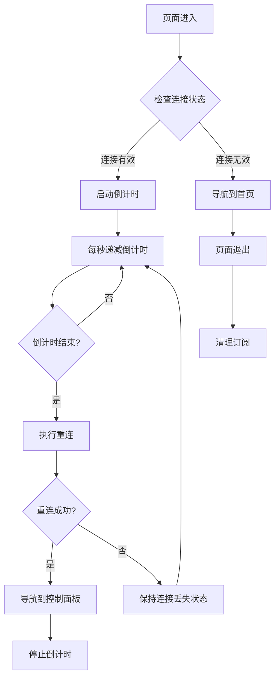
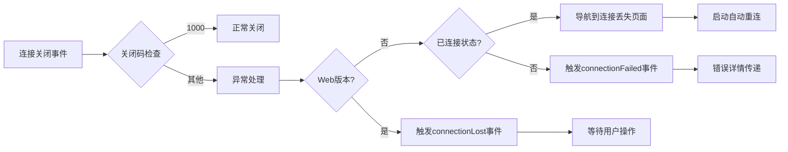
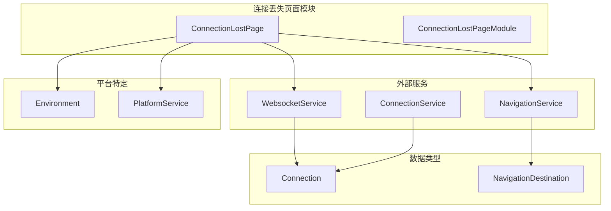

# 连接丢失页面模块

<cite>
**本文档引用的文件**
- [connection-lost.module.ts](file://src/app/pages/connection-lost/connection-lost.module.ts)
- [connection-lost.page.ts](file://src/app/pages/connection-lost/connection-lost.page.ts)
- [connection-lost.page.html](file://src/app/pages/connection-lost/connection-lost.page.html)
- [connection-lost.page.scss](file://src/app/pages/connection-lost/connection-lost.page.scss)
- [websocket.service.ts](file://src/app/services/websocket/websocket.service.ts)
- [connection.service.ts](file://src/app/services/connection/connection.service.ts)
- [connection.ts](file://src/app/datatypes/connection.ts)
- [navigation.service.ts](file://src/app/services/navigation/navigation.service.ts)
- [navigation-destination.ts](file://src/app/enums/navigation-destination.ts)
- [web-home.page.ts](file://src/app/pages/web-home/web-home.page.ts)
</cite>

## 目录
1. [简介](#简介)
2. [项目结构](#项目结构)
3. [核心组件](#核心组件)
4. [架构概览](#架构概览)
5. [详细组件分析](#详细组件分析)
6. [依赖关系分析](#依赖关系分析)
7. [性能考虑](#性能考虑)
8. [故障排除指南](#故障排除指南)
9. [结论](#结论)

## 简介

连接丢失页面模块是Macro-Deck-Client-App中的关键用户体验组件，专门处理网络连接中断的情况。该模块提供了友好的用户界面和智能的重连机制，确保用户在连接异常时能够获得清晰的反馈和便捷的操作选项。

该模块的核心设计理念是：
- **即时反馈**：立即向用户展示连接状态和剩余重试时间
- **自动化处理**：内置10秒倒计时自动重连机制
- **手动控制**：提供"立即重试"和"取消"按钮供用户手动干预
- **无缝体验**：连接恢复时自动导航到控制面板页面

## 项目结构

连接丢失页面模块位于应用程序的页面层，采用标准的Angular模块化架构：

**图表来源**
- [connection-lost.module.ts:1-36](file://src/app/pages/connection-lost/connection-lost.module.ts#L1-L36)
- [connection-lost.page.ts:1-152](file://src/app/pages/connection-lost/connection-lost.page.ts#L1-L152)

**章节来源**
- [connection-lost.module.ts:1-36](file://src/app/pages/connection-lost/connection-lost.module.ts#L1-L36)
- [connection-lost.page.ts:1-152](file://src/app/pages/connection-lost/connection-lost.page.ts#L1-L152)

## 核心组件

### 页面组件架构

连接丢失页面采用简洁而直观的设计，专注于提供清晰的状态信息和操作选项：

**图表来源**
- [connection-lost.page.ts:10-85](file://src/app/pages/connection-lost/connection-lost.page.ts#L10-L85)
- [websocket.service.ts:20-47](file://src/app/services/websocket/websocket.service.ts#L20-L47)
- [connection.ts:2-21](file://src/app/datatypes/connection.ts#L2-L21)

### 用户界面设计

页面采用居中布局设计，确保在不同设备上都能提供一致的用户体验：

| 元素 | 设计特点 | 功能作用 |
|------|----------|----------|
| 图标区域 | 10rem正方形，脉冲动画效果 | 提供视觉反馈，增强连接状态感知 |
| 标题文本 | "I lost the connection to the server" | 清晰说明当前状态 |
| 倒计时显示 | "{{retryCountdown}}"动态更新 | 展示剩余重试时间 |
| 操作按钮组 | 两个主要按钮，间距统一 | 提供用户控制选项 |

**章节来源**
- [connection-lost.page.html:1-15](file://src/app/pages/connection-lost/connection-lost.page.html#L1-L15)
- [connection-lost.page.scss:1-25](file://src/app/pages/connection-lost/connection-lost.page.scss#L1-L25)

## 架构概览

连接丢失页面模块与整个应用架构的集成关系如下：

**图表来源**
- [websocket.service.ts:142-219](file://src/app/services/websocket/websocket.service.ts#L142-L219)
- [connection-lost.page.ts:46-85](file://src/app/pages/connection-lost/connection-lost.page.ts#L46-L85)

### 状态管理流程

**图表来源**
- [connection-lost.page.ts:128-151](file://src/app/pages/connection-lost/connection-lost.page.ts#L128-L151)
- [websocket.service.ts:374-393](file://src/app/services/websocket/websocket.service.ts#L374-L393)

## 详细组件分析

### 连接丢失页面组件

#### 核心功能实现

连接丢失页面组件实现了完整的连接恢复策略：

**自动重连机制**：
- 10秒倒计时计时器
- 每秒更新UI显示
- 倒计时结束自动执行重连
- 支持用户手动干预

**状态同步机制**：
- 实时监听WebSocket连接状态
- 自动取消订阅防止内存泄漏
- 与导航服务保持状态同步

#### 交互逻辑分析

**图表来源**
- [connection-lost.page.ts:46-85](file://src/app/pages/connection-lost/connection-lost.page.ts#L46-L85)
- [connection-lost.page.ts:128-151](file://src/app/pages/connection-lost/connection-lost.page.ts#L128-L151)

**章节来源**
- [connection-lost.page.ts:18-85](file://src/app/pages/connection-lost/connection-lost.page.ts#L18-L85)

### WebSocket服务集成

#### 错误处理机制

WebSocket服务提供了完善的连接错误处理：

| 错误类型 | 处理方式 | 用户反馈 |
|----------|----------|----------|
| 正常关闭(1000) | 忽略处理 | 不触发连接丢失页面 |
| 异常关闭 | 触发连接丢失事件 | 显示连接丢失页面 |
| 安全错误 | 显示不安全连接弹窗 | 提示SSL证书问题 |
| 未连接失败 | 触发连接失败事件 | 传递详细错误信息 |

#### 状态转换逻辑

**图表来源**
- [websocket.service.ts:197-219](file://src/app/services/websocket/websocket.service.ts#L197-L219)

**章节来源**
- [websocket.service.ts:141-229](file://src/app/services/websocket/websocket.service.ts#L141-L229)

### 导航服务协调

#### 页面路由管理

导航服务负责管理应用内的页面跳转：

| 导航目标 | 页面组件 | 使用场景 |
|----------|----------|----------|
| Home | HomePage/WebHomePage | 连接恢复或取消时返回首页 |
| Deck | DeckPage | 连接成功后显示控制面板 |
| ConnectionLost | ConnectionLostPage | 连接丢失时显示恢复页面 |

**章节来源**
- [navigation.service.ts:29-46](file://src/app/services/navigation/navigation.service.ts#L29-L46)
- [navigation-destination.ts:2-9](file://src/app/enums/navigation-destination.ts#L2-L9)

## 依赖关系分析

### 组件间依赖关系

**图表来源**
- [connection-lost.page.ts:2-7](file://src/app/pages/connection-lost/connection-lost.page.ts#L2-L7)
- [websocket.service.ts:1-15](file://src/app/services/websocket/websocket.service.ts#L1-L15)

### 服务耦合度评估

| 依赖项 | 耦合程度 | 说明 | 改进建议 |
|--------|----------|------|----------|
| WebsocketService | 高 | 直接依赖连接状态和事件 | 考虑抽象接口 |
| NavigationService | 中等 | 仅依赖导航目标枚举 | 保持现状 |
| ConnectionService | 低 | 间接使用连接配置 | 可以移除依赖 |
| Environment | 中等 | 平台检测依赖 | 考虑注入配置 |

**章节来源**
- [connection-lost.page.ts:32-35](file://src/app/pages/connection-lost/connection-lost.page.ts#L32-L35)
- [navigation.service.ts:61-63](file://src/app/services/navigation/navigation.service.ts#L61-L63)

## 性能考虑

### 内存管理优化

连接丢失页面实现了完善的资源清理机制：

- **订阅管理**：使用RxJS Subscription统一管理事件订阅
- **定时器清理**：页面离开时自动清除所有定时器
- **内存泄漏防护**：确保组件销毁时释放所有资源

### 用户体验优化

| 优化点 | 实现方式 | 效果 |
|--------|----------|------|
| 响应速度 | 1秒精度倒计时 | 提供精确的时间反馈 |
| 界面流畅 | CSS动画过渡 | 减少界面闪烁 |
| 错误处理 | 异步操作队列 | 防止并发操作冲突 |

## 故障排除指南

### 常见问题及解决方案

#### 连接无法恢复

**症状**：倒计时结束后仍无法连接
**可能原因**：
- 网络连接不稳定
- 服务器端口被占用
- SSL证书验证失败

**解决步骤**：
1. 检查网络连接状态
2. 验证服务器可达性
3. 确认SSL证书有效性
4. 查看控制台错误日志

#### 页面无法正确显示

**症状**：连接丢失页面不显示或显示异常
**可能原因**：
- 导航服务配置错误
- 样式文件加载失败
- 组件初始化异常

**解决步骤**：
1. 验证导航目标配置
2. 检查CSS文件路径
3. 确认组件导入正确
4. 查看浏览器开发者工具

#### 重连机制失效

**症状**：倒计时停止或重连按钮无响应
**可能原因**：
- 订阅未正确设置
- 定时器被意外清除
- WebSocket连接状态异常

**解决步骤**：
1. 检查connectionFailed事件订阅
2. 验证定时器引用
3. 确认WebSocket服务状态
4. 重启应用测试

### 调试技巧

#### 日志监控

建议在开发环境中启用以下日志级别：
- 连接状态变化日志
- 重连尝试记录
- 错误事件详细信息

#### 性能监控

关注以下性能指标：
- 页面渲染时间
- 内存使用情况
- 事件处理延迟

**章节来源**
- [connection-lost.page.ts:37-51](file://src/app/pages/connection-lost/connection-lost.page.ts#L37-L51)
- [websocket.service.ts:141-172](file://src/app/services/websocket/websocket.service.ts#L141-L172)

## 结论

连接丢失页面模块通过精心设计的用户体验和稳健的技术实现，为Macro-Deck-Client-App提供了可靠的连接异常处理机制。该模块的主要优势包括：

**用户体验方面**：
- 直观的界面设计和清晰的状态指示
- 智能的自动重连机制
- 灵活的手动控制选项

**技术实现方面**：
- 完善的错误处理和状态管理
- 优雅的资源清理和内存管理
- 与整体架构的无缝集成

**未来改进方向**：
- 增强国际化支持
- 优化主题适配能力
- 扩展连接诊断功能
- 提供更详细的错误报告

该模块为用户在连接异常时提供了稳定可靠的支持，确保了应用的整体可用性和用户满意度。