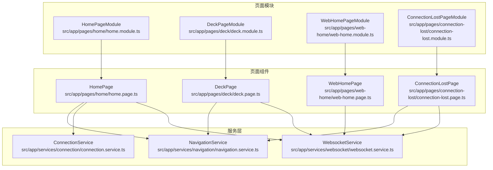
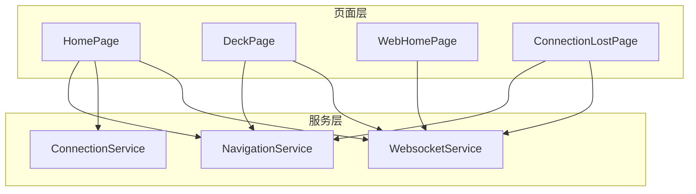
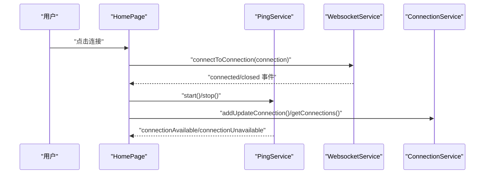
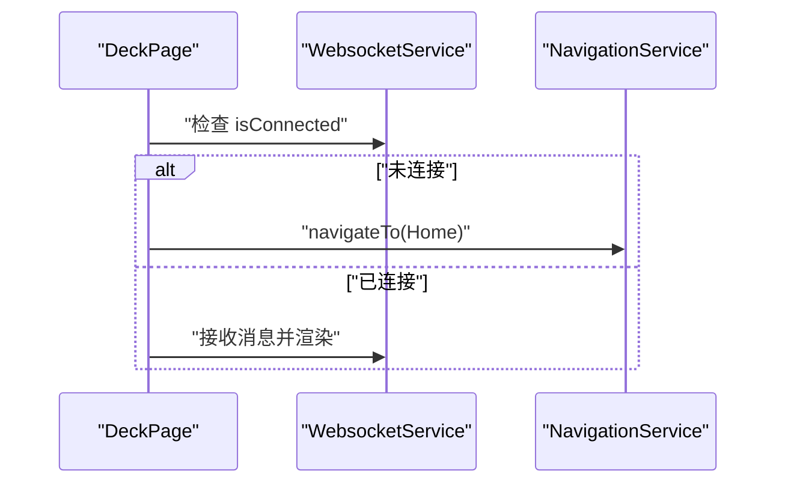
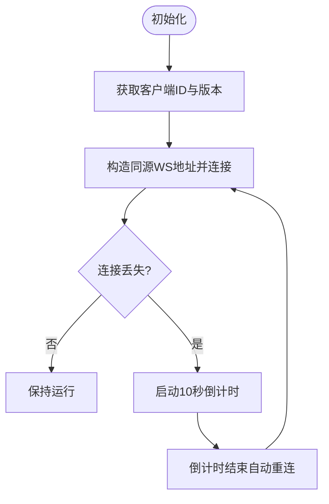
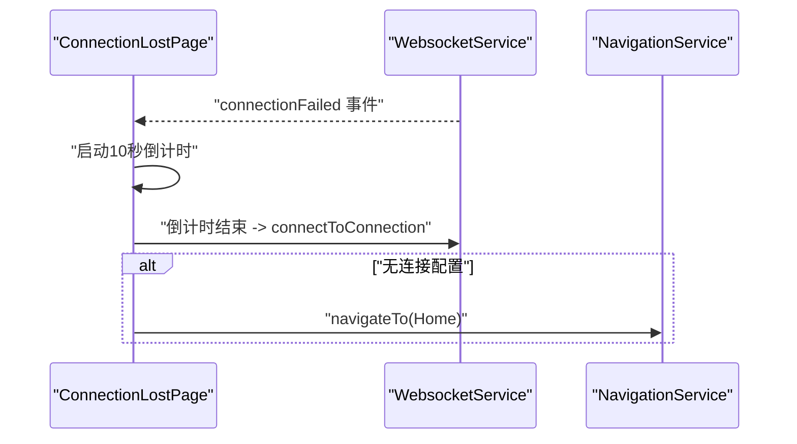
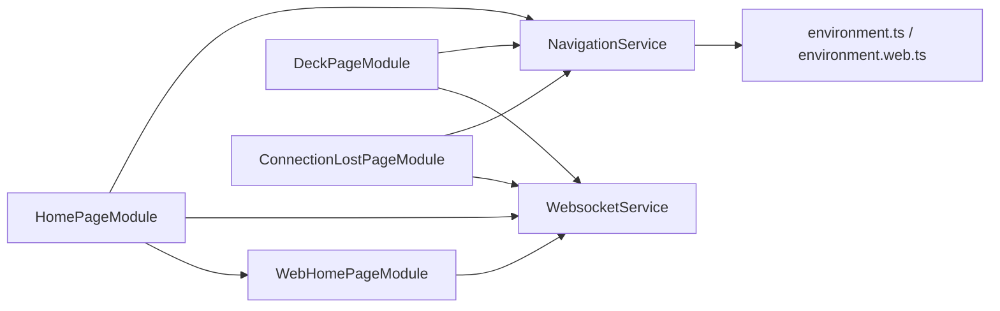

# 页面模块

<cite>
**本文档引用的文件**
- [src/app/pages/home/home.module.ts](file://src/app/pages/home/home.module.ts)
- [src/app/pages/deck/deck.module.ts](file://src/app/pages/deck/deck.module.ts)
- [src/app/pages/web-home/web-home.module.ts](file://src/app/pages/web-home/web-home.module.ts)
- [src/app/pages/connection-lost/connection-lost.module.ts](file://src/app/pages/connection-lost/connection-lost.module.ts)
- [src/app/pages/home/home.page.ts](file://src/app/pages/home/home.page.ts)
- [src/app/pages/deck/deck.page.ts](file://src/app/pages/deck/deck.page.ts)
- [src/app/pages/web-home/web-home.page.ts](file://src/app/pages/web-home/web-home.page.ts)
- [src/app/pages/connection-lost/connection-lost.page.ts](file://src/app/pages/connection-lost/connection-lost.page.ts)
- [src/app/services/websocket/websocket.service.ts](file://src/app/services/websocket/websocket.service.ts)
- [src/app/services/connection/connection.service.ts](file://src/app/services/connection/connection.service.ts)
- [src/app/services/navigation/navigation.service.ts](file://src/app/services/navigation/navigation.service.ts)
- [src/environments/environment.ts](file://src/environments/environment.ts)
- [src/environments/environment.web.ts](file://src/environments/environment.web.ts)
- [src/app/enums/navigation-destination.ts](file://src/app/enums/navigation-destination.ts)
</cite>

## 目录
1. [简介](#简介)
2. [项目结构](#项目结构)
3. [核心组件](#核心组件)
4. [架构总览](#架构总览)
5. [详细组件分析](#详细组件分析)
6. [依赖关系分析](#依赖关系分析)
7. [性能考虑](#性能考虑)
8. [故障排查指南](#故障排查指南)
9. [结论](#结论)
10. [附录](#附录)

## 简介
本文件系统性梳理 Macro-Deck-Client-App 的页面模块设计与实现，重点覆盖以下模块：
- HomePageModule：首页模块，负责连接管理、Ping 检测、连接弹窗等
- DeckPageModule：控制面板模块，展示按钮面板并处理连接状态
- WebHomePageModule：Web 版首页模块，面向浏览器直连场景
- ConnectionLostPageModule：连接丢失模块，提供重试倒计时与自动重连

文档将解释各模块的职责边界、组件导入清单、页面特定服务绑定、页面间通信机制与数据流向，并提供扩展指南与性能优化建议。

## 项目结构
页面模块采用“按页面分层”的组织方式，每个页面拥有独立的模块文件与页面文件，配合服务层完成业务逻辑与状态管理。核心页面模块与对应页面文件如下：

图表来源
- [src/app/pages/home/home.module.ts:1-76](file://src/app/pages/home/home.module.ts#L1-L76)
- [src/app/pages/deck/deck.module.ts:1-44](file://src/app/pages/deck/deck.module.ts#L1-L44)
- [src/app/pages/web-home/web-home.module.ts:1-42](file://src/app/pages/web-home/web-home.module.ts#L1-L42)
- [src/app/pages/connection-lost/connection-lost.module.ts:1-36](file://src/app/pages/connection-lost/connection-lost.module.ts#L1-L36)
- [src/app/pages/home/home.page.ts:1-551](file://src/app/pages/home/home.page.ts#L1-L551)
- [src/app/pages/deck/deck.page.ts:1-158](file://src/app/pages/deck/deck.page.ts#L1-L158)
- [src/app/pages/web-home/web-home.page.ts:1-146](file://src/app/pages/web-home/web-home.page.ts#L1-L146)
- [src/app/pages/connection-lost/connection-lost.page.ts:1-152](file://src/app/pages/connection-lost/connection-lost.page.ts#L1-L152)
- [src/app/services/websocket/websocket.service.ts:1-402](file://src/app/services/websocket/websocket.service.ts#L1-L402)
- [src/app/services/connection/connection.service.ts:1-179](file://src/app/services/connection/connection.service.ts#L1-L179)
- [src/app/services/navigation/navigation.service.ts:1-86](file://src/app/services/navigation/navigation.service.ts#L1-L86)

章节来源
- [src/app/pages/home/home.module.ts:1-76](file://src/app/pages/home/home.module.ts#L1-L76)
- [src/app/pages/deck/deck.module.ts:1-44](file://src/app/pages/deck/deck.module.ts#L1-L44)
- [src/app/pages/web-home/web-home.module.ts:1-42](file://src/app/pages/web-home/web-home.module.ts#L1-L42)
- [src/app/pages/connection-lost/connection-lost.module.ts:1-36](file://src/app/pages/connection-lost/connection-lost.module.ts#L1-L36)

## 核心组件
- HomePageModule
  - 导入范围：CommonModule、FormsModule、IonicModule、WebHomePageModule、HomePage、AddConnectionComponent、ConnectingComponent、ConnectionFailedComponent、ConnectionLostComponent、InsecureConnectionComponent、ScanNetworkInterfacesComponent、QrCodeScannerComponent、QrCodeScannerUiComponent
  - 职责：声明首页及其所有弹窗组件，作为首页功能入口
- DeckPageModule
  - 导入范围：CommonModule、FormsModule、IonicModule、DeckPage、WidgetGridComponent、WidgetContentComponent
  - 职责：声明控制面板页面及微件网格组件
- WebHomePageModule
  - 导入范围：CommonModule、FormsModule、IonicModule、WebHomePage
  - 导出范围：WebHomePage
  - 职责：声明并导出 Web 版首页组件，供原生首页模块复用
- ConnectionLostPageModule
  - 导入范围：CommonModule、FormsModule、IonicModule、ConnectionLostPage
  - 职责：声明连接丢失页面组件

章节来源
- [src/app/pages/home/home.module.ts:21-37](file://src/app/pages/home/home.module.ts#L21-L37)
- [src/app/pages/deck/deck.module.ts:12-21](file://src/app/pages/deck/deck.module.ts#L12-L21)
- [src/app/pages/web-home/web-home.module.ts:10-21](file://src/app/pages/web-home/web-home.module.ts#L10-L21)
- [src/app/pages/connection-lost/connection-lost.module.ts:9-17](file://src/app/pages/connection-lost/connection-lost.module.ts#L9-L17)

## 架构总览
页面模块通过服务层实现解耦，页面仅负责视图与交互，业务逻辑下沉至服务。导航通过 NavigationService 统一调度，WebSocket 通信由 WebsocketService 管理，连接配置由 ConnectionService 持久化。

图表来源
- [src/app/pages/home/home.page.ts:1-551](file://src/app/pages/home/home.page.ts#L1-L551)
- [src/app/pages/deck/deck.page.ts:1-158](file://src/app/pages/deck/deck.page.ts#L1-L158)
- [src/app/pages/web-home/web-home.page.ts:1-146](file://src/app/pages/web-home/web-home.page.ts#L1-L146)
- [src/app/pages/connection-lost/connection-lost.page.ts:1-152](file://src/app/pages/connection-lost/connection-lost.page.ts#L1-L152)
- [src/app/services/websocket/websocket.service.ts:1-402](file://src/app/services/websocket/websocket.service.ts#L1-L402)
- [src/app/services/connection/connection.service.ts:1-179](file://src/app/services/connection/connection.service.ts#L1-L179)
- [src/app/services/navigation/navigation.service.ts:1-86](file://src/app/services/navigation/navigation.service.ts#L1-L86)

## 详细组件分析

### HomePageModule 分析
- 设计原则
  - 单一职责：集中声明首页及其弹窗组件，避免跨模块耦合
  - 可复用性：WebHomePageModule 作为子模块被引入，便于 Web/原生版本共享
- 组件导入清单
  - WebHomePageModule、HomePage、AddConnectionComponent、ConnectingComponent、ConnectionFailedComponent、ConnectionLostComponent、InsecureConnectionComponent、ScanNetworkInterfacesComponent、QrCodeScannerComponent、QrCodeScannerUiComponent
- 页面特定服务绑定
  - SettingsService、DiagnosticService、ConnectionService、WebsocketService、WakelockService、PingService、AlertController、ModalController
- 数据流向
  - PingService 提供可用连接列表；WebSocket 连接状态变化通过 WebsocketService 传播；用户操作通过 ModalController 触发 ConnectionService 的增删改

图表来源
- [src/app/pages/home/home.page.ts:89-139](file://src/app/pages/home/home.page.ts#L89-L139)
- [src/app/services/websocket/websocket.service.ts:136-172](file://src/app/services/websocket/websocket.service.ts#L136-L172)
- [src/app/services/connection/connection.service.ts:18-101](file://src/app/services/connection/connection.service.ts#L18-L101)

章节来源
- [src/app/pages/home/home.module.ts:21-37](file://src/app/pages/home/home.module.ts#L21-L37)
- [src/app/pages/home/home.page.ts:1-551](file://src/app/pages/home/home.page.ts#L1-L551)
- [src/app/services/websocket/websocket.service.ts:1-402](file://src/app/services/websocket/websocket.service.ts#L1-L402)
- [src/app/services/connection/connection.service.ts:1-179](file://src/app/services/connection/connection.service.ts#L1-L179)

### DeckPageModule 分析
- 设计原则
  - 纯展示：DeckPage 仅负责渲染按钮面板与基本交互
  - 状态校验：进入页面时检查 WebSocket 连接，未连接则导航回首页
- 组件导入清单
  - DeckPage、WidgetGridComponent、WidgetContentComponent
- 页面特定服务绑定
  - WebsocketService、ModalController、SettingsService、DiagnosticService、NavigationService
- 数据流向
  - 通过 WebsocketService 接收协议消息；通过 NavigationService 切换页面；通过 SettingsService 控制 UI 行为

图表来源
- [src/app/pages/deck/deck.page.ts:44-52](file://src/app/pages/deck/deck.page.ts#L44-L52)
- [src/app/services/navigation/navigation.service.ts:29-46](file://src/app/services/navigation/navigation.service.ts#L29-L46)
- [src/app/services/websocket/websocket.service.ts:25-47](file://src/app/services/websocket/websocket.service.ts#L25-L47)

章节来源
- [src/app/pages/deck/deck.module.ts:12-21](file://src/app/pages/deck/deck.module.ts#L12-L21)
- [src/app/pages/deck/deck.page.ts:1-158](file://src/app/pages/deck/deck.page.ts#L1-L158)
- [src/app/services/navigation/navigation.service.ts:1-86](file://src/app/services/navigation/navigation.service.ts#L1-L86)

### WebHomePageModule 分析
- 设计原则
  - 简化流程：Web 版直接基于当前页面同源地址发起连接，无需用户输入
  - 自恢复：连接丢失时启动倒计时重连
- 组件导入清单
  - WebHomePage
- 页面特定服务绑定
  - WebsocketService、SettingsService、DOCUMENT 注入
- 数据流向
  - 读取 baseURI 构造 ws/wss 地址；监听 connectionLost 事件并执行倒计时重连

图表来源
- [src/app/pages/web-home/web-home.page.ts:40-79](file://src/app/pages/web-home/web-home.page.ts#L40-L79)
- [src/app/services/websocket/websocket.service.ts:204-207](file://src/app/services/websocket/websocket.service.ts#L204-L207)

章节来源
- [src/app/pages/web-home/web-home.module.ts:9-21](file://src/app/pages/web-home/web-home.module.ts#L9-L21)
- [src/app/pages/web-home/web-home.page.ts:1-146](file://src/app/pages/web-home/web-home.page.ts#L1-L146)
- [src/environments/environment.web.ts:1-15](file://src/environments/environment.web.ts#L1-L15)

### ConnectionLostPageModule 分析
- 设计原则
  - 用户友好：提供明确的倒计时与取消操作
  - 自动恢复：倒计时结束自动尝试重连
- 组件导入清单
  - ConnectionLostPage
- 页面特定服务绑定
  - WebsocketService、NavigationService
- 数据流向
  - 监听 connectionFailed 事件启动倒计时；倒计时结束调用 connectToConnection；若无连接配置则返回首页

图表来源
- [src/app/pages/connection-lost/connection-lost.page.ts:46-84](file://src/app/pages/connection-lost/connection-lost.page.ts#L46-L84)
- [src/app/services/websocket/websocket.service.ts:216-219](file://src/app/services/websocket/websocket.service.ts#L216-L219)
- [src/app/services/navigation/navigation.service.ts:67-84](file://src/app/services/navigation/navigation.service.ts#L67-L84)

章节来源
- [src/app/pages/connection-lost/connection-lost.module.ts:9-17](file://src/app/pages/connection-lost/connection-lost.module.ts#L9-L17)
- [src/app/pages/connection-lost/connection-lost.page.ts:1-152](file://src/app/pages/connection-lost/connection-lost.page.ts#L1-L152)

## 依赖关系分析
- 模块间依赖
  - HomePageModule 依赖 WebHomePageModule（复用 Web 版首页）
  - 其他页面模块相对独立，通过服务层互通
- 服务依赖
  - WebsocketService 作为通信中枢，被多个页面模块消费
  - NavigationService 决定页面切换目标（原生版指向 HomePage，Web 版指向 WebHomePage）

图表来源
- [src/app/pages/home/home.module.ts](file://src/app/pages/home/home.module.ts#L8)
- [src/app/services/navigation/navigation.service.ts:15-16](file://src/app/services/navigation/navigation.service.ts#L15-L16)
- [src/environments/environment.ts](file://src/environments/environment.ts#L8)
- [src/environments/environment.web.ts](file://src/environments/environment.web.ts#L6)

章节来源
- [src/app/services/navigation/navigation.service.ts:1-86](file://src/app/services/navigation/navigation.service.ts#L1-L86)
- [src/environments/environment.ts:1-36](file://src/environments/environment.ts#L1-L36)
- [src/environments/environment.web.ts:1-15](file://src/environments/environment.web.ts#L1-L15)

## 性能考虑
- 懒加载策略
  - 页面模块各自独立，结合路由按需加载可减少首屏体积
  - 建议在路由配置中对各模块使用 loadChildren 或延迟导入（参考页面模块文件结构）
- 订阅管理
  - 页面生命周期中及时取消订阅（如 HomePage、ConnectionLostPage），避免内存泄漏
- 连接管理
  - 连接失败时统一通过 WebsocketService 的事件机制处理，避免页面重复逻辑
- UI 响应
  - 使用 LoadingService 展示连接过程，提升用户体验

## 故障排查指南
- 连接失败
  - 检查 WebsocketService 的 handleError 流程，区分已连接断开与未连接失败
  - 若为安全错误（如证书问题），会弹出 InsecureConnectionComponent 提示
- 连接丢失
  - Web 版：WebsocketService 触发 connectionLost，由 WebHomePage 启动倒计时重连
  - 原生版：NavigationService 导航至 ConnectionLostPage，倒计时结束后自动重连
- 页面无法切换
  - 确认 NavigationService 的 homePage 指向正确（原生 vs Web）

章节来源
- [src/app/services/websocket/websocket.service.ts:197-219](file://src/app/services/websocket/websocket.service.ts#L197-L219)
- [src/app/pages/web-home/web-home.page.ts:44-62](file://src/app/pages/web-home/web-home.page.ts#L44-L62)
- [src/app/pages/connection-lost/connection-lost.page.ts:47-84](file://src/app/pages/connection-lost/connection-lost.page.ts#L47-L84)
- [src/app/services/navigation/navigation.service.ts:61-64](file://src/app/services/navigation/navigation.service.ts#L61-L64)

## 结论
页面模块遵循单一职责与可复用原则，通过服务层实现清晰的数据流与控制流。HomePageModule 作为入口承载连接管理与弹窗交互；DeckPageModule 专注展示与状态校验；WebHomePageModule 适配 Web 端直连场景；ConnectionLostPageModule 提供稳健的容错与自恢复能力。整体架构利于扩展与维护。

## 附录

### 页面模块扩展指南
- 新增页面模块步骤
  - 创建页面组件与页面模块文件
  - 在页面模块中导入所需组件与子模块
  - 如需弹窗，先在对应目录创建弹窗组件并在模块中声明
  - 在服务层注入必要的服务（如 WebsocketService、NavigationService）
  - 在路由配置中添加懒加载条目（如适用）
- 自定义页面开发要点
  - 优先使用现有服务（WebsocketService、ConnectionService、NavigationService）
  - 在页面生命周期中正确管理订阅与资源释放
  - 对于 Web 端特例，参考 WebHomePage 的同源连接策略

### 页面间通信与数据流
- 事件驱动
  - WebsocketService 暴露连接事件（opened/closed/failed/lost），页面通过订阅响应
- 导航控制
  - NavigationService 根据环境变量选择不同首页组件类型
- 配置持久化
  - ConnectionService 负责连接列表的增删改查与排序

章节来源
- [src/app/services/websocket/websocket.service.ts:34-47](file://src/app/services/websocket/websocket.service.ts#L34-L47)
- [src/app/services/navigation/navigation.service.ts:29-46](file://src/app/services/navigation/navigation.service.ts#L29-L46)
- [src/app/services/connection/connection.service.ts:40-101](file://src/app/services/connection/connection.service.ts#L40-L101)
- [src/app/enums/navigation-destination.ts:1-15](file://src/app/enums/navigation-destination.ts#L1-L15)