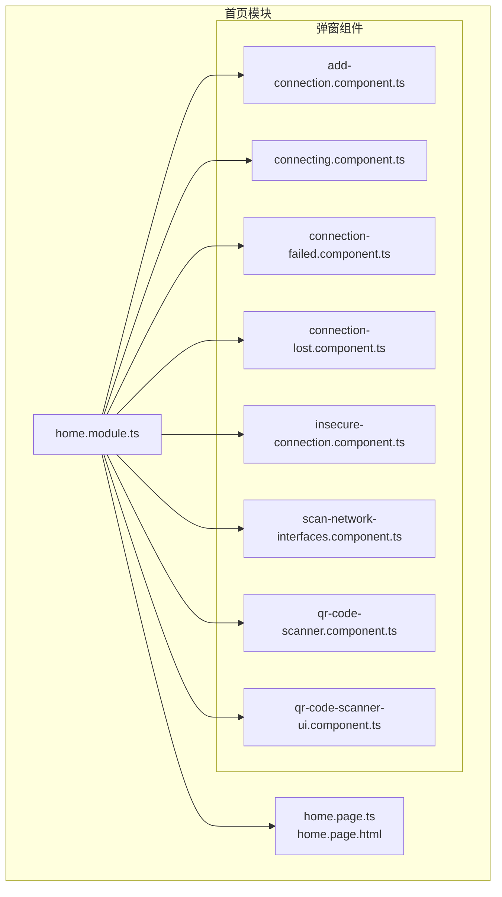
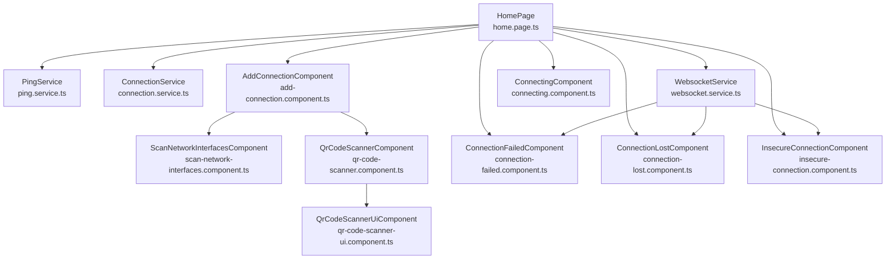
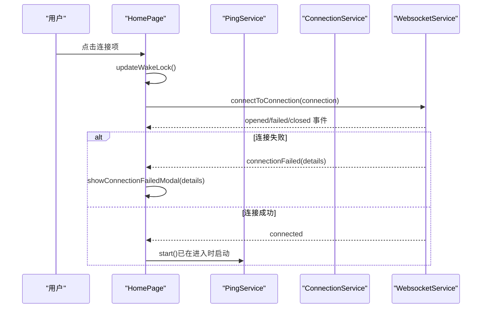
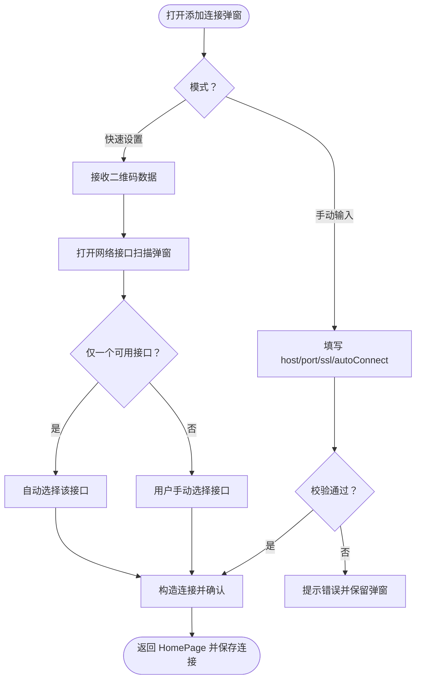
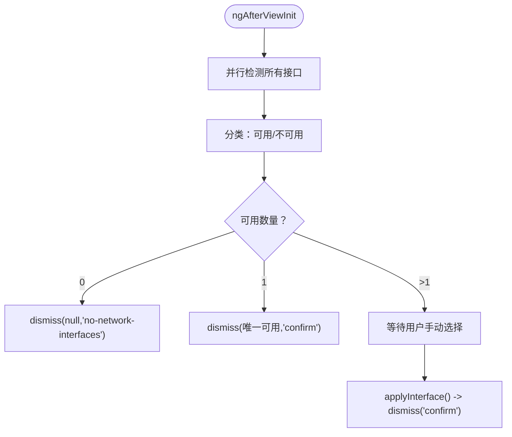
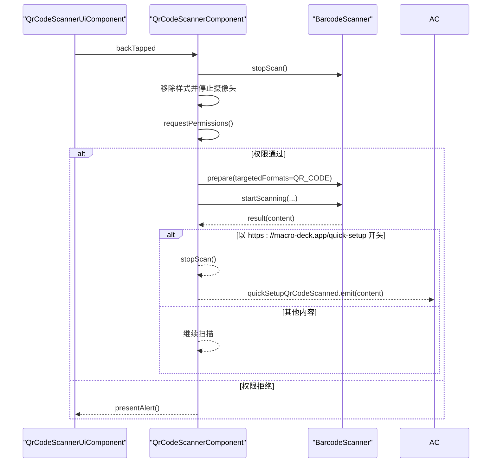
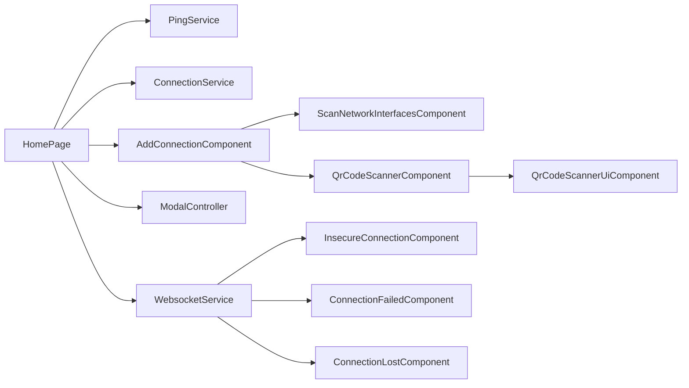

# 首页模块

<cite>
**本文档引用的文件**
- [home.module.ts](file://src/app/pages/home/home.module.ts)
- [home.page.ts](file://src/app/pages/home/home.page.ts)
- [home.page.html](file://src/app/pages/home/home.page.html)
- [add-connection.component.ts](file://src/app/pages/home/modals/add-connection/add-connection.component.ts)
- [connecting.component.ts](file://src/app/pages/home/modals/connecting/connecting.component.ts)
- [connection-failed.component.ts](file://src/app/pages/home/modals/connection-failed/connection-failed.component.ts)
- [connection-lost.component.ts](file://src/app/pages/home/modals/connection-lost/connection-lost.component.ts)
- [insecure-connection.component.ts](file://src/app/pages/home/modals/insecure-connection/insecure-connection.component.ts)
- [scan-network-interfaces.component.ts](file://src/app/pages/home/modals/scan-network-interfaces/scan-network-interfaces.component.ts)
- [qr-code-scanner.component.ts](file://src/app/pages/home/modals/add-connection/qr-code-scanner/qr-code-scanner.component.ts)
- [qr-code-scanner-ui.component.ts](file://src/app/pages/home/modals/add-connection/qr-code-scanner/qr-code-scanner-ui/qr-code-scanner-ui.component.ts)
- [connection.ts](file://src/app/datatypes/connection.ts)
- [connection.service.ts](file://src/app/services/connection/connection.service.ts)
- [websocket.service.ts](file://src/app/services/websocket/websocket.service.ts)
- [ping.service.ts](file://src/app/services/ping/ping.service.ts)
</cite>

## 目录
1. [简介](#简介)
2. [项目结构](#项目结构)
3. [核心组件](#核心组件)
4. [架构总览](#架构总览)
5. [详细组件分析](#详细组件分析)
6. [依赖分析](#依赖分析)
7. [性能考虑](#性能考虑)
8. [故障排查指南](#故障排查指南)
9. [结论](#结论)
10. [附录](#附录)

## 简介
本文件系统性地解析 Macro-Deck-Client-App 的首页模块（HomePageModule）。该模块负责：
- 展示已保存的连接列表，并根据 Ping 服务动态反映连接可用性
- 提供添加/编辑/删除连接的操作入口
- 协调多种弹窗组件完成“快速设置”（二维码扫描）、网络接口扫描、连接中提示、连接失败提示、连接丢失提示以及不安全连接提示等完整流程
- 通过 WebSocket 服务建立与 Macro Deck 服务器的实时通信，并在异常时弹窗提示

首页模块采用 Angular + Ionic 的组合，使用模块化设计将主页与各类弹窗组件解耦，便于扩展与维护。

## 项目结构
首页模块位于 src/app/pages/home，包含主页组件与其子弹窗组件。模块通过 home.module.ts 统一导入与声明，形成清晰的边界。

图表来源
- [home.module.ts:1-76](file://src/app/pages/home/home.module.ts#L1-L76)
- [home.page.ts:1-551](file://src/app/pages/home/home.page.ts#L1-L551)
- [add-connection.component.ts:1-382](file://src/app/pages/home/modals/add-connection/add-connection.component.ts#L1-L382)
- [connecting.component.ts:1-59](file://src/app/pages/home/modals/connecting/connecting.component.ts#L1-L59)
- [connection-failed.component.ts:1-49](file://src/app/pages/home/modals/connection-failed/connection-failed.component.ts#L1-L49)
- [connection-lost.component.ts:1-41](file://src/app/pages/home/modals/connection-lost/connection-lost.component.ts#L1-L41)
- [insecure-connection.component.ts:1-41](file://src/app/pages/home/modals/insecure-connection/insecure-connection.component.ts#L1-L41)
- [scan-network-interfaces.component.ts:1-201](file://src/app/pages/home/modals/scan-network-interfaces/scan-network-interfaces.component.ts#L1-L201)
- [qr-code-scanner.component.ts:1-170](file://src/app/pages/home/modals/add-connection/qr-code-scanner/qr-code-scanner.component.ts#L1-L170)
- [qr-code-scanner-ui.component.ts:1-46](file://src/app/pages/home/modals/add-connection/qr-code-scanner/qr-code-scanner-ui/qr-code-scanner-ui.component.ts#L1-L46)

章节来源
- [home.module.ts:1-76](file://src/app/pages/home/home.module.ts#L1-L76)

## 核心组件
- 首页组件 HomePage：负责渲染连接列表、响应 Ping 事件、发起连接、管理弹窗生命周期、处理拖拽排序与删除确认等。
- 弹窗组件群：
  - 添加连接弹窗 AddConnectionComponent：支持手动输入与二维码快速设置；在原生平台下自动监听二维码扫描结果并联动网络接口扫描。
  - 连接中弹窗 ConnectingComponent：显示连接进度并允许取消。
  - 连接失败弹窗 ConnectionFailedComponent：展示失败详情。
  - 连接丢失弹窗 ConnectionLostComponent：在非 Web 环境下用于提示连接中断。
  - 不安全连接弹窗 InsecureConnectionComponent：当 SSL 安全错误发生时提示。
  - 网络接口扫描弹窗 ScanNetworkInterfacesComponent：对二维码提供的多个接口逐一探测，返回可用接口或失败提示。
  - 二维码扫描器组件 QrCodeScannerComponent：请求相机权限、启动扫描、过滤 Macro Deck 快速设置链接并广播事件。
  - 二维码扫描 UI 组件 QrCodeScannerUiComponent：提供返回按钮事件，驱动扫描器停止。

章节来源
- [home.page.ts:1-551](file://src/app/pages/home/home.page.ts#L1-L551)
- [home.page.html:1-123](file://src/app/pages/home/home.page.html#L1-L123)
- [add-connection.component.ts:1-382](file://src/app/pages/home/modals/add-connection/add-connection.component.ts#L1-L382)
- [connecting.component.ts:1-59](file://src/app/pages/home/modals/connecting/connecting.component.ts#L1-L59)
- [connection-failed.component.ts:1-49](file://src/app/pages/home/modals/connection-failed/connection-failed.component.ts#L1-L49)
- [connection-lost.component.ts:1-41](file://src/app/pages/home/modals/connection-lost/connection-lost.component.ts#L1-L41)
- [insecure-connection.component.ts:1-41](file://src/app/pages/home/modals/insecure-connection/insecure-connection.component.ts#L1-L41)
- [scan-network-interfaces.component.ts:1-201](file://src/app/pages/home/modals/scan-network-interfaces/scan-network-interfaces.component.ts#L1-L201)
- [qr-code-scanner.component.ts:1-170](file://src/app/pages/home/modals/add-connection/qr-code-scanner/qr-code-scanner.component.ts#L1-L170)
- [qr-code-scanner-ui.component.ts:1-46](file://src/app/pages/home/modals/add-connection/qr-code-scanner/qr-code-scanner-ui/qr-code-scanner-ui.component.ts#L1-L46)

## 架构总览
首页模块围绕 HomePage 展开，通过服务层（ConnectionService、PingService、WebsocketService）与弹窗组件协同工作，形成“发现可用连接 → 用户选择 → 建立连接 → 异常处理”的闭环。

图表来源
- [home.page.ts:1-551](file://src/app/pages/home/home.page.ts#L1-L551)
- [ping.service.ts:1-228](file://src/app/services/ping/ping.service.ts#L1-L228)
- [connection.service.ts:1-179](file://src/app/services/connection/connection.service.ts#L1-L179)
- [websocket.service.ts:1-402](file://src/app/services/websocket/websocket.service.ts#L1-L402)
- [add-connection.component.ts:1-382](file://src/app/pages/home/modals/add-connection/add-connection.component.ts#L1-L382)
- [scan-network-interfaces.component.ts:1-201](file://src/app/pages/home/modals/scan-network-interfaces/scan-network-interfaces.component.ts#L1-L201)
- [qr-code-scanner.component.ts:1-170](file://src/app/pages/home/modals/add-connection/qr-code-scanner/qr-code-scanner.component.ts#L1-L170)
- [qr-code-scanner-ui.component.ts:1-46](file://src/app/pages/home/modals/add-connection/qr-code-scanner/qr-code-scanner-ui/qr-code-scanner-ui.component.ts#L1-L46)
- [connecting.component.ts:1-59](file://src/app/pages/home/modals/connecting/connecting.component.ts#L1-L59)
- [connection-failed.component.ts:1-49](file://src/app/pages/home/modals/connection-failed/connection-failed.component.ts#L1-L49)
- [connection-lost.component.ts:1-41](file://src/app/pages/home/modals/connection-lost/connection-lost.component.ts#L1-L41)
- [insecure-connection.component.ts:1-41](file://src/app/pages/home/modals/insecure-connection/insecure-connection.component.ts#L1-L41)

## 详细组件分析

### 首页组件 HomePage
- 职责
  - 渲染头部、内容区与页脚，展示“有线/无线”连接分组与连接项
  - 响应 PingService 的连接可用事件，动态更新可用连接列表与 USB 可用状态
  - 提供添加/编辑/删除连接、拖拽排序、USB 连接、设置入口、捐赠入口等交互
  - 通过 WebsocketService 建立连接，并在失败时弹出连接失败弹窗
  - 监听快速设置链接扫描事件，自动打开添加连接弹窗并填充二维码数据
- 数据结构
  - 连接模型 Connection：包含 id、name、host、port、ssl、index、autoConnect、usbConnection、token 等字段
- 生命周期
  - ionViewWillEnter：同步可用连接与 USB 状态
  - ionViewDidEnter：加载连接列表、订阅 Ping 与 WebSocket 事件、启动 Ping 检测
  - ionViewDidLeave：停止 Ping 检测与订阅
- 用户交互
  - 点击连接项：调用 connect，携带 WakeLock 更新
  - 点击“通过 USB 连接”：读取 USB 连接配置并连接
  - 点击“添加连接”：打开 AddConnectionComponent 弹窗，确认后持久化并刷新列表
  - 拖拽排序：更新连接顺序并保存
  - 删除连接：二次确认后删除并刷新
  - 设置入口：打开设置弹窗，关闭后重启 Ping 检测

图表来源
- [home.page.ts:251-254](file://src/app/pages/home/home.page.ts#L251-L254)
- [websocket.service.ts:159-171](file://src/app/services/websocket/websocket.service.ts#L159-L171)
- [home.page.ts:292-301](file://src/app/pages/home/home.page.ts#L292-L301)

章节来源
- [home.page.ts:1-551](file://src/app/pages/home/home.page.ts#L1-L551)
- [home.page.html:1-123](file://src/app/pages/home/home.page.html#L1-L123)
- [connection.ts:1-33](file://src/app/datatypes/connection.ts#L1-L33)

### 添加连接弹窗 AddConnectionComponent
- 功能
  - 手动输入模式：校验 host/port，构造 Connection 对象并返回
  - 快速设置模式：接收二维码数据，提取实例名、端口、SSL、接口列表与令牌
  - 自动扫描网络接口：打开 ScanNetworkInterfacesComponent，等待用户选择或自动选择唯一可用接口
  - 原生平台自动处理：监听 QrCodeScannerComponent 的快速设置事件，自动解析二维码并执行网络接口扫描
- 数据传递
  - 从 HomePage 传入：existingConnection 或 quickSetupQrCodeData
  - 与 ScanNetworkInterfacesComponent：通过 componentProps 传递 quickSetupQrCodeData
  - 与 QrCodeScannerComponent：通过静态事件 quickSetupQrCodeScanned 传递扫描结果
- 表单校验与错误提示：必填校验失败时弹出提示

图表来源
- [add-connection.component.ts:64-134](file://src/app/pages/home/modals/add-connection/add-connection.component.ts#L64-L134)
- [add-connection.component.ts:258-320](file://src/app/pages/home/modals/add-connection/add-connection.component.ts#L258-L320)

章节来源
- [add-connection.component.ts:1-382](file://src/app/pages/home/modals/add-connection/add-connection.component.ts#L1-L382)

### 网络接口扫描弹窗 ScanNetworkInterfacesComponent
- 功能
  - 并行探测二维码提供的多个网络接口地址，区分可用与不可用
  - 无可用接口：返回 no-network-interfaces
  - 仅一个可用接口：自动返回该接口
  - 多个可用接口：允许用户手动选择
- 性能
  - 使用 Promise.all 并行检测，超时 3 秒，catch 错误并视为不可用
  - 使用 takeUntilDestroyed 与 destroyRef 确保组件销毁时取消请求

图表来源
- [scan-network-interfaces.component.ts:45-103](file://src/app/pages/home/modals/scan-network-interfaces/scan-network-interfaces.component.ts#L45-L103)
- [scan-network-interfaces.component.ts:145-195](file://src/app/pages/home/modals/scan-network-interfaces/scan-network-interfaces.component.ts#L145-L195)

章节来源
- [scan-network-interfaces.component.ts:1-201](file://src/app/pages/home/modals/scan-network-interfaces/scan-network-interfaces.component.ts#L1-L201)

### 二维码扫描器组件 QrCodeScannerComponent 与 UI 组件 QrCodeScannerUiComponent
- 功能
  - 请求相机权限，准备并启动 QR 扫描
  - 过滤 Macro Deck 快速设置链接，触发静态事件 quickSetupQrCodeScanned
  - UI 组件提供返回按钮，触发 backTapped 事件，通知扫描器停止
- 权限与错误
  - 权限被拒时弹出提示
  - 扫描停止时移除页面样式并释放摄像头

图表来源
- [qr-code-scanner.component.ts:31-75](file://src/app/pages/home/modals/add-connection/qr-code-scanner/qr-code-scanner.component.ts#L31-L75)
- [qr-code-scanner.component.ts:121-154](file://src/app/pages/home/modals/add-connection/qr-code-scanner/qr-code-scanner.component.ts#L121-L154)
- [qr-code-scanner-ui.component.ts:20-23](file://src/app/pages/home/modals/add-connection/qr-code-scanner/qr-code-scanner-ui/qr-code-scanner-ui.component.ts#L20-L23)

章节来源
- [qr-code-scanner.component.ts:1-170](file://src/app/pages/home/modals/add-connection/qr-code-scanner/qr-code-scanner.component.ts#L1-L170)
- [qr-code-scanner-ui.component.ts:1-46](file://src/app/pages/home/modals/add-connection/qr-code-scanner/qr-code-scanner-ui/qr-code-scanner-ui.component.ts#L1-L46)

### 连接中/失败/丢失/不安全弹窗
- ConnectingComponent：显示连接提示，支持取消并发出 canceled 事件
- ConnectionFailedComponent：展示连接失败详情，关闭弹窗
- ConnectionLostComponent：在非 Web 环境下提示连接丢失，关闭弹窗
- InsecureConnectionComponent：提示 SSL 安全错误，关闭弹窗

这些弹窗由 HomePage 或 WebsocketService 在不同场景下创建与呈现，用于反馈连接状态与异常。

章节来源
- [connecting.component.ts:1-59](file://src/app/pages/home/modals/connecting/connecting.component.ts#L1-L59)
- [connection-failed.component.ts:1-49](file://src/app/pages/home/modals/connection-failed/connection-failed.component.ts#L1-L49)
- [connection-lost.component.ts:1-41](file://src/app/pages/home/modals/connection-lost/connection-lost.component.ts#L1-L41)
- [insecure-connection.component.ts:1-41](file://src/app/pages/home/modals/insecure-connection/insecure-connection.component.ts#L1-L41)
- [websocket.service.ts:224-229](file://src/app/services/websocket/websocket.service.ts#L224-L229)

## 依赖分析
- 组件耦合
  - HomePage 依赖 PingService、ConnectionService、WebsocketService、AlertController、ModalController、WakeLockService
  - AddConnectionComponent 依赖 ScanNetworkInterfacesComponent、QrCodeScannerComponent、AlertController
  - QrCodeScannerComponent 依赖 QrCodeScannerUiComponent
- 事件与数据流
  - PingService：connectionAvailable/connectionUnavailable 事件驱动 HomePage 的可用连接列表更新
  - WebsocketService：connected/closed/connectionFailed/connectionLost 事件驱动 HomePage 的弹窗展示与导航
  - QrCodeScannerComponent：quickSetupQrCodeScanned 事件驱动 AddConnectionComponent 的快速设置流程
- 外部依赖
  - Capacitor BarcodeScanner：用于二维码扫描
  - RxJS：用于事件流、HTTP 请求、超时与取消

图表来源
- [home.page.ts:1-551](file://src/app/pages/home/home.page.ts#L1-L551)
- [add-connection.component.ts:1-382](file://src/app/pages/home/modals/add-connection/add-connection.component.ts#L1-L382)
- [websocket.service.ts:1-402](file://src/app/services/websocket/websocket.service.ts#L1-L402)
- [qr-code-scanner.component.ts:1-170](file://src/app/pages/home/modals/add-connection/qr-code-scanner/qr-code-scanner.component.ts#L1-L170)
- [qr-code-scanner-ui.component.ts:1-46](file://src/app/pages/home/modals/add-connection/qr-code-scanner/qr-code-scanner-ui/qr-code-scanner-ui.component.ts#L1-L46)

章节来源
- [home.module.ts:1-76](file://src/app/pages/home/home.module.ts#L1-L76)
- [ping.service.ts:1-228](file://src/app/services/ping/ping.service.ts#L1-L228)
- [connection.service.ts:1-179](file://src/app/services/connection/connection.service.ts#L1-L179)
- [websocket.service.ts:1-402](file://src/app/services/websocket/websocket.service.ts#L1-L402)

## 性能考虑
- Ping 检测
  - USB 连接每 1 秒检测一次，网络连接每 1.5 秒检测一次，超时 800ms，避免阻塞主线程
  - 通过 interval + switchMap + timeout 实现高效轮询与快速失败
- 网络接口扫描
  - 使用 Promise.all 并行探测多个接口，缩短等待时间；超时 3 秒，catch 错误
  - 使用 takeUntilDestroyed 确保组件销毁时取消请求，防止内存泄漏
- 连接建立
  - WebsocketService 在连接打开后才发送确认消息，减少无效握手
  - 连接失败时立即关闭加载弹窗并取消订阅
- UI 交互
  - 首页列表使用 track by（模板中 track connection）降低变更检测成本
  - 拖拽排序完成后一次性保存，避免频繁写入

章节来源
- [ping.service.ts:119-128](file://src/app/services/ping/ping.service.ts#L119-L128)
- [scan-network-interfaces.component.ts:65-81](file://src/app/pages/home/modals/scan-network-interfaces/scan-network-interfaces.component.ts#L65-L81)
- [websocket.service.ts:101-134](file://src/app/services/websocket/websocket.service.ts#L101-L134)

## 故障排查指南
- 无法扫描二维码
  - 检查相机权限是否授予；若被拒，会弹出权限提示
  - 确认扫描内容以 https://macro-deck.app/quick-setup 开头
- 快速设置无可用网络接口
  - ScanNetworkInterfacesComponent 会在无可用接口时返回 no-network-interfaces，AddConnectionComponent 将展示连接失败弹窗
- 连接失败
  - WebsocketService 在未建立连接时失败会触发 connectionFailed 事件，HomePage 展示 ConnectionFailedComponent
- 连接丢失
  - WebsocketService 在已连接状态下断开会导航至连接丢失页面（非 Web 环境）
- 不安全连接
  - SSL 安全错误触发 InsecureConnectionComponent 提示

章节来源
- [qr-code-scanner.component.ts:81-96](file://src/app/pages/home/modals/add-connection/qr-code-scanner/qr-code-scanner.component.ts#L81-L96)
- [add-connection.component.ts:120-134](file://src/app/pages/home/modals/add-connection/add-connection.component.ts#L120-L134)
- [websocket.service.ts:216-219](file://src/app/services/websocket/websocket.service.ts#L216-L219)
- [websocket.service.ts:210-214](file://src/app/services/websocket/websocket.service.ts#L210-L214)
- [websocket.service.ts:224-229](file://src/app/services/websocket/websocket.service.ts#L224-L229)

## 结论
首页模块通过清晰的职责划分与事件驱动的交互，实现了从连接发现、快速设置、连接建立到异常处理的完整闭环。模块内各弹窗组件职责单一、协作明确，配合服务层的稳定实现，具备良好的可维护性与扩展性。

## 附录

### 首页模块扩展与自定义指南
- 新增弹窗组件
  - 在 home.module.ts 中导入并声明新组件
  - 在 HomePage 中通过 ModalController.create 打开，并在 onWillDismiss 后处理返回数据
  - 如需与其他组件协作，通过 componentProps 传递数据，或使用静态事件/服务进行解耦通信
- 自定义连接行为
  - 若需修改连接流程（例如增加认证步骤），可在 HomePage 的 connect 方法或 WebsocketService 中扩展
  - 若需改变 Ping 检测策略，可在 PingService 中调整间隔与超时参数
- 模板与样式
  - 首页模板使用 track by 优化列表渲染；新增列表项时保持相同策略
  - 弹窗样式可通过 cssClass 传入，如需要隐藏扫描 UI 的样式类可参考现有用法

章节来源
- [home.module.ts:1-76](file://src/app/pages/home/home.module.ts#L1-L76)
- [home.page.ts:177-192](file://src/app/pages/home/home.page.ts#L177-L192)
- [home.page.html:10,181](file://src/app/pages/home/home.page.html#L10,L181)