# 兄弟组件通信

<cite>
**本文档引用的文件**
- [connection.service.ts](file://src/app/services/connection/connection.service.ts)
- [websocket.service.ts](file://src/app/services/websocket/websocket.service.ts)
- [macro-deck.service.ts](file://src/app/services/macro-deck/macro-deck.service.ts)
- [navigation.service.ts](file://src/app/services/navigation/navigation.service.ts)
- [loading.service.ts](file://src/app/services/loading/loading.service.ts)
- [settings.service.ts](file://src/app/services/settings/settings.service.ts)
- [protocol-handler.service.ts](file://src/app/services/protocol/protocol-handler.service.ts)
- [protocol2.service.ts](file://src/app/services/protocol/protocol2.service.ts)
- [ping.service.ts](file://src/app/services/ping/ping.service.ts)
- [home.page.ts](file://src/app/pages/home/home.page.ts)
- [add-connection.component.ts](file://src/app/pages/home/modals/add-connection/add-connection.component.ts)
- [connecting.component.ts](file://src/app/pages/home/modals/connecting/connecting.component.ts)
- [connection.ts](file://src/app/datatypes/connection.ts)
- [navigation-destination.ts](file://src/app/enums/navigation-destination.ts)
</cite>

## 目录
1. [简介](#简介)
2. [项目结构](#项目结构)
3. [核心组件](#核心组件)
4. [架构概览](#架构概览)
5. [详细组件分析](#详细组件分析)
6. [依赖关系分析](#依赖关系分析)
7. [性能考虑](#性能考虑)
8. [故障排除指南](#故障排除指南)
9. [结论](#结论)
10. [附录](#附录)

## 简介
本文档详细说明Macro-Deck-Client-App中兄弟组件间的通信机制。系统采用共享服务实现组件间数据共享，通过RxJS的Observable和Subject实现响应式通信，并结合事件总线模式和状态管理模式，确保连接弹窗与连接状态显示等兄弟组件能够高效协作。

## 项目结构
项目采用Angular架构，主要分为以下层次：
- 页面层：Home页面及其子组件
- 服务层：连接管理、WebSocket通信、宏命令板状态等核心服务
- 数据层：连接配置、协议消息等数据类型
- 枚举层：导航目的地等枚举定义

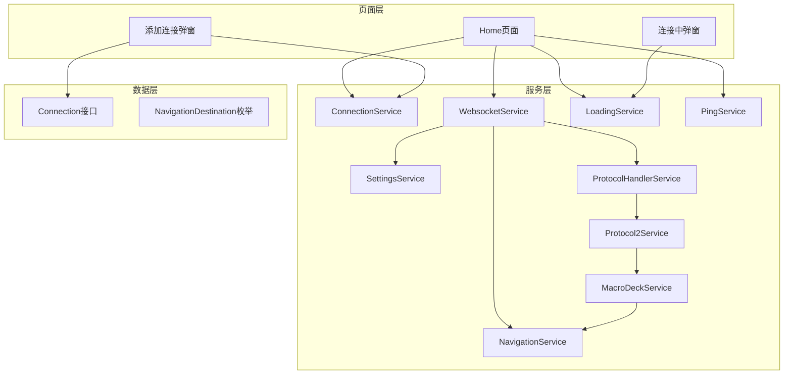

**图表来源**
- [home.page.ts:1-551](file://src/app/pages/home/home.page.ts#L1-L551)
- [connection.service.ts:1-179](file://src/app/services/connection/connection.service.ts#L1-L179)
- [websocket.service.ts:1-402](file://src/app/services/websocket/websocket.service.ts#L1-L402)

## 核心组件
系统的核心通信组件包括：

### 1. ConnectionService（连接服务）
- 单例模式：使用@Injectable({providedIn: 'root'})确保全局唯一实例
- 负责连接配置的CRUD操作和本地存储
- 提供USB连接配置的动态生成

### 2. WebsocketService（WebSocket服务）
- 管理WebSocket连接生命周期
- 实现连接状态事件发布（connected、closed、connectionFailed等）
- 通过Subject实现连接状态的响应式通知

### 3. MacroDeckService（宏命令板服务）
- 管理面板配置和微件数据状态
- 通过EventEmitter发布配置更新和用户交互事件
- 维护连接状态的共享数据

**章节来源**
- [connection.service.ts:1-179](file://src/app/services/connection/connection.service.ts#L1-L179)
- [websocket.service.ts:1-402](file://src/app/services/websocket/websocket.service.ts#L1-L402)
- [macro-deck.service.ts:1-111](file://src/app/services/macro-deck/macro-deck.service.ts#L1-L111)

## 架构概览
系统采用"服务驱动"的通信架构，所有组件通过依赖注入获取共享服务实例，实现松耦合的兄弟组件通信。

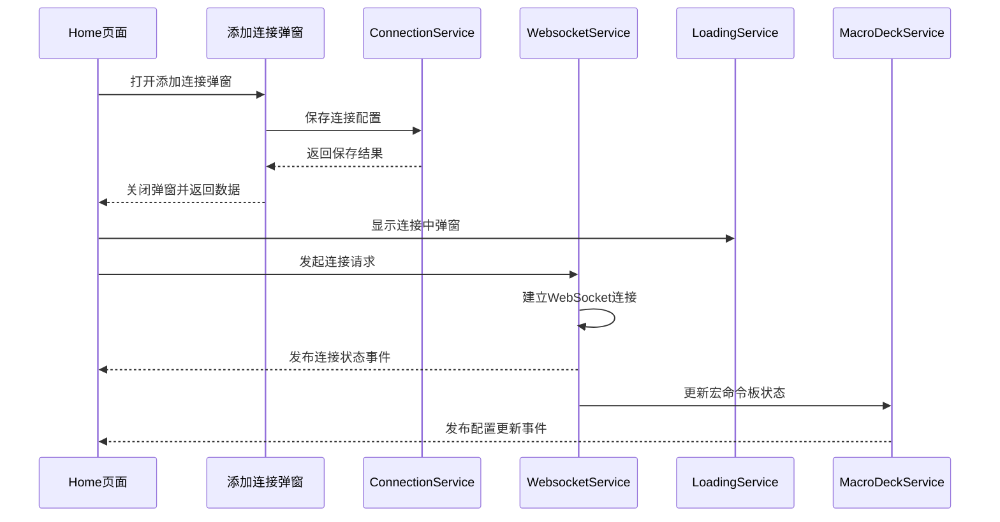

**图表来源**
- [home.page.ts:154-192](file://src/app/pages/home/home.page.ts#L154-L192)
- [add-connection.component.ts:145-167](file://src/app/pages/home/modals/add-connection/add-connection.component.ts#L145-L167)
- [websocket.service.ts:63-77](file://src/app/services/websocket/websocket.service.ts#L63-L77)

## 详细组件分析

### 服务单例模式与依赖注入
所有核心服务均采用单例模式，通过Angular的依赖注入系统实现：

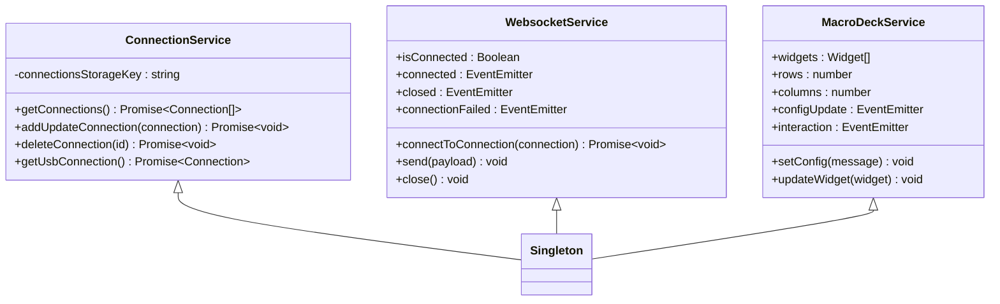

**图表来源**
- [connection.service.ts:10-179](file://src/app/services/connection/connection.service.ts#L10-L179)
- [websocket.service.ts:20-230](file://src/app/services/websocket/websocket.service.ts#L20-L230)
- [macro-deck.service.ts:10-66](file://src/app/services/macro-deck/macro-deck.service.ts#L10-L66)

### Observable与Subject使用模式
系统广泛使用RxJS实现响应式通信：

#### 1. 连接状态管理
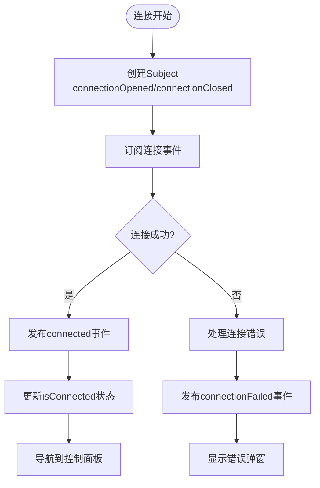

**图表来源**
- [websocket.service.ts:141-172](file://src/app/services/websocket/websocket.service.ts#L141-L172)
- [websocket.service.ts:332-360](file://src/app/services/websocket/websocket.service.ts#L332-L360)

#### 2. Ping服务的响应式检测
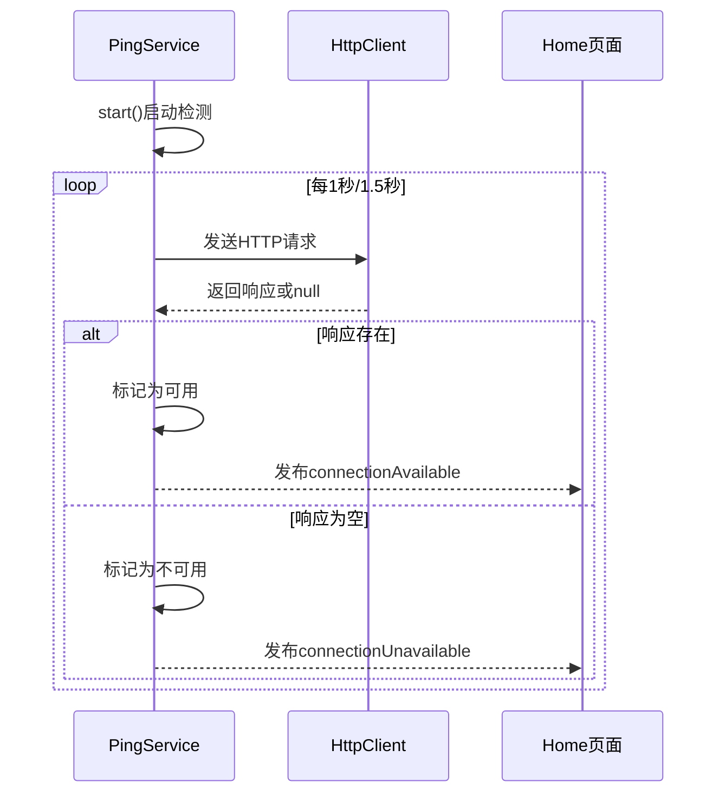

**图表来源**
- [ping.service.ts:36-61](file://src/app/services/ping/ping.service.ts#L36-L61)
- [ping.service.ts:119-128](file://src/app/services/ping/ping.service.ts#L119-L128)

### 兄弟组件通信示例：添加连接弹窗与连接状态显示

#### 场景描述
当用户在Home页面打开添加连接弹窗时，需要与连接状态显示组件进行通信，确保弹窗关闭后连接列表得到更新。

#### 通信流程
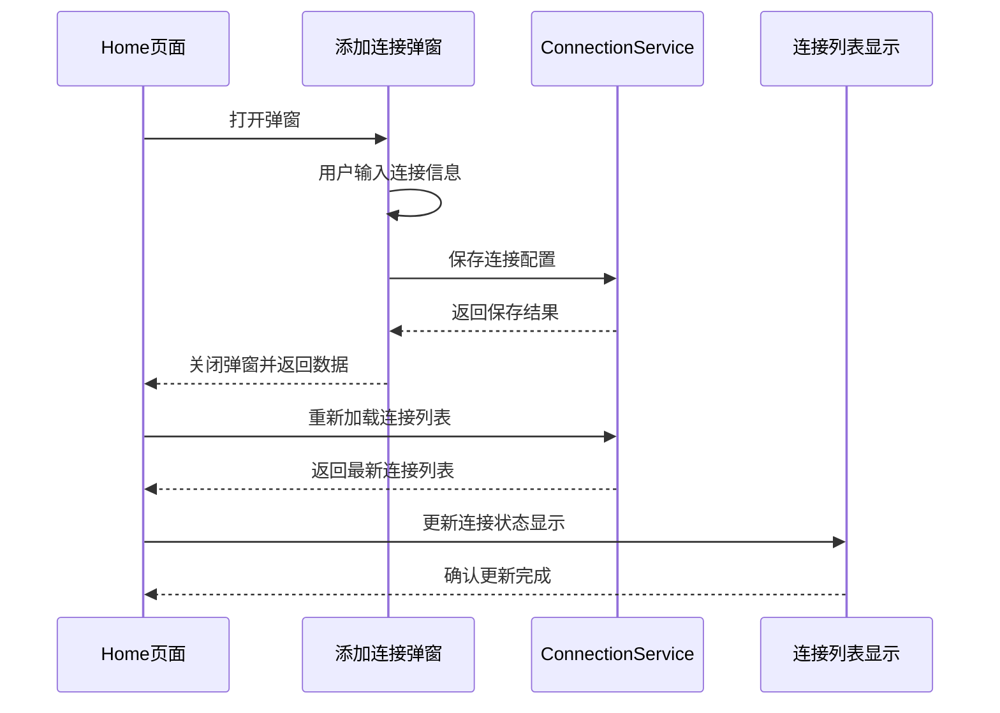

**图表来源**
- [home.page.ts:154-192](file://src/app/pages/home/home.page.ts#L154-L192)
- [add-connection.component.ts:145-167](file://src/app/pages/home/modals/add-connection/add-connection.component.ts#L145-L167)

#### 关键实现细节
1. **弹窗数据传递**：通过componentProps传递连接配置数据
2. **异步保存机制**：使用Promise确保数据持久化完成
3. **状态同步**：弹窗关闭后重新加载连接列表
4. **错误处理**：连接失败时显示错误弹窗

**章节来源**
- [home.page.ts:154-192](file://src/app/pages/home/home.page.ts#L154-L192)
- [add-connection.component.ts:145-167](file://src/app/pages/home/modals/add-connection/add-connection.component.ts#L145-L167)

### 事件总线模式实现
系统采用多种事件总线模式实现组件间通信：

#### 1. 连接事件总线
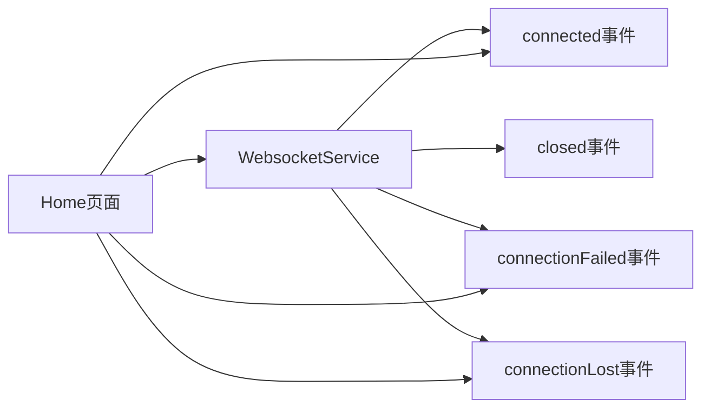

**图表来源**
- [websocket.service.ts:40-46](file://src/app/services/websocket/websocket.service.ts#L40-L46)
- [home.page.ts:123-131](file://src/app/pages/home/home.page.ts#L123-L131)

#### 2. Ping事件总线
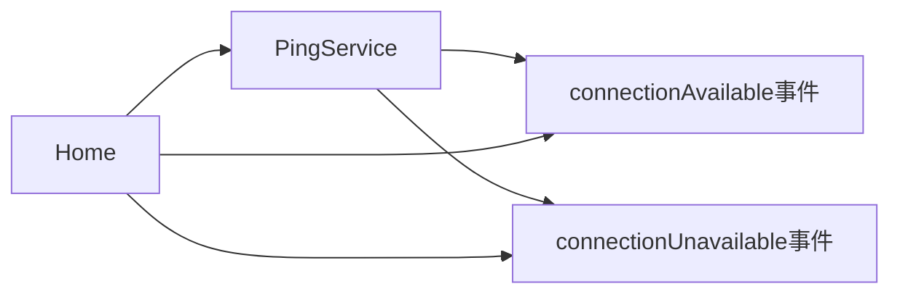

**图表来源**
- [ping.service.ts:14-18](file://src/app/services/ping/ping.service.ts#L14-L18)
- [home.page.ts:93-121](file://src/app/pages/home/home.page.ts#L93-L121)

### 状态管理模式
系统采用集中式状态管理模式：

#### 1. 连接状态管理
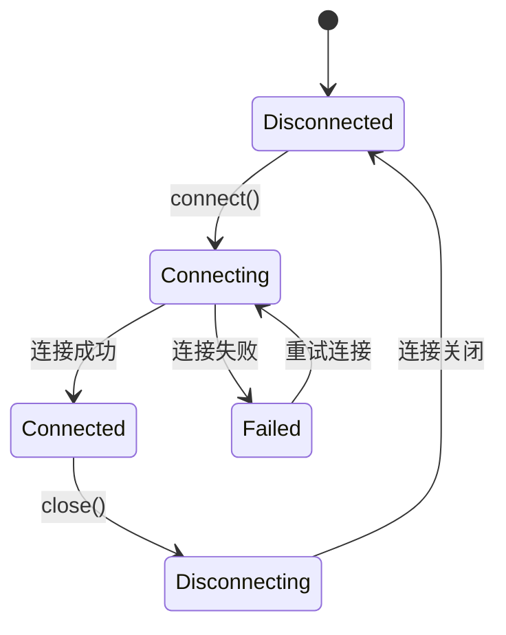

**图表来源**
- [websocket.service.ts:22](file://src/app/services/websocket/websocket.service.ts#L22)
- [websocket.service.ts:250](file://src/app/services/websocket/websocket.service.ts#L250)

#### 2. 宏命令板状态管理
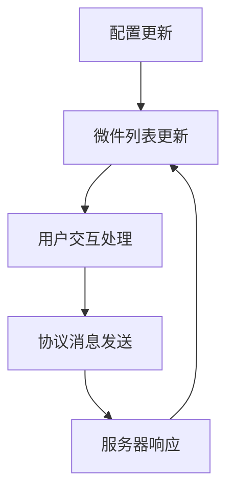

**图表来源**
- [macro-deck.service.ts:36-65](file://src/app/services/macro-deck/macro-deck.service.ts#L36-L65)
- [protocol2.service.ts:41-95](file://src/app/services/protocol/protocol2.service.ts#L41-L95)

## 依赖关系分析

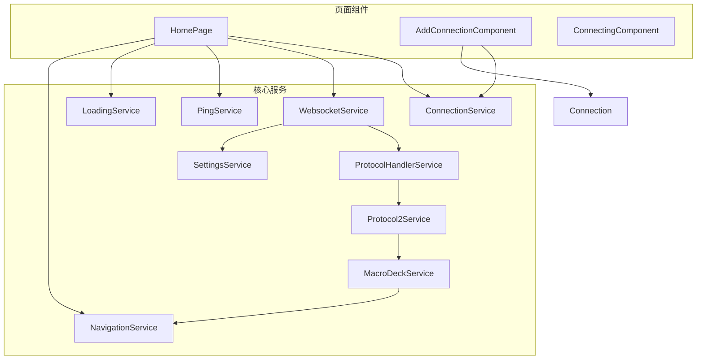

**图表来源**
- [home.page.ts:1-551](file://src/app/pages/home/home.page.ts#L1-L551)
- [add-connection.component.ts:1-382](file://src/app/pages/home/modals/add-connection/add-connection.component.ts#L1-L382)
- [connecting.component.ts:1-59](file://src/app/pages/home/modals/connecting/connecting.component.ts#L1-L59)

**章节来源**
- [home.page.ts:1-551](file://src/app/pages/home/home.page.ts#L1-L551)
- [add-connection.component.ts:1-382](file://src/app/pages/home/modals/add-connection/add-connection.component.ts#L1-L382)

## 性能考虑
1. **内存管理**：所有服务均为单例，避免重复实例化
2. **事件订阅**：使用Subscription统一管理事件订阅，防止内存泄漏
3. **异步操作**：合理使用async/await，避免阻塞UI线程
4. **连接池优化**：WebSocket连接复用，减少资源消耗
5. **状态更新**：采用增量更新策略，避免不必要的DOM重绘

## 故障排除指南

### 常见问题及解决方案

#### 1. 连接失败处理
- **症状**：连接弹窗持续显示，无法建立连接
- **原因**：网络问题、SSL证书错误、服务器不可达
- **解决**：检查网络连接，验证SSL配置，查看错误详情弹窗

#### 2. 弹窗数据不同步
- **症状**：添加连接弹窗关闭后连接列表未更新
- **原因**：异步保存未完成或订阅未正确处理
- **解决**：确保onWillDismiss回调中正确处理数据返回

#### 3. 事件订阅泄漏
- **症状**：页面切换后仍接收事件通知
- **原因**：未正确取消事件订阅
- **解决**：在组件销毁时调用subscription.unsubscribe()

**章节来源**
- [websocket.service.ts:197-219](file://src/app/services/websocket/websocket.service.ts#L197-L219)
- [home.page.ts:80-83](file://src/app/pages/home/home.page.ts#L80-L83)

## 结论
Macro-Deck-Client-App通过精心设计的共享服务架构实现了高效的兄弟组件通信。单例服务模式确保了数据的一致性和资源的有效利用，而RxJS的Observable和Subject则提供了强大的响应式通信能力。事件总线模式和状态管理模式的结合使得复杂的组件间协作变得简单可靠，为开发者提供了一个清晰、可维护的通信框架。

## 附录

### 关键接口定义
- **Connection接口**：定义连接配置的所有必要字段
- **NavigationDestination枚举**：标准化页面导航目标
- **Widget交互类型**：定义微件交互的完整类型系统

### 最佳实践建议
1. **服务设计**：保持服务职责单一，避免过度耦合
2. **错误处理**：为所有异步操作提供完善的错误处理机制
3. **性能监控**：定期检查事件订阅和内存使用情况
4. **测试覆盖**：为关键通信路径编写单元测试和集成测试