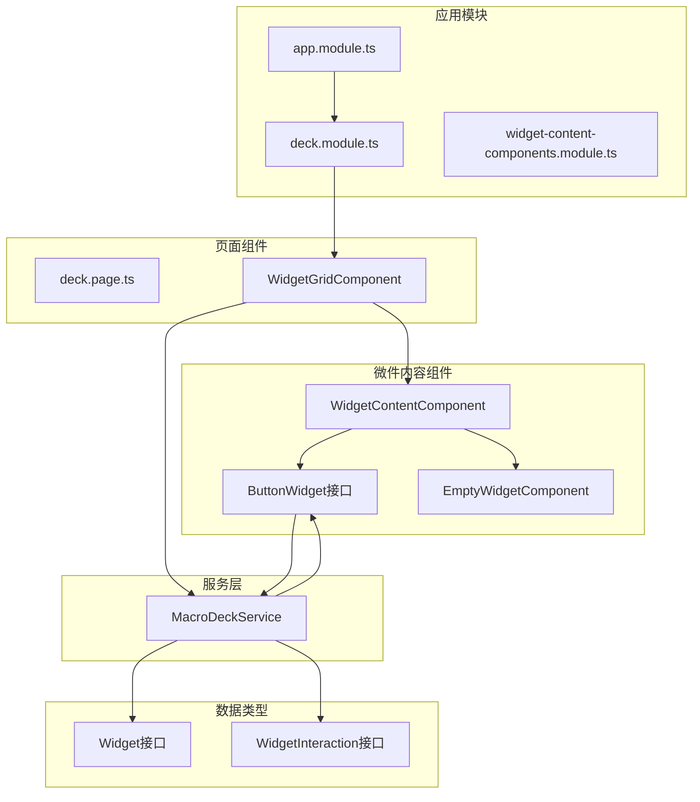
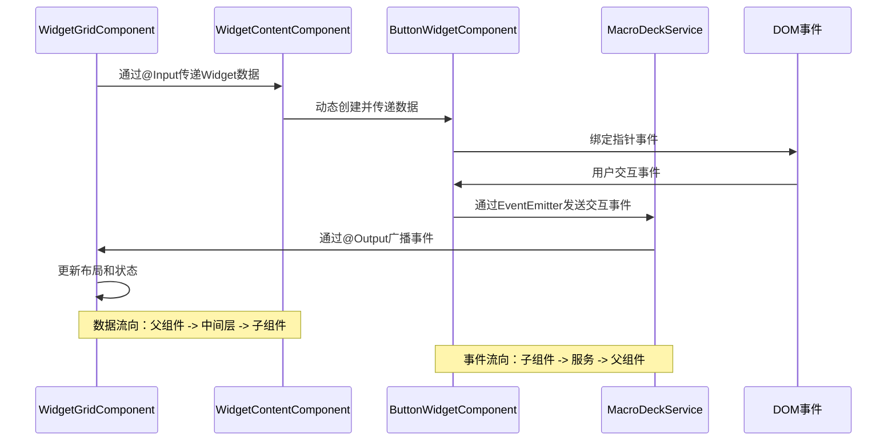
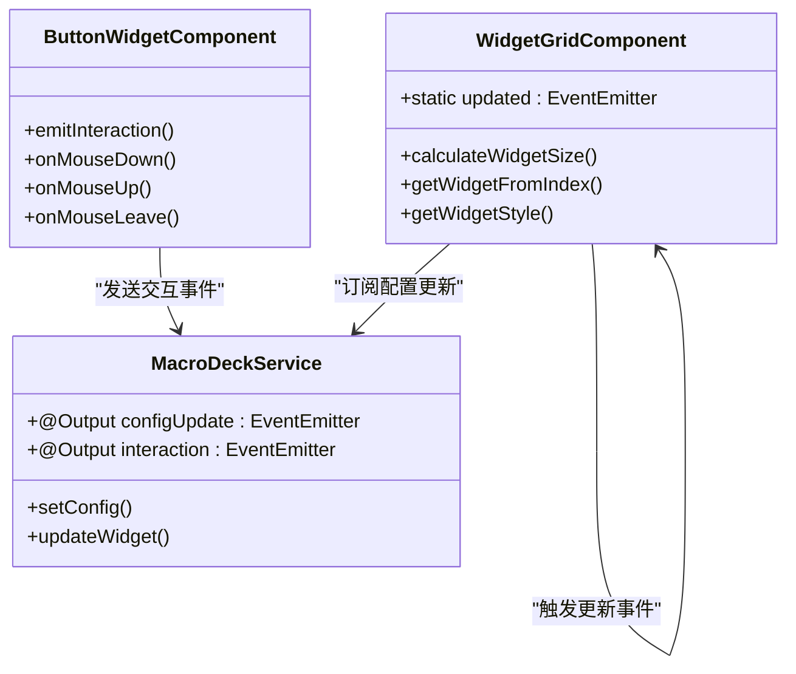
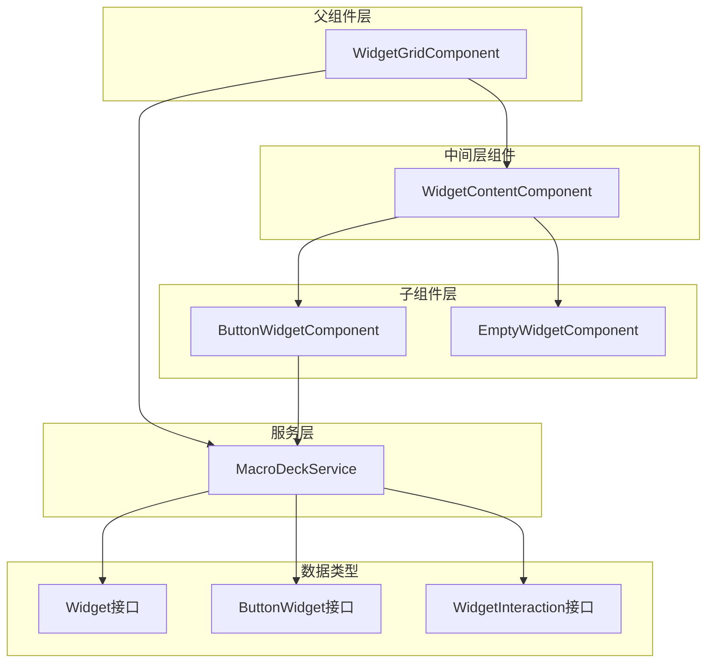

# 父子组件通信

<cite>
**本文档引用的文件**
- [widget-grid.component.ts](file://src/app/pages/deck/widget-grid/widget-grid.component.ts)
- [widget-grid.component.html](file://src/app/pages/deck/widget-grid/widget-grid.component.html)
- [button-widget.component.ts](file://src/app/widget-content-components/button-widget/button-widget.component.ts)
- [button-widget.component.html](file://src/app/widget-content-components/button-widget/button-widget.component.html)
- [widget-content.component.ts](file://src/app/pages/deck/widget-grid/widget-content/widget-content.component.ts)
- [macro-deck.service.ts](file://src/app/services/macro-deck/macro-deck.service.ts)
- [widget.ts](file://src/app/datatypes/widgets/widget.ts)
- [button-widget.ts](file://src/app/datatypes/widgets/button-widget.ts)
- [widget-interaction.ts](file://src/app/datatypes/widgets/widget-interaction.ts)
- [widget-interaction-type.ts](file://src/app/enums/widget-interaction-type.ts)
- [deck.module.ts](file://src/app/pages/deck/deck.module.ts)
- [widget-content-components.module.ts](file://src/app/widget-content-components/widget-content-components.module.ts)
</cite>

## 目录
1. [简介](#简介)
2. [项目结构](#项目结构)
3. [核心组件](#核心组件)
4. [架构概览](#架构概览)
5. [详细组件分析](#详细组件分析)
6. [依赖关系分析](#依赖关系分析)
7. [性能考虑](#性能考虑)
8. [故障排除指南](#故障排除指南)
9. [最佳实践](#最佳实践)
10. [结论](#结论)

## 简介

本文件深入分析Macro-Deck-Client-App中的父子组件通信机制，重点解析WidgetGridComponent和ButtonWidgetComponent之间的数据传递模式。该应用采用Angular框架构建，实现了复杂的微件系统，其中按钮网格作为父组件负责布局和状态管理，按钮微件作为子组件处理具体的用户交互。

本文档将详细说明：
- @Input/@Output装饰器的使用模式
- 父组件如何通过@Input属性向子组件传递数据
- 子组件如何通过@Output事件向父组件发送消息
- EventEmitter的使用方法和事件冒泡过程
- 实际代码示例展示父子组件间的状态同步和回调处理
- 组件间通信的最佳实践和性能优化建议

## 项目结构

该项目采用模块化架构设计，主要涉及以下关键目录和文件：



**图表来源**
- [deck.module.ts:12-22](file://src/app/pages/deck/deck.module.ts#L12-L22)
- [widget-content-components.module.ts:8-19](file://src/app/widget-content-components/widget-content-components.module.ts#L8-L19)

**章节来源**
- [deck.module.ts:1-44](file://src/app/pages/deck/deck.module.ts#L1-L44)
- [widget-content-components.module.ts:1-42](file://src/app/widget-content-components/widget-content-components.module.ts#L1-L42)

## 核心组件

### WidgetGridComponent - 父组件

WidgetGridComponent是整个微件系统的父组件，负责：
- 计算和管理微件的布局尺寸
- 处理窗口大小变化事件
- 提供微件数据给子组件
- 管理全局布局更新事件

### WidgetContentComponent - 中间层组件

WidgetContentComponent作为中间层组件，负责：
- 接收WidgetGridComponent传递的@Input数据
- 根据微件类型动态创建相应的子组件
- 管理动态组件的生命周期

### ButtonWidgetComponent - 子组件

ButtonWidgetComponent是具体的子组件，负责：
- 渲染按钮微件的视觉效果
- 处理用户交互事件（点击、长按等）
- 通过EventEmitter向父组件发送交互事件

**章节来源**
- [widget-grid.component.ts:19-335](file://src/app/pages/deck/widget-grid/widget-grid.component.ts#L19-L335)
- [widget-content.component.ts:10-152](file://src/app/pages/deck/widget-grid/widget-content/widget-content.component.ts#L10-L152)
- [button-widget.component.ts:14-393](file://src/app/widget-content-components/button-widget/button-widget.component.ts#L14-L393)

## 架构概览

该系统采用分层架构设计，实现了清晰的职责分离：



**图表来源**
- [widget-grid.component.html:5-10](file://src/app/pages/deck/widget-grid/widget-grid.component.html#L5-L10)
- [button-widget.component.html:2-4](file://src/app/widget-content-components/button-widget/button-widget.component.html#L2-L4)
- [macro-deck.service.ts:11-14](file://src/app/services/macro-deck/macro-deck.service.ts#L11-L14)

## 详细组件分析

### WidgetGridComponent - 父组件实现

WidgetGridComponent作为父组件，实现了以下关键功能：

#### 布局计算和管理

组件通过`calculateWidgetSize()`方法计算微件的最佳尺寸：
- 获取容器的实际尺寸和内边距
- 根据行列数计算每个微件的尺寸
- 将百分比转换为pt单位
- 触发全局更新事件

#### 数据提供机制

通过`getWidgetFromIndex()`方法为子组件提供微件数据：
- 计算微件在网格中的行列位置
- 查找对应的微件数据
- 如无数据则创建空白占位微件

#### 样式计算

提供`getWidgetStyle()`和`getWidgetContentStyle()`方法：
- 计算微件的绝对定位
- 居中显示微件
- 计算微件内容的间距样式

**章节来源**
- [widget-grid.component.ts:88-191](file://src/app/pages/deck/widget-grid/widget-grid.component.ts#L88-L191)
- [widget-grid.component.ts:262-335](file://src/app/pages/deck/widget-grid/widget-grid.component.ts#L262-L335)

### WidgetContentComponent - 中间层组件

WidgetContentComponent实现了动态组件创建和管理：

#### @Input属性绑定

通过setter方法监听数据变化：
```typescript
@Input()
set data(data: Widget | undefined) {
  this.updateContent(data);
}
```

#### 动态组件创建

根据微件类型动态创建相应组件：
- `WidgetContentType.empty`: 创建EmptyWidgetComponent
- `WidgetContentType.button`: 创建ButtonWidgetComponent
- 自动管理组件的生命周期

#### 组件更新策略

- 检测内容类型变化决定是否重建组件
- 保持组件实例以提高性能
- 设置动态组件的CSS类

**章节来源**
- [widget-content.component.ts:26-79](file://src/app/pages/deck/widget-grid/widget-content/widget-content.component.ts#L26-L79)
- [widget-content.component.ts:104-146](file://src/app/pages/deck/widget-grid/widget-content/widget-content.component.ts#L104-L146)

### ButtonWidgetComponent - 子组件实现

ButtonWidgetComponent处理具体的用户交互：

#### 事件订阅和响应

订阅父组件的更新事件：
```typescript
ngOnInit(): void {
  this.subscription.add(this.widgetGridComponent.updated.subscribe(async _ => {
    await this.updateSelf();
  }));
}
```

#### 交互事件处理

实现完整的鼠标/触摸事件处理：
- `onMouseDown()`: 处理按下事件，启动长按计时器
- `onMouseUp()`: 处理释放事件，区分短按和长按
- `onMouseLeave()`: 处理离开事件，视为释放

#### 长按机制

实现智能长按检测：
- 设置长按延迟时间
- 区分短按和长按事件
- 管理长按状态和计时器

#### 视觉反馈

提供实时的视觉反馈：
- 动态添加/移除CSS类
- 支持按下状态和过渡效果
- 根据背景色调整边框颜色

**章节来源**
- [button-widget.component.ts:59-72](file://src/app/widget-content-components/button-widget/button-widget.component.ts#L59-L72)
- [button-widget.component.ts:168-184](file://src/app/widget-content-components/button-widget/button-widget.component.ts#L168-L184)
- [button-widget.component.ts:350-365](file://src/app/widget-content-components/button-widget/button-widget.component.ts#L350-L365)

### 事件发射器和数据流

#### EventEmitter使用模式

系统中多个EventEmitter被用于不同目的：



**图表来源**
- [widget-grid.component.ts:38](file://src/app/pages/deck/widget-grid/widget-grid.component.ts#L38)
- [macro-deck.service.ts:12-14](file://src/app/services/macro-deck/macro-deck.service.ts#L12-L14)
- [button-widget.component.ts:218-226](file://src/app/widget-content-components/button-widget/button-widget.component.ts#L218-L226)

**章节来源**
- [macro-deck.service.ts:1-111](file://src/app/services/macro-deck/macro-deck.service.ts#L1-L111)
- [widget-grid.component.ts:115](file://src/app/pages/deck/widget-grid/widget-grid.component.ts#L115)
- [button-widget.component.ts:383-391](file://src/app/widget-content-components/button-widget/button-widget.component.ts#L383-L391)

## 依赖关系分析

### 组件依赖图



**图表来源**
- [widget-grid.component.ts:17](file://src/app/pages/deck/widget-grid/widget-grid.component.ts#L17)
- [widget-content.component.ts:4](file://src/app/pages/deck/widget-grid/widget-content/widget-content.component.ts#L4)
- [button-widget.component.ts:4](file://src/app/widget-content-components/button-widget/button-widget.component.ts#L4)

### 数据流分析

系统中的数据流遵循以下模式：

1. **配置数据流**: MacroDeckService → WidgetGridComponent → WidgetContentComponent → ButtonWidgetComponent
2. **交互事件流**: ButtonWidgetComponent → MacroDeckService → WidgetGridComponent
3. **布局更新流**: WidgetGridComponent → WidgetGridComponent.updated → ButtonWidgetComponent

**章节来源**
- [widget-grid.component.ts:68-86](file://src/app/pages/deck/widget-grid/widget-grid.component.ts#L68-L86)
- [button-widget.component.ts:271-279](file://src/app/widget-content-components/button-widget/button-widget.component.ts#L271-L279)

## 性能考虑

### 优化策略

#### 动态组件管理
- 复用已创建的组件实例，避免频繁重建
- 仅在内容类型变化时重建组件
- 使用ViewContainerRef进行高效的组件插入

#### 事件处理优化
- 合理使用setTimeout处理长按逻辑
- 及时清理事件订阅，防止内存泄漏
- 使用ApplicationRef.tick()精确控制变更检测

#### 布局计算优化
- 延迟计算布局，等待视图完全渲染
- 使用debounce技术处理频繁的窗口大小变化
- 避免不必要的DOM查询和样式计算

#### 内存管理
- 在组件销毁时取消所有订阅
- 及时清理定时器和事件监听器
- 合理使用静态属性共享全局状态

**章节来源**
- [widget-content.component.ts:47-79](file://src/app/pages/deck/widget-grid/widget-content/widget-content.component.ts#L47-L79)
- [widget-grid.component.ts:60](file://src/app/pages/deck/widget-grid/widget-grid.component.ts#L60)
- [button-widget.component.ts:70](file://src/app/widget-content-components/button-widget/button-widget.component.ts#L70)

## 故障排除指南

### 常见问题和解决方案

#### 组件无法接收数据
**问题**: ButtonWidgetComponent无法接收到Widget数据
**解决方案**:
- 检查WidgetContentComponent的@Input绑定
- 确认WidgetGridComponent正确传递数据
- 验证数据类型匹配

#### 事件不触发
**问题**: 用户交互无法触发任何事件
**解决方案**:
- 检查DOM事件绑定是否正确
- 确认EventEmitter实例存在
- 验证事件订阅是否成功

#### 性能问题
**问题**: 应用运行缓慢或卡顿
**解决方案**:
- 检查是否有过多的变更检测
- 优化布局计算频率
- 确保及时清理订阅和定时器

#### 内存泄漏
**问题**: 应用内存持续增长
**解决方案**:
- 确保在ngOnDestroy中取消所有订阅
- 检查是否有循环引用
- 验证组件生命周期管理

**章节来源**
- [widget-content.component.ts:52-54](file://src/app/pages/deck/widget-grid/widget-content/widget-content.component.ts#L52-L54)
- [button-widget.component.ts:131-152](file://src/app/widget-content-components/button-widget/button-widget.component.ts#L131-L152)

## 最佳实践

### 父子组件通信最佳实践

#### @Input/@Output使用规范
- 明确数据流向和事件方向
- 使用类型安全的接口定义数据结构
- 避免在@Input setter中执行复杂逻辑
- 及时处理数据变化和组件销毁

#### 事件处理最佳实践
- 使用EventEmitter进行松耦合通信
- 避免在组件间直接访问DOM元素
- 合理使用async/await处理异步操作
- 确保事件处理函数的幂等性

#### 性能优化建议
- 使用OnPush变更检测策略
- 合理使用trackBy函数优化列表渲染
- 避免在模板中执行复杂计算
- 使用懒加载和延迟初始化

#### 错误处理策略
- 在组件中添加适当的错误边界
- 提供有意义的错误信息
- 实现优雅降级机制
- 记录调试信息但避免泄露敏感数据

### 代码组织建议

#### 文件结构组织
- 按功能模块组织相关组件
- 使用清晰的命名约定
- 合理划分公共和专用组件
- 保持组件职责单一明确

#### 依赖管理
- 避免循环依赖
- 使用服务进行状态共享
- 合理使用依赖注入
- 管理第三方库版本兼容性

**章节来源**
- [widget-grid.component.ts:30-35](file://src/app/pages/deck/widget-grid/widget-grid.component.ts#L30-L35)
- [button-widget.component.ts:23-25](file://src/app/widget-content-components/button-widget/button-widget.component.ts#L23-L25)

## 结论

Macro-Deck-Client-App中的父子组件通信系统展现了现代Angular应用的优秀实践。通过WidgetGridComponent、WidgetContentComponent和ButtonWidgetComponent的分层设计，实现了清晰的数据流和事件流管理。

### 主要成就

1. **清晰的架构分离**: 父组件负责布局和状态管理，子组件专注于具体功能
2. **高效的动态组件管理**: 通过WidgetContentComponent实现了灵活的组件创建和复用
3. **完善的事件系统**: 使用EventEmitter实现了松耦合的组件间通信
4. **优秀的性能优化**: 通过多种技术手段确保了应用的流畅运行

### 技术亮点

- **响应式编程**: 使用RxJS和EventEmitter结合实现异步数据流
- **动态组件创建**: 展示了Angular动态组件的强大功能
- **事件驱动架构**: 通过事件系统实现了组件间的解耦
- **性能优化策略**: 多层次的性能优化确保了用户体验

### 未来改进建议

1. **状态管理**: 考虑引入更复杂的状态管理模式如NGRX
2. **测试覆盖**: 增加单元测试和集成测试覆盖率
3. **文档完善**: 为组件API提供更详细的文档说明
4. **性能监控**: 添加性能指标监控和分析工具

这个系统为理解Angular父子组件通信提供了优秀的参考案例，展示了如何在实际项目中应用这些概念来构建可维护、高性能的应用程序。