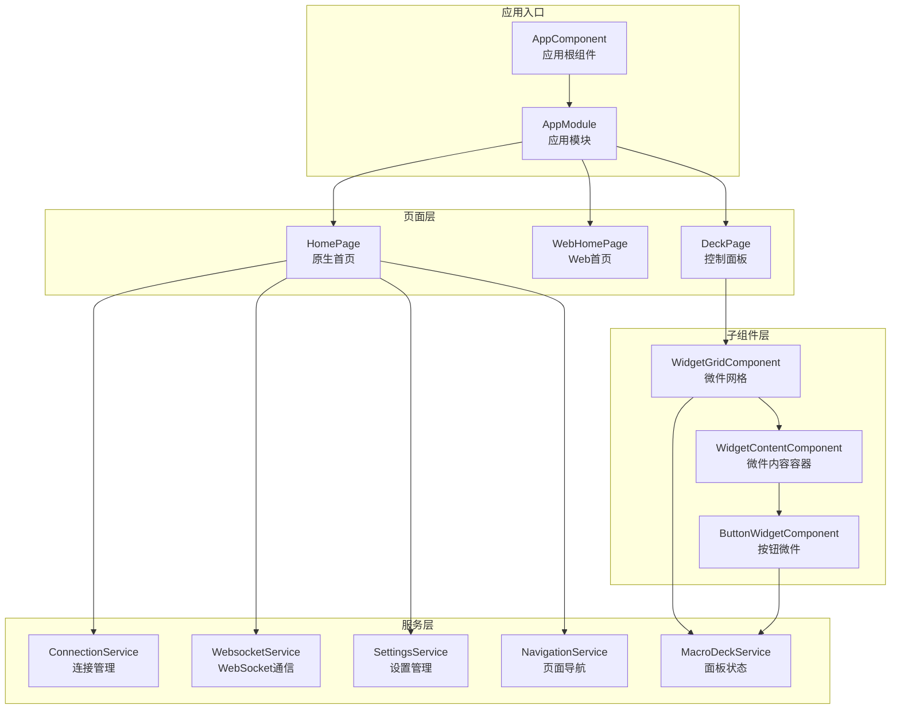
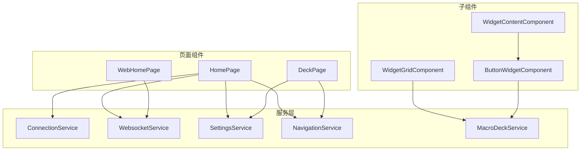
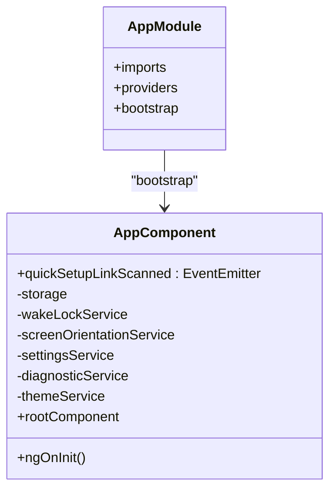
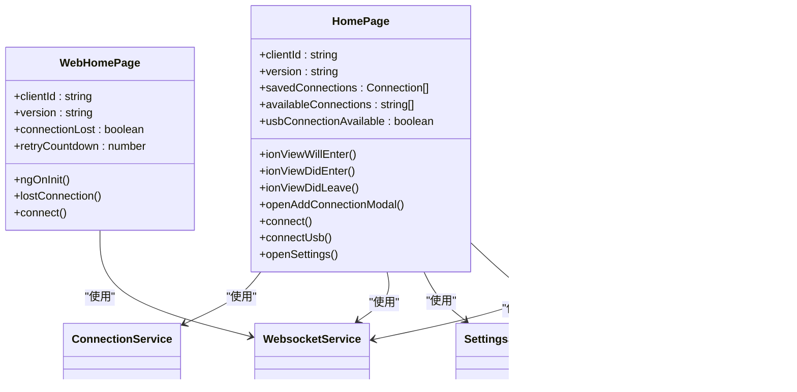
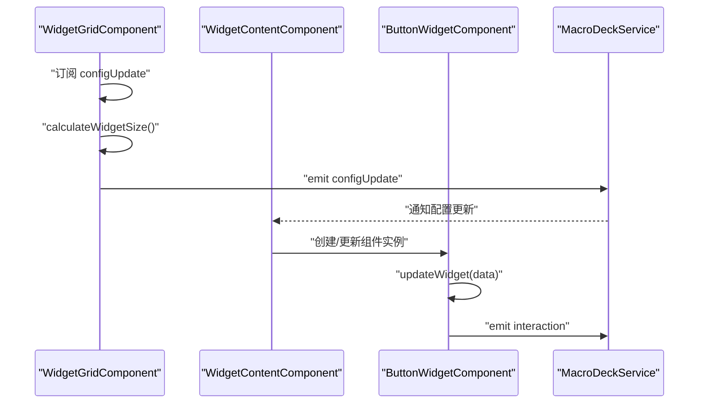
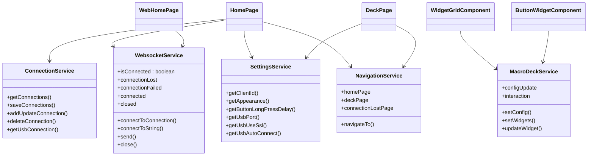
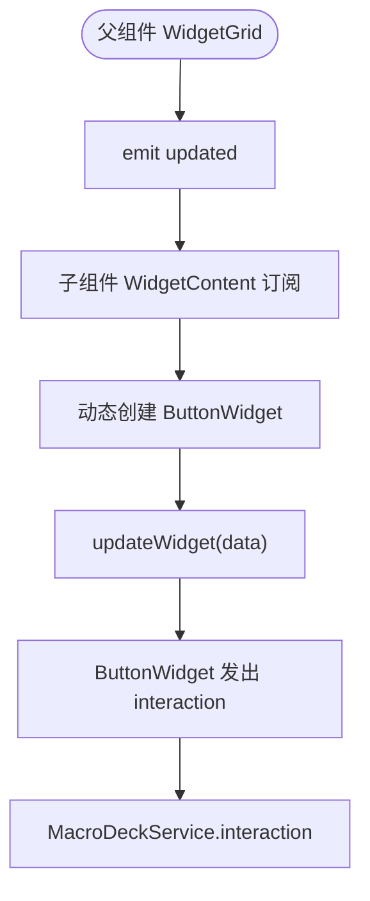
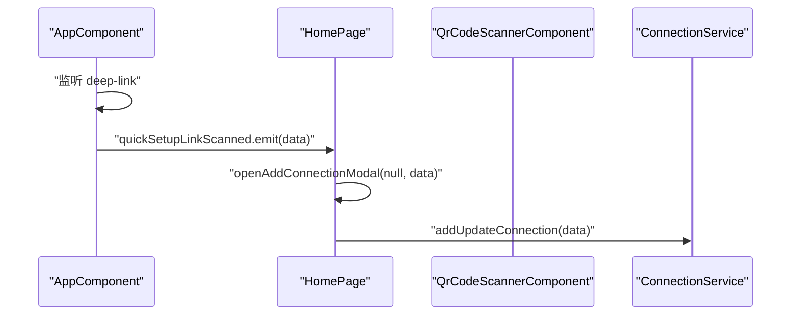
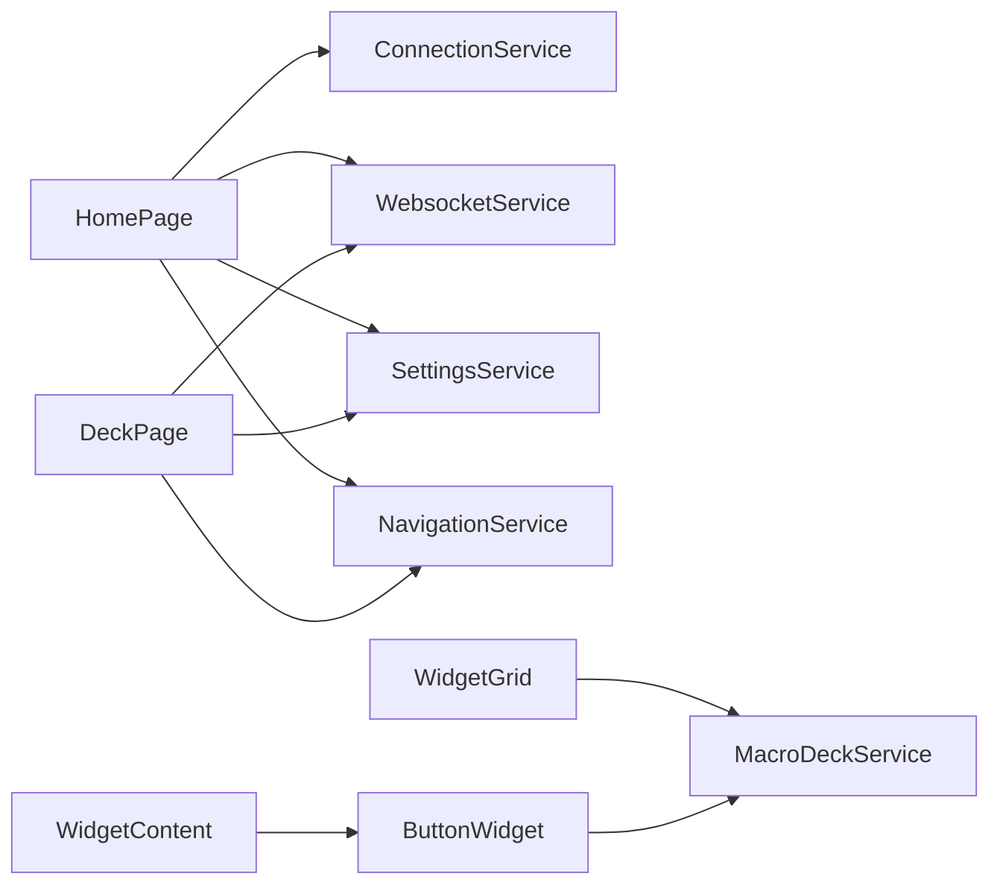

# 组件关系设计

<cite>
**本文档引用的文件**
- [src/app/app.component.ts](file://src/app/app.component.ts)
- [src/app/app.module.ts](file://src/app/app.module.ts)
- [src/app/pages/home/home.page.ts](file://src/app/pages/home/home.page.ts)
- [src/app/pages/deck/deck.page.ts](file://src/app/pages/deck/deck.page.ts)
- [src/app/pages/web-home/web-home.page.ts](file://src/app/pages/web-home/web-home.page.ts)
- [src/app/pages/home/modals/add-connection/add-connection.component.ts](file://src/app/pages/home/modals/add-connection/add-connection.component.ts)
- [src/app/pages/deck/widget-grid/widget-grid.component.ts](file://src/app/pages/deck/widget-grid/widget-grid.component.ts)
- [src/app/pages/deck/widget-grid/widget-content/widget-content.component.ts](file://src/app/pages/deck/widget-grid/widget-content/widget-content.component.ts)
- [src/app/services/connection/connection.service.ts](file://src/app/services/connection/connection.service.ts)
- [src/app/services/websocket/websocket.service.ts](file://src/app/services/websocket/websocket.service.ts)
- [src/app/services/settings/settings.service.ts](file://src/app/services/settings/settings.service.ts)
- [src/app/services/navigation/navigation.service.ts](file://src/app/services/navigation/navigation.service.ts)
- [src/app/services/macro-deck/macro-deck.service.ts](file://src/app/services/macro-deck/macro-deck.service.ts)
- [src/app/services/navigate/navigate.service.ts](file://src/app/services/navigate/navigate.service.ts)
- [src/app/pages/home/modals/add-connection/qr-code-scanner/qr-code-scanner.component.ts](file://src/app/pages/home/modals/add-connection/qr-code-scanner/qr-code-scanner.component.ts)
- [src/app/widget-content-components/button-widget/button-widget.component.ts](file://src/app/widget-content-components/button-widget/button-widget.component.ts)
</cite>

## 目录
1. [简介](#简介)
2. [项目结构](#项目结构)
3. [核心组件](#核心组件)
4. [架构概览](#架构概览)
5. [详细组件分析](#详细组件分析)
6. [依赖分析](#依赖分析)
7. [性能考虑](#性能考虑)
8. [故障排除指南](#故障排除指南)
9. [结论](#结论)

## 简介
本文件为 Macro-Deck-Client-App 的组件关系设计文档，系统性梳理了应用的组件层次结构、继承关系、父子/兄弟组件通信机制、生命周期管理与状态管理策略，并总结了组件复用与抽象的设计原则。文档面向不同技术背景的读者，既提供高层架构视图，也包含代码级细节分析。

## 项目结构
应用采用 Angular + Ionic 的混合架构，遵循“按功能域分层”的组织方式：
- 根组件与模块：AppComponent 作为应用入口，AppModule 统一声明与引导
- 页面组件：Home/HomeWeb/Deck 等页面组件，承载业务主流程
- 子组件：WidgetGrid、WidgetContent、ButtonWidget 等，负责具体 UI 与交互
- 服务层：Connection、Websocket、Settings、Navigation、MacroDeck 等，封装跨组件状态与业务逻辑
- 数据类型与枚举：Connection、Widget、WidgetInteraction 等，统一数据契约

**图表来源**
- [src/app/app.component.ts:18-68](file://src/app/app.component.ts#L18-L68)
- [src/app/app.module.ts:19-42](file://src/app/app.module.ts#L19-L42)
- [src/app/pages/home/home.page.ts:29-38](file://src/app/pages/home/home.page.ts#L29-L38)
- [src/app/pages/web-home/web-home.page.ts:8-16](file://src/app/pages/web-home/web-home.page.ts#L8-L16)
- [src/app/pages/deck/deck.page.ts:14-23](file://src/app/pages/deck/deck.page.ts#L14-L23)
- [src/app/pages/deck/widget-grid/widget-grid.component.ts:19-28](file://src/app/pages/deck/widget-grid/widget-grid.component.ts#L19-L28)
- [src/app/pages/deck/widget-grid/widget-content/widget-content.component.ts:10-16](file://src/app/pages/deck/widget-grid/widget-content/widget-content.component.ts#L10-L16)
- [src/app/widget-content-components/button-widget/button-widget.component.ts:14-22](file://src/app/widget-content-components/button-widget/button-widget.component.ts#L14-L22)
- [src/app/services/connection/connection.service.ts:6-10](file://src/app/services/connection/connection.service.ts#L6-L10)
- [src/app/services/websocket/websocket.service.ts:16-20](file://src/app/services/websocket/websocket.service.ts#L16-L20)
- [src/app/services/settings/settings.service.ts:22-26](file://src/app/services/settings/settings.service.ts#L22-L26)
- [src/app/services/navigation/navigation.service.ts:9-13](file://src/app/services/navigation/navigation.service.ts#L9-L13)
- [src/app/services/macro-deck/macro-deck.service.ts:6-10](file://src/app/services/macro-deck/macro-deck.service.ts#L6-L10)

**章节来源**
- [src/app/app.component.ts:18-68](file://src/app/app.component.ts#L18-L68)
- [src/app/app.module.ts:19-42](file://src/app/app.module.ts#L19-L42)

## 核心组件
- 根组件 AppComponent：负责应用初始化、平台能力适配（Android 跳过 SSL）、深度链接监听、主题与屏幕常亮等全局设置；通过环境变量决定根页面组件（WebHomePage 或 HomePage）
- 页面组件：
  - HomePage：管理连接列表、Ping 检测、连接操作、设置弹窗、QR 扫描等
  - WebHomePage：浏览器直连同源服务器，自动重连与倒计时
  - DeckPage：控制面板页面，校验连接状态并加载设置
- 子组件：
  - WidgetGridComponent：根据面板配置动态计算按钮尺寸、间距与圆角，触发网格更新事件
  - WidgetContentComponent：根据微件类型动态创建 Empty/Button 微件组件
  - ButtonWidgetComponent：渲染按钮图标/标签、背景色与边框，处理短按/长按交互并通过 MacroDeckService 发出事件

**章节来源**
- [src/app/app.component.ts:26-68](file://src/app/app.component.ts#L26-L68)
- [src/app/pages/home/home.page.ts:29-38](file://src/app/pages/home/home.page.ts#L29-L38)
- [src/app/pages/web-home/web-home.page.ts:8-16](file://src/app/pages/web-home/web-home.page.ts#L8-L16)
- [src/app/pages/deck/deck.page.ts:14-23](file://src/app/pages/deck/deck.page.ts#L14-L23)
- [src/app/pages/deck/widget-grid/widget-grid.component.ts:19-28](file://src/app/pages/deck/widget-grid/widget-grid.component.ts#L19-L28)
- [src/app/pages/deck/widget-grid/widget-content/widget-content.component.ts:10-16](file://src/app/pages/deck/widget-grid/widget-content/widget-content.component.ts#L10-L16)
- [src/app/widget-content-components/button-widget/button-widget.component.ts:14-22](file://src/app/widget-content-components/button-widget/button-widget.component.ts#L14-L22)

## 架构概览
应用采用“页面-子组件-服务”三层协作模式：
- 页面组件负责业务编排与用户交互，依赖服务层完成数据持久化、网络通信与导航
- 子组件专注于 UI 渲染与局部交互，通过输入输出与父组件通信
- 服务层提供跨组件共享的状态与能力，如连接管理、WebSocket 通信、设置与导航

**图表来源**
- [src/app/pages/home/home.page.ts:56-63](file://src/app/pages/home/home.page.ts#L56-L63)
- [src/app/pages/web-home/web-home.page.ts:32-34](file://src/app/pages/web-home/web-home.page.ts#L32-L34)
- [src/app/pages/deck/deck.page.ts:33-37](file://src/app/pages/deck/deck.page.ts#L33-L37)
- [src/app/pages/deck/widget-grid/widget-grid.component.ts:33-34](file://src/app/pages/deck/widget-grid/widget-grid.component.ts#L33-L34)
- [src/app/pages/deck/widget-grid/widget-content/widget-content.component.ts:100-101](file://src/app/pages/deck/widget-grid/widget-content/widget-content.component.ts#L100-L101)
- [src/app/widget-content-components/button-widget/button-widget.component.ts:49-52](file://src/app/widget-content-components/button-widget/button-widget.component.ts#L49-L52)
- [src/app/services/connection/connection.service.ts:10-16](file://src/app/services/connection/connection.service.ts#L10-L16)
- [src/app/services/websocket/websocket.service.ts:20-55](file://src/app/services/websocket/websocket.service.ts#L20-L55)
- [src/app/services/settings/settings.service.ts:26-29](file://src/app/services/settings/settings.service.ts#L26-L29)
- [src/app/services/navigation/navigation.service.ts:13-63](file://src/app/services/navigation/navigation.service.ts#L13-L63)
- [src/app/services/macro-deck/macro-deck.service.ts:10-30](file://src/app/services/macro-deck/macro-deck.service.ts#L10-L30)

## 详细组件分析

### 根组件与模块关系
- AppComponent：定义静态事件通道 quickSetupLinkScanned，监听 Capacitor 深度链接，解析快速设置二维码数据并广播给订阅者
- AppModule：集中导入页面模块、子组件模块、Ionic 模块与 Service Worker，bootstrap AppComponent

**图表来源**
- [src/app/app.component.ts:26-68](file://src/app/app.component.ts#L26-L68)
- [src/app/app.module.ts:19-42](file://src/app/app.module.ts#L19-L42)

**章节来源**
- [src/app/app.component.ts:26-68](file://src/app/app.component.ts#L26-L68)
- [src/app/app.module.ts:19-42](file://src/app/app.module.ts#L19-L42)

### 页面组件层次与职责
- HomePage：维护连接列表、Ping 状态、USB 可用性；打开/编辑连接弹窗；处理连接失败与快速设置深度链接；调用 WakeLock 与 WebSocket
- WebHomePage：浏览器直连，自动解析同源 ws 地址，连接丢失时倒计时重连
- DeckPage：校验连接状态，加载设置，提供全屏与设置弹窗

**图表来源**
- [src/app/pages/home/home.page.ts:39-64](file://src/app/pages/home/home.page.ts#L39-L64)
- [src/app/pages/web-home/web-home.page.ts:17-34](file://src/app/pages/web-home/web-home.page.ts#L17-L34)
- [src/app/pages/deck/deck.page.ts:24-37](file://src/app/pages/deck/deck.page.ts#L24-L37)

**章节来源**
- [src/app/pages/home/home.page.ts:39-139](file://src/app/pages/home/home.page.ts#L39-L139)
- [src/app/pages/web-home/web-home.page.ts:17-81](file://src/app/pages/web-home/web-home.page.ts#L17-L81)
- [src/app/pages/deck/deck.page.ts:24-85](file://src/app/pages/deck/deck.page.ts#L24-L85)

### 子组件与动态内容渲染
- WidgetGridComponent：订阅 MacroDeckService 配置更新，计算按钮尺寸、间距与圆角，触发全局更新事件
- WidgetContentComponent：根据 WidgetContentType 动态创建 EmptyWidget 或 ButtonWidget，并注入数据
- ButtonWidgetComponent：渲染前景/图标、背景色与边框，处理短按/长按事件并通过 MacroDeckService 传播交互

**图表来源**
- [src/app/pages/deck/widget-grid/widget-grid.component.ts:68-116](file://src/app/pages/deck/widget-grid/widget-grid.component.ts#L68-L116)
- [src/app/pages/deck/widget-grid/widget-content/widget-content.component.ts:45-79](file://src/app/pages/deck/widget-grid/widget-content/widget-content.component.ts#L45-L79)
- [src/app/widget-content-components/button-widget/button-widget.component.ts:59-103](file://src/app/widget-content-components/button-widget/button-widget.component.ts#L59-L103)
- [src/app/services/macro-deck/macro-deck.service.ts:11-43](file://src/app/services/macro-deck/macro-deck.service.ts#L11-L43)

**章节来源**
- [src/app/pages/deck/widget-grid/widget-grid.component.ts:29-191](file://src/app/pages/deck/widget-grid/widget-grid.component.ts#L29-L191)
- [src/app/pages/deck/widget-grid/widget-content/widget-content.component.ts:16-84](file://src/app/pages/deck/widget-grid/widget-content/widget-content.component.ts#L16-L84)
- [src/app/widget-content-components/button-widget/button-widget.component.ts:23-227](file://src/app/widget-content-components/button-widget/button-widget.component.ts#L23-L227)

### 服务层与状态管理
- ConnectionService：连接配置的增删改查与持久化，提供 USB 连接默认值
- WebsocketService：WebSocket 连接生命周期管理、错误处理、事件广播（连接丢失/失败/关闭/成功）
- SettingsService：应用设置的读写，包含外观、屏幕方向、按钮长按延迟、USB 参数等
- NavigationService：基于环境变量选择首页组件，统一页面跳转
- MacroDeckService：面板配置与微件状态，提供配置更新与交互事件

**图表来源**
- [src/app/services/connection/connection.service.ts:10-101](file://src/app/services/connection/connection.service.ts#L10-L101)
- [src/app/services/websocket/websocket.service.ts:20-230](file://src/app/services/websocket/websocket.service.ts#L20-L230)
- [src/app/services/settings/settings.service.ts:26-246](file://src/app/services/settings/settings.service.ts#L26-L246)
- [src/app/services/navigation/navigation.service.ts:13-84](file://src/app/services/navigation/navigation.service.ts#L13-L84)
- [src/app/services/macro-deck/macro-deck.service.ts:10-66](file://src/app/services/macro-deck/macro-deck.service.ts#L10-L66)

**章节来源**
- [src/app/services/connection/connection.service.ts:10-101](file://src/app/services/connection/connection.service.ts#L10-L101)
- [src/app/services/websocket/websocket.service.ts:20-230](file://src/app/services/websocket/websocket.service.ts#L20-L230)
- [src/app/services/settings/settings.service.ts:26-246](file://src/app/services/settings/settings.service.ts#L26-L246)
- [src/app/services/navigation/navigation.service.ts:13-84](file://src/app/services/navigation/navigation.service.ts#L13-L84)
- [src/app/services/macro-deck/macro-deck.service.ts:10-66](file://src/app/services/macro-deck/macro-deck.service.ts#L10-L66)

### 父子组件通信机制
- @Input/@Output 装饰器：WidgetContentComponent 通过 @Input(data) 自动更新动态组件；ButtonWidgetComponent 通过 @Output 事件向父组件传播交互
- 事件传递：WidgetGridComponent 使用静态 EventEmitter(updated) 广播布局更新；MacroDeckService 使用 @Output(configUpdate/interaction) 传播面板配置与交互

**图表来源**
- [src/app/pages/deck/widget-grid/widget-grid.component.ts:38-116](file://src/app/pages/deck/widget-grid/widget-grid.component.ts#L38-L116)
- [src/app/pages/deck/widget-grid/widget-content/widget-content.component.ts:26-79](file://src/app/pages/deck/widget-grid/widget-content/widget-content.component.ts#L26-L79)
- [src/app/widget-content-components/button-widget/button-widget.component.ts:218-226](file://src/app/widget-content-components/button-widget/button-widget.component.ts#L218-L226)
- [src/app/services/macro-deck/macro-deck.service.ts:13-14](file://src/app/services/macro-deck/macro-deck.service.ts#L13-L14)

**章节来源**
- [src/app/pages/deck/widget-grid/widget-grid.component.ts:38-116](file://src/app/pages/deck/widget-grid/widget-grid.component.ts#L38-L116)
- [src/app/pages/deck/widget-grid/widget-content/widget-content.component.ts:26-79](file://src/app/pages/deck/widget-grid/widget-content/widget-content.component.ts#L26-L79)
- [src/app/widget-content-components/button-widget/button-widget.component.ts:218-226](file://src/app/widget-content-components/button-widget/button-widget.component.ts#L218-L226)
- [src/app/services/macro-deck/macro-deck.service.ts:13-14](file://src/app/services/macro-deck/macro-deck.service.ts#L13-L14)

### 兄弟组件通信方式
- 服务共享状态：ConnectionService、WebsocketService、SettingsService、MacroDeckService 提供全局状态，兄弟组件通过依赖注入共享同一实例
- 事件总线模式：AppComponent.quickSetupLinkScanned、QrCodeScannerComponent.quickSetupQrCodeScanned、WidgetGridComponent.updated 等静态 EventEmitter 实现跨组件解耦通信

**图表来源**
- [src/app/app.component.ts:58-66](file://src/app/app.component.ts#L58-L66)
- [src/app/pages/home/home.page.ts:133-136](file://src/app/pages/home/home.page.ts#L133-L136)
- [src/app/pages/home/modals/add-connection/add-connection.component.ts:66-74](file://src/app/pages/home/modals/add-connection/add-connection.component.ts#L66-L74)
- [src/app/services/connection/connection.service.ts:65-85](file://src/app/services/connection/connection.service.ts#L65-L85)

**章节来源**
- [src/app/app.component.ts:58-66](file://src/app/app.component.ts#L58-L66)
- [src/app/pages/home/home.page.ts:133-136](file://src/app/pages/home/home.page.ts#L133-L136)
- [src/app/pages/home/modals/add-connection/add-connection.component.ts:66-74](file://src/app/pages/home/modals/add-connection/add-connection.component.ts#L66-L74)
- [src/app/services/connection/connection.service.ts:65-85](file://src/app/services/connection/connection.service.ts#L65-L85)

### 组件生命周期管理与状态管理策略
- 生命周期钩子：HomePage 使用 ionViewWillEnter/ionViewDidEnter/ionViewDidLeave 管理 Ping 检测与订阅；WebHomePage 使用 ngOnInit 管理连接与倒计时；WidgetGridComponent 使用 ngAfterContentInit 订阅配置更新与窗口 resize
- 状态管理：
  - 本地持久化：SettingsService、ConnectionService 基于 @ionic/storage
  - 全局共享：WebsocketService、MacroDeckService、NavigationService 作为根注入，跨页面共享
  - 事件驱动：大量使用 EventEmitter 实现组件间解耦通信

**章节来源**
- [src/app/pages/home/home.page.ts:70-139](file://src/app/pages/home/home.page.ts#L70-L139)
- [src/app/pages/web-home/web-home.page.ts:40-79](file://src/app/pages/web-home/web-home.page.ts#L40-L79)
- [src/app/pages/deck/widget-grid/widget-grid.component.ts:68-86](file://src/app/pages/deck/widget-grid/widget-grid.component.ts#L68-L86)
- [src/app/services/settings/settings.service.ts:26-246](file://src/app/services/settings/settings.service.ts#L26-L246)
- [src/app/services/connection/connection.service.ts:10-101](file://src/app/services/connection/connection.service.ts#L10-L101)
- [src/app/services/websocket/websocket.service.ts:20-230](file://src/app/services/websocket/websocket.service.ts#L20-L230)
- [src/app/services/macro-deck/macro-deck.service.ts:10-66](file://src/app/services/macro-deck/macro-deck.service.ts#L10-L66)

### 组件复用与抽象设计原则
- 抽象与复用：
  - WidgetContentComponent 通过动态组件创建实现内容类型抽象，减少重复代码
  - MacroDeckService 统一面板配置与微件状态，WidgetGridComponent 与 ButtonWidgetComponent 仅关注渲染与交互
- 设计原则：
  - 单一职责：每个服务/组件专注一个领域
  - 依赖注入：通过构造函数注入，降低紧耦合
  - 事件驱动：使用 EventEmitter 解耦组件通信
  - 环境适配：AppModule 与 NavigationService 基于环境变量选择页面组件

**章节来源**
- [src/app/pages/deck/widget-grid/widget-content/widget-content.component.ts:45-79](file://src/app/pages/deck/widget-grid/widget-content/widget-content.component.ts#L45-L79)
- [src/app/services/navigation/navigation.service.ts:15-46](file://src/app/services/navigation/navigation.service.ts#L15-L46)
- [src/app/services/macro-deck/macro-deck.service.ts:10-66](file://src/app/services/macro-deck/macro-deck.service.ts#L10-L66)

## 依赖分析
- 组件耦合：
  - HomePage 与多个服务强耦合，承担较多业务编排职责
  - WidgetGridComponent 与 MacroDeckService 强关联，负责布局计算
  - ButtonWidgetComponent 与 MacroDeckService 交互，传播用户交互事件
- 外部依赖：
  - Capacitor 插件（SSL Handler、Barcode Scanner）用于平台能力扩展
  - RxJS 用于事件流与订阅管理

**图表来源**
- [src/app/pages/home/home.page.ts:56-63](file://src/app/pages/home/home.page.ts#L56-L63)
- [src/app/pages/deck/deck.page.ts:33-37](file://src/app/pages/deck/deck.page.ts#L33-L37)
- [src/app/pages/deck/widget-grid/widget-grid.component.ts:33-34](file://src/app/pages/deck/widget-grid/widget-grid.component.ts#L33-L34)
- [src/app/pages/deck/widget-grid/widget-content/widget-content.component.ts:100-101](file://src/app/pages/deck/widget-grid/widget-content/widget-content.component.ts#L100-L101)
- [src/app/widget-content-components/button-widget/button-widget.component.ts:49-52](file://src/app/widget-content-components/button-widget/button-widget.component.ts#L49-L52)

**章节来源**
- [src/app/pages/home/home.page.ts:56-63](file://src/app/pages/home/home.page.ts#L56-L63)
- [src/app/pages/deck/deck.page.ts:33-37](file://src/app/pages/deck/deck.page.ts#L33-L37)
- [src/app/pages/deck/widget-grid/widget-grid.component.ts:33-34](file://src/app/pages/deck/widget-grid/widget-grid.component.ts#L33-L34)
- [src/app/pages/deck/widget-grid/widget-content/widget-content.component.ts:100-101](file://src/app/pages/deck/widget-grid/widget-content/widget-content.component.ts#L100-L101)
- [src/app/widget-content-components/button-widget/button-widget.component.ts:49-52](file://src/app/widget-content-components/button-widget/button-widget.component.ts#L49-L52)

## 性能考虑
- 布局计算优化：WidgetGridComponent 在窗口 resize 时使用延迟计算与应用 tick，避免频繁重绘
- 订阅管理：各组件在销毁时统一取消订阅，防止内存泄漏
- 事件节流：通过静态 EventEmitter 与服务共享状态，减少不必要的组件重建
- 环境适配：根据 webVersion 选择页面组件，避免不必要的平台特性检查

[本节为通用指导，无需特定文件分析]

## 故障排除指南
- 连接失败处理：WebsocketService 在连接错误时区分环境，Web 版直接触发连接丢失事件，原生版根据状态导航至连接丢失页面或弹窗提示
- 连接丢失恢复：WebHomePage 在连接丢失时启动倒计时，10 秒后自动重连
- 快速设置深度链接：AppComponent 监听 deep-link，解析二维码数据并打开新增连接弹窗
- QR 扫描权限：QrCodeScannerComponent 在权限被拒时弹窗提示，避免静默失败

**章节来源**
- [src/app/services/websocket/websocket.service.ts:197-229](file://src/app/services/websocket/websocket.service.ts#L197-L229)
- [src/app/pages/web-home/web-home.page.ts:53-79](file://src/app/pages/web-home/web-home.page.ts#L53-L79)
- [src/app/app.component.ts:58-66](file://src/app/app.component.ts#L58-L66)
- [src/app/pages/home/modals/add-connection/qr-code-scanner/qr-code-scanner.component.ts:81-96](file://src/app/pages/home/modals/add-connection/qr-code-scanner/qr-code-scanner.component.ts#L81-L96)

## 结论
本设计文档系统性呈现了 Macro-Deck-Client-App 的组件关系与通信机制。通过页面-子组件-服务的清晰分层、事件驱动的解耦通信、以及服务层的全局状态管理，实现了跨平台的一致体验。建议在后续迭代中进一步拆分 HomePage 的业务编排职责，增强组件的单一职责与可测试性。