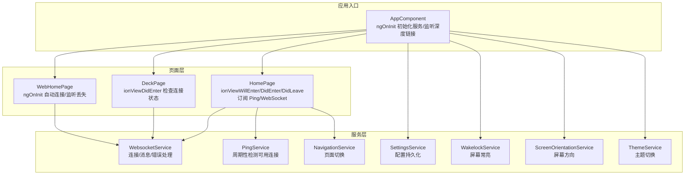
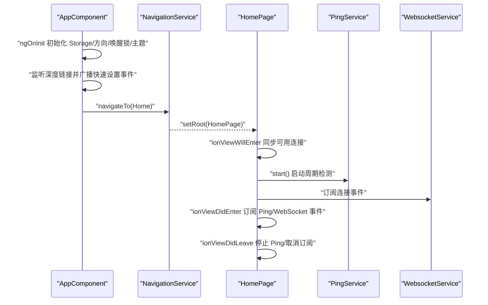
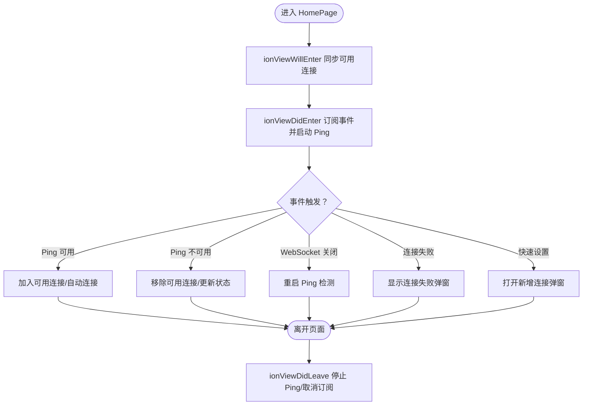
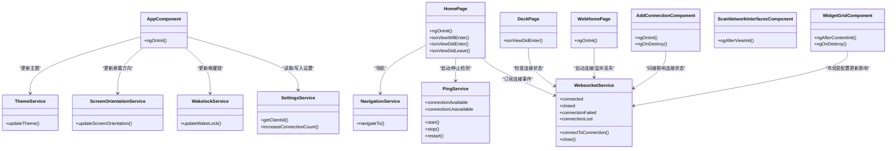

# 组件生命周期管理

<cite>
**本文档引用的文件**
- [src/app/app.component.ts](file://src/app/app.component.ts)
- [src/app/pages/home/home.page.ts](file://src/app/pages/home/home.page.ts)
- [src/app/pages/deck/deck.page.ts](file://src/app/pages/deck/deck.page.ts)
- [src/app/pages/web-home/web-home.page.ts](file://src/app/pages/web-home/web-home.page.ts)
- [src/app/pages/home/modals/add-connection/add-connection.component.ts](file://src/app/pages/home/modals/add-connection/add-connection.component.ts)
- [src/app/pages/home/modals/scan-network-interfaces/scan-network-interfaces.component.ts](file://src/app/pages/home/modals/scan-network-interfaces/scan-network-interfaces.component.ts)
- [src/app/pages/deck/widget-grid/widget-grid.component.ts](file://src/app/pages/deck/widget-grid/widget-grid.component.ts)
- [src/app/services/websocket/websocket.service.ts](file://src/app/services/websocket/websocket.service.ts)
- [src/app/services/ping/ping.service.ts](file://src/app/services/ping/ping.service.ts)
- [src/app/services/navigation/navigation.service.ts](file://src/app/services/navigation/navigation.service.ts)
- [src/app/services/settings/settings.service.ts](file://src/app/services/settings/settings.service.ts)
- [src/app/services/wakelock/wakelock.service.ts](file://src/app/services/wakelock/wakelock.service.ts)
- [src/app/services/screen-orientation/screen-orientation.service.ts](file://src/app/services/screen-orientation/screen-orientation.service.ts)
- [src/app/services/theme/theme.service.ts](file://src/app/services/theme/theme.service.ts)
</cite>

## 目录
1. [简介](#简介)
2. [项目结构](#项目结构)
3. [核心组件](#核心组件)
4. [架构总览](#架构总览)
5. [详细组件分析](#详细组件分析)
6. [依赖关系分析](#依赖关系分析)
7. [性能考虑](#性能考虑)
8. [故障排查指南](#故障排查指南)
9. [结论](#结论)

## 简介
本文件聚焦于 Macro-Deck-Client-App 的 Angular 组件生命周期管理，系统梳理关键生命周期钩子（如 ngOnInit、ngAfterViewInit、ionViewDidEnter、ionViewWillEnter、ionViewDidLeave、ngAfterContentInit、ngOnDestroy 等）在各组件中的使用场景与最佳实践。结合 AppComponent、HomePage、DeckPage、WebHomePage、AddConnectionComponent、ScanNetworkInterfacesComponent、WidgetGridComponent 等主要组件，阐述初始化顺序、销毁时机、内存泄漏预防、状态管理与生命周期的关系，以及懒加载组件的生命周期处理要点。同时提供性能优化建议，包括变更检测优化与资源清理策略。

## 项目结构
应用采用 Ionic + Angular 架构，页面组件通过 NavigationService 切换，服务层负责连接、设置、主题、屏幕方向、唤醒锁等横切关注点。组件间通过服务与事件总线（EventEmitter、RxJS Subscription）解耦，生命周期钩子承担初始化、资源订阅、视图渲染与清理职责。

图表来源
- [src/app/app.component.ts:46-67](file://src/app/app.component.ts#L46-L67)
- [src/app/pages/home/home.page.ts:66-139](file://src/app/pages/home/home.page.ts#L66-L139)
- [src/app/pages/deck/deck.page.ts:40-52](file://src/app/pages/deck/deck.page.ts#L40-L52)
- [src/app/pages/web-home/web-home.page.ts:36-47](file://src/app/pages/web-home/web-home.page.ts#L36-L47)
- [src/app/services/websocket/websocket.service.ts:59-134](file://src/app/services/websocket/websocket.service.ts#L59-L134)
- [src/app/services/ping/ping.service.ts:32-72](file://src/app/services/ping/ping.service.ts#L32-L72)
- [src/app/services/navigation/navigation.service.ts:24-46](file://src/app/services/navigation/navigation.service.ts#L24-L46)
- [src/app/services/settings/settings.service.ts:224-246](file://src/app/services/settings/settings.service.ts#L224-L246)
- [src/app/services/wakelock/wakelock.service.ts:18-32](file://src/app/services/wakelock/wakelock.service.ts#L18-L32)
- [src/app/services/screen-orientation/screen-orientation.service.ts:17-55](file://src/app/services/screen-orientation/screen-orientation.service.ts#L17-L55)
- [src/app/services/theme/theme.service.ts:16-39](file://src/app/services/theme/theme.service.ts#L16-L39)

章节来源
- [src/app/app.component.ts:17-68](file://src/app/app.component.ts#L17-L68)
- [src/app/services/navigation/navigation.service.ts:15-46](file://src/app/services/navigation/navigation.service.ts#L15-L46)

## 核心组件
- AppComponent：应用根组件，负责初始化 Storage、屏幕方向、唤醒锁、主题；在 Android 上根据设置跳过 SSL 校验；监听深度链接事件并广播快速设置数据。
- HomePage：主页面，管理连接列表、Ping 检测、WebSocket 连接、弹窗交互；在页面进入时启动 Ping，离开时停止并取消订阅；初始化时读取客户端 ID 与版本。
- DeckPage：控制面板页面，进入时检查连接状态，未连接则导航回首页；读取设置与版本信息。
- WebHomePage：Web 端首页，自动连接同源服务器，监听连接丢失并倒计时重连。
- AddConnectionComponent：新增/编辑连接弹窗，原生平台下监听二维码扫描结果并自动处理快速设置；销毁时取消订阅。
- ScanNetworkInterfacesComponent：网络接口扫描弹窗，视图初始化后延迟执行连接测试；使用 DestroyRef 与 takeUntilDestroyed 防止内存泄漏。
- WidgetGridComponent：微件网格组件，内容初始化后订阅配置更新与窗口 resize，销毁时取消订阅。

章节来源
- [src/app/app.component.ts:26-68](file://src/app/app.component.ts#L26-L68)
- [src/app/pages/home/home.page.ts:39-271](file://src/app/pages/home/home.page.ts#L39-L271)
- [src/app/pages/deck/deck.page.ts:24-86](file://src/app/pages/deck/deck.page.ts#L24-L86)
- [src/app/pages/web-home/web-home.page.ts:17-82](file://src/app/pages/web-home/web-home.page.ts#L17-L82)
- [src/app/pages/home/modals/add-connection/add-connection.component.ts:25-58](file://src/app/pages/home/modals/add-connection/add-connection.component.ts#L25-L58)
- [src/app/pages/home/modals/scan-network-interfaces/scan-network-interfaces.component.ts:18-112](file://src/app/pages/home/modals/scan-network-interfaces/scan-network-interfaces.component.ts#L18-L112)
- [src/app/pages/deck/widget-grid/widget-grid.component.ts:29-86](file://src/app/pages/deck/widget-grid/widget-grid.component.ts#L29-L86)

## 架构总览
生命周期在组件与服务之间形成清晰的协作链路：根组件在 ngOnInit 中完成全局初始化；页面组件在 ionViewDidEnter 中建立业务订阅；服务在连接/检测过程中通过事件与订阅管理资源；组件在 ngOnDestroy/DidLeave 中统一清理，避免内存泄漏。

图表来源
- [src/app/app.component.ts:46-67](file://src/app/app.component.ts#L46-L67)
- [src/app/services/navigation/navigation.service.ts:29-46](file://src/app/services/navigation/navigation.service.ts#L29-L46)
- [src/app/pages/home/home.page.ts:66-139](file://src/app/pages/home/home.page.ts#L66-L139)
- [src/app/services/ping/ping.service.ts:36-72](file://src/app/services/ping/ping.service.ts#L36-L72)
- [src/app/services/websocket/websocket.service.ts:136-172](file://src/app/services/websocket/websocket.service.ts#L136-L172)

## 详细组件分析

### AppComponent（应用根组件）
- 生命周期使用
  - ngOnInit：创建 Storage、更新屏幕方向、唤醒锁、主题；Android 平台根据设置决定是否跳过 SSL 校验；注册深度链接监听，解析快速设置二维码数据并通过静态事件发射器广播。
- 初始化顺序
  - 依赖注入完成后立即执行；先完成基础能力初始化，再监听外部事件。
- 销毁时机
  - 根组件通常不销毁；但其监听的深度链接事件需在合适时机解除（本项目中未见显式移除逻辑，建议在应用退出或平台切换时补充）。
- 内存泄漏预防
  - 深度链接监听应与组件生命周期对齐；若根组件长期存在，建议在组件销毁阶段移除监听。
- 性能与最佳实践
  - 将耗时初始化（如网络校验）放在后台任务中；避免阻塞首屏渲染。

章节来源
- [src/app/app.component.ts:46-67](file://src/app/app.component.ts#L46-L67)

### HomePage（主页面）
- 生命周期使用
  - ngOnInit：读取客户端 ID 与版本号。
  - ionViewWillEnter：从 PingService 同步可用连接状态，避免双向绑定引用问题。
  - ionViewDidEnter：创建订阅集合，加载连接列表，订阅 Ping 可用/不可用事件、WebSocket 关闭/失败事件、快速设置事件；启动 Ping 检测。
  - ionViewDidLeave：停止 Ping 检测并取消所有订阅。
- 初始化顺序
  - 先 ngOnInit 获取基础信息，再 ionViewDidEnter 建立业务订阅。
- 销毁时机
  - 页面离开时统一清理，防止后台继续消耗资源。
- 内存泄漏预防
  - 使用 RxJS Subscription 管理订阅；离开时调用 unsubscribe。
- 性能与最佳实践
  - 使用 map 创建新数组避免引用污染；在连接失败时弹窗提示并恢复 Ping。

图表来源
- [src/app/pages/home/home.page.ts:66-139](file://src/app/pages/home/home.page.ts#L66-L139)

章节来源
- [src/app/pages/home/home.page.ts:39-139](file://src/app/pages/home/home.page.ts#L39-L139)

### DeckPage（控制面板页面）
- 生命周期使用
  - ionViewDidEnter：检查 WebSocket 连接状态，未连接则导航回首页；读取设置与版本信息。
- 初始化顺序
  - 页面进入时才进行状态检查与设置加载。
- 销毁时机
  - 作为页面组件，通常由路由/导航服务管理；组件本身未实现 ngOnDestroy。
- 内存泄漏预防
  - 若后续引入订阅或定时器，应在组件销毁时清理。
- 性能与最佳实践
  - 连接状态检查与导航逻辑简单明确，避免在生命周期中做重型计算。

章节来源
- [src/app/pages/deck/deck.page.ts:24-86](file://src/app/pages/deck/deck.page.ts#L24-L86)

### WebHomePage（Web 端首页）
- 生命周期使用
  - ngOnInit：读取客户端 ID 与版本号；自动连接；订阅连接丢失事件并启动倒计时重连。
- 初始化顺序
  - 先读取客户端信息，再发起连接；随后监听丢失事件。
- 销毁时机
  - 组件销毁时未见显式清理定时器；建议在 ngOnDestroy 中清除。
- 内存泄漏预防
  - 倒计时定时器需在组件销毁时清理，避免后台持续运行。
- 性能与最佳实践
  - 使用 document.baseURI 动态推导 WebSocket 地址，减少配置成本。

章节来源
- [src/app/pages/web-home/web-home.page.ts:17-82](file://src/app/pages/web-home/web-home.page.ts#L17-L82)

### AddConnectionComponent（新增/编辑连接弹窗）
- 生命周期使用
  - ngOnInit：原生平台且非编辑模式下，监听二维码扫描事件并自动处理快速设置。
  - ngOnDestroy：销毁时取消所有订阅。
- 初始化顺序
  - 先建立订阅，再根据扫码结果处理流程。
- 销毁时机
  - 弹窗关闭或销毁时统一清理订阅。
- 内存泄漏预防
  - 使用 RxJS Subscription 管理事件订阅，销毁时调用 unsubscribe。
- 性能与最佳实践
  - 表单校验前置，避免无效提交；错误提示弹窗提升用户体验。

章节来源
- [src/app/pages/home/modals/add-connection/add-connection.component.ts:25-58](file://src/app/pages/home/modals/add-connection/add-connection.component.ts#L25-L58)

### ScanNetworkInterfacesComponent（网络接口扫描弹窗）
- 生命周期使用
  - ngAfterViewInit：延迟执行连接测试，确保视图渲染完成。
  - 使用 DestroyRef 与 takeUntilDestroyed 取消 HTTP 请求，防止组件销毁后仍持有请求。
- 初始化顺序
  - 视图初始化后再执行扫描逻辑。
- 销毁时机
  - 组件销毁时通过 DestroyRef 取消未完成的 HTTP 请求。
- 内存泄漏预防
  - 采用现代 Angular 技术（takeUntilDestroyed）避免悬挂请求。
- 性能与最佳实践
  - 并行检测多个接口，合理设置超时与错误处理。

章节来源
- [src/app/pages/home/modals/scan-network-interfaces/scan-network-interfaces.component.ts:18-112](file://src/app/pages/home/modals/scan-network-interfaces/scan-network-interfaces.component.ts#L18-L112)

### WidgetGridComponent（微件网格）
- 生命周期使用
  - ngAfterContentInit：订阅配置更新与窗口 resize，延迟初始计算；销毁时取消订阅。
  - ngOnDestroy：统一取消订阅。
- 初始化顺序
  - 内容初始化后订阅事件，再延迟计算布局。
- 销毁时机
  - 组件销毁时清理订阅与事件监听。
- 内存泄漏预防
  - 订阅集合在销毁时统一释放；移除 window resize 监听（本组件未显式移除，建议补充）。
- 性能与最佳实践
  - 使用 setTimeout 延迟布局计算，避免首屏阻塞；通过 ApplicationRef.tick 触发变更检测。

章节来源
- [src/app/pages/deck/widget-grid/widget-grid.component.ts:29-86](file://src/app/pages/deck/widget-grid/widget-grid.component.ts#L29-L86)

## 依赖关系分析
组件与服务之间的依赖关系如下：

图表来源
- [src/app/app.component.ts:30-35](file://src/app/app.component.ts#L30-L35)
- [src/app/pages/home/home.page.ts:56-63](file://src/app/pages/home/home.page.ts#L56-L63)
- [src/app/pages/deck/deck.page.ts:33-37](file://src/app/pages/deck/deck.page.ts#L33-L37)
- [src/app/pages/web-home/web-home.page.ts:32-34](file://src/app/pages/web-home/web-home.page.ts#L32-L34)
- [src/app/pages/home/modals/add-connection/add-connection.component.ts:50-52](file://src/app/pages/home/modals/add-connection/add-connection.component.ts#L50-L52)
- [src/app/pages/deck/widget-grid/widget-grid.component.ts:33-34](file://src/app/pages/deck/widget-grid/widget-grid.component.ts#L33-L34)
- [src/app/services/websocket/websocket.service.ts:63-134](file://src/app/services/websocket/websocket.service.ts#L63-L134)
- [src/app/services/ping/ping.service.ts:36-72](file://src/app/services/ping/ping.service.ts#L36-L72)
- [src/app/services/navigation/navigation.service.ts:29-46](file://src/app/services/navigation/navigation.service.ts#L29-L46)
- [src/app/services/settings/settings.service.ts:224-246](file://src/app/services/settings/settings.service.ts#L224-L246)
- [src/app/services/wakelock/wakelock.service.ts:22-32](file://src/app/services/wakelock/wakelock.service.ts#L22-L32)
- [src/app/services/screen-orientation/screen-orientation.service.ts:22-55](file://src/app/services/screen-orientation/screen-orientation.service.ts#L22-L55)
- [src/app/services/theme/theme.service.ts:20-39](file://src/app/services/theme/theme.service.ts#L20-L39)

## 性能考虑
- 变更检测优化
  - 在 WidgetGridComponent 中通过 ApplicationRef.tick 精准触发变更检测，避免不必要的脏检查。
  - 在 HomePage 中使用 map 创建新数组，避免引用导致的重复渲染。
- 资源清理策略
  - 所有页面组件在 ionViewDidLeave 中统一停止 Ping 并取消订阅；WidgetGridComponent 在 ngOnDestroy 中取消订阅；AddConnectionComponent 在 ngOnDestroy 中取消订阅。
  - WebHomePage 存在潜在定时器泄漏风险，建议在组件销毁时清理倒计时。
  - ScanNetworkInterfacesComponent 使用 DestroyRef 与 takeUntilDestroyed 防止 HTTP 请求悬挂。
- 生命周期最佳实践
  - 将耗时初始化放在 ngOnInit 或视图初始化后（如 ngAfterViewInit）执行，避免阻塞首屏。
  - 在组件销毁阶段统一清理订阅、定时器、事件监听与 WebSocket 订阅。
  - 对于懒加载模块，确保在路由守卫或页面进入钩子中按需初始化资源，离开时及时释放。

## 故障排查指南
- 连接丢失与重连
  - WebHomePage 在连接丢失时启动倒计时重连，需确保在组件销毁时清理定时器，避免后台重连。
- Ping 检测异常
  - HomePage 在页面离开时停止 Ping；若发现连接状态不同步，检查 PingService 的 start/stop/restart 调用时机。
- WebSocket 错误处理
  - WebsocketService 在连接失败时发出 connectionFailed 事件；在 HomePage 中订阅并弹窗提示，确认订阅在页面离开时已取消。
- 深度链接与快速设置
  - AppComponent 监听深度链接并广播事件；HomePage 订阅该事件打开新增连接弹窗；确保事件订阅在组件销毁时清理，避免重复弹窗。
- 屏幕方向与唤醒锁
  - ScreenOrientationService 与 WakelockService 在 AppComponent.ngOnInit 中更新；若出现异常，检查平台兼容性与权限。

章节来源
- [src/app/pages/web-home/web-home.page.ts:53-62](file://src/app/pages/web-home/web-home.page.ts#L53-L62)
- [src/app/pages/home/home.page.ts:80-83](file://src/app/pages/home/home.page.ts#L80-L83)
- [src/app/services/websocket/websocket.service.ts:197-219](file://src/app/services/websocket/websocket.service.ts#L197-L219)
- [src/app/app.component.ts:58-66](file://src/app/app.component.ts#L58-L66)
- [src/app/services/screen-orientation/screen-orientation.service.ts:72-103](file://src/app/services/screen-orientation/screen-orientation.service.ts#L72-L103)
- [src/app/services/wakelock/wakelock.service.ts:75-103](file://src/app/services/wakelock/wakelock.service.ts#L75-L103)

## 结论
本项目在生命周期管理方面遵循了 Angular/Ionic 的推荐实践：根组件负责全局初始化，页面组件在视图进入时建立业务订阅，在离开时统一清理；服务层通过事件与订阅管理资源。针对潜在的内存泄漏风险（如定时器、HTTP 请求、事件监听），建议在组件销毁阶段补充清理逻辑，并采用现代 Angular 技术（如 takeUntilDestroyed）增强健壮性。通过合理的生命周期分工与资源管理，应用在多平台环境下具备良好的稳定性与性能表现。