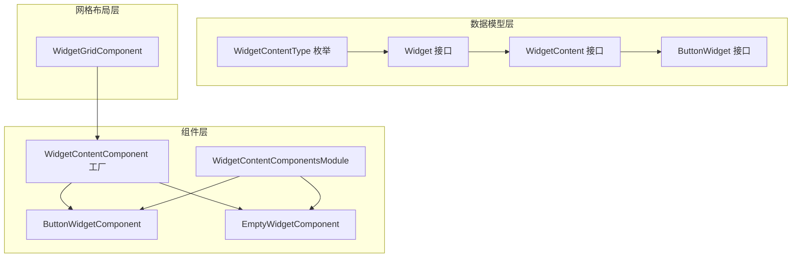
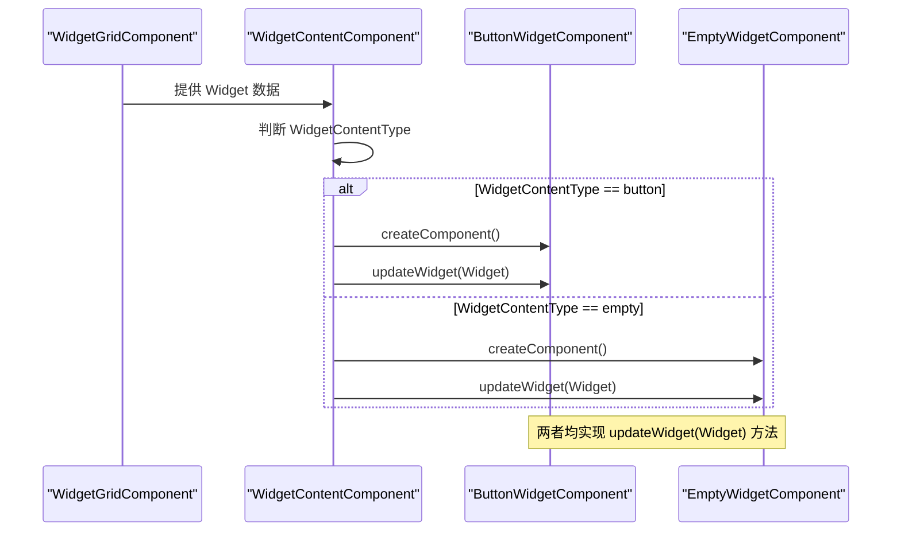
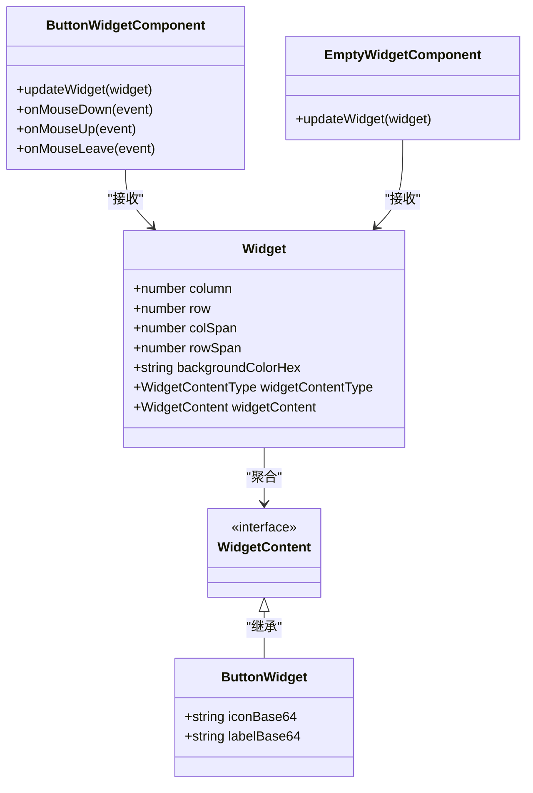
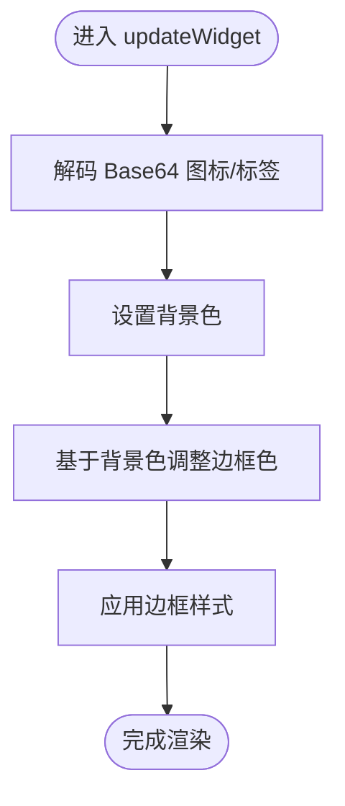
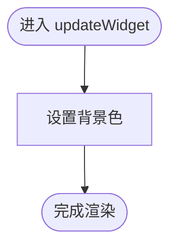
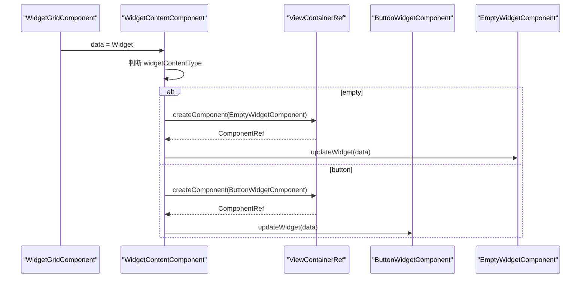
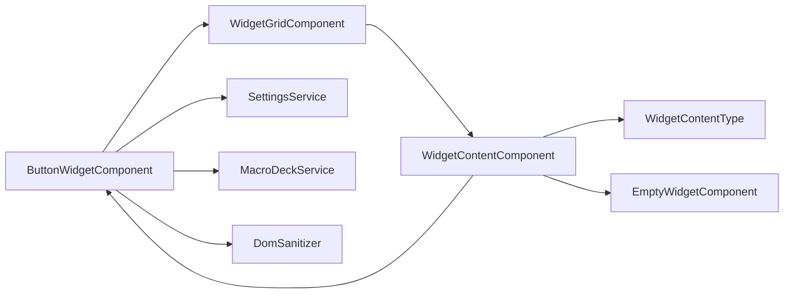

# 组件继承与抽象

<cite>
**本文档引用的文件**
- [widget.ts](file://src/app/datatypes/widgets/widget.ts)
- [widget-content.ts](file://src/app/datatypes/widgets/widget-content.ts)
- [button-widget.ts](file://src/app/datatypes/widgets/button-widget.ts)
- [widget-content-type.ts](file://src/app/enums/widget-content-type.ts)
- [widget-interaction-type.ts](file://src/app/enums/widget-interaction-type.ts)
- [button-widget.component.ts](file://src/app/widget-content-components/button-widget/button-widget.component.ts)
- [empty-widget.component.ts](file://src/app/widget-content-components/empty-widget/empty-widget.component.ts)
- [widget-content-components.module.ts](file://src/app/widget-content-components/widget-content-components.module.ts)
- [widget-grid.component.ts](file://src/app/pages/deck/widget-grid/widget-grid.component.ts)
- [widget-content.component.ts](file://src/app/pages/deck/widget-grid/widget-content/widget-content.component.ts)
- [button-widget-border-style.ts](file://src/app/widget-content-components/button-widget/button-widget-border-style.ts)
</cite>

## 目录
1. [简介](#简介)
2. [项目结构](#项目结构)
3. [核心组件](#核心组件)
4. [架构总览](#架构总览)
5. [详细组件分析](#详细组件分析)
6. [依赖分析](#依赖分析)
7. [性能考虑](#性能考虑)
8. [故障排除指南](#故障排除指南)
9. [结论](#结论)
10. [附录](#附录)

## 简介
本文件聚焦于Macro-Deck-Client-App的组件继承与抽象设计，围绕ButtonWidgetComponent与EmptyWidgetComponent展开，系统阐述：
- 基类组件的设计模式与抽象接口
- 通过继承实现的代码复用与行为统一
- 组件接口的定义与实现差异
- 组件工厂模式的应用与动态创建机制
- 抽象设计最佳实践与继承层次优化建议

## 项目结构
该项目采用Angular单页应用架构，微件系统由“数据模型层”“组件层”“网格布局层”三层构成：
- 数据模型层：定义Widget、WidgetContent及具体子类型（如ButtonWidget），以及内容类型枚举
- 组件层：包含具体的微件组件（按钮、空白）与内容组件工厂
- 网格布局层：负责微件布局、尺寸计算与动态内容渲染

图表来源
- [widget.ts:1-33](file://src/app/datatypes/widgets/widget.ts#L1-L33)
- [widget-content.ts:1-6](file://src/app/datatypes/widgets/widget-content.ts#L1-L6)
- [button-widget.ts:1-16](file://src/app/datatypes/widgets/button-widget.ts#L1-L16)
- [widget-content-type.ts:1-12](file://src/app/enums/widget-content-type.ts#L1-L12)
- [widget-content.component.ts:1-152](file://src/app/pages/deck/widget-grid/widget-content/widget-content.component.ts#L1-L152)
- [button-widget.component.ts:1-393](file://src/app/widget-content-components/button-widget/button-widget.component.ts#L1-L393)
- [empty-widget.component.ts:1-57](file://src/app/widget-content-components/empty-widget/empty-widget.component.ts#L1-L57)
- [widget-content-components.module.ts:1-42](file://src/app/widget-content-components/widget-content-components.module.ts#L1-L42)
- [widget-grid.component.ts:1-335](file://src/app/pages/deck/widget-grid/widget-grid.component.ts#L1-L335)

章节来源
- [widget.ts:1-33](file://src/app/datatypes/widgets/widget.ts#L1-L33)
- [widget-content.ts:1-6](file://src/app/datatypes/widgets/widget-content.ts#L1-L6)
- [button-widget.ts:1-16](file://src/app/datatypes/widgets/button-widget.ts#L1-L16)
- [widget-content-type.ts:1-12](file://src/app/enums/widget-content-type.ts#L1-L12)
- [widget-grid.component.ts:1-335](file://src/app/pages/deck/widget-grid/widget-grid.component.ts#L1-L335)

## 核心组件
本节从抽象到具体梳理组件体系：
- 抽象接口与基类
  - WidgetContent：微件内容的基础接口，作为所有具体内容类型的父接口
  - Widget：描述微件的几何信息、外观与内容类型
  - ButtonWidget：继承WidgetContent，扩展图标与标签的Base64内容
- 具体组件
  - ButtonWidgetComponent：实现按钮微件的渲染与交互逻辑
  - EmptyWidgetComponent：实现空白占位微件的渲染
- 工厂组件
  - WidgetContentComponent：根据WidgetContentType动态创建并注入对应组件实例

章节来源
- [widget-content.ts:1-6](file://src/app/datatypes/widgets/widget-content.ts#L1-L6)
- [widget.ts:1-33](file://src/app/datatypes/widgets/widget.ts#L1-L33)
- [button-widget.ts:1-16](file://src/app/datatypes/widgets/button-widget.ts#L1-L16)
- [button-widget.component.ts:1-393](file://src/app/widget-content-components/button-widget/button-widget.component.ts#L1-L393)
- [empty-widget.component.ts:1-57](file://src/app/widget-content-components/empty-widget/empty-widget.component.ts#L1-L57)
- [widget-content.component.ts:1-152](file://src/app/pages/deck/widget-grid/widget-content/widget-content.component.ts#L1-L152)

## 架构总览
下图展示了微件系统的整体交互流程：WidgetGridComponent负责布局与数据提供，WidgetContentComponent作为工厂动态选择并渲染具体组件，ButtonWidgetComponent与EmptyWidgetComponent分别实现各自的渲染与交互。

图表来源
- [widget-grid.component.ts:166-190](file://src/app/pages/deck/widget-grid/widget-grid.component.ts#L166-L190)
- [widget-content.component.ts:45-79](file://src/app/pages/deck/widget-grid/widget-content/widget-content.component.ts#L45-L79)
- [button-widget.component.ts:293-306](file://src/app/widget-content-components/button-widget/button-widget.component.ts#L293-L306)
- [empty-widget.component.ts:26-28](file://src/app/widget-content-components/empty-widget/empty-widget.component.ts#L26-L28)

## 详细组件分析

### 抽象接口与继承关系
- WidgetContent为所有微件内容的抽象基类，ButtonWidget继承该接口，扩展了图标与标签的Base64字段
- Widget聚合了WidgetContent与WidgetContentType，形成“位置+尺寸+外观+内容”的完整描述
- ButtonWidgetComponent与EmptyWidgetComponent均通过updateWidget方法接收Widget参数，实现对同一数据结构的差异化渲染

图表来源
- [widget-content.ts:1-6](file://src/app/datatypes/widgets/widget-content.ts#L1-L6)
- [widget.ts:1-33](file://src/app/datatypes/widgets/widget.ts#L1-L33)
- [button-widget.ts:1-16](file://src/app/datatypes/widgets/button-widget.ts#L1-L16)
- [button-widget.component.ts:293-306](file://src/app/widget-content-components/button-widget/button-widget.component.ts#L293-L306)
- [empty-widget.component.ts:26-28](file://src/app/widget-content-components/empty-widget/empty-widget.component.ts#L26-L28)

章节来源
- [widget-content.ts:1-6](file://src/app/datatypes/widgets/widget-content.ts#L1-L6)
- [widget.ts:1-33](file://src/app/datatypes/widgets/widget.ts#L1-L33)
- [button-widget.ts:1-16](file://src/app/datatypes/widgets/button-widget.ts#L1-L16)

### ButtonWidgetComponent：继承与行为统一
- 继承与职责
  - 实现交互事件处理：按下、短按释放、长按、长按释放
  - 实现渲染更新：解码Base64图标/标签、设置背景色与边框样式
  - 通过订阅WidgetGridComponent.updated与SettingsModalComponent.settingsApplied实现响应式更新
- 行为统一
  - 所有微件组件均实现updateWidget(Widget)，保证调用一致性
  - 通过宏服务发出交互事件，统一上报至上层

图表来源
- [button-widget.component.ts:88-103](file://src/app/widget-content-components/button-widget/button-widget.component.ts#L88-L103)

章节来源
- [button-widget.component.ts:14-227](file://src/app/widget-content-components/button-widget/button-widget.component.ts#L14-L227)
- [button-widget-border-style.ts:1-12](file://src/app/widget-content-components/button-widget/button-widget-border-style.ts#L1-L12)

### EmptyWidgetComponent：占位与最小化实现
- 职责
  - 仅设置背景色，不涉及复杂交互
  - 通过updateWidget接收Widget并应用样式
- 设计意义
  - 作为“空白占位”，体现抽象接口的最小实现，便于网格布局占位与统一渲染

图表来源
- [empty-widget.component.ts:26-28](file://src/app/widget-content-components/empty-widget/empty-widget.component.ts#L26-L28)

章节来源
- [empty-widget.component.ts:1-57](file://src/app/widget-content-components/empty-widget/empty-widget.component.ts#L1-L57)

### 组件工厂模式：WidgetContentComponent
- 工厂职责
  - 根据Widget.widgetContentType动态创建并注入对应组件
  - 在内容类型变化时销毁旧组件并重建，避免状态污染
- 动态创建流程
  - 输入数据变化 -> 判断类型 -> createComponent -> 调用实例updateWidget
- 与网格布局的协作
  - WidgetGridComponent提供Widget数据与布局样式，WidgetContentComponent负责内容渲染

图表来源
- [widget-content.component.ts:45-79](file://src/app/pages/deck/widget-grid/widget-content/widget-content.component.ts#L45-L79)
- [widget-content-type.ts:1-12](file://src/app/enums/widget-content-type.ts#L1-L12)

章节来源
- [widget-content.component.ts:1-152](file://src/app/pages/deck/widget-grid/widget-content/widget-content.component.ts#L1-L152)
- [widget-grid.component.ts:166-190](file://src/app/pages/deck/widget-grid/widget-grid.component.ts#L166-L190)

### 组件接口定义与差异化处理
- 共同特征
  - 所有微件组件均实现updateWidget(Widget)，保证统一的数据入口
  - 通过Widget.contentType区分渲染策略
- 差异化处理
  - ButtonWidgetComponent：处理交互事件、解码Base64、生成边框样式
  - EmptyWidgetComponent：仅设置背景色，简化渲染路径
- 交互事件
  - 通过宏服务统一上报交互事件，事件类型由WidgetInteractionType定义

章节来源
- [widget-interaction-type.ts:1-18](file://src/app/enums/widget-interaction-type.ts#L1-L18)
- [button-widget.component.ts:218-226](file://src/app/widget-content-components/button-widget/button-widget.component.ts#L218-L226)

## 依赖分析
- 组件耦合
  - ButtonWidgetComponent依赖WidgetGridComponent.updated、SettingsService、MacroDeckService、DomSanitizer等
  - WidgetContentComponent依赖WidgetContentType进行分支创建
- 外部依赖
  - Angular核心模块（Component、ViewContainerRef、Input等）
  - 自定义服务与枚举（WidgetContentType、WidgetInteractionType）

图表来源
- [button-widget.component.ts:14-53](file://src/app/widget-content-components/button-widget/button-widget.component.ts#L14-L53)
- [widget-content.component.ts:16-38](file://src/app/pages/deck/widget-grid/widget-content/widget-content.component.ts#L16-L38)
- [widget-grid.component.ts:38-86](file://src/app/pages/deck/widget-grid/widget-grid.component.ts#L38-L86)

章节来源
- [button-widget.component.ts:14-53](file://src/app/widget-content-components/button-widget/button-widget.component.ts#L14-L53)
- [widget-content.component.ts:16-38](file://src/app/pages/deck/widget-grid/widget-content/widget-content.component.ts#L16-L38)
- [widget-grid.component.ts:38-86](file://src/app/pages/deck/widget-grid/widget-grid.component.ts#L38-L86)

## 性能考虑
- 动态组件创建
  - 仅在内容类型变化时重建组件，避免频繁创建带来的开销
- 渲染更新
  - 通过订阅网格更新事件与设置变更事件，减少不必要的重绘
- 样式计算
  - 边框样式与颜色调整在updateWidget中集中处理，避免重复计算
- 建议
  - 对高频交互事件（如鼠标移动）可考虑节流/防抖
  - 对Base64解码可在后台线程执行，避免阻塞UI

## 故障排除指南
- 空白微件未显示
  - 检查Widget.widgetContentType是否正确设置为empty
  - 确认WidgetGridComponent.getWidgetFromIndex返回的默认空白微件
- 按钮微件无交互
  - 确认ButtonWidgetComponent已订阅WidgetGridComponent.updated与SettingsModalComponent.settingsApplied
  - 检查MacroDeckService.interaction事件是否被正确监听
- 边框样式异常
  - 检查SettingsService返回的边框样式与ButtonWidgetBorderStyle枚举
  - 确认adjustColor函数对backgroundColorHex的处理

章节来源
- [widget-grid.component.ts:172-190](file://src/app/pages/deck/widget-grid/widget-grid.component.ts#L172-L190)
- [button-widget.component.ts:59-72](file://src/app/widget-content-components/button-widget/button-widget.component.ts#L59-L72)
- [button-widget.component.ts:109-124](file://src/app/widget-content-components/button-widget/button-widget.component.ts#L109-L124)

## 结论
本设计通过抽象接口与继承实现了“统一入口、差异化实现”的组件体系：
- 抽象接口（WidgetContent、Widget）定义了通用契约
- 具体组件（ButtonWidgetComponent、EmptyWidgetComponent）实现差异化渲染与交互
- 工厂组件（WidgetContentComponent）承担动态创建与注入职责
- 通过工厂模式与统一数据结构，系统具备良好的扩展性与维护性

## 附录

### 组件抽象设计最佳实践
- 接口设计原则
  - 单一职责：每个接口只描述一类能力（如渲染、交互）
  - 最小暴露：仅暴露必要的公共方法（如updateWidget）
  - 明确契约：通过枚举（WidgetContentType、WidgetInteractionType）约束行为
- 继承层次优化建议
  - 保持抽象接口稳定，具体组件通过组合而非深度继承扩展功能
  - 将可变因素（样式、交互）下沉到服务或工具函数，降低组件复杂度
- 工厂模式应用要点
  - 仅在必要时重建组件，避免频繁销毁/创建
  - 通过输入属性的setter实现响应式更新，减少样板代码