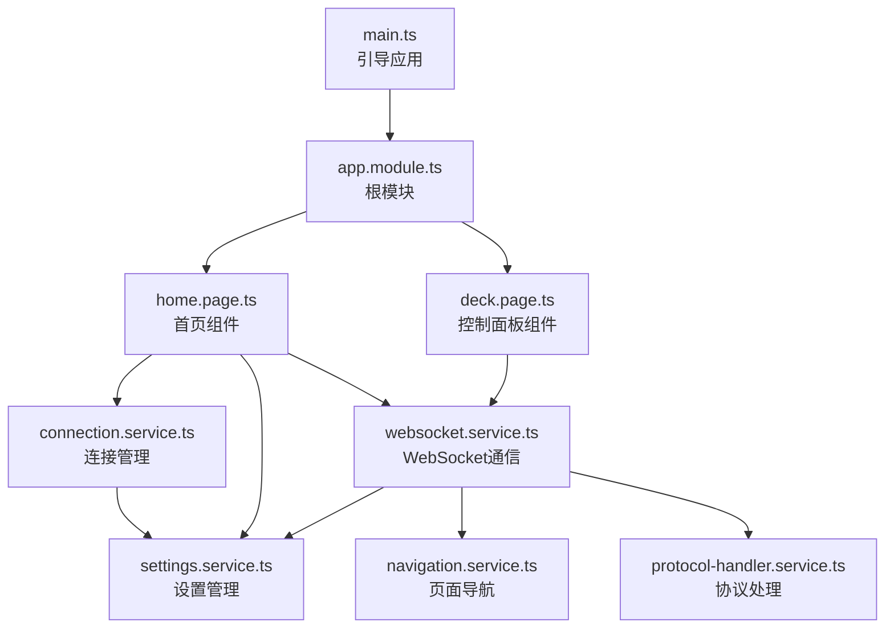
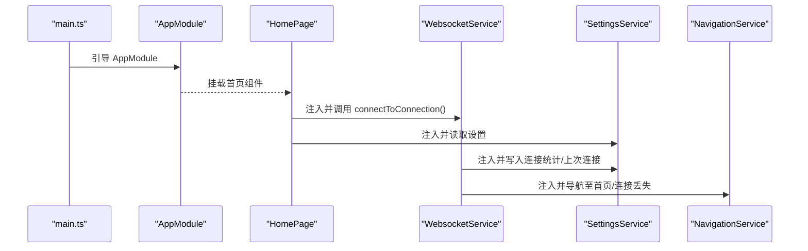
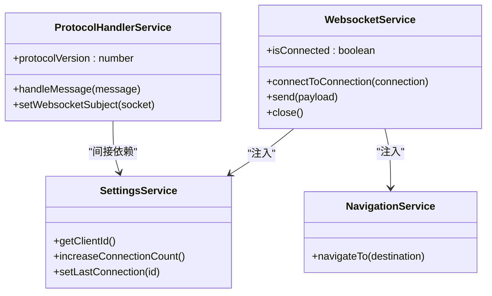
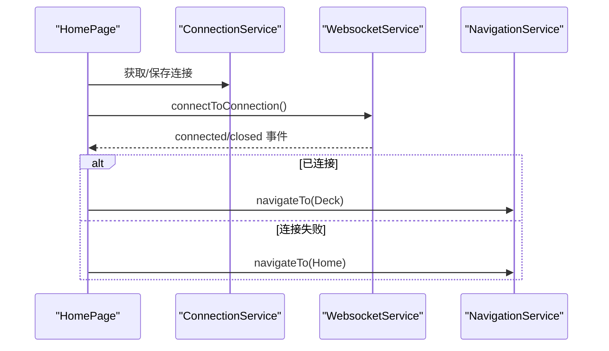
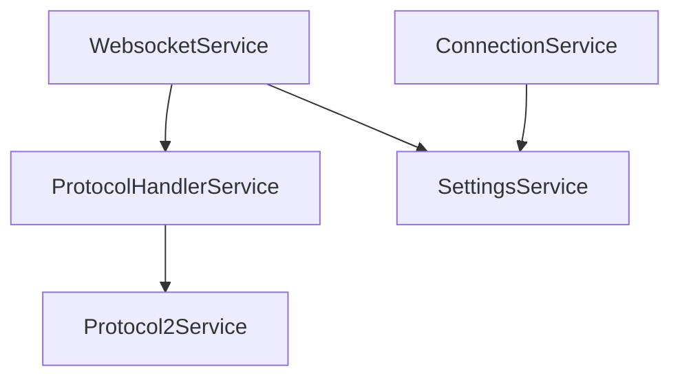
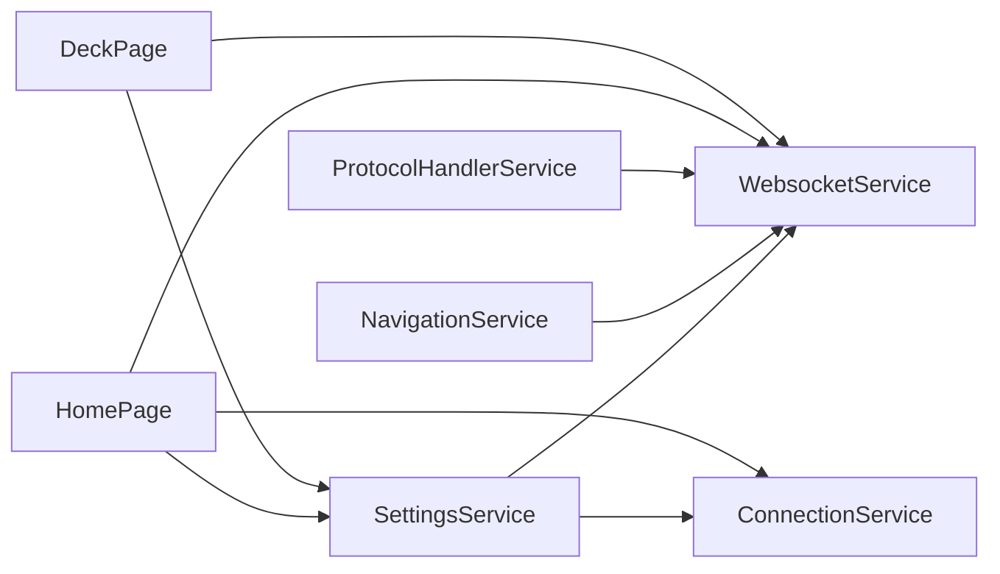

# 依赖注入模式

<cite>
**本文档引用的文件**
- [src/app/app.module.ts](file://src/app/app.module.ts)
- [src/main.ts](file://src/main.ts)
- [src/app/services/connection/connection.service.ts](file://src/app/services/connection/connection.service.ts)
- [src/app/services/settings/settings.service.ts](file://src/app/services/settings/settings.service.ts)
- [src/app/services/websocket/websocket.service.ts](file://src/app/services/websocket/websocket.service.ts)
- [src/app/services/macro-deck/macro-deck.service.ts](file://src/app/services/macro-deck/macro-deck.service.ts)
- [src/app/services/navigation/navigation.service.ts](file://src/app/services/navigation/navigation.service.ts)
- [src/app/services/current-platform/current-platform.service.ts](file://src/app/services/current-platform/current-platform.service.ts)
- [src/app/services/protocol/protocol-handler.service.ts](file://src/app/services/protocol/protocol-handler.service.ts)
- [src/app/pages/home/home.page.ts](file://src/app/pages/home/home.page.ts)
- [src/app/pages/deck/deck.page.ts](file://src/app/pages/deck/deck.page.ts)
- [src/environments/environment.ts](file://src/environments/environment.ts)
- [src/environments/environment.web.ts](file://src/environments/environment.web.ts)
- [package.json](file://package.json)
</cite>

## 目录
1. [简介](#简介)
2. [项目结构](#项目结构)
3. [核心组件](#核心组件)
4. [架构总览](#架构总览)
5. [详细组件分析](#详细组件分析)
6. [依赖关系分析](#依赖关系分析)
7. [性能考量](#性能考量)
8. [故障排查指南](#故障排查指南)
9. [结论](#结论)
10. [附录](#附录)

## 简介
本文件系统性梳理 Macro-Deck-Client-App 中的依赖注入（DI）模式应用，围绕 Angular 依赖注入容器的工作原理展开，结合项目实际代码，解释@Injectable装饰器的使用、构造函数注入与可选依赖、单例模式与生命周期、服务间依赖关系管理、以及在组件与服务中的典型实践。同时给出避免循环依赖与延迟注入的策略建议，并提供可视化图示帮助理解。

## 项目结构
项目采用 Angular + Ionic 架构，入口为 main.ts 引导 AppModule，AppModule 统一导入页面模块与第三方模块；业务服务均以@Injectable({ providedIn: 'root' })声明为根级单例，供全局任意组件按需注入。

图表来源
- [src/main.ts:1-27](file://src/main.ts#L1-L27)
- [src/app/app.module.ts:1-87](file://src/app/app.module.ts#L1-L87)
- [src/app/pages/home/home.page.ts:1-551](file://src/app/pages/home/home.page.ts#L1-L551)
- [src/app/pages/deck/deck.page.ts:1-158](file://src/app/pages/deck/deck.page.ts#L1-L158)
- [src/app/services/connection/connection.service.ts:1-179](file://src/app/services/connection/connection.service.ts#L1-L179)
- [src/app/services/settings/settings.service.ts:1-389](file://src/app/services/settings/settings.service.ts#L1-L389)
- [src/app/services/websocket/websocket.service.ts:1-402](file://src/app/services/websocket/websocket.service.ts#L1-L402)
- [src/app/services/navigation/navigation.service.ts:1-86](file://src/app/services/navigation/navigation.service.ts#L1-L86)
- [src/app/services/protocol/protocol-handler.service.ts:1-65](file://src/app/services/protocol/protocol-handler.service.ts#L1-L65)

章节来源
- [src/main.ts:1-27](file://src/main.ts#L1-L27)
- [src/app/app.module.ts:1-87](file://src/app/app.module.ts#L1-L87)

## 核心组件
- 根模块与引导
  - main.ts 通过 platformBrowserDynamic.bootstrapModule(AppModule) 启动应用。
  - AppModule 导入页面模块与第三方库，providers 留空，服务统一在各服务类上使用 providedIn: 'root' 声明为根级单例。
- 环境配置
  - environment.ts 与 environment.web.ts 提供 webVersion 标识，影响导航与页面选择。
- 服务层
  - SettingsService、ConnectionService、WebsocketService、NavigationService、ProtocolHandlerService 等均以@Injectable({ providedIn: 'root' })声明，天然单例，跨组件共享状态与行为。
- 组件层
  - HomePage、DeckPage 通过构造函数注入所需服务，形成清晰的依赖契约。

章节来源
- [src/main.ts:1-27](file://src/main.ts#L1-L27)
- [src/app/app.module.ts:1-87](file://src/app/app.module.ts#L1-L87)
- [src/environments/environment.ts:1-36](file://src/environments/environment.ts#L1-L36)
- [src/environments/environment.web.ts:1-15](file://src/environments/environment.web.ts#L1-L15)

## 架构总览
下图展示应用启动、服务单例化与组件消费的关键流程：

图表来源
- [src/main.ts:13-14](file://src/main.ts#L13-L14)
- [src/app/app.module.ts:19-42](file://src/app/app.module.ts#L19-L42)
- [src/app/pages/home/home.page.ts:56-64](file://src/app/pages/home/home.page.ts#L56-L64)
- [src/app/services/websocket/websocket.service.ts:51-57](file://src/app/services/websocket/websocket.service.ts#L51-L57)
- [src/app/services/settings/settings.service.ts:29](file://src/app/services/settings/settings.service.ts#L29)
- [src/app/services/navigation/navigation.service.ts:29-46](file://src/app/services/navigation/navigation.service.ts#L29-L46)

## 详细组件分析

### 服务单例与@Injectable 装饰器
- providedIn: 'root'
  - SettingsService、ConnectionService、WebsocketService、NavigationService、ProtocolHandlerService、MacroDeckService、CurrentPlatformService 等均使用该选项，确保服务在应用根注入器中创建一次，随后通过 DI 容器全局复用。
  - 优势：无需在模块 providers 中重复声明；天然支持 Tree-shaking；便于测试替换。
- 生命周期
  - 根级单例随应用启动创建，直到应用销毁才释放；适合需要跨组件共享状态的服务（如设置、连接、导航）。
- 最佳实践
  - 将纯逻辑与状态服务设为单例；避免在组件中手动实例化同质服务。
  - 对于需要多实例的场景，可在模块 providers 中定义或按需在组件中创建（不推荐跨组件共享）。

章节来源
- [src/app/services/settings/settings.service.ts:23-25](file://src/app/services/settings/settings.service.ts#L23-L25)
- [src/app/services/connection/connection.service.ts:7-9](file://src/app/services/connection/connection.service.ts#L7-L9)
- [src/app/services/websocket/websocket.service.ts:17-19](file://src/app/services/websocket/websocket.service.ts#L17-L19)
- [src/app/services/navigation/navigation.service.ts:10-12](file://src/app/services/navigation/navigation.service.ts#L10-L12)
- [src/app/services/protocol/protocol-handler.service.ts:6-8](file://src/app/services/protocol/protocol-handler.service.ts#L6-L8)
- [src/app/services/macro-deck/macro-deck.service.ts:7-9](file://src/app/services/macro-deck/macro-deck.service.ts#L7-L9)
- [src/app/services/current-platform/current-platform.service.ts:5-7](file://src/app/services/current-platform/current-platform.service.ts#L5-L7)

### 构造函数注入与服务间依赖
- WebsocketService 依赖 LoadingService、ModalController、SettingsService、ProtocolHandlerService、NavigationService
  - 体现“高内聚、低耦合”：WebSocket 专注于通信，其他职责委托给对应服务。
  - 通过构造函数注入，组件与服务在编译期即明确依赖关系，利于测试与维护。
- HomePage 依赖 SettingsService、ConnectionService、WebsocketService、WakelockService、PingService 等
  - 组件只关心自身视图逻辑，业务能力由注入的服务承担。
- ProtocolHandlerService 依赖 Protocol2Service
  - 通过协议版本分发消息，保持扩展性与可测试性。

图表来源
- [src/app/services/websocket/websocket.service.ts:51-57](file://src/app/services/websocket/websocket.service.ts#L51-L57)
- [src/app/services/settings/settings.service.ts:29](file://src/app/services/settings/settings.service.ts#L29)
- [src/app/services/navigation/navigation.service.ts:29-46](file://src/app/services/navigation/navigation.service.ts#L29-L46)
- [src/app/services/protocol/protocol-handler.service.ts:14](file://src/app/services/protocol/protocol-handler.service.ts#L14)

章节来源
- [src/app/services/websocket/websocket.service.ts:51-57](file://src/app/services/websocket/websocket.service.ts#L51-L57)
- [src/app/pages/home/home.page.ts:56-64](file://src/app/pages/home/home.page.ts#L56-L64)

### 可选依赖注入与延迟注入
- 可选依赖
  - Angular 支持使用 @Optional() 与 @Self()/@SkipSelf() 等修饰符，但项目中未见显式使用。若未来引入可选依赖（如某些平台特性），可参考官方文档实践。
- 延迟注入（Forward References）
  - 项目中服务均在各自文件内声明，未出现循环依赖；若后续出现 A 依赖 B、B 又依赖 A 的情形，可采用延迟类型引用或在构造函数中使用工厂方式注入。
- 现状评估
  - 当前服务边界清晰，未见明显循环依赖迹象；建议在新增服务时保持单一职责，避免相互直接依赖。

章节来源
- [src/app/services/connection/connection.service.ts:15-16](file://src/app/services/connection/connection.service.ts#L15-L16)
- [src/app/services/websocket/websocket.service.ts:51-57](file://src/app/services/websocket/websocket.service.ts#L51-L57)

### 单例模式与生命周期管理
- 单例实现
  - 通过 providedIn: 'root' 实现根级单例；服务实例在应用启动时创建，贯穿应用生命周期。
- 生命周期钩子
  - 组件层面使用 ngOnInit、ionViewDidEnter、ionViewWillLeave 等生命周期钩子管理订阅与资源释放；服务层面通过内部状态与事件流（如 WebsocketService 的订阅）管理资源。
- 资源清理
  - WebsocketService 在连接关闭时取消订阅、释放资源；HomePage/DeckPage 在离开页面时停止 Ping 检测与取消订阅，避免内存泄漏。

章节来源
- [src/app/services/websocket/websocket.service.ts:332-360](file://src/app/services/websocket/websocket.service.ts#L332-L360)
- [src/app/pages/home/home.page.ts:80-83](file://src/app/pages/home/home.page.ts#L80-L83)
- [src/app/pages/deck/deck.page.ts:122-130](file://src/app/pages/deck/deck.page.ts#L122-L130)

### 依赖注入在组件中的应用示例
- 组件构造函数注入
  - HomePage 注入 SettingsService、ConnectionService、WebsocketService、WakelockService、PingService 等，集中管理连接、设置与交互。
  - DeckPage 注入 WebsocketService、SettingsService、NavigationService，负责面板渲染与导航。
- 事件驱动协作
  - WebsocketService 通过事件发射器（connected、closed、connectionFailed 等）通知组件状态变化，组件据此更新 UI 与行为。
- 环境差异化
  - NavigationService 根据 environment.webVersion 选择不同首页组件类型，体现环境感知下的依赖选择。

图表来源
- [src/app/pages/home/home.page.ts:251-254](file://src/app/pages/home/home.page.ts#L251-L254)
- [src/app/services/websocket/websocket.service.ts:275-288](file://src/app/services/websocket/websocket.service.ts#L275-L288)
- [src/app/services/navigation/navigation.service.ts:29-46](file://src/app/services/navigation/navigation.service.ts#L29-L46)

章节来源
- [src/app/pages/home/home.page.ts:56-64](file://src/app/pages/home/home.page.ts#L56-L64)
- [src/app/pages/deck/deck.page.ts:33-38](file://src/app/pages/deck/deck.page.ts#L33-L38)

### 服务间依赖关系与协议扩展
- 协议处理链路
  - WebsocketService 接收消息后交由 ProtocolHandlerService 分发；当前默认协议版本为 2，后续可扩展更多版本。
- 设置与连接的协同
  - ConnectionService 依赖 SettingsService 读取 USB/SSL 等配置；WebsocketService 写入连接统计与上次连接 ID。

图表来源
- [src/app/services/websocket/websocket.service.ts:115-119](file://src/app/services/websocket/websocket.service.ts#L115-L119)
- [src/app/services/protocol/protocol-handler.service.ts:22-28](file://src/app/services/protocol/protocol-handler.service.ts#L22-L28)
- [src/app/services/connection/connection.service.ts:15-16](file://src/app/services/connection/connection.service.ts#L15-L16)

章节来源
- [src/app/services/protocol/protocol-handler.service.ts:14](file://src/app/services/protocol/protocol-handler.service.ts#L14)
- [src/app/services/websocket/websocket.service.ts:51-57](file://src/app/services/websocket/websocket.service.ts#L51-L57)

## 依赖关系分析
- 模块与组件
  - AppModule 导入页面模块与第三方库，组件通过路由与模板挂载。
- 服务依赖图
  - WebsocketService 是中枢服务，依赖 SettingsService、NavigationService、ProtocolHandlerService；ConnectionService 依赖 SettingsService；HomePage/DeckPage 依赖多个服务。
- 环境差异
  - environment.webVersion 影响页面组件选择与部分行为分支。

图表来源
- [src/app/services/settings/settings.service.ts:29](file://src/app/services/settings/settings.service.ts#L29)
- [src/app/services/connection/connection.service.ts:15-16](file://src/app/services/connection/connection.service.ts#L15-L16)
- [src/app/services/websocket/websocket.service.ts:51-57](file://src/app/services/websocket/websocket.service.ts#L51-L57)
- [src/app/services/navigation/navigation.service.ts:29-46](file://src/app/services/navigation/navigation.service.ts#L29-L46)
- [src/app/services/protocol/protocol-handler.service.ts:14](file://src/app/services/protocol/protocol-handler.service.ts#L14)
- [src/app/pages/home/home.page.ts:56-64](file://src/app/pages/home/home.page.ts#L56-L64)
- [src/app/pages/deck/deck.page.ts:33-38](file://src/app/pages/deck/deck.page.ts#L33-L38)

章节来源
- [src/app/services/navigation/navigation.service.ts:16](file://src/app/services/navigation/navigation.service.ts#L16)
- [src/environments/environment.web.ts:6](file://src/environments/environment.web.ts#L6)

## 性能考量
- 单例服务减少实例化成本，提升响应速度。
- 事件驱动与订阅管理需在组件生命周期中及时取消，避免内存泄漏与重复订阅。
- 环境差异化（web/native）通过环境变量控制，避免不必要的功能分支消耗。
- 建议对高频事件（如消息流）进行节流/去抖处理，降低 UI 渲染压力。

## 故障排查指南
- 连接失败
  - WebsocketService 在 error 回调中处理安全错误（如证书问题），并通过 ModalController 弹窗提示；同时发出 connectionFailed 事件，组件监听后展示错误详情。
- 连接丢失
  - WebsocketService 在连接关闭时区分主动关闭与异常关闭，异常情况下根据 webVersion 或已连接状态决定导航至连接丢失页面或首页。
- 资源清理
  - 组件离开页面时需取消订阅与停止后台任务（如 Ping），避免后台持续占用资源。

章节来源
- [src/app/services/websocket/websocket.service.ts:120-133](file://src/app/services/websocket/websocket.service.ts#L120-L133)
- [src/app/services/websocket/websocket.service.ts:374-393](file://src/app/services/websocket/websocket.service.ts#L374-L393)
- [src/app/pages/home/home.page.ts:80-83](file://src/app/pages/home/home.page.ts#L80-L83)

## 结论
本项目在 Angular 依赖注入框架下，采用@Injectable({ providedIn: 'root' ) 的根级单例模式，结合构造函数注入与事件驱动机制，实现了清晰的服务边界与稳定的组件协作。通过环境变量与导航服务的配合，满足了 Web 与原生双端差异化需求。建议在后续扩展中继续保持单一职责与清晰依赖，避免循环依赖，必要时采用延迟注入与可选依赖策略，确保架构可演进与可维护。

## 附录
- Angular 依赖注入基础
  - DI 容器在应用启动时解析@Injectable 声明，按需创建单例实例；组件与服务通过构造函数声明依赖，编译期即确定依赖关系。
- 最佳实践清单
  - 优先使用 providedIn: 'root' 的根级单例。
  - 保持服务单一职责，避免相互直接依赖。
  - 在组件生命周期中管理订阅与资源，防止内存泄漏。
  - 使用环境变量进行差异化配置，减少条件分支复杂度。
  - 对高频事件进行节流/去抖，优化性能。