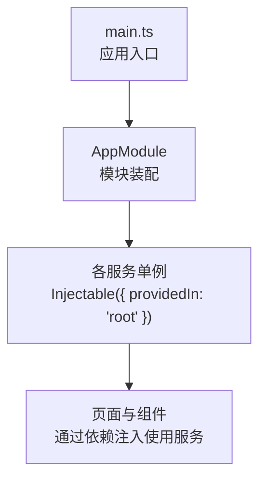
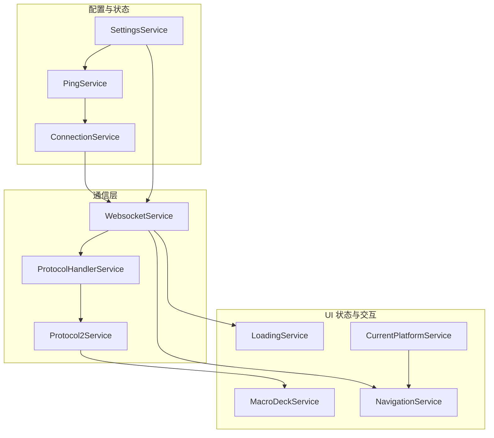
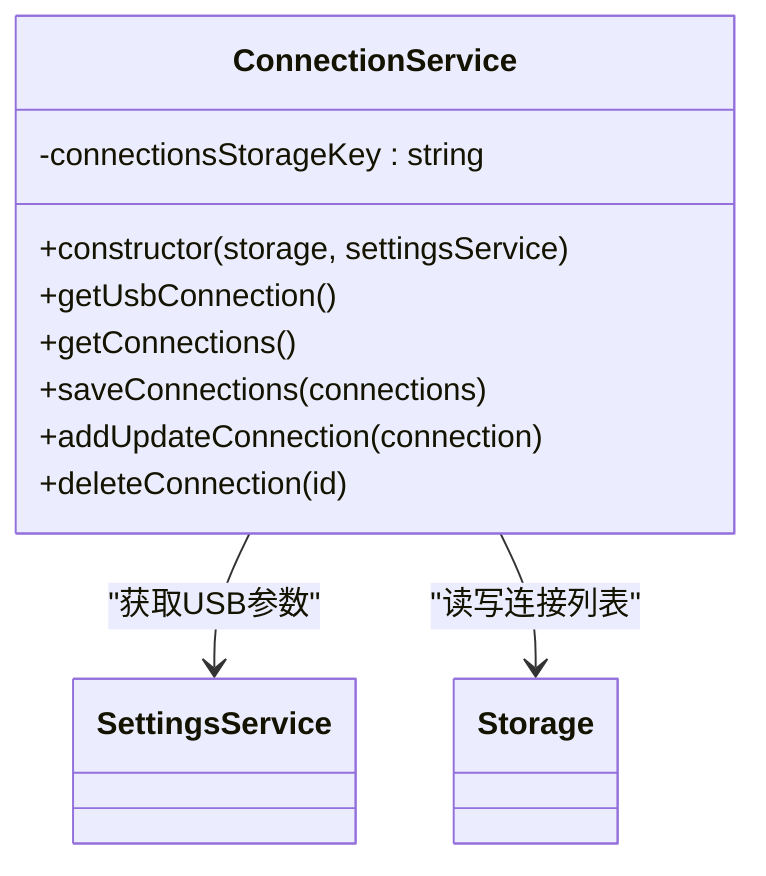
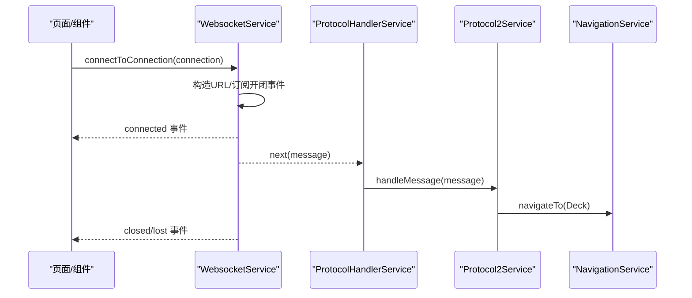
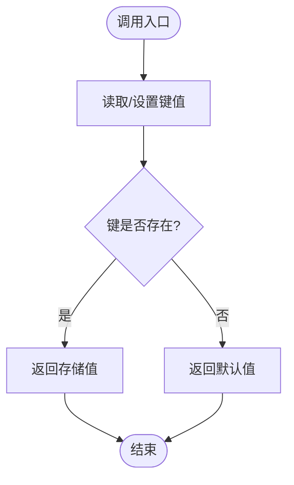
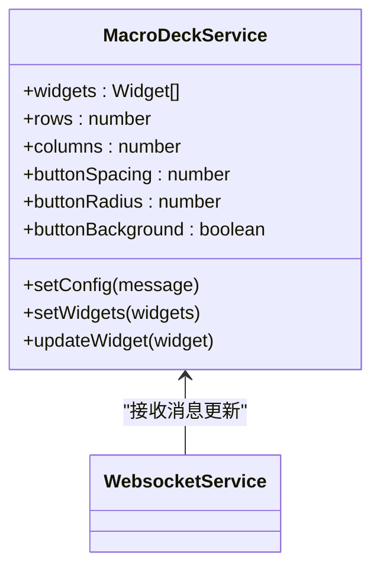
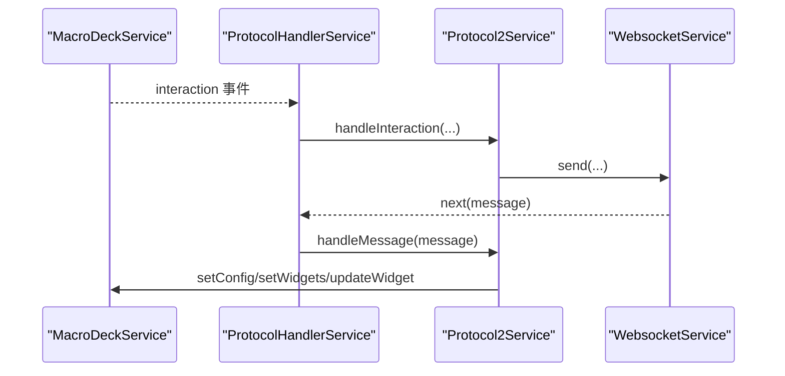
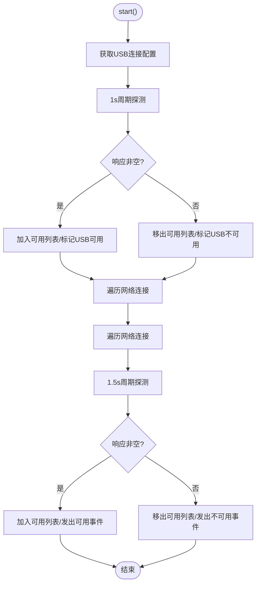
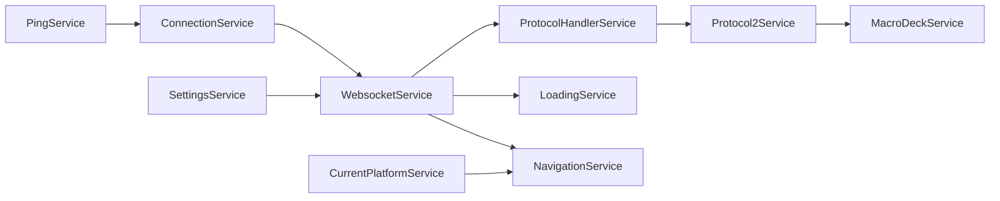

# 单例模式

<cite>
**本文档引用的文件**
- [connection.service.ts](file://src/app/services/connection/connection.service.ts)
- [websocket.service.ts](file://src/app/services/websocket/websocket.service.ts)
- [settings.service.ts](file://src/app/services/settings/settings.service.ts)
- [macro-deck.service.ts](file://src/app/services/macro-deck/macro-deck.service.ts)
- [ping.service.ts](file://src/app/services/ping/ping.service.ts)
- [protocol-handler.service.ts](file://src/app/services/protocol/protocol-handler.service.ts)
- [protocol2.service.ts](file://src/app/services/protocol/protocol2.service.ts)
- [loading.service.ts](file://src/app/services/loading/loading.service.ts)
- [navigation.service.ts](file://src/app/services/navigation/navigation.service.ts)
- [current-platform.service.ts](file://src/app/services/current-platform/current-platform.service.ts)
- [app.module.ts](file://src/app/app.module.ts)
- [main.ts](file://src/main.ts)
- [connection.ts](file://src/app/datatypes/connection.ts)
- [navigation-destination.ts](file://src/app/enums/navigation-destination.ts)
</cite>

## 目录
1. [简介](#简介)
2. [项目结构](#项目结构)
3. [核心组件](#核心组件)
4. [架构总览](#架构总览)
5. [详细组件分析](#详细组件分析)
6. [依赖分析](#依赖分析)
7. [性能考虑](#性能考虑)
8. [故障排查指南](#故障排查指南)
9. [结论](#结论)
10. [附录](#附录)

## 简介
本文件系统性阐述 Macro-Deck-Client-App 在 Angular 中通过@Injectable({ providedIn: 'root' })实现的全局单例服务，以及这些服务在整个应用生命周期中的实例化与管理机制。重点覆盖 ConnectionService、WebsocketService、SettingsService 等核心服务，并说明单例模式在状态共享与资源共享方面的优势，最后给出服务层设计的最佳实践与注意事项。

## 项目结构
应用采用 Angular + Ionic 结构，服务层位于 src/app/services 下，均以根注入方式声明为单例。应用入口在 main.ts 引导 AppModule，在 AppModule 中完成模块装配与服务依赖注入容器的初始化。

图表来源
- [main.ts:1-27](file://src/main.ts#L1-L27)
- [app.module.ts:1-87](file://src/app/app.module.ts#L1-L87)

章节来源
- [main.ts:1-27](file://src/main.ts#L1-L27)
- [app.module.ts:1-87](file://src/app/app.module.ts#L1-L87)

## 核心组件
以下服务均通过@Injectable({ providedIn: 'root' })声明为全局单例，贯穿应用生命周期，确保跨模块、跨组件的状态一致性与资源复用：

- SettingsService：应用设置与配置的持久化存取，包括外观、屏幕方向、USB 连接参数、客户端 ID、连接计数等。
- ConnectionService：连接配置的增删改查与持久化，支持 USB 与网络连接。
- WebsocketService：WebSocket 连接管理、消息收发、连接状态事件与错误处理。
- MacroDeckService：控制面板配置与微件数据状态的集中管理。
- ProtocolHandlerService 与 Protocol2Service：协议版本分发与消息处理，负责将服务器消息映射为内部模型并驱动 UI 更新。
- PingService：定期探测服务器可用性，维护可用连接集合。
- LoadingService：统一的加载弹窗管理，屏蔽多处重复逻辑。
- NavigationService：页面导航封装，区分 Web 与原生版本。
- CurrentPlatformService：平台检测，辅助功能分支。

章节来源
- [settings.service.ts:1-389](file://src/app/services/settings/settings.service.ts#L1-L389)
- [connection.service.ts:1-179](file://src/app/services/connection/connection.service.ts#L1-L179)
- [websocket.service.ts:1-402](file://src/app/services/websocket/websocket.service.ts#L1-L402)
- [macro-deck.service.ts:1-111](file://src/app/services/macro-deck/macro-deck.service.ts#L1-L111)
- [protocol-handler.service.ts:1-65](file://src/app/services/protocol/protocol-handler.service.ts#L1-L65)
- [protocol2.service.ts:1-296](file://src/app/services/protocol/protocol2.service.ts#L1-L296)
- [ping.service.ts:1-228](file://src/app/services/ping/ping.service.ts#L1-L228)
- [loading.service.ts:1-87](file://src/app/services/loading/loading.service.ts#L1-L87)
- [navigation.service.ts:1-86](file://src/app/services/navigation/navigation.service.ts#L1-L86)
- [current-platform.service.ts:1-77](file://src/app/services/current-platform/current-platform.service.ts#L1-L77)

## 架构总览
下图展示单例服务之间的协作关系与数据流向。SettingsService 提供配置与状态；ConnectionService 管理连接配置；WebsocketService 负责实时通信；ProtocolHandlerService/Protocol2Service 负责协议解析与 UI 状态同步；MacroDeckService 作为状态中枢；PingService 提供可用性探测；LoadingService/NavigationService 提供交互体验与导航。

图表来源
- [settings.service.ts:1-389](file://src/app/services/settings/settings.service.ts#L1-L389)
- [connection.service.ts:1-179](file://src/app/services/connection/connection.service.ts#L1-L179)
- [websocket.service.ts:1-402](file://src/app/services/websocket/websocket.service.ts#L1-L402)
- [protocol-handler.service.ts:1-65](file://src/app/services/protocol/protocol-handler.service.ts#L1-L65)
- [protocol2.service.ts:1-296](file://src/app/services/protocol/protocol2.service.ts#L1-L296)
- [macro-deck.service.ts:1-111](file://src/app/services/macro-deck/macro-deck.service.ts#L1-L111)
- [ping.service.ts:1-228](file://src/app/services/ping/ping.service.ts#L1-L228)
- [loading.service.ts:1-87](file://src/app/services/loading/loading.service.ts#L1-L87)
- [navigation.service.ts:1-86](file://src/app/services/navigation/navigation.service.ts#L1-L86)
- [current-platform.service.ts:1-77](file://src/app/services/current-platform/current-platform.service.ts#L1-L77)

## 详细组件分析

### ConnectionService（连接配置单例）
- 角色定位：负责连接配置的持久化与 CRUD，提供 USB 连接快捷配置。
- 单例特性：通过@Injectable({ providedIn: 'root' })确保全局唯一实例。
- 数据持久化：使用 Ionic Storage 存储连接列表，键名为 connections。
- 依赖关系：依赖 SettingsService 提供 USB 参数，依赖 Storage 进行本地持久化。
- 生命周期：随应用启动即初始化，贯穿整个应用生命周期。

图表来源
- [connection.service.ts:1-179](file://src/app/services/connection/connection.service.ts#L1-L179)
- [settings.service.ts:1-389](file://src/app/services/settings/settings.service.ts#L1-L389)

章节来源
- [connection.service.ts:1-179](file://src/app/services/connection/connection.service.ts#L1-L179)

### WebsocketService（WebSocket 单例）
- 角色定位：管理 WebSocket 连接、消息订阅、连接事件与错误处理。
- 单例特性：全局单例，保证连接状态与消息流的唯一性。
- 关键行为：构建连接地址、订阅连接开闭事件、转发消息至协议处理器、处理安全错误弹窗。
- 依赖关系：依赖 LoadingService 显示/关闭加载弹窗，依赖 ModalController 显示不安全连接提示，依赖 SettingsService 更新连接统计与客户端 ID，依赖 ProtocolHandlerService 分发消息，依赖 NavigationService 导航。

图表来源
- [websocket.service.ts:1-402](file://src/app/services/websocket/websocket.service.ts#L1-L402)
- [protocol-handler.service.ts:1-65](file://src/app/services/protocol/protocol-handler.service.ts#L1-L65)
- [protocol2.service.ts:1-296](file://src/app/services/protocol/protocol2.service.ts#L1-L296)
- [navigation.service.ts:1-86](file://src/app/services/navigation/navigation.service.ts#L1-L86)

章节来源
- [websocket.service.ts:1-402](file://src/app/services/websocket/websocket.service.ts#L1-L402)

### SettingsService（设置与状态单例）
- 角色定位：应用设置的持久化存取中心，包括外观、屏幕方向、USB 参数、客户端 ID、连接计数等。
- 单例特性：全局单例，确保设置在各模块间一致。
- 关键行为：生成并缓存客户端 ID；维护连接计数与上次连接；提供各类设置的读写接口。
- 依赖关系：依赖 Storage 进行键值存取。

图表来源
- [settings.service.ts:1-389](file://src/app/services/settings/settings.service.ts#L1-L389)

章节来源
- [settings.service.ts:1-389](file://src/app/services/settings/settings.service.ts#L1-L389)

### MacroDeckService（面板状态单例）
- 角色定位：控制面板配置与微件数据的集中管理，发布配置更新与交互事件。
- 单例特性：全局单例，保证 UI 状态一致性。
- 关键行为：设置面板配置、设置/更新微件列表，触发配置变更事件。

图表来源
- [macro-deck.service.ts:1-111](file://src/app/services/macro-deck/macro-deck.service.ts#L1-L111)
- [websocket.service.ts:1-402](file://src/app/services/websocket/websocket.service.ts#L1-L402)

章节来源
- [macro-deck.service.ts:1-111](file://src/app/services/macro-deck/macro-deck.service.ts#L1-L111)

### 协议栈（ProtocolHandlerService 与 Protocol2Service）
- 角色定位：协议版本分发与消息处理，将服务器消息映射为内部微件模型并驱动 UI 更新。
- 单例特性：全局单例，确保协议处理的一致性。
- 关键行为：订阅 MacroDeckService 的交互事件，转换为协议方法并发送；接收服务器消息后更新 MacroDeckService。

图表来源
- [protocol-handler.service.ts:1-65](file://src/app/services/protocol/protocol-handler.service.ts#L1-L65)
- [protocol2.service.ts:1-296](file://src/app/services/protocol/protocol2.service.ts#L1-L296)
- [macro-deck.service.ts:1-111](file://src/app/services/macro-deck/macro-deck.service.ts#L1-L111)
- [websocket.service.ts:1-402](file://src/app/services/websocket/websocket.service.ts#L1-L402)

章节来源
- [protocol-handler.service.ts:1-65](file://src/app/services/protocol/protocol-handler.service.ts#L1-L65)
- [protocol2.service.ts:1-296](file://src/app/services/protocol/protocol2.service.ts#L1-L296)

### PingService（可用性探测单例）
- 角色定位：定期探测 USB 与网络连接的可用性，维护可用连接集合。
- 单例特性：全局单例，避免重复探测任务。
- 关键行为：周期性发起 HTTP 请求，根据响应更新可用连接列表并发出事件。

图表来源
- [ping.service.ts:1-228](file://src/app/services/ping/ping.service.ts#L1-L228)
- [connection.service.ts:1-179](file://src/app/services/connection/connection.service.ts#L1-L179)

章节来源
- [ping.service.ts:1-228](file://src/app/services/ping/ping.service.ts#L1-L228)

### LoadingService 与 NavigationService（体验与导航单例）
- 角色定位：LoadingService 统一加载弹窗管理；NavigationService 封装页面导航，区分 Web 与原生版本。
- 单例特性：全局单例，保证交互一致性。
- 关键行为：LoadingService 提供 show/dismiss 与取消事件；NavigationService 通过 ion-nav 切换页面。

章节来源
- [loading.service.ts:1-87](file://src/app/services/loading/loading.service.ts#L1-L87)
- [navigation.service.ts:1-86](file://src/app/services/navigation/navigation.service.ts#L1-L86)

### CurrentPlatformService（平台检测单例）
- 角色定位：检测当前运行平台（移动端/浏览器），辅助功能分支。
- 单例特性：全局单例，确保平台判断一致性。

章节来源
- [current-platform.service.ts:1-77](file://src/app/services/current-platform/current-platform.service.ts#L1-L77)

## 依赖分析
- 单例服务之间通过构造函数注入形成清晰的依赖链，避免在组件中重复创建实例。
- ConnectionService 与 SettingsService 共同支撑 WebsocketService 的连接参数；WebsocketService 将消息交由 ProtocolHandlerService/Protocol2Service 处理；Protocol2Service 更新 MacroDeckService；LoadingService/NavigationService 提升用户体验与流程控制。
- PingService 依赖 ConnectionService 获取连接配置，独立于通信层，降低耦合。

图表来源
- [connection.service.ts:1-179](file://src/app/services/connection/connection.service.ts#L1-L179)
- [settings.service.ts:1-389](file://src/app/services/settings/settings.service.ts#L1-L389)
- [websocket.service.ts:1-402](file://src/app/services/websocket/websocket.service.ts#L1-L402)
- [protocol-handler.service.ts:1-65](file://src/app/services/protocol/protocol-handler.service.ts#L1-L65)
- [protocol2.service.ts:1-296](file://src/app/services/protocol/protocol2.service.ts#L1-L296)
- [macro-deck.service.ts:1-111](file://src/app/services/macro-deck/macro-deck.service.ts#L1-L111)
- [loading.service.ts:1-87](file://src/app/services/loading/loading.service.ts#L1-L87)
- [navigation.service.ts:1-86](file://src/app/services/navigation/navigation.service.ts#L1-L86)
- [current-platform.service.ts:1-77](file://src/app/services/current-platform/current-platform.service.ts#L1-L77)
- [ping.service.ts:1-228](file://src/app/services/ping/ping.service.ts#L1-L228)

## 性能考虑
- 单例服务避免了重复实例化带来的内存与 CPU 开销，尤其在频繁依赖注入的场景下收益明显。
- WebsocketService 与 Protocol2Service 通过事件与订阅机制解耦，减少不必要的广播与渲染。
- PingService 的不同探测周期（USB 1s vs 网络 1.5s）平衡了实时性与资源消耗。
- SettingsService 与 ConnectionService 的持久化操作建议在批量更新时合并写入，减少 I/O 次数。

## 故障排查指南
- 连接失败/丢失
  - 检查 WebsocketService 的连接失败事件与关闭事件处理逻辑，确认是否因安全错误触发不安全连接弹窗。
  - 若为 Web 版本，连接丢失事件会直接触发；若为原生版本，断开后会导航到连接丢失页面。
- 加载弹窗无法关闭
  - 确认 LoadingService 的 dismiss 是否正确调用，注意异步异常捕获。
- 协议消息未生效
  - 检查 ProtocolHandlerService 的协议版本与 Protocol2Service 的消息处理分支，确认初始配置是否已接收。
- 可用性探测异常
  - 检查 PingService 的 HTTP 请求超时与错误处理，确认 URL 构造与连接列表是否正确。

章节来源
- [websocket.service.ts:1-402](file://src/app/services/websocket/websocket.service.ts#L1-L402)
- [loading.service.ts:1-87](file://src/app/services/loading/loading.service.ts#L1-L87)
- [protocol-handler.service.ts:1-65](file://src/app/services/protocol/protocol-handler.service.ts#L1-L65)
- [protocol2.service.ts:1-296](file://src/app/services/protocol/protocol2.service.ts#L1-L296)
- [ping.service.ts:1-228](file://src/app/services/ping/ping.service.ts#L1-L228)

## 结论
通过@Injectable({ providedIn: 'root' )，Macro-Deck-Client-App 将关键业务服务设计为全局单例，实现了状态共享与资源共享的统一管理。ConnectionService、WebsocketService、SettingsService 等核心服务在应用生命周期内保持唯一实例，配合协议栈与 UI 状态管理，形成了高内聚、低耦合的服务架构。遵循本文的最佳实践与注意事项，可在保证性能的同时提升系统的可维护性与稳定性。

## 附录
- 单例服务清单与职责概览
  - SettingsService：应用设置与客户端 ID、连接计数等
  - ConnectionService：连接配置持久化与 CRUD
  - WebsocketService：WebSocket 连接与消息分发
  - MacroDeckService：面板配置与微件状态
  - ProtocolHandlerService/Protocol2Service：协议处理与 UI 同步
  - PingService：服务器可用性探测
  - LoadingService/NavigationService：交互体验与页面导航
  - CurrentPlatformService：平台检测