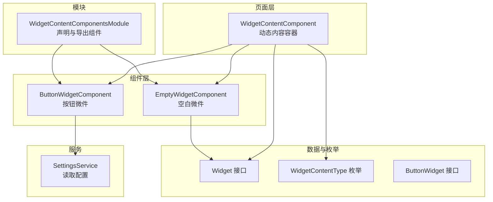
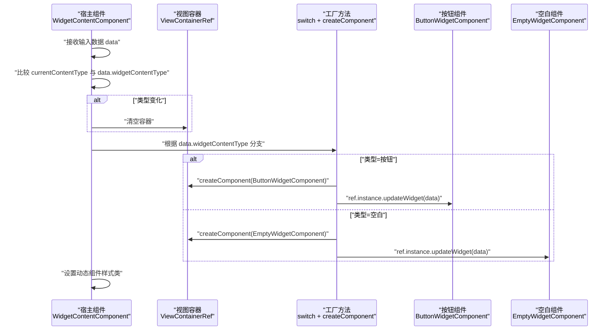
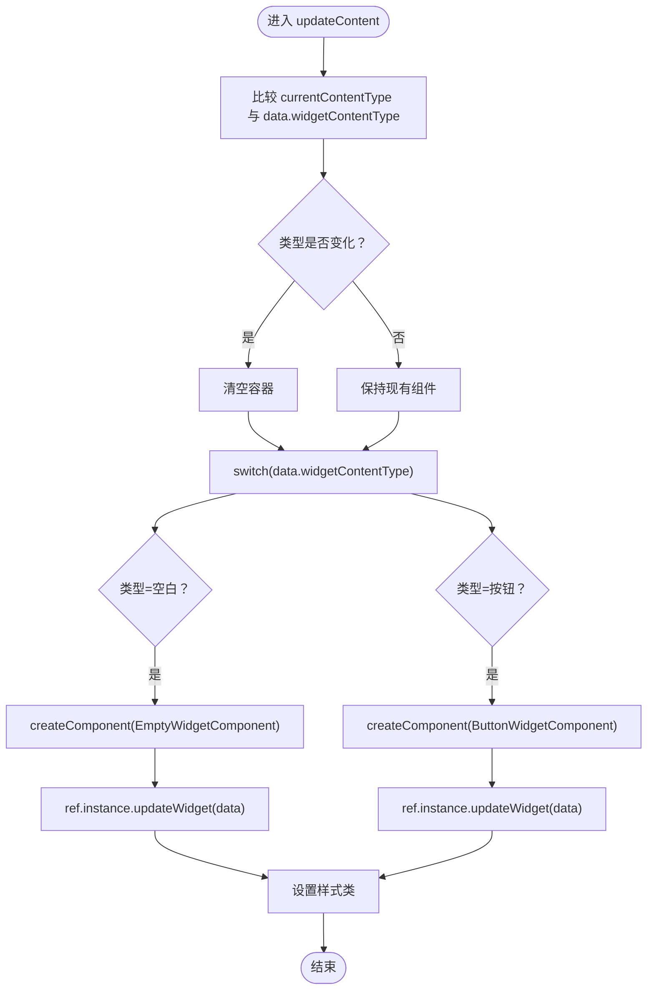
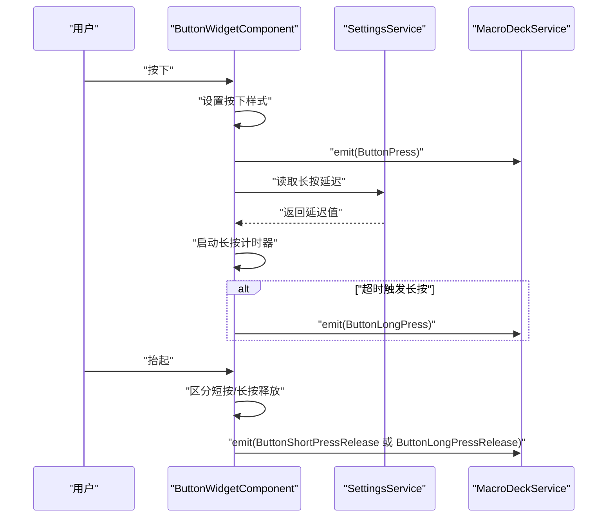
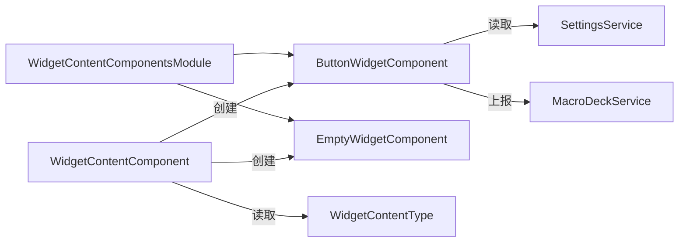

# 工厂模式

<cite>
**本文档引用的文件**
- [widget-content-components.module.ts](file://src/app/widget-content-components/widget-content-components.module.ts)
- [widget-content.component.ts](file://src/app/pages/deck/widget-grid/widget-content/widget-content.component.ts)
- [widget-content.component.html](file://src/app/pages/deck/widget-grid/widget-content/widget-content.component.html)
- [button-widget.component.ts](file://src/app/widget-content-components/button-widget/button-widget.component.ts)
- [button-widget.component.html](file://src/app/widget-content-components/button-widget/button-widget.component.html)
- [empty-widget.component.ts](file://src/app/widget-content-components/empty-widget/empty-widget.component.ts)
- [empty-widget.component.html](file://src/app/widget-content-components/empty-widget/empty-widget.component.html)
- [widget-content-type.ts](file://src/app/enums/widget-content-type.ts)
- [widget.ts](file://src/app/datatypes/widgets/widget.ts)
- [button-widget.ts](file://src/app/datatypes/widgets/button-widget.ts)
- [settings.service.ts](file://src/app/services/settings/settings.service.ts)
- [button-widget-border-style.ts](file://src/app/widget-content-components/button-widget/button-widget-border-style.ts)
</cite>

## 目录
1. [简介](#简介)
2. [项目结构](#项目结构)
3. [核心组件](#核心组件)
4. [架构总览](#架构总览)
5. [详细组件分析](#详细组件分析)
6. [依赖关系分析](#依赖关系分析)
7. [性能考量](#性能考量)
8. [故障排查指南](#故障排查指南)
9. [结论](#结论)
10. [附录](#附录)

## 简介
本文件围绕 Macro-Deck-Client-App 中“工厂模式”的实际应用展开，重点说明如何通过“组件工厂”在运行时根据数据类型动态创建并渲染不同类型的微件内容组件。文档聚焦以下要点：
- 在微件系统中，依据数据类型（WidgetContentType）选择并实例化相应组件（如 ButtonWidgetComponent、EmptyWidgetComponent），这体现了典型的“工厂方法”思想。
- WidgetContentComponents 模块负责声明与导出这些组件，形成可扩展的组件注册与管理机制。
- 通过 ViewContainerRef 和 createComponent 实现动态组件创建与更新，配合输入属性 data 的变化驱动工厂逻辑。

## 项目结构
本项目采用 Angular 结构，微件相关内容主要分布在以下路径：
- 页面层：微件内容容器组件位于页面网格子目录下，负责调度动态组件创建。
- 组件层：按钮微件与空白微件分别位于独立目录，提供各自模板与样式。
- 数据类型与枚举：定义微件数据结构与内容类型，用于工厂方法的分支判断。
- 服务层：设置服务提供配置项读取，影响组件渲染细节（例如按钮边框样式）。

图表来源
- [widget-content.component.ts:10-79](file://src/app/pages/deck/widget-grid/widget-content/widget-content.component.ts#L10-L79)
- [button-widget.component.ts:14-103](file://src/app/widget-content-components/button-widget/button-widget.component.ts#L14-L103)
- [empty-widget.component.ts:6-28](file://src/app/widget-content-components/empty-widget/empty-widget.component.ts#L6-L28)
- [widget-content-type.ts:1-12](file://src/app/enums/widget-content-type.ts#L1-L12)
- [widget.ts:4-20](file://src/app/datatypes/widgets/widget.ts#L4-L20)
- [button-widget.ts:3-9](file://src/app/datatypes/widgets/button-widget.ts#L3-L9)
- [widget-content-components.module.ts:7-21](file://src/app/widget-content-components/widget-content-components.module.ts#L7-L21)
- [settings.service.ts:22-46](file://src/app/services/settings/settings.service.ts#L22-L46)

章节来源
- [widget-content-components.module.ts:1-42](file://src/app/widget-content-components/widget-content-components.module.ts#L1-L42)
- [widget-content.component.ts:1-152](file://src/app/pages/deck/widget-grid/widget-content/widget-content.component.ts#L1-L152)
- [widget.ts:1-33](file://src/app/datatypes/widgets/widget.ts#L1-L33)
- [widget-content-type.ts:1-12](file://src/app/enums/widget-content-type.ts#L1-L12)

## 核心组件
- WidgetContentComponent：动态内容容器，依据输入数据的 widgetContentType 分支创建对应组件实例，并调用其 updateWidget 方法进行渲染。
- ButtonWidgetComponent：渲染按钮型微件，支持图标、前景标签、背景色与边框样式，处理短按、长按与释放事件。
- EmptyWidgetComponent：渲染空白型微件，仅根据背景色绘制占位区域。
- WidgetContentComponentsModule：声明并导出上述组件，形成组件注册与管理的基础模块。
- SettingsService：提供按钮边框样式等配置项读取，影响组件渲染细节。

章节来源
- [widget-content.component.ts:10-79](file://src/app/pages/deck/widget-grid/widget-content/widget-content.component.ts#L10-L79)
- [button-widget.component.ts:14-103](file://src/app/widget-content-components/button-widget/button-widget.component.ts#L14-L103)
- [empty-widget.component.ts:6-28](file://src/app/widget-content-components/empty-widget/empty-widget.component.ts#L6-L28)
- [widget-content-components.module.ts:7-21](file://src/app/widget-content-components/widget-content-components.module.ts#L7-L21)
- [settings.service.ts:22-46](file://src/app/services/settings/settings.service.ts#L22-L46)

## 架构总览
下图展示了从数据到组件实例化的整体流程，体现“工厂方法”的核心思想：根据数据类型选择并创建相应组件，再将数据注入组件完成渲染。

图表来源
- [widget-content.component.ts:45-79](file://src/app/pages/deck/widget-grid/widget-content/widget-content.component.ts#L45-L79)
- [button-widget.component.ts:88-103](file://src/app/widget-content-components/button-widget/button-widget.component.ts#L88-L103)
- [empty-widget.component.ts:26-28](file://src/app/widget-content-components/empty-widget/empty-widget.component.ts#L26-L28)

## 详细组件分析

### WidgetContentComponent（组件工厂）
- 职责：作为“工厂”，依据输入数据的 widgetContentType 判断并创建相应组件；当类型变化时重建组件，避免状态污染。
- 关键实现：
  - 输入属性 data 变化时触发 updateContent。
  - 使用 switch 对枚举值进行分支：遇到新类型则通过 createComponent 创建实例，并调用实例的 updateWidget(data) 注入数据。
  - 通过 ViewContainerRef.clear 清理旧组件，确保内存与状态回收。
  - 为动态组件设置统一样式类，保证布局一致性。
- 性能注意：componentCreated 标志避免重复创建相同类型组件；类型未变化时仅更新数据，减少实例化开销。

图表来源
- [widget-content.component.ts:45-79](file://src/app/pages/deck/widget-grid/widget-content/widget-content.component.ts#L45-L79)

章节来源
- [widget-content.component.ts:10-79](file://src/app/pages/deck/widget-grid/widget-content/widget-content.component.ts#L10-L79)
- [widget-content.component.html:1-2](file://src/app/pages/deck/widget-grid/widget-content/widget-content.component.html#L1-L2)

### ButtonWidgetComponent（按钮组件）
- 职责：渲染按钮型微件，处理用户交互（按下、抬起、长按），并将交互事件上报。
- 关键实现：
  - updateWidget(data)：解码 Base64 图标/标签，设置背景色与边框样式；边框颜色基于背景色调整明暗。
  - 长按逻辑：按下后启动计时器，超过阈值触发长按事件；抬起时区分短按与长按释放。
  - 事件上报：通过宏命令服务发出交互事件，携带当前微件与交互类型。
  - 样式控制：使用 NgStyle 与内联样式，结合设置服务决定边框样式。
- 与工厂的关系：由 WidgetContentComponent 作为工厂创建并注入数据，完成渲染与交互。

图表来源
- [button-widget.component.ts:131-184](file://src/app/widget-content-components/button-widget/button-widget.component.ts#L131-L184)
- [button-widget.component.ts:218-226](file://src/app/widget-content-components/button-widget/button-widget.component.ts#L218-L226)
- [settings.service.ts:177-190](file://src/app/services/settings/settings.service.ts#L177-L190)

章节来源
- [button-widget.component.ts:14-103](file://src/app/widget-content-components/button-widget/button-widget.component.ts#L14-L103)
- [button-widget.component.html:1-14](file://src/app/widget-content-components/button-widget/button-widget.component.html#L1-L14)
- [button-widget-border-style.ts:1-12](file://src/app/widget-content-components/button-widget/button-widget-border-style.ts#L1-L12)
- [settings.service.ts:177-190](file://src/app/services/settings/settings.service.ts#L177-L190)

### EmptyWidgetComponent（空白组件）
- 职责：渲染空白型微件，作为占位使用。
- 关键实现：
  - updateWidget(data)：仅根据背景色设置样式，不涉及复杂交互。
  - 与网格圆角一致的边框半径，保证视觉统一。

章节来源
- [empty-widget.component.ts:6-28](file://src/app/widget-content-components/empty-widget/empty-widget.component.ts#L6-L28)
- [empty-widget.component.html:1-4](file://src/app/widget-content-components/empty-widget/empty-widget.component.html#L1-L4)

### WidgetContentComponents 模块（组件注册与管理）
- 职责：集中声明与导出按钮与空白微件组件，形成可扩展的组件注册表。
- 关键实现：
  - 在 imports 中声明组件，使它们可在模板中直接使用。
  - 通过 exports 导出必要指令（如 NgStyle），便于子组件复用。
- 扩展性：新增微件类型时，只需在模块中声明并在工厂分支中加入对应分支即可。

章节来源
- [widget-content-components.module.ts:7-21](file://src/app/widget-content-components/widget-content-components.module.ts#L7-L21)

### 数据模型与类型（工厂方法的输入）
- Widget：描述微件位置、尺寸、背景色与内容类型，以及具体内容数据。
- WidgetContentType：枚举值决定工厂分支策略。
- ButtonWidget：按钮型微件的具体内容数据（图标与标签的 Base64 数据）。

章节来源
- [widget.ts:4-20](file://src/app/datatypes/widgets/widget.ts#L4-L20)
- [widget-content-type.ts:1-12](file://src/app/enums/widget-content-type.ts#L1-L12)
- [button-widget.ts:3-9](file://src/app/datatypes/widgets/button-widget.ts#L3-L9)

## 依赖关系分析
- WidgetContentComponent 依赖：
  - WidgetContentType：用于分支判断。
  - ButtonWidgetComponent、EmptyWidgetComponent：作为工厂产出的实例。
  - ViewContainerRef：动态创建与插入组件。
- ButtonWidgetComponent 依赖：
  - SettingsService：读取按钮边框样式与长按延迟。
  - MacroDeckService：上报交互事件。
- 模块依赖：
  - WidgetContentComponentsModule 声明并导出两个组件，供上层页面使用。

图表来源
- [widget-content.component.ts:45-79](file://src/app/pages/deck/widget-grid/widget-content/widget-content.component.ts#L45-L79)
- [button-widget.component.ts:49-53](file://src/app/widget-content-components/button-widget/button-widget.component.ts#L49-L53)
- [widget-content-components.module.ts:7-21](file://src/app/widget-content-components/widget-content-components.module.ts#L7-L21)

章节来源
- [widget-content.component.ts:1-152](file://src/app/pages/deck/widget-grid/widget-content/widget-content.component.ts#L1-L152)
- [button-widget.component.ts:1-393](file://src/app/widget-content-components/button-widget/button-widget.component.ts#L1-L393)
- [empty-widget.component.ts:1-57](file://src/app/widget-content-components/empty-widget/empty-widget.component.ts#L1-L57)
- [widget-content-components.module.ts:1-42](file://src/app/widget-content-components/widget-content-components.module.ts#L1-L42)

## 性能考量
- 避免重复创建：通过 componentCreated 标志与类型比较，仅在类型变化时重建组件，降低实例化成本。
- 清理旧实例：类型切换时调用容器清理，防止内存泄漏与状态残留。
- 最小化更新：类型未变化时仅调用 updateWidget，避免不必要的生命周期开销。
- 样式注入：统一设置样式类，减少模板复杂度与重绘次数。

## 故障排查指南
- 组件未渲染：
  - 检查输入数据 data 是否为空或类型字段缺失。
  - 确认工厂分支是否覆盖该类型，或模块是否正确声明组件。
- 样式异常：
  - 检查背景色 hex 值格式是否正确。
  - 确认 SettingsService 返回的边框样式是否符合预期。
- 交互无效：
  - 检查事件绑定与 emit 调用是否正确。
  - 确认长按延迟配置是否合理，避免误判。

章节来源
- [widget-content.component.ts:45-79](file://src/app/pages/deck/widget-grid/widget-content/widget-content.component.ts#L45-L79)
- [button-widget.component.ts:131-184](file://src/app/widget-content-components/button-widget/button-widget.component.ts#L131-L184)
- [settings.service.ts:177-190](file://src/app/services/settings/settings.service.ts#L177-L190)

## 结论
本项目以 WidgetContentComponent 为核心“工厂”，依据 WidgetContentType 枚举值在运行时动态创建并注入相应组件实例，实现了微件系统的高扩展性与低耦合。通过模块化注册与清晰的数据模型，新增微件类型仅需扩展枚举、模块声明与工厂分支，即可无缝接入动态 UI 生成流程。同时，合理的生命周期管理与性能优化策略保障了在复杂场景下的稳定性与响应速度。

## 附录
- 工厂模式在本项目中的应用总结：
  - 输入：Widget 数据（含 widgetContentType）。
  - 分支：switch 枚举值，映射到具体组件构造。
  - 输出：组件实例（ButtonWidgetComponent/EmptyWidgetComponent）及其渲染结果。
  - 扩展：新增类型只需在模块与工厂中增加对应分支，无需修改现有逻辑。